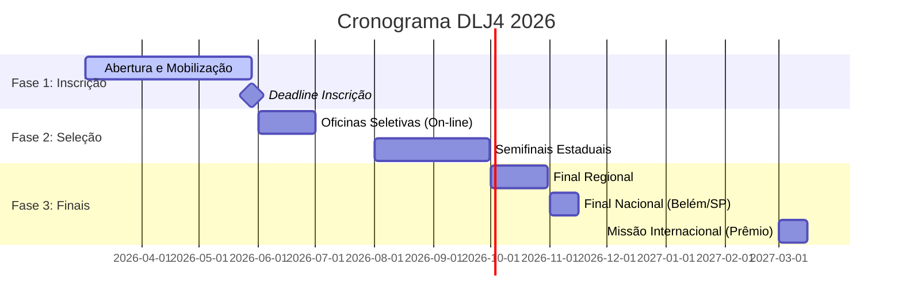
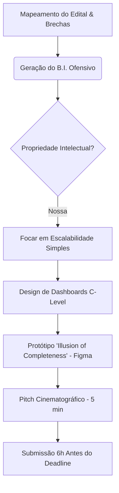

# 🎯 Desafio Liga Jovem (DLJ4) - Master OS & Index

> **🚨 STATUS GERAL:** 🟢 Planejamento (Fase de Inteligência / Sprint 0)
> **Data Atual:** `2026-03-30` | **Dias para a Entrega (Fase 1):** `⏳ 59 dias`

---

## 🦅 1. Visão Geral Estratégica (O "Caput")

| Parâmetro | Definição |
| :--- | :--- |
| **Tema Central** | Empreendedorismo de Impacto (Sebrae) |
| **A Dor/Problema** | Fomento à economia local e inovação social nas escolas. |
| **Nossa Proposição** | Solução de impacto escalável com "High-Tech / Low-Cost" e ROI social visível. |
| **Alavancagem Principal** | Pitch Cinematográfico, Figma Enterprise-grade e Sustentabilidade Financeira B2B2C. |

## 📊 2. Níveis de Confiança & Asset Tracking

Avaliação bruta da maturidade atual do projeto:

*   **Inteligência & B.I. (Dataset Ofensivo):** [🟩 Alta] _(Dossiê de vencedores passados e edital mapeados)_
*   **Design & Vibe-Ops (Figma/Frontend):** [🟥 Baixa] _(Aguardando definição do problema central)_
*   **Narrativa / Pitch Script:** [🟨 Média] _(Roteiro mestre definido, falta o storytelling específico)_
*   **Engenharia Subjacente:** [🟩 Alta] _(Stack Next.js/Supabase pronta para scaffolding acelerado)_

---

## 📋 3. Etapas Oficiais (DLJ4 2026)

| Etapa | Descrição | Status/Data |
| :--- | :--- | :--- |
| **01: Inscrições** | Cadastro de equipes (2-5 alunos + mentor) e Trilha Digital. | **Até 28/05/2026** |
| **02: Seletiva Regional** | Oficina On-line de Inovação (Filtro para a Semifinal). | Junho/Julho 2026 |
| **03: Semifinal Estadual** | Pitch ao vivo para banca de jurados (Híbrido/Presencial). | Agosto/Setembro 2026 |
| **04: Final Regional** | Disputa entre os melhores do estado por região geográfica. | Outubro 2026 |
| **05: Grande Final** | Evento Nacional presencial com premiação internacional. | Novembro 2026 |

## 📅 4. Timeline Estratégica (Cronograma Global)

---

## ⚙️ 5. Fluxologia do Processo (O Core Loop)

---

## 🗂️ 6. Indexação de Arquivos Locais (O "Cérebro")

*   📖 **[Regulamento Oficial](../00_Regulamento/Regulamento%20Desafio%20Liga%20Jovem%20-%204%C2%AA%20Edi%C3%A7%C3%A3o%20V1.pdf)**
*   🛡️ **[00: Master Strategy](./00_Master_Strategy.md)**
*   ⚖️ **[01: Market Leverage](../01_Intel_OSINT/01_Market_Leverage.md)**
*   📡 **[02: Aggressive BI](../04_BI_Ofensivo/02_Aggressive_BI_Intelligence.md)**
*   ⏳ **[03: Execution Timeline](../03_Arquitetura_Projeto/03_Execution_Timeline.md)**
*   ⚖️ **[04: Edital Deep Analysis](../00_Regulamento/04_Edital_Deep_Analysis.md)**
*   📑 **[Pesquisa Profunda de Vencedores](../01_Intel_OSINT/Liga_Jovem_Research.md)**

---

## ✅ 7. Checklist Tático & Entregáveis (Precisão Militar)

### Fase 1: Deep Context (Sprint 0-1)
- [x] Rodar análise de edital e brechas.
- [x] Mapear perfil de vencedores 2023-2025.
- [ ] Definir o "Wicked Problem" específico (Foco Abril).
- [ ] Recrutar/Definir o Professor Orientador Estratégico.

### Fase 2: Prototipação Visual (Sprint 2)
- [ ] Criar Brandboard Premium (Paleta Dark-Mode/Glassmorphism).
- [ ] Desenvolver Protótipo Navegável no Figma (Alta Fidelidade).
- [ ] Validar UX com pelo menos 5 usuários da persona alvo.

### Fase 3: Produção Cinematográfica (Sprint 3-4)
- [ ] Escrever Script do Pitch (The Hook -> The Pain -> The Solution -> The Impact).
- [ ] Gravar a "Demo da Ilusão" (Screen recording perfeito).
- [ ] Edição Final com Mograph e Áudio Agressivo.

---

## 🏛️ 8. Checkpoints de Compliance (Burocracia Critíca)

> [!WARNING]
> A inscrição do **DLJ4 (2026)** só é válida se estas 3 etapas aparecerem em VERDE no dashboard até **28/05/2026**.

| Pilar | Ação Necessária | Prazo |
| :--- | :--- | :--- |
| **Meus Dados** | Completar perfil, CPF e dados de contato. | **28/05** |
| **Instituição** | Vincular à mesma escola (deve ser a mesma para todos do time). | **28/05** |
| **Equipe** | Formar time de 2 a 5 alunos + 1 Professor Orientador. | **28/05** |

---
*Gerado por Antigravity AI - Status: EM SINCRONIA COM WORKFLOW DE ELITE*
