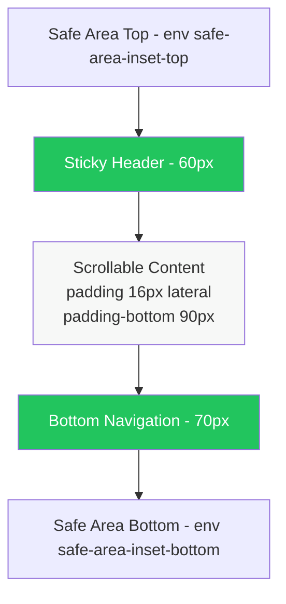

# PRD_01 — Parte A — Design System (Waste Guardian)

> **Status:** 🔄 Em construção
> **Last Updated:** 2026-06-03
> **Priority:** P0

---

## 1. Visão Geral

Este documento é a **fonte única de verdade** para o sistema de design do Waste Guardian (SPA mobile, Liga Jovem 4ª Edição). Ele define tokens, componentes, regras de acessibilidade e voz de marca de forma que qualquer implementação — Figma, HTML/CSS ou framework — produza um resultado **production-grade**, consistente e capaz de impressionar a banca avaliadora do DLJ4.

A meta visual é simples e exigente: o protótipo precisa parecer um produto real publicado por um time maduro, não um exercício de fim de semana. Toda decisão a seguir serve a esse padrão.

### 1.1 Estratégia de cor — Committed

A paleta segue o registro **Committed** do framework de design adotado pelo time: o verde de marca é o protagonista do produto, ocupando **30% a 50% da superfície visível** em telas-chave (Home/Dashboard, Splash, Empty States, CTAs primários). Não é um detalhe acessório — é a assinatura. O verde é o que o jurado deve lembrar 24 horas depois da apresentação.

Regras operacionais da estratégia Committed:

- **CTAs primários** sempre em verde sólido (`--color-primary`).
- **Cards de impacto** (peso evitado, CO₂, ranking) usam fundo `--color-primary-50` ou `--color-primary-100` para criar manchas de cor sem perder leitura.
- **Headers e elementos de hierarquia** podem usar verde como acento topográfico (faixas, ícones, indicadores).
- Cinza e branco existem para dar **respiro**, nunca para diluir a identidade.

### 1.2 Cena-âncora (Theme Scene)

> **"Famílias brasileiras usando o celular na cozinha, luz natural de dia, bancada, verificando o que está prestes a vencer — fresco, esperançoso, otimista."**

Toda decisão estética (cor, tipografia, motion, copy) deve ser testada contra essa cena. Se um elemento parece um software corporativo de auditoria fiscal, ele falha. Se parece um app de receita gourmet caro, também falha. O alvo é **utilitário caloroso**, próximo ao registro do iFood e do Nubank, com a recompensa cognitiva do Duolingo.

### 1.3 Referências-âncora

| Produto | O que extrair |
|---------|---------------|
| **Duolingo** | Gamificação suave, streak/badges, micro-recompensas, motion alegre porém contido |
| **Spotify** | Hierarquia tipográfica densa, listas verticais escaneáveis, cards de capa |
| **iFood** | Categorias visuais, scanner/busca como herói, header sticky com avatar |
| **Nubank** | Voz pt-BR informal-profissional, números grandes para impacto, espaço negativo generoso |

### 1.4 O que este documento NÃO cobre

- Telas específicas e fluxos navegacionais → ver **PRD_01 Parte B (Telas)**.
- Lógica de gamificação, pontos e economia → ver **PRD_02 (Canvas)**.
- Métricas ODS e cálculos de impacto → ver **PRD_04**.

---

## 2. Foundations

### 2.1 Paleta de Cores (OKLCH)

Todas as cores são especificadas em **OKLCH** (formato moderno, percepção uniforme de luminosidade) com fallback hexadecimal para ferramentas que ainda não suportam o formato. OKLCH garante que escalas de luminosidade pareçam realmente equidistantes ao olho humano — fundamental para evitar a "feiura" de paletas geradas mecanicamente.

#### 2.1.1 Primary Scale (Verde de marca)

| Token | OKLCH | Hex | Uso |
|-------|-------|-----|-----|
| `--color-primary` | `oklch(70% 0.18 145)` | `#22C55E` | CTAs, marca, ícones ativos |
| `--color-primary-dark` | `oklch(60% 0.17 145)` | `#16A34A` | Hover de CTA, ênfase forte |
| `--color-primary-light` | `oklch(80% 0.15 145)` | `#4ADE80` | Ilustrações, badges leves |
| `--color-primary-50` | `oklch(97% 0.03 145)` | `#F0FDF4` | Fundo de card de impacto |
| `--color-primary-100` | `oklch(94% 0.06 145)` | `#DCFCE7` | Fundo de seção destacada |
| `--color-primary-200` | `oklch(88% 0.10 145)` | `#BBF7D0` | Borda de cards primary |

#### 2.1.2 Surface Scale (Camadas de fundo)

| Token | OKLCH | Hex | Uso |
|-------|-------|-----|-----|
| `--color-surface` | `oklch(100% 0 0)` | `#FFFFFF` | Cards, modais, conteúdo principal |
| `--color-surface-elevated` | `oklch(99% 0.002 145)` | `#FCFDFC` | Cards em foco, hover sutil |
| `--color-surface-muted` | `oklch(97% 0.005 145)` | `#F7F8F7` | Background da página (body) |
| `--color-surface-overlay` | `oklch(20% 0.02 145 / 0.45)` | `rgba(28,38,30,0.45)` | Backdrop de modal/sheet |

#### 2.1.3 Ink Scale (Tipografia e ícones)

| Token | OKLCH | Hex | Uso |
|-------|-------|-----|-----|
| `--color-ink` | `oklch(20% 0.02 250)` | `#111827` | Títulos, body principal |
| `--color-ink-secondary` | `oklch(45% 0.02 250)` | `#6B7280` | Labels, metadados |
| `--color-ink-muted` | `oklch(65% 0.02 250)` | `#9CA3AF` | Placeholders, disabled |
| `--color-ink-on-primary` | `oklch(100% 0 0)` | `#FFFFFF` | Texto sobre verde primary |

#### 2.1.4 Border Scale

| Token | OKLCH | Hex | Uso |
|-------|-------|-----|-----|
| `--color-border` | `oklch(92% 0.005 250)` | `#E5E7EB` | Borda padrão de card/input |
| `--color-border-strong` | `oklch(82% 0.01 250)` | `#CBD5E1` | Divisores explícitos |
| `--color-border-focus` | `oklch(70% 0.18 145)` | `#22C55E` | Ring de foco (= primary) |

#### 2.1.5 Semantic Colors

Cada cor semântica vem em **trio** (`bg`, `fg`, `border`) para garantir contraste correto sem improvisação no momento da implementação.

| Token | OKLCH | Hex | Uso |
|-------|-------|-----|-----|
| `--color-success-bg` | `oklch(95% 0.05 150)` | `#D1FAE5` | Toast/alert de sucesso |
| `--color-success-fg` | `oklch(45% 0.14 150)` | `#047857` | Texto sobre success-bg |
| `--color-success-border` | `oklch(75% 0.14 150)` | `#34D399` | Borda de success |
| `--color-warning-bg` | `oklch(96% 0.06 85)` | `#FEF3C7` | Toast de aviso, "vence hoje" |
| `--color-warning-fg` | `oklch(50% 0.14 75)` | `#B45309` | Texto sobre warning-bg |
| `--color-warning-border` | `oklch(75% 0.16 75)` | `#F59E0B` | Borda de warning |
| `--color-danger-bg` | `oklch(95% 0.04 25)` | `#FEE2E2` | Toast de erro, vencido |
| `--color-danger-fg` | `oklch(50% 0.20 25)` | `#B91C1C` | Texto sobre danger-bg |
| `--color-danger-border` | `oklch(62% 0.22 25)` | `#EF4444` | Borda de danger |
| `--color-info-bg` | `oklch(95% 0.04 240)` | `#DBEAFE` | Toast informativo |
| `--color-info-fg` | `oklch(45% 0.16 250)` | `#1E40AF` | Texto sobre info-bg |
| `--color-info-border` | `oklch(65% 0.16 240)` | `#3B82F6` | Borda de info |

#### 2.1.6 Gamification Colors

Cores reservadas exclusivamente para badges, troféus, streak e ranking. **Nunca** usar fora de contexto de gamificação (evita poluição visual).

| Token | OKLCH | Hex | Uso |
|-------|-------|-----|-----|
| `--color-gold` | `oklch(82% 0.15 90)` | `#FACC15` | Badge nível 1, troféu, top 1 |
| `--color-gold-dark` | `oklch(70% 0.16 85)` | `#CA8A04` | Acento de gold, hover |
| `--color-bronze` | `oklch(58% 0.13 50)` | `#B45309` | Badge nível 3, top 10 |
| `--color-silver` | `oklch(78% 0.01 250)` | `#C0C5CC` | Badge nível 2, top 5 |
| `--color-streak` | `oklch(68% 0.20 35)` | `#F97316` | Chama de streak, fogo |

### 2.2 Tipografia (Inter)

A tipografia única do produto é **Inter** (Google Fonts), variável, otimizada para UI e altamente legível em telas pequenas. Fallbacks de sistema garantem que o app não quebre se a fonte falhar em carregar.

```css
--font-sans: 'Inter', -apple-system, BlinkMacSystemFont, 'Segoe UI', Roboto, sans-serif;
--font-mono: 'JetBrains Mono', 'SF Mono', Consolas, monospace; /* apenas para códigos/IDs */
```

#### 2.2.1 Type Scale (10 passos)

Escala desenhada para hierarquia clara em mobile, com o teto de **6rem (96px)** para títulos display — qualquer coisa acima vira distração e quebra em telas pequenas.

| Token | rem | px | Line-height | Uso típico |
|-------|-----|-----|-------------|-----------|
| `--text-xs` | `0.75rem` | 12px | 1.4 | Metadados, captions, badges |
| `--text-sm` | `0.875rem` | 14px | 1.45 | Labels, body denso, navegação |
| `--text-base` | `1rem` | 16px | 1.5 | Body padrão, descrições |
| `--text-lg` | `1.125rem` | 18px | 1.5 | Subtítulos, body destacado |
| `--text-xl` | `1.25rem` | 20px | 1.4 | H4, títulos de card |
| `--text-2xl` | `1.5rem` | 24px | 1.3 | H3, headers de sessão |
| `--text-3xl` | `1.875rem` | 30px | 1.25 | H2, métricas principais |
| `--text-4xl` | `2.25rem` | 36px | 1.2 | H1 de tela |
| `--text-display` | `3rem` | 48px | 1.1 | Splash, números heróicos |
| `--text-mega` | `6rem` | 96px | 1.0 | **Teto absoluto** — apenas Splash |

#### 2.2.2 Line-height tokens

| Token | Valor | Uso |
|-------|-------|-----|
| `--leading-tight` | `1.15` | Display, números grandes |
| `--leading-normal` | `1.45` | Body padrão, UI |
| `--leading-relaxed` | `1.65` | Prosa longa (descrições, modais) |

#### 2.2.3 Weight tokens

| Token | Valor | Uso |
|-------|-------|-----|
| `--weight-regular` | `400` | Body padrão |
| `--weight-medium` | `500` | Labels, ênfase leve |
| `--weight-semibold` | `600` | Subtítulos, CTAs |
| `--weight-bold` | `700` | Títulos, números |
| `--weight-extrabold` | `800` | Display, splash, marca |

#### 2.2.4 Letter-spacing tokens

| Token | Valor | Uso |
|-------|-------|-----|
| `--tracking-tight` | `-0.02em` | Display, títulos grandes (>24px) |
| `--tracking-normal` | `0` | Body, UI padrão |
| `--tracking-wide` | `0.05em` | Labels uppercase (uso restrito, ≤4 palavras) |

#### 2.2.5 Regras de tipografia

- **Comprimento de linha:** prosa entre **65 e 75 caracteres** (`max-width: 65ch`). Listas de dados podem ser mais densas.
- **Nunca** combinar `--text-mega` com `--weight-regular` — display sempre `--weight-bold` ou `--weight-extrabold`.
- Em mobile (375px), nada acima de `--text-display` (48px) exceto na Splash.
- `font-feature-settings: 'cv11', 'ss01', 'tnum'` para números tabulares em métricas (alinhamento de dígitos em rankings).

### 2.3 Espaçamento (Base 4px)

Sistema de 13 passos baseado em **4px**. A escala é geométrica nos extremos e linear no meio — o miolo (4–24px) cobre 80% dos casos de UI, e os passos grandes existem para hero sections e layouts amplos.

| Token | rem | px | Uso típico |
|-------|-----|-----|-----------|
| `--space-0` | `0` | 0 | Reset |
| `--space-1` | `0.25rem` | 4px | Gap mínimo entre ícone e texto |
| `--space-2` | `0.5rem` | 8px | Gap entre tags, padding de badge |
| `--space-3` | `0.75rem` | 12px | Padding interno de input compacto |
| `--space-4` | `1rem` | 16px | **Padding padrão de card e tela** |
| `--space-5` | `1.25rem` | 20px | Gap entre cards adjacentes |
| `--space-6` | `1.5rem` | 24px | Margem entre seções |
| `--space-8` | `2rem` | 32px | Margem grande entre blocos |
| `--space-10` | `2.5rem` | 40px | Header → primeiro conteúdo |
| `--space-12` | `3rem` | 48px | Empty state, splash padding |
| `--space-16` | `4rem` | 64px | Hero vertical |
| `--space-20` | `5rem` | 80px | Reservado a layouts desktop |
| `--space-24` | `6rem` | 96px | Reservado a layouts desktop |

**Regra:** sempre escolher do token. Nunca usar valores soltos como `padding: 13px` ou `margin: 22px`.

### 2.4 Border Radius

Cantos arredondados consistentes que reforçam a "calidez" do registro Committed sem cair em pílulas infantis.

| Token | Valor | Uso |
|-------|-------|-----|
| `--radius-sm` | `6px` | Inputs, tags pequenas |
| `--radius-md` | `10px` | Botões padrão, badges |
| `--radius-lg` | `14px` | **Cards padrão** |
| `--radius-xl` | `20px` | Modais, bottom sheets |
| `--radius-2xl` | `28px` | FAB, hero cards (uso raro) |
| `--radius-full` | `9999px` | Pills, avatars, chips de filtro |

**Regras:**

- **Cards nunca passam de 16px** de raio. Acima disso, o componente perde âncora visual e parece um "blob".
- `--radius-full` é exclusivo de **tags, avatars e chips** — nunca em botões grandes ou cards.
- FAB (Floating Action Button) usa `--radius-2xl` ou `--radius-full` conforme tamanho (≥56px → full).

### 2.5 Shadows (3 níveis efetivos)

Sombras com alpha em OKLCH preto (`oklch(0% 0 0 / X)`), garantindo neutralidade cromática. A regra do produto restringe a **três níveis efetivos de elevação**, mais um nível especial para FAB.

| Token | Valor | Uso |
|-------|-------|-----|
| `--shadow-sm` | `0 1px 2px oklch(0% 0 0 / 0.05)` | Inputs, cards inertes |
| `--shadow-md` | `0 4px 12px oklch(0% 0 0 / 0.08)` | **Cards padrão**, dropdowns |
| `--shadow-lg` | `0 10px 25px oklch(0% 0 0 / 0.10)` | Modais, bottom sheets |
| `--shadow-xl` | `0 20px 40px oklch(0% 0 0 / 0.15)` | FAB, popovers críticos |

**Regra anti-defeito (codex):** **nunca combinar borda visível de 1px com sombra grande** no mesmo elemento. Escolha um caminho: ou o card tem borda fina (`--color-border` + `--shadow-sm`), ou tem sombra média e zero borda (`--shadow-md`, sem borda). A combinação produz a aparência típica de UI gerada por IA.

### 2.6 Motion

#### 2.6.1 Durations

| Token | Valor | Uso |
|-------|-------|-----|
| `--duration-instant` | `50ms` | Mudança de cor em hover de elemento pequeno |
| `--duration-fast` | `150ms` | Botões, toggle, micro-feedback |
| `--duration-normal` | `250ms` | **Padrão** — cards, modais |
| `--duration-slow` | `400ms` | Bottom sheet, transições maiores |
| `--duration-page` | `350ms` | Troca de tela completa |

#### 2.6.2 Easings

```css
--ease-out:    cubic-bezier(0.16, 1, 0.3, 1);   /* padrão para entradas */
--ease-spring: cubic-bezier(0.34, 1.56, 0.64, 1); /* leve overshoot, só para recompensas */
--ease-in-out: cubic-bezier(0.4, 0, 0.2, 1);    /* loops e transições contínuas */
```

#### 2.6.3 Regras de motion

- **Default é `ease-out`** com curva exponencial. Nada de `linear` (parece robótico) e nada de `bounce`/`elastic` exagerado (parece infantil).
- `--ease-spring` é reservado a **momentos de recompensa** (badge desbloqueado, streak atingido, pontuação subindo). No máximo **1 vez por tela**.
- **Stagger:** quando múltiplos itens entram em sequência (lista, grid), delay de **50ms entre itens, máximo de 5 itens animados**. A partir do 6º, todos aparecem juntos para não cansar o usuário.
- **Transformações permitidas:** `opacity`, `transform` (translate, scale). Evitar animar `width`, `height`, `top`, `left` (custo de paint).

#### 2.6.4 prefers-reduced-motion (obrigatório)

```css
@media (prefers-reduced-motion: reduce) {
  *, *::before, *::after {
    animation-duration: 0ms !important;
    animation-iteration-count: 1 !important;
    transition-duration: 0ms !important;
    scroll-behavior: auto !important;
  }
}
```

Sem exceções. Toda animação cai para 0ms quando o usuário pede.

---

## 3. Layout System

### 3.1 Princípios

- **Mobile-first**, base de design **375px** (iPhone 13 Pro, idêntico ao protótipo Figma).
- **Container máximo: 428px** (iPhone 14 Pro Max). Acima disso, o conteúdo centraliza e o fundo da página aparece nas laterais — o produto **não** se "espreguiça" como desktop neste MVP.
- Padding lateral da tela: `var(--space-4)` (16px).
- Padding inferior reservado ao bottom nav: `calc(70px + env(safe-area-inset-bottom))`.

### 3.2 Grid e gap

- **Grid mobile:** 4 colunas, `gap: var(--space-4)`.
- Token: `--grid-gap: var(--space-4);` e `--grid-columns: 4;`.
- Cards de métrica usam 2 colunas (50% cada), cards heroicos usam 4 colunas (100%).

### 3.3 Diagrama estrutural da página



### 3.4 Especificações fixas

| Elemento | Altura | Comportamento |
|----------|--------|---------------|
| **Sticky Header** | 60px | `position: sticky; top: 0; z-index: 50;` + `backdrop-filter: blur(8px)` opcional |
| **Bottom Navigation** | 70px + safe area | `position: fixed; bottom: 0; z-index: 50;` |
| **FAB** | 56×56px | `position: fixed; bottom: 90px; right: 16px; z-index: 40;` |
| **Modal/Sheet** | até 90% viewport | Slide-up desde bottom, backdrop com `--color-surface-overlay` |

### 3.5 Touch targets (Apple HIG)

- **Mínimo absoluto: 44×44px** para qualquer elemento clicável.
- Botões de texto pequeno precisam de `padding` suficiente para atingir 44px de altura (mesmo que o texto pareça menor).
- Em listas densas (ranking), o **item inteiro** (linha) é a área clicável, não só o nome.

### 3.6 Safe areas

```css
.app-shell {
  padding-top: env(safe-area-inset-top);
  padding-bottom: env(safe-area-inset-bottom);
  padding-left: env(safe-area-inset-left);
  padding-right: env(safe-area-inset-right);
}
```

Notch e home indicator do iPhone são respeitados desde o primeiro frame.

---

## 4. Component Library

Cada componente é documentado com: **estrutura visual**, **variantes**, **estados**, **espaçamento**, **tipografia** e **quando usar/quando NÃO usar**.

### 4.1 Button

Componente mais utilizado do produto. Cinco variantes cobrem todos os contextos.

**Estrutura:** ícone opcional (à esquerda) + label + ícone opcional (à direita).

| Variante | Background | Texto | Borda | Uso |
|----------|-----------|-------|-------|-----|
| `primary` | `--color-primary` | `--color-ink-on-primary` | nenhuma | CTA único e dominante por tela |
| `secondary` | `--color-surface` | `--color-primary` | `1px --color-primary` | Ação secundária próxima ao primary |
| `ghost` | transparente | `--color-ink` | nenhuma | Ações terciárias, "Cancelar" |
| `danger` | `--color-danger-border` | `--color-ink-on-primary` | nenhuma | Excluir, desfazer doação |
| `fab` | `--color-primary` | `--color-ink-on-primary` | nenhuma | Scanner — uma única instância por tela |

**Estados (7 obrigatórios):**

| Estado | Comportamento |
|--------|---------------|
| `default` | Conforme variante acima |
| `hover` | Brightness +5% ou bg → `--color-primary-dark` |
| `focus` | Ring 2px `--color-border-focus` com offset 2px |
| `active` | `transform: scale(0.97)` por 100ms |
| `disabled` | `opacity: 0.4; cursor: not-allowed;` — sem hover |
| `loading` | Spinner inline 16px substitui o label, botão mantém largura |
| `error` | Shake horizontal 6px (300ms) + bg temporário `--color-danger-bg` |

**Espaçamento e tipografia:**

| Tamanho | Padding | Altura | Tipografia |
|---------|---------|--------|-----------|
| sm | `--space-2` / `--space-3` | 36px | `--text-sm`, `--weight-semibold` |
| md (default) | `--space-3` / `--space-4` | 48px | `--text-base`, `--weight-semibold` |
| lg | `--space-4` / `--space-6` | 56px | `--text-lg`, `--weight-semibold` |
| fab | — | 56×56px (círculo) | ícone 28px |

**Quando NÃO usar:**

- Não use `primary` mais de uma vez por tela (perde hierarquia).
- Não use `danger` para ações reversíveis triviais.
- Não troque `ghost` por link — links são para navegação, ghost é ação.

### 4.2 Card

Container fundamental. Três variantes; toda lista da Home, Impacto e Doação é montada com cards.

| Variante | Background | Borda | Sombra | Uso |
|----------|-----------|-------|--------|-----|
| `default` | `--color-surface` | `1px --color-border` | nenhuma | Lista neutra (ranking, transações) |
| `elevated` | `--color-surface` | nenhuma | `--shadow-md` | Cards de destaque, dashboard |
| `highlight` | `--color-primary-50` | `1px --color-primary-200` | nenhuma | Card de impacto principal, conquistas |

**Estrutura padrão:**

```
┌──────────────────────────────┐
│ [Ícone opt]  Título           │  ← header (--text-lg, --weight-semibold)
│              Subtítulo        │  ← --text-sm, --color-ink-secondary
├──────────────────────────────┤
│ Conteúdo principal           │  ← --space-4 padding lateral
│ (texto, métrica, lista...)   │
├──────────────────────────────┤
│ [Ação primária] [Ação 2]     │  ← footer opcional
└──────────────────────────────┘
```

- Padding interno: `--space-4` (16px) em todas as direções.
- Border radius: `--radius-lg` (14px). **Nunca passar de 16px.**
- Gap entre cards verticais: `--space-3` (12px).

**Quando NÃO usar:**

- Não empilhe 6+ cards `elevated` na mesma tela — vira ruído. Misture `default` e `highlight`.
- Não use `highlight` para conteúdo neutro só "porque fica bonito".

### 4.3 Badge / Tag

Pequenos rótulos para status (vence amanhã, novo, doado).

| Variante | bg / fg / border | Uso |
|----------|------------------|-----|
| `success` | `--color-success-bg` / `--color-success-fg` / `--color-success-border` | Concluído, fresco |
| `warning` | `--color-warning-bg` / `--color-warning-fg` / `--color-warning-border` | Vence hoje/amanhã |
| `danger` | `--color-danger-bg` / `--color-danger-fg` / `--color-danger-border` | Vencido, expirou |
| `neutral` | `--color-surface-muted` / `--color-ink-secondary` / `--color-border` | Categoria, marcador |

**Especificações:**

- Shape: `--radius-full` (pill).
- Padding: `--space-1` vertical, `--space-2` horizontal.
- Tipografia: `--text-xs`, `--weight-medium`, `--tracking-wide` opcional.
- Altura: ~22px (não conta como touch target, sempre acompanhado de outro elemento clicável).

### 4.4 Input (texto)

Campo de texto base para nome, peso de alimento, descrição.

**Estrutura:**

```
Label (--text-sm, --weight-medium, --color-ink-secondary)
┌──────────────────────────────┐
│ [valor digitado]              │  ← --text-base, --color-ink
└──────────────────────────────┘
Helper / Error (--text-xs)
```

**Estados:**

| Estado | Borda | Background |
|--------|-------|-----------|
| `default` | `1px --color-border` | `--color-surface` |
| `focus` | `2px --color-border-focus` + ring offset 2px | `--color-surface` |
| `error` | `1px --color-danger-border` + helper text vermelho | `--color-surface` |
| `disabled` | `1px --color-border` | `--color-surface-muted`, opacity 0.6 |

- Padding interno: `--space-3` vertical, `--space-4` horizontal.
- Altura: 48px (atinge touch target).
- Border radius: `--radius-md` (10px).

### 4.5 Search Input

Variante do Input com **ícone de busca à esquerda** (`icon-search`, 20px, `--color-ink-secondary`).

- Padding-left: `--space-10` (40px) para acomodar o ícone.
- Placeholder: `"Buscar receita ou ingrediente"` (verbo + objeto, nunca "Pesquisar...").
- Botão "limpar" (X) aparece à direita quando há texto, 24×24px clicável.

### 4.6 Bottom Navigation

Navegação principal do app. **Fixo no rodapé**, sempre visível exceto em modais.

**Estrutura:** 4 itens (Home, Impacto, Doar, Perfil), distribuídos com `justify-content: space-around`.

- Altura: 70px + `env(safe-area-inset-bottom)`.
- Background: `--color-surface`, borda superior `1px --color-border`.
- Cada item: ícone 24px + label `--text-xs --weight-medium`.

**Estado ativo:**

- Ícone e label em `--color-primary`.
- **Dot indicator** abaixo do label: círculo 4px `--color-primary`, `--space-1` de margin-top.
- Transição: `--duration-fast` `--ease-out`.

**Estado inativo:** ícone e label em `--color-ink-secondary`.

### 4.7 Header / Top Bar

Header sticky com 3 zonas: **esquerda (back/menu)**, **centro (título)**, **direita (avatar/ações)**.

| Zona | Conteúdo |
|------|----------|
| Esquerda | Ícone back (24px) OU logo (32px) — 44×44 área clicável |
| Centro | Título da tela, `--text-lg`, `--weight-semibold`, truncado se necessário |
| Direita | Avatar 32px OU ícone de ação (notificação, settings) |

- Altura: 60px.
- Background: `--color-surface` com `backdrop-filter: blur(8px)` quando há scroll abaixo.
- Borda inferior: `1px --color-border` (aparece apenas após scroll > 4px).

### 4.8 Avatar

Imagem de perfil circular com fallback de iniciais.

**Tamanhos:** 24px (lista densa), 32px (header), 40px (perfil de ranking), 80px (tela Perfil).

- Border radius: `--radius-full`.
- Fallback: fundo `--color-primary-100`, iniciais em `--color-primary-dark`, `--weight-semibold`.
- Borda opcional: `2px --color-surface` para destacar contra background colorido.

### 4.9 Stat Card

Card especializado para **número + unidade + label** (kg evitados, CO₂, posição no ranking).

**Estrutura:**

```
┌──────────────────────┐
│ [ícone opt 20px]      │
│                       │
│  2.3                  │  ← --text-3xl, --weight-bold, --color-ink
│  kg                   │  ← --text-sm, --color-ink-secondary, inline
│                       │
│  evitados na semana   │  ← --text-sm, --color-ink-secondary
└──────────────────────┘
```

- Variante de Card `elevated` ou `highlight`.
- Padding: `--space-4`.
- `font-feature-settings: 'tnum'` ativo para alinhamento de dígitos.
- **Variação obrigatória:** se houver 3+ stat cards na mesma tela, varie tamanho/cor/ícone — **proibido** grid 2×2 idêntico de stat cards (cai no anti-padrão "hero metric template").

### 4.10 Progress Bar

Barra horizontal de progresso (preenchimento de meta semanal, XP até próximo badge).

**Estrutura:**

- Trilho: altura 8px, background `--color-border`, `--radius-full`.
- Preenchimento: `--color-primary`, `--radius-full`, transição `--duration-normal --ease-out`.
- Label opcional acima: `"2.3 / 5.0 kg"` em `--text-sm`, `--weight-medium`.
- Percentual opcional à direita: `"46%"` em `--text-sm`, `--color-ink-secondary`.

### 4.11 List Item / Row

Item de lista usado em ranking, transações, alimentos.

**Estrutura:**

```
┌────────────────────────────────────┐
│ [Avatar/Ícone] Título principal     │
│                Subtítulo/meta       │
│                              [Meta] │
└────────────────────────────────────┘
```

- Altura mínima: 64px (atinge touch target generoso).
- Padding vertical: `--space-3`, padding lateral: `--space-4`.
- Divisor entre itens: `1px --color-border` (não em containers já com borda externa).
- Estado hover/active: background `--color-surface-muted`.
- Toda a linha é clicável — não apenas o texto.

### 4.12 Modal / Bottom Sheet

Painel deslizante de baixo para cima, ocupando até 90% da viewport.

**Especificações:**

- Backdrop: `--color-surface-overlay` com `backdrop-filter: blur(4px)`.
- Container: `--color-surface`, `border-radius: --radius-xl --radius-xl 0 0` (apenas topo).
- Handle drag indicator no topo: barra 36×4px, `--color-border-strong`, `--radius-full`, centralizada com `--space-2` de margin.
- Padding interno: `--space-6` (24px).
- Animação entrada: `transform: translateY(100%) → translateY(0)`, `--duration-slow --ease-out`.
- Fechamento: tap no backdrop, drag down >100px, ou botão "Fechar" no header do sheet.
- **`aria-modal="true"`** + **focus trap** obrigatórios.

### 4.13 Toast / Snackbar

Feedback efêmero não-bloqueante.

**Posição:** top, 16px abaixo do header (não cobre o conteúdo principal).

| Variante | Cor |
|----------|-----|
| `success` | bg `--color-success-bg`, fg `--color-success-fg` |
| `warning` | bg `--color-warning-bg`, fg `--color-warning-fg` |
| `danger` | bg `--color-danger-bg`, fg `--color-danger-fg` |
| `info` | bg `--color-info-bg`, fg `--color-info-fg` |

- Largura: 90% da tela, `max-width: 400px`, centralizado horizontalmente.
- Padding: `--space-3` / `--space-4`.
- Border radius: `--radius-md`.
- Duração padrão: **4s**, com opção de "Desfazer" estendendo para 6s.
- Entrada: `translateY(-20px) opacity 0 → translateY(0) opacity 1`, `--duration-normal --ease-out`.
- Acessibilidade: `role="status" aria-live="polite"` (ou `aria-live="assertive"` para danger).

### 4.14 Empty State

Estado vazio significativo (sem alimentos cadastrados, sem doações recebidas).

**Estrutura:**

```
        [ Ilustração 120×120 ]
        Headline curta
        Subtítulo explicativo (1 linha)
        [ CTA primário ]
```

- Ilustração: SVG simples, monocromática em `--color-primary` (não usar ilustrações "hand-drawn" — banido).
- Headline: `--text-xl`, `--weight-semibold`, `--color-ink`.
- Subtítulo: `--text-base`, `--color-ink-secondary`, máximo 2 linhas.
- CTA: botão `primary`, label verbo+objeto ("Adicionar alimento", "Ver doações próximas").
- Container vertical centralizado, padding `--space-12`.

### 4.15 Skeleton

Placeholder de loading para listas e cards.

- Background base: `--color-surface-muted`.
- Animação shimmer: gradiente linear deslizando esquerda → direita, `--duration-slow --ease-in-out`, infinito.
- Quando `prefers-reduced-motion`: sem shimmer, apenas o background estático.
- Formas: respeitar a geometria do componente final (card → retângulo arredondado, avatar → círculo).
- Tempo máximo na tela: **2s**. Após isso, ou aparece conteúdo, ou aparece empty state com mensagem ("Não foi possível carregar").

### 4.16 Icon

- **Library:** [Lucide](https://lucide.dev) — clean, consistente, open-source, tree-shakeable.
- **Stroke weight:** `1.5px` em todos os ícones.
- **Tamanho padrão:** 24px.
- **Tamanho grande:** 32px (apenas em FAB, header, estados vazios).
- **Tamanho pequeno:** 16px (inline com texto, dentro de badges).
- **Naming semântico:** `icon-scan`, `icon-leaf`, `icon-trophy`, `icon-bell` — **nunca** `icon-1` ou `icon-green`.

Ver seção 5 para regras completas.

---

## 5. Iconography

### 5.1 Biblioteca oficial: Lucide

Toda iconografia do produto vem do [Lucide Icon Set](https://lucide.dev). Razões:

- Estilo consistente (1.5px stroke, cantos arredondados).
- 1500+ ícones cobrindo todo o domínio (alimentos, mapas, gamificação, métricas).
- SVG otimizado, sem dependência runtime obrigatória.
- Licença ISC, segura para uso comercial e em apresentação de competição.

### 5.2 Regras de uso

| Regra | Detalhe |
|-------|---------|
| Stroke weight | `stroke-width: 1.5` — nunca alterar |
| Tamanho default | `width: 24px; height: 24px;` |
| Cor | Herda de `currentColor` para combinar com texto |
| Naming | `icon-scan`, `icon-leaf`, `icon-trophy`, `icon-flame` (kebab-case, semântico) |
| Acessibilidade | Ícone decorativo: `aria-hidden="true"`. Ícone com função: `aria-label="Escanear alimento"` |

### 5.3 Mapeamento dos emojis atuais → Lucide

A SPA atual usa emojis (🌿📊🔥👤). **Em produção, substituir por ícones Lucide** para garantir consistência cross-platform:

| Emoji atual | Lucide proposto | Onde aparece |
|-------------|-----------------|--------------|
| 🌿 | `leaf` | Card de impacto |
| 📊 | `bar-chart-3` | Bottom nav "Impacto" |
| 🔥 | `flame` | Streak |
| 👤 | `user` | Avatar fallback, perfil |
| 🏆 | `trophy` | Ranking, conquistas |
| 🎁 | `gift` | Bottom nav "Doar" |
| 🏠 | `home` | Bottom nav "Home" |
| 📷 | `camera` ou `scan-line` | Scanner |
| 📍 | `map-pin` | Localização de doação |

### 5.4 Exceção controlada: emojis de categoria de alimento

Emojis de **categoria de alimento** são permitidos exclusivamente para reconhecimento visual rápido em listas e cards (familiaridade cultural pt-BR no domínio de cozinha):

- 🍶 (laticínios), 🍌 (frutas), 🍞 (pães), 🥬 (verduras), 🍅 (legumes), 🥩 (carnes), 🥚 (ovos), 🍚 (grãos).

**Nunca** em navegação, ações, botões, headers ou estados de sistema. Toda navegação e ação usa Lucide.

---

## 6. Accessibility (WCAG AA)

O produto deve passar em uma auditoria WCAG 2.1 nível AA. As regras a seguir são mínimo, não meta.

### 6.1 Contraste

| Tipo de texto | Razão mínima | Exemplo no produto |
|---------------|--------------|-------------------|
| Body text (≤17px) | **4.5:1** | `--color-ink` sobre `--color-surface` = 16.1:1 ✅ |
| Large text (≥18px ou ≥14px bold) | **3:1** | `--color-ink-secondary` sobre `--color-surface` ≈ 5.2:1 ✅ |
| Componente UI (borda, ícone funcional) | **3:1** | `--color-border-strong` sobre `--color-surface` ≈ 3.4:1 ✅ |
| Texto sobre `--color-primary` | **4.5:1** | `--color-ink-on-primary` (branco) sobre verde = 4.7:1 ✅ |

**Tools de validação:** axe DevTools, Lighthouse, Stark (Figma plugin).

### 6.2 Navegação por teclado

- Toda interação acessível por **Tab / Shift+Tab / Enter / Espaço / Esc**.
- Ordem de tab segue a leitura visual (top → bottom, left → right).
- Focus visível: **ring 2px `--color-border-focus` com offset 2px**, nunca remover `:focus-visible`.
- Bottom sheet e modal implementam **focus trap** (foco circula dentro do componente até fechar).

### 6.3 ARIA

| Componente | Atributo obrigatório |
|------------|---------------------|
| Botão só com ícone | `aria-label="ação descritiva"` |
| Modal | `role="dialog" aria-modal="true" aria-labelledby="..."` |
| Toast | `role="status" aria-live="polite"` (info/success) ou `aria-live="assertive"` (danger) |
| Bottom nav | `<nav aria-label="Navegação principal">`, item ativo `aria-current="page"` |
| Progress bar | `role="progressbar" aria-valuenow aria-valuemin aria-valuemax` |
| Loading / skeleton | `aria-busy="true"` no container |

### 6.4 Skip link

Primeiro elemento focável da página é um **skip-to-content** invisível até receber foco:

```html
<a href="#main" class="skip-link">Pular para o conteúdo</a>
```

Estilo: posicionado fora da tela por padrão, aparece com `top: --space-4` ao receber foco, fundo `--color-primary`, texto branco.

### 6.5 Touch targets

- **Mínimo 44×44px** para qualquer elemento clicável (Apple HIG / WCAG 2.5.5 AAA recomendado).
- Em listas densas, expandir hit area via `padding` ou `::before` invisível.

### 6.6 Movimento e luz

- `prefers-reduced-motion: reduce` cancela toda animação (ver seção 2.6.4).
- Sem flashes > 3 vezes por segundo (proteção contra fotossensibilidade).
- Splash screen não pisca, apenas fade-in suave.

---

## 7. Brand Voice & Copywriting

### 7.1 Registro

**Português brasileiro, informal-profissional.** Próximo do Nubank: trata o usuário com respeito, sem ser corporativo; com proximidade, sem ser infantil.

### 7.2 Regras práticas

| Faça | Não faça |
|------|----------|
| **Verbo + objeto** em CTAs: "Ver receitas", "Adicionar alimento", "Doar agora" | "OK", "Continuar", "Submeter" |
| **Quantifique** sempre: "Você evitou 2.3kg esta semana" | "Você evitou bastante coisa" |
| **Específico** > abstrato: "3 itens vencem amanhã" | "Você tem itens próximos do vencimento" |
| **Pessoas reais:** "Maria recebeu sua doação" | "Beneficiário confirmou recepção" |
| **Tom:** confiante, calmo, encorajador | Alarmista, gritado, paternalista |

### 7.3 Palavras banidas

- "transformar", "revolucionar", "empoderar" — buzzwords genéricas de startup.
- "Salve o planeta!", "Faça a diferença!" — copy aforística de ONG genérica.
- "Apenas", "simplesmente", "incrível", "impressionante" — esvaziadores.
- "Não é só X, é Y", "X de verdade" — padrão banido (ver seção 8).

### 7.4 Pontuação

- **Evite em-dashes (—) no corpo.** Use vírgulas, dois-pontos ou ponto final.
- Em-dash permitido apenas em **documentação** (este PRD), não em UI do produto.
- Reticências (`...`) apenas como indicador de loading ("Carregando..."), nunca como pausa estilística.

### 7.5 Capitalização

- **Sentence case** em títulos: "Suas conquistas", não "Suas Conquistas".
- **Title Case** apenas em nomes de marca: "Waste Guardian".
- **ALL CAPS** restrito a labels curtos (≤4 palavras), com `--tracking-wide`. Nunca em body.

### 7.6 Microcopy de exemplo

| Contexto | Copy correta | Copy errada |
|----------|--------------|-------------|
| Onboarding | "Aponte a câmera para a embalagem" | "Pronto para revolucionar sua cozinha?" |
| Card de impacto | "Você evitou 2.3kg de desperdício esta semana" | "Você está fazendo a diferença!" |
| Empty state | "Nenhum alimento cadastrado. Comece pelo scanner." | "Ops! Parece que está vazio por aqui..." |
| Erro | "Não consegui ler a embalagem. Tente novamente." | "Erro inesperado. Código 0x4F." |
| Sucesso | "Doação registrada. +50 pontos." | "Yay! Obrigado por doar!" |

---

## 8. Banned Patterns (AI Slop Check)

Padrões proibidos no produto. A presença de **qualquer um** destes em uma tela é causa de rejeição em revisão de design.

| # | Padrão banido | Por quê |
|---|---------------|---------|
| 1 | **Side-stripe borders** (faixa colorida >1px nas laterais de card) | Decoração vazia, padrão clichê de UI gerada por IA |
| 2 | **Gradient text** (`background-clip: text` com gradiente) | Reduz contraste, falha em acessibilidade, parece "fancy demo" |
| 3 | **Glassmorphism como padrão** | Cansativo, ilegível sobre fundo dinâmico; permitido apenas em backdrop de modal |
| 4 | **Hero-metric template** (número gigante + label pequeno + acento gradiente, repetido) | Cai em monotonia visual; stat cards devem variar |
| 5 | **Grids idênticos de cards** (2×2, 3×3 todos iguais) | Telas sem hierarquia; alternar tamanhos e variantes |
| 6 | **Uppercase tracked eyebrow** acima de cada seção | Padrão landing page genérico, exagerado em mobile |
| 7 | **Numbered section markers** (01/02/03 como decoração) | Scaffolding visual sem função, parece template |
| 8 | **Text overflow** em qualquer breakpoint | Falha de QA básica, quebra leitura |
| 9 | **Borda 1px + sombra grande** no mesmo elemento | Aparência de UI auto-gerada, escolher uma só |
| 10 | **Border-radius ≥32px em cards** | Cards viram "blobs", perdem ancoragem visual |
| 11 | **Hand-drawn SVG illustrations** | Visual genérico de stock; usar ícones Lucide ou ilustrações geométricas |
| 12 | **Repeating-linear-gradient stripes** como background | Padrão de marketing template, distrai do conteúdo |
| 13 | Copy do tipo **"X theater"**, **"actually X"**, **"not just X"** | Marketing slop traduzido literalmente; usar afirmação direta |
| 14 | **Emojis em navegação e ações** | Inconsistência cross-platform; só permitido em categoria de alimento (ver 5.4) |
| 15 | **Shadow + glow + border combinados** | Sobrecarga visual, escolher um único tratamento |

**Como auditar:** rodar checklist da seção 10 antes de marcar qualquer tela como "pronta para o pitch".

---

## 9. Implementation Tokens (CSS variables)

Bloco completo, pronto para copiar para `styles.css` ou equivalente. Organizado por categoria.

```css
:root {
  /* ============================================
     COLORS — Primary Scale
     ============================================ */
  --color-primary:        oklch(70% 0.18 145);  /* #22C55E */
  --color-primary-dark:   oklch(60% 0.17 145);  /* #16A34A */
  --color-primary-light:  oklch(80% 0.15 145);  /* #4ADE80 */
  --color-primary-50:     oklch(97% 0.03 145);  /* #F0FDF4 */
  --color-primary-100:    oklch(94% 0.06 145);  /* #DCFCE7 */
  --color-primary-200:    oklch(88% 0.10 145);  /* #BBF7D0 */

  /* ============================================
     COLORS — Surface Scale
     ============================================ */
  --color-surface:          oklch(100% 0 0);              /* #FFFFFF */
  --color-surface-elevated: oklch(99% 0.002 145);         /* #FCFDFC */
  --color-surface-muted:    oklch(97% 0.005 145);         /* #F7F8F7 */
  --color-surface-overlay:  oklch(20% 0.02 145 / 0.45);   /* rgba bg modal */

  /* ============================================
     COLORS — Ink Scale
     ============================================ */
  --color-ink:            oklch(20% 0.02 250);  /* #111827 */
  --color-ink-secondary:  oklch(45% 0.02 250);  /* #6B7280 */
  --color-ink-muted:      oklch(65% 0.02 250);  /* #9CA3AF */
  --color-ink-on-primary: oklch(100% 0 0);      /* #FFFFFF */

  /* ============================================
     COLORS — Border Scale
     ============================================ */
  --color-border:        oklch(92% 0.005 250);  /* #E5E7EB */
  --color-border-strong: oklch(82% 0.01 250);   /* #CBD5E1 */
  --color-border-focus:  oklch(70% 0.18 145);   /* #22C55E */

  /* ============================================
     COLORS — Semantic
     ============================================ */
  --color-success-bg:     oklch(95% 0.05 150);  /* #D1FAE5 */
  --color-success-fg:     oklch(45% 0.14 150);  /* #047857 */
  --color-success-border: oklch(75% 0.14 150);  /* #34D399 */

  --color-warning-bg:     oklch(96% 0.06 85);   /* #FEF3C7 */
  --color-warning-fg:     oklch(50% 0.14 75);   /* #B45309 */
  --color-warning-border: oklch(75% 0.16 75);   /* #F59E0B */

  --color-danger-bg:      oklch(95% 0.04 25);   /* #FEE2E2 */
  --color-danger-fg:      oklch(50% 0.20 25);   /* #B91C1C */
  --color-danger-border:  oklch(62% 0.22 25);   /* #EF4444 */

  --color-info-bg:        oklch(95% 0.04 240);  /* #DBEAFE */
  --color-info-fg:        oklch(45% 0.16 250);  /* #1E40AF */
  --color-info-border:    oklch(65% 0.16 240);  /* #3B82F6 */

  /* ============================================
     COLORS — Gamification
     ============================================ */
  --color-gold:      oklch(82% 0.15 90);  /* #FACC15 */
  --color-gold-dark: oklch(70% 0.16 85);  /* #CA8A04 */
  --color-bronze:   oklch(58% 0.13 50);   /* #B45309 */
  --color-silver:   oklch(78% 0.01 250);  /* #C0C5CC */
  --color-streak:   oklch(68% 0.20 35);   /* #F97316 */

  /* ============================================
     TYPOGRAPHY — Family
     ============================================ */
  --font-sans: 'Inter', -apple-system, BlinkMacSystemFont, 'Segoe UI', Roboto, sans-serif;
  --font-mono: 'JetBrains Mono', 'SF Mono', Consolas, monospace;

  /* ============================================
     TYPOGRAPHY — Scale (10 steps)
     ============================================ */
  --text-xs:      0.75rem;   /* 12px */
  --text-sm:      0.875rem;  /* 14px */
  --text-base:    1rem;      /* 16px */
  --text-lg:      1.125rem;  /* 18px */
  --text-xl:      1.25rem;   /* 20px */
  --text-2xl:     1.5rem;    /* 24px */
  --text-3xl:     1.875rem;  /* 30px */
  --text-4xl:     2.25rem;   /* 36px */
  --text-display: 3rem;      /* 48px */
  --text-mega:    6rem;      /* 96px — TETO */

  /* ============================================
     TYPOGRAPHY — Line-height
     ============================================ */
  --leading-tight:   1.15;
  --leading-normal:  1.45;
  --leading-relaxed: 1.65;

  /* ============================================
     TYPOGRAPHY — Weight
     ============================================ */
  --weight-regular:   400;
  --weight-medium:    500;
  --weight-semibold:  600;
  --weight-bold:      700;
  --weight-extrabold: 800;

  /* ============================================
     TYPOGRAPHY — Letter-spacing
     ============================================ */
  --tracking-tight:  -0.02em;
  --tracking-normal: 0;
  --tracking-wide:   0.05em;

  /* ============================================
     SPACING — Base 4px (13 steps)
     ============================================ */
  --space-0:  0;
  --space-1:  0.25rem;  /* 4px */
  --space-2:  0.5rem;   /* 8px */
  --space-3:  0.75rem;  /* 12px */
  --space-4:  1rem;     /* 16px */
  --space-5:  1.25rem;  /* 20px */
  --space-6:  1.5rem;   /* 24px */
  --space-8:  2rem;     /* 32px */
  --space-10: 2.5rem;   /* 40px */
  --space-12: 3rem;     /* 48px */
  --space-16: 4rem;     /* 64px */
  --space-20: 5rem;     /* 80px */
  --space-24: 6rem;     /* 96px */

  /* ============================================
     BORDER RADIUS
     ============================================ */
  --radius-sm:   6px;
  --radius-md:   10px;
  --radius-lg:   14px;
  --radius-xl:   20px;
  --radius-2xl:  28px;
  --radius-full: 9999px;

  /* ============================================
     SHADOWS (3 effective levels + xl)
     ============================================ */
  --shadow-sm: 0 1px 2px oklch(0% 0 0 / 0.05);
  --shadow-md: 0 4px 12px oklch(0% 0 0 / 0.08);
  --shadow-lg: 0 10px 25px oklch(0% 0 0 / 0.10);
  --shadow-xl: 0 20px 40px oklch(0% 0 0 / 0.15);

  /* ============================================
     MOTION — Duration
     ============================================ */
  --duration-instant: 50ms;
  --duration-fast:    150ms;
  --duration-normal:  250ms;
  --duration-slow:    400ms;
  --duration-page:    350ms;

  /* ============================================
     MOTION — Easing
     ============================================ */
  --ease-out:    cubic-bezier(0.16, 1, 0.3, 1);
  --ease-spring: cubic-bezier(0.34, 1.56, 0.64, 1);
  --ease-in-out: cubic-bezier(0.4, 0, 0.2, 1);

  /* ============================================
     LAYOUT
     ============================================ */
  --container-max:      428px;
  --header-height:      60px;
  --bottom-nav-height:  70px;
  --fab-size:           56px;
  --grid-columns:       4;
  --grid-gap:           var(--space-4);
  --touch-target-min:   44px;

  /* ============================================
     Z-INDEX
     ============================================ */
  --z-base:    0;
  --z-sticky:  10;
  --z-fab:     40;
  --z-header:  50;
  --z-nav:     50;
  --z-modal:   100;
  --z-toast:   200;
}

/* ============================================
   REDUCED MOTION (mandatório)
   ============================================ */
@media (prefers-reduced-motion: reduce) {
  *, *::before, *::after {
    animation-duration: 0ms !important;
    animation-iteration-count: 1 !important;
    transition-duration: 0ms !important;
    scroll-behavior: auto !important;
  }
}

/* ============================================
   DARK MODE (preparado, ativação futura)
   ============================================ */
@media (prefers-color-scheme: dark) {
  :root {
    /* Override ativado em iteração pós-pitch.
       Mantido neutro no MVP DLJ4 para evitar dupla manutenção. */
  }
}
```

### 9.1 Aplicação rápida (snippets-âncora)

```css
/* Botão primary */
.btn-primary {
  background: var(--color-primary);
  color: var(--color-ink-on-primary);
  font: var(--weight-semibold) var(--text-base)/1 var(--font-sans);
  padding: var(--space-3) var(--space-4);
  border-radius: var(--radius-md);
  min-height: var(--touch-target-min);
  transition: background var(--duration-fast) var(--ease-out),
              transform var(--duration-instant) var(--ease-out);
}
.btn-primary:hover    { background: var(--color-primary-dark); }
.btn-primary:active   { transform: scale(0.97); }
.btn-primary:focus-visible {
  outline: 2px solid var(--color-border-focus);
  outline-offset: 2px;
}

/* Card padrão */
.card {
  background: var(--color-surface);
  border: 1px solid var(--color-border);
  border-radius: var(--radius-lg);
  padding: var(--space-4);
  /* Atenção: SEM box-shadow aqui (regra anti-defeito) */
}
.card-elevated {
  background: var(--color-surface);
  border: none;
  border-radius: var(--radius-lg);
  padding: var(--space-4);
  box-shadow: var(--shadow-md);
}

/* Stat card */
.stat-value {
  font-size: var(--text-3xl);
  font-weight: var(--weight-bold);
  color: var(--color-ink);
  font-feature-settings: 'tnum';
  letter-spacing: var(--tracking-tight);
  line-height: var(--leading-tight);
}
```

---

## 10. Checkpoint de Qualidade

Checklist final. **Toda tela** deve passar 100% antes de ser apresentada à banca.

### 10.1 Tokens e fundamentos

- [ ] OKLCH usado em todas as cores (com fallback hex como comentário)
- [ ] Inter aplicada com escala completa de 10 passos
- [ ] Espaçamento sempre da escala 4px (sem valores soltos)
- [ ] Border radius de cards ≤ 16px
- [ ] Sombras usam apenas os 4 tokens definidos
- [ ] Nenhum elemento combina `1px border + shadow grande`

### 10.2 Motion

- [ ] Easings: `--ease-out` é o default
- [ ] `--ease-spring` usado no máximo 1× por tela
- [ ] Stagger animations: máximo 5 itens
- [ ] `prefers-reduced-motion` cancela todas as animações
- [ ] Sem `animation: linear` ou bounce/elastic

### 10.3 Componentes

- [ ] Todos os 16 componentes documentados implementados conforme spec
- [ ] Botões cobrem todos os 7 estados (default, hover, focus, active, disabled, loading, error)
- [ ] Cards usam apenas as 3 variantes (default, elevated, highlight)
- [ ] Bottom nav tem dot indicator no estado ativo
- [ ] Modais têm focus trap + `aria-modal="true"`
- [ ] Skeleton aparece por no máximo 2s antes de empty state

### 10.4 Iconografia

- [ ] Todos os ícones de UI são Lucide (não emoji)
- [ ] Stroke weight 1.5px em todos os ícones
- [ ] Emoji permitido apenas em categoria de alimento (≠ navegação/ação)

### 10.5 Acessibilidade (WCAG AA)

- [ ] Contraste body text ≥ 4.5:1 (validado em axe ou Lighthouse)
- [ ] Contraste large text ≥ 3:1
- [ ] Touch targets ≥ 44×44px
- [ ] Focus visível: ring 2px primary com offset 2px
- [ ] Botões só com ícone têm `aria-label`
- [ ] Toast com `aria-live`, modal com `aria-modal`
- [ ] Skip-to-content presente no header
- [ ] Navegação completa por teclado (Tab / Enter / Esc)

### 10.6 Brand voice

- [ ] Copy em pt-BR informal-profissional
- [ ] CTAs com verbo + objeto ("Ver receitas", não "OK")
- [ ] Quantificação em todas as métricas ("2.3kg", não "muito")
- [ ] Zero buzzwords ("transformar", "revolucionar", "empoderar")
- [ ] Zero em-dash no corpo da UI
- [ ] Zero copy aforística ("Salve o planeta!")

### 10.7 Banned patterns (auditoria final)

- [ ] Sem side-stripe borders
- [ ] Sem gradient text
- [ ] Sem glassmorphism fora de backdrop
- [ ] Sem hero-metric template repetido
- [ ] Sem grids idênticos de cards
- [ ] Sem uppercase eyebrow em cada seção
- [ ] Sem numbered section markers decorativos
- [ ] Sem text overflow em 375px / 414px / 428px
- [ ] Sem hand-drawn illustrations
- [ ] Sem repeating-linear-gradient backgrounds

---

## Referências internas

- **Parte B (telas):** PRD_01 — Especificação das 6 telas Figma (Splash, Home, Scanner, Receitas, Impacto, Doação) → ver `PRD_01_PROTOTIPO_FIGMA.md`.
- **Modelo de negócio:** `PRD_02_MODELO_NEGOCIOS_CANVAS.md`.
- **Texto descritivo:** `PRD_03_TEXTO_DESCRITIVO.md`.
- **Métricas ODS:** `PRD_04_METRICAS_ODS.md`.
- **Implementação atual:** `03_Arquitetura_Projeto/spa-workspace/styles.css` (refatorar conforme tokens deste PRD).

---

*Documento canônico do design system. Qualquer divergência entre este PRD e a implementação prevalece o PRD. Atualizações exigem versionamento explícito no header.*
