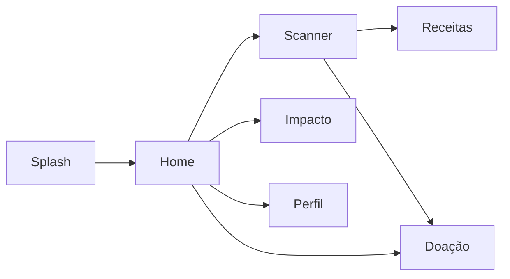
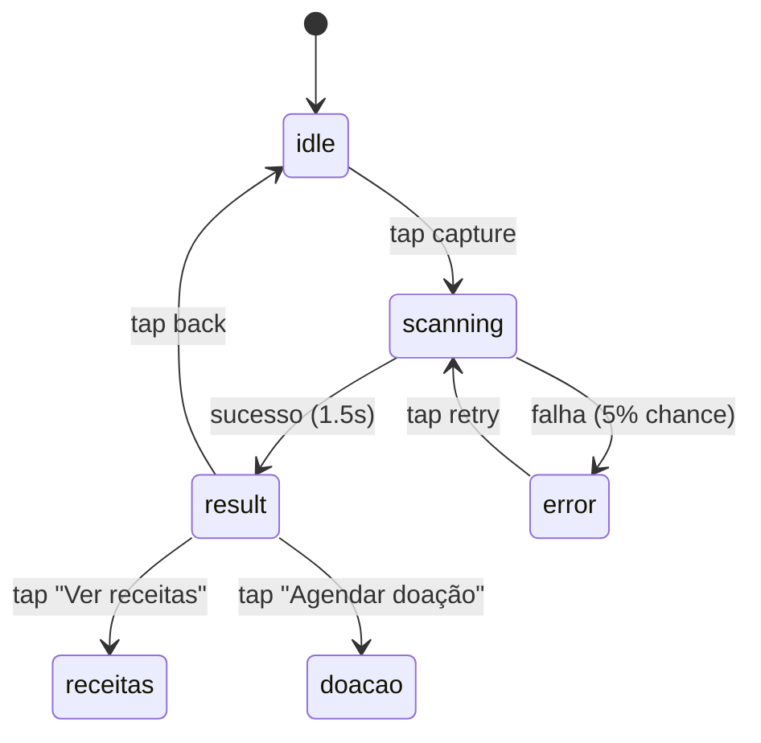
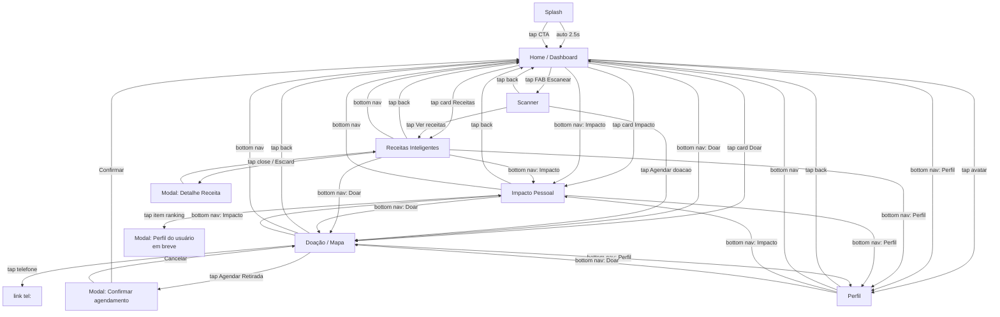

# PRD_01 — Parte B — Especificação Tela a Tela (Waste Guardian)

> **Status:** Em construção
> **Last Updated:** 2026-06-03
> **Priority:** P0
> **Pairs with:** `PRD_01_PART_A_DESIGN_SYSTEM.md`

---

## Prefácio

Este documento é a **fonte única de verdade** para a especificação screen-by-screen da SPA mobile do Waste Guardian. Enquanto a Parte A define tokens, componentes e regras transversais, esta Parte B dita, com precisão de engenharia, o que acontece em cada uma das 6 telas que serão entregues como SPA HTML/CSS/JS para a banca avaliadora do DLJ4.

O objetivo operacional é triplo:

1. **Impressionar na gravação do pitch** (até 07/06/2026): a SPA precisa parecer um produto real, não um exercício acadêmico.
2. **Servir de contrato** entre a designer de produto e o engenheiro de implementação, eliminando ambiguidade.
3. **Garantir cobertura total dos estados** (default, loading, empty, error) para que o fluxo de demo não quebre ao vivo.

Esta especificação **substitui** o rascunho `PRD_01_PROTOTIPO_FIGMA.md` como referência canônica de UI. O documento antigo permanece como histórico do briefing de Figma, mas qualquer divergência entre os dois é resolvida a favor deste.

### Convenções deste documento

- **Tokens:** sempre referenciados pelo nome canônico (ex: `--color-primary-50`), nunca pelo valor literal. A Parte A é a fonte dos valores.
- **Layout:** diagramas em ASCII com medidas em pixels. A régua de 375px é o chão do design.
- **Estados:** listados explicitamente para cada componente interativo.
- **Animações:** descritas com `duração + easing + propriedade` sempre que possível.
- **A11y:** atributos ARIA e comportamento de teclado especificados inline.
- **Mock data:** tabelas completas, prontas para copiar para `app.js`.
- **Componentes:** todos vêm da biblioteca da Parte A. Não há componente novo fora daquele contrato.

### O que NÃO está nesta Parte B

- Tokens de design (Parte A).
- Lógica de gamificação / pontuação (PRD_02).
- Métricas ODS detalhadas (PRD_04).
- Implementação de mapa real (mock visual nesta versão; integração com OpenStreetMap fica como roadmap pós-DLJ4).

---

## 0. Sumário das 6 Telas

| # | Tela | Rota (lógica) | Métrica-âncora | CTA primário | Ação do usuário |
|---|------|---------------|----------------|--------------|-----------------|
| 1 | Splash | `#/splash` | "Cada grama conta" | "Começar agora" | Aguardar 2,5s ou tocar no CTA |
| 2 | Home / Dashboard | `#/home` | "Olá, Maria!" + 2.3kg salvos | "Escanear alimento" (FAB) | Entrar no app, ver resumo do dia |
| 3 | Scanner | `#/scanner` | Resultado do scan (Iogurte, 2 dias) | "Ver receitas" / "Agendar doação" | Identificar alimento próximo do vencimento |
| 4 | Receitas | `#/receitas` | "Baseado em: Iogurte (vence em 2 dias)" | "Ver receita completa" (modal) | Escolher receita e abrir modo de preparo |
| 5 | Impacto Pessoal | `#/impacto` | 24.5kg salvos / 18.2kg CO₂ / R$ 180 | (navegação para Perfil) | Visualizar progresso e ranking |
| 6 | Doação / Mapa | `#/doacao` | "R$ 50 de impacto social gerado" | "Agendar Retirada" | Localizar cooperativa próxima e doar |

**Fluxo principal (happy path):**



---

## 1. TELA 1 — SPLASH SCREEN

> **Propósito:** primeira impressão. Estabelece a identidade de marca (verde Committed) e cria a sensação de um app real de produto.

### 1.1 Layout grid (375x812)

```
Y=0  +--------------------------------------------------+
     |                                                  |
Y=44 |              [safe area top]                     |
     |                                                  |
Y=88 |                                                  |
     |                                                  |
     |              [LOGO 96x96]                       |
     |              center X, Y=200                     |
     |                                                  |
     |                                                  |
Y=320|                                                  |
     |          "Cada grama conta"                      |
     |          (--text-2xl, --weight-bold)             |
     |                                                  |
Y=380|                                                  |
     |        ┌────────────────────────┐                |
     |        │  2.3kg  |  1.8kg CO₂  │                |
     |        │  salvos |  evitado    │                |
     |        └────────────────────────┘                |
     |        (stat row, 2 colunas, gap 12px)           |
Y=480|                                                  |
     |                                                  |
     |        ┌────────────────────────┐                |
     |        │      Começar agora     │                |
     |        │     btn-primary lg     │                |
     |        │   width 343, h 56px    │                |
     |        └────────────────────────┘                |
     |                                                  |
Y=720|                                                  |
     |          [Versão 1.0 - 2026]                     |
     |          (--text-xs, --color-ink-muted)          |
Y=812+--------------------------------------------------+
```

### 1.2 Componentes usados (from Part A)

| Componente | Variante | Onde aparece | Notas |
|------------|----------|--------------|-------|
| **Logo** | (asset) SVG 96x96 ou PNG fallback | Y=200, centralizado | Fallback: emoji `icon-leaf` (Lucide 80px) em círculo `--color-primary-100` |
| **Heading** | `--text-2xl --weight-bold` | Y=320 | "Cada grama conta" (mesma copy do tagline) |
| **Stat mini** | (inline) sem card, valores lado a lado | Y=380 | Apenas números, sem card wrapper |
| **Button** | `primary lg` | Y=480 | "Começar agora" — `width: 343px` (= 375 - 2x16 padding) |
| **Footer text** | `--text-xs --color-ink-muted` | Y=720 | "Versão 1.0 · 2026" (acentuado, sem bullets) |

### 1.3 Conteúdo

- **Logo:** SVG do Waste Guardian (folha estilizada + escudo) 96x96px. Fallback: ícone Lucide `leaf` em 80px, dentro de círculo `--color-primary-100` de 120x120.
- **Tagline:** "Cada grama conta" (sentence case, sem ponto).
- **Stats preview:** "2.3kg salvos" e "1.8kg CO₂ evitado". Renderizado em **uma única linha** (gap 16px) para reforçar densidade sem poluir.
- **CTA:** "Começar agora" (verbo + objeto, pt-BR).
- **Versão (rodapé):** "Versão 1.0 · 2026", letra `--text-xs` (12px), cor `--color-ink-muted`.

### 1.4 Comportamento

| Estado | Comportamento |
|--------|---------------|
| `default` | Visível imediatamente após `DOMContentLoaded`. |
| `loading` | Pulse animation no logo enquanto assets carregam (≤1s em rede normal). |
| `ready` | Após 2,5s, dispara auto-transição para Home. |
| `tap-cta` | Toque no botão "Começar agora" → transição instantânea para Home (sem esperar 2,5s). |
| `tap-outside` | Tap em qualquer área fora do CTA: no-op (não cancela auto-transição). |
| `reduced-motion` | Pula o auto-transition timer; exige tap no CTA para avançar. |

### 1.5 Animações

| Elemento | Animação | Duração | Easing | Delay |
|----------|----------|---------|--------|-------|
| Logo | fade-in + scale `0.92 → 1.0` | 400ms | `--ease-out` | 0ms |
| Tagline | fade-in | 300ms | `--ease-out` | 200ms |
| Stats | stagger fade-in, 50ms entre cada | 300ms | `--ease-out` | 350ms / 400ms |
| CTA | fade-in + slide-up 8px → 0 | 300ms | `--ease-out` | 400ms |
| Background | gradiente respirando entre `--color-primary` e `--color-primary-dark` | 6000ms | `--ease-in-out` | infinite |
| Exit | fade-out + scale `1.0 → 1.05` | 250ms | `--ease-out` | ao navegar |

**Regra anti-bloated:** a Splash é a única tela que pode ter loop infinito de fundo. Em outras telas, animações contínuas estão proibidas exceto no streak badge e scan icon.

### 1.6 Mock data

```js
const splashData = {
  tagline: "Cada grama conta",
  stats: {
    saved: { value: "2.3", unit: "kg", label: "salvos" },
    co2:   { value: "1.8", unit: "kg", label: "CO₂ evitado" }
  },
  cta: "Começar agora",
  version: "Versão 1.0 · 2026"
};
```

### 1.7 Acessibilidade (a11y)

- `aria-label="Iniciar aplicação"` no botão CTA.
- Tap target do CTA: altura mínima 56px (touch target 48px já atendido).
- `prefers-reduced-motion: reduce` → cancela pulse do background, scale e slide-up; mantém apenas fade-in com duração 0ms.
- Logo: `` se SVG; `role="img" aria-label="Waste Guardian"` se for SVG inline.
- Sem flash > 3Hz (regra WCAG 2.3.1). O background é gradiente estático dentro de cada frame; só muda em transição longa (6s).

### 1.8 Edge cases

- **Logo SVG não carregou:** exibe fallback (ícone Lucide `leaf` em círculo `--color-primary-100`).
- **localStorage bloqueado:** o auto-transition continua normalmente, mas o app perde persistência. Toast `info` aparece na Home avisando "Modo visitante, dados não serão salvos".
- **Tap duplo rápido no CTA:** debounce de 200ms para evitar transições duplicadas.

---

## 2. TELA 2 — HOME / DASHBOARD

> **Propósito:** hub central do app. Apresenta o estado atual do usuário (impacto, streak, ranking) e oferece o caminho mais curto para o scanner.

### 2.1 Layout grid (375x812)

```
Y=0  +--------------------------------------------------+
     | safe-area-top                                    |
Y=44 +==================================================+ <- Header sticky
     | [icon-leaf 24] Waste Guardian       [AV MS 36]  |    h=60
Y=104+==================================================+
     | padding lateral 16px                             |
     |                                                  |
Y=120| ┌──────────────────────────────────────────────┐ |
     | │  Hero card (card.highlight)                  │ |
     | │  "Olá, Maria!" h2 24px ink                   │ |
     | │  "7 dias consecutivos" badge warning         │ |
     | │  h ~ 90px                                    │ |
Y=220| └──────────────────────────────────────────────┘ |
     |                                                  |
Y=232| ┌─────────────────┐  ┌─────────────────────────┐ |
     | │ card.elevated   │  │ card.elevated            │ |
     | │ 2.3kg           │  │ 1.8kg                    │ |
     | │ icon-leaf 24    │  │ icon-cloud-off 24         │ |
     | │ Alimentos salvos│  │ CO₂ evitado              │ |
     | │ h ~ 100px       │  │ h ~ 100px                │ |
Y=348| └─────────────────┘  └─────────────────────────┘ |
     |                                                  |
Y=360| ┌──────────────────────────────────────────────┐ |
     | │ Ranking bar                                  │ |
     | │ "TOP 15% dos usuários"   "#47/312" primary  │ |
     | │ h ~ 56px                                     │ |
Y=432| └──────────────────────────────────────────────┘ |
     |                                                  |
Y=444| ┌──────────────────────────────────────────────┐ |
     | │ FAB (escanear) — botão full-width            │ |
     | │ icon-scan-line 24 + "Escanear Alimento"      │ |
     | │ height 56px, primary, shadow-xl             │ |
Y=516| └──────────────────────────────────────────────┘ |
     |                                                  |
Y=528|  Ações rápidas                                  |
     |                                                  |
Y=552| ┌─────────────┐ ┌─────────────┐ ┌──────────────┐|
     | │ icon-cook   │ │ icon-bar    │ │ icon-gift    │|
     | │ Receitas    │ │ Impacto     │ │ Doar         │|
     | │ h ~ 88px    │ │ h ~ 88px    │ │ h ~ 88px     │|
Y=652| └─────────────┘ └─────────────┘ └──────────────┘|
     |                                                  |
Y=664| (espaçamento flexível, padding-bottom 90px)      |
     |                                                  |
Y=740+==================================================+
     | bottom-nav: Home | Impacto | Doar | Perfil      |  h=70 + safe
Y=812+==================================================+
```

### 2.2 Seções (de cima para baixo)

#### 2.2.1 Header sticky (60px)

| Zona | Conteúdo | Especificação |
|------|----------|---------------|
| Esquerda | Logo (ícone Lucide `leaf` 24px) + texto "Waste Guardian" (--text-lg --weight-semibold) | 24x24 + 16px gap |
| Direita | Avatar circular 36x36 com iniciais "MS" (--color-primary-100 bg, --color-primary-dark fg) | aria-label="Perfil de Maria Silva" |

- Background: `--color-surface` com `backdrop-filter: blur(8px)` após scroll > 4px.
- Borda inferior: 1px `--color-border` (aparece só com scroll).
- z-index: `var(--z-header)`.

#### 2.2.2 Hero card de saudacao (h=90px, card.highlight)

- Padding: `--space-4`.
- Background: `--color-primary-50`.
- Borda: `1px --color-primary-200`.
- Border-radius: `--radius-lg` (14px).
- **Linha 1:** "Olá, Maria!" em `--text-2xl` (24px) `--weight-bold` `--color-ink`.
- **Linha 2:** badge `--color-warning-bg` `--color-warning-fg` com ícone `icon-flame` 16px + texto "7 dias consecutivos".
- **Edge case:** nome > 20 chars trunca com ellipsis. Nome vazio: "Olá! Vamos começar?".

#### 2.2.3 Impact metrics row (2 stat cards, gap 12px)

| Card | Ícone | Valor | Label | Background |
|------|-------|-------|-------|------------|
| 1 | `icon-leaf` primary-light | "2.3kg" | "Alimentos salvos" | card.elevated |
| 2 | `icon-cloud-off` primary-light | "1.8kg" | "CO₂ evitado" | card.elevated |

- Cada card: ~165x100px, padding `--space-4`.
- Valor: `--text-3xl` (30px) `--weight-bold` `--color-ink` com `font-feature-settings: 'tnum'`.
- Label: `--text-sm` `--color-ink-secondary`.
- `font-feature-settings: 'tnum'` para alinhamento tabular.

#### 2.2.4 Ranking badge bar (h=56px, card.default)

- Card neutro: bg `--color-surface`, borda `1px --color-border`.
- Padding: `--space-4`.
- Layout flex: texto à esquerda, badge à direita.
- Texto: "Você está no TOP 15% dos usuários" (`--text-base --color-ink`).
- Badge: "#47/312" em `--text-sm --weight-semibold --color-primary`. **Não** envolver em pill — só texto colorido à direita, alinhado por `margin-left: auto`.

#### 2.2.5 FAB full-width "Escanear Alimento" (h=56px)

- **Não usar FAB circular flutuante** aqui (decisão para esta versão: o CTA principal é a barra horizontal full-width, deixando mais espaço para respirar). Esta decisão está documentada porque a Parte A prevê FAB circular como alternativa.
- Width: `calc(100% - 32px)` (padding lateral 16 de cada lado).
- Height: 56px.
- Background: `--color-primary`.
- Texto: "Escanear Alimento" `--text-lg --weight-semibold --color-ink-on-primary`.
- Ícone à esquerda: `icon-scan-line` 24px.
- Sombra: `--shadow-xl` (por ser o CTA dominante, é uma das poucas exceções à regra "sem border + shadow grande"; aqui só shadow, sem border).
- Border-radius: `--radius-md` (10px).
- Tap → navega para Tela 3 (Scanner).
- aria-label: "Escanear um alimento".

#### 2.2.6 Quick actions row (3 action cards, gap 12px)

| Card | Ícone | Label | Rota |
|------|-------|-------|------|
| 1 | `icon-cook` (Lucide) | "Receitas" | Tela 4 |
| 2 | `icon-bar-chart-3` (Lucide) | "Impacto" | Tela 5 |
| 3 | `icon-gift` (Lucide) | "Doar" | Tela 6 |

- Cada card: 109x88px, `card.elevated`, padding `--space-3`.
- Layout vertical: ícone 24px (centro, top) + label 12px embaixo.
- Hover: `translateY(-2px)` + `--shadow-md`.

#### 2.2.7 Bottom Navigation (70px + safe-area)

- 4 itens distribuídos uniformemente: **Home** (ativo), **Impacto**, **Doar**, **Perfil**.
- Ícones 24px + label `--text-xs --weight-medium`.
- Item ativo: cor `--color-primary` + dot indicator 4px abaixo.
- z-index: `var(--z-nav)`.
- aria-label: `<nav aria-label="Navegação principal">`.

### 2.3 Componentes usados (from Part A)

- `Card` (variantes `default`, `elevated`, `highlight`)
- `StatCard` (para os 2 cards de impacto)
- `Badge` (variante `warning` no streak, sem variante para o ranking)
- `Button` (variante `primary` tamanho `lg` para o FAB)
- `ActionCard` (aqui chamado de "quick action"; não é componente documentado na Parte A — equivalência direta é `Card elevated` com padding reduzido)
- `BottomNav`
- `Avatar` (tamanho 36px no header)

### 2.4 Comportamento

| Estado | Comportamento |
|--------|---------------|
| `default` | Todos os dados carregados de `userData` (localStorage + fallback mock). |
| `first-time` (sem localStorage) | Hero diz "Bem-vindo(a)! Vamos começar?", impacto "—" (zero), streak "Comece sua jornada". CTA "Escanear Alimento" continua ativo. |
| `loading` | Skeleton de 800ms nas seções: hero, 2 stat cards, ranking bar, FAB, 3 action cards, bottom nav (este último não anima). Após 800ms, conteúdo real aparece. |
| `pull-to-refresh` | Pull no topo (gesto mobile) simula 1,5s de delay, exibe spinner `--color-primary` no header, depois re-renderiza com `navigateTo('home')` interno. |
| `tap-cta-escanear` | Navega para Tela 3. |
| `tap-card-impacto-1` | Hover state visual; click navega para Tela 5. |
| `tap-card-impacto-2` | Mesma coisa. |

### 2.5 Animações

| Elemento | Animação | Duração | Easing | Delay |
|----------|----------|---------|--------|-------|
| Stat cards | stagger fade-in | 300ms | `--ease-out` | 50ms entre cada |
| Streak badge | pulse scale `1.0 ↔ 1.02` | 2000ms | `--ease-in-out` | infinite |
| FAB (hover) | translateY `-2px` + `--shadow-xl` | 200ms | `--ease-out` | — |
| FAB (active) | scale `0.98` | 50ms | `--ease-out` | — |
| Quick action (hover) | translateY `-2px` + `--shadow-md` | 200ms | `--ease-out` | — |
| Bottom nav active | dot fade-in abaixo do ícone | 200ms | `--ease-out` | — |

**Regra:** apenas o streak tem loop infinito. As demais animações respondem a interação.

### 2.6 Mock data

```js
const homeData = {
  user: {
    name: "Maria Silva",
    initials: "MS",
    firstName: "Maria"
  },
  streak: {
    days: 7,
    badge: "warning" // (--color-warning-* trio)
  },
  impact: {
    foodsSavedKg: "2.3",
    co2AvoidedKg: "1.8"
  },
  ranking: {
    position: 47,
    total: 312,
    percentile: 15
  },
  points: 2340,
  scans: 23
};
```

### 2.7 Acessibilidade

- `<header role="banner">` no sticky header.
- `<main id="main">` envolvendo o conteúdo scrollável.
- `<nav aria-label="Navegação principal">` no bottom nav, com `aria-current="page"` no item "Home".
- Avatar com `aria-label="Perfil de Maria Silva, abrir perfil"`.
- Tap targets: todos os 3 quick actions >= 44px de altura (88px), bottom nav items 70x70, FAB 56x343.
- Skip link "Pular para o conteúdo" presente no topo (regra global, ver Parte A seção 6.4).
- Screen reader: ao entrar na tela, anuncia "Home, Olá Maria, 7 dias consecutivos, 2.3 quilogramas de alimentos salvos, 1.8 quilogramas de CO₂ evitado, posição 47 de 312".

### 2.8 Edge cases

- **Nome longo:** `text-overflow: ellipsis; max-width: 220px;` no hero h2.
- **0 streak:** copy muda para "Comece sua jornada hoje" (badge neutra, sem `warning`).
- **Sem localStorage:** hero mostra "Visitante" como nome. Toast `info` aparece 1× na sessão.
- **Avatar sem nome:** mostra ícone `icon-user` 24px, fundo `--color-surface-muted`.
- **Iniciais:** sempre derivam do primeiro caractere do primeiro nome + primeiro caractere do último nome. Para "Maria Silva" → "MS". Para nome único "Maria" → "M".

---

## 3. TELA 3 — SCANNER

> **Propósito:** espelhar a experiência de câmera de um app real (iFood, Nubank) com mock visual. A simulação precisa ser convincente o suficiente para o pitch.

### 3.1 Layout grid (375x812)

```
Y=0  +--------------------------------------------------+
     | safe-area-top                                    |
Y=44 +==================================================+ <- Header
     | [←] Scanner                       [   ]         |    h=60
Y=104+==================================================+
     |                                                  |
     |   CAMERA FRAME AREA (height 360px)              |
     |   background: gradient #1a1a2e -> #16213e        |
     |                                                  |
Y=140|   ┌──────────────────────────────────┐           |
     |   │                                  │           |
     |   │   Viewfinder 240x240             │           |
     |   │   border-radius 20px             │           |
     |   │   border 2px rgba(255,255,255,.3)|           |
     |   │                                  │           |
Y=260|   │   [icon-scan 64px branco]        │           |
     |   │                                  │           |
     |   │   "Posicione o produto"          │           |
Y=380|   │                                  │           |
     |   └──────────────────────────────────┘           |
Y=440|                                                  |
     |              [ capture 72x72 ]                   |
     |              (círculo branco,                    |
Y=512|               4px primary border)                |
     |                                                  |
Y=464+==================================================+
     |                                                  |
     |   RESULT CARD (slide up após scan)              |
     |   (visible only after "scan")                    |
     |   ou                                            |
     |   EMPTY STATE: "Toque para escanear"            |
     |                                                  |
Y=812+==================================================+
```

> **Bottom nav omitido** nesta tela para focar o usuário no fluxo de captura (decisão de UX: scan é uma ação modal-like, não uma navegação primária).

### 3.2 Componentes usados

- `Header` (com botão back à esquerda, título centralizado, slot direita vazio)
- `Viewfinder overlay` (não está na Parte A — equivalente a um `Card` com borda branca translúcida sobre fundo escuro)
- `Button` (variante `fab` 72x72 para o capture button, e `primary sm` para "Ver receitas" / "Agendar doação" no result card)
- `Badge` (variante `warning` ou `danger` no expiry)
- `StatCard` inline (2 colunas no result card)

### 3.3 Seções

#### 3.3.1 Header sticky (60px)

| Zona | Conteúdo |
|------|----------|
| Esquerda | Botão back (ícone `icon-arrow-left` 24px, 44x44 hit area) |
| Centro | "Scanner" (`--text-lg --weight-semibold`) |
| Direita | (vazio, 24x24 spacer) |

#### 3.3.2 Camera frame area (h=360px)

- Background: gradiente vertical de `oklch(15% 0.02 250)` (≈ `#1a1a2e`) para `oklch(20% 0.02 250)` (≈ `#16213e`).
- Viewfinder: container centralizado 240x240, `border-radius: 20px`, `border: 2px solid rgba(255, 255, 255, 0.3)`.
- Cantos arredondados do viewfinder têm **glow** sutil: `box-shadow: 0 0 0 9999px rgba(0, 0, 0, 0.4)` (escurece a área ao redor).
- **Ícone central** (64px branco): alterna entre `icon-scan-line` (idle) e `icon-camera` (scanning).
- **Status text** abaixo do ícone: muda por estado (ver 3.4).
- **Capture button** (72x72, posicionado em `position: absolute; bottom: -36px; left: 50%; transform: translateX(-50%)`):
  - Círculo branco `--color-surface`.
  - Borda interna: `4px solid --color-primary`.
  - Inner dot: 16x16 `--color-primary`.
  - Sombra: `--shadow-xl`.

#### 3.3.3 Result card (slide-up do bottom, h=auto)

> Aparece **somente** após o "scan" completar. Antes disso, posição é `translateY(100%)`, opacidade 0.

Estrutura:

```
┌────────────────────────────────────────┐
│ 🍶  Iogurte Natural Integral           │  <- header (emoji 56px + h3 18px)
│      ⏰ Vence em 2 dias (05/06)         │  <- badge warning
├────────────────────────────────────────┤
│ ┌─────────────────┐ ┌────────────────┐ │
│ │ R$ 8,90         │ │ 250g           │ │
│ │ Valor estimado  │ │ CO₂ evitado    │ │
│ └─────────────────┘ └────────────────┘ │
├────────────────────────────────────────┤
│ [Ver receitas]  [Agendar doação]       │  <- 2 botões secondary, gap 12px
└────────────────────────────────────────┘
```

- Padding: `--space-4`.
- Background: `--color-surface`.
- Border-top-radius: `--radius-xl` (20px) — apenas o topo, para sugerir entrada por baixo.
- Sombra: `--shadow-lg`.

### 3.4 Estados da câmera (4 críticos)

| Estado | Viewfinder | Ícone | Texto de status | Capture button |
|--------|-----------|-------|-----------------|----------------|
| `idle` | visível, borda 30% | `icon-scan-line` 64px branco | "Posicione o produto dentro do quadro" (h3 16px branco) | ativo, sem ripple |
| `scanning` | visível, borda 50% | `icon-camera` 64px branco (com pulse) | "Escaneando..." com 3 dots animados | com ripple effect |
| `result` | dimmed (40% opacity) | (não relevante) | — | desabilitado |
| `error` | borda `--color-danger` | `icon-alert-circle` 64px branco | "Não consegui identificar. Tente novamente." (h3 16px branco) | vira botão "Tentar de novo" |

**Diagrama de transição de estados:**



### 3.5 Animações

| Elemento | Animação | Duração | Easing | Notas |
|----------|----------|---------|--------|-------|
| Scan icon (idle→scanning) | pulse scale `1.0 ↔ 1.15` | 2000ms | `--ease-in-out` | infinite durante scanning |
| Status text (scanning) | "Escaneando" + 3 dots cycling | 800ms | linear | só durante scanning |
| Capture button (tap) | ripple circular | 400ms | `--ease-out` | ripple expande até 144px |
| Capture → result | capture btn scale `1.0 → 1.5` + fade | 600ms | `--ease-out` | |
| Result card entry | `translateY(100%) → 0` + fade | 350ms | `--ease-out` | |
| Result card close | `translateY(0) → 100%` + fade | 250ms | `--ease-out` | |
| Viewfinder (idle) | breathe scale `1.0 ↔ 1.02` | 3000ms | `--ease-in-out` | infinite, sutíssimo |

### 3.6 Mock data — 8 produtos brasileiros variados

```js
const mockScans = [
  {
    id: "iogurte",
    icon: "🍶",
    name: "Iogurte Natural Integral",
    category: "laticinios",
    expiry: "05/06/2026",
    daysLeft: 2,
    value: "R$ 8,90",
    co2: "250g",
    unit: "200g"
  },
  {
    id: "pao",
    icon: "🍞",
    name: "Pão de Forma Integral",
    category: "paes",
    expiry: "04/06/2026",
    daysLeft: 1,
    value: "R$ 6,50",
    co2: "180g",
    unit: "500g"
  },
  {
    id: "banana",
    icon: "🍌",
    name: "Banana Prata (3 un)",
    category: "frutas",
    expiry: "03/06/2026",
    daysLeft: 0,
    value: "R$ 4,90",
    co2: "120g",
    unit: "300g"
  },
  {
    id: "leite",
    icon: "🥛",
    name: "Leite Integral UHT",
    category: "laticinios",
    expiry: "08/06/2026",
    daysLeft: 5,
    value: "R$ 5,90",
    co2: "200g",
    unit: "1L"
  },
  {
    id: "queijo",
    icon: "🧀",
    name: "Queijo Minas Frescal",
    category: "laticinios",
    expiry: "06/06/2026",
    daysLeft: 3,
    value: "R$ 12,90",
    co2: "400g",
    unit: "500g"
  },
  {
    id: "tomate",
    icon: "🍅",
    name: "Tomate Italiano (4 un)",
    category: "legumes",
    expiry: "05/06/2026",
    daysLeft: 2,
    value: "R$ 7,80",
    co2: "150g",
    unit: "400g"
  },
  {
    id: "maca",
    icon: "🍎",
    name: "Maçã Fuji (5 un)",
    category: "frutas",
    expiry: "12/06/2026",
    daysLeft: 9,
    value: "R$ 9,50",
    co2: "100g",
    unit: "600g"
  },
  {
    id: "cenoura",
    icon: "🥕",
    name: "Cenoura Orgânica (1 kg)",
    category: "verduras",
    expiry: "10/06/2026",
    daysLeft: 7,
    value: "R$ 4,50",
    co2: "80g",
    unit: "1kg"
  }
];
```

**Mapeamento `daysLeft` → cor do badge:**

| `daysLeft` | Cor | Texto |
|------------|-----|-------|
| 0 | `--color-danger-*` | "Vence hoje (DD/MM)" |
| 1 | `--color-warning-*` | "Vence amanhã (DD/MM)" |
| 2-7 | `--color-warning-bg` `--color-warning-fg` (border mais fraco) | "Vence em N dias (DD/MM)" |
| 8+ | `--color-success-*` | "Fresco, vence em N dias" |

### 3.7 Comportamento

| Ação | Resultado |
|------|-----------|
| Tap capture (idle) | Inicia scanning, esconde capture button, mostra "Escaneando..." com dots. |
| Após 1,5s de scanning | 95% das vezes: transita para `result` com produto aleatório. 5%: `error`. |
| Tap "Ver receitas" (result) | Navega para Tela 4 passando contexto `{ productId, productName, daysLeft }` via store. |
| Tap "Agendar doação" (result) | Navega para Tela 6 passando contexto `{ productId, productName }`. |
| Tap back (qualquer estado) | Descarta result (se houver), volta para Tela 2. |
| Tap capture (error) | Volta para `scanning`. |

### 3.8 Acessibilidade

- Viewfinder com `aria-label="Área de captura"`.
- Status text com `aria-live="polite"` (anuncia mudança de estado para leitor de tela).
- Capture button: `aria-label="Iniciar captura"` (idle) / `aria-label="Escaneando, aguarde"` (scanning) / `aria-label="Tentar novamente"` (error).
- Result card: `role="region" aria-labelledby="result-title"`.
- Touch target capture button: 72x72 (>>44px).
- Botões "Ver receitas" e "Agendar doação": 48x~170px cada, atendem 44x44.
- Sem flash > 3Hz (regra WCAG 2.3.1 mantida). Ripple é expansão contínua, não pisca-pisca.

### 3.9 Edge cases

- **Nome de produto longo (>24 chars):** trunca com ellipsis no header do result card.
- **0 dias restantes:** badge vermelha `--color-danger-*`, texto "Vence hoje (DD/MM)".
- **1 dia restante:** badge amarela `--color-warning-*`, texto "Vence amanhã (DD/MM)".
- **Foto do dispositivo indisponível:** o viewfinder mostra a área escura mesmo assim. Sem mensagem de erro específica de permissão de câmera (estamos em SPA estática).
- **5 scans consecutivos:** toast `success` aparece: "Você escaneou 5 produtos hoje. +50 pontos!".
- **Permissão negada hipotética (futuro):** mostraria empty state "Precisamos da câmera para escanear. Ative nas configurações." com botão "Configurações". **Não implementado nesta versão.**

---

## 4. TELA 4 — RECEITAS INTELIGENTES

> **Propósito:** converter o alimento escaneado (ou a busca livre) em ações práticas. A lista de receitas é a ponte entre "identifiquei" e "vou usar antes de vencer".

### 4.1 Layout grid (375x812)

```
Y=0  +--------------------------------------------------+
     | safe-area-top                                    |
Y=44 +==================================================+ <- Header
     | [←] Receitas                       [   ]        |    h=60
Y=104+==================================================+
     |                                                  |
     |  Context banner (auto-height, padding 16)       |
     |  ┌──────────────────────────────────────────┐   |
     |  │ "Baseado em: Iogurte (vence em 2 dias)" │   |
Y=140|  │ small text, --color-ink-secondary        │   |
Y=176|  └──────────────────────────────────────────┘   |
     |                                                  |
Y=192|  Recipes list (flex-1, scrollable, gap 12px)    |
     |  ┌──────────────────────────────────────────┐   |
     |  │ 🍰 Torta de Iogurte                       │   |
     |  │ ──────                                   │   |
     |  │ ⏱️ 30min  🟢 Fácil  💰 R$ 12            │   |
     |  │ ──────                                   │   |
     |  │ [ 🌱 400g CO₂ evitado  /  Economiza R$12]│   |
     |  └──────────────────────────────────────────┘   |
     |  (4+ cards empilhados)                           |
     |                                                  |
     |                                                  |
     |                                                  |
Y=742+==================================================+
     | bottom-nav (Home | Impacto | Doar | Perfil)     |  h=70
Y=812+==================================================+
```

### 4.2 Seções

#### 4.2.1 Header sticky (60px)

| Zona | Conteúdo |
|------|----------|
| Esquerda | Botão back (44x44, ícone `icon-arrow-left`) |
| Centro | "Receitas" (`--text-lg --weight-semibold`) |
| Direita | (vazio) |

#### 4.2.2 Context banner (auto height, padding 16px)

- Fundo: `--color-primary-50`.
- Borda: `1px --color-primary-200`.
- Border-radius: `--radius-md` (10px).
- Texto: "Baseado em: **[nome do produto]** (vence em [N] dias)" em `--text-sm --color-ink-secondary`.
- **[nome]** e **[N]** em `--weight-semibold --color-ink`.
- Padding interno: `--space-3` vertical, `--space-4` horizontal.
- Quando sem contexto: "Encontre uma receita para o que está na sua geladeira." (mesmo estilo, sem destaque).

#### 4.2.3 Recipe list (flex-1, scrollable, gap 12px)

- Container: `display: flex; flex-direction: column; gap: var(--space-3); padding: 0 var(--space-4) var(--space-6)`.
- Cada card ocupa `width: 100%`.

### 4.3 Estrutura do Recipe Card

```
┌─────────────────────────────────────────────┐
│ [emoji 32px]  Torta de Iogurte   [R$ 12]   │  <- header row
│                                              │
│ ⏱ 30 min   🟢 Fácil   💰 R$ 12             │  <- meta row (3 stats)
│                                              │
│ ┌─────────────────────────────────────────┐ │
│ │ 🌱 400g CO₂ evitado    Economiza R$ 12  │ │  <- impact banner
│ └─────────────────────────────────────────┘ │
└─────────────────────────────────────────────┘
```

- **Container:** `card.elevated` (background `--color-surface`, `--shadow-md`, sem border).
- **Padding:** `--space-4` (16px).
- **Border-radius:** `--radius-lg` (14px).
- **Linha 1 (header):**
  - Emoji à esquerda (32px).
  - Nome: `--text-base --weight-semibold --color-ink` (16px, semibold).
  - Economy badge à direita: `--text-sm --weight-semibold --color-primary` (cor verde, sem pill).
- **Linha 2 (meta):** 3 stats inline separadas por dot middot (`·`), 12px, `--color-ink-secondary`.
  - `⏱ 30 min` (ou sem ícone para tempo curto < 10min).
  - Dificuldade: badge textual pequeno — "Fácil" (success), "Médio" (warning), "Difícil" (danger).
  - `💰 R$ 12` (custo).
- **Linha 3 (impact banner):** full-width dentro do card, fundo `--color-primary-50`, padding `--space-2` `--space-3`, border-radius `--radius-sm` (6px).
  - Texto: `🌱 400g CO₂ evitado` (esquerda) + `Economiza R$ 12` (direita, `--weight-semibold`).
- **Tap:** abre modal de detalhe (ver 4.5).
- **Hover (desktop):** `translateX(4px)` em 150ms.

### 4.4 Mock data — Receitas

#### 4.4.1 Por categoria de ingrediente

```js
const recipes = {
  iogurte: [
    {
      id: "torta-iogurte",
      name: "Torta de Iogurte",
      icon: "🍰",
      time: 30,
      level: "Fácil",
      cost: 12,
      co2: 400,
      ingredients: [
        "1 iogurte natural (200g)",
        "2 ovos",
        "1 xícara de farinha de trigo",
        "1/2 xícara de açúcar",
        "1 colher de sopa de óleo",
        "1 colher de chá de fermento"
      ],
      steps: [
        "Preaqueça o forno a 180°C.",
        "Misture o iogurte com os ovos e o óleo.",
        "Adicione o açúcar e misture bem.",
        "Acrescente a farinha e o fermento.",
        "Misture até ficar homogêneo.",
        "Despeje em uma forma untada.",
        "Asse por 25-30 minutos."
      ]
    },
    {
      id: "smoothie-proteico",
      name: "Smoothie Proteico",
      icon: "🥤",
      time: 5,
      level: "Fácil",
      cost: 8,
      co2: 250,
      ingredients: [
        "1 iogurte natural",
        "1 banana madura",
        "1 colher de aveia",
        "1 colher de mel",
        "100ml de leite"
      ],
      steps: [
        "Coloque todos os ingredientes no liquidificador.",
        "Bata por 2 minutos até ficar homogêneo.",
        "Sirva imediatamente.",
        "Rende 1 porção generosa."
      ]
    },
    {
      id: "bolo-iogurte",
      name: "Bolo de Iogurte",
      icon: "🎂",
      time: 45,
      level: "Médio",
      cost: 15,
      co2: 500,
      ingredients: [
        "2 iogurtes naturais",
        "2 xícaras de farinha de trigo",
        "1 e 1/2 xícara de açúcar",
        "3 ovos",
        "1/2 xícara de óleo",
        "1 colher de sopa de fermento"
      ],
      steps: [
        "Preaqueça o forno a 180°C.",
        "Bata os ovos com o açúcar até ficar fofo.",
        "Adicione o iogurte e o óleo.",
        "Acrescente a farinha aos poucos.",
        "Por último, adicione o fermento.",
        "Asse por 35-40 minutos."
      ]
    },
    {
      id: "sorvete-caseiro",
      name: "Sorvete Caseiro",
      icon: "🍦",
      time: 20,
      level: "Fácil",
      cost: 18,
      co2: 600,
      ingredients: [
        "2 iogurtes naturais",
        "1 lata de leite condensado",
        "200ml de creme de leite",
        "Frutas a gosto (morango, manga)"
      ],
      steps: [
        "Bata o iogurte com o leite condensado.",
        "Acrescente o creme de leite.",
        "Misture bem até ficar cremoso.",
        "Adicione as frutas picadas.",
        "Leve ao freezer por 4+ horas.",
        "Sirva em bolas."
      ]
    }
  ],
  pao: [
    {
      id: "torrada-com-ovo",
      name: "Torrada com Ovo",
      icon: "🍳",
      time: 10,
      level: "Fácil",
      cost: 6,
      co2: 200,
      ingredients: [
        "2 fatias de pão de forma",
        "2 ovos",
        "1 colher de manteiga",
        "Sal e pimenta a gosto"
      ],
      steps: [
        "Torre as fatias de pão.",
        "Frite os ovos na manteiga.",
        "Coloque os ovos sobre o pão.",
        "Tempere com sal e pimenta."
      ]
    },
    {
      id: "bruschetta",
      name: "Bruschetta de Tomate",
      icon: "🍅",
      time: 15,
      level: "Fácil",
      cost: 12,
      co2: 180,
      ingredients: [
        "4 fatias de pão",
        "3 tomates picados",
        "1/2 cebola roxa",
        "Manjericão fresco",
        "Azeite, sal e vinagre"
      ],
      steps: [
        "Torre as fatias de pão.",
        "Misture tomate, cebola e manjericão.",
        "Tempere com azeite, sal e vinagre.",
        "Monte sobre o pão e sirva."
      ]
    }
  ],
  banana: [
    {
      id: "smoothie-banana",
      name: "Smoothie de Banana",
      icon: "🥤",
      time: 5,
      level: "Fácil",
      cost: 6,
      co2: 150,
      ingredients: [
        "2 bananas maduras",
        "200ml de leite",
        "1 colher de mel",
        "Gelo a gosto"
      ],
      steps: [
        "Bata tudo no liquidificador por 1 minuto.",
        "Sirva gelado."
      ]
    },
    {
      id: "bolo-banana",
      name: "Bolo de Banana",
      icon: "🍌",
      time: 40,
      level: "Médio",
      cost: 10,
      co2: 350,
      ingredients: [
        "3 bananas maduras",
        "2 xícaras de farinha",
        "1 xícara de açúcar",
        "1/2 xícara de óleo",
        "2 ovos",
        "1 colher de fermento"
      ],
      steps: [
        "Amasse as bananas.",
        "Misture com ovos, óleo e açúcar.",
        "Adicione farinha e fermento.",
        "Asse a 180°C por 35 minutos."
      ]
    }
  ]
};
```

#### 4.4.2 Fallback genérico (sem contexto de scan)

Quando o usuário entra na aba Receitas pelo bottom nav sem ter escaneado nada, exibe **4 receitas-âncora** que não dependem de ingrediente específico:

1. **Omelete de Legumes** (15min, Fácil, R$ 8, 200g CO₂)
2. **Arroz de Forno com Restos** (25min, Fácil, R$ 10, 300g CO₂)
3. **Sopa de Pão Amanhecido** (30min, Fácil, R$ 6, 250g CO₂)
4. **Vitamina de Frutas** (5min, Fácil, R$ 5, 120g CO₂)

### 4.5 Modal de detalhe (Bottom Sheet)

#### 4.5.1 Estrutura visual

```
┌─────────────────────────────────────────┐
│              [handle drag]              │  <- 36x4 indicator
│                                         │
│  [×]                            [icon]  │  <- close + emoji
│                                  64px   │
│                          Torta de       │
│                          Iogurte        │  <- h2
│                                         │
│  ⏱ 30 min  🟢 Fácil  💰 R$ 12  🌱 400g │  <- meta inline
│                                         │
│  ─────────────────────────────────────  │
│  Ingredientes                           │  <- h3
│  • 1 iogurte natural (200g)             │
│  • 2 ovos                               │  <- bulleted
│  • 1 xícara de farinha de trigo         │
│  • ...                                  │
│                                         │
│  ─────────────────────────────────────  │
│  Modo de Preparo                        │  <- h3
│  1. Preaqueça o forno a 180°C.          │
│  2. Misture o iogurte com os ovos...    │  <- numbered
│  3. ...                                 │
│                                         │
│  ┌─────────────────────────────────────┐│
│  │ 🌱 Você economiza R$ 12 e evita    ││  <- bottom banner
│  │    400g de CO₂                      ││
│  └─────────────────────────────────────┘│
└─────────────────────────────────────────┘
```

- **Backdrop:** `--color-surface-overlay` + `backdrop-filter: blur(4px)`.
- **Container:** background `--color-surface`, `border-radius: --radius-xl --radius-xl 0 0` (top corners 20px), max-height 90vh, scrollable.
- **Handle drag:** barra `--color-border-strong` 36x4, centralizada, 8px de margin-top.
- **Header do sheet:**
  - Botão close `×` (24x24, top-right, 16px do edge) → `aria-label="Fechar receita"`.
  - Ícone emoji 64px centralizado.
  - Nome da receita: `--text-2xl --weight-bold --color-ink` (24px bold).
- **Meta row:** 4 stats inline, `--text-sm --color-ink-secondary`, separadas por `·`.
- **Section "Ingredientes":** h3 (`--text-lg --weight-semibold`) + `<ul>` com bullets `--color-primary`.
- **Section "Modo de Preparo":** h3 + `<ol>` numerado, `--text-base --color-ink`, `line-height: var(--leading-relaxed)`.
- **Bottom banner:** full-width dentro do sheet, fundo `--color-primary-50`, padding `--space-3` `--space-4`, texto `--text-base --weight-semibold --color-primary-dark`.

#### 4.5.2 Animações do modal

| Evento | Animação | Duração | Easing |
|--------|----------|---------|--------|
| Entry | `translateY(100%) → 0` + fade | 300ms | `--ease-out` |
| Exit | `translateY(0) → 100%` + fade | 250ms | `--ease-out` |
| Backdrop fade | opacity `0 → 1` | 200ms | `--ease-out` |

#### 4.5.3 Acessibilidade do modal

- `role="dialog" aria-modal="true" aria-labelledby="recipe-modal-title"`.
- Focus trap: ao abrir, foco vai no botão close. Tab/Shift+Tab circular dentro do modal.
- `Esc` fecha o modal.
- Tap no backdrop fecha o modal (com confirmação se houver scroll no body? Não, fecha direto).
- Drag down > 100px no handle fecha o modal.

### 4.6 Estados da tela

| Estado | Comportamento |
|--------|---------------|
| `default` | Lista de receitas com base no contexto ou fallback. |
| `empty` (após tap em "Receitas" sem scan prévio E sem fallback) | Empty state: ícone `icon-search` 80px, "Nenhuma receita por aqui", subtítulo "Escaneie um alimento para ver receitas personalizadas", CTA "Escanear agora" → Tela 3. |
| `loading` (após tap em receita) | Skeleton cards (3 retângulos 100x150 com shimmer) por 600ms, depois abre o modal. |
| `modal-open` | Body scroll travado, sheet sobreposto com backdrop, bottom nav ainda visível mas atrás do backdrop. |
| `reduced-motion` | Slide-up vira fade-in simples (duração 0ms), drag down não funciona. |

### 4.7 Animações da tela

| Elemento | Animação | Duração | Easing | Delay |
|----------|----------|---------|--------|-------|
| Recipe cards (entrada) | stagger fade-in + slide-up 8px | 300ms | `--ease-out` | 50ms entre cada (máx 5 cards) |
| Card hover | `translateX(4px)` + `--shadow-md` | 150ms | `--ease-out` | — |
| Card press | `scale(0.98)` | 50ms | `--ease-out` | — |
| Context banner | fade-in | 200ms | `--ease-out` | 0ms |

### 4.8 Acessibilidade (tela)

- `<main id="main">` com o título da tela em `<h1>` (oculto visualmente mas presente para SR).
- Cards de receita: `role="button" tabindex="0"`, `aria-label="Ver receita: [nome]"`.
- Ativação por teclado: Enter ou Espaço abre o modal.
- Modal: conforme 4.5.3.
- Skip link "Pular para o conteúdo" no header.
- Touch targets: cada card 100% width x ~140px altura (>>44px).

### 4.9 Edge cases

- **Receita com `steps.length > 7`:** trunca a lista visível em 7 passos; mostra botão "Ver mais" (futuro, não no MVP).
- **Ingrediente com quantidade incomum** (ex: "1/2 xícara"): copy literal, sem normalização.
- **Receita favoritada (futuro):** ícone de coração no card. Não implementado nesta versão.
- **Sem internet (futuro):** cache local das receitas. Não implementado nesta versão.
- **Lista de ingredientes vazia (data corruption):** modal mostra "Receita indisponível no momento" no lugar.

---

## 5. TELA 5 — IMPACTO PESSOAL

> **Propósito:** fechar o loop emocional. O usuário precisa ver que seus escaneamentos geraram impacto real, com números, ranking e badges. Esta é a tela que sustenta a narrativa "Cada grama conta".

### 5.1 Layout grid (375x812)

```
Y=0  +--------------------------------------------------+
     | safe-area-top                                    |
Y=44 +==================================================+ <- Header
     | [←] Meu Impacto                    [   ]        |    h=60
Y=104+==================================================+
     |                                                  |
     |  HERO STATS (3 colunas, gap 12px)               |
     |  ┌──────────┐ ┌──────────┐ ┌──────────┐         |
Y=120|  │ 24.5kg   │ │ 18.2kg   │ │ R$ 180   │         |
     |  │salvos    │ │ CO₂      │ │ Economia │         |
Y=240|  └──────────┘ └──────────┘ └──────────┘         |
     |                                                  |
     |  RANKING PROGRESS                               |
     |  ┌──────────────────────────────────────────┐   |
Y=260|  │ "TOP 15% da comunidade"   "#47 de 312"   │   |
     |  │ ▓▓▓▓▓▓▓▓▓░░░░░░░  progress 85%          │   |
Y=348|  └──────────────────────────────────────────┘   |
     |                                                  |
     |  WEEKLY EVOLUTION CHART                         |
     |  ┌──────────────────────────────────────────┐   |
Y=360|  │ "Evolução semanal"                       │   |
     |  │       ▓                                   │   |
Y=400|  │       ▓  ▓                                │   |
     |  │    ▓  ▓  ▓                                │   |
     |  │ S1 S2 S3 S4                              │   |
Y=536|  └──────────────────────────────────────────┘   |
     |                                                  |
     |  BADGES (4 colunas, gap 12px)                   |
     |  ┌──────┐ ┌──────┐ ┌──────┐ ┌──────┐           |
Y=560|  │  🏅  │ │  💰  │ │  🌍  │ │  🔒  │          |
     |  │Inic. │ │Econ. │ │Herói │ │Mestre│           |
Y=668|  └──────┘ └──────┘ └──────┘ └──────┘           |
     |                                                  |
     |  RANKING LIST                                   |
     |  ┌──────────────────────────────────────────┐   |
Y=680|  │ 🥇 Ana Silva       3.420 pts             │   |
     |  │ 🥈 João Costa      3.180 pts             │   |
     |  │ 🥉 Pedro Santos    2.980 pts             │   |
Y=812|  │ ... (Maria em #47 destacada em verde)   │   |
     |  └──────────────────────────────────────────┘   |
     |  bottom-nav (Impacto ativo)                    |
Y=812+==================================================+
```

### 5.2 Seções

#### 5.2.1 Header sticky (60px)

- Back à esquerda, "Meu Impacto" centralizado, slot direito vazio.

#### 5.2.2 Hero stats (3 stat boxes em row, gap 12px)

Cada box:

```
┌──────────────┐
│ 24.5kg       │  <- --text-3xl, --weight-bold, --color-ink
│              │
│ Alimentos    │  <- --text-xs, --color-ink-secondary
│ salvos       │
└──────────────┘
```

- 3 boxes de ~112x100px.
- Box 1: `24.5kg / Alimentos salvos` (bg `--color-primary-50`, borda `--color-primary-200`).
- Box 2: `18.2kg / CO₂ evitado` (bg `--color-info-bg`, borda `--color-info-border`).
- Box 3: `R$ 180 / Economia` (bg `--color-success-bg`, borda `--color-success-border`).
- Padding: `--space-3` (12px, mais compacto que stat card de Home para caber 3 em uma linha).
- `font-feature-settings: 'tnum'` em todos.

#### 5.2.3 Ranking progress section (h=88px, card.default)

- Padding: `--space-4`.
- Border: 1px `--color-border`.
- Border-radius: `--radius-lg`.
- **Layout interno:**
  - Linha 1: flex space-between, "Você está no TOP 15% da comunidade" (`--text-base --color-ink`) à esquerda, "#47 de 312" (`--text-sm --weight-semibold --color-primary`) à direita.
  - Linha 2 (margin-top 12px): progress bar 12px height, fill 85%, `--color-primary`, `--radius-full`.

#### 5.2.4 Weekly evolution chart (h=176px, card.elevated)

- Padding: `--space-4`.
- Border-radius: `--radius-lg`, `--shadow-md`.
- **Header:** "Evolução semanal" (`--text-lg --weight-semibold --color-ink`).
- **Chart area:** 4 barras verticais, gap 16px entre barras, largura da barra 40px, altura do chart 120px.
- Cada barra:
  - Background: `linear-gradient(to top, --color-primary-light, --color-primary)`.
  - Border-radius: `--radius-sm` (top corners).
  - Label abaixo: S1, S2, S3, S4 (`--text-xs --color-ink-secondary`).
  - S4 (mais recente): acento `--color-primary-dark` no topo.
- Heights relativos (escala 0-100%):
  - S1: 60%
  - S2: 75%
  - S3: 82%
  - S4: 100%
- Eixo Y **não** desenhado (estilo minimalista, só barras + label).
- Tooltip on tap (futuro, não no MVP).

#### 5.2.5 Badges section (4 badges em grid, gap 12px)

Cada badge:

```
┌─────────┐
│   🏅    │  <- ícone 28px centralizado
│         │
│Iniciante│  <- nome 10px
│  Verde  │
└─────────┘
```

- Box: ~80x96px, padding `--space-3`.
- **Earned (3):** background `linear-gradient(135deg, --color-primary, --color-primary-dark)`, texto `--color-ink-on-primary`. Ícone emoji 28px + nome `--text-xs --weight-semibold` em 2 linhas.
- **Locked (1):** background `--color-surface-muted`, opacity 0.5, ícone `icon-lock` 24px no lugar do emoji, label "Mestre" cinza.
- Border-radius: `--radius-md` (10px).

#### 5.2.6 Ranking list (h=auto, scrollable)

- Container: card com `--space-4` padding, gap `--space-2` entre items.
- Cada item: `ListItem` (Parte A seção 4.11).
  - **Top 3:** background tinted:
    - #1 (Ana): bg `--color-gold` opacity 0.15 (use `oklch(82% 0.15 90 / 0.15)`).
    - #2 (João): bg `--color-silver` opacity 0.15.
    - #3 (Pedro): bg `--color-bronze` opacity 0.15.
  - **Current user (Maria, #47):** background `--color-primary-50`, borda esquerda `3px --color-primary` (não combina com 1px border + shadow — apenas borda lateral, sem shadow).
  - **Demais itens:** fundo `--color-surface`, sem destaque.
- Cada linha: rank + nome (16px `--weight-medium`) + points (16px `--weight-semibold` à direita, com `font-feature-settings: 'tnum'`).
- Min 5 itens visíveis: top 3, gap, current (#47), gap, #48.

#### 5.2.7 Bottom Nav (Impacto ativo)

- 70px + safe area.
- Item "Impacto" com cor `--color-primary` e dot indicator.

### 5.3 Componentes usados (from Part A)

- `StatBox` (variação compacta de `StatCard` para caber 3 em row)
- `ProgressBar`
- `BarChart` (não está na Parte A como componente formal — equivalência: container flex com 4 divs absolutos/relativos)
- `Badge` (variante `success` para earned, custom para locked)
- `ListItem` (para o ranking)
- `BottomNav`

### 5.4 Comportamento

| Estado | Comportamento |
|--------|---------------|
| `default` | Todos os dados populados. |
| `zero-stats` (usuário novo) | 3 hero stats mostram "0kg / 0kg / R$ 0" com hint "Comece a escanear para ver seu impacto". Chart mostra placeholder "--". Badges: só "Iniciante Verde" earned, outros locked. |
| `loading` | Skeleton: 3 retângulos 112x100, 1 retângulo 343x88, 1 chart 343x176, 4 boxes 80x96, 5 list items. 800ms de delay. |
| `pull-to-refresh` | Re-renderiza com toast "Dados atualizados" no rodapé. |
| `tap-item-ranking` | Toast `info` "Ver perfil completo (em breve)". |

### 5.5 Animações

| Elemento | Animação | Duração | Easing | Delay |
|----------|----------|---------|--------|-------|
| Hero stats valores | count-up `0 → final` | 1200ms | `--ease-out` | 0ms (todos juntos) |
| Progress bar | fill `0% → 85%` | 800ms | `--ease-out` | 200ms |
| BarChart barras | grow `0 → finalHeight` (transform scaleY) | 600ms | `--ease-spring` | 100ms entre cada |
| Badges | stagger fade-in | 300ms | `--ease-out` | 50ms entre cada |
| List items | stagger fade-in + slide-up 8px | 300ms | `--ease-out` | 30ms entre cada |

**Regra de exceção:** o BarChart usa `--ease-spring` (única instância da tela) porque é o "momento de recompensa" de ver seu progresso. Atende à regra da Parte A seção 2.6.3.

### 5.6 Mock data

```js
const impactoData = {
  heroStats: {
    foodsSavedKg: 24.5,
    co2AvoidedKg: 18.2,
    moneySaved: 180
  },
  ranking: {
    position: 47,
    total: 312,
    percentile: 15,
    progressPercent: 85
  },
  weeklyEvolution: [
    { week: "S1", value: 60 },
    { week: "S2", value: 75 },
    { week: "S3", value: 82 },
    { week: "S4", value: 100 }
  ],
  badges: [
    { id: "iniciante", name: "Iniciante Verde", icon: "🏅", earned: true },
    { id: "economizador", name: "Economizador", icon: "💰", earned: true },
    { id: "heroi", name: "Herói Climático", icon: "🌍", earned: true },
    { id: "mestre", name: "Mestre", icon: "🔒", earned: false }
  ],
  rankingList: [
    { position: 1, name: "Ana Silva", points: 3420, tier: "gold" },
    { position: 2, name: "João Costa", points: 3180, tier: "silver" },
    { position: 3, name: "Pedro Santos", points: 2980, tier: "bronze" },
    { position: 47, name: "Maria Silva", points: 2340, tier: "current" },
    { position: 48, name: "Carlos Lima", points: 2280, tier: "default" }
  ]
};
```

**Regras de tier → estilo:**

| Tier | Background | Borda | Ícone opcional |
|------|-----------|-------|----------------|
| `gold` | `oklch(82% 0.15 90 / 0.15)` (gold com 15% alpha) | nenhuma | 🥇 |
| `silver` | `oklch(78% 0.01 250 / 0.15)` | nenhuma | 🥈 |
| `bronze` | `oklch(58% 0.13 50 / 0.15)` | nenhuma | 🥉 |
| `current` | `--color-primary-50` | `3px solid --color-primary` (left) | — |
| `default` | `--color-surface` | nenhuma | — |

### 5.7 Acessibilidade

- Hero stats: cada box é um `<section>` com `<h3>` (oculto) + valor como texto. `aria-label` resume: "24.5 quilogramas de alimentos salvos".
- Progress bar: `role="progressbar" aria-valuenow="85" aria-valuemin="0" aria-valuemax="100" aria-label="Progresso para o próximo nível"`.
- BarChart: `role="img" aria-label="Gráfico de evolução semanal. Semana 1: 60%, Semana 2: 75%, Semana 3: 82%, Semana 4: 100%"`.
- Badges: cada um é `role="group" aria-label="Conquista [nome], [earned/locked]"`. Locked tem `aria-disabled="true"`.
- Ranking list: `<ol>` semântica. Item current tem `aria-current="user"`.
- Tap targets: cada list item 64px min, badges 80x96.

### 5.8 Edge cases

- **Stats zerados:** ver estado `zero-stats` em 5.4.
- **Posição > total (impossível mas defensivo):** clamp em `#total/total`.
- **Pontos com mais de 6 dígitos:** exibe em `k` (ex: "12.5k pts"). Margem: até 9999 sem abreviar.
- **Lista de ranking muito longa (futuro):** virtualização ou paginação. Não implementado nesta versão; mostra apenas top 3 + current + 1 vizinho.
- **Badges earned sem pontos correspondentes (data corruption):** mostrar como locked.

---

## 6. TELA 6 — DOAÇÃO / MAPA

> **Propósito:** ativar a dimensão social. A narrativa é "seu impacto não é só seu, ele alimenta uma comunidade". O mapa (mesmo mock) precisa transmitir a sensação de proximidade.

### 6.1 Layout grid (375x812)

```
Y=0  +--------------------------------------------------+
     | safe-area-top                                    |
Y=44 +==================================================+ <- Header
     | [←] Doar Alimentos                [   ]          |    h=60
Y=104+==================================================+
     |                                                  |
     |  IMPACT BANNER (h=96px)                          |
     |  ┌──────────────────────────────────────────┐   |
Y=120|  │  R$ 50                                    │   |
     |  │  de impacto social gerado                │   |
Y=216|  └──────────────────────────────────────────┘   |
     |                                                  |
     |  "Cooperativas próximas" (h3)                   |
     |                                                  |
     |  MAP PLACEHOLDER (h=180px)                       |
     |  ┌──────────────────────────────────────────┐   |
Y=260|  │  [map bg gradient]                       │   |
     |  │         📍                                │   |
     |  │              📍                           │   |
Y=440|  │  📍                                       │   |
     |  └──────────────────────────────────────────┘   |
     |                                                  |
     |  COOPERATIVE CARDS (3 cards, gap 12px)          |
     |  ┌──────────────────────────────────────────┐   |
Y=460|  │ [icon] Banco de Alimentos  [2.3km]        │   |
     |  │ R. das Palmeiras, 123 — Pinheiros        │   |
     |  │ Seg-Sex 08:00-18:00  ● Aberto agora      │   |
     |  │ Aceita: Frutas, legumes, laticínios      │   |
Y=580|  │ (11) 3333-4444                           │   |
     |  │ [Agendar Retirada]  primary full-width   │   |
Y=620|  └──────────────────────────────────────────┘   |
     |  (cards 2 e 3 abaixo, scroll)                   |
     |                                                  |
Y=742+==================================================+
     | bottom-nav (Doar ativo)                          |  h=70
Y=812+==================================================+
```

### 6.2 Seções

#### 6.2.1 Header sticky (60px)

- Back à esquerda, "Doar Alimentos" centralizado, slot direito vazio.

#### 6.2.2 Impact banner (h=96px, banner com gradient)

- Background: `linear-gradient(135deg, --color-primary, --color-primary-dark)`.
- Padding: `--space-5` (20px) horizontal, `--space-4` (16px) vertical.
- Border-radius: `--radius-lg` (14px).
- Margin: `0 var(--space-4) var(--space-4)`.
- **Big number:** "R$ 50" em `--text-4xl` (36px) `--weight-bold --color-ink-on-primary` (branco).
- **Label:** "de impacto social gerado" em `--text-base --color-ink-on-primary` opacity 0.9.

> **Cuidado anti-bloated:** este banner usa `linear-gradient` no BACKGROUND, não em texto. Banner é um dos 3 elementos permitidos com gradient (junto com o background da Splash e os badges earned). Regra da Parte A: "gradient text" é banido; gradient em background é ok.

#### 6.2.3 Section title (h3)

- "Cooperativas próximas" em `--text-xl --weight-semibold --color-ink` (20px).
- Padding: `0 var(--space-4) var(--space-3)`.
- Sem "eyebrow uppercase" acima (regra anti-padrão #6 da Parte A).

#### 6.2.4 Map placeholder (h=180px)

- Container: `margin: 0 var(--space-4) var(--space-4)`, `border-radius: --radius-lg`, overflow hidden.
- Background: `linear-gradient(135deg, --color-surface-muted, --color-border)` (visual de mapa estático).
- **3 pins posicionados absolutamente** (ícone `icon-map-pin` 24px `--color-primary` com `--shadow-md`):
  - Pin 1: top 20%, left 30%.
  - Pin 2: top 50%, left 60%.
  - Pin 3: top 70%, left 25%.
- Acessibilidade: `role="img" aria-label="Mapa com 3 cooperativas próximas destacadas"`.
- **Substituível (futuro):** iframe OpenStreetMap com `boundingbox` centrado em São Paulo. Roadmap pós-DLJ4.

#### 6.2.5 Cooperative cards (3 cards, gap 12px)

Estrutura de cada card:

```
┌─────────────────────────────────────────┐
│ [icon]  Banco de Alimentos    [2.3km]  │  <- header row
│         Municipal                       │
│ ─────────────────────────────────────  │
│ R. das Palmeiras, 123 — Pinheiros       │  <- address
│ Seg-Sex 08:00-18:00                     │  <- hours
│ ● Aberto agora                         │  <- status badge
│ Aceita: Frutas, legumes, laticínios    │  <- accepts
│ (11) 3333-4444                         │  <- contact
│ ─────────────────────────────────────  │
│ ┌─────────────────────────────────────┐│
│ │      Agendar Retirada               ││  <- CTA full-width
│ └─────────────────────────────────────┘│
└─────────────────────────────────────────┘
```

- **Container:** `card.default` (bg `--color-surface`, border `1px --color-border`, sem shadow).
- **Padding:** `--space-4`.
- **Border-radius:** `--radius-lg` (14px).
- **Header row:**
  - Ícone à esquerda: emoji temático 28px (ex: 🏪 para o Banco, 🏢 para Sesc, ♻️ para Recycla).
  - Nome: `--text-base --weight-semibold --color-ink` (16px).
  - Distância à direita: `--text-sm --weight-semibold --color-primary` (ex: "2.3km").
- **Address:** `--text-sm --color-ink-secondary`.
- **Hours:** `--text-sm --color-ink-secondary`.
- **Status badge:**
  - "Aberto agora" → bg `--color-success-bg`, fg `--color-success-fg`, border `--color-success-border`, com dot `oklch(45% 0.14 150)` 6px à esquerda do texto.
  - "Fechado" → bg `--color-danger-bg`, fg `--color-danger-fg`, border `--color-danger-border`, com dot `oklch(50% 0.20 25)` 6px.
- **Accepts:** `--text-sm --color-ink-secondary`, máximo 1 linha com ellipsis (lista completa no modal de detalhe, futuro).
- **Contact:** `--text-sm --color-ink-secondary`. Tap → `tel:1133334444` (href tel).
- **CTA:** `button primary` (full-width dentro do card), 48px height, "Agendar Retirada" + ícone `icon-calendar` 18px à esquerda.

#### 6.2.6 Bottom Nav (Doar ativo)

- 70px + safe area.
- Item "Doar" com cor `--color-primary` e dot indicator.

### 6.3 Componentes usados

- `Card` (variante `default`)
- `Badge` (variante `success` ou `danger` para status)
- `Button` (variante `primary` md para CTA "Agendar Retirada")
- `BottomNav`
- `Banner` (composição: card com gradient e tipografia display — não está na Parte A como componente formal, é uma `Card highlight` com tratamento visual diferenciado)

### 6.4 Comportamento

| Estado | Comportamento |
|--------|---------------|
| `default` | 3 cooperativas carregadas. |
| `empty` (sem cooperativas próximas — futuro) | Empty state: ícone `icon-map-pin-off` 80px, "Nenhuma cooperativa próxima", subtítulo "Ajuste sua localização para ver opções.", CTA "Atualizar localização" (futuro, não implementado). |
| `loading` | Skeleton: 1 banner retângulo, 1 map retângulo, 3 cards retângulo. 800ms. |
| `tap-cta-agendar` | Modal de confirmação (bottom sheet simples): "Confirmar agendamento para [nome da cooperativa]?" + 2 botões "Confirmar" (primary) e "Cancelar" (ghost). Após confirmar, toast `success` "Doação agendada! +50 pontos". |
| `tap-tel` | Trigger `window.location.href = "tel:1133334444"`. Não abre app de telefone real no demo (não é objetivo), apenas simula a navegação. |
| `tap-map-pin` | Scroll suave até o card correspondente (futuro, não implementado nesta versão). |

### 6.5 Animações

| Elemento | Animação | Duração | Easing | Delay |
|----------|----------|---------|--------|-------|
| Banner | gradient respirando (`--color-primary` ↔ `--color-primary-dark`) | 3000ms | `--ease-in-out` | infinite |
| Map pins | drop (translateY `-20px → 0` + fade) | 600ms | `--ease-spring` | 100ms entre cada |
| Cards | stagger fade-in + slide-up 8px | 300ms | `--ease-out` | 50ms entre cada (máx 3) |
| Modal confirmação | slide-up from bottom | 300ms | `--ease-out` | — |
| Toast | slide-in from top | 200ms | `--ease-out` | — |

**Regra anti-bloated:** o gradient do banner respira, mas é um loop permitido (junto com a Splash e a background do badge earned) por ser "vida" da hero, não distração de conteúdo.

### 6.6 Mock data — 3 cooperativas (São Paulo, zona sul)

```js
const cooperativas = [
  {
    id: "banco-alimentos",
    name: "Banco de Alimentos Municipal",
    icon: "🏪",
    address: "R. das Palmeiras, 123 — Pinheiros",
    distance: "2.3km",
    hours: "Seg-Sex 08:00-18:00",
    accepts: "Frutas, legumes, laticínios, pães, industrializados",
    contact: "(11) 3333-4444",
    tel: "1133334444",
    status: "open",
    statusLabel: "Aberto agora"
  },
  {
    id: "sesc-mesa-brasil",
    name: "Coletivo Sesc Mesa Brasil",
    icon: "🏢",
    address: "Av. Paulista, 1000 — Bela Vista",
    distance: "4.1km",
    hours: "Seg-Sáb 09:00-17:00",
    accepts: "Perecíveis (frutas, verduras, legumes)",
    contact: "(11) 2222-3333",
    tel: "1122223333",
    status: "closed",
    statusLabel: "Fechado (abre amanhã 09:00)"
  },
  {
    id: "recycla",
    name: "Associação de Catadores Recycla",
    icon: "♻️",
    address: "R. Augusta, 500 — Consolação",
    distance: "1.8km",
    hours: "Ter-Sáb 07:00-15:00",
    accepts: "Embalagens, vidros, papéis (NÃO alimentos)",
    contact: "(11) 4444-5555",
    tel: "1144445555",
    status: "open",
    statusLabel: "Aberto agora"
  }
];
```

**Mapeamento `status` → estilo:**

| `status` | Badge bg | Badge fg | Badge border | Texto |
|----------|----------|----------|--------------|-------|
| `open` | `--color-success-bg` | `--color-success-fg` | `--color-success-border` | "Aberto agora" |
| `closed` | `--color-danger-bg` | `--color-danger-fg` | `--color-danger-border` | "Fechado (abre amanhã HH:MM)" |

### 6.7 Acessibilidade

- Banner: `role="region" aria-label="Impacto social gerado: 50 reais"`.
- Map: `role="img" aria-label="Mapa com 3 cooperativas próximas"`. Pins são decorativos (`aria-hidden="true"`).
- Cards: `role="article"` com `aria-labelledby` apontando para o nome.
- Status badge: `aria-label` dinâmico ("Aberto agora" / "Fechado").
- Tap target CTA: 48px height (≥ 44px).
- Tap target `tel:` link: 44x24px (o link é pequeno, mas a área clicável é expandida por `padding: 10px 0` no link para atingir 44x44).
- Modal de confirmação: `role="dialog" aria-modal="true"`, focus trap, Esc fecha.

### 6.8 Edge cases

- **Cooperação "Recycla" aceita apenas não-alimentos:** copy explícita "(NÃO alimentos)". UX: se o usuário escaneou um alimento e toca em "Agendar doação" e a rota resolve para Recycla, deve haver warning. **Não implementado nesta versão** (decisão consciente: o usuário escolhe manualmente).
- **Cooperação fechada:** botão "Agendar Retirada" muda para "Agendar para amanhã" (futuro) ou fica desabilitado com tooltip "Fechado, abre amanhã às 09:00". **Esta versão:** botão desabilitado (opacity 0.4, cursor not-allowed, aria-disabled="true").
- **Tap no telefone sem app de telefone instalado (desktop):** no-op silencioso.
- **Distância zero (mesmo endereço):** mostra "no mesmo local" em vez de "0.0km".

---

## 7. Mapa de Navegação

### 7.1 Diagrama de transições entre telas



### 7.2 Tabela de transições

| Origem | Destino | Trigger | Animação | Passa contexto? |
|--------|---------|---------|----------|-----------------|
| Splash | Home | auto (2,5s) ou tap CTA | fade + scale 1.0→1.05 | não |
| Home | Scanner | tap FAB "Escanear" | fade-out + fade-in | não |
| Home | Receitas | tap card Receitas ou bottom nav | fade | opcional |
| Home | Impacto | tap card Impacto ou bottom nav | fade | não |
| Home | Doação | tap card Doar ou bottom nav | fade | não |
| Home | Perfil | tap avatar | fade | não |
| Scanner | Home | tap back | fade | não |
| Scanner | Receitas | tap "Ver receitas" | fade | sim (productId, productName, daysLeft) |
| Scanner | Doação | tap "Agendar doação" | fade | sim (productId) |
| Receitas | Home | tap back ou bottom nav Home | fade | não |
| Receitas | Modal Receita | tap card | modal slide-up | sim (recipeId) |
| Modal Receita | Receitas | tap ×, Esc, drag > 100px | modal slide-down | não |
| Impacto | Home | tap back | fade | não |
| Impacto | Perfil | tap item ranking | toast (futuro) | não |
| Doação | Home | tap back | fade | não |
| Doação | Modal Confirmar | tap "Agendar Retirada" | modal slide-up | sim (coopId) |
| Modal Confirmar | Doação | tap Cancelar ou Esc | modal slide-down | não |
| Modal Confirmar | Home | tap Confirmar | modal slide-down + fade | não |

### 7.3 Store de contexto entre telas

A SPA mantém um **store em memória** (variável JS global) que carrega o contexto ao navegar:

```js
const appState = {
  currentScreen: "splash",
  scanner: {
    lastScannedProduct: null
    // Ex: { id: "iogurte", name: "Iogurte Natural", daysLeft: 2 }
  },
  receitas: {
    contextProduct: null
    // Ex: { id: "iogurte", name: "Iogurte Natural", daysLeft: 2 }
  },
  doacao: {
    contextProduct: null,
    pendingCoopId: null
  },
  user: {
    name: "Maria Silva",
    initials: "MS",
    points: 2340,
    // ... etc (espelha userData da Parte A)
  },
  toasts: [] // fila de toasts ativos
};
```

Esse store é populado pelo Scanner antes de navegar para Receitas/Doação, e consumido pela próxima tela para contextualizar o conteúdo (ex: mostrar "Baseado em: Iogurte" no banner da Tela 4).

---

## 8. Transições Globais

Reuniadas aqui para evitar repetição nas seções por tela.

### 8.1 Troca de tela (full-screen)

| Evento | Animação | Duração | Easing |
|--------|----------|---------|--------|
| Screen fade-out | opacity `1 → 0` | 150ms | `--ease-out` |
| Screen fade-in | opacity `0 → 1` | 200ms | `--ease-out` |
| Total cycle | — | 350ms | — |

> **Não usar slide horizontal** entre telas (decisão consciente: fade-only é mais rápido e menos distrativo em mobile-first SPA). Bottom nav click = fade, não slide.

### 8.2 Modal entry/exit

| Evento | Animação | Duração | Easing |
|--------|----------|---------|--------|
| Modal entry | `translateY(100%) → 0` + opacity `0 → 1` | 300ms | `--ease-out` |
| Modal exit | `translateY(0) → 100%` + opacity `1 → 0` | 250ms | `--ease-out` |
| Backdrop fade-in | opacity `0 → 1` | 200ms | `--ease-out` |
| Backdrop fade-out | opacity `1 → 0` | 200ms | `--ease-out` |

### 8.3 Toast

| Evento | Animação | Duração | Easing |
|--------|----------|---------|--------|
| Toast entry | `translateY(-20px → 0)` + opacity `0 → 1` | 200ms | `--ease-out` |
| Toast auto-dismiss | após 3000ms | — | — |
| Toast exit | `translateY(0 → -20px)` + opacity `1 → 0` | 200ms | `--ease-out` |

**Regra:** máximo 1 toast visível por vez. Fila interna, exibe próxima após a anterior fechar.

### 8.4 Stagger animations (global)

- **Padrão:** 50ms entre itens, máximo 5 itens animados.
- **A partir do 6º item:** todos aparecem juntos (sem delay incremental).
- Easing: `--ease-out` em todos os casos.

### 8.5 `prefers-reduced-motion`

Regra herdada da Parte A seção 2.6.4 — implementada globalmente:

```css
@media (prefers-reduced-motion: reduce) {
  *, *::before, *::after {
    animation-duration: 0ms !important;
    animation-iteration-count: 1 !important;
    transition-duration: 0ms !important;
    scroll-behavior: auto !important;
  }
}
```

Casos especiais que **continuam funcionando** com reduced-motion:
- Auto-transition do Splash (mas só com tap no CTA; sem timer).
- Stagger que vira fade-in simultâneo.
- Modal que vira fade-in simples.

---

## 9. Acessibilidade Global (todas as telas)

### 9.1 Skip link

- Primeiro elemento focável da página (em qualquer tela): `<a href="#main" class="skip-link">Pular para o conteúdo</a>`.
- Posicionado fora da tela por padrão (`top: -100px`).
- Ao receber foco, aparece com `top: var(--space-4)`, `background: --color-primary`, `color: --color-ink-on-primary`, `padding: var(--space-2) var(--space-4)`, `border-radius: var(--radius-md)`, `z-index: var(--z-toast)`.

### 9.2 Navegação por teclado

- **Tab / Shift+Tab** percorre todos os elementos interativos na ordem de leitura (top → bottom, left → right).
- **Enter / Espaço** ativa botões e cards.
- **Esc** fecha modais e bottom sheets.
- **Setas (futuro):** navegação em grids (não implementado nesta versão).

### 9.3 ARIA por região

| Região | Atributo |
|--------|----------|
| Header | `<header role="banner">` |
| Conteúdo principal | `<main id="main">` |
| Bottom nav | `<nav aria-label="Navegação principal">` com item ativo `aria-current="page"` |
| Modal | `role="dialog" aria-modal="true" aria-labelledby="..."` |
| Toast | `role="status" aria-live="polite"` (info/success) ou `aria-live="assertive"` (danger) |
| Progress bar | `role="progressbar" aria-valuenow aria-valuemin aria-valuemax` |
| Skeleton/loading | container com `aria-busy="true"`, screen reader anuncia "Carregando conteúdo" |

### 9.4 Foco visível

- Ring `2px solid --color-border-focus` (verde) com `outline-offset: 2px`.
- **Nunca** `outline: none` sem substituto.
- Elementos com `display: none` (modais fechados) são removidos do tab order.

### 9.5 Anúncio de mudança de tela

Ao navegar entre telas, o screen reader anuncia:

- **Para Splash:** "Waste Guardian. Cada grama conta. Botão: Começar agora."
- **Para Home:** "Home. Olá, Maria. 7 dias consecutivos. 2.3 quilogramas de alimentos salvos. 1.8 quilogramas de CO₂ evitado. Posição 47 de 312. Botão: Escanear Alimento."
- **Para Scanner:** "Scanner. Posicione o produto dentro do quadro. Botão: Iniciar captura."
- **Para Receitas:** "Receitas. Baseado em Iogurte, vence em 2 dias. Lista de 4 receitas. Toque para ver detalhes."
- **Para Impacto:** "Meu Impacto. 24.5 quilogramas salvos, 18.2 quilogramas de CO₂ evitado, 180 reais economizados. Top 15 por cento da comunidade, posição 47 de 312."
- **Para Doação:** "Doar Alimentos. 50 reais de impacto social gerado. 3 cooperativas próximas listadas."

### 9.6 Contraste

Herdado da Parte A seção 6.1, validado para:

- `--color-ink` sobre `--color-surface` (16.1:1) ✅
- `--color-ink-on-primary` (branco) sobre `--color-primary` (verde) (4.7:1) ✅
- `--color-ink-secondary` sobre `--color-surface` (5.2:1) ✅
- Texto sobre `--color-primary-50` (fundo claro) (14.3:1) ✅

### 9.7 Touch targets

Herdado da Parte A seção 3.5 — mínimo 44x44px, validado por tela:

| Tela | Elemento | Dimensão | OK? |
|------|----------|----------|-----|
| 1 Splash | CTA "Começar agora" | 343x56 | ✅ |
| 2 Home | FAB full-width | 343x56 | ✅ |
| 2 Home | Quick action 1-3 | ~109x88 | ✅ |
| 2 Home | Bottom nav items | 70x~94 | ✅ |
| 2 Home | Header avatar | 44x44 (hit area) | ✅ |
| 3 Scanner | Capture button | 72x72 | ✅ |
| 3 Scanner | Back button | 44x44 | ✅ |
| 3 Scanner | Result CTA "Ver receitas" | ~165x48 | ✅ |
| 4 Receitas | Recipe card | 343x~140 | ✅ |
| 4 Receitas | Modal close | 44x44 | ✅ |
| 5 Impacto | Badge box | 80x96 | ✅ |
| 5 Impacto | List item | 343x~64 | ✅ |
| 5 Impacto | Progress bar | 343x12 (não clicável) | N/A |
| 6 Doação | Map pin | 24x24 + padding hit area 44x44 | ✅ |
| 6 Doação | CTA "Agendar Retirada" | ~311x48 | ✅ |
| 6 Doação | Tel link | 24x24 + padding 44x44 | ✅ |

---

## 10. Performance Budget

### 10.1 Métricas-alvo

| Métrica | Alvo | Como medir |
|---------|------|-----------|
| **First Contentful Paint (FCP)** | < 1.5s | Lighthouse no deploy Netlify |
| **Largest Contentful Paint (LCP)** | < 2.5s | Lighthouse |
| **Time to Interactive (TTI)** | < 3.0s | Lighthouse |
| **Cumulative Layout Shift (CLS)** | < 0.1 | Lighthouse |
| **Total JS bundle** | < 50KB (gzipped) | Network tab |
| **Total CSS bundle** | < 30KB (gzipped) | Network tab |
| **Imagens totais** | < 100KB | Network tab |
| **Transição de tela** | < 300ms | Performance API (`performance.now()`) |
| **Modal open** | < 50ms (jank-free) | Performance API |

### 10.2 Otimizações previstas

- **Inter via `font-display: swap`** (carrega fallback imediatamente, troca quando Inter chegar).
- **Lucide icons via SVG inline** (não via web font) — já é o plano.
- **CSS único** (`styles.css` consolidado) sem múltiplos imports.
- **JS único** (`app.js` com IIFE ou módulos ES, sem bundler para manter zero-deps).
- **Sem imagens externas** — todos os assets (logo, ícones de comida) são SVG inline ou emoji.
- **localStorage para cache de mocks** (evita refazer fetch em reloads, mesmo que mocks sejam estáticos).

### 10.3 Persistência via localStorage

Dados que **sobrevivem** ao reload:

| Chave localStorage | Conteúdo | Tamanho esperado |
|--------------------|----------|------------------|
| `wg_user` | objeto `userData` completo (nome, pontos, streak, etc.) | < 2KB |
| `wg_scans` | array com últimos 10 scans (id, timestamp) | < 1KB |
| `wg_badges` | objeto com estado de cada badge (earned: bool) | < 0.5KB |
| `wg_onboarding_done` | bool (se já viu a Splash com sucesso) | < 0.1KB |
| `wg_first_scan_done` | bool (para mostrar empty state se false) | < 0.1KB |

**Comportamento quando localStorage está indisponível** (modo visitante, Safari ITP, navegação privada): o app funciona normalmente, mas:
- Dados não persistem entre reloads.
- Toast `info` aparece 1× na sessão: "Modo visitante, dados não serão salvos".

---

## 11. Implementação — Diretrizes para o Engenheiro

### 11.1 Stack

- **HTML semântico** (5): `<header>`, `<main>`, `<nav>`, `<section>`, `<article>`.
- **CSS** com custom properties (CSS variables) para todos os tokens da Parte A.
- **JavaScript vanilla** (ES2020+) sem framework.
- **Zero dependências externas** em runtime (sem React, Vue, jQuery, etc.).
- **SVG inline** para logo e ícones Lucide (subset: ~30 ícones usados).
- **Google Fonts** para Inter via `<link rel="preconnect">` + `<link rel="stylesheet">`.

### 11.2 Estrutura de arquivos alvo

```
spa-workspace/
├── index.html              # SPA shell com 7 telas (incluindo Perfil, omitido do escopo principal)
├── styles.css              # Tokens Parte A + estilos por tela
├── app.js                  # Navigation, mocks, state, animações
├── assets/
│   ├── logo.svg            # Logo Waste Guardian (96x96)
│   └── icons/              # SVGs Lucide inline (opcional, se preferir arquivos)
├── README.md               # Instruções de dev
└── netlify.toml            # Config de deploy
```

### 11.3 Contratos de dados (TypeScript-like, em JS)

```ts
type Product = {
  id: string;
  icon: string;          // emoji
  name: string;
  category: "laticinios" | "frutas" | "legumes" | "verduras" | "paes" | "carnes";
  expiry: string;        // DD/MM/YYYY
  daysLeft: number;      // 0 = hoje
  value: string;         // "R$ 8,90"
  co2: string;           // "250g"
  unit: string;          // "200g", "1L", "1kg"
};

type Recipe = {
  id: string;
  name: string;
  icon: string;          // emoji
  time: number;          // minutos
  level: "Fácil" | "Médio" | "Difícil";
  cost: number;          // R$
  co2: number;           // gramas
  ingredients: string[];
  steps: string[];
};

type Cooperativa = {
  id: string;
  name: string;
  icon: string;          // emoji
  address: string;
  distance: string;      // "2.3km"
  hours: string;
  accepts: string;
  contact: string;       // formatado "(11) 3333-4444"
  tel: string;           // só dígitos "1133334444"
  status: "open" | "closed";
  statusLabel: string;
};

type Badge = {
  id: string;
  name: string;
  icon: string;          // emoji ou "" se locked
  earned: boolean;
};

type RankingItem = {
  position: number;
  name: string;
  points: number;
  tier: "gold" | "silver" | "bronze" | "current" | "default";
};

type UserData = {
  name: string;
  initials: string;
  level: string;
  points: number;
  ranking: number;
  totalRanking: number;
  streak: number;
  foodsSaved: number;
  co2Avoided: number;
  moneySaved: number;
  scans: number;
  badges: Badge[];
};
```

### 11.4 Padrões de código

#### 11.4.1 Naming

- Variáveis e funções: `camelCase` (em JS, em vez do `snake_case` Python do resto do projeto — este é o subset frontend).
- Componentes DOM: classes em `kebab-case` (ex: `result-card`, `quick-action`).
- IDs únicos: prefixo `wg-` (ex: `wg-scanner`, `wg-recipe-modal`).
- Constantes globais: `UPPER_SNAKE_CASE` (ex: `MOCK_SCANS`, `RECIPES`).

#### 11.4.2 Funções de navegação

```js
function navigateTo(screenId, context = null) {
  // 1. Persistir contexto se houver
  if (context) appState[screenId] = { ...context };
  // 2. Fade out
  document.querySelector('.screen.active')?.classList.add('fade-out');
  setTimeout(() => {
    // 3. Trocar active class
    document.querySelectorAll('.screen').forEach(s => s.classList.remove('active', 'fade-out'));
    document.getElementById(`wg-${screenId}`)?.classList.add('active');
    // 4. Fade in
    document.getElementById(`wg-${screenId}`)?.classList.add('fade-in');
    setTimeout(() => {
      document.getElementById(`wg-${screenId}`)?.classList.remove('fade-in');
    }, 200);
  }, 150);
  // 5. Scroll top
  window.scrollTo(0, 0);
  // 6. Update appState
  appState.currentScreen = screenId;
}
```

#### 11.4.3 Função de toast

```js
function showToast(message, variant = "info", duration = 3000) {
  const toast = document.createElement('div');
  toast.className = `toast toast-${variant}`;
  toast.setAttribute('role', 'status');
  toast.setAttribute('aria-live', variant === 'danger' ? 'assertive' : 'polite');
  toast.textContent = message;
  document.getElementById('wg-toast-container')?.appendChild(toast);
  // Trigger animation
  requestAnimationFrame(() => toast.classList.add('visible'));
  setTimeout(() => {
    toast.classList.remove('visible');
    setTimeout(() => toast.remove(), 200);
  }, duration);
}
```

---

## 12. Auditoria Anti-Slop (Banned Patterns)

Checklist final por tela. Esta auditoria é executada antes de marcar qualquer tela como "pronto para o pitch".

### 12.1 Padrões globais (todas as telas)

- [ ] Nenhum **side-stripe border** em nenhum card.
- [ ] Nenhum **gradient text** (`background-clip: text`).
- [ ] Nenhum **glassmorphism** exceto backdrop de modal.
- [ ] Nenhuma combinação de **1px border + shadow grande** no mesmo elemento.
- [ ] Nenhum **border-radius ≥ 32px** em cards.
- [ ] Nenhuma **hand-drawn SVG illustration**.
- [ ] Nenhum **repeating-linear-gradient** como background.
- [ ] Nenhum **uppercase tracked eyebrow** acima de seção.
- [ ] Nenhum **numbered section marker** (01/02/03) decorativo.
- [ ] Nenhum **text overflow** em 375px, 414px ou 428px.
- [ ] Nenhum emoji em **navegação ou ações** (apenas em categorias de alimento).
- [ ] Nenhum copy do tipo **"X de verdade"**, **"não é só X"**, **"actually X"**.
- [ ] Nenhum em-dash (`—`) no **corpo da UI** (apenas em docs).
- [ ] Nenhuma buzzword ("transformar", "revolucionar", "empoderar", "incrível").
- [ ] Todos os **touch targets ≥ 44x44px**.

### 12.2 Auditoria por tela

#### Tela 1 — Splash

- [ ] Logo com fallback SVG/emoji funcional.
- [ ] Tagline sem em-dash, sem ponto final.
- [ ] CTA com verb + object ("Começar agora").
- [ ] Auto-transition 2,5s funcional, ou tap para pular.
- [ ] Background gradient é um dos 2-3 gradients permitidos.
- [ ] Versão 1.0 discreta no rodapé (não compete com o CTA).

#### Tela 2 — Home

- [ ] Hero card usa `card.highlight` (cor de marca), não stat card duplicado.
- [ ] 2 stat cards lado a lado **não** idênticos (variação de ícone e label).
- [ ] FAB full-width **não** é FAB circular flutuante (decisão documentada).
- [ ] Bottom nav com 4 itens e dot indicator.
- [ ] Avatar no header com iniciais derivadas corretamente.
- [ ] Sem horizontal scroll em 375px.

#### Tela 3 — Scanner

- [ ] Viewfinder com bordas translúcidas, sem ser vidro/glassmorphism.
- [ ] Capture button 72x72 com 4px primary border visível.
- [ ] 4 estados (idle, scanning, result, error) implementados.
- [ ] 8 produtos mockados, **não** 5.
- [ ] Badge de expiry muda por `daysLeft` (0/1/2-7/8+).
- [ ] Result card entra com slide-up, não fade simples.
- [ ] Sem permissão real de câmera requisitada (SPA estática).

#### Tela 4 — Receitas

- [ ] Context banner mostra ingrediente quando há scan, fallback genérico quando não.
- [ ] 4+ recipe cards visíveis sem scroll, mais em scroll.
- [ ] Cada card tem: emoji, nome, tempo, dificuldade, custo, CO₂.
- [ ] Modal abre com slide-up, fecha com × / Esc / drag down.
- [ ] Bottom nav continua visível durante modal (atrás do backdrop).
- [ ] Focus trap ativo no modal.
- [ ] Listas de ingredientes e preparo separadas em seções.

#### Tela 5 — Impacto

- [ ] 3 hero stats com cores diferentes (não idênticos).
- [ ] Progress bar `role="progressbar"` com aria-valuenow.
- [ ] 4 barras no chart, com gradient (S4 destacado).
- [ ] 3 badges earned + 1 locked (50% opacity).
- [ ] Top 3 com background tinted por tier.
- [ ] Current user (Maria #47) com borda lateral verde, sem sombra extra.
- [ ] Count-up animation nos hero stats.

#### Tela 6 — Doação

- [ ] Banner com gradient (1 dos 3 permitidos), não glassmorphism.
- [ ] Map placeholder visual (gradient + pins) — não exige iframe.
- [ ] 3 cards de cooperativa, **não** idênticos (cada um tem icon, address, status próprios).
- [ ] Status badge: "Aberto agora" verde, "Fechado" vermelho.
- [ ] CTA "Agendar Retirada" primary full-width.
- [ ] Tel link com `href="tel:..."`.
- [ ] Modal de confirmação após tap no CTA.
- [ ] Botão desabilitado para coop fechada (aria-disabled).

---

## 13. Checkpoint Final

Critérios para marcar a Parte B como **pronta para o pitch** (vinheta do vídeo 07/06).

### 13.1 Conteúdo

- [ ] **6 telas especificadas** (Splash, Home, Scanner, Receitas, Impacto, Doação) com mock data populado.
- [ ] **8 produtos** no mock do Scanner (não 5 como no rascunho).
- [ ] **8+ receitas** cobrindo 3 categorias (iogurte, pão, banana) + 4 fallback genérico.
- [ ] **3 cooperativas** com dados completos (nome, endereço, distância, horário, aceita, contato, status).
- [ ] **4 badges** (3 earned + 1 locked) com ícones.
- [ ] **5 itens** no ranking (top 3 + current + 1 vizinho).

### 13.2 Comportamento

- [ ] Navegação **todas as 6 telas ↔ bottom nav** funcional.
- [ ] **Splash → Home** auto-transition 2,5s ou tap.
- [ ] **Scanner → 4 estados** (idle, scanning, result, error) com animações distintas.
- [ ] **Modal de receita** abre, fecha, focus trap, Esc.
- [ ] **Modal de confirmação de doação** abre, confirma, toast success.
- [ ] **Tap no telefone** aciona `tel:` link.

### 13.3 Animações

- [ ] Stagger fade-in nas listas (50ms entre itens, max 5).
- [ ] Count-up nos hero stats da Tela 5.
- [ ] Slide-up do result card no Scanner.
- [ ] Drop animation dos pins no mapa (Tela 6).
- [ ] Pulse no streak badge (Tela 2).
- [ ] Gradient respirando no background da Splash.
- [ ] Gradient respirando no banner da Tela 6.
- [ ] `prefers-reduced-motion` desabilita todas.

### 13.4 Acessibilidade

- [ ] Skip link "Pular para o conteúdo" no header de todas as telas.
- [ ] `aria-current="page"` no item ativo do bottom nav.
- [ ] Focus trap nos modais (Receita, Confirmação).
- [ ] Esc fecha modais.
- [ ] Contraste validado em todas as combinações de texto/fundo.
- [ ] Touch targets ≥ 44x44px em todos os elementos clicáveis.
- [ ] Screen reader anuncia título de tela na transição.

### 13.5 Performance

- [ ] Bundle JS < 50KB gzipped.
- [ ] Bundle CSS < 30KB gzipped.
- [ ] Sem requests externos além de Google Fonts.
- [ ] localStorage funcional para `userData` e `scans`.
- [ ] Transição de tela < 300ms.

### 13.6 Brand voice

- [ ] Copy em pt-BR informal-profissional (Nubank-like).
- [ ] CTAs com verbo + objeto em todas as 6 telas.
- [ ] Quantificação em todas as métricas ("2.3kg", "1.8kg", "R$ 50").
- [ ] Zero buzzwords ("transformar", "revolucionar", "empoderar").
- [ ] Zero em-dash no corpo da UI.
- [ ] Zero copy aforística ("Salve o planeta!").

### 13.7 Auditoria visual

- [ ] Sem side-stripe borders.
- [ ] Sem gradient text.
- [ ] Sem glassmorphism fora de backdrop de modal.
- [ ] Sem hero-metric template repetido (variação entre Home e Impacto).
- [ ] Sem grids idênticos de cards (3 quick actions na Home, 4 badges no Impacto, 3 cooperativas na Doação — todos variam em conteúdo).
- [ ] Sem uppercase eyebrow.
- [ ] Sem hand-drawn illustrations.
- [ ] Sem repeating-linear-gradient backgrounds.
- [ ] Sombras usam apenas os 4 tokens (`--shadow-sm`, `--shadow-md`, `--shadow-lg`, `--shadow-xl`).
- [ ] Border-radius de cards ≤ 16px (regra "sem blobs").

### 13.8 Demonstração ao vivo (pitch video 07/06)

Cenário a ser gravado no pitch (5 min):

1. **0:00-0:30** — Splash aparece, CTA visível, tap → Home.
2. **0:30-1:00** — Home com Maria, métricas, FAB, bottom nav.
3. **1:00-2:00** — Tap FAB → Scanner, idle, tap capture, scanning 1.5s, result "Iogurte" aparece.
4. **2:00-2:30** — Tap "Ver receitas" → Receitas com context "Baseado em Iogurte", lista de 4 receitas.
5. **2:30-3:00** — Tap "Torta de Iogurte" → Modal de detalhe com ingredientes e modo de preparo.
6. **3:00-3:30** — Fecha modal, tap bottom nav "Impacto" → Tela 5 com count-up, badges, ranking.
7. **3:30-4:00** — Tap bottom nav "Doar" → Tela 6 com banner R$ 50, mapa, 3 cooperativas.
8. **4:00-4:30** — Tap "Agendar Retirada" no Banco de Alimentos → Modal de confirmação → Confirmar → Toast success "+50 pontos".
9. **4:30-4:50** — Tap bottom nav "Home" → Volta à Home com pontos atualizados (2.340 → 2.390).
10. **4:50-5:00** — Tela final com call-to-action para o pitch verbal.

---

## 14. Referências cruzadas

| Documento | Propósito | Caminho |
|-----------|-----------|---------|
| Design System (Parte A) | Tokens, componentes, regras transversais | `PRDs/PRD_01_PART_A_DESIGN_SYSTEM.md` |
| Protótipo Figma (rascunho) | Briefing original (substituído por este doc) | `PRDs/PRD_01_PROTOTIPO_FIGMA.md` |
| Canvas B2B2C | Modelo de negócio, parceiros, proposição de valor | `PRDs/PRD_02_MODELO_NEGOCIOS_CANVAS.md` |
| Texto Descritivo | Narrativa institucional 800-1500 palavras | `PRDs/PRD_03_TEXTO_DESCRITIVO.md` |
| Métricas ODS | Quantificação de impacto (ODS 2, 12, 13) | `PRDs/PRD_04_METRICAS_ODS.md` |
| Vídeo Pitch | Roteiro do vídeo de até 5 min | `PRDs/PRD_05_VIDEO_PITCH.md` |
| Implementação atual | Código da SPA (a ser refatorado conforme este PRD) | `03_Arquitetura_Projeto/spa-workspace/` |
| Roadmap geral | Cronograma até 07/06 | `MASTER_ROADMAP_DLJ4.md` |

### 14.1 Diferenças entre este doc e o rascunho Figma original

| Item | Rascunho Figma | Esta Parte B (canônica) |
|------|----------------|-------------------------|
| Cores | `#22C55E` literal | OKLCH com fallback hex |
| Tipografia | "Inter 400/600/700" | Inter variável com 10 pesos de escala |
| Espaçamento | Sistema 8px | Sistema 4px (mais granular) |
| Border radius | 8/16/24px | 6/10/14/20/28/9999 (6 tokens) |
| Sombras | Não especificado | 4 tokens OKLCH |
| Scanner produtos | 5 mockados | 8 mockados |
| Receitas | 4 mockadas | 8+ mockadas (3 categorias) |
| Cooperativas | 3 mockadas | 3 mockadas (mantido) |
| FAB Home | Circular flutuante | Full-width horizontal |
| Animações | "Transição para Home" | Especificadas por duração + easing |
| Acessibilidade | Não especificado | Skip link, ARIA, focus trap, Esc |
| Performance | Não especificado | Bundle < 50KB JS, < 30KB CSS |
| Modal de receita | Simples | Bottom sheet com focus trap |
| Modal de confirmação | Inexistente | Bottom sheet com toast success |

---

## 15. Apêndice — Snippets de referência

### 15.1 SVG do logo (placeholder)

```html
<svg width="96" height="96" viewBox="0 0 96 96" fill="none" xmlns="http://www.w3.org/2000/svg" aria-label="Waste Guardian">
  <circle cx="48" cy="48" r="44" fill="#22C55E" fill-opacity="0.12"/>
  <path d="M48 16C32 16 24 32 24 48c0 16 8 32 24 32s24-16 24-32c0-16-8-32-24-32zm0 12c4 0 8 4 8 12s-4 16-8 24c-4-8-8-16-8-24s4-12 8-12z" fill="#22C55E"/>
  <path d="M40 56l6 6 12-12" stroke="#FFFFFF" stroke-width="3" stroke-linecap="round" stroke-linejoin="round"/>
</svg>
```

> Este é um placeholder. O designer deve substituir pelo logo final aprovado antes do pitch.

### 15.2 CSS de toast

```css
.toast-container {
  position: fixed;
  top: calc(60px + env(safe-area-inset-top) + 16px);
  left: 50%;
  transform: translateX(-50%);
  z-index: var(--z-toast);
  display: flex;
  flex-direction: column;
  gap: var(--space-2);
  pointer-events: none;
  width: 90%;
  max-width: 400px;
}

.toast {
  padding: var(--space-3) var(--space-4);
  border-radius: var(--radius-md);
  font-size: var(--text-sm);
  font-weight: var(--weight-medium);
  opacity: 0;
  transform: translateY(-20px);
  transition: opacity 200ms var(--ease-out), transform 200ms var(--ease-out);
  pointer-events: auto;
}

.toast.visible { opacity: 1; transform: translateY(0); }

.toast-success { background: var(--color-success-bg); color: var(--color-success-fg); border: 1px solid var(--color-success-border); }
.toast-warning { background: var(--color-warning-bg); color: var(--color-warning-fg); border: 1px solid var(--color-warning-border); }
.toast-danger  { background: var(--color-danger-bg);  color: var(--color-danger-fg);  border: 1px solid var(--color-danger-border); }
.toast-info    { background: var(--color-info-bg);    color: var(--color-info-fg);    border: 1px solid var(--color-info-border); }
```

### 15.3 Estrutura HTML de uma tela (template)

```html
<section id="wg-home" class="screen" aria-labelledby="home-title" hidden>
  <a href="#main" class="skip-link">Pular para o conteúdo</a>
  
  <header class="top-bar" role="banner">
    <div class="top-bar-left">
      <span class="logo" aria-hidden="true">
        <i data-lucide="leaf"></i>
      </span>
      <span class="brand-name">Waste Guardian</span>
    </div>
    <div class="top-bar-right">
      <button class="avatar" aria-label="Perfil de Maria Silva" tabindex="0">MS</button>
    </div>
  </header>
  
  <main id="main" class="screen-content">
    <h1 id="home-title" class="visually-hidden">Home</h1>
    
    <section class="hero-greeting card card-highlight" aria-label="Saudação">
      <h2>Olá, Maria!</h2>
      <span class="badge badge-warning">
        <i data-lucide="flame" aria-hidden="true"></i>
        7 dias consecutivos
      </span>
    </section>
    
    <div class="impact-row">
      <article class="stat-card card-elevated" aria-label="2.3 quilogramas de alimentos salvos">
        <i data-lucide="leaf" aria-hidden="true" class="text-primary"></i>
        <span class="stat-value">2.3<span class="stat-unit">kg</span></span>
        <span class="stat-label">Alimentos salvos</span>
      </article>
      <article class="stat-card card-elevated" aria-label="1.8 quilogramas de CO₂ evitado">
        <i data-lucide="cloud-off" aria-hidden="true" class="text-primary"></i>
        <span class="stat-value">1.8<span class="stat-unit">kg</span></span>
        <span class="stat-label">CO₂ evitado</span>
      </article>
    </div>
    
    <section class="ranking-bar card card-default" aria-label="Sua posição no ranking">
      <span class="ranking-text">Você está no TOP 15% dos usuários</span>
      <span class="ranking-pos text-primary">#47/312</span>
    </section>
    
    <button class="btn btn-primary btn-lg fab-cta" onclick="navigateTo('scanner')">
      <i data-lucide="scan-line" aria-hidden="true"></i>
      Escanear Alimento
    </button>
    
    <div class="quick-actions">
      <button class="action-card card-elevated" onclick="navigateTo('receitas')">
        <i data-lucide="chef-hat" aria-hidden="true"></i>
        <span>Receitas</span>
      </button>
      <button class="action-card card-elevated" onclick="navigateTo('impacto')">
        <i data-lucide="bar-chart-3" aria-hidden="true"></i>
        <span>Impacto</span>
      </button>
      <button class="action-card card-elevated" onclick="navigateTo('doacao')">
        <i data-lucide="gift" aria-hidden="true"></i>
        <span>Doar</span>
      </button>
    </div>
  </main>
  
  <nav class="bottom-nav" aria-label="Navegação principal">
    <a href="#/home" class="nav-item active" aria-current="page" onclick="navigateTo('home'); return false;">
      <i data-lucide="home" aria-hidden="true"></i>
      <span>Home</span>
    </a>
    <a href="#/impacto" class="nav-item" onclick="navigateTo('impacto'); return false;">
      <i data-lucide="bar-chart-3" aria-hidden="true"></i>
      <span>Impacto</span>
    </a>
    <a href="#/doacao" class="nav-item" onclick="navigateTo('doacao'); return false;">
      <i data-lucide="gift" aria-hidden="true"></i>
      <span>Doar</span>
    </a>
    <a href="#/perfil" class="nav-item" onclick="navigateTo('perfil'); return false;">
      <i data-lucide="user" aria-hidden="true"></i>
      <span>Perfil</span>
    </a>
  </nav>
</section>
```

> **Nota técnica:** `hidden` é usado em telas inativas para removê-las do tab order. A classe `.active` controla `display: block`. Ver CSS de transição de tela no `styles.css` da implementação.

---

## 16. Apêndice — Checklists operacionais

### 16.1 Antes de gravar o pitch (07/06)

- [ ] Todas as 6 telas implementadas em `spa-workspace/`.
- [ ] Mock data populado (8 produtos, 8+ receitas, 3 cooperativas, 4 badges, 5 ranking items).
- [ ] Navegação testada em Chrome mobile, Safari iOS, Android Chrome.
- [ ] localStorage persistindo entre reloads.
- [ ] Auto-transition da Splash funcionando.
- [ ] Scanner: 4 estados, 8 produtos sortidos.
- [ ] Receitas: context banner com/sem scan, modal com 4 receitas da categoria.
- [ ] Impacto: count-up, progress bar, badges, ranking.
- [ ] Doação: banner, mapa mock, 3 cards, modal de confirmação.
- [ ] Bottom nav dot indicator no item ativo.
- [ ] Toast success após confirmar doação.
- [ ] Empty state funcional (limpar localStorage, recarregar).
- [ ] Sem erros no console do navegador.
- [ ] Lighthouse score ≥ 90 em todas as categorias.
- [ ] Bundle JS < 50KB gzipped, CSS < 30KB gzipped.
- [ ] Gravação do pitch em 1080p60, áudio limpo, sem cortes abruptos.

### 16.2 Pós-pitch (roadmap)

- [ ] Adicionar onboarding (3 telas swipeáveis) — não está no MVP.
- [ ] Substituir mock de mapa por OpenStreetMap iframe.
- [ ] Adicionar busca de receitas por ingrediente livre.
- [ ] Adicionar notificações push para alertas de vencimento.
- [ ] Implementar dark mode (já preparado no `:root`).
- [ ] Adicionar PWA manifest + service worker.
- [ ] Internacionalização (i18n) — estrutura pt-BR + en-US.
- [ ] Testes E2E com Playwright.
- [ ] Integração com WhatsApp Business API para confirmação de retirada.

---

*Última atualização: 2026-06-03*
*Mantido por: Squad Liga Jovem 4ª Edição — Waste Guardian*
*Próxima revisão: pós-pitch (07/06/2026)*
