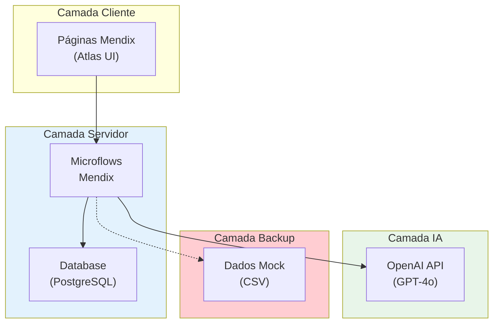

# 🎯 Low Hack 2026 — 5° Edição: Siemens & Mendix platform.

```
 __      __                  __             ________                       .___.__
/  \    /  \_____    _______/  |_  ____    /  _____/ __ _______ _______  __| _/|__|____    ____
\   \/\/   /\__  \  /  ___/\   __\/ __ \  /   \  ___|  |  \__  \\_  __ \/ __ | |  \__  \  /    \
 \        /  / __ \_\___ \  |  | \  ___/  \    \_\  \  |  // __ \|  | \/ /_/ | |  |/ __ \|   |  \
  \__/\  /  (____  /____  > |__|  \___  >  \______  /____/(____  /__|  \____ | |__(____  /___|  /
       \/        \/     \/            \/          \/           \/           \/         \/     \/
```


</div>

---

> **💡 O que é isso?** Copiloto IA para redução de desperdício na indústria F&B, desenvolvido em Mendix + GenAI.
> **🏆 Por que participar?** Vitrine Siemens/TrueChange, R$ 8.000 de prêmio, portfólio Mendix + OpenAI.

---

## 🚀 Guia Rápido — Por Quem Você É?

Escolha seu caminho baseado na sua função no time:

| Se Você é...                | Vá Para...                                               |  Tempo  |
| ----------------------------- | --------------------------------------------------------- | :-----: |
| **Rodrigo (Tech Lead)** | [🎯 Guia do Rodrigo](#-rodrigo-jeronimo--tech-lead--backend) |  80min  |
| **Wesley (Business)**   | [🎯 Guia do Wesley](#-wesley-vitor--business--strategy)      |  80min  |
| **Matheus (Coord/PO)**  | [🎯 Guia do Matheus](#-matheus-mendes--coordinator--po)      | 5-30min |
| **Novo no projeto?**    | [📚 Nível 2: Onboarding](#-nível-2-onboarding-rápido)     |  5min  |

---

## 👥 Equipe

| Integrante                 | GitHub                                                | LinkedIn                                                       | Papel             |
| :------------------------- | :---------------------------------------------------- | :------------------------------------------------------------- | :---------------- |
| **Wesley Vitor**     | [@CodeByWesley](https://github.com/CodeByWesley)         | [LinkedIn](https://www.linkedin.com/in/wesleymendoncabr)          | Business/Strategy |
| **Matheus Mendes**   | [@matheusmendes720](https://github.com/matheusmendes720) | [LinkedIn](https://www.linkedin.com/in/matheus-mendes-36ba58214/) | Coord/PO          |
| **Rodrigo Jeronimo** | [@TheRodrig0](https://github.com/TheRodrig0)             | [LinkedIn](https://www.linkedin.com/in/rodrigo-jeronimo-qs)       | Tech Lead         |

---

## 🚀 Guia Personalizado por Membro

### 🎯 Rodrigo Jeronimo — Tech Lead / Backend

> **Foco:** Arquitetura, API, integração OpenAI, lógica de sistema

**Caminho de Leitura:**

| # | Documento                                                                                                 | Por Que              | Tempo |
| :-: | --------------------------------------------------------------------------------------------------------- | -------------------- | :---: |
| 1 | **[base/docs/SYSTEM-DESIGN.md](base/docs/SYSTEM-DESIGN.md)**                                                     | Arquitetura completa | 30min |
| 2 | **[base/scaffolding/tech/04-rest-api-microflow-logic.md](base/scaffolding/tech/04-rest-api-microflow-logic.md)** | REST API detail      | 15min |
| 3 | **[base/scaffolding/tech/02-genai-prompts.md](base/scaffolding/tech/02-genai-prompts.md)**                       | Prompt engineering   | 10min |
| 4 | **[base/scaffolding/tech/01-mendix-domain-model.md](base/scaffolding/tech/01-mendix-domain-model.md)**           | Domain model         | 15min |
| 5 | **[base/scaffolding/tech/05-test-openai-script.js](base/scaffolding/tech/05-test-openai-script.js)**             | Test script          | 10min |

**Tasks:** Config REST Call → Test OpenAI → Fallback strategy → Microflow errors → Deploy stress

**💡 Dica:** SYSTEM-DESIGN = sua bíblia técnica!

---

### 🎯 Wesley Vitor — Business / Strategy

> **Foco:** Pesquisa mercado, modelo negócio, diferenciação

**Caminho de Leitura:**

| # | Documento                                                                                                       | Por Que          | Tempo |
| :-: | --------------------------------------------------------------------------------------------------------------- | ---------------- | :---: |
| 1 | **[base/docs/PRODUCT-DESIGN.md](base/docs/PRODUCT-DESIGN.md)**                                                         | Produto completo | 30min |
| 2 | **[base/docs/README-final-submission.md](base/docs/README-final-submission.md)**                                       | Econometrics     | 15min |
| 3 | **[base/scaffolding/business/02-industrial-intelligence.md](base/scaffolding/business/02-industrial-intelligence.md)** | Dados F&B        | 15min |
| 4 | **[base/scaffolding/business/01-business-model-canvas.md](base/scaffolding/business/01-business-model-canvas.md)**     | Business canvas  | 10min |
| 5 | **[base/scaffolding/business/03-sponsor-econometrics.md](base/scaffolding/business/03-sponsor-econometrics.md)**       | ROI Siemens      | 10min |

**Tasks:** Validar pesquisa → Modelo B2B → Métricas pitch → Diferenciação → Defense banca

**💡 Dica:** PRODUCT-DESIGN = sua arma competitiva!

---

### 🎯 Matheus Mendes — Coordinator / PO

> **Foco:** Visão geral, coordenação, todas áreas

**Caminho Completo:**

| # | Documento                                                                                           | Por Que      | Tempo |
| :-: | --------------------------------------------------------------------------------------------------- | ------------ | :---: |
| 1 | **README.md**                                                                                 | Visão geral | 5min |
| 2 | **[base/docs/ROADMAP.md](base/docs/ROADMAP.md)**                                                           | Cronograma   | 15min |
| 3 | **[base/strategy/low-hack-2026-resumo-estrategico.md](base/strategy/low-hack-2026-resumo-estrategico.md)** | Resumo       | 10min |
| 4 | **[base/docs/SYSTEM-DESIGN.md](base/docs/SYSTEM-DESIGN.md)**                                               | Arquitetura  | 20min |
| 5 | **[base/docs/PRODUCT-DESIGN.md](base/docs/PRODUCT-DESIGN.md)**                                             | Produto      | 20min |

**Caminho Express (5min):**

1. **[base/docs/README-final-submission.md](base/docs/README-final-submission.md)** ← TUDO resumido!
2. **[base/strategy/low-hack-2026-resumo-estrategico.md](base/strategy/low-hack-2026-resumo-estrategico.md)** ← Checklist

**Tasks:** Coordenar → Compliance → Revisar submissão → Links → Deadline control

**💡 Dica:** README-final-submission = seu atalho!

---

### 📚 Leitura Extra por Área

| Área              | Docs                                                                                                                                                       |
| ------------------ | ---------------------------------------------------------------------------------------------------------------------------------------------------------- |
| **Mendix**   | [base/scaffolding/tech/00-mendix-bootcamp-fast-track.md](base/scaffolding/tech/00-mendix-bootcamp-fast-track.md), [base/scaffolding/tech/03-mendix-ui-wireframes.md](base/scaffolding/tech/03-mendix-ui-wireframes.md) |
| **Pitch**    | [base/scaffolding/pitch/roteiro-video-3min.md](base/scaffolding/pitch/roteiro-video-3min.md), [base/scaffolding/pitch/02-qna-defense-playbook.md](base/scaffolding/pitch/02-qna-defense-playbook.md)                     |
| **Dados**    | [base/scaffolding/tech/mock-dataset-industria-alimentos.csv](base/scaffolding/tech/mock-dataset-industria-alimentos.csv)                                                                 |
| **Timeline** | [base/scaffolding/01-playbook-tatica.md](base/scaffolding/01-playbook-tatica.md), [base/scaffolding/02-cronograma-de-ataque.md](base/scaffolding/02-cronograma-de-ataque.md)                                 |

---

## 📑 Navegação por Nível de Relevância

Escolha seu ponto de entrada baseado no tempo disponível:

|                      Nível                      |  Tempo  | Para Quem       | Conteúdo                                  |
| :-----------------------------------------------: | :-----: | :-------------- | :----------------------------------------- |
|   **[Nível 1](#-nível-1-executive-brief)**   |  1 min  | Qualquer pessoa | Badge + Resumo em 1 linha + Link principal |
| **[Nível 2](#-nível-2-onboarding-rápido)** |  5 min  | Novos membros   | Resumo executivo + Links rápidos          |
|    **[Nível 3](#-nível-3-contribuidor)**    | 15 min | Contribuidores  | Guia de contribuição + Tarefas por papel |
| **[Nível 4](#-nível-4mergulhador-profundo)** | 1+ hora | Desenvolvedores | Índice completo + Arquitetura             |

---

## 🏃 Quick Start (Nível 1)

```bash
# 🚀 Pronto para contribuir em 3 passos:

1. 📋 Leia o [Resumo Executivo](base/strategy/low-hack-2026-resumo-estrategico.md)
2. 💻 Configure seu ambiente: [Tech Bootcamp](base/scaffolding/tech/00-mendix-bootcamp-fast-track.md)
3. 🎬 Revise o [PitchScript](base/scaffolding/pitch/roteiro-video-3min.md)
```

### Resumo em 1 Linha

**Waste Guardian** é uma aplicação web em Mendix que usa inteligência artificial (OpenAI) para analisar dados de desperdício em linhas de produção de alimentos e bebidas, gerando recomendações priorizadas para redução de perdas operacionais — alinhado às ODS 9 e 12 da ONU.

---

## 📚 Nível 2: Onboarding Rápido

### 🎯 O Que Preciso Saber Antes de Começar?

| Pergunta                         | Resposta Rápida                                              |
| -------------------------------- | ------------------------------------------------------------- |
| **Qual o evento?**         | Low Hack 2026 — Hackathon Siemens/Mendix                     |
| **Quando?**                | 18-19 de Abril de 2026                                        |
| **Qual a tese?**           | "Waste Guardian" — Copiloto de redução de desperdício F&B |
| **Qual o stack?**          | Mendix (Low-code) + OpenAI API (GenAI)                        |
| **Quanto podemos ganhar?** | 1º Lugar: R$ 8.000                                           |
| **Requisitos mínimos?**   | 3 páginas, CRUD, GenAI, Microflow                            |

### 📂 Arquivo de Contexto (Leitura Obrigatória)

| Documento                                                                  | Prazo | Responsável |
| -------------------------------------------------------------------------- | ----- | ------------ |
| **[Resumo Estratégico](base/strategy/low-hack-2026-resumo-estrategico.md)** | Agora | Todos        |
| **[Roadmap Maestro](base/docs/ROADMAP.md)**                                  | Hoje  | PO           |
| **[Design de Sistema](base/docs/SYSTEM-DESIGN.md)**                          | Hoje  | Tech Lead    |

### 🎬 Preparação Visual

1. **Entenda o problema:** Leia [Industrial Intelligence](base/scaffolding/business/02-industrial-intelligence.md)
2. **Veja a solução:** Explore [UI Wireframes](base/scaffolding/tech/03-mendix-ui-wireframes.md)
3. **Assista o pitch anterior:** [Roteiro Video 3min](base/scaffolding/pitch/roteiro-video-3min.md)

---

## 🤝 Nível 3: Guia do Contribuidor

### 🔧 Como Contribuir com Este Projeto

#### 1. fork e Clone

```bash
# Clone o repositório (substitua pela URL real quando disponível)
git clone https://github.com/<SEU-USUARIO>/lowhack_2026-hackaton.git
cd lowhack_2026-hackaton

# Adicione o repositório original como upstream
git remote add upstream https://github.com/matheusmendes720/lowhack_2026-hackaton.git
```

#### 2. Criar Branch

```bash
# Atualize sua branch main
git checkout main
git pull upstream main

# Crie uma nova branch para sua funcionalidade
git checkout -b feature/minha-nova-funcionalidade

# Ou para documentação
git checkout -b docs/novo-documento

# Ou para correção
git checkout -b fix/correcao-descricao
```

#### 3. Convenções de Nomenclatura

| Tipo                        | Prefixo          | Exemplo                       |
| --------------------------- | ---------------- | ----------------------------- |
| **Nova feature**      | `feature/`     | `feature/genai-integration` |
| **Correção de bug** | `fix/`         | `fix/api-timeout`           |
| **Documentação**    | `docs/`        | `docs/readme-update`        |
| **Melhoria**          | `improvement/` | `improvement/ui-refactor`   |
| **Refatoração**     | `refactor/`    | `refactor/domain-model`     |

#### 4. Fazer Commit

```bash
# Stage das mudanças
git add .

# Commit com mensagem descritiva
git commit -m "feat: adiciona integração com OpenAI API

- Adiciona REST call para GPT-4o
- Implementa prompt system para recomendações
- Adiciona tratamento de erros com fallback

Closes #123"

# Envie para seu fork
git push origin feature/minha-nova-funcionalidade
```

#### 5. Criar Pull Request

1. Vá para o repositório no GitHub
2. Clique em **"Compare & pull request"**
3. Preencha o template:
   - **Título:** Use o prefixo correto (`feat:`, `fix:`, etc.)
   - **Descrição:** Explique o que foi feito e por quê
   - **Checks:** Marque se applicable:
     - [ ] Testes adicionados
     - [ ] Documentação atualizada
     - [ ] Funciona localmente
4. Solicite revisão de pelo menos 1 membro

### 🐛 Como Abrir Issues

#### Template de Bug Report

```markdown
## 🐛 Descrição do Bug
[Descrição clara e concisa do que está acontecendo]

## 📋 Passos para Reproduzir
1. Vá para '...'
2. Clique em '...'
3. See o erro...

## 🤔 Comportamento Esperado
[O que deveria acontecer]

## 🖥️ Screenshots
[Se aplicável, adicione screenshots]

## 📎 Contexto Adicional
[Qualquer outro contexto sobre o problema]

## 🏷️ Labels Sugeridas
- bug
- priority: high
- needs: triage
```

#### Template de Feature Request

```markdown
## 🚀 Feature Request
[Descrição da funcionalidade desejada]

## 🤔 Por que isso é necessário?
[Explique o problema que essa feature resolveria]

## 💡 Solução Proposta
[Sugira uma abordagem ou ideia]

## 📎 Contexto Adicional
[Qualquer outro contexto ou screenshot]
```

### 💬 Como Usar Discussions

| Categoria               | Quando Usar                                         |
| ----------------------- | --------------------------------------------------- |
| **Q&A**           | Tem dúvidas sobre o projeto ou preciso de ajuda    |
| **Ideas**         | Sugerir novas funcionalidades ou abordagens         |
| **General**       | Conversas que não se encaixam em outras categorias |
| **Show and Tell** | Mostrar algolegal que você builtou                 |

### ✅ Código de Conduta do Contribuidor

1. **Seja respeitoso** — Todos estamos aqui para aprender
2. **Seja paciente** — Juniors precisam de tempo para entender
3. **Seja construtivo** — Críticas devemser direcionadas ao código, não à pessoa
4. **Peça ajuda** — É melhor perguntar do que ficar preso
5. **Documente** — Comente seu código e atualize READMEs

---

## 📋 Tarefas por Papel e Experiência

### 💻 Backend / API Developer

| Nível           | Tarefas                                               | Docs de Referência                                                            |
| ---------------- | ----------------------------------------------------- | ------------------------------------------------------------------------------ |
| **Junior** | Testar script Node.js com API, Validar respostas JSON | [05-test-openai-script.js](scaffolding/tech/05-test-openai-script.js)             |
| **Mid**    | Engenharia de prompts, Ajuste de parâmetros API      | [02-genai-prompts.md](scaffolding/tech/02-genai-prompts.md)                       |
| **Senior** | Arquitetura de integração, Fallback strategy        | [04-rest-api-microflow-logic.md](scaffolding/tech/04-rest-api-microflow-logic.md) |

### 🎨 Frontend / Mendix Developer

| Nível           | Tarefas                                               | Docs de Referência                                                                |
| ---------------- | ----------------------------------------------------- | ---------------------------------------------------------------------------------- |
| **Junior** | Criar páginas simples em Mendix, Testar navegação  | [00-mendix-bootcamp-fast-track.md](scaffolding/tech/00-mendix-bootcamp-fast-track.md) |
| **Mid**    | Implementar Domain Model, Configurar entidades        | [01-mendix-domain-model.md](scaffolding/tech/01-mendix-domain-model.md)               |
| **Senior** | Desenhar arquitetura completa, Implementar Microflows | [SYSTEM-DESIGN.md](docs/SYSTEM-DESIGN.md)                                             |

### 🎭 Designer / Criativo

| Nível           | Tarefas                                           | Docs de Referência                                                    |
| ---------------- | ------------------------------------------------- | ---------------------------------------------------------------------- |
| **Junior** | Revisar wireframes, Sugerir melhorias visuais     | [03-mendix-ui-wireframes.md](scaffolding/tech/03-mendix-ui-wireframes.md) |
| **Mid**    | Criar style guide Dark Mode, Design do pitch deck | [Atlas UI Resources](scaffolding/tech/03-mendix-ui-wireframes.md)         |
| **Senior** | Direction criativa do pitch, Brand messaging      | [Pitch Scripts](scaffolding/pitch/roteiro-video-3min.md)                  |

### 📊 Data Analyst / Pesquisador

| Nível           | Tarefas                                                | Docs de Referência                                                              |
| ---------------- | ------------------------------------------------------ | -------------------------------------------------------------------------------- |
| **Junior** | Pesquisar dados da indústria F&B, Compilar benchmarks | [02-industrial-intelligence.md](scaffolding/business/02-industrial-intelligence.md) |
| **Mid**    | Criar métricas de impacto, Definir KPIs               | [03-sponsor-econometrics.md](scaffolding/business/03-sponsor-econometrics.md)       |
| **Senior** | Desenvolver tese estatística, Análise de viabilidade | [PRODUCT-DESIGN.md](docs/PRODUCT-DESIGN.md)                                         |

### 💼 Business / Estratégia

| Nível           | Tarefas                                            | Docs de Referência                                                                                                  |
| ---------------- | -------------------------------------------------- | -------------------------------------------------------------------------------------------------------------------- |
| **Junior** | Pesquisar mercado, Compilar informações          | [01-business-model-canvas.md](scaffolding/business/01-business-model-canvas.md)                                         |
| **Mid**    | Modelar negócio B2B, Definir precificação       | [PRODUCT-DESIGN.md](docs/PRODUCT-DESIGN.md)                                                                             |
| **Senior** | Criar roteiro de pitch executivo, Defense na banca | [Pitch Scripts](scaffolding/pitch/roteiro-video-3min.md), [Q&amp;A Playbook](scaffolding/pitch/02-qna-defense-playbook.md) |

---

## 🏗️ Visão Geral da Arquitetura



---

## 📁 Estrutura do Projeto (Codebase Organization)

Para manter o time organizado durante a maratona de desenvolvimento, sugerimos a seguinte estrutura de pastas e arquivos:

```
lowhack_2026/
│
├── 📂 src/                              ← Código Fonte do Projeto
│   ├── 📂 modules/                     ← Módulos Mendix
│   │   ├── 📂 WasteGuardian_Core/     ← Módulo Principal
│   │   │   ├── 📂 domain/
│   │   │   │   ├── linhaProducao.entity.json
│   │   │   │   ├── eventoDesperdicio.entity.json
│   │   │   │   ├── indicadorSustentabilidade.entity.json
│   │   │   │   └── acaoRecomendada.entity.json
│   │   │   │
│   │   │   ├── 📂 microflows/
│   │   │   │   ├── mf_registrarEventoDesperdicio.mflow.json
│   │   │   │   ├── mf_calcularIndicadores.mflow.json
│   │   │   │   └── mf_gerarPlanoAcaoGenAI.mflow.json
│   │   │   │
│   │   │   ├── 📂 nanoflows/
│   │   │   │   └── nf_loadGenAI.nflow.json
│   │   │   │
│   │   │   ├── 📂 pages/
│   │   │   │   ├── pg_visaoGeral.page.json
│   │   │   │   ├── pg_detalheLinha.page.json
│   │   │   │   └── pg_planoAcao.page.json
│   │   │   │
│   │   │   ├── 📂 navigation/
│   │   │   │   └── navigation.json
│   │   │   │
│   │   │   └── 📂 constants/
│   │   │       └── enumerations.json
│   │   │
│   │   └── 📂 _protected/              ← Módulos protegidos
│   │       └── Administration/
│   │
│   ├── 📂 theme/                       ← Tema e Estilos
│   │   ├── 📂 layouts/
│   │   ├── 📂 buildingBlocks/
│   │   └── 📂 widgets/
│   │
│   └── 📂 deployment/                  ← Configurações Deploy
│       └── mendix-cloud-config.json
│
├── 📂 scripts/                         ← Scripts e Utilitários
│   ├── 📂 api/
│   │   ├── test-openai-connection.js   ← Teste API OpenAI
│   │   ├── prompt-generator.js         ← Gerador de prompts
│   │   └── api-health-check.js        ← Health check
│   │
│   ├── 📂 data/
│   │   ├── mock-dataset-generator.js   ← Gera dados mock
│   │   └── data-validator.js            ← Validador CSV
│   │
│   └── 📂 build/
│       └── build-and-deploy.js         ← Automação deploy
│
├── 📂 docs/                            ← Documentação do Projeto
│   ├── 📂 architecture/
│   │   ├── system-design.md
│   │   ├── data-model.md
│   │   └── api-spec.md
│   │
│   ├── 📂 guides/
│   │   ├── getting-started.md
│   │   ├── setup-environment.md
│   │   └── troubleshooting.md
│   │
│   └── 📂 api/
│       └── openai-api-reference.md
│
├── 📂 tests/                           ← Testes e Validação
│   ├── 📂 integration/
│   │   ├── api-integration.test.js
│   │   └── mendix-crud.test.js
│   │
│   ├── 📂 e2e/
│   │   └── user-journeys.test.js
│   │
│   └── 📂 mocks/
│       ├── mock-events.json
│       └── mock-lines.json
│
├── 📂 assets/                          ← Recursos Visuais
│   ├── 📂 images/
│   │   ├── wireframes/
│   │   ├── screenshots/
│   │   └── diagrams/
│   │
│   ├── 📂 videos/
│   │   └── pitch-recordings/
│   │
│   └── 📂 icons/
│
└── 📂 config/                          ← Configurações Globais
    ├── .env.example
    ├── constants.js
    └── package.json
```

---

## 🗂️ Estrutura Detalhada por Fase (Cronograma de Desenvolvimento)

### 📋 Fase 1: Setup (Antes de 18/04)

```
📁准备工作/
├── setup-mendix-studio/
│   └── INSTRUCOES.md
│
├── setup-openai-api/
│   └── API_KEY_SETUP.md
│
└── setup-github/
    └── REPO_SETUP.md
```

### ⚔️ Fase 2: Desenvolvimento Sábado (18/04)

```
📁 Saturday_Development/
├── Morning_Block/
│   ├── 09-10_domain-model/      ← Criar entidades
│   └── 10-12_basic-pages/       ← 3 páginas base
│
├── Afternoon_Block/
│   ├── 12-14_crud-operations/   ← CRUD completo
│   └── 14-18_microflows/        ← Lógica de negócio
│
└── Night_Block/
    └── 18-22_genai-integration/ ← Integração OpenAI
```

### 🎯 Fase 3: Desenvolvimento Domingo (19/04)

```
📁 Sunday_Development/
├── Morning_Block/
│   ├── 09-11_refinement/       ← Polimento UI
│   └── 11-13_testing/          ← Testes finais
│
├── Afternoon_Block/
│   ├── 13-15_deploy/            ← Deploy Cloud
│   └── 15-17_documentation/      ← README + docs
│
└── Night_Block/
    ├── 17-19_pitch-recording/   ← Gravar pitch
    ├── 19-21_final-review/     ← Revisão final
    └── 21-2159_submission/      ← SUBMISSÃO!
```

---

## 🛠️ Padrões de Código e Convenções

### 📝 Nomeclatura de Arquivos

| Tipo                | Padrão                       | Exemplo                           |
| ------------------- | ----------------------------- | --------------------------------- |
| **Entidade**  | `nomeEntidade.entity.json`  | `eventoDesperdicio.entity.json` |
| **Microflow** | `mf_nomeDoFluxo.mflow.json` | `mf_registrarEvento.mflow.json` |
| **Nanoflow**  | `nf_nomeDoFluxo.nflow.json` | `nf_loadGenAI.nflow.json`       |
| **Página**   | `pg_nomeDaPagina.page.json` | `pg_visaoGeral.page.json`       |
| **Script**    | `nome-descritivo.js`        | `test-openai-connection.js`     |

### 🔧 Estrutura de Microflow (Template)

```javascript
// mf_TEMPLATE.mflow.json
{
  "name": "MF_NomeDoMicroflow",
  "type": "microflow",
  "parameters": [
    { "name": "paramEntrada", "type": "String" }
  ],
  "returns": { "name": "resultado", "type": "Boolean" },
  "documentation": "Breve descrição do que este microflow faz",
  "elements": [
    // 1. Validar Entrada
    // 2. Buscar Dados
    // 3. Processar
    // 4. Salvar
    // 5. Retornar
  ]
}
```

### 📦 Estrutura de REST Call (Config)

```javascript
// openai-rest-call.json
{
  "name": "REST_OpenAI_GenAI",
  "url": "https://api.openai.com/v1/chat/completions",
  "method": "POST",
  "headers": {
    "Authorization": "Bearer ${{OPENAI_API_KEY}}",
    "Content-Type": "application/json"
  },
  "timeout": 30000,
  "retry": {
    "maxAttempts": 3,
    "backoff": "exponential"
  }
}
```

---

## 🎯 Checklist de Início de Desenvolvimento

### ✅ Setup Primeiro Dia (18/04 - Manhã)

| # | Item                                  | Responsável | Status |
| - | ------------------------------------- | ------------ | ------ |
| 1 | Abrir Mendix Studio Pro               | Tech Lead    | ⬜     |
| 2 | Criar projeto base                    | Tech Lead    | ⬜     |
| 3 | Configurar Domain Model (5 entidades) | Rodrigo      | ⬜     |
| 4 | Criar 3 páginas navegação básica  | Todos        | ⬜     |
| 5 | Testar CRUD básico                   | Todos        | ⬜     |
| 6 | Configurar REST Call OpenAI           | Rodrigo      | ⬜     |

### 🎯 Meta Final (19/04 - 21:59)

- [ ] App funcionando no Mendix Cloud
- [ ] GenAI integrada e funcional
- [ ] Video pitch gravado (≤3 min)
- [ ] Pasta de entrega organizada
- [ ] Link submission enviado

---

> **💡 Dica do Arquiteto:** *"Não tente fazer tudo perfeito. Faça funcionar primeiro, refine depois."*

---

**Para mais detalhes técnicos, consulte [base/docs/SYSTEM-DESIGN.md](base/docs/SYSTEM-DESIGN.md)**

---

## 📂 Estrutura Completa de Documentos

```
lowhack_2026/
├── 📄 README.md                          ← VOCÊ ESTÁ AQUÍ
├── 📂 base/
│   ├── 📋 INDEX.md                       ← Hub principal
│   ├── 📋 note-index.md                  ← Painel de controle
│   │
│   ├── 📂 docs/                          ← Documentos Maestro
│   │   ├── 📄 INDEX.md                   ← Índice dos masters
│   │   ├── 📄 ROADMAP.md                 ← Timeline completo
│   │   ├── 📄 SYSTEM-DESIGN.md           ← Arquitetura técnica
│   │   └── 📄 PRODUCT-DESIGN.md          ← Design de produto
│   │
│   ├── 📂 strategy/                      ← Estratégia
│   │   ├── 📄 INDEX.md
│   │   ├── 📄 low-hack-2026-resumo-estrategico.md
│   │   └── 📄 low-hack-2026-analise-estrategica-completa.md
│   │
│   ├── 📂 tech/                          ← Tecnologia
│   │   └── 📄 INDEX.md
│   │
│   ├── 📂 pitch/                         ← Apresentação
│   │   └── 📄 INDEX.md
│   │
│   ├── 📂 business/                      ← Negócio
│   │   └── 📄 INDEX.md
│   │
│   └── 📂 scaffolding/                   ← Scaffolding (detalhado)
│       ├── 📂 tech/
│       │   ├── 📄 00-mendix-bootcamp-fast-track.md
│       │   ├── 📄 01-mendix-domain-model.md
│       │   ├── 📄 02-genai-prompts.md
│       │   ├── 📄 03-mendix-ui-wireframes.md
│       │   ├── 📄 04-rest-api-microflow-logic.md
│       │   ├── 📄 05-test-openai-script.js
│       │   └── 📄 mock-dataset-industria-alimentos.csv
│       │
│       ├── 📂 pitch/
│       │   ├── 📄 roteiro-video-3min.md
│       │   └── 📄 02-qna-defense-playbook.md
│       │
│       ├── 📂 business/
│       │   ├── 📄 01-business-model-canvas.md
│       │   ├── 📄 02-industrial-intelligence.md
│       │   └── 📄 03-sponsor-econometrics.md
│       │
│       ├── 📂 docs/
│       │   └── 📄 README-final-submission.md
│       │
│       ├── 📄 01-playbook-tatica.md
│       ├── 📄 02-cronograma-de-ataque.md
│       └── 📄 LowHack_2026_Full_Strategy.md
```

---

## 🔗 Links Rápidos

| Categoria                  | Link                                                                                      | Descrição       |
| -------------------------- | ----------------------------------------------------------------------------------------- | ----------------- |
| **🏠 Hub Principal** | [base/INDEX.md](base/INDEX.md)                                                                         | Ponto de entrada  |
| **📅 Cronograma**    | [base/docs/ROADMAP.md](base/docs/ROADMAP.md)                                                           | Timeline completo |
| **🏗️ Arquitetura** | [base/docs/SYSTEM-DESIGN.md](base/docs/SYSTEM-DESIGN.md)                                               | Design técnico   |
| **📦 Produto**       | [base/docs/PRODUCT-DESIGN.md](base/docs/PRODUCT-DESIGN.md)                                             | Design de produto |
| **📋 Requisitos**    | [base/strategy/low-hack-2026-resumo-estrategico.md](base/strategy/low-hack-2026-resumo-estrategico.md) | Checklist         |
| **💻 Tech**          | [base/tech/INDEX.md](base/tech/INDEX.md)                                                               | Guias técnicos   |
| **🎬 Pitch**         | [base/pitch/INDEX.md](base/pitch/INDEX.md)                                                             | Scripts           |
| **💼 Business**      | [base/business/INDEX.md](base/business/INDEX.md)                                                       | Modelo            |


---

## 📜 Licença

Este projeto é para fins educacionais e de competição. Veja o [LICENSE](LICENSE) para detalhes.

---

## 🙏 Agradecimentos

- **Siemens Industry Software** — Promotor do evento
- **TrueChange** — Parceiro tecnológico Mendix
- **Comunidade Hackathon Brasil** — Organização
- **OpenAI** — tecnologia de IA
- **Você** — por contribuir! 🚀

---

<div align="center">

*Made with ❤️ by Waste Guardian Team*

*Última atualização: 31 de Março de 2026*

</div>
petição. Veja o [LICENSE](LICENSE) para detalhes.

---

## 🙏 Agradecimentos

- **Siemens Industry Software** — Promotor do evento
- **TrueChange** — Parceiro tecnológico Mendix
- **Comunidade Hackathon Brasil** — Organização
- **OpenAI** — tecnologia de IA
- **Você** — por contribuir! 🚀

---

<div align="center">

*Made with ❤️ by Waste Guardian Team*

*Última atualização: 31 de Março de 2026*

</div>
