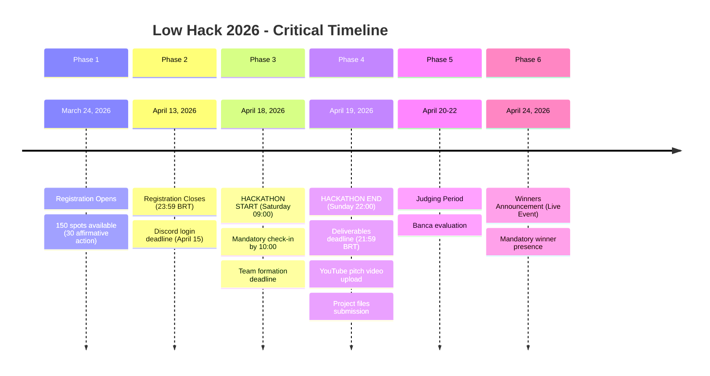
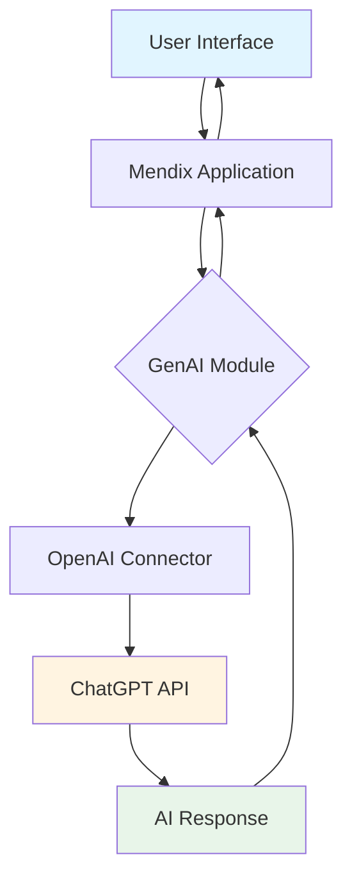
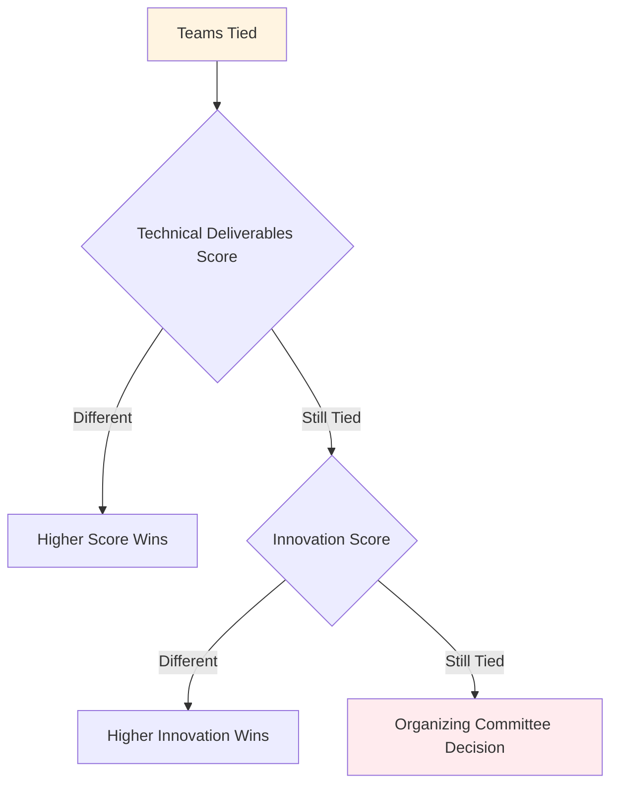
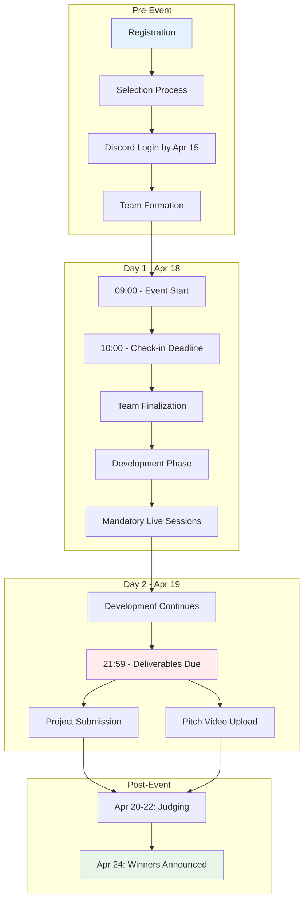

# Low Hack 2026 - Regulation Index

> **Official Regulation Document**  
> **Source:** https://hackathonbrasil.com.br/low-hack/  
> **Regulation PDF:** https://hackathonbrasil.com.br/wp-content/uploads/2026/03/regulamento-low-hack-2026-online.docx.pdf  
> **Last Updated:** March 2026

---

## 📋 Executive Summary

Low Hack 2026 is the **5th edition** of an online, free hackathon promoted by **Siemens Industry Software** in partnership with **TrueChange**, curated by **Comunidade Hackathon Brasil**. The event challenges participants to develop innovative solutions using **Mendix low-code platform** combined with **OpenAI GenAI capabilities**.

**Theme:** "How can we develop innovative solutions that encourage conscious consumption and responsible production practices, reducing waste, promoting efficient resource use, and stimulating more sustainable models throughout the value chain?"

**Alignment:** UN Sustainable Development Goals - **ODS 9** (Industry, Innovation & Infrastructure) and **ODS 12** (Responsible Consumption & Production)

---

## 🗓️ Critical Dates Timeline

### Detailed Date Breakdown

| Date | Event | Critical Level | Notes |
|------|-------|----------------|-------|
| March 24, 2026 | Registration Opens | 🔴 High | Limited to 150 participants |
| April 13, 2026 | Registration Closes | 🔴 High | 23:59 BRT deadline |
| April 15, 2026 | Discord Login Deadline | 🔴 High | Non-compliance = cancellation |
| April 18, 2026 | Event Start | 🔴 CRITICAL | 09:00 BRT - Login required by 10:00 |
| April 19, 2026 | Deliverables Due | 🔴 CRITICAL | 21:59 BRT - Hard deadline |
| April 24, 2026 | Winners Announced | 🟡 Medium | Live event - Winners must attend |

---

## 🎯 Challenge Scope

### Primary Challenge Statement

> **"How can we develop innovative solutions that encourage conscious consumption and responsible production practices, reducing waste, promoting efficient resource use, and stimulating more sustainable models throughout the value chain?"**

### Permitted Solution Areas

Teams may develop prototypes and ideas that use technology to:

1. **Accelerate digital transformation in industry**
2. **Make production processes more efficient and intelligent**
3. **Reduce waste and optimize resource use**
4. **Encourage more responsible production and consumption practices**
5. **Create digital solutions that support more sustainable production chains**

### Technology Stack Requirements

| Component | Requirement | Mandatory |
|-----------|-------------|-----------|
| Development Platform | Mendix Low-Code | ✅ Yes |
| Application Type | 100% Web Application | ✅ Yes |
| GenAI Integration | OpenAI (ChatGPT API provided) | ✅ Yes |
| Hosting | Mendix Cloud (Free Tier) | ✅ Yes |
| Code Pre-development | Prohibited | 🚫 No |

---

## 📝 Technical Requirements & Constraints

### Mandatory Technical Specifications

#### 1. Application Structure

| Requirement | Specification | Notes |
|-------------|---------------|-------|
| **Minimum Pages** | 3+ navigable pages | Example: Home, Main Feature, Results |
| **Data Persistence** | Entities in Domain Model | CRUD operations required |
| **Microflows** | At least 1 functional microflow or nanoflow | Core business logic |
| **Responsiveness** | Minimally responsive interface | Mobile/tablet compatible |
| **UI/UX Quality** | Attractive interface | Professional appearance |

#### 2. GenAI Integration Requirements

**GenAI Integration Must Include:**
- Utilization of provided OpenAI/ChatGPT API
- Functional integration (not just decorative)
- Proper error handling
- Clear user feedback

#### 3. Deliverables Checklist

##### Documentation Deliverables (Section 8.2.2)

| Item | Description | Deadline | Format |
|------|-------------|----------|--------|
| Project Files | Complete Mendix project | Apr 19, 21:59 BRT | Folder with team name |
| App Link | Published Mendix Cloud URL | Apr 19, 21:59 BRT | Working link |
| Domain Model | Entity relationship diagram | Included in project | Mendix model |

##### Pitch Video Requirements (Section 8.2.3)

| Specification | Requirement |
|---------------|-------------|
| **Duration** | Maximum 3 minutes |
| **Format** | Video recording |
| **Upload Platform** | YouTube (Unlisted) |
| **Link Submission** | `link-do-video-pitch.txt` in deliverables folder |
| **Deadline** | April 19, 2026, 21:59 BRT |

**Pitch Content Recommendations:**
- Problem statement (20 seconds)
- Solution demonstration (60 seconds)
- GenAI integration showcase (30 seconds)
- Business model & scalability (30 seconds)
- Innovation highlights (20 seconds)
- Team introduction (20 seconds)

---

## 🚫 Disqualification Rules

### Absolute Disqualification Offenses

| Rule | Section | Severity |
|------|---------|----------|
| **Non-Mendix Platform** | 8.4 | 🔴 CRITICAL - Automatic disqualification |
| **Pre-developed Solutions** | 11.9 | 🔴 CRITICAL - Solutions developed before Day 1 |
| **Plagiarism/Copyright Violation** | 11.9 | 🔴 CRITICAL - Copying from other sources |
| **Missed Mandatory Live Sessions** | 4.9 | 🔴 HIGH - At least 1 member must attend |
| **Discord Absence** | 4.3 | 🔴 HIGH - Not logged in by 10:00 on Apr 18 |
| **Winner Absence at Live Announcement** | 8.3.2 | 🟡 MEDIUM - Winners must attend live event |

### Conduct-Related Disqualification

| Violation | Section | Consequence |
|-----------|---------|-------------|
| Disrespect to organizers/volunteers | 4.8 | Immediate removal + disqualification |
| Harassment (any form) | 10.1-10.2 | Immediate removal + disqualification |
| Unethical behavior | 11.8 | Evaluation by organizing committee |
| Inappropriate content | 10.3.2 | Disqualification + legal action |

### Technical Disqualification

| Violation | Details |
|-----------|---------|
| Missing deliverables | Failure to submit by April 19, 21:59 BRT |
| Non-functional application | App not running on Mendix Cloud |
| Missing GenAI integration | No OpenAI API utilization |
| Incomplete pitch | Video over 3 minutes or missing |
| Wrong submission format | Not following folder/file naming conventions |

---

## 🏆 Prize Structure

| Position | Cash Prize | Additional Benefits |
|----------|------------|---------------------|
| **1st Place** | R$ 8,000.00 | Low Hack gift box + Certificate + Siemens Badge + 1-year Mendix courses (Basic & Intermediate) |
| **2nd Place** | R$ 5,000.00 | Low Hack gift box + Certificate + Siemens Badge + 1-year Mendix courses (Basic & Intermediate) |
| **3rd Place** | R$ 3,000.00 | Low Hack gift box + Certificate + Siemens Badge + 1-year Mendix courses (Basic & Intermediate) |

**Payment Terms:**
- Prize amounts divided equally among team members
- Payment within 30 days after event closure
- Requires bank account information submission

---

## 📊 Scoring Criteria (Judging Rubric)

### Scoring Scale
All criteria scored from **1 to 4 points** (1 = Poor, 4 = Excellent)

### Evaluation Categories

#### 1. **Potential Impact** (8.2.5.a)
- Evaluates the solution's potential impact on the proposed challenge
- Considerations: Scale of impact, feasibility, sustainability

#### 2. **Business Model** (8.2.5.b)
- Assesses business model, scalability, and application to solve the challenge
- Considerations: Revenue model, market viability, growth potential

#### 3. **Challenge Adherence** (8.2.5.c)
- Evaluates whether the solution effectively solves the presented challenge
- Considerations: Problem-solution fit, alignment with ODS 9/12

#### 4. **Solution Innovation** (8.2.5.d)
- Assesses innovation in technology use and/or process change
- Considerations: Novelty, creativity, differentiation

#### 5. **Solution Presentation** (8.2.5.e)
- Evaluates clarity, completeness, and adherence to challenge requirements
- Considerations: Communication quality, demo effectiveness, storytelling

#### 6. **Technical Solution Criteria** (8.2.5.f)
- Assesses application technical quality
- **Key Components:**
  - Application functionality
  - Effective GenAI (ChatGPT API) usage
  - Connector/API integration quality
  - User experience (UX/UI) quality
  - Creativity in technology combination and implementation

### Tie-Breaking Criteria (Section 8.2.7)

**Technical Deliverables Tie-Breaker Components:**
1. Minimally responsive and attractive interface
2. Use of at least 1 functional microflow or nanoflow
3. At least 3 navigable pages (home, main feature, results)
4. Data persistence implementation (entities in domain model)

---

## 👥 Participation Rules

### Eligibility

| Requirement | Details |
|-------------|---------|
| **Nationality** | Brazilian citizens |
| **Age** | 18 years or older |
| **Registration** | 1 registration per CPF |
| **Registration Period** | March 24 - April 13, 2026 |

### Team Composition

| Aspect | Specification |
|--------|---------------|
| **Minimum Size** | 3 people |
| **Maximum Size** | 5 people |
| **Formation** | Pre-formed or organized by committee |
| **Recommended Composition** | 2 developers + 1 designer + 1 business manager |

### Affirmative Action (Section 3.3.1)
- **30 spots** reserved for:
  - Women
  - Black or Indigenous people
  - LGBTQUIAPN+ individuals
  - People with disabilities

### Who CANNOT Participate

- TrueChange employees
- Siemens employees
- Comunidade Hackathon Brasil employees

---

## 🔧 Required Technical Setup

### Participant Requirements

| Item | Requirement |
|------|-------------|
| **Hardware** | Personal laptop/notebook |
| **Internet** | Stable connection |
| **Platform Access** | Mendix account (Free Tier) |
| **Communication** | Discord account |
| **Video Upload** | YouTube account |

### Mendix Platform Setup

1. **Account Creation:** https://www.mendix.com/
   - Note: Corporate emails recommended (Gmail/Yahoo may have issues)
   - Alternative: Use temporary email if needed

2. **Required Modules:**
   - GenAI Commons module
   - OpenAI Connector
   - Encryption module
   - Community Commons module

3. **Mendix Version:** Studio Pro 10.24.0 or above

### OpenAI Integration Setup

- API provided by organizers (ChatGPT API)
- Compatible with OpenAI Platform and Microsoft Foundry
- Supports: Chat Completions, Image Generations, Embeddings

---

## 📜 Code of Conduct & IP

### Code of Conduct Summary

- **Respect:** All participants regardless of race, sex, age, orientation, disability, etc.
- **No Harassment:** Zero tolerance for offensive comments, intimidation, stalking
- **No Sexual Content:** Inappropriate imagery/language prohibited
- **Professional Conduct:** Maintain professional behavior throughout event

### Intellectual Property (Section 10.3)

| Aspect | Rule |
|--------|------|
| **Ownership** | Solutions remain property of creating team |
| **Open Source** | Encouraged but not required |
| **Third-party Content** | Must have proper permissions |
| **Marketing Rights** | Participants grant irrevocable license for promotional use |
| **Originality** | Participant warrants original work and indemnifies organizers |

### Prohibited Content

- Copyrighted material without permission
- False statements
- Illegal, obscene, defamatory content
- Content promoting criminal activities
- Viruses or malicious code
- Plagiarism or reverse engineering

---

## 🔄 Event Workflow

---

## 📚 Historical Context

| Year | Theme |
|------|-------|
| 2021 | Mendix applied to preventive health: vaccination management innovation |
| 2022 | Mendix applied to digital solutions for sustainability, cities, and well-being |
| 2023 | How to digitize environmental processes with Mendix? |
| 2024 | Mendix applied to digital accessibility in Brazilian schools |
| 2026 | Mendix powered by AI applied to industry innovation |

---

## 📞 Support & Communication

### Official Channels

| Channel | Purpose |
|---------|---------|
| **Discord** | Primary communication platform |
| **Email** | contato@hackathonbrasil.com.br |
| **Website** | https://hackathonbrasil.com.br/low-hack |

### Important Communication Rules

- Disable anti-spam for @hackathonbrasil.com.br domain
- All official communication via Discord
- Organizers not responsible for missed info from unofficial channels
- Keep team interactions in official channels for transparency

---

## ⚠️ Legal Considerations

### General Provisions

| Item | Detail |
|------|--------|
| **Event Nature** | Cultural, non-commercial |
| **Organizers' Rights** | Can modify rules and substitute prizes of equal value |
| **Force Majeure** | Event may be interrupted/suspended without compensation |
| **Dispute Resolution** | Organizing committee decisions are sovereign and final |
| **Data Protection** | Subject to LGPD (Brazilian data protection law) |

### Liability

- Participants responsible for their own laptop/equipment
- Organizers not responsible for public/private database usage
- Participants indemnify organizers against IP violation claims

---

## ✅ Pre-Event Checklist

### Before Registration Closes (April 13)

- [ ] Register at Desafios Hackathon Brasil platform
- [ ] Complete all required fields in registration form
- [ ] Confirm eligibility (Brazilian, 18+)
- [ ] Join Discord server by April 15
- [ ] Form or join a team (3-5 members)

### Technical Setup (Before April 18)

- [ ] Create Mendix account (https://www.mendix.com/)
- [ ] Install Mendix Studio Pro 10.24.0+
- [ ] Install required modules (GenAI Commons, OpenAI Connector, etc.)
- [ ] Test Mendix Cloud deployment
- [ ] Create YouTube account for pitch upload
- [ ] Test Discord access and notifications
- [ ] Prepare development environment

### Day 1 Preparation (April 18)

- [ ] Join Discord by 09:00 BRT
- [ ] Complete check-in by 10:00 BRT
- [ ] Attend mandatory live sessions
- [ ] Confirm team composition
- [ ] Begin development

### Day 2 Submission (April 19)

- [ ] Complete application development
- [ ] Test all features thoroughly
- [ ] Deploy to Mendix Cloud
- [ ] Record 3-minute pitch video
- [ ] Upload video to YouTube (Unlisted)
- [ ] Prepare deliverables folder with team name
- [ ] Create `link-do-video-pitch.txt` with YouTube URL
- [ ] Submit all deliverables by 21:59 BRT

---

## 🎯 Success Tips

### For Technical Implementation

1. **Start with Domain Model** - Define your data structure first
2. **Plan Your Microflows** - Sketch business logic before building
3. **Integrate GenAI Early** - Don't leave AI integration for last minute
4. **Test Responsiveness** - Check on multiple screen sizes
5. **Deploy Frequently** - Test Mendix Cloud deployment early

### For Pitch Video

1. **Script First** - Write a 3-minute script and practice
2. **Demo Over Slides** - Show your working app, not just screenshots
3. **Highlight GenAI** - Clearly demonstrate AI integration
4. **Tell a Story** - Problem → Solution → Impact
5. **Quality Audio** - Ensure clear sound in your recording

### Team Collaboration

1. **Define Roles Early** - Who does what in the 48 hours
2. **Use Version Control** - Coordinate Mendix team server usage
3. **Communicate Constantly** - Use Discord for all communication
4. **Have Backup Plans** - Prepare for technical issues
5. **Sleep & Eat** - 48 hours is long; take care of yourselves

---

**Document Version:** 1.0  
**Created:** April 2026  
**Source:** Official Low Hack 2026 Regulation  
**Maintainer:** Competitive Programming Documentation Team
