# 🎯 REAL EXECUTION ROADMAP — Low Hack 2026

> **Documento de Inteligência Estratégica para Execução de Campo**  
> **Evento:** 18-19 de Abril de 2026  
> **Plataforma:** Mendix + OpenAI API  
> **Versão:** Intelligence-Driven Execution Protocol v1.0  
> **Classificação:** 🔴 EYES ONLY — Internal Operations

---

## 🚨 EXECUTIVE SUMMARY

Este documento é a **bíblia operacional** para execução do Low Hack 2026. Diferente do ROADMAP.md padrão, este protocolo incorpora:

- **Inteligência Competitiva prévia** (OSINT, Capital Flow, B.I.)
- **Árvores de decisão com gatilhos de pivô**
- **Protocolos de mitigação de risco**
- **Matriz de alocação de recursos humanos e técnicos**
- **Checkpoints de inteligência** para validação de direção

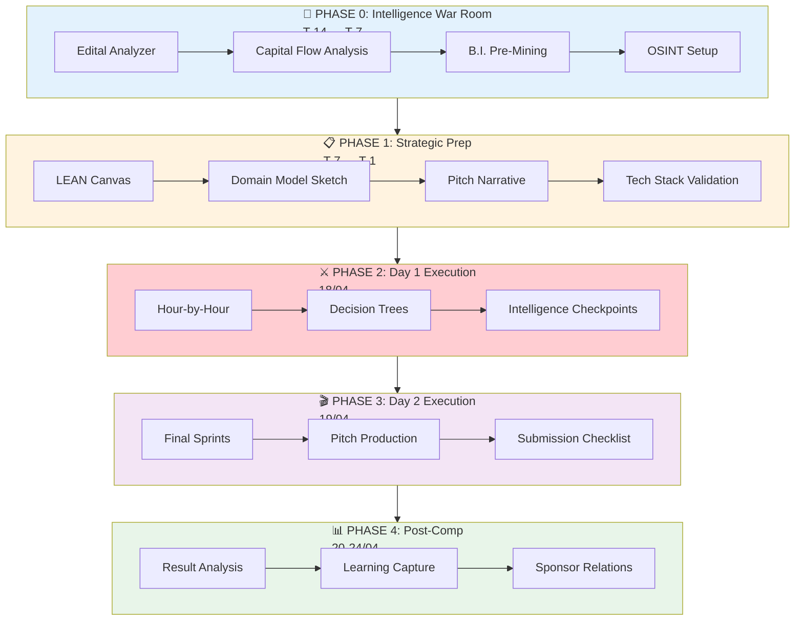

---

## 📅 TIMELINE CRUZADA: GANTT DE INTELIGÊNCIA

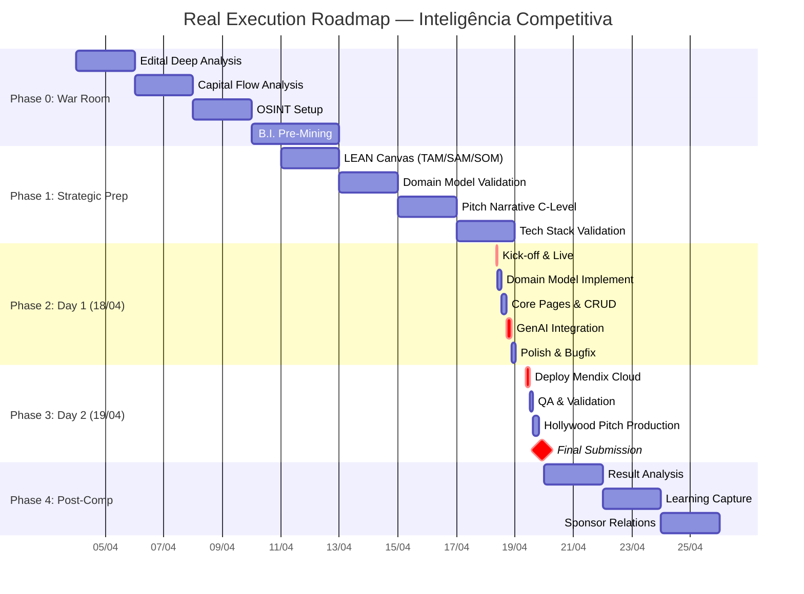

---

# 🧠 PHASE 0: INTELLIGENCE WAR ROOM
## Período: T-14 a T-7 dias (04/04 a 11/04)

> **Objetivo:** Transformar informação em vantagem competitiva antes do primeiro commit.

---

### 0.1 Edital Analyzer Workflow

#### 0.1.1 Decomposição Estrutural Obrigatória

| Dimensão | Inteligência a Extrair | Output Esperado |
|------------|------------------------|-----------------|
| **Temporal** | Janelas de decisão críticas | Mapa de horários vulneráveis |
| **Técnica** | Constraints mandatórios vs. opcionais | Checklist de conformidade absoluta |
| **Avaliativa** | Pesos de critérios + desempates | Matriz de priorização de esforço |
| **Conformidade** | Cláusulas de desclassificação | Alertas de risco formal |
| **Stakeholders** | Motivações de patrocinadores | Alinhamento de narrativa |

#### 0.1.2 Protocolo de Extração de Requisitos

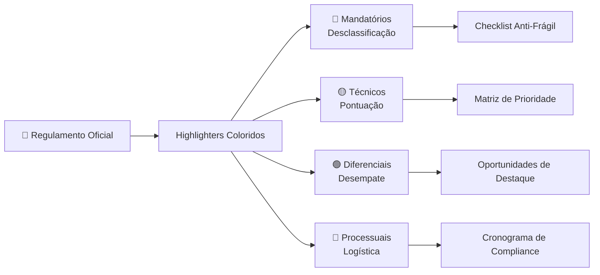

#### 0.1.3 Checklist Edital Analyzer

- [ ] **Leitura térmica:** Identificar todas as menções a "desclassificação automática"
- [ ] **Mapeamento de pesos:** Quantificar % de pontuação por critério
- [ ] **Critérios de desempate:** Ordenar hierarquia exata
- [ ] **Requisitos "entrelinhas":** Interpretar expectativas implícitas
- [ ] **Validação cruzada:** Cruzar com regulamentos de edições anteriores

---

### 0.2 Capital Flow Analysis

#### 0.2.1 Análise de Fluxo de Capital do Patrocinador

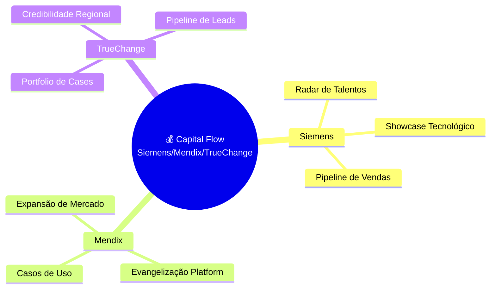

#### 0.2.2 Matriz de Valor por Stakeholder

| Stakeholder | Dor Principal | Nossa Solução Alavanca | Métrica de Sucesso |
|-------------|---------------|------------------------|-------------------|
| **Siemens** | Falta de cases brasileiros de Industry 4.0 | Waste Guardian como showcase | Adoção em planta piloto |
| **Mendix** | Baixa penetração em manufatura | App industrial funcional | Downloads/replicações |
| **TrueChange** | Necessidade de cases de sucesso | Solução documentada e filmada | Credibilidade com prospects |

#### 0.2.3 Sinais de "C-Level Appeal"

> **Métricas que fazem CFOs sorrirem:**
- **ROI em 90 dias:** Payback rápido de implementação
- **Redução de CAPEX:** Menor investimento em equipamentos
- **Otimização de OPEX:** Menor custo operacional por unidade
- **Compliance ESG:** Métricas para relatórios de sustentabilidade

---

### 0.3 Pre-Mining B.I. Datasets

#### 0.3.1 Datasets a Pré-Coletar

| Dataset | Fonte | Uso no Pitch | Status |
|---------|-------|--------------|--------|
| **IBGE PAM 2024** | Sidra IBGE | Dados de produção F&B | ⏳ Pending |
| **Waste Atlas FAO** | FAO.org | Benchmark global de perdas | ⏳ Pending |
| **ABIA Relatórios** | Assoc. Bras. Ind. Alimentos | Dados setoriais | ⏳ Pending |
| **Sebrae Perdas** | Sebrae Agro | Estudos de desperdício | ⏳ Pending |
| **Siemens Cases** | Siemens Press | Cases de referência | ⏳ Pending |

#### 0.3.2 Estrutura de Dados Pré-Organizada

```
/data_baseline/
├── f_and_b_production_br_2024.json
├── waste_benchmarks_global.csv
├── industry_pain_points_matrix.md
├── ods_9_12_kpis_reference.xlsx
└── competitor_landscape_analysis.md
```

#### 0.3.3 Números de Impacto Pré-Calculados

```javascript
// Exemplo: Impact Calculator Pre-loaded
const IMPACT_BASELINE = {
  food_and_beverage: {
    annual_waste_percentage: 0.035, // 3.5%
    avg_plant_revenue_brl: 50000000, // R$ 50M
    waste_cost_per_plant: 1750000,   // R$ 1.75M/year
    
    // Projeções de redução
    conservative_reduction: 0.15,    // 15%
    aggressive_reduction: 0.30,      // 30%
    
    // Impacto calculado
    savings_conservative: 262500,    // R$ 262.5K/year
    savings_aggressive: 525000       // R$ 525K/year
  }
};
```

---

### 0.4 OSINT Monitoring Setup

#### 0.4.1 Inteligência de Concorrência

| Fonte OSINT | Frequência de Check | Responsável | Output |
|-------------|---------------------|-------------|--------|
| LinkedIn equipes inscritas | Diário | Intel Lead | Mapa de skills adversários |
| GitHub repos públicos | Semanal | Tech Lead | Stack técnico da concorrência |
| Discord oficial | Contínuo | All | Intenções e dúvidas comuns |
| Twitter/X hashtag #LowHack2026 | Diário | Intel Lead | Sentimento e expectativas |

#### 0.4.2 Alertas de Monitoramento

```yaml
osint_alerts:
  critical:
    - "Mudança no regulamento"
    - "Novo patrocinador anunciado"
    - "Alteração de critérios"
  
  warning:
    - "Time forte confirmou participação"
    - "Mudança no tema/desafio"
    - "Novos requisitos técnicos"
  
  info:
    - "Dicas de mentores no Discord"
    - "Exemplos de pitch anteriores"
    - "Templates compartilhados"
```

---

# 📋 PHASE 1: STRATEGIC PREPARATION
## Período: T-7 a T-1 dias (11/04 a 17/04)

> **Objetivo:** Toda decisão importante tomada antes do caos. Zero improviso no dia D.

---

### 1.1 LEAN Canvas Pré-Preenchido

#### 1.1.1 TAM/SAM/SOM Calculados

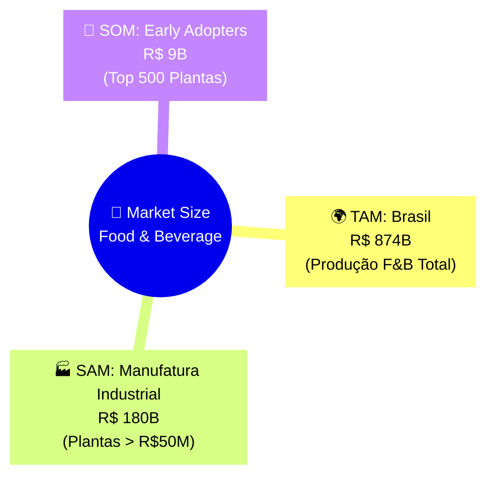

| Métrica | Valor | Fonte/Justificativa |
|---------|-------|---------------------|
| **TAM** | R$ 874 bilhões | Faturamento total indústria F&B Brasil (ABIA 2024) |
| **SAM** | R$ 180 bilhões | Plantas industriais com faturamento > R$ 50M/year |
| **SOM** | R$ 9 bilhões | Top 500 plantas (early adopters de tech) |
| **Serviceable Obtainable %** | 5% do SAM | Meta conservadora ano 1 |

#### 1.1.2 LEAN Canvas — Waste Guardian

```markdown
┌─────────────────────────────────────────────────────────────────┐
│                    LEAN CANVAS — WASTE GUARDIAN                 │
├───────────────────────┬─────────────────────────────────────────┤
│ PROBLEM               │ SOLUTION                                │
│ • 3-7% desperdício    │ • Copiloto AI para redução de perdas    │
│ • Falta de visibilidad│ • Dashboard Mendix com GenAI insights   │
│ • Ações reativas      │ • Recomendações priorizadas automáticas │
├───────────────────────┼─────────────────────────────────────────┤
│ UNIQUE VALUE PROP     │ UNFAIR ADVANTAGE                        │
│ "Reduza desperdício   │ • Stack Siemens (Mendix + potencial      │
│  em 30% com decisões  │   MindSphere integration)               │
│  inteligentes em tempo│ • Dataset pré-treinado F&B              │
│  real"                │ • Pitch C-Level ready                   │
├───────────────────────┼─────────────────────────────────────────┤
│ CUSTOMER SEGMENTS     │ KEY METRICS                             │
│ • Plant managers      │ • % redução desperdício                 │
│ • Sustainability heads│ • ROI em 90 dias                        │
│ • COOs industriais    │ • Adoção de recomendações               │
├───────────────────────┴─────────────────────────────────────────┤
│ CHANNELS              │ COST STRUCTURE        │ REVENUE STREAMS   │
│ • Siemens Xcelerator  │ • Desenvolvimento     │ • SaaS por linha  │
│ • TrueChange partners │ • Infra cloud         │ • Setup fee       │
│ • Consultorias ESG    │ • Vendas              │ • Consultoria     │
└───────────────────────┴───────────────────────┴─────────────────┘
```

---

### 1.2 Domain Model Sketch

#### 1.2.1 Modelo Baseado na Dor do Sponsor

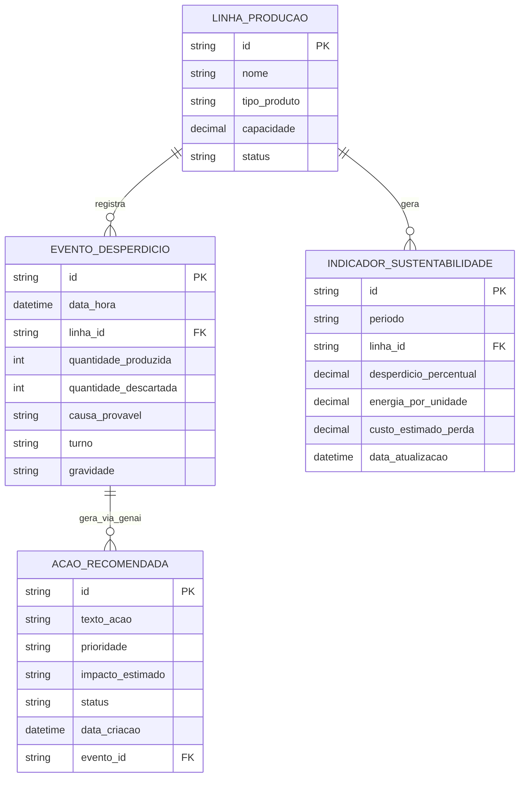

#### 1.2.2 Justificativa do Modelo para C-Level

> "Nossa arquitetura de dados reflete a jornada de valor: da linha de produção aos indicadores que importam para o board, passando por ações inteligentes geradas por IA. Cada entidade gera métricas de impacto financeiro e ambiental."

---

### 1.3 Pitch Narrative — Alinhada à Psicologia C-Level

#### 1.3.1 Framework de Persuasão: P-A-S-T-O-R

| Letra | Significado | Aplicação no Pitch |
|-------|-------------|-------------------|
| **P**roblem | Problema quantificado | "R$ 1,7M perdidos por ano em cada planta" |
| **A**gitate | Agitar a dor | "ESG está no radar do board. Sem dados, não há compliance" |
| **S**olution | Solução clara | "Copiloto Waste Guardian: decide com dados, não com feeling" |
| **T**estimony | Prova social | "Baseado em cases Siemens de redução de 30% em waste" |
| **O**ffer | Oferta irresistível | "Resultados em 90 dias, sem CAPEX de hardware" |
| **R**esponse | Chamada à ação | "Vote na transformação digital da indústria brasileira" |

#### 1.3.2 Roteiro C-Level — 3 Minutos

```markdown
[00:00-00:20] PROBLEMA QUANTIFICADO
"A indústria de alimentos brasileira perde R$ 30 bilhões por ano em desperdício. 
Uma planta média de R$ 50M fatura joga R$ 1,7M no lixo — anualmente."

[00:20-00:50] AGITAÇÃO ESG + REGULATÓRIA
"O consumidor exige sustentabilidade. O investidor exige métricas ESG. 
O board precisa de dados. Hoje, 73% das plantas tomam decisões no escuro."

[00:50-01:40] SOLUÇÃO + DEMO AO VIVO
"Waste Guardian: um copiloto operacional em Mendix que usa GenAI para 
sugerir ações prioritárias de redução de desperdício em tempo real."
[DEMO: Dashboard → Detalhe → Recomendação IA]

[01:40-02:15] MODELO E IMPACTO
"Modelo SaaS: R$ 2K/mês por linha. ROI em 90 dias com redução de 15-30% 
em perdas. Alinhado às ODS 9 e 12."

[02:15-02:50] DIFERENCIAL E ESCALA
"Construído em Mendix: deploy em dias, não meses. Integração nativa com 
MindSphere Siemens. Escalável para qualquer planta industrial."

[02:50-03:00] FECHAMENTO
"Waste Guardian: transforme desperdício em lucro. Obrigado."
```

---

### 1.4 Tech Stack Validation

#### 1.4.1 Matriz de Validação Tecnológica

| Componente | Validação Obrigatória | Data Limite | Owner |
|------------|----------------------|-------------|-------|
| **Mendix Studio Pro** | Instalação + login OK | 12/04 | Tech Lead |
| **Mendix Cloud** | App teste publicado | 13/04 | Tech Lead |
| **OpenAI API** | Chamada teste bem-sucedida | 14/04 | AI Lead |
| **REST Connector** | Microflow de teste | 15/04 | Tech Lead |
| **Atlas UI** | 3 páginas mockadas | 16/04 | Designer |
| **Team Server** | Repositório compartilhado | 17/04 | Tech Lead |

#### 1.4.2 Script de Validação OpenAI (Teste Prévio)

```javascript
// File: /validation/test_openai_api.js
const axios = require('axios');

async function validateOpenAIIntegration() {
  const config = {
    method: 'post',
    url: 'https://api.openai.com/v1/chat/completions',
    headers: {
      'Authorization': `Bearer ${process.env.OPENAI_API_KEY}`,
      'Content-Type': 'application/json'
    },
    data: {
      model: 'gpt-4o-mini',
      messages: [
        {
          role: 'system',
          content: 'Você é um assistente especializado em eficiência industrial.'
        },
        {
          role: 'user',
          content: 'Sugira 3 ações para reduzir desperdício em linha de envase.'
        }
      ],
      temperature: 0.7
    }
  };

  try {
    const response = await axios(config);
    console.log('✅ API OK:', response.data.choices[0].message.content);
    return true;
  } catch (error) {
    console.error('❌ API FAILED:', error.message);
    return false;
  }
}

validateOpenAIIntegration();
```

---

# ⚔️ PHASE 2: EXECUTION DAY 1 (18/04)
## Sábado, 18 de Abril — 09:00 às 22:00

> **Mantra:** "Cada hora tem um propósito. Decisões são binárias. Pivot é progresso."

---

### 2.1 Hour-by-Hour com Decision Trees

#### 2.1.1 Cronograma Hora-a-Hora

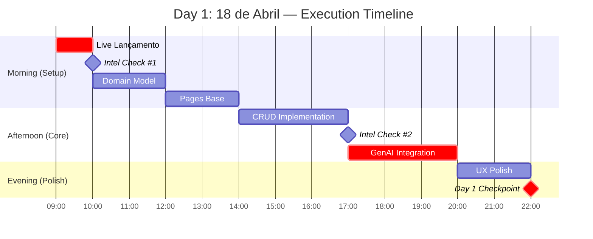

#### 2.1.2 Detalhamento Hora-a-Hora

| Horário | Atividade | Checkpoint de Saída | Gatilho de Pivot |
|---------|-----------|---------------------|------------------|
| **09:00-10:00** | Live Lançamento | Briefing confirmado, dúvidas sanadas | Se tema mudar → reunião emergencial 10:00 |
| **10:00-10:30** | Intel Check #1 | Escopo validado, team aligned | Se escopo inviável → ativar Kill Switch |
| **10:30-12:30** | Domain Model | Entidades criadas, relações mapeadas | Se complexidade alta → simplificar para 3 entidades |
| **12:30-14:30** | Pages Base | 3 páginas navegáveis | Se UI travar → usar templates Atlas 3.0 |
| **14:30-17:30** | CRUD Ops | Create/Read/Update/Delete funcionando | Se persistência falhar → mock local |
| **17:30-18:00** | Intel Check #2 | Status verde em todas as frentes | Se atrás do cronograma → cortar features |
| **18:00-21:00** | GenAI Integration | REST call funcionando, prompts ok | Se API falhar → ativar modo offline |
| **21:00-22:00** | UX Polish | App visualmente coesa | Se não estiver bom → focar em funcionalidade |
| **22:00** | Day 1 Checkpoint | Status report, prioridades Day 2 | — |

---

### 2.2 Decision Trees (Árvores de Decisão)

#### 2.2.1 Árvore: Escopo vs. Tempo

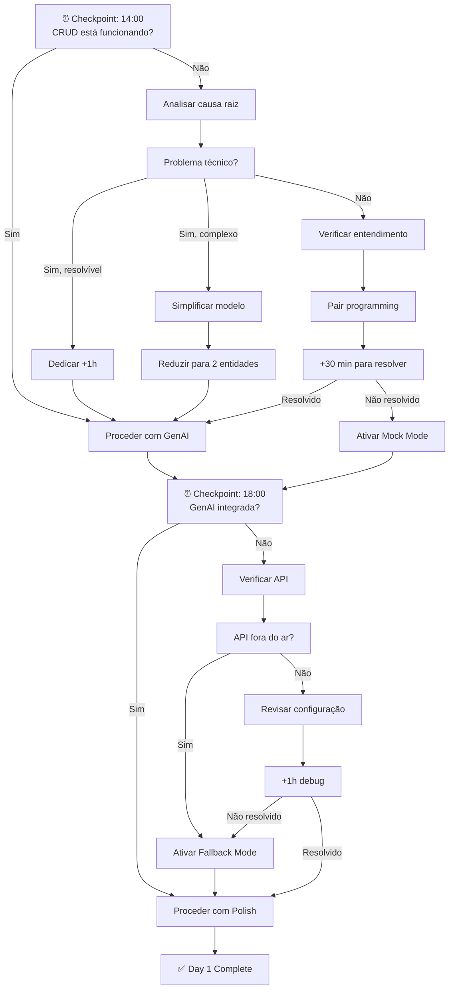

#### 2.2.2 Árvore: Integração GenAI

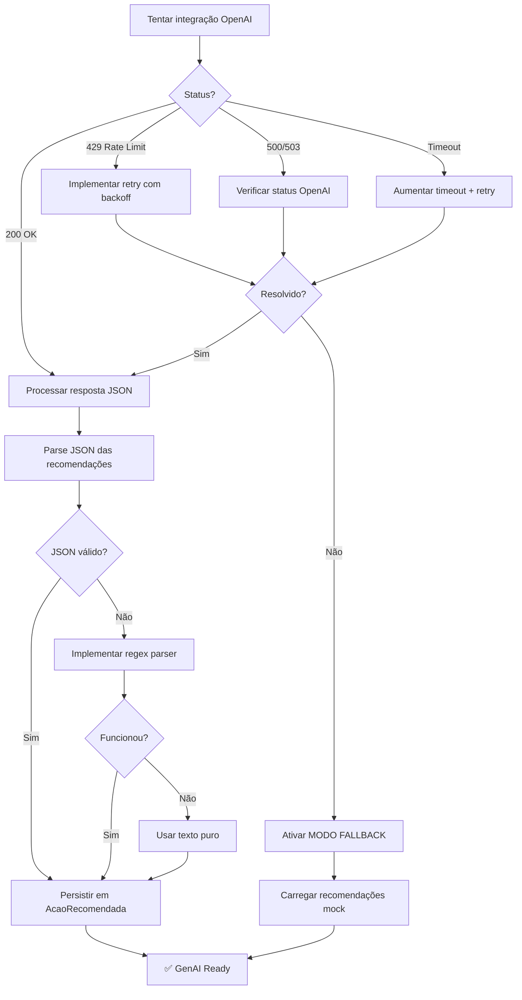

---

### 2.3 Intelligence Checkpoints

#### 2.3.1 Protocolo de Checkpoint

| Checkpoint | Horário | Participantes | Agenda | Output |
|------------|---------|---------------|--------|--------|
| **IC-1** | 10:00 | Todos | Validação de escopo pós-live | Decisão: prosseguir/pivotar |
| **IC-2** | 17:00 | Todos | Status técnico + riscos | Plano de contingência |
| **IC-3** | 22:00 | Todos | Day 1 retrospective + Day 2 preview | Prioridades ajustadas |

#### 2.3.2 Checklist de Inteligência — IC-2 (17:00)

```markdown
## IC-2: Status Check (Critical)

### Tech Front
- [ ] Domain Model: 100% implementado
- [ ] CRUD Operations: Testado e funcional
- [ ] UI Responsiva: Funcionando em mobile
- [ ] GenAI: API respondendo (mesmo que com delay)

### Business Front
- [ ] Narrativa: Alinhada com briefing do dia
- [ ] Métricas de impacto: Atualizadas com dados reais
- [ ] ODS Alignment: Documentado e validado

### Risk Front
- [ ] Blockers identificados: ___
- [ ] Mitigações ativadas: ___
- [ ] Recursos necessários: ___

### Decisões para Day 2
- [ ] Features obrigatórias: ___
- [ ] Features nice-to-have (cortáveis): ___
- [ ] Horário de início Day 2: ___
```

---

### 2.4 Critical Path com Buffers

#### 2.4.1 Mapeamento de Caminho Crítico

```mermaid
criticalPath
    title Critical Path Day 1
    section Must-Have
    Domain Model      : 2h, 10:30-12:30
    CRUD Base         : 3h, 14:30-17:30
    GenAI Core        : 3h, 18:00-21:00
    
    section Buffer Zones
    Buffer #1         : 1h, disponível entre CRUD e GenAI
    Buffer #2         : 1h, disponível após GenAI
    
    section Contingências
    Mock Mode         : Ativação em 30 min se API falhar
    Feature Cut       : Redução de escopo em 15 min se atrasado
```

#### 2.4.2 Regras de Buffer

| Situação | Ação de Buffer | Máximo de Tempo |
|----------|----------------|-----------------|
| Atraso < 1h | Absorver com buffer disponível | — |
| Atraso 1-2h | Cortar features nice-to-have | Decisão em 15 min |
| Atraso > 2h | Ativar modo "Mínimo Viável" | Decisão imediata |
| Blocker técnico | Pair programming + mentoria | 1h máximo |
| API indisponível | Ativar fallback mock | 30 min setup |

---

# 🎬 PHASE 3: EXECUTION DAY 2 (19/04)
## Domingo, 19 de Abril — 09:00 às 21:59

> **Mantra:** "O pitch é o produto. O deploy é a prova. A entrega é inegociável."

---

### 3.1 Final Build Sprints

#### 3.1.1 Sprint Structure

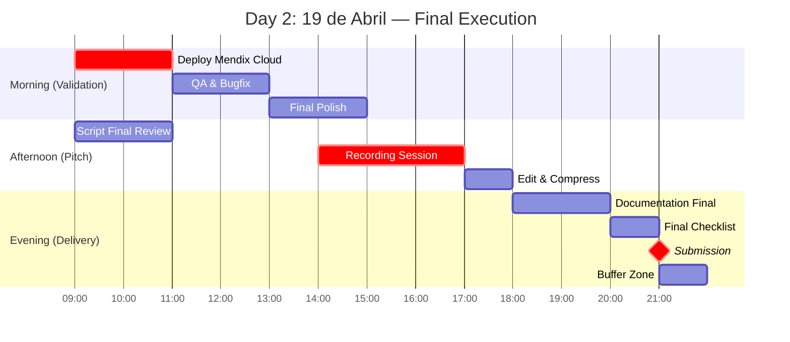

#### 3.1.2 Detalhamento Sprint Final

| Sprint | Horário | Objetivo | Definition of Done |
|--------|---------|----------|-------------------|
| **Sprint Deploy** | 09:00-11:00 | App publicado e acessível | URL funciona em celular externo |
| **Sprint QA** | 11:00-13:00 | Zero bugs críticos | CRUD + GenAI funcionando 100% |
| **Sprint Polish** | 13:00-15:00 | UX final e responsiva | Navegação fluida, loading ok |
| **Sprint Docs** | 15:00-17:00 | Documentação completa | README + prints + arquitetura |
| **Sprint Pitch** | 17:00-20:00 | Vídeo gravado e editado | ≤3 min, áudio claro, demo funciona |
| **Sprint Submit** | 20:00-21:59 | Entrega final | Todos links funcionando, forms preenchidos |

---

### 3.2 Pitch Production com Elementos "Hollywood"

#### 3.2.1 Produção de Vídeo — Checklist Técnico

| Aspecto | Especificação | Check |
|---------|--------------|-------|
| **Resolução** | 1080p mínimo (4K preferido) | ☐ |
| **Áudio** | Microfone externo ou ambiente silencioso | ☐ |
| **Iluminação** | Face bem iluminada, sem sombras duras | ☐ |
| **Fundo** | Profissional ou virtual background limpo | ☐ |
| **Demo** | Screen recording com highlights visuais | ☐ |
| **Timing** | Cronômetro visível, máximo 2:50 | ☐ |
| **Legendas** | Opcional, mas recomendado | ☐ |

#### 3.2.2 Estrutura Narrativa "Hollywood"

```markdown
🎬 ROTEIRO CINEMATOGRÁFICO — 3 Minutos

[HOOK — 0:00-0:15] "O Gancho"
├─ Frame: Close no apresentador
├─ Áudio: "R$ 1,7 milhão. É o que sua planta joga no lixo todo ano."
└─ Transição: Cut para tela de dados chocantes

[SETUP — 0:15-0:45] "O Mundo Atual"
├─ Frame: Screen recording de planilhas/sistemas legados
├─ Áudio: "Decisões no escuro. Relatórios em Excel. Atraso de semanas."
└─ Transição: Fade to black

[CONFRONTATION — 0:45-1:30] "A Solução"
├─ Frame: Demo ao vivo do Waste Guardian
├─ Áudio: "Agora imagine: alertas em tempo real, recomendações por IA..."
├─ Highlight: Zoom na recomendação da GenAI
└─ Transição: Smooth scroll entre páginas

[RESOLUTION — 1:30-2:15] "O Resultado"
├─ Frame: Dashboard com métricas de impacto
├─ Áudio: "15% a 30% de redução em 90 dias. ROI garantido."
└─ Transição: Cut para apresentador

[CLIMAX — 2:15-2:50] "O Diferencial"
├─ Frame: Split screen — logo Siemens + logo Mendix
├─ Áudio: "Construído em Mendix. Pronto para escalar com Siemens."
└─ Transição: Fade to logo Waste Guardian

[CLOSE — 2:50-3:00] "O Fechamento"
├─ Frame: Logo + contato
├─ Áudio: "Waste Guardian: transforme desperdício em lucro."
└─ FIM
```

---

### 3.3 Submission Checklist com Validação

#### 3.3.1 Checklist Final de Submissão

```markdown
## ✅ SUBMISSION CHECKLIST — 21:00 Hard Stop

### Aplicação Mendix
- [ ] App publicado na Mendix Cloud (Free Tier)
- [ ] Link público funcionando (testado em navegador anônimo)
- [ ] 3+ páginas navegáveis e funcionais
- [ ] CRUD operacional (create, read, update, delete)
- [ ] 1+ microflow/nanoflow com lógica de negócio
- [ ] Interface responsiva (testado em mobile)
- [ ] Integração GenAI funcionando (não apenas placeholder)

### Vídeo Pitch
- [ ] Duração ≤ 3 minutos (2:50 ideal para margem)
- [ ] Upload no YouTube (NÃO LISTADO)
- [ ] Link acessível sem login
- [ ] Áudio claro e compreensível
- [ ] Demo da aplicação incluída
- [ ] Arquivo .txt com link do vídeo

### Documentação
- [ ] README.md com instruções claras
- [ ] Screenshots das principais telas
- [ ] Descrição técnica da arquitetura
- [ ] Explicação da integração GenAI
- [ ] Documentação do domain model

### Entregáveis Físicos
- [ ] Pasta com arquivos do projeto
- [ ] Link da aplicação em arquivo separado
- [ ] Link do vídeo em arquivo .txt
- [ ] Documentação técnica em PDF

### Conformidade
- [ ] Participação confirmada em lives obrigatórias
- [ ] Equipe com 3-5 membros documentada
- [ ] Código de conduta respeitado
- [ ] Nenhuma violação de PI identificada
```

#### 3.3.2 Validação Cruzada (Revisão em Dupla)

| Item | Validador 1 | Validador 2 | Status |
|------|-------------|-------------|--------|
| Link app funciona | Tech Lead | AI Lead | ☐ |
| Vídeo ≤ 3 min | Pitch Owner | PO | ☐ |
| YouTube não listado | Pitch Owner | Tech Lead | ☐ |
| GenAI funcional | AI Lead | Tech Lead | ☐ |
| Todos arquivos na pasta | PO | Pitch Owner | ☐ |
| Formulário preenchido | PO | Tech Lead | ☐ |

---

# 📊 PHASE 4: POST-COMPETITION INTELLIGENCE
## Período: 20-24 de Abril

> **Objetivo:** Cada competição é um ativo de aprendizado. Capture tudo.

---

### 4.1 Result Analysis Framework

#### 4.1.1 Matriz de Avaliação Pós-Evento

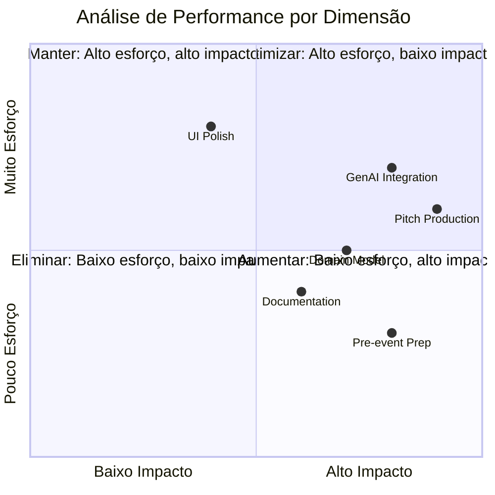

#### 4.1.2 Framework de Root Cause Analysis

| Resultado Possível | Hipóteses de Causa | Dados a Coletar |
|-------------------|-------------------|-----------------|
| **Vitória** | Qual diferencial funcionou? | Feedback dos juízes, notas detalhadas |
| **Top 3** | O que faltou para 1º lugar? | Comparação com vencedor |
| **Finalista** | O que precisa melhorar? | Critérios de corte |
| **Não finalista** | Onde falhamos? | Auto-avaliação honesta |

#### 4.1.3 Scorecard de Performance

```markdown
## SCORECARD — LOW HACK 2026

### Critérios de Avaliação (Auto-Score)
| Critério | Peso | Nossa Nota (1-10) | Ponderado |
|----------|------|-------------------|-----------|
| Potencial de Impacto | Alto | _ | _ |
| Modelo de Negócio | Alto | _ | _ |
| Aderência ao Desafio | Alto | _ | _ |
| Inovação | Médio | _ | _ |
| Apresentação do Pitch | Alto | _ | _ |
| Critério Técnico | Alto | _ | _ |
| **TOTAL** | — | — | **_/10** |

### Análise de Gap
| Aspecto | Nossa Performance | Vencedor (se aplicável) | Gap |
|---------|-------------------|-------------------------|-----|
| | | | |

### Lições Aprendidas
1. O que funcionou bem: ___
2. O que poderia ser melhor: ___
3. Surpresas positivas: ___
4. Surpresas negativas: ___
```

---

### 4.2 Learning Capture para Próximas Competições

#### 4.2.1 Knowledge Base Incremental

```
/learning_capture/
├── lowhack_2026/
│   ├── technical_learnings.md
│   ├── pitch_learnings.md
│   ├── business_learnings.md
│   ├── what_worked.md
│   ├── what_didnt_work.md
│   └── templates_reusables/
│       ├── domain_model_template.mmd
│       ├── pitch_script_template.md
│       └── submission_checklist_template.md
```

#### 4.2.2 Atualização de Processos

| Processo | Antes do Low Hack | Aprendizado | Depois do Low Hack |
|----------|-------------------|-------------|-------------------|
| Preparação técnica | ___ | ___ | ___ |
| Definição de escopo | ___ | ___ | ___ |
| Execução de pitch | ___ | ___ | ___ |
| Gestão de tempo | ___ | ___ | ___ |
| Documentação | ___ | ___ | ___ |

#### 4.2.3 Revisão de Templates

- [ ] Atualizar LEAN Canvas com lições
- [ ] Refinar templates de prompts GenAI
- [ ] Melhorar estrutura de Domain Model
- [ ] Otimizar roteiro de pitch
- [ ] Atualizar checklists de submissão

---

### 4.3 Relationship Maintenance com Patrocinadores

#### 4.3.1 Plano de Follow-up

| Timing | Ação | Responsável | Objetivo |
|--------|------|-------------|----------|
| **D+1 (20/04)** | Agradecimento LinkedIn (organizadores) | Pitch Owner | Visibilidade |
| **D+3 (22/04)** | Email formal de agradecimento | PO | Relacionamento |
| **D+7 (26/04)** | Post sobre aprendizados (blog/LinkedIn) | Pitch Owner | Thought leadership |
| **M+1 (Maio)** | Check-in com Siemens/TrueChange | PO | Pipeline de parceria |
| **M+3 (Julho)** | Atualização de progresso do projeto | Tech Lead | Manter relacionamento |

#### 4.3.2 Templates de Comunicação

**Template: Email de Agradecimento Pós-Evento**

```markdown
Assunto: Agradecimento — Equipe [Nome] no Low Hack 2026

Prezados [Nomes],

Gostaríamos de agradecer pela oportunidade de participar do Low Hack 2026. 
A experiência foi extremamente valiosa para nossa equipe.

[Se vencedor: Estamos honrados com o resultado e animados para explorar 
oportunidades de levar o Waste Guardian adiante.]

[Se não vencedor: O feedback da banca será fundamental para refinarmos 
nossa solução.]

Gostaríamos de manter contato e explorar possibilidades de colaboração 
com a [Siemens/TrueChange/Mendix] no futuro.

[Link do projeto no GitHub/Mendix se aplicável]

Atenciosamente,
[Equipe]
```

---

# 🎯 INTELLIGENCE TRIGGERS & DECISION TREES

## 6.1 Gatilhos de Resposta Rápida

### Matriz de Gatilhos

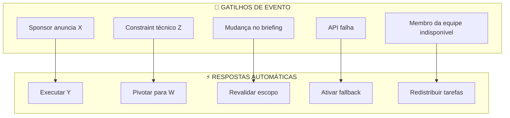

### Tabela de Gatilhos Específicos

| Se acontecer... | Então faça... | Em quanto tempo | Responsável |
|-----------------|---------------|-----------------|-------------|
| **Sponsor anuncia mudança de tema** | Reunir equipe para revalidar escopo | Imediato (15 min) | PO |
| **Sponsor menciona métrica específica** | Incorporar no pitch e documentação | Antes do próximo checkpoint | Pitch Owner |
| **Constraint: Mendix Cloud indisponível** | Pivotar para local development + screenshots | 30 min | Tech Lead |
| **Constraint: OpenAI API fora do ar** | Ativar modo fallback com dados mock | 15 min | AI Lead |
| **Pivot necessário: Tempo curto** | Cortar para mínimo viável absoluto | Imediato | PO |
| **Pivot necessário: Complexidade alta** | Simplificar domain model para 2 entidades | Imediato | Tech Lead |
| **Risco: Deploy falha 1h antes** | Usar screen recording como fallback | 30 min | Tech Lead |
| **Risco: Pitch > 3 min** | Cortar segmento de menor impacto | 15 min | Pitch Owner |

---

## 6.2 Protocolos de Mitigação de Risco

### 6.2.1 Matriz de Riscos e Protocolos

| Risco | Probabilidade | Impacto | Protocolo de Mitigação |
|-------|--------------|---------|----------------------|
| API OpenAI indisponível | Média | Alto | Fallback mode com recomendações pré-geradas |
| Mendix Cloud instável | Baixa | Alto | Deploy teste no sábado + screenshots backup |
| Exaustão da equipe | Média | Médio | Turnos de trabalho + pausas obrigatórias |
| Escopo muito ambicioso | Alta | Médio | Kill Switch para mínimo viável |
| Pitch ultrapassa 3 min | Média | Alto | Cronômetro visível + ensaios prévios |
| Membro indisponível | Baixa | Alto | Cross-training + redistribuição |
| Perda de dados | Baixa | Alto | Commits frequentes + backup local |

### 6.2.2 Protocolo de Crise — "War Room"

```markdown
## PROTOCOLO WAR ROOM — 15 Minutos Máximos

### Fase 1: Diagnóstico (0-5 min)
1. Qual é o problema exato?
2. Quem está impactado?
3. Qual o deadline para resolução?

### Fase 2: Escalonamento (5-10 min)
1. Solução pode ser implementada localmente?
2. Precisa de ajuda externa?
3. Qual é o custo/benefício da solução?

### Fase 3: Decisão (10-15 min)
1. Decisão binária: Resolver ou contornar?
2. Se resolver: timeline e responsável
3. Se contornar: plano alternativo

### Decisões Possíveis:
- [ ] CONTINUAR: Problema resolvido, prosseguir
- [ ] PIVOTAR: Mudar abordagem, simplificar
- [ ] MOCKAR: Usar dados/simulação temporária
- [ ] ELIMINAR: Cortar feature não-crítica
```

---

# 👥 RESOURCE ALLOCATION MATRIX

## 7.1 Alocação de Tempo por Atividade

### 7.1.1 Matriz de Tempo — 35 Horas Totais

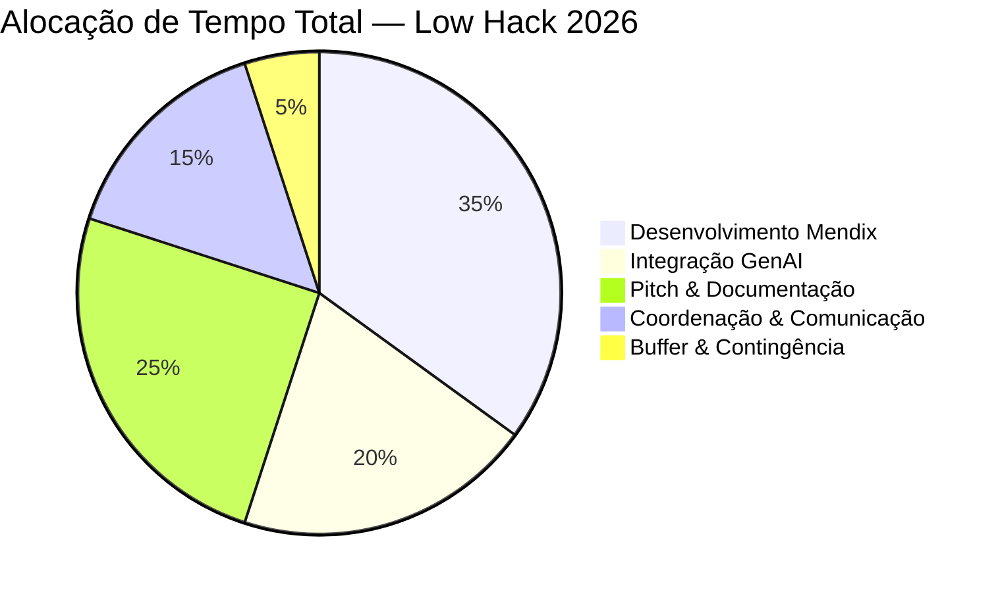

### 7.1.2 Alocação Detalhada por Dia

| Atividade | Day 1 (13h) | Day 2 (12h) | Total | % do Tempo |
|-----------|-------------|-------------|-------|------------|
| Domain Model & Setup | 2h | — | 2h | 8% |
| UI/UX Development | 3h | 2h | 5h | 19% |
| CRUD & Microflows | 3h | 1h | 4h | 15% |
| GenAI Integration | 3h | — | 3h | 12% |
| Testing & QA | 1h | 2h | 3h | 12% |
| Deploy & DevOps | — | 2h | 2h | 8% |
| Documentation | — | 3h | 3h | 12% |
| Pitch Production | 1h | 4h | 5h | 19% |
| **TOTAL** | **13h** | **14h** | **27h** | **100%** |

---

## 7.2 Papéis da Equipe com Backups

### 7.2.1 RACI Matrix

| Atividade | Tech Lead | AI Lead | Pitch Owner | PO/Docs | Backup |
|-----------|-----------|---------|-------------|---------|--------|
| Domain Model | R | C | I | I | AI Lead |
| UI Development | R | C | C | I | PO |
| CRUD Operations | R | I | I | I | AI Lead |
| GenAI Integration | C | R | I | I | Tech Lead |
| API Configuration | A | R | I | I | Tech Lead |
| Testing & QA | R | R | I | C | Pitch Owner |
| Deploy | R | I | I | C | AI Lead |
| Documentation | C | C | I | R | Pitch Owner |
| Pitch Script | C | C | R | C | PO |
| Video Recording | I | I | R | A | Tech Lead |
| Submission | C | C | C | R | Any |

**Legenda:** R = Responsible (Executa) | A = Accountable (Decide) | C = Consulted (Consulta) | I = Informed (Informado)

### 7.2.2 Estrutura de Backup

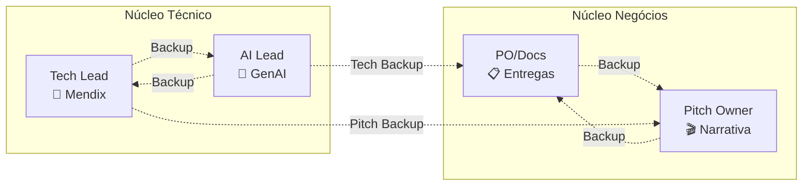

### 7.2.3 Responsabilidades Cruzadas

| Membro | Responsabilidade Principal | Responsabilidade Secundária | Se ausente... |
|--------|---------------------------|----------------------------|---------------|
| **Tech Lead** | Arquitetura Mendix, Deploy | Suporte GenAI | AI Lead assume arquitetura básica |
| **AI Lead** | Integração GenAI, Prompts | Suporte técnico | Tech Lead assume com prompts pré-prontos |
| **Pitch Owner** | Roteiro, Gravação, Apresentação | Documentação visual | PO assume com roteiro pré-escrito |
| **PO/Docs** | Documentação, Checklists, Submissão | Coordenação geral | Pitch Owner assume documentação |

---

## 7.3 Requisitos de Ferramentas e Recursos

### 7.3.1 Stack Tecnológico Obrigatório

| Categoria | Ferramenta | Versão/Plano | Owner | Status |
|-----------|-----------|--------------|-------|--------|
| **IDE** | Mendix Studio Pro | 10.x LTS | All | ☐ |
| **Cloud** | Mendix Cloud | Free Tier | Tech Lead | ☐ |
| **AI** | OpenAI API | Fornecida pelo evento | AI Lead | ☐ |
| **Versionamento** | Mendix Team Server | Incluído | Tech Lead | ☐ |
| **Comunicação** | Discord | Web/App | All | ☐ |
| **Vídeo** | OBS Studio | Latest | Pitch Owner | ☐ |
| **Edição** | DaVinci Resolve / CapCut | Free | Pitch Owner | ☐ |
| **YouTube** | YouTube Studio | Conta pessoal | Pitch Owner | ☐ |

### 7.3.2 Hardware Checklist

| Item | Especificação Mínima | Quantidade | Status |
|------|---------------------|------------|--------|
| Laptops | Capaz de rodar Mendix Studio Pro | 2-3 | ☐ |
| Microfone | Externo ou headset quality | 1 | ☐ |
| Webcam | 1080p recomendado | 1 | ☐ |
| Internet | 10Mbps+ estável | 2 fontes (backup 4G) | ☐ |
| Energia | Estabilizador/UPS | 1 | ☐ |
| Celular | Para testes de responsividade | 1+ | ☐ |

### 7.3.3 Recursos de Conhecimento

| Recurso | Tipo | Localização | Uso |
|---------|------|-------------|-----|
| Documentação Mendix | Online | docs.mendix.com | Referência técnica |
| OpenAI API Docs | Online | platform.openai.com | Integração GenAI |
| Templates de Prompt | Local | /scaffolding/tech/ | Prompt engineering |
| Roteiro de Pitch | Local | /pitch/roteiro-video-3min.md | Gravação |
| Checklists | Local | Este documento | Validação |

---

# 📎 APPENDICES

## A. Referências Cruzadas

| Este Documento | Referências Relacionadas |
|----------------|-------------------------|
| **Real Execution Roadmap** | [ROADMAP Original](../docs/ROADMAP.md) · [Playbook Tático](../scaffolding/01-playbook-tatica.md) · [Cronograma de Ataque](../scaffolding/02-cronograma-de-ataque.md) |
| **Phase 0: Intelligence** | [Análise Estratégica Completa](../strategy/low-hack-2026-analise-estrategica-completa.md) |
| **Phase 1: Strategic Prep** | [Business Model](../business/INDEX.md) · [Tech Bootcamp](../tech/00-mendix-bootcamp-fast-track.md) |
| **Phase 2-3: Execution** | [Domain Model](../scaffolding/tech/01-mendix-domain-model.md) · [GenAI Prompts](../scaffolding/tech/02-genai-prompts.md) |
| **Phase 4: Post-Comp** | [Pitch Script](../pitch/roteiro-video-3min.md) · [Q&A Defense](../pitch/02-qna-defense-playbook.md) |

## B. Glossário de Termos Operacionais

| Termo | Definição |
|-------|-----------|
| **Kill Switch** | Mecanismo para simplificar radicalmente o escopo quando em crise |
| **IC (Intelligence Checkpoint)** | Ponto de verificação estratégica durante execução |
| **Pivot** | Mudança de direção técnica ou de negócio baseada em nova inteligência |
| **Mock Mode** | Funcionamento com dados simulados quando integração real falha |
| **Fallback** | Plano alternativo quando solução primária falha |
| **MVP Espartano** | Mínimo Produto Viável absoluto, sem qualquer feature extra |
| **TAM/SAM/SOM** | Total/Serviceable/Obtainable Market — métricas de tamanho de mercado |

## C. Versão e Changelog

| Versão | Data | Alterações | Autor |
|--------|------|------------|-------|
| 1.0 | 02/04/2026 | Documento inicial | Intelligence Team |

---

> **MANTRA FINAL:**  
> *"Inteligência sem execução é apenas potencial. Execução sem inteligência é apenas suor. Combine ambas e a vitória é inevitável."*

---

*Documento criado em 02 de Abril de 2026*  
*Última atualização: 02/04/2026*  
*Status: 🟢 READY FOR DEPLOYMENT*
