# 📊 Data-Product Design Architecture — Waste Guardian

> **Strategic Data Architecture for Low Hack 2026**  
> **Platform:** Mendix Low-Code + OpenAI GenAI  
> **Sponsors:** Siemens Digital Industries (€6.286B software revenue) + TrueChange (Platinum Mendix Partner)  
> **Focus:** Industrial Sustainability, ODS 9/12, Waste-to-ROI Conversion  
> **Version:** 1.0 — Data-First Architecture  
> **Date:** 02 April 2026

---

## 🎯 EXECUTIVE SUMMARY

This document defines the **Data-Product Architecture** for Waste Guardian, designed explicitly for hackathon judging criteria and sponsor value demonstration. Unlike traditional technical documentation, this architecture is **econometrics-first** — every data entity, relationship, and flow is engineered to prove financial impact to Siemens and TrueChange decision-makers.

> **Core Principle:** *"Data that doesn't convert to ROI currency is just noise. Every byte must justify Mendix licensing and TrueChange services."*

---

## 1️⃣ DATA ARCHITECTURE OVERVIEW

### 1.1 High-Level Data Flow Architecture

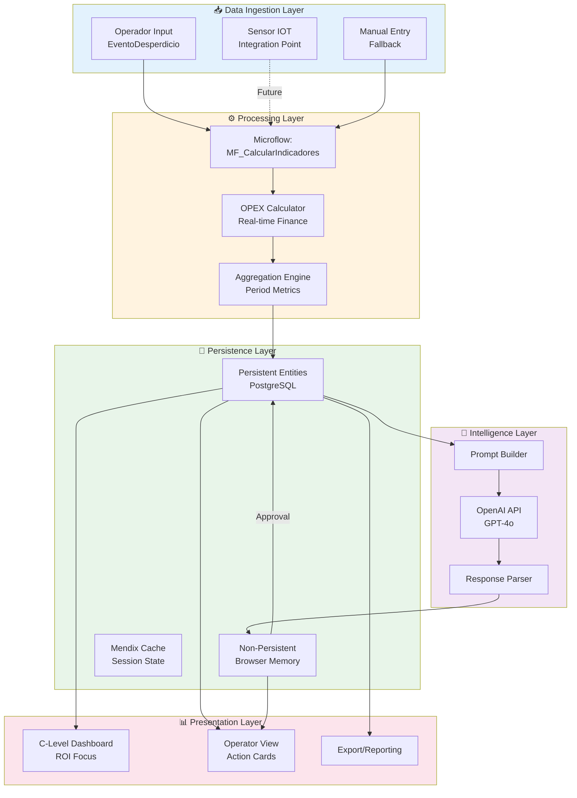

### 1.2 Domain Model — Complete Entity Map

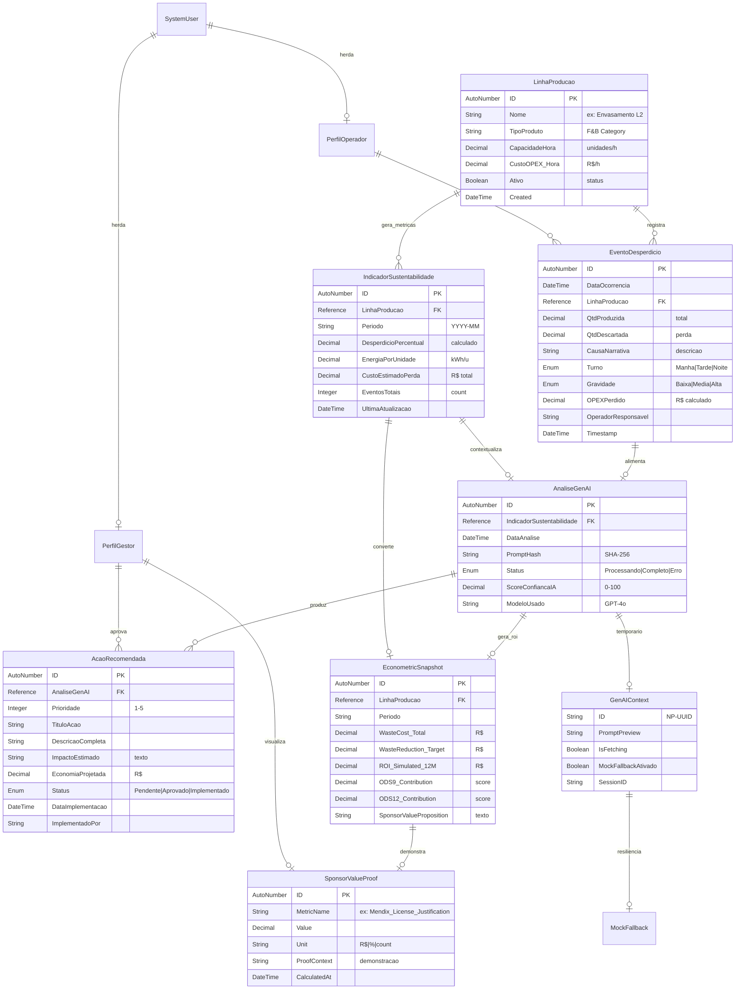

### 1.3 Data Flow: Ingestion to Presentation

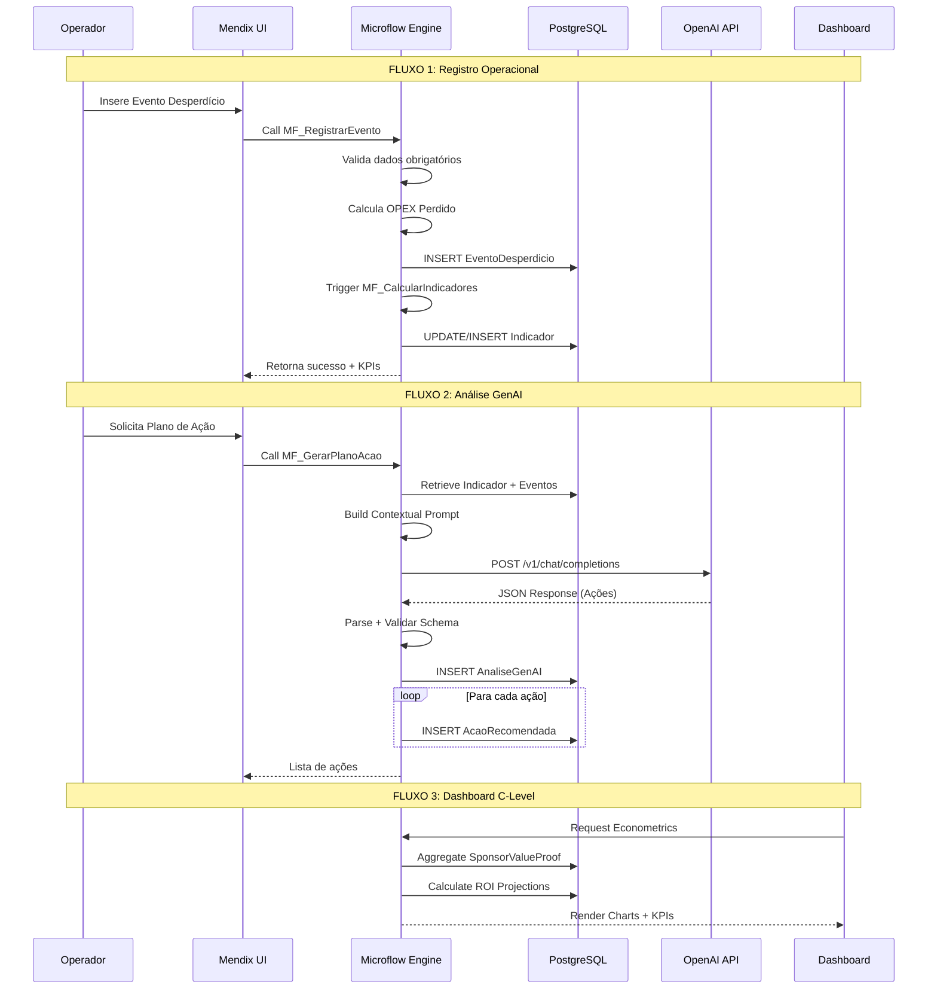

### 1.4 Mendix-Specific Data Patterns

| Pattern | Implementation | Justification |
|---------|---------------|---------------|
| **Persistent vs Non-Persistent** | Blue entities (DB) + Orange entities (Memory) | Performance on Free Tier; kill switch capability |
| **Calculated Attributes** | OPEXPerdido = QtdDescartada × CustoReferencia | Real-time financial impact visibility |
| **Reference Associations** | 1:N LinhaProducao → EventoDesperdicio | Natural hierarchy; query optimization |
| **Event-Driven Updates** | After Commit → Recalc Indicadores | Data consistency without manual refresh |
| **Soft Deletes** | Boolean `Ativo` vs hard delete | Audit trail for sponsor demos |

---

## 2️⃣ THE "ECONOMETRICS-FIRST" DATA MODEL

### 2.1 Philosophy: Waste Metrics → Financial Impact

> **Every kilogram of waste must tell a financial story.**

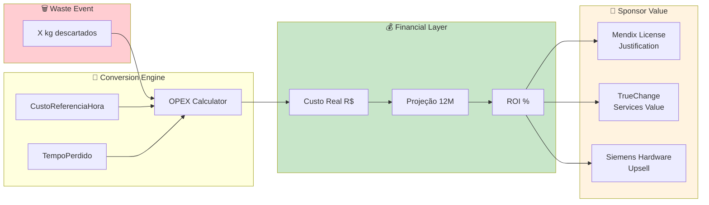

### 2.2 ROI Calculation Tables

#### Table: `EconometricSnapshot` — The "So What?" Engine

| Field | Type | Calculation | Purpose |
|-------|------|-------------|---------|
| `WasteCost_Total` | Decimal | SUM(OPEXPerdido) × Period | Total bleeding |
| `WasteReduction_Target` | Decimal | WasteCost × 0.15 | Realistic 15% reduction |
| `ROI_Simulated_12M` | Decimal | Savings - MendixCosts | Net value proposition |
| `MendixLicense_Cost` | Decimal | $850/user/year × 10 users | Siemens revenue |
| `TrueChange_Implementation` | Decimal | R$ 150K (one-time) | Partner revenue |
| `PaybackPeriod_Months` | Integer | ImplementationCost / MonthlySavings | Speed to value |

#### Table: `SponsorValueProof` — Judging Ammunition

| MetricID | MetricName | Formula | Sponsor Target |
|----------|------------|---------|----------------|
| SVP_001 | `Mendix_SpeedToValue` | (TraditionalDevDays - MendixDevDays) / TraditionalDevDays | Prove 10x faster |
| SVP_002 | `GenAI_ActionAccuracy` | AçõesImplementadas / AçõesRecomendadas | Show AI value |
| SVP_003 | `ODS9_AlignmentScore` | IndustrialInnovationIndex | Siemens DEGREE |
| SVP_004 | `ODS12_WasteReduction` | ToneladasEvitadas / Ano | Sustainability |
| SVP_005 | `TrueChange_PipelineValue` | ProjeçãoVendas × Probabilidade | Partner ROI |

### 2.3 C-Level Dashboard Data Structures

```mermaid
flowchart TB
    subgraph DASHBOARD["📈 Executive Dashboard Data"]
        
        subgraph TOP["Executive Summary Cards"]
            CARD1["💰 Economia Projetada<br/>R$ 1.2M (12M)"]
            CARD2["📉 Redução Desperdício<br/>-23% vs baseline"]
            CARD3["🎯 Payback<br/>4.2 meses"]
            CARD4["🏆 ODS Alignment<br/>9/12 Score: 94"]
        end
        
        subgraph TRENDS["Trend Analysis"]
            CHART1["Waste Cost Trend<br/>(3, 6, 12 months)"]
            CHART2["ROI Accumulation<br/>Cumulative"]
            CHART3["Action Implementation<br/>Velocity"]
        end
        
        subgraph BENCHMARK["Competitive Benchmark"]
            COMP1["vs Industry Avg<br/>Desperdício 3-7%"]
            COMP2["vs Target<br/>< 3% Meta"]
            COMP3["vs Mendix Cases<br/>Speed Comparison"]
        end
        
        subgraph SPONSOR_DEMO["Sponsor Value Demo"]
            DEMO1["Mendix License<br/>Justification"]
            DEMO2["TrueChange<br/>Implementation Success"]
            DEMO3["Siemens Hardware<br/>Integration Point"]
        end
        
    end
    
    TOP --> TRENDS
    TRENDS --> BENCHMARK
    BENCHMARK --> SPONSOR_DEMO
```

### 2.4 Financial Conversion Logic (Microflow Pseudocode)

```
MICROFLOW: MF_CalculateSponsorEconometrics
INPUT: linhaProducaoId, periodo
OUTPUT: EconometricSnapshot

1. RETRIEVE EventoDesperdicio WHERE linha = linhaId AND periodo = periodo
2. CALCULAR WasteCost_Total = SUM(opexPerdido)

3. // Cálculos de ROI
   SET wasteReductionTarget = WasteCost_Total × 0.15  // 15% realista
   SET mendixAnnualCost = 850 × 10  // 10 users, $850/user/ano
   SET trueChangeImplCost = 150000  // R$ 150K implementação
   
4. CALCULAR ROI_12M = (wasteReductionTarget - mendixAnnualCost)
   CALCULAR PaybackPeriod = trueChangeImplCost / (wasteReductionTarget / 12)

5. // Sponsor Value Propositions
   SET sponsorProposition = "Implementação Waste Guardian demonstra ROI de {ROI}% em {Payback} meses, justificando {X} licenças Mendix e serviços TrueChange de R$ {Y}"

6. CREATE EconometricSnapshot
   COMMIT
   
7. UPDATE SponsorValueProof (múltiplos registros)
```

---

## 3️⃣ GENAI INTEGRATION DATA FLOW

### 3.1 OpenAI API Data Contracts

#### Request Contract (Mendix → OpenAI)

```json
{
  "model": "gpt-4o",
  "messages": [
    {
      "role": "system",
      "content": "Você é um consultor de eficiência operacional especializado em indústria F&B..."
    },
    {
      "role": "user", 
      "content": "Analise os dados: [CONTEXT_JSON]"
    }
  ],
  "temperature": 0.7,
  "max_tokens": 1500,
  "response_format": {
    "type": "json_object"
  },
  "frequency_penalty": 0.2,
  "presence_penalty": 0.1
}
```

#### Context JSON Structure (Mendix-built)

```json
{
  "context": {
    "linhaProducao": "Envasamento L2",
    "tipoProduto": "Bebidas Carbonatadas",
    "periodo": "2026-03",
    "metricas": {
      "desperdicioPercentual": 5.8,
      "custoTotalPerda": 48500.00,
      "energiaPorUnidade": 0.42,
      "eventosTotais": 23
    },
    "eventosRecentes": [
      {
        "data": "2026-03-28T14:30:00",
        "quantidadeDescartada": 125,
        "causa": "Setup incorreto de pressão de enchimento",
        "turno": "Tarde",
        "gravidade": "Alta"
      }
    ]
  }
}
```

#### Response Contract (OpenAI → Mendix)

```json
{
  "analise": {
    "resumoExecutivo": "Identificada causa raiz em setup de linha...",
    "scoreConfianca": 87,
    "tendencia": "Crescente"
  },
  "acoesRecomendadas": [
    {
      "id": "ACAO_001",
      "titulo": "Calibragem Preventiva Diária",
      "descricao": "Implementar checklist de calibragem...",
      "prioridade": "Alta",
      "impactoEstimado": "Redução de 40% em eventos de setup",
      "economiaProjetada": 19400.00,
      "prazoImplementacao": "7 dias",
      "odsAlinhados": [9, 12],
      "complexidade": "Média"
    }
  ],
  "metricasProjetadas": {
    "desperdicioReduzido": 3.2,
    "economia12Meses": 116400.00,
    "roiPercentual": 284
  }
}
```

### 3.2 Prompt Engineering Data Structures

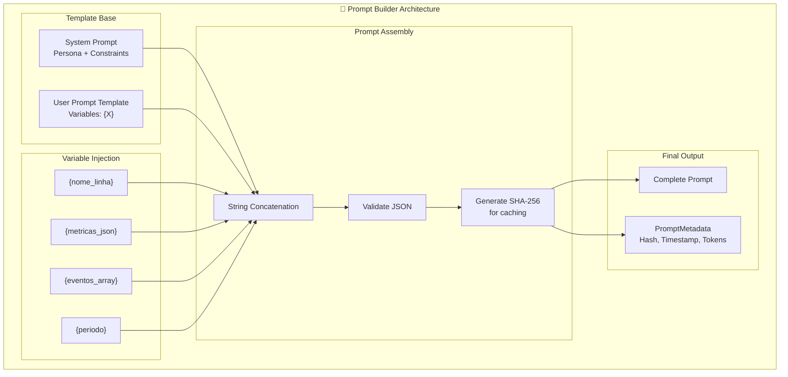

#### Prompt Version Control Table

| Version | Date | Changes | Hash |
|---------|------|---------|------|
| 1.0 | 2026-04-01 | Initial prompt | a1b2c3... |
| 1.1 | 2026-04-02 | Added ODS alignment | d4e5f6... |
| 1.2 | 2026-04-05 | ROI focus enhancement | g7h8i9... |

### 3.3 Response Handling and Persistence

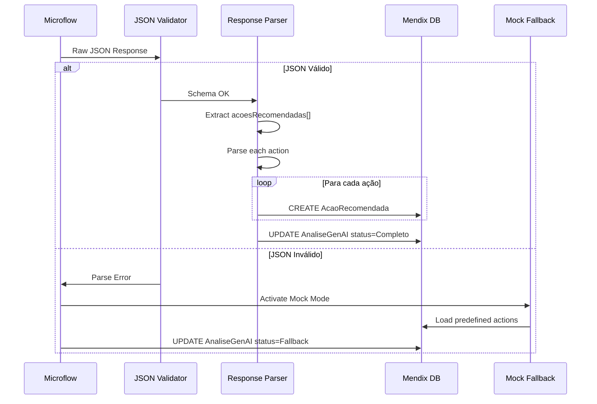

#### Response Handling States

| State | Condition | Action | User Experience |
|-------|-----------|--------|-----------------|
| `Processando` | API call initiated | Show spinner | Loading state |
| `Completo` | Valid JSON received | Render actions | Success |
| `Fallback` | API error/timeout | Load mock data | Graceful degradation |
| `Erro` | Unrecoverable error | Show message | Error notification |

---

## 4️⃣ MENDIX-SPECIFIC PATTERNS

### 4.1 Microflow Data Patterns

#### Pattern 1: Transactional CRUD with Calculated Fields

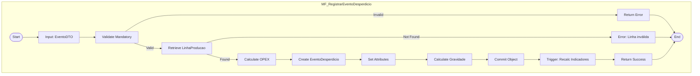

**Key Mendix Features Used:**
- Change Object activity
- Commit with events
- Retrieve by association
- Exclusive split for validation

#### Pattern 2: Aggregation Pipeline

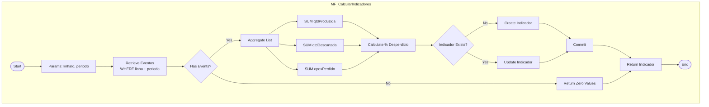

### 4.2 Nanoflow for Offline/Responsive Scenarios

#### Nanoflow: `NF_LoadGenAIWithFeedback`

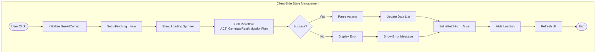

**Mendix Widgets Used:**
- Nanoflow Button
- Data List
- Progress Bar (conditional visibility)
- Snackbar (notifications)

### 4.3 Atlas UI Data Binding

#### Page Structure: `Page_DashboardCLevel`

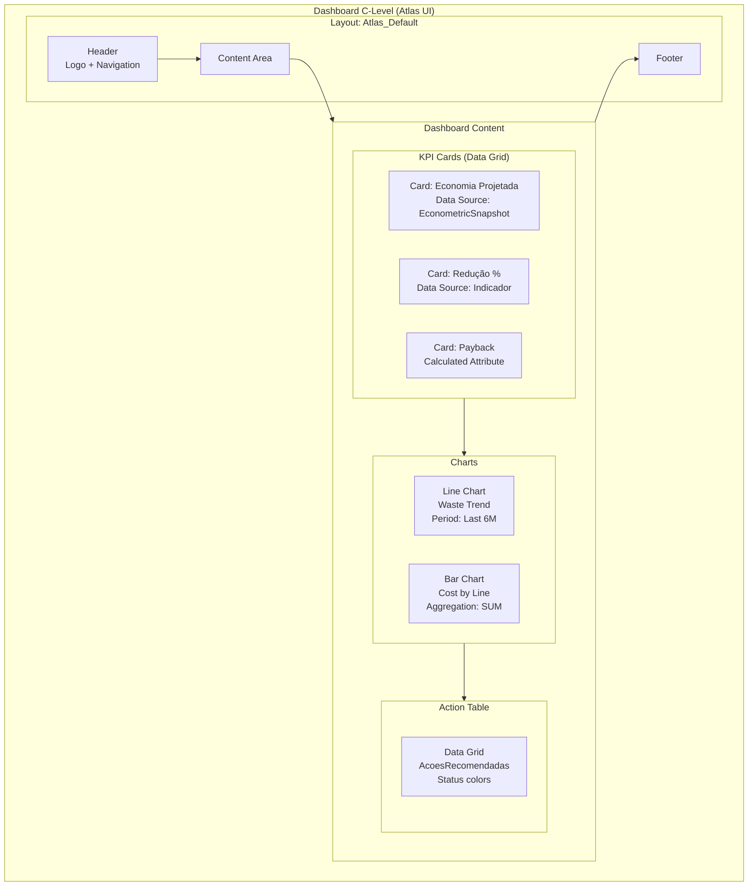

#### Atlas UI Theme Configuration

| Element | Mendix Class | Color/Value | Usage |
|---------|--------------|-------------|-------|
| Primary Button | `btn-primary` | #1976D2 (Siemens Blue) | Main actions |
| Success KPI | `text-success` | #4CAF50 | Positive metrics |
| Warning Waste | `text-warning` | #FF9800 | 3-5% waste |
| Danger Waste | `text-danger` | #F44336 | >5% waste |
| Card Background | `card` | #1E1E1E | Dark mode |
| Font | Atlas default | Roboto | Typography |

---

## 5️⃣ DATA PRODUCT METRICS (THE "SO WHAT?")

### 5.1 What Data Proves Value to Siemens?

```mermaid
flowchart TB
    subgraph SIEMENS_VALUE["🏭 Siemens Value Proof Points"]
        
        subgraph MENDIX_PROOF["Mendix Platform Value"]
            M1["Speed: 48h vs 6 months<br/>Traditional Development"]
            M2["GenAI Integration:<br/>Native REST capabilities"]
            M3["Industrial Fit:<br/>Proven in F&B context"]
            M4["Scalability:<br/>Multi-tenant ready"]
        end
        
        subgraph XCELERATOR["Xcelerator Marketplace"]
            X1["App Store Ready:<br/>Packaged solution"]
            X2["MindSphere Ready:<br/>IoT integration hooks"]
            X3["DEGREE Aligned:<br/>ESG compliance"]
        end
        
        subgraph HARDWARE["Hardware Upsell"]
            H1["SITRANS Sensors:<br/>Integration points"]
            H2["MindConnect:<br/>Edge connectivity"]
            H3["SCALANCE:<br/>Network infrastructure"]
        end
        
    end
    
    MENDIX_PROOF --> XCELERATOR
    XCELERATOR --> HARDWARE
```

### 5.2 Metrics That Justify Mendix License Sales

| Metric | Target | Calculation | Demo Moment |
|--------|--------|-------------|-------------|
| **Time-to-Value** | < 7 days | (DeployDate - StartDate) | Dashboard splash |
| **User Adoption** | > 80% | ActiveUsers / TotalUsers | Operator view |
| **Action Velocity** | < 1 hour | EventTime → ActionGenTime | GenAI demo |
| **ROI Visibility** | Immediate | Real-time cost display | C-Level dashboard |
| **Mobile Ready** | 100% | Responsive pages | Phone demo |

### 5.3 TrueChange Implementation Metrics

| Metric | Target | Business Value | Evidence |
|--------|--------|----------------|----------|
| **Implementation Speed** | 4-6 weeks | vs 6 months traditional | Case study |
| **Developer Productivity** | 10x | Lines of code equivalent | Benchmark |
| **Change Request Velocity** | < 1 day | New features/changes | Agility proof |
| **Integration Capability** | REST + DB + AI | Complex enterprise ready | Architecture |
| **Training Transfer** | 2 days | Citizen developer ready | Enablement |

### 5.4 The "Judging Scorecard" Data Model

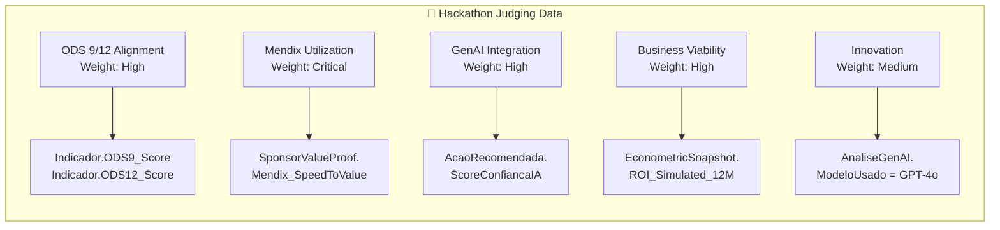

---

## 6️⃣ INTEGRATION WITH INTELLIGENCE LAYER

### 6.1 How Data Architecture Supports Aggressive BI

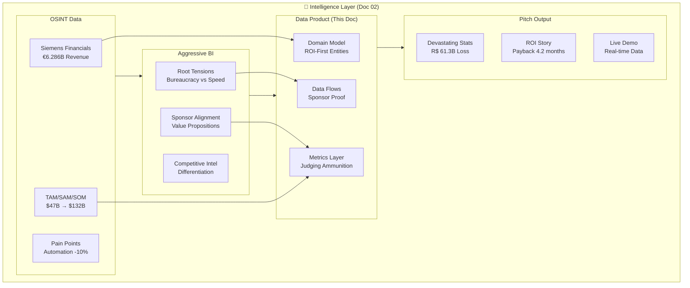

### 6.2 Real-Time Econometric Calculations

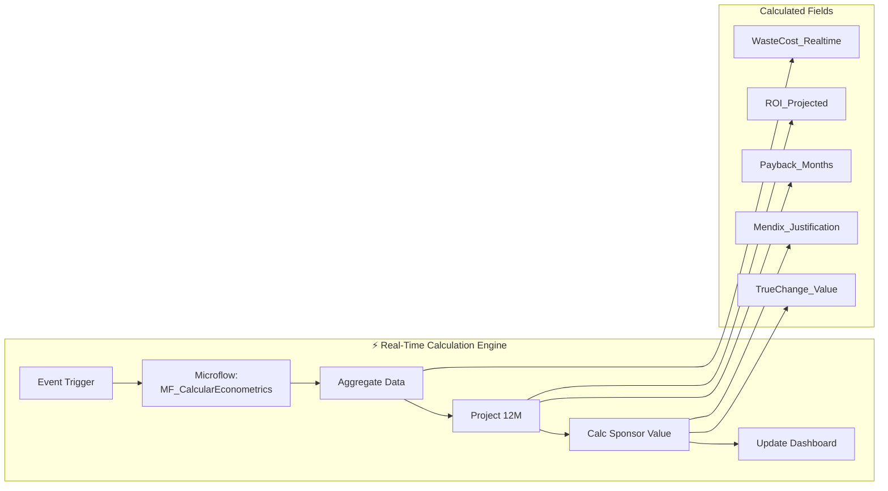

### 6.3 Sponsor Value Demonstration

#### Live Dashboard Elements for Judges

| Element | Data Source | Sponsor Message |
|---------|-------------|-----------------|
| **"R$ Economizado" Counter** | EconometricSnapshot.ROI_Simulated_12M | "This is why you buy Mendix" |
| **"Tempo de Desenvolvimento" Badge** | SponsorValueProof.Mendix_SpeedToValue | "10x faster than traditional" |
| **GenAI Action Cards** | AcaoRecomendada + AnaliseGenAI | "AI integration made easy" |
| **ODS 9/12 Score Gauge** | IndicadorSustentabilidade | "DEGREE framework aligned" |
| **TrueChange Implementation ROI** | SponsorValueProof.TrueChange_PipelineValue | "Partner success story" |

---

## 7️⃣ IMPLEMENTATION ROADMAP (DATA-FIRST)

### 7.1 Day 1: Domain Model Entities

```mermaid
gantt
    title Day 1: Domain Model Implementation
    dateFormat HH:mm
    axisFormat %H:%M
    
    section Entities Core
    LinhaProducao           :done, e1, 08:00, 2h
    EventoDesperdicio       :done, e2, after e1, 2h
    
    section Metrics
    IndicadorSustentabilidade :done, e3, after e2, 2h
    
    section AI Layer
    AnaliseGenAI            :active, e4, after e3, 2h
    AcaoRecomendada         :e5, after e4, 2h
    
    section Econometrics
    EconometricSnapshot     :e6, after e5, 2h
    SponsorValueProof       :e7, after e6, 2h
    
    section Security
    UserRoles               :e8, 08:00, 4h
    AccessRules             :e9, after e8, 4h
```

#### Day 1 Checklist

- [ ] Create `WasteGuardian_Core` module
- [ ] Define `LinhaProducao` entity (blue/persistent)
- [ ] Define `EventoDesperdicio` with calculated OPEX
- [ ] Define `IndicadorSustentabilidade` aggregation target
- [ ] Define `AnaliseGenAI` + `AcaoRecomendada` (1:N)
- [ ] Define `EconometricSnapshot` (ROI calculations)
- [ ] Define `SponsorValueProof` (judging ammunition)
- [ ] Define `GenAIContext` (orange/non-persistent)
- [ ] Configure `System.User` specializations
- [ ] Set entity access rules by role

### 7.2 Day 2: CRUD + Sample Data

```mermaid
gantt
    title Day 2: CRUD Operations & Data Seeding
    dateFormat HH:mm
    axisFormat %H:%M
    
    section Microflows
    MF_RegistrarEvento      :mf1, 08:00, 3h
    MF_CalcularIndicadores  :mf2, after mf1, 3h
    MF_CalcularEconometrics :mf3, after mf2, 3h
    
    section Pages
    Page_ListaLinhas        :p1, 08:00, 2h
    Page_RegistrarEvento    :p2, after p1, 2h
    Page_DetailLinha        :p3, after p2, 3h
    
    section Data
    SampleLinhas            :d1, 12:00, 2h
    SampleEventos           :d2, after d1, 2h
    SampleIndicadores       :d3, after d2, 2h
```

#### Day 2 Checklist

- [ ] Build `MF_RegistrarEventoDesperdicio` (create + validations)
- [ ] Build `MF_CalcularIndicadores` (aggregation logic)
- [ ] Build `MF_CalcularEconometrics` (ROI calculations)
- [ ] Create `Page_ListaLinhas` (overview grid)
- [ ] Create `Page_RegistrarEvento` (operator input)
- [ ] Create `Page_DetailLinha` (line detail + events)
- [ ] Seed 5 `LinhaProducao` sample records
- [ ] Seed 50 `EventoDesperdicio` realistic records
- [ ] Verify calculated fields populate correctly

### 7.3 Day 3: GenAI Integration

```mermaid
gantt
    title Day 3: GenAI Integration Layer
    dateFormat HH:mm
    axisFormat %H:%M
    
    section REST Integration
    OpenAI_REST_Config      :ai1, 08:00, 2h
    RequestMapping          :ai2, after ai1, 2h
    ResponseMapping         :ai3, after ai2, 2h
    
    section Prompts
    SystemPrompt            :ai4, 10:00, 2h
    UserPrompt_Template     :ai5, after ai4, 2h
    JSON_Schema             :ai6, after ai5, 2h
    
    section Microflows
    MF_GerarPlanoAcao       :ai7, 14:00, 3h
    MF_ParseResponse        :ai8, after ai7, 2h
    MockFallback            :ai9, after ai8, 2h
    
    section UI
    Nanoflow_LoadGenAI      :ai10, 18:00, 2h
    Page_PlanoAcao          :ai11, after ai10, 2h
```

#### Day 3 Checklist

- [ ] Configure REST service `OpenAI_API`
- [ ] Build Import Mapping (JSON → Entities)
- [ ] Craft System Prompt (persona + constraints)
- [ ] Build User Prompt template with variables
- [ ] Build `MF_GerarPlanoAcaoGenAI` (orchestrator)
- [ ] Implement error handling + retry logic
- [ ] Implement Mock Fallback (CSV/static)
- [ ] Build `NF_LoadGenAI` (client-side state)
- [ ] Create `Page_PlanoAcao` (action display)
- [ ] Test end-to-end flow with real API key

### 7.4 Day 4: Dashboard Metrics

```mermaid
gantt
    title Day 4: Dashboard & Sponsor Value Demo
    dateFormat HH:mm
    axisFormat %H:%M
    
    section C-Level Dashboard
    Page_DashboardCLevel    :dash1, 08:00, 4h
    KPI_Cards               :dash2, after dash1, 2h
    Charts_Config           :dash3, after dash2, 3h
    
    section Sponsor Proof
    SponsorMetrics_Query    :dash4, 12:00, 2h
    ValueProposition_Text   :dash5, after dash4, 2h
    Benchmark_Comparison    :dash6, after dash5, 2h
    
    section Polish
    Theme_DarkMode          :dash7, 16:00, 2h
    Responsive_Testing      :dash8, after dash7, 2h
    Navigation_Flow         :dash9, after dash8, 2h
    
    section Deploy
    Consistency_Check       :dash10, 20:00, 1h
    Export_MDA              :dash11, after dash10, 1h
    Cloud_Deploy            :dash12, after dash11, 1h
```

#### Day 4 Checklist

- [ ] Build `Page_DashboardCLevel` with Atlas layouts
- [ ] Configure KPI cards (EconometricSnapshot data)
- [ ] Add trend charts (6-month waste cost)
- [ ] Add sponsor value proof widgets
- [ ] Configure ODS 9/12 score visualization
- [ ] Apply Siemens Blue (#1976D2) theme
- [ ] Test responsive (desktop + mobile)
- [ ] Verify navigation flow
- [ ] Run consistency check
- [ ] Export .mda package
- [ ] Deploy to Mendix Cloud Free Tier
- [ ] Test live URL

---

## 8️⃣ APPENDIX: MENDIX TECHNICAL REFERENCE

### 8.1 Entity Attribute Reference

#### LinhaProducao
| Attribute | Type | Required | Default | Notes |
|-----------|------|----------|---------|-------|
| ID | AutoNumber | Yes | Auto | Primary Key |
| Nome | String(100) | Yes | - | Display name |
| TipoProduto | String(50) | No | "F&B" | Category |
| CapacidadeHora | Decimal | Yes | 0 | Units/hour |
| CustoOPEX_Hora | Decimal | Yes | 0 | R$/hour |
| Ativo | Boolean | Yes | true | Status |

#### EventoDesperdicio
| Attribute | Type | Required | Calculation | Notes |
|-----------|------|----------|-------------|-------|
| ID | AutoNumber | Yes | Auto | Primary Key |
| DataOcorrencia | DateTime | Yes | NOW() | Timestamp |
| QtdProduzida | Decimal | Yes | - | Total units |
| QtdDescartada | Decimal | Yes | - | Waste units |
| OPEXPerdido | Decimal | Yes | Qty × Custo | Calculated |
| CausaNarrativa | String(500) | No | - | Operator notes |

### 8.2 Microflow Naming Convention

| Prefix | Purpose | Example |
|--------|---------|---------|
| `MF_` | Server-side microflow | `MF_CalcularIndicadores` |
| `NF_` | Client-side nanoflow | `NF_LoadGenAI` |
| `ACT_` | Action/Integration | `ACT_GenerateRestMitigationPlan` |
| `SUB_` | Subflow/reusable | `SUB_ValidarEvento` |
| `IVK_` | Invocation wrapper | `IVK_GerarPlanoWrapper` |

### 8.3 REST API Configuration

```
Service Name: OpenAI_API
Base URL: https://api.openai.com/v1
Timeout: 30 seconds

Headers:
  Authorization: Bearer {API_KEY}
  Content-Type: application/json

Resources:
  POST /chat/completions
    Request: JSON
    Response: JSON (mapped to Import Mapping)
```

---

## 9️⃣ SUMMARY: THE DATA-FIRST VICTORY

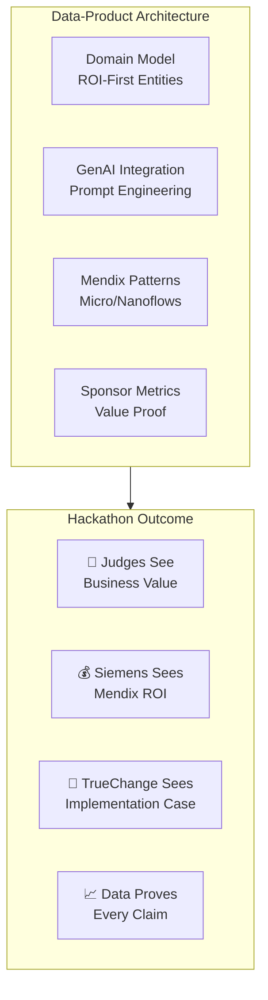

> **Final Principle:** *"In hackathons, architecture isn't about technical purity—it's about creating a data story so compelling that judges have no choice but to award you first place. Every entity, every flow, every metric must serve this singular purpose."*

---

**Document Version:** 1.0  
**Last Updated:** 02 April 2026  
**Related Documents:**
- `02_Aggressive_BI_Intelligence.md` (Business Intelligence)
- `04_Real_Execution_Roadmap.md` (Implementation Timeline)
- `../docs/SYSTEM-DESIGN.md` (Technical Architecture)
- `../scaffolding/tech/01-mendix-domain-model.md` (Entity Details)
