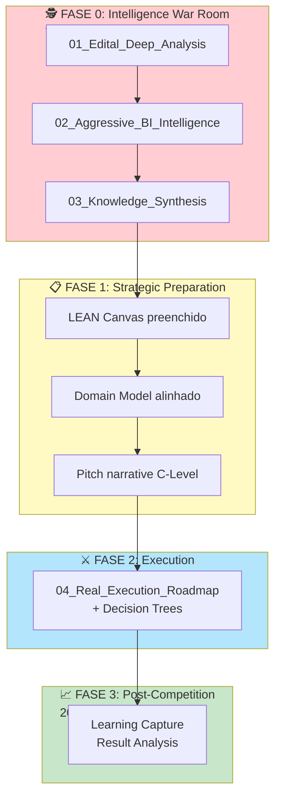

# 🧠 INTELLIGENCE LAYER — Low Hack 2026

> **War Room Central de Inteligência Competitiva**  
> *"Conhecimento é a única vantagem competitiva sustentável em 48h de hackathon.*"

---

## 🎯 Propósito desta Camada

Esta pasta contém os documentos de **Inteligência Estratégica Ofensiva** que transformam o Low Hack 2026 de uma competição técnica em uma **operação de precisão comercial**. 

Seguindo os workflows universais (`Workflow_00_Capital_Flow_First`, `Workflow_01_Winning_Strategy`), estes documentos fornecem:

- 🕵️ **OSINT & Capital Flow Analysis**: Quem paga, por quê, e onde dói
- 📊 **Aggressive BI**: Números devastadores que impressionam C-Level
- 🎯 **Edital Deep Analysis**: Brechas, tie-breakers e alavancagens
- 🗺️ **Knowledge Synthesis**: Synthesis de Macro→Meso→Micro
- ⚡ **Real Execution Roadmap**: War room operacional com gatilhos de decisão

---

## 📚 Documentos de Inteligência

| # | Documento | Propósito | Quando Usar |
|---|-----------|-----------|-------------|
| **01** | [📜 Edital Deep Analysis](01_Edital_Deep_Analysis.md) | Decomposição completa do regulamento com brechas, tie-breakers e estratégia de scoring | **Antes de escrever qualquer código** |
| **02** | [📊 Aggressive BI Intelligence](02_Aggressive_BI_Intelligence.md) | Capital flow analysis, TAM/SAM/SOM, sponsor profiling, estatísticas devastadoras | Fase de preparação + pitch |
| **03** | [🧬 Knowledge Synthesis OSINT](03_Knowledge_Synthesis_OSINT.md) | Macro-Meso-Micro architecture, psicologia C-Level, frameworks de decisão | Todo o ciclo de competição |
| **04** | [⚡ Real Execution Roadmap](04_Real_Execution_Roadmap.md) | Roadmap operacional com gatilhos, decision trees, checkpoints de inteligência | Durante a execução (18-19/04) |

---

## 🔄 Fluxo de Trabalho Inteligência-Driven

---

## 🎖️ Checklist de Ativação da Inteligência

### Pré-Competição (Obrigatório)

- [ ] **Ler 01_Edital_Deep_Analysis**: Identificar todos os loopholes e tie-breakers
- [ ] **Estudar 02_Aggressive_BI_Intelligence**: Memorizar números-chave (TAM, waste %, ROI)
- [ ] **Revisar 03_Knowledge_Synthesis**: Entender Macro-Meso-Micro e psicologia C-Level
- [ ] **Marcar 04_Real_Execution_Roadmap**: Ter aberto durante a competição

### Durante Competição (Ativo)

- [ ] **Checkpoints de Inteligência**: Validar cada 4h contra os triggers do documento 04
- [ ] **Navegar por Contexto**:
  - Dúvida sobre **regras/edital** → Documento 01
  - Precisa de **dados/números** → Documento 02  
  - Decisão de **priorização** → Documento 03
  - Crise de **tempo/escopo** → Documento 04

### Post-Competição (Learning)

- [ ] **Capturar lições**: Atualizar os documentos com insights da competição
- [ ] **Manter relacionamentos**: Usar templates do documento 04 para follow-up

---

## 🔗 Integração com outros Módulos

| Este Módulo | Conecta com | Via |
|-------------|-------------|-----|
| **intelligence/** | `docs/ROADMAP.md` | 04_Real_Execution_Roadmap estende o roadmap técnico |
| **intelligence/** | `business/` | 02_Aggressive_BI alimenta canvas e econometrics |
| **intelligence/** | `pitch/` | 03_Knowledge_Synthesis fornece narrativa C-Level |
| **intelligence/** | `strategy/` | 01_Edital_Analysis valida a estratégia de ataque |
| **intelligence/** | `tech/` | 04_Execution_Roadmap sincroniza com implementação |

---

## 💡 Princípios Orientadores

> **"Código é commodity; tese de mercado é barreira de entrada."**

1. **Follow the Money**: Todo edital corporativo esconde uma dor financeira do patrocinador
2. **Macro-Meso-Micro**: Problemas globais → Danos industriais → Soluções de software
3. **C-Level First**: Jurados são executivos, não desenvolvedores. ROI > Stack técnica
4. **Inteligência > Esforço**: 10h de OSINT vale mais que 20h de código desorientado
5. **Tie-Breaker Focus**: Vencer é sobre o 1º critério de desempate, não apenas a média

---

## 📞 War Room Protocol

Em caso de dúvida estratégica durante a competição:

1. **15-Min Rule**: Não discutar mais que 15 min sem consultar os documentos de inteligência
2. **Data Wins**: Dúvida de priorização → Consultar 02_Aggressive_BI para números
3. **C-Level Check**: Antes de qualquer decisão, perguntar: *"O CFO se importaria com isso?"*
4. **Kill Switch**: Se 2+ triggers de risco do doc 04 forem ativados → Ativar protocolo War Room

---

## 🚀 Quick Start

### Sou novo na equipe:
1. Leia [01_Edital_Deep_Analysis.md](01_Edital_Deep_Analysis.md) (20 min)
2. Estude a seção "Pre-mined Statistics" de [02_Aggressive_BI_Intelligence.md](02_Aggressive_BI_Intelligence.md) (10 min)
3. Revisar [04_Real_Execution_Roadmap.md](04_Real_Execution_Roadmap.md) - Fase 2 (15 min)

### Estou na competição e preciso de ajuda AGORA:
- **Brecha no edital?** → Doc 01, seção "Loopholes & Leverage"
- **Números para o pitch?** → Doc 02, seção "Pre-mined Devastating Statistics"
- **Decidir feature A ou B?** → Doc 03, seção "Feature Prioritization Matrix"
- **Estamos atrasados?** → Doc 04, seção "Decision Trees"

---

## 📝 Changelog

| Data | Versão | Mudanças |
|------|--------|----------|
| 2026-04-02 | v1.0 | Criação da Intelligence Layer com 4 documentos base |

---

> **"A vitória é decidida na War Room, não na IDE."**

[← Voltar ao INDEX Principal](../INDEX.md) | [📊 Business](../business/INDEX.md) | [⚔️ Strategy](../strategy/INDEX.md) | [💻 Tech](../tech/INDEX.md) | [🎬 Pitch](../pitch/INDEX.md)

---

*Última atualização: 02/04/2026*
