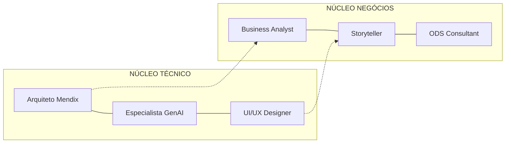
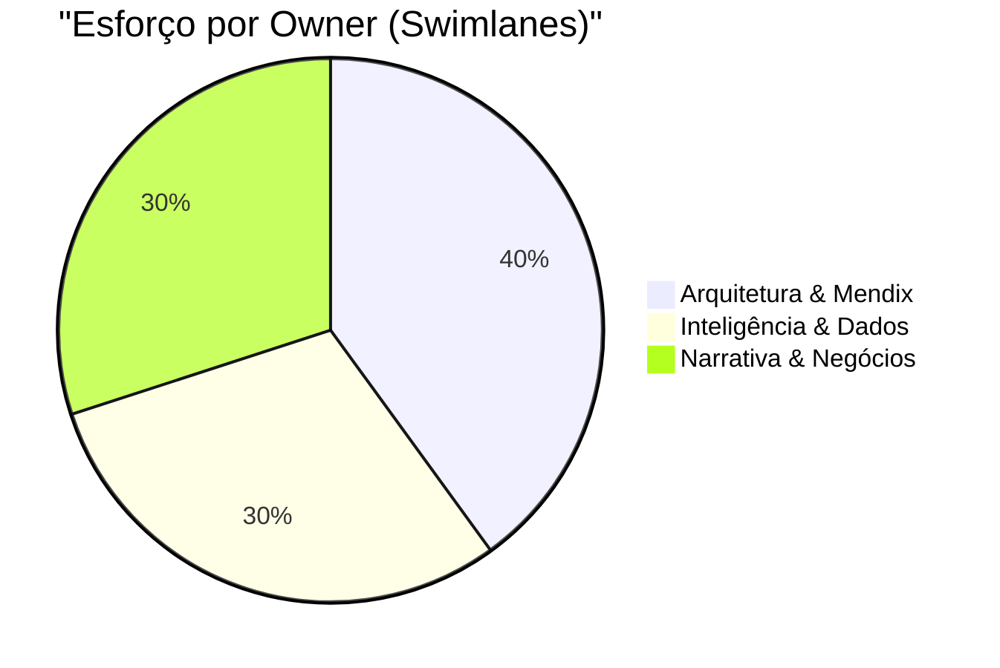
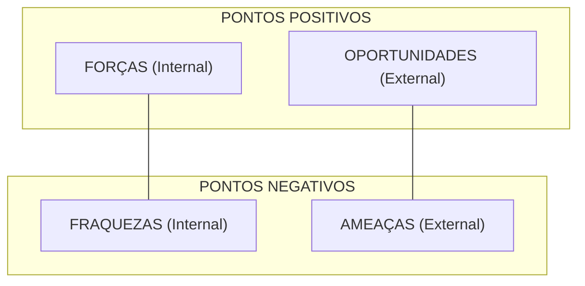
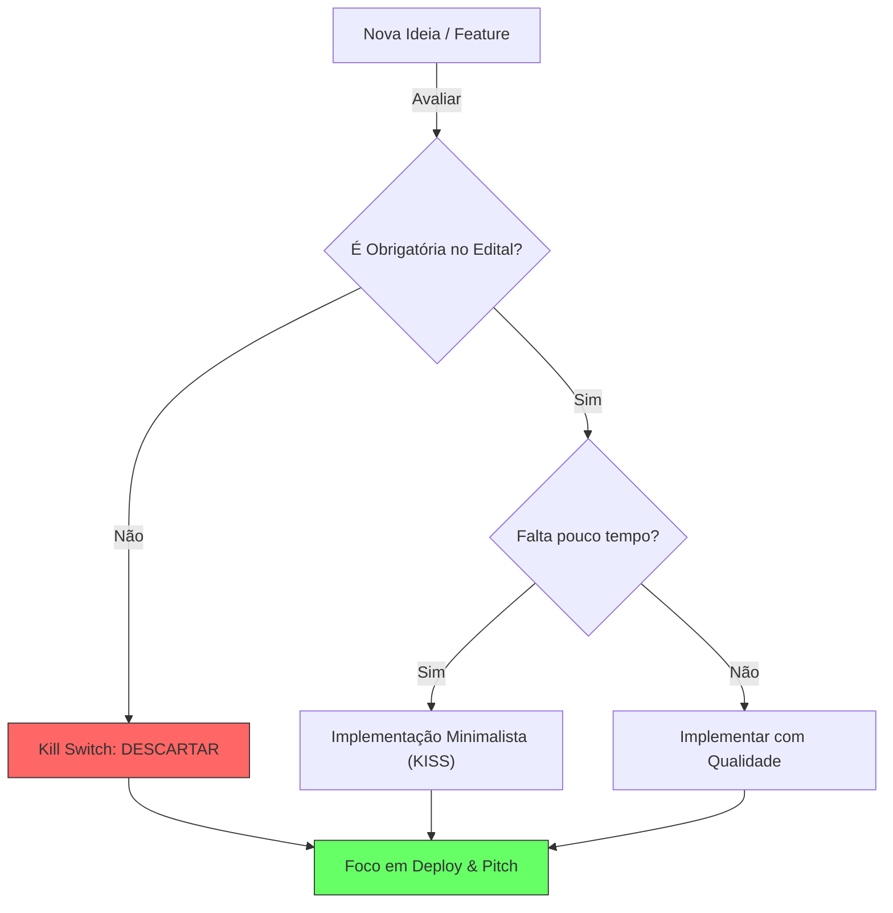

# Playbook Tático e Regras de Engajamento: Low Hack 2026

> "**Nós não estamos construindo só um software, estamos embalando e vendendo Transformação Digital e Sustentabilidade para a Siemens e Mendix.**"

## 1. A Tese Central: "Waste Guardian"

A aplicação chamará **Waste Guardian**, focada na indústria de *Food & Beverage* (alimentos e bebidas), onde o desperdício global é gigantesco. Nossa solução é um **Copiloto Operacional (via OpenAI)** encapsulado em um app PWA **Mendix**. Ele monitora as perdas de matéria-prima em tempo real e entrega recomendações ativas à supervisão, impactando de imediato a redução de lixo (ODS 12) e otimização de infraestrutura / custos industriais (ODS 9).

## 2. Divisão de "Owners" ("Swimlanes")

- **Owner de Arquitetura & Mendix:** Responsável por garantir o compliance técnico do edital. Terá a tarefa de construir as Entidades, UI e rodar Micro/Nanoflows obrigatoriamente exigidos. Publica e testa o APP no Free Tier. Configura a API da OpenAI via Mendix Connector.
- **Owner de Inteligência & Dados:** Responsável pelo prompt engineering (definir as personalidades e heurísticas da IA para respostas precisas aos operadores) e por manipular/mockar os dados de eventos de desperdício na plataforma de demonstração.
- **Owner de Narrativa & Negócios:** Cuida do "Front-End do Hackathon". Seu único foco é construir e ensaiar o Roteiro de 3 Minutos, atrelá-lo com as ODS e a persona (Supervisor Tácito), liderando a formatação do "GitHub" ou Google Drive exigido e das documentações.

### 2.1 Distribuição de Responsabilidades

## 3. Matriz SWOT Rápida

| Forças | Fraquezas |
|--------|-----------|
| Organização pré-evento imbatível (o scaffolding é focado 100% no edital); Documentação pronta desde o minuto zero. | Conhecimento nativo da nuvem Mendix pode ser inicial (precisaremos blindar tempo contra debugging trivial); Time-box de fim de semana é violento. |
| **Oportunidades** | **Ameaças** |
| Ser um *Showcase Siemens* (mostrar valor Enterprise na narrativa que a alta gerência gosta). Destravar conexões ou mesmo o ecossistema TrueChange. | Gastar muito tempo polindo UX ao invés de focar no Microflow crucial de integração da OpenAI. Desrespeitar regras (horários das Lives / links de formulário com formato errado). |

### 3.1 Visualização SWOT

## 4. O Sistema de "Kill Switch" (Foco Extremo)
Se em qualquer momento durante a execução entre Dia 1 e Dia 2 começarmos a implementar "features legais", aciona-se o Kill Switch e os esforços retornam para a lista de **Entregáveis Letais** (Obrigatórios do Regulamento):
- [*] O app usa GenAI via API fornecida de forma tangível?
- [*] Está em deploy na Mendix Cloud com link disponível?
- [*] Tem no mínimo um Microflow ou Nanoflow rodando na lógica principal?
- [*] Tem CRUD (Persistência) mínimo testando dados?
- [*] O vídeo gravado ultrapassou 3 minutos? Se sim, REFazer.

### 4.1 Fluxo Decisório "Kill Switch"

---

## 5. Roadmap Pós-Hackathon (A Visão de 6 Meses)

Um projeto vencedor precisa provar que não morre no domingo às 21:00.

| Tempo | Milestones | Foco de Valor |
| :--- | :--- | :--- |
| **Mês 1** | Piloto em 1 linha real de envasamento (Planta Siemens). | Validação de KPI de Opex. |
| **Mês 2** | Integração Nativa via Conectores MindSphere. | Automatização de Ingestão de Dados. |
| **Mês 3** | Expansão para 3 Unidades (Brasil/Alemanha). | Escalabilidade Global. |
| **Mês 6** | Marketplace Siemens Xcelerator (Lançamento Oficial). | Monetização e Escala Comercial. |

## 6. Protocolo "War Room" (Gestão de Crise 35h)

Se algo travar durante o Hackathon, siga o protocolo de 15 minutos:
1. **0-5 min:** Tente resolver (Debug padrão).
2. **5-10 min:** Consulte a documentação `scaffolding/tech/`. Procure o "Kill Switch" se for problema de API.
3. **10-15 min:** Se persistir, o Arquiteto Mendix decide: **Pivotar** (Simplificar UI/Lógica) ou **Mocar** (Pular o passo técnico e focar na narrativa visual). *Nunca gaste mais de 1h num único blocker.*

## 7. Xcelerator Marketplace Readiness (Requisitos de Elite)

Para sermos "Xcelerator-Ready", o Waste Guardian deve seguir estes pilares técnicos durante as 35h:

- **🔐 Segurança (Mendix SS):** Implementar Mendix Level-Security (Production Level), dividindo acesso entre `Operador` e `Administrador`. Jamais deixar anonymous access ligado.
- **🔌 Interoperabilidade (API First):** Expor no mínimo um endpoint REST no Mendix para mostrar que outros sistemas Siemens podem "consumir" nossa inteligência.
- **☁️ Multi-tenancy (Scalability):** Estruturar o Domain Model para suportar múltiplas plantas (Empresas A, B, C) isoladas logicamente.

## 8. Estratégia de "Infiltração Industrial" (Tactical Infiltration)

Nossa tese de mercado é: **Mendix é o Cavalo de Troia da Siemens.**

- O cliente usa SAP ou Oracle? Não importa. O Waste Guardian roda em cima via OData/REST.
- Ao resolver a dor do desperdício F&B, o cliente "prova" o valor do Low-code Siemens.
- O passo seguinte é a migração da infraestrutura legada para o ecossistema Siemens (PLM, MES, IIoT). Nosso Pitch deve flertar com essa **conversão de mercado**.
