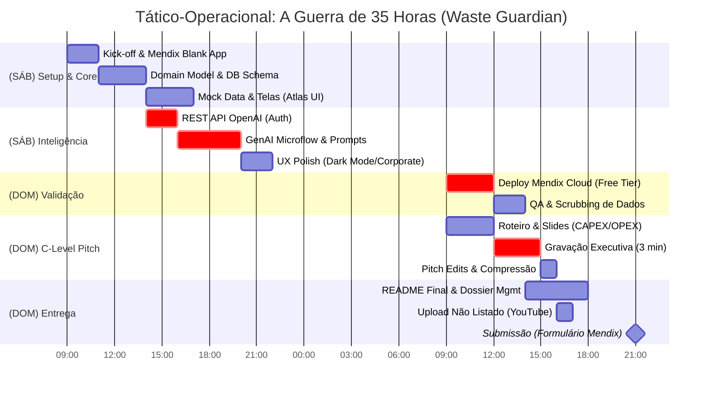
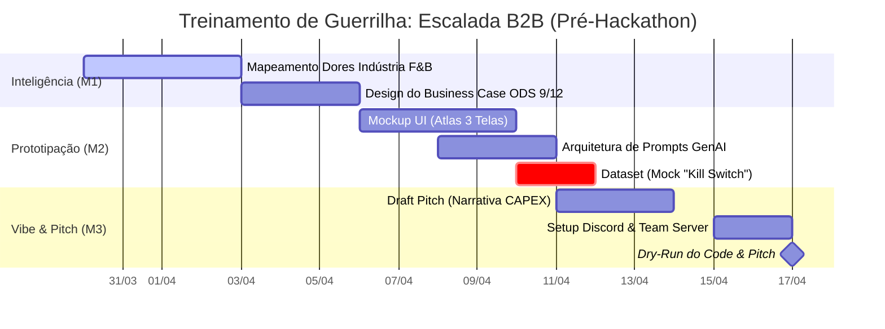

# Cronograma de Ataque: O Fim de Semana (35 Horas de Guerra)

## 🛡️ Treinamento de Guerrilha (Bi-Agressivo: Pré-Hackathon)

Metas semanais para garantir que a largada no dia 18/04 seja em "velocidade de cruzeiro" e a arquitetura seja 100% antifrágil.

### Semana 1 (Hoje - 05/04): Inteligência e Mapeamento de Terreno

*Foco Macro: Domínio da Arquitetura Mendix e GenAI*

- [ ] **Tech (Mendix):** Estudo de Data Grid 2 e componentização via Atlas UI (CSS baseline da Siemens).
- [ ] **Tech (GenAI):** Desenvolver o System Prompt imutável (JSON Restrict) para a API OpenAI.
- [ ] **Business:** Estudar 3 Casos de Uso/Secesso da Siemens (Indústria de Alimentos) e plugar métricas no Roteiro.
- [ ] **Antifrágil:** Desenhar Domain Model (Diagrama ER) e cruzar com as restrições técnicas do edital.

### Semana 2 (06/04 - 12/04): Prototipagem e "Mocking" Antifrágil

*Foco Macro: O Plano B Invisível aos Juízes*

- [ ] **Tech (Mendix):** Mockup end-to-end das 3 telas obrigatórias (Dashboard principal em Dark/Corporate Mode).
- [ ] **Tech (Integração):** Mapemento literal do Microflow para chamadas REST (Auth + Headers da OpenAI).
- [ ] **Business:** Fechar 1º rascunho do Storytelling do Pitch (Foco no CAPEX vs OPEX do desperdício de insumos).
- [ ] **Antifrágil (Kill Switch):** Criar dataset Mock (CSV offline) e embutir no Mendix. Se a API falhar no pitch, o app consome o local silenciosamente.

### Sprint 0 (13/04 - 17/04): Dress Rehearsal (Pronto para Guerra)

*Foco Macro: Simulação de Alta Pressão e Setup Travado*

- [ ] **Tech:** Blank App no Team Server criado e configurado (Módulos OData, REST e Charting importados).
- [ ] **Business:** Simulação de Pitch "Contra o Relógio" com o Mockup navegável (Cortar jargão fútil, focar no negócio).
- [ ] **Antifrágil:** Lock-in de Tarefas (Divisão cega de quem coda UI, quem coda lógica, quem roteiriza o pitch). Nenhum desvio permitido no sábado.

---

## DIA 1 - Sábado, 18 de Abril

### 09:00 - 11:00 | Kick-off e Reconhecimento (Setup Total)

- Presença obrigatória nas "Lives" da organização (Discord The Lounge).
- Setup Final do Projeto Mendix - `Creation` do Scaffold do Mendix Template Blank.
- Compartilhamento (Team Sync) de repositórios/chaves e acesso no Studio Pro / Web Studio.
- Iniciar ingestão do Mock Dataset de Alimentos no Mendix (entidade `EventoDesperdicio`).

### 11:00 - 14:00 | Estrutura de Domínio & Microflows Core

- Criação das 4 entidades mestres (Domain Model).
- Setup e Mock das páginas cruciais: 1) Visão Geral (Dashboard) 2) Detalhes (Lista de Eventos).
- Fazer a conexão Mendix X Rest API (OpenAI) e testar ping básico.

### 14:00 - 18:00 | Implementação da Inteligência ODS (A Mágica)

- **Marco do dia:** Integrar Prompts "Waste Guardian" via ChatGPT API.
- Refinamento do Layout UI (Aplicar tema, responsividade e botões focados num design Enterprise, Dark/Light Corporate Siemens).
- Programação dos Nanoflows para chamadas de IA dinâmicas.

### 18:00 - 22:00 | Polish Funcional

- UX/UI de "Action Plan" (Tela 3) mostrando texto e contexto que a GenAI responde.
- Tratamento de mensagens de erro.
- Preencher o arquivo de Projeto via documentação.

## DIA 2 - Domingo, 19 de Abril

### 09:00 - 12:00 | Bateria de Testes + Pitch Drift

- Deploy inicial no Mendix Cloud (Free Tier). O link do servidor Mendix *deve* estar funcionando e abrindo liso antes do almoço.
- Revisão Final de Bugs Críticos (CRUD tá funcionando?).
- Owner de Pitch roda a 1ª bateria cronometrada no espelho usando a Aplicação Viva (Captura de Interface).

### 12:00 - 16:00 | Gravação do Pitch (Nível Cinema)

- Focar exaustivamente em roteiro. Gravar desktop + facecam.
- Em paralelo, os devs estão empacotando o README com as instruções exigidas, link do app e capturas de tela bem arquitetadas (o diferencial de desempate!).

### 16:00 - 19:00 | Redundância e Post-Mortem "As-Is"

- Upload do Pitch pro YouTube em formato **NÃO LISTADO**.
- Verificação Cruzada do Edital:
  - Pasta com arquivos? (Sim)
  - Link de deploy? (Sim)
  - PDF/TXT do vídeo? (Sim)
- Formulário final preenchido e verificado pelos 3 owners.

### 19:00 - 21:59 | O "Zero-Day" Waiting (Evite Entregar aos 45 do Segundo Tempo)

- **21:00** deve ser o "Hard Stop Limit". O envio oficial acontece pelo menos uma hora antes do cordão de isolamento da meia-noite das bancas do Low Hack.
