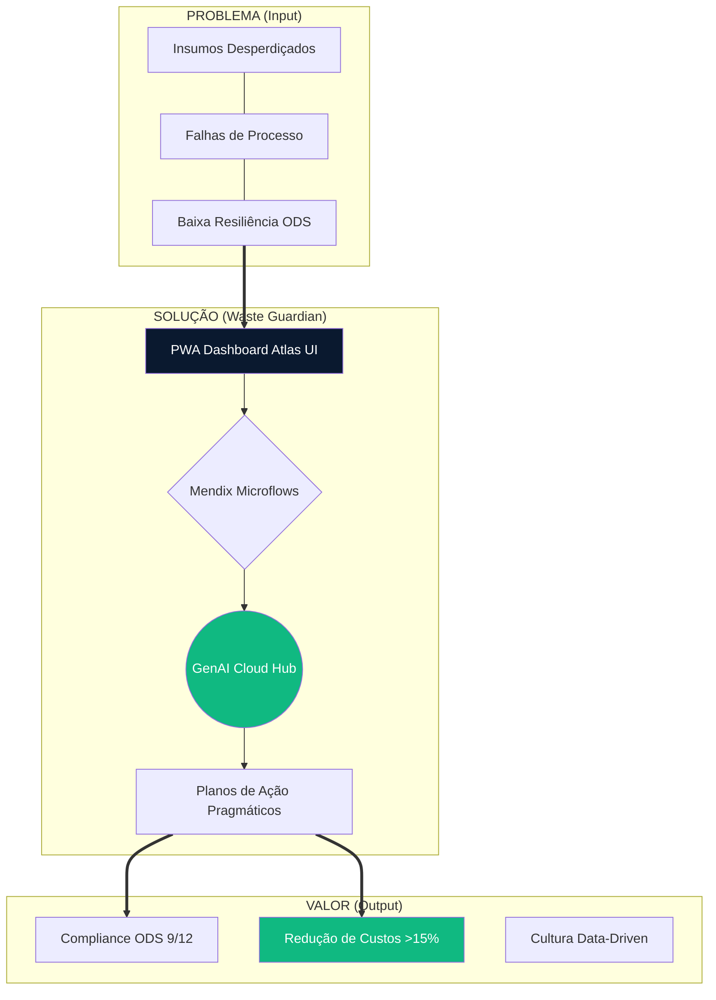
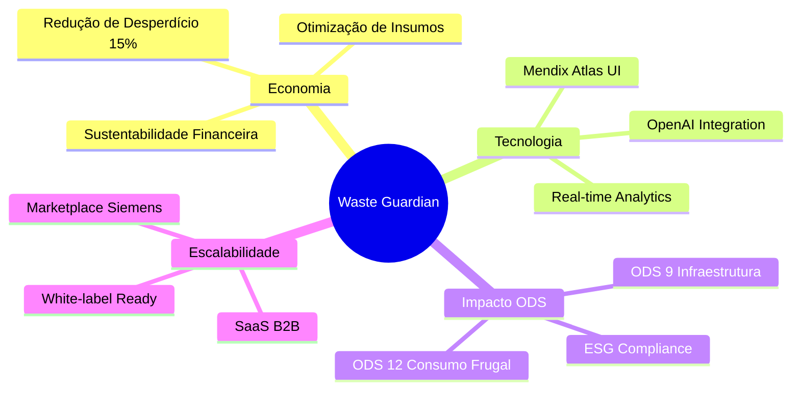
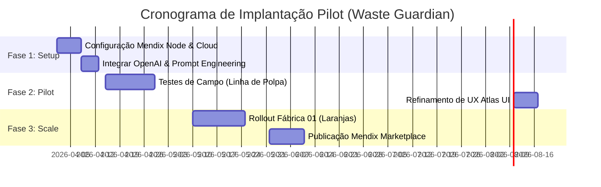

# DOSSIÊ ESTRATÉGICO MASTER: WASTE GUARDIAN 🏭
**Hackathon Low Hack 2026 (Siemens / Mendix / Hackathon Brasil)**
*Confidencial - Material Restrito da Equipe*

---

> **Resumo Executivo Expandido:**
> Este compêndio definitivo reúne a totalidade do esforço tático, de engenharia e negocial para a vitória no Low Hack 2026. A tese do **Waste Guardian** propõe não apenas um app, mas uma **mudança estrutural na operação industrial** através da união do Low-Code (Mendix) com a Inteligência Artificial Generativa (OpenAI). Este documento serve como Bíblia da equipe: ditando desde associações de banco de dados e microflows complexos, até posturas psicológicas no pitch comercial. Se não estiver neste documento, não deve ser feito durante as 35 horas críticas.

---

## 1. O NÚCLEO DO PROJETO E POSICIONAMENTO GLOBAL

### 1.1. O Problema Sistêmico (Alinhamento ODS 9 e ODS 12)
Na indústria de *Food & Beverage* (F&B), as perdas não ocorrem por falta de dados, mas pela **latência da ação**. Relatórios de desperdício (refugo, setup demorado, validade expirada) são gerados em D+1 ou em fechamentos mensais. O operador de chão de fábrica vê o problema, mas a correção sistêmica é engessada. 
* **ODS 9 (Indústria, Inovação e Infraestrutura):** Retrofit digital sem necessidade de trocar maquinário.
* **ODS 12 (Consumo e Produção Responsáveis):** Redução drástica de descarte de insumos alimentícios por falhas de processo.

### 1.2. A Solução: Waste Guardian
Um **Copiloto Operacional (B2B SaaS)** nativo em Mendix, desenhado como Progressive Web App (PWA). Ele descentraliza a inteligência: permite que qualquer inspetor ou operador de linha reporte anomalias em linguagem natural e receba, em segundos, um "Plano de Ação de Contenção" gerado por IA. Isso transforma reatividade em proatividade em tempo real.

### 1.3. Matriz SWOT de Guerra (Equipe e Produto)
| FORÇAS (Strengths) | FRAQUEZAS (Weaknesses) |
| :--- | :--- |
| **Arquitetura Tática:** Zero tempo perdido pensando "o que fazer". Documentação corporativa pronta antes do start. | **Curva Mendix:** Risco de travamento em lógicas complexas de microflow ou styling CSS customizado. |
| **Narrativa Blindada:** Conexão imbatível entre tecnologia de ponta e dor real de negócio (ROI). | **Exaustão:** Risco de fadiga mental comprometendo o Pitch (Domingo à tarde). |
| **OPORTUNIDADES (Opportunities)** | **AMEAÇAS (Threats)** |
| **Ecossistema Siemens:** O app serve como porta de entrada. Pode ser empacotado para o Mendix Marketplace. | **Scope Creep (Inchaço):** Tentar fazer integrações de IoT ou dashboards ultracomplexos e estourar o tempo. |
| **Visibilidade Executiva:** Falar diretamente com C-levels e mostrar visão arquitetural madura. | **Falha de API Externa:** OpenAI cair ou retornar timeouts durante a gravação do pitch. |

---

## 2. GOVERNANÇA, PAPEIS E O "KILL SWITCH"

### 2.1. "Swimlanes" - Divisão Estrita de Tarefas
* **Owner de Arquitetura & Mendix:** 
  * *Foco:* Domain Model, Telas (Atlas UI base), Microflows/Nanoflows, controle do deploy (`Publish`).
  * *Regra:* Proibido programar CSS na mão. Usar Building Blocks e Layouts nativos do Mendix.
* **Owner de Inteligência & Dados:** 
  * *Foco:* Engenharia do Payload/JSON, refinamento do Prompt da OpenAI, mock do dataset `.csv`, testes no Postman.
  * *Regra:* Garantir que a IA retorne *exatamente* o JSON mapeado pelo Import Mapping do Mendix.
* **Owner de Narrativa & Negócios:** 
  * *Foco:* Pitch Deck, gravação do vídeo 3 min, Business Model Canvas, redação técnica (README).
  * *Regra:* Blindar o escopo. Manter a equipe focada no valor, não na perfumaria do app.

### 2.2. Protocolo de Emergência: "Kill Switch"
Faltam 4 horas para a entrega e o app principal não funciona? Acione o Kill Switch garantindo a **Aprovação pelas Regras do Edital**:
1. [ ] Cortar telas secundárias. Focar em apenas 3 telas navegáveis (Overview, Form, Resultado).
2. [ ] Garantir o Deploy (Mendix Free Tier) rodando e público.
3. [ ] Integrar a OpenAI nem que seja num microflow bloqueante (`Synchronous`), ignorando loading spinners elaborados.
4. [ ] Iniciar a gravação do vídeo imediatamente. Pitch salva código quebrado, código quebrado não salva pitch não gravado.
5. [ ] Garantir uso inegociável da API GenAI (Coração do edital de 2026).

---

## 3. ARQUITETURA TÉCNICA AVANÇADA (MENDIX + OPENAI)

### 3.1. Mendix Domain Model (Associações e Constraints)
- **`LinhaProducao` (Main)**
  - Atributos: `NomeLinha` (String), `CapacidadeTon` (Decimal), `Status` (Enum: Ativa, Parada).
- **`EventoDesperdicio` (Log Input)**
  - *Associação:* 1 `LinhaProducao` -> `* EventoDesperdicio`
  - Atributos: `DataOcorrencia` (DateAndTime), `Turno` (Enum), `DescricaoProblema` (String ilimitada - vai pra IA), `KgPerdidos` (Integer).
- **`PlanoAcaoInteligente` (AI Output)**
  - *Associação:* 1 `EventoDesperdicio` - `1 PlanoAcaoInteligente`
  - Atributos: `RecomendacaoJSON` (String formatada), `NivelUrgencia` (Enum: Baixo, Médio, Crítico), `ScoreEstrategico` (Integer 0-100).

### 3.2. Fluxo de Dados e Segurança do Microflow (REST Call)
A chamada REST é o coração da estabilidade do Waste Guardian.
1. **Ativação:** Acionamento via botão "Pedir Plano à IA" na tela de `EventoDesperdicio` (Chama Microflow `ACT_GerarPlanoIA`).
2. **Construção do Body:** Uso de `Create Object` para montar o JSON stringificado (Módulo `System.JSON`).
   * *Atenção Técnica:* Tratamento do texto do usuário (escape de aspas) para não quebrar a chamada JSON da OpenAI.
3. **Segurança (App Security):** A chave da API `sk-proj-...` **nunca** deve estar hardcoded no microflow. Deve residir em uma **Constant** no Explorer do Mendix.
4. **Error Handling (Tratamento de Exceções):** 
   * Se a API OpenAI demorar > 15 segs, configurar *Custom Error Handling* no node `Call REST`. 
   * Retornar *"Show Message"* ao usuário final de forma elegante ("A Inteligência Central está processando alta carga de prioridades. Tente novamente.") ao invés de crashar a página.
5. **Persistência (Import Mapping):** O retorno JSON mapeia para as entidades `PlanoAcaoInteligente` em memória, faz `Commit` e gera um `Show Page` mandando o usuário para a página de Resultados.

### 3.3. UX/UI Tática com Atlas UI
Para "fingir" um time de design inteiro nas 35 horas:
- Usar **Card Action** components para as frentes de linha de produção.
- Usar **Badge widgets** baseados no `NivelUrgencia` (Renderizando Vermelho se Crítico, Laranja se Alerta).
- Embeber a resposta da IA em um container de `Format String` ou Widget de Markdown para o texto parecer orgânico e bem tabulado.

---

## 4. ENGENHARIA CRÍTICA DE PROMPT (OPENAI)

O prompt define se o App parece um brinquedo de ChatGPT ou um Software Industrial B2B.

**System Prompt (Blindado):**
> *"Você é o 'Waste Guardian', motor lógico e inteligência operacional para indústrias F&B. Você recebe relatórios informais de operadores sobre falhas no chão de fábrica e devolve OBRIGATORIAMENTE um objeto JSON rigoroso.*
> *O seu objetivo é reduzir perdas e otimizar maquinário alinhado às ODS 9 e 12 da ONU.*
> *Estrutura exigida:*
> `{ "nivel_urgencia": "string (Critico/Alerta)", "score_impacto": number (0-100), "plano_imediato": "string (2 parágrafos pragmáticos e diretos à manutenção)", "plano_estrutural": "string (Ideia estratégica de longo prazo)" }`
> *NUNCA retorne blocos de markdown em volta do JSON. Não cumpraite (greeting). Seja puramente técnico."*

---

## 5. GO-TO-MARKET (GTM) E METODOLOGIA COMERCIAL

### 5.1. O Modelo B2B SaaS B2B2E (Business to Business to Enterprise)
* **Pricing Model:** Licenciamento por Planta Física (Site License). 
  * Exemplo Tático: $800/mês por fábrica. Não importa quantos operadores baixem o app. Isso elimina atrito de adoção na base da pirâmide operacional.
* **Cost Advantage:** Gastos com processamento da LLM (OpenAI) são marginais (menos de US$ 5,00 por fábrica/mês usando GPT-4o-mini focado em chamadas esparsas) versus o valor gerado de milhares de reais salvos em insumos.

### 5.2. Escala via Mendix Marketplace
A verdadeira força do nosso Pitch: O Waste Guardian não é um app solto. Por ser codado em Mendix, pode ser transformado em um módulo reutilizável (`.mpk`) no Marketplace da Siemens. Outras empresas que já usam ERPs (SAP, Siemens Teamcenter) construídos em Mendix integram nosso módulo com *um clique*.

### 💎 Mindmap de Proposta de Valor

---

## 6. PLAYBOOK DE Q&A - JIU-JITSU VERBAL CONTRA JURADOS

Nas sabatinas (ou perguntas previstas) é onde times ganham ou perdem Hackathons gigantes. Como defender a aplicação de forma impiedosa:

🥊 **Ataque do Jurado:** *"Por que usar Inteligência Artificial pra isso se regras de condição simples (If caldeira esquenta > Mandar alerta) resolveriam?"*
🛡️ **Resposta Ouro:** *"Regras hardcoded dependem de variáveis estáticas, sensores IoT caros e sistemas legados complexos para serem interligados. A anomalia da indústria alimentícia é caótica (ex: 'caixa amassando porque fita adesiva colou no rolo'). Nossos operadores inserem a realidade crua em texto livre, a IA entende o contexto semântico do caos, e o Mendix orquestra a tarefa sem gastarmos 1 milhão em retrofits de sensores.*

🥊 **Ataque do Jurado:** *"E o risco de alucinação da inteligência artificial mandar o operador quebrar a máquina?"*
🛡️ **Resposta Ouro:** *"Mitigamos via Governança no Prompt e no Mendix. O Prompt possui formatação rígida no System Parameter focado em análises conservadoras. No Mendix, o App cria um Plano de Ação, mas o status dele fica 'Pendente de Aprovação' do Engenheiro Chefe. A IA é o copiloto analítico, não atua cega no maquinário (Human in the Loop)."*

🥊 **Ataque do Jurado:** *"Como vocês garantem privacidade dos dados industriais?"*
🛡️ **Resposta Ouro:** *"Sendo a segurança crítica para a Siemens, o PWA Mendix é governado por Role-Based Access Control (RBAC). A chamada de API para a OpenAI passa apenas os dados não-sensíveis do problema, sem IDs de clientes ou dados financeiros. Além disso, usaríamos APIs corporativas (Azure OpenAI) com termo de não-treinamento de dados (`No-Training-on-Data policy`) em um cenário de produção em massa."*

---

## 7. CRONOMETRAGEM IMPLACÁVEL DO PITCH (3 MINUTOS)

- **0:00 - 0:30 (O Gancho & A Dor):**
  - Câmera rápida e dinâmica. "Neste minuto em que começo a falar, milhares de quilos de comida foram para o ralo em fábricas brasileiras. Uma desconexão mortal entre dados lentos e operadores." (Mostrar gráficos rápidos de ODS 12 nas telas).
- **0:30 - 1:30 (A Demo Tática Bate-Pronto):**
  - Tela cheia no App (screencast liso). Mostrar como o operador em 3 toques digita um problema críptico e como o *Waste Guardian*, via microflow da Mendix puxando a OpenAI, reverte o caos em um plano perfeito em 5 segundos. Nenhuma enrolação de Login na demonstração.
- **1:30 - 2:15 (A Fortaleza Tecnológica):**
  - "Sob o capô: Atlas UI gerando um PWA ágil, base de dados escalável da nuvem Mendix, orquestração robusta de REST APIs passando via Import Mappings para JSON estruturado num prompt blindado."
- **2:15 - 2:45 (Tese de Bilhões - Venda SaaS):**
  - Mostrar que a escalabilidade é brutal. O retorno sobre investimento (ROI) da fábrica é no dia 1, cobrado via assinatura mensal Mendix (Site-license).
- **2:45 - 3:00 (Checkmate Impacto):**
  - Frase de ancoragem. "A tecnologia Low-Code Siemens não é para criar telas bonitinhas; é para estancar o sangramento das indústrias, empoderar a base operária com o estado da arte de GenAI, e salvar os recursos do nosso planeta. Nós somos a Equipe Waste Guardian."

---

## 8. RODAMAPA DE IMPLEMENTAÇÃO (TIME-TO-VALUE)

---

## 9. RISCOS & FATORES CRÍTICOS DE SUCESSO (FCS)

| Categoria | Fator Crítico / Risco Máximo | Contramedida de Guerra |
| :--- | :--- | :--- |
| **TECNOLOGIA** | *Mendix Studio Pro crashar ou perder o commit da equipe na nuvem (Conflitos de Merge).* | Fazer commits (`Update` e `Commit` no Team Server) a cada funcionalidade core fechada. Não misturar edição no mesmo Microflow. |
| **API/DADOS** | *Rate Limit da OpenAI free estourar no meio de um teste e bugar tudo.* | Ter um JSON de Mock salvo dentro do Microflow usando um `Decisão (Split)` temporário se a API cair. Testar em Homologação. |
| **NEGÓCIOS** | *Focar demais na dor da fome mundial, e esquecer do Business/Software.* | O discurso é B2B. A fábrica perde *dinheiro*. A ODS é o arcabouço moral, o software vende eficiência pra diretores sedentos por margem. |
| **ENTREGA** | *Renderizar o Pitch atrasado e não upar no YouTube/Vimeo até as 19h de domingo.* | Regra End-Game: O Pitch importa mais que botões funcionais da Tela 3. Se deu domingo 12:00h, paralise código novo, filme e edite o artefato final. |

---

⚙️ **DECLARAÇÃO DE ENTREGA EXTREMA:** Todo membro da equipe que ler e absorver este documento torna-se capaz de cobrir falhas de qualquer outra frente técnica ou argumentativa. O Mendix garante a robustez estrutural; a OpenAI concede o poder analítico revolucionário; e este dossiê, a clareza estratégica. **Foco total. Sem desvios de rota. Rumo ao 1º Lugar do Hackathon Low Hack 2026.** 🚀🏆
