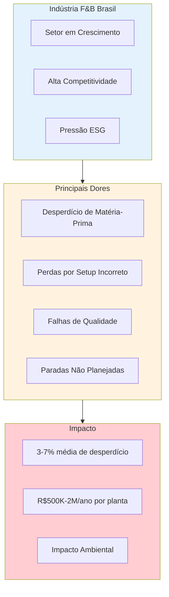
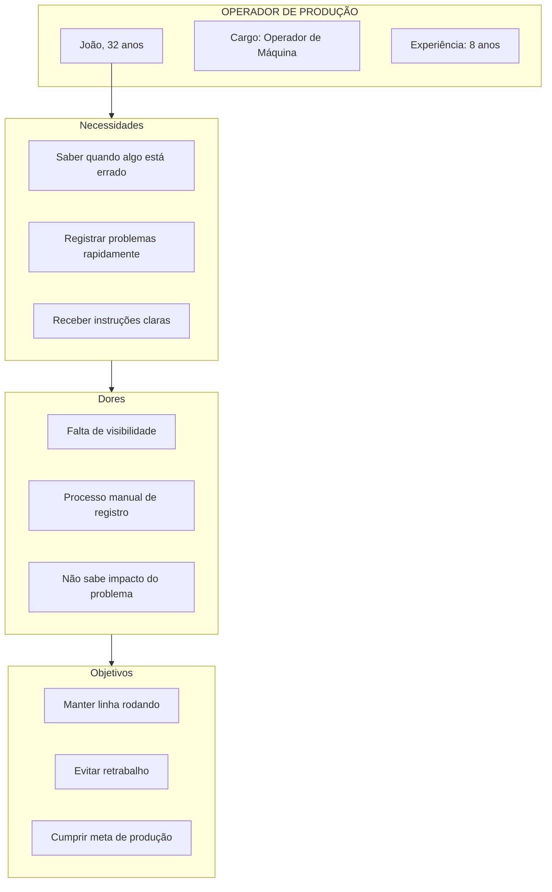
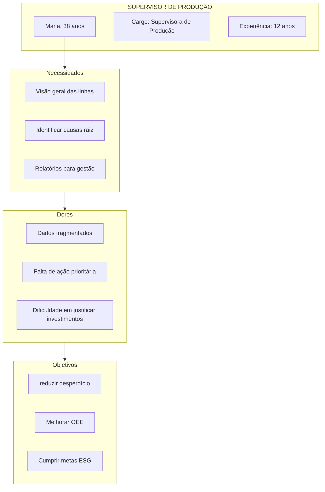
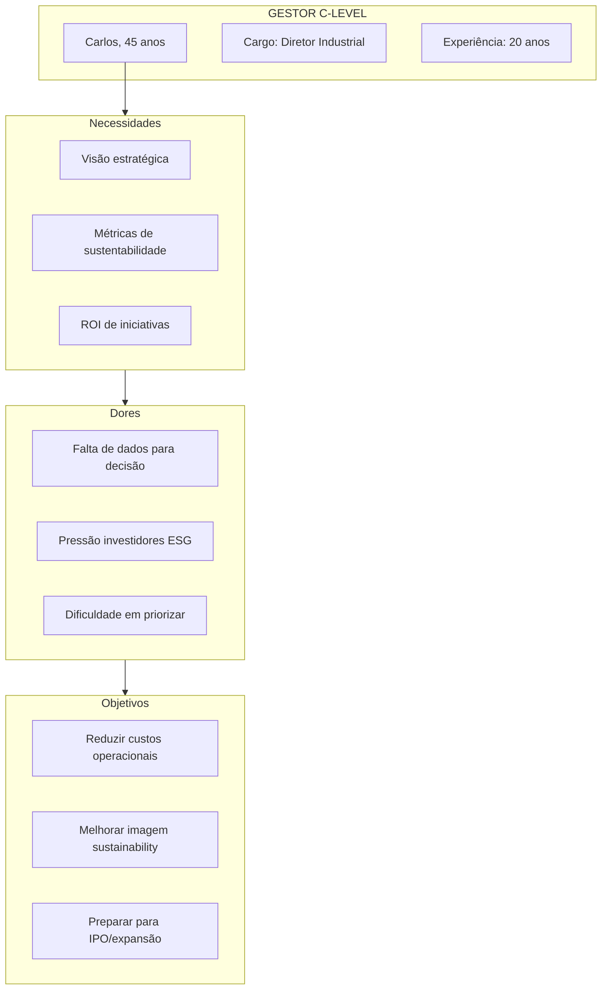
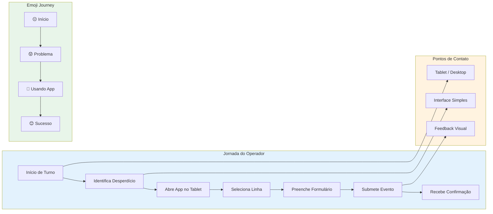
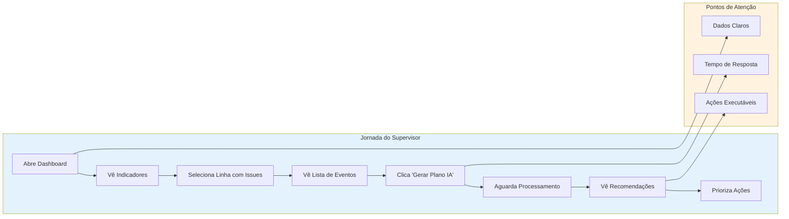
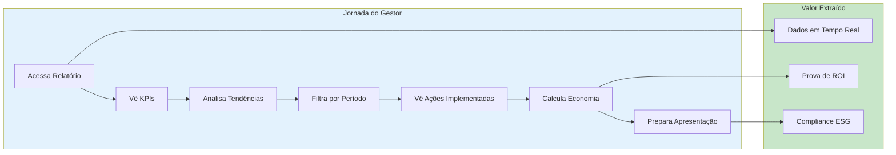
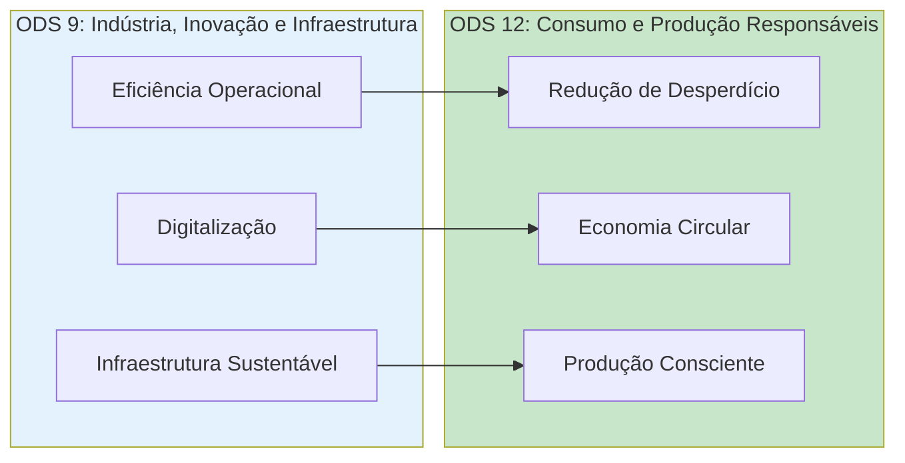
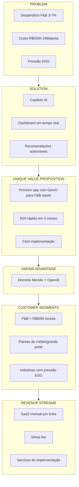

# 📦 DESIGN DE PRODUTO — Waste Guardian

> **Documento de Design de Produto e Pesquisa de Mercado**  
> **Solução:** Copiloto de Redução de Desperdício Industrial  
> **Versão:** 1.0  
> **Data:** 31 de Março de 2026

---

## 1. RESUMO EXECUTIVO

### 1.1 Visão do Produto

**Waste Guardian** é uma aplicação web desenvolvida em Mendix que utiliza inteligência artificial generativa (OpenAI) para analisar dados de desperdício em linhas de produção da indústria de alimentos e bebidas, gerando recomendações priorizadas de ações para redução de perdas operacionais.

### 1.2 Proposta de Valor

| Para | Problema | Solução | Benefício |
|------|----------|---------|-----------|
| **Indústria F&B** | Desperdício de matéria-prima por falhas de setup e qualidade | Copiloto IA que analisa eventos e sugere ações corretivas | Redução de custos operacionais |
| **Supervisores** | Dificuldade em identificar causas raiz de perdas | Dashboard com indicadores + recomendações da IA | Tomada de decisão baseada em dados |
| **Gestores** | Falta de visibilidade sobre impacto financeiro | Métricas de sustentabilidade + projeção de economia | Compliance ESG + redução de custos |

---

## 2. PESQUISA DE MERCADO E ANÁLISE DA INDÚSTRIA

### 2.1 Panorama da Indústria de Alimentos e Bebidas (F&B)



### 2.2 Dados de Pesquisa

| Métrica | Valor | Fonte |
|---------|-------|-------|
| **Desperdício médio F&B Brasil** | 3-7% da matéria-prima | ABIAS/SEBRAE |
| **Custo anual por planta** | R$ 500K - R$ 2M | Estimativa setorial |
| **Plantas alimentícias no Brasil** | ~15.000 | RAIS/MTE |
| **Setor representa % PIB** | ~10% | IBGE |
| **Crescimento demanda sustentável** | +45% últimos 3 anos | Nielsen |

### 2.3 Análise de Dores (Pain Points)

```mermaid
quadrantChart
    title Matriz de Dores: Importância vs Frequência
    x-axis Baixa Frequência --> Alta Frequência
    y-axis Baixa Impacto --> Alto Impacto
    
    dot-1[Setup Incorreto]: (0.85, 0.9)
    dot-2[Falhas Qualidade]: (0.75, 0.85)
    dot-3[Paradas Não Planejadas]: (0.7, 0.7)
    dot-4[Desperdício Energia]: (0.6, 0.5)
    dot-5[Obsolescência Estoque]: (0.4, 0.6)
    dot-6[Retrabalho]: (0.5, 0.75)
```

#### 2.3.1 Dores Prioritárias

| # | Dor | Descrição | Frequência | Impacto |
|---|-----|-----------|------------|----------|
| 1 | **Setup Incorreto** | Parâmetros de máquina mal configurados causando refugo | Alta | Crítico |
| 2 | **Falhas de Qualidade** | Produtos que não passam no QC | Alta | Alto |
| 3 | **Paradas Não Planejadas** | Quebras ou problemas inesperados | Média | Alto |
| 4 | **Desperdício Energético** | Consumo acima do esperado | Alta | Médio |
| 5 | **Retrabalho** | Produtos que precisam de reprocessamento | Média | Médio |

---

## 3. PERSONAS

### 3.1 Persona Primária: Operador de Produção



**Perfil:**
- **Nome:** João Silva
- **Idade:** 32 anos
- **Cargo:** Operador de Produção
- **Experiência:** 8 anos na indústria
- **Formação:** Técnico em mecánica industrial

**Necessidades:**
- Interface simples e intuitiva
- Registro rápido de eventos de desperdício
- Feedback visual imediato

**Dores:**
- Não tem visibilidade do impacto de suas ações
- Processo de registro é manual e demorado
- Não consegue ver tendências de problemas

---

### 3.2 Persona Secundária: Supervisor de Produção



**Perfil:**
- **Nome:** Maria Santos
- **Idade:** 38 anos
- **Cargo:** Supervisora de Produção
- **Experiência:** 12 anos na indústria
- **Formação:** Engenharia de Produção

---

### 3.3 Persona Terciária: Gestor C-Level



**Perfil:**
- **Nome:** Carlos Mendes
- **Idade:** 45 anos
- **Cargo:** Diretor Industrial
- **Experiência:** 20 anos no setor
- **Formação:** Administração de Empresas + MBA em Gestão Industrial

---

## 4. JORNADAS DO USUÁRIO

### 4.1 Jornada: Registro de Evento de Desperdício



### 4.2 Jornada: Análise e Recomendação



### 4.3 Jornada: Revisão Estratégica



---

## 5. ESPECIFICAÇÃO DE FUNCIONALIDADES

### 5.1 Matriz Features vs Personas

| Feature | Operador | Supervisor | Gestor | Prioridade |
|---------|----------|------------|--------|-------------|
| **Registro de Desperdício** | ✅ | - | - | Crítica |
| **Dashboard de KPIs** | - | ✅ | ✅ | Crítica |
| **Lista de Eventos** | - | ✅ | - | Alta |
| **Geração de Plano IA** | - | ✅ | - | Crítica |
| **Recomendações Priorizadas** | - | ✅ | ✅ | Crítica |
| **Histórico de Ações** | - | ✅ | ✅ | Alta |
| **Relatórios Exportáveis** | - | - | ✅ | Média |
| **Alertas por E-mail** | - | ✅ | ✅ | Média |

### 5.2 Feature: Registro de Desperdício

| Atributo | Detalhe |
|----------|---------|
| **Nome** | Registro de Evento de Desperdício |
| **Descrição** | Formulário para operador registrar evento de desperdício |
| **Fluxo** | 1. Selecionar linha 2. Informar quantidade 3. Descrever causa 4. Submit |
| **Campos** | Linha (dropdown), Qtd Produzida, Qtd Descartada, Causa (texto), Turno |
| **Validações** | Campos obrigatórios, números positivos |
| **Feedback** | Mensagem de sucesso, atualização de KPIs |

### 5.3 Feature: Dashboard de KPIs

| Atributo | Detalhe |
|----------|---------|
| **Nome** | Dashboard de Indicadores |
| **Descrição** | Visão geral dos KPIs de sustentabilidade por linha |
| **Componentes** | Cards com linha + desperdício % + custo estimado |
| **Indicadores** | Desperdício %, Custo R$, Energia/Unidade |
| **Visualização** | Semáforo (verde <3%, amarelo 3-5%, vermelho >5%) |
| **Interatividade** | Clique para detalhar |

### 5.4 Feature: Geração de Plano IA

| Atributo | Detalhe |
|----------|---------|
| **Nome** | Copiloto de Redução via GenAI |
| **Descrição** | Análise inteligente que gera ações priorizadas |
| **Input** | Indicadores recentes + eventos do período |
| **Processamento** | OpenAI API com prompt estruturado |
| **Output** | 3-5 ações com prioridade e impacto |
| **Tratamento** | Loading state, erro, fallback |

---

## 6. METRICAS DE SUCESSO

### 6.1 KPIs Técnicos

| Métrica | Meta | Como Medir |
|---------|------|-------------|
| **Tempo de carregamento** | < 3s | Lighthouse/Mendix Profiler |
| **Taxa de sucesso API** | > 95% | Log de erros |
| **Uptime** | > 99% | Mendix Cloud |
| **CRUD operante** | 100% | Testes funcionais |
| **Responsividade** | Mobile/Tablet/Desktop | Teste multiplataforma |

### 6.2 KPIs de Negócio

| Métrica | Meta | Como Medir |
|---------|------|-------------|
| **Redução de desperdício** | > 1% ao mês | Indicador before/after |
| **Tempo de ação corretiva** | < 50% | Tempo entre evento e ação |
| **Adoção por operadores** | > 80% | Uso tracked |
| **Economia estimada** | > R$ 50K/ano | Projeção de custos |

### 6.3 KPIs de Sustentabilidade (ODS)



| ODS | Meta | Indicador |
|-----|------|-----------|
| **ODS 9** | Eficiência industrial | OEE > 85% |
| **ODS 9** | Digitalização | Sistema implementado |
| **ODS 12** | Redução de desperdício | < 3% |
| **ODS 12** | Gestão de recursos | Energia/Unidade reduzida |

---

## 7. MODELO DE NEGÓCIO

### 7.1 Canvas de Negócio



### 7.2 Estrutura de Preços

| Tier | Preço | Features |
|------|-------|----------|
| **Starter** | R$ 500/linha/mês | Dashboard + Registro |
| **Pro** | R$ 800/linha/mês | + GenAI + Relatórios |
| **Enterprise** | Sob consulta | + Integrações + Suporte |

### 7.3 Projeção de ROI

| Cenário | Linha | Economia Anual | ROI |
|---------|-------|---------------|-----|
| **Conservador** | 1 | R$ 60K | 3x |
| **Moderado** | 3 | R$ 200K | 5x |
| **Otimista** | 5 | R$ 400K | 8x |

---

## 8. COMPETIÇÃO E DIFERENCIAÇÃO

### 8.1 Análise Competitiva

| Concorrente | Tipo | Fortalezas | Fraquezas |
|-------------|------|------------|-----------|
| **Sistemas MES** | Enterprise | Dados reais | Complexo, caro |
| **Planilhas** | Manual | Simples | Sem automação |
| **BI Tradicional** | Analytics | Relatórios | Sem ação |
| **Waste Guardian** | **IA + Low-code** | **GenAI integrada** | **Novo no mercado** |

### 8.2 Vantagens Competitivas

1. **GenAI como Diferencial** — Recomendação inteligente vs. dashboards estáticos
2. **Low-code Mendix** — Deploy rápido vs. desenvolvimento tradicional
3. **Foco F&B** — Especialização vs. soluções genéricas
4. **ODS Alignment** — Compliance ESG integrado

---

## 9. ROADMAP DE PRODUTO

### 9.1 Fase 1: MVP (Hackathon)

| Feature | Status |
|---------|--------|
| Registro de desperdício | ✅ |
| Dashboard básico | ✅ |
| Geração de plano IA | ✅ |
| 3 páginas navegáveis | ✅ |
| Persistência CRUD | ✅ |

### 9.2 Fase 2: Pós-Hackathon

| Feature | Prioridade |
|---------|------------|
| Relatórios exportáveis (PDF) | Alta |
| Alertas por e-mail | Alta |
| Integração com MES | Média |
| App mobile nativa | Média |
| Múltiplas plantas | Baixa |

### 9.3 Fase 3: V2.0

| Feature | Prioridade |
|---------|------------|
| Machine Learning preditivo | Alta |
| Integração IoT sensors | Alta |
| API pública | Média |
| Marketplace de ações | Baixa |

---

## 10. REFERÊNCIAS CRUZADAS

| Este Documento | Referências |
|---------------|-------------|
| **PRODUCT-DESIGN.md** | [Business Index](../business/INDEX.md) |
| **Dores F&B** | [02-industrial-intelligence.md](../scaffolding/business/02-industrial-intelligence.md) |
| **Modelo de Negócio** | [01-business-model-canvas.md](../scaffolding/business/01-business-model-canvas.md) |
| **Sponsor Econometrics** | [03-sponsor-econometrics.md](../scaffolding/business/03-sponsor-econometrics.md) |
| **Roadmap** | [ROADMAP.md](./ROADMAP.md) |
| **System Design** | [SYSTEM-DESIGN.md](./SYSTEM-DESIGN.md) |

---

> **VISÃO DO PRODUTO:** *"Waste Guardian: Onde inteligência artificial encontra sustentabilidade industrial."*

---

*Documento gerado em 31 de Março de 2026*  
*Versão: 1.0*
