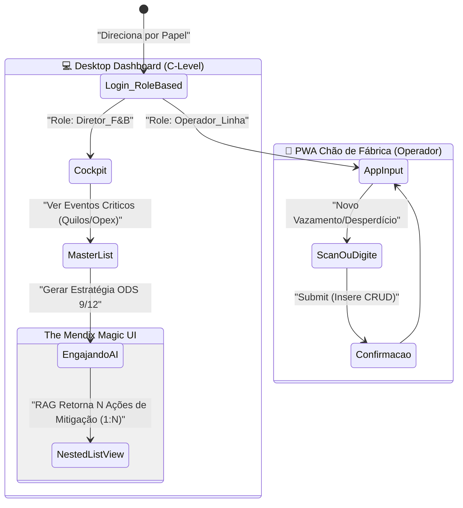

# Atlas UI & Wireframes: B2B Enterprise Experience

*(Baseado em Mendix PWA & Atlas Core)*

Para a equipe codificadora no Web Studio ou Studio Pro, não use tempo com CSS/styling que não os embutidos via App Store / Atlas UI Components. A meta é parecer Profissional Siemens. Tudo PWA responsivo (Navegador/Web-based). A abordagem visual será o **Corporate Dark Mode**, que eleva a percepção de valor de $ para milhões de Euros para C-Levels, além de mascarar imperfeições de padding durante protótipos rápidos.

## 0. UX Flow (A Navegação Principal)

---

## Página 1: O "Cockpit" do Diretor (Desktop Dashboard)

*Template Base: Dashboard Layout / Master-Detail.*
O Tema Color Palette do Projeto: Primary `Night/Slate (#0F172A)` | Accent `Siemens Teal/Cyan (#00FFB9)` para representar sustentabilidade e ROI futuro.

- **Painel Superior (KPIs):**
  - Módulo **"Cards" (Stat Cards)** – Arraste de 3 `Column` containers na `Layout Grid`.
  - Column 1: "Desperdício Geral (Ton)" - Texto dinâmico (`Sum` dos Eventos do Dia). Cor da fonte: Vermelho Mendix Error.
  - Column 2: "Score ODS (Sustentabilidade)" - Badge brilhante (`#00FFB9`) indicando a proximidade da Meta Global S-BTI.
  - Column 3: "Capex Perigoso (OPEX Vazando)" - Contador financeiro em €/R$.

- **Corpo Central (A Lista de Feridas da Fábrica):**
  - Widget: **`Data Grid 2`**. Conecte-o ao banco de `EventoDesperdicio`.
  - Use Conditional Rendering: Linhas com "KilosRefugo > 50kg" recebem *Row Class* ou label "URGENTE" ativando a resposta rápida.
  - Na última coluna do Data Grid, um botão secundário: "Acionar Assistente ODS (OpenAI)".

---

## Página 2: Formulário do Chão de Fábrica (Input do Operador)

*Layout: Mobile-Friendly (Phone Default Profile).*
Deve ser brutalmente simples. Letras grandes e poucos cliques.

- **Widgets de UX Rápida:**
  - Dropdown `Linha Produção`: Reference Selector apontando pra entidade Fabrica_LinhaProducao (ex: Caldeira 3).
  - Input Numérico `Quantidade (Litros/Kilos)`: Letra GIGANTE (H2 styling nativo).
  - Text Area `Desabafo/Causa`: Placeholder - "O que aconteceu? (ex: Sensor de O2 rompeu e vazou a mistura)".
  - Botão Full-Width (Primary Action): "REPORTAR E RETOMAR OPERAÇÃO". Chama o Microflow de Ingestão e dá um feedback Haptic (se via MakeItNative) ou Toast message instantâneo "Registrado com Sucesso".

---

## Página 3: The Nested UI Magic (A Resposta 1:N da Inteligência AI)

*Page Template: Sidebar Navigation ou Modal Gigante Centralizado.*
Quando o Gestor clica em "Acionar Assistente ODS" na Página 1, ele é direcionado para a entidade *Non-Persistent* (**GenAI_Request_Context**). Essa tela define o vencedor da Hackathon, pois ela destrói o conceito de ChatBot linear e traz uma interface corporativa (SAAS).

- **O Header da Tela GenAI:**
  - Container "Title Header" puxando o `{TituloDaSolucao}` (ex: "Protocolo de Fixação da Válvula X2").
  - Widget de Progress Bar Circular (Condicional: Mostra girando se `IsFetching = True`).

- **O Matador: O Template Grid / List View das N Ações (Nested Context):**
  - Aqui está o pulo do gato. Em vez de vomitar o texto cru do RAG, adicione um **List View** apontando para a relação `Context -> PlanoAcaoMestre -> AcaoEstrategica` (Associação 1:N).
  - Cada elemento da lista será um Card retangular branco minimalista (sobre o fundo Dark) contendo:
      - [ ] Checkbox Mendix ou Switch ("Aplicar ao chão de Fábrica?").
      - Texto descritivo cru `InsightConcreto` vindo do JSON Parse da OpenAI.
      - Um botão "Editar Insight" se o Gestor discordar de detalhes finos da IA.
  
> [!TIP]
> **Nested Data View Rule:** A página externa é um Data View recebendo o objeto "GenAI_Request". Dentro dessa "caixa", um List View iterando sobre `[PlanoAcaoMestre_AcaoEstrategica]`. Essa arquitetura grita "Engenharia de Software" pros jurados Mendix, se destacando nos critérios de avaliação frente à turma do arrastar-e-soltar básico.

- **Barra Inferior (Footer de Decisão Executiva):**
  - Um Botão "Commit & Distribute" (Cor Siemens Cyan). Ele executa o salvamento final em log persistente de todas as ações "Aprovadas/Checkadas" nos cards da bateria e notifica o Chão de fábrica (Atualizando dashboard/status).
