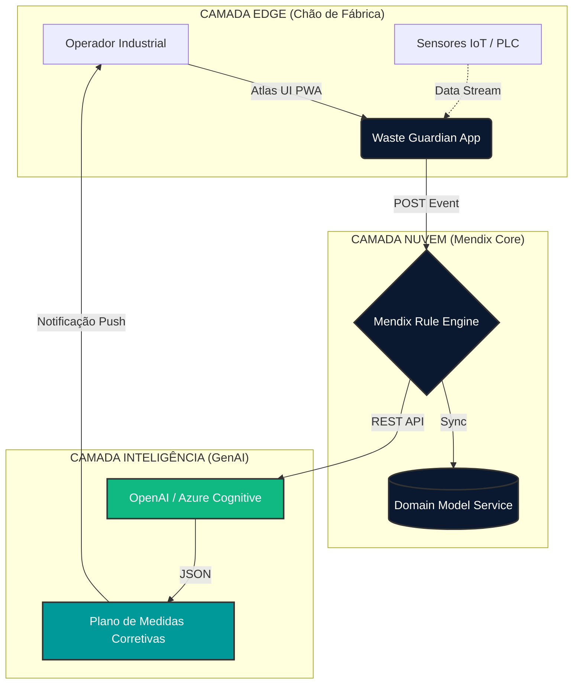

# 🏭 Waste Guardian - Hackathon Command Center
**Central Tática de Operações - Low Hack 2026 (Siemens / Mendix)**

Seja bem-vindo ao *Scaffolding* do Projeto. Este diretório contém todo o trabalho fundacional, pesquisa, regras de negócios, wireframes, arquitetura de dados e scripts do nosso projeto. 
> **Regra de Ouro:** A vitória se faz no planejamento. Antes de arrastar um botão no Mendix, consulte este repositório.

---

## 📂 Navegação Rápida (Índice de Pastas)

### 📌 Arquivos Raízes (Visão Estratégica)
* [**Waste_Guardian_Master_Compendium.md**](Waste_Guardian_Master_Compendium.md): O **Dossiê Mestre** com toda a tese do projeto, arquitetura técnica avançada do Mendix, Matriz de Risco e regras inegociáveis. Se você tiver tempo para ler apenas 1 arquivo, leia este.
* [**LowHack_2026_Full_Strategy.md**](LowHack_2026_Full_Strategy.md): (Mega-Arquivo) A concatenação de *todos* os playbooks abaixo para impressão/consulta rápida. Gerado automaticamente pelo arquivo `mega_builder.js`.
* [**01-playbook-tatica.md**](01-playbook-tatica.md) e [**02-cronograma-de-ataque.md**](02-cronograma-de-ataque.md): Nossas regras, *Swimlanes* de divisão do time e cronometragem minuto-a-minuto das 35 horas do evento.

### 💼 `/business` (Negócios)
* [**01-business-model-canvas.md**](business/01-business-model-canvas.md): Modelo B2B detalhado (Cost Advantage, Monetização via Marketplace Siemens e conexão ODS). Use isso para basear os discursos de escalabilidade.

### 🛠️ `/tech` (Engenharia Mendix & IA)
* [**01-mendix-domain-model.md**](tech/01-mendix-domain-model.md): A planta-baixa do banco de dados (Associações de `LinhaProducao` -> `EventoDesperdicio` -> `PlanoAcaoInteligente`).
* [**02-genai-prompts.md**](tech/02-genai-prompts.md): O "Cérebro" do Copiloto. Prompts de sistema e regras de retorno de objetos rigorosos.
* [**03-mendix-ui-wireframes.md**](tech/03-mendix-ui-wireframes.md): Regras de uso da Atlas UI (PWA focado no chão de fábrica). Nada de perfumaria, apelo pragmático.
* [**04-rest-api-microflow-logic.md**](tech/04-rest-api-microflow-logic.md): Pipeline de dados seguro. Rest Call, Import Mapping e Custom Error Handling no microflow do aplicativo.
* [**05-test-openai-script.js**](tech/05-test-openai-script.js): **[Script Utilitário]** Um testador Node.js para garantir que a OpenAI vai retornar o JSON perfeito *antes* de tentar parsear no Mendix.
* [**mock-dataset-industria-alimentos.csv**](tech/mock-dataset-industria-alimentos.csv): Dados frios simulados para alimentar o DataGrid2 da dashboard do nosso sistema.

### 🎤 `/pitch` (Comunicação e Discurso Nível-C)
* [**roteiro-video-3min.md**](pitch/roteiro-video-3min.md): Scripts literais locutados minuto-a-minuto focados na dor sistêmica ODS 12 para o vídeo oficial.
* [**02-qna-defense-playbook.md**](pitch/02-qna-defense-playbook.md): Respostas prontas ("Jiu-Jitsu Verbal") contra escrutínio dos jurados da banca técnica, blindando o projeto contra as inseguranças normais de um SaaS via IA no mercado.

### 📄 `/docs` (Arquivos Departamentais)
* [**README-final-submission.md**](docs/README-final-submission.md): O Markdown de entrega institucional ("Corporate") sem jargões de equipe para ser servido no formulário de entrega final da banca avaliadora.

---

**🔥 Acabarmos primeiro. Refinarmos depois. O 'Kill Switch' salva projetos. Vamos com tudo!**
