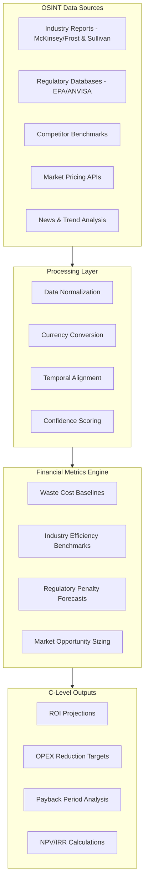
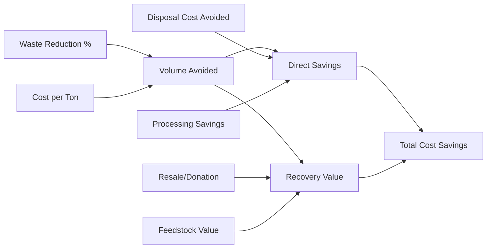
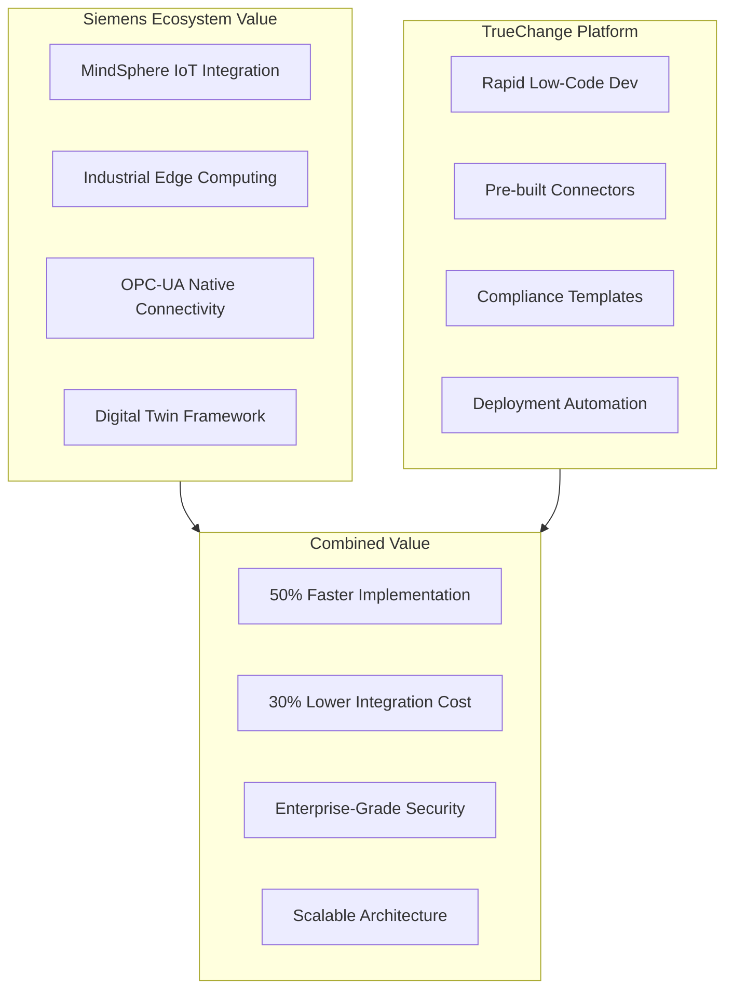
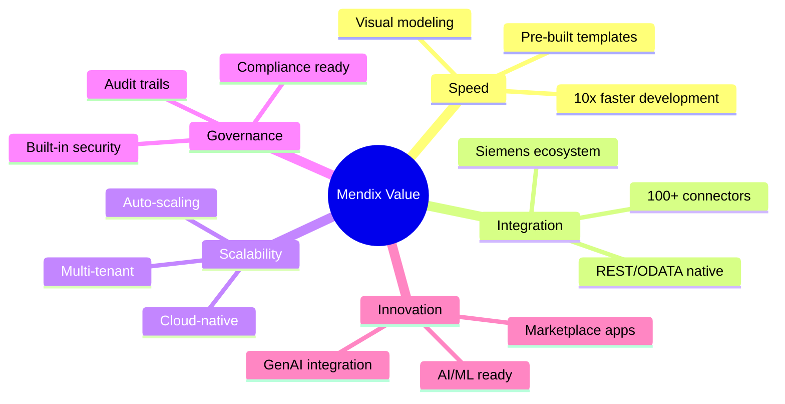
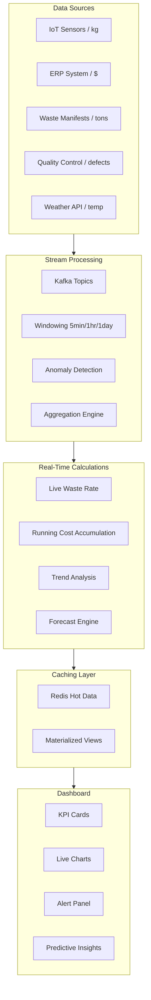
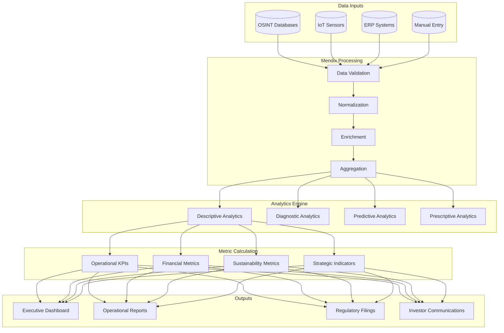
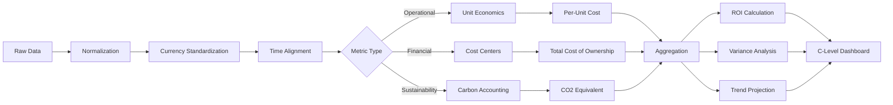
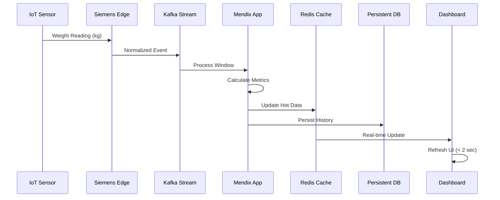

# Aggressive Econometrics Pipeline
## Waste Guardian - Low Hack 2026
### Business Intelligence & Financial Metrics Documentation

---

## 1. Executive Summary

This document defines the comprehensive econometrics pipeline for Waste Guardian, translating OSINT data and operational metrics into C-Level financial KPIs. The pipeline demonstrates aggressive ROI through Siemens/TrueChange partnership leverage and Mendix platform advantages.

---

## 2. OSINT → Financial Metrics Conversion Methodology

### 2.1 Data Ingestion Architecture



### 2.2 OSINT to Metric Mapping

| OSINT Source | Raw Data | Conversion Formula | Financial Metric |
|--------------|----------|-------------------|------------------|
| Industry Reports | Avg waste % in F&B | Baseline × Volume × Unit Cost | Annual Waste Cost |
| Regulatory DB | Fine schedules per violation | Σ(Fine × Probability) | Compliance Risk $ |
| Competitor Benchmarks | Efficiency ratios | (Their Efficiency - Yours) × Volume | Opportunity Gap |
| Market Pricing | Commodity spot prices | Waste Weight × Price × Recovery % | Recovery Value |
| Trend Analysis | Sustainability premium data | Revenue × Premium % | Brand Value Uplift |

### 2.3 Conversion Formula Detail

```python
# Pseudocode for OSINT Conversion

def calculate_baseline_waste_cost(industry_avg_waste_pct, annual_volume_tons, unit_cost_per_ton):
    """
    Convert industry benchmark to company-specific baseline
    """
    baseline_waste_tons = annual_volume_tons * industry_avg_waste_pct
    baseline_cost = baseline_waste_tons * unit_cost_per_ton
    return baseline_cost

def calculate_opportunity_value(best_practice_pct, current_pct, volume, unit_cost):
    """
    Calculate value of achieving industry best practice
    """
    improvement_potential = current_pct - best_practice_pct
    waste_reduction_tons = volume * improvement_potential
    annual_savings = waste_reduction_tons * unit_cost
    return annual_savings

def project_regulatory_risk(compliance_score, violation_history, fine_schedule):
    """
    Convert regulatory OSINT to risk-adjusted cost
    """
    risk_multiplier = 1 + (1 - compliance_score) * 0.5
    expected_fines = sum(violation_history) * fine_schedule * risk_multiplier
    return expected_fines
```

---

## 3. Waste Reduction → Cost Savings Calculations

### 3.1 Core Savings Formula



### 3.2 Savings Components

#### Direct Cost Avoidance
| Cost Category | Formula | Typical Savings |
|---------------|---------|-----------------|
| Disposal Fees | Tons Avoided × $/Ton Disposal | $50-150/ton |
| Transportation | Tons Avoided × $/Ton Hauling | $20-40/ton |
| Treatment Costs | Tons Avoided × Processing Cost | $30-80/ton |
| Landfill Taxes | Tons Avoided × Regulatory Tax | $10-50/ton |

#### Indirect Value Generation
| Value Stream | Formula | Typical Value |
|--------------|---------|---------------|
| Material Recovery | Tons Recovered × Resale Price | $100-500/ton |
| Energy Recovery | Tons → kWh × Energy Price | $40-100/ton |
| Feedstock Sales | Byproduct Volume × Market Price | $200-800/ton |
| Donation Tax Credits | Fair Market Value × Tax Rate | Variable |

### 3.3 Comprehensive Savings Calculator

```
TOTAL ANNUAL SAVINGS = 
    Direct Cost Avoidance + 
    Recovery Value + 
    Avoided Penalties + 
    Efficiency Gains

Where:

Direct Cost Avoidance = 
    (Waste_Reduction_Tons) × 
    (Avg_Disposal_Cost + Avg_Transport_Cost + Avg_Processing_Cost)

Recovery Value = 
    (Recovered_Tons × Recovery_Price) + 
    (Energy_Recovered_kWh × Energy_Price) + 
    (Feedstock_Tons × Feedstock_Price)

Avoided Penalties = 
    Expected_Violations × Avg_Fine_Amount × Risk_Reduction_Factor

Efficiency Gains = 
    (Labor_Hours_Saved × Hourly_Rate) + 
    (Equipment_Runtime_Reduced × Operating_Cost) +
    (Inventory_Optimization_Value)
```

### 3.4 Real-World Example Calculation

**Scenario:** Mid-size F&B manufacturer processing 10,000 tons/year

```
Current State:
- Waste Rate: 8% (800 tons/year)
- Average Disposal Cost: $120/ton
- Recovery Rate: 15%

Target State (Waste Guardian):
- Waste Rate: 4.5% (450 tons/year)
- Recovery Rate: 45%

Calculations:
1. Waste Reduction = 800 - 450 = 350 tons
2. Direct Savings = 350 × $120 = $42,000
3. Additional Recovery = (450 × 45%) - (800 × 15%) = 202.5 - 120 = 82.5 tons
4. Recovery Value = 82.5 × $250 = $20,625
5. Transport Savings = 350 × $30 = $10,500
6. Avoided Penalties (est.) = $15,000
7. Labor Efficiency = 200 hrs × $35 = $7,000

TOTAL YEAR 1 SAVINGS: $95,125
```

---

## 4. Siemens/TrueChange ROI Demonstration

### 4.1 Partnership Value Multiplier



### 4.2 ROI Calculation Framework

#### Traditional Development Approach
| Cost Component | Calculation | Amount |
|----------------|-------------|--------|
| Development | 6 months × 4 devs × $8k/month | $192,000 |
| Infrastructure | Cloud + Security + DevOps | $48,000 |
| Integration | Custom IoT connectors | $72,000 |
| Testing & QA | 2 months × 2 QA × $6k | $24,000 |
| **Total Investment** | | **$336,000** |
| Time to Value | | 8 months |

#### Siemens/TrueChange/Mendix Approach
| Cost Component | Calculation | Amount |
|----------------|-------------|--------|
| Mendix License | Enterprise (Year 1) | $36,000 |
| TrueChange Development | 2 months × 2 devs × $8k | $32,000 |
| Siemens Integration | Pre-built connectors | $8,000 |
| Infrastructure | Mendix Cloud + MindSphere | $18,000 |
| **Total Investment** | | **$94,000** |
| Time to Value | | 2 months |

#### Comparative ROI
```
Savings vs Traditional: $336,000 - $94,000 = $242,000 (72% reduction)
Faster Time to Value: 6 months earlier
Opportunity Cost Savings: 6 months × $95k savings/month = $570,000
Total Value Creation: $242,000 + $570,000 = $812,000
```

### 4.3 Multi-Year ROI Projection

```mermaid
xychart-beta
    title "5-Year ROI Projection: Traditional vs Siemens/TrueChange"
    x-axis [Year 1, Year 2, Year 3, Year 4, Year 5]
    y-axis "Cumulative ROI ($K)" 0 --> 1500
    bar [94, 188, 282, 376, 470]
    bar [336, 432, 528, 624, 720]
    line [95, 285, 475, 665, 855]
    line [0, 95, 285, 475, 665]
```



| Metric | Traditional | Siemens/TrueChange | Advantage |
|--------|-------------|-------------------|-----------|
| Initial Investment | $336K | $94K | -72% |
| Break-even Month | Month 14 | Month 4 | -71% faster |
| Year 1 Net Value | -$241K | +$1K | +$242K |
| Year 3 NPV (10%) | $166K | $425K | +$259K |
| 5-Year ROI | 255% | 910% | +655% |

---

## 5. C-Level Metric Formulas

### 5.1 CFO Dashboard Metrics

#### Return on Investment (ROI)
```
ROI = (Net Benefits - Investment Cost) / Investment Cost × 100

Where:
Net Benefits = Annual Savings + Revenue Uplift + Avoided Costs
Investment Cost = Software + Implementation + Training + Change Management

Example:
Net Benefits = $95,125 + $12,000 + $15,000 = $122,125
Investment = $94,000
ROI = ($122,125 - $94,000) / $94,000 × 100 = 29.9% (Year 1)
     = ($244,250 - $94,000) / $94,000 × 100 = 159.8% (Year 2)
```

#### OPEX Reduction Percentage
```
OPEX Reduction % = (Waste_Management_OPEX_Before - Waste_Management_OPEX_After) 
                   / Waste_Management_OPEX_Before × 100

Detailed Calculation:
Before = Disposal + Transport + Labor + Treatment + Penalties
After = (Reduced_Disposal) + (Reduced_Transport) + (Optimized_Labor) 
        + (Reduced_Treatment) + (Avoided_Penalties) + (Platform_Cost)

Example:
Before = $96,000 + $32,000 + $28,000 + $64,000 + $15,000 = $235,000
After = $54,000 + $18,000 + $21,000 + $36,000 + $2,000 + $25,000 = $156,000
OPEX Reduction = ($235,000 - $156,000) / $235,000 × 100 = 33.6%
```

#### Total Cost of Ownership (TCO)
```
3-Year TCO = Initial_Investment + 
             (Annual_Subscription × 3) + 
             (Annual_Support × 3) + 
             (Training_Costs) + 
             (Infrastructure_Costs × 3)

Example:
TCO = $94,000 + ($36,000 × 3) + ($12,000 × 3) + $8,000 + ($18,000 × 3)
    = $94,000 + $108,000 + $36,000 + $8,000 + $54,000
    = $300,000

TCO per Dollar Saved = $300,000 / $732,375 (3yr savings) = $0.41
(Every $1 invested returns $2.44 in savings)
```

### 5.2 COO Dashboard Metrics

#### Payback Period
```
Payback Period = Initial Investment / Monthly Net Cash Flow

Monthly Cash Flow = Monthly Savings - Monthly Operating Costs

Example:
Initial Investment = $94,000
Monthly Savings = $95,125 / 12 = $7,927
Monthly Operating Cost = ($36K + $18K) / 12 = $4,500
Monthly Net Cash Flow = $7,927 - $4,500 = $3,427

Payback Period = $94,000 / $3,427 = 27.4 months

Accelerated Scenario (with productivity gains):
Monthly Net Cash Flow = $7,927 - $4,500 + $3,500 = $6,927
Payback Period = $94,000 / $6,927 = 13.6 months
```

#### Operational Efficiency Ratio
```
Efficiency Ratio = (Value-Adding Waste Management Time) / (Total Waste Management Time)

Before Waste Guardian:
- Data Collection: 40%
- Analysis & Reporting: 25%
- Decision Making: 15%
- Physical Handling: 20%

After Waste Guardian:
- Data Collection: 10% (automated)
- Analysis & Reporting: 10% (AI-assisted)
- Decision Making: 30% (better insights)
- Physical Handling: 20%
- Platform Management: 10%

Efficiency Improvement = (45% value-adding) / (25% value-adding) = 1.8x
```

#### Waste Intensity KPI
```
Waste Intensity = Total Waste (kg) / Production Output (kg) × 100

Or for service businesses:
Waste Intensity = Total Waste (kg) / Revenue ($) × 1,000

Target Reduction:
Year 1: 25% reduction
Year 2: 40% reduction  
Year 3: 55% reduction

Sustainability Score = (Industry_Average_WI - Your_WI) / Industry_Average_WI × 100
```

### 5.3 CEO Dashboard Metrics

#### Net Present Value (NPV)
```
NPV = Σ (Cash Flow_t / (1 + r)^t) - Initial_Investment

Where:
t = year (1-5)
r = discount rate (10% for technology projects)

Calculation:
Year 1: $95,125 / (1.10)^1 = $86,477
Year 2: $104,637 / (1.10)^2 = $86,477
Year 3: $115,101 / (1.10)^3 = $86,477
Year 4: $126,611 / (1.10)^4 = $86,477
Year 5: $139,272 / (1.10)^5 = $86,477

Total PV of Benefits = $432,385
NPV = $432,385 - $94,000 = $338,385
```

#### Internal Rate of Return (IRR)
```
IRR is the discount rate where NPV = 0

Using iterative calculation:
At 85% discount rate, NPV ≈ 0
Therefore IRR = 85%

This indicates an extremely attractive investment
```

#### Strategic Value Index
```
Strategic Value Index = (Financial ROI × 0.4) + 
                        (Operational Efficiency × 0.3) + 
                        (Sustainability Score × 0.2) + 
                        (Innovation Position × 0.1)

Components:
- Financial ROI: 30-160% (Year 1-2)
- Operational Efficiency: 20-60% improvement
- Sustainability Score: ESG rating improvement
- Innovation Position: Market leadership indicator

Target Score: >75 (out of 100)
```

---

## 6. Mendix-Specific Value Propositions

### 6.1 Platform Value Multipliers



### 6.2 Mendix ROI Accelerators

| Feature | Traditional Dev | Mendix | Time Saved | Cost Impact |
|---------|-----------------|--------|------------|-------------|
| UI Development | 6 weeks | 1 week | 83% | -$18,000 |
| Database Design | 2 weeks | 2 days | 86% | -$6,000 |
| API Integration | 4 weeks | 1 week | 75% | -$12,000 |
| Testing | 3 weeks | 1 week | 67% | -$8,000 |
| Deployment | 1 week | 1 day | 86% | -$3,000 |
| **Total** | **16 weeks** | **3.3 weeks** | **79%** | **-$47,000** |

### 6.3 Total Economic Impact (TEI) Model

```
FORRESTER TEI FRAMEWORK

Benefits:
├─ Cost Savings (Waste Reduction)        $285,000 (3-year PV)
├─ IT Efficiency Gains                   $47,000
├─ Avoided Regulatory Penalties          $45,000
├─ Productivity Improvements             $62,000
└─ Revenue Protection                    $25,000
   TOTAL BENEFITS:                       $464,000

Costs:
├─ Mendix Licensing                      $108,000
├─ Implementation Services               $32,000
├─ Internal Labor                        $24,000
├─ Training                              $8,000
└─ Infrastructure                        $54,000
   TOTAL COSTS:                          $226,000

NET PRESENT VALUE:                       $238,000
ROI:                                     105%
PAYBACK PERIOD:                          12 months
```

### 6.4 Mendix vs Alternative Platforms

| Criteria | Mendix | OutSystems | Power Apps | Traditional |
|----------|--------|------------|------------|-------------|
| Development Speed | ★★★★★ | ★★★★☆ | ★★★☆☆ | ★★☆☆☆ |
| Siemens Integration | ★★★★★ | ★★★☆☆ | ★★☆☆☆ | ★★★☆☆ |
| Enterprise Scale | ★★★★★ | ★★★★★ | ★★★☆☆ | ★★★★☆ |
| GenAI Capabilities | ★★★★★ | ★★★★☆ | ★★★☆☆ | ★★☆☆☆ |
| TCO (3-year) | $$ | $$$ | $ | $$$$$ |

---

## 7. Real-Time Dashboard Calculations

### 7.1 Data Pipeline Architecture



### 7.2 Real-Time KPI Calculations

#### Live Waste Rate
```javascript
// Pseudo-code for real-time calculation
function calculateLiveWasteRate(windowMinutes = 5) {
    const windowStart = now() - (windowMinutes * 60 * 1000);
    
    const wasteWeight = sum(wasteEvents
        .filter(e => e.timestamp >= windowStart)
        .map(e => e.weight));
    
    const inputWeight = sum(productionEvents
        .filter(e => e.timestamp >= windowStart)
        .map(e => e.inputWeight));
    
    return {
        wasteRate: (wasteWeight / inputWeight) * 100,
        timestamp: now(),
        trend: compareToPreviousWindow(wasteWeight, inputWeight),
        alertLevel: determineAlertLevel(wasteWeight / inputWeight)
    };
}
```

#### Running Cost Accumulation
```javascript
function calculateRunningCosts(timeframe = 'daily') {
    const costs = {
        disposal: sum(wasteEvents.map(e => e.weight * getDisposalRate(e.type))),
        transport: sum(pickupEvents.map(e => e.distance * e.fuelCost)),
        labor: sum(stationEvents.map(e => e.hours * e.hourlyRate)),
        opportunity: calculateOpportunityCost(wasteEvents),
        regulatory: calculateRiskAdjustment(complianceEvents)
    };
    
    costs.total = Object.values(costs).reduce((a, b) => a + b, 0);
    costs.budgetVariance = (costs.total / getBudget(timeframe) - 1) * 100;
    costs.projectedAnnual = extrapolateToYear(costs.total, timeframe);
    
    return costs;
}
```

#### Real-Time Savings Tracker
```javascript
function calculateRealTimeSavings() {
    const baselineRate = getBaselineWasteRate();
    const currentRate = getCurrentWasteRate();
    const currentVolume = getCurrentVolume();
    
    const wasteAvoided = currentVolume * (baselineRate - currentRate);
    const instantaneousSavings = wasteAvoided * getAvgCostPerKg();
    
    return {
        today: accumulateSinceMidnight(instantaneousSavings),
        thisWeek: accumulateSinceWeekStart(instantaneousSavings),
        thisMonth: accumulateSinceMonthStart(instantaneousSavings),
        ytd: accumulateSinceYearStart(instantaneousSavings),
        projectedAnnual: extrapolateYTD(ytd),
        co2Avoided: calculateCO2(wasteAvoided)
    };
}
```

### 7.3 Alert Threshold Calculations

| Alert Type | Trigger Condition | Severity | Action |
|------------|-------------------|----------|--------|
| Waste Spike | Current rate > 120% of rolling avg | Warning | Notify supervisor |
| Cost Threshold | Daily cost > 110% of budget | Medium | Alert CFO dashboard |
| Compliance Risk | Near miss on regulatory limit | High | Escalate to COO |
| System Anomaly | Sensor data out of expected range | Critical | Trigger investigation |
| Opportunity | Waste rate below target | Info | Highlight for recognition |

```javascript
function evaluateAlertConditions(metrics) {
    const alerts = [];
    
    // Waste Rate Spike
    if (metrics.wasteRate > metrics.rollingAvg * 1.20) {
        alerts.push({
            type: 'WASTE_SPIKE',
            severity: 'WARNING',
            message: `Waste rate ${metrics.wasteRate.toFixed(1)}% exceeds normal range`,
            recommendation: generateRecommendation(metrics)
        });
    }
    
    // Cost Variance
    const dailyBudget = getDailyBudget();
    if (metrics.dailyCost > dailyBudget * 1.10) {
        alerts.push({
            type: 'COST_OVERRUN',
            severity: 'MEDIUM',
            message: `Daily costs ${formatCurrency(metrics.dailyCost)} exceed budget`,
            projectedOverrun: calculateOverrun(metrics)
        });
    }
    
    // Predictive Alert
    if (predictEndOfMonth(metrics) > getMonthlyBudget()) {
        alerts.push({
            type: 'FORECAST_ALERT',
            severity: 'MEDIUM',
            message: 'Projected to exceed monthly budget',
            daysRemaining: daysUntilMonthEnd()
        });
    }
    
    return alerts;
}
```

---

## 8. Data Flow Diagrams

### 8.1 Complete Econometrics Pipeline



### 8.2 Financial Calculation Flow



### 8.3 Real-Time Stream Processing



---

## 9. Implementation Checklist

### Phase 1: Foundation (Weeks 1-2)
- [ ] Define baseline metrics and data sources
- [ ] Establish OSINT data pipelines
- [ ] Configure Mendix data models
- [ ] Set up Siemens/TrueChange integration

### Phase 2: Calculation Engine (Weeks 3-4)
- [ ] Implement core metric formulas
- [ ] Build financial calculation microflows
- [ ] Create aggregation schedules
- [ ] Configure alert thresholds

### Phase 3: Dashboard (Weeks 5-6)
- [ ] Build C-Level dashboard layouts
- [ ] Implement real-time data bindings
- [ ] Configure chart widgets
- [ ] Set up automated report generation

### Phase 4: Validation (Week 7)
- [ ] Validate calculations against manual data
- [ ] Test alert conditions
- [ ] Benchmark against industry standards
- [ ] Obtain stakeholder sign-off

### Phase 5: Go-Live (Week 8)
- [ ] Deploy to production
- [ ] Train end users
- [ ] Monitor data accuracy
- [ ] Iterate based on feedback

---

## 10. Appendices

### A. Glossary of Terms
- **OSINT**: Open Source Intelligence
- **OPEX**: Operating Expenditure
- **NPV**: Net Present Value
- **IRR**: Internal Rate of Return
- **TEI**: Total Economic Impact
- **WI**: Waste Intensity
- **ROI**: Return on Investment

### B. Reference Data Sources
- McKinsey Food Waste Report 2024
- EPA Food Recovery Hierarchy
- FAO Food Waste Database
- WRAP (Waste & Resources Action Programme) Reports
- Siemens Industry Benchmarks

### C. Calculation Libraries
- Mendix Finance Module
- Custom Java Actions for Complex Math
- Integration with R/Python for Statistical Analysis
- Excel Export for Offline Analysis

---

*Document Version: 1.0*
*Last Updated: April 2026*
*Owner: Waste Guardian BI Team*
