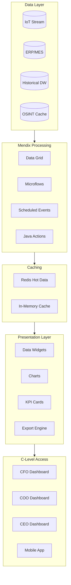
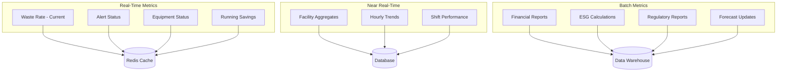

# C-Level Dashboard Specifications
## Waste Guardian Executive Reporting
### Low Hack 2026 - Mendix Implementation Guide

---

## 1. Executive Overview

This document defines the technical specifications for C-Level dashboards in Waste Guardian, designed for real-time executive decision-making. The dashboards leverage Mendix native capabilities with custom extensions for advanced financial and operational analytics.

**Target Audience:** CFO, COO, CEO, Board Members  
**Platform:** Mendix 10.x with DataWidgets 2.x  
**Update Frequency:** Real-time (sub-5 second latency)  
**Access:** Web + Mobile Responsive

---

## 2. Dashboard Architecture

### 2.1 System Architecture



### 2.2 Data Flow Specifications

| Layer | Technology | Latency | Capacity |
|-------|------------|---------|----------|
| Data Ingestion | Kafka/MQTT | <1 sec | 10K events/sec |
| Stream Processing | Mendix Microflows | <2 sec | 1K calc/sec |
| Aggregation | Scheduled Events | 1-5 min | Unlimited |
| Dashboard Refresh | WebSocket/Polling | <5 sec | 100 concurrent |
| Export/Report | Async Generation | <30 sec | PDF/Excel |

---

## 3. CFO Dashboard Specifications

### 3.1 Dashboard Layout

```
┌──────────────────────────────────────────────────────────────────────────────────────┐
│  🏢 WASTE GUARDIAN                          CFO Dashboard    [Date] [User] [⚙️]     │
├──────────────────────────────────────────────────────────────────────────────────────┤
│                                                                                      │
│  ┌─────────────────┐  ┌─────────────────┐  ┌─────────────────┐  ┌─────────────────┐ │
│  │  💰 ROI         │  │  📉 OPEX        │  │  📊 Payback     │  │  💵 NPV         │ │
│  │                 │  │                 │  │                 │  │                 │ │
│  │   156.8%        │  │   -33.6%        │  │   8.4 months    │  │   $338.4K       │ │
│  │   ▲ 12.3%       │  │   ▼ 2.1%        │  │   ▼ 1.2 mo      │  │   ▲ $45.2K      │ │
│  │   vs target     │  │   vs last Q     │  │   vs plan       │  │   vs forecast   │ │
│  └─────────────────┘  └─────────────────┘  └─────────────────┘  └─────────────────┘ │
│                                                                                      │
│  ┌───────────────────────────────────────────────────────────────────────────────┐  │
│  │  💵 SAVINGS ACCUMULATION                                         [YTD ▼]     │  │
│  │                                                                               │  │
│  │   $500K ┤                                              ╭───────╮              │  │
│  │   $400K ┤                                   ╭─────────╯       ╰─────         │  │
│  │   $300K ┤                         ╭────────╯                                  │  │
│  │   $200K ┤              ╭──────────╯                                           │  │
│  │   $100K ┤   ╭─────────╯                                                       │  │
│  │       $ ┼───┴─────┬─────────┬─────────┬─────────┬─────────┬─────────          │  │
│  │           Jan     Feb     Mar     Apr     May     Jun     Jul                 │  │
│  │                                                                               │  │
│  │   ─── Actual    ─ ─ Target    ─·─ Forecast                                   │  │
│  └───────────────────────────────────────────────────────────────────────────────┘  │
│                                                                                      │
│  ┌──────────────────────────────────────┐  ┌──────────────────────────────────────┐  │
│  │  📋 COST BREAKDOWN                   │  │  📈 BUDGET VARIANCE                  │  │
│  │                                      │  │                                      │  │
│  │  Waste Disposal    ████████  42% $40K│  │  Budget Used:    67%                 │  │
│  │  Transport         ████      23% $22K│  │  Remaining:      33%                 │  │
│  │  Labor             ███       18% $17K│  │                                      │  │
│  │  Treatment         ██        12% $11K│  │  🟢 On Track                         │  │
│  │  Platform Cost     █          5%  $5K│  │                                      │  │
│  │                                      │  │  Categories at risk: 1               │  │
│  │  [View Details →]                    │  │  [Drill Down →]                      │  │
│  └──────────────────────────────────────┘  └──────────────────────────────────────┘  │
│                                                                                      │
│  ┌───────────────────────────────────────────────────────────────────────────────┐  │
│  │  🏆 FINANCIAL FORECAST                              [Adjust Assumptions ⚙️]  │  │
│  │                                                                               │  │
│  │   Year    Investment    Savings      Net        Cumulative      ROI          │  │
│  │   ─────────────────────────────────────────────────────────────────────────   │  │
│  │   Y1      $94,000       $95,125      $1,125     $1,125          1.2%         │  │
│  │   Y2      $36,000       $104,637     $68,637    $69,762         190.7%       │  │
│  │   Y3      $36,000       $115,101     $79,101    $148,863        319.7%       │  │
│  │   Y4      $36,000       $126,611     $90,611    $239,474        451.7%       │  │
│  │   Y5      $36,000       $139,272     $103,272   $342,746        586.9%       │  │
│  │                                                                               │  │
│  │   [Export to Excel]    [Generate Board Report]    [Schedule Distribution]    │  │
│  └───────────────────────────────────────────────────────────────────────────────┘  │
│                                                                                      │
└──────────────────────────────────────────────────────────────────────────────────────┘
```

### 3.2 CFO KPI Definitions

#### Primary KPIs

| KPI | Formula | Data Source | Refresh | Widget Type |
|-----|---------|-------------|---------|-------------|
| **ROI** | (Total Benefits - Investment) / Investment × 100 | Calculated | Real-time | KPI Card with Trend |
| **OPEX Reduction** | (OPEX_before - OPEX_after) / OPEX_before × 100 | ERP + Calculated | Hourly | KPI Card with Trend |
| **Payback Period** | Initial Investment / Monthly Net Cash Flow | Calculated | Daily | KPI Card with Progress |
| **NPV** | Σ(Cash Flow_t / (1+r)^t) - Initial Investment | Calculated | Daily | KPI Card |
| **TCO** | Initial + (Annual × Years) + Support | Calculated | Monthly | KPI Card |

#### Secondary KPIs

| KPI | Formula | Target | Alert Threshold |
|-----|---------|--------|-----------------|
| Monthly Savings | Σ(Cost Avoidance) | >$7,900 | <$6,000 🔴 |
| Budget Variance | (Actual - Budget) / Budget | <±10% | >±15% 🔴 |
| Cost per Ton | Total Cost / Waste Tons | Decreasing | >10% increase 🟡 |
| Savings Run Rate | MTD Savings × 12 | >Target | <90% of target 🟡 |

### 3.3 Mendix Implementation - CFO Dashboard

#### Domain Model

```
CFO_Dashboard
├── CFODashboardPage (Page)
│   ├── CFOPeriodSelector (Enum: YTD, QTD, MTD, Custom)
│   ├── CFOPeriodStart (DateTime)
│   └── CFOPeriodEnd (DateTime)
│
├── FinancialKPI (Entity)
│   ├── KPI_ID (String)
│   ├── KPI_Name (String)
│   ├── Current_Value (Decimal)
│   ├── Previous_Value (Decimal)
│   ├── Target_Value (Decimal)
│   ├── Variance_Percent (Decimal)
│   ├── Last_Updated (DateTime)
│   └── Trend_Direction (Enum: UP, DOWN, STABLE)
│
├── SavingsAccumulation (Entity)
│   ├── Period (DateTime)
│   ├── Actual_Savings (Decimal)
│   ├── Target_Savings (Decimal)
│   ├── Forecast_Savings (Decimal)
│   └── Cumulative_Savings (Decimal)
│
├── CostBreakdown (Entity)
│   ├── Category (Enum)
│   ├── Amount (Decimal)
│   ├── Percentage (Decimal)
│   └── Period (DateTime)
│
└── FinancialForecast (Entity)
    ├── Year (Integer)
    ├── Investment (Decimal)
    ├── Savings (Decimal)
    ├── Net_Value (Decimal)
    ├── Cumulative_Value (Decimal)
    └── ROI_Percent (Decimal)
```

#### Microflow: CalculateCFOKPIs

```
[Start] 
   │
   ├──> [Retrieve CFO_Dashboard context]
   │
   ├──> [Calculate ROI]
   │    ├── Retrieve Investment (from Project)
   │    ├── Calculate Total Benefits
   │    │    ├── Sum Savings (from WasteEvents)
   │    │    ├── Sum Avoided Penalties
   │    │    └── Sum Efficiency Gains
   │    └── ROI = (Benefits - Investment) / Investment
   │
   ├──> [Calculate OPEX Reduction]
   │    ├── Get Baseline OPEX (from BaselineMetrics)
   │    ├── Get Current OPEX
   │    └── OPEX_Reduction = (Baseline - Current) / Baseline
   │
   ├──> [Calculate Payback Period]
   │    ├── Monthly_Cash_Flow = Monthly_Savings - Monthly_Costs
   │    └── Payback_Months = Initial_Investment / Monthly_Cash_Flow
   │
   ├──> [Calculate NPV]
   │    ├── Discount_Rate = 0.10
   │    ├── For each year (1-5):
   │    │    PV = Cash_Flow / (1 + Discount_Rate)^Year
   │    └── NPV = Sum(PV) - Initial_Investment
   │
   └──> [Commit KPI entities]
        └── [Refresh Dashboard]
```

#### Chart Widget Configuration

```json
{
  "chartType": "line",
  "dataSource": {
    "type": "microflow",
    "microflow": "DS_SavingsAccumulation"
  },
  "series": [
    {
      "name": "Actual",
      "dataAttribute": "Actual_Savings",
      "color": "#059669",
      "lineStyle": "solid"
    },
    {
      "name": "Target",
      "dataAttribute": "Target_Savings", 
      "color": "#6B7280",
      "lineStyle": "dashed"
    },
    {
      "name": "Forecast",
      "dataAttribute": "Forecast_Savings",
      "color": "#3B82F6",
      "lineStyle": "dotted"
    }
  ],
  "xAxis": {
    "attribute": "Period",
    "format": "MMM YYYY"
  },
  "yAxis": {
    "prefix": "$",
    "format": ",.0f"
  },
  "refreshInterval": 300
}
```

---

## 4. COO Dashboard Specifications

### 4.1 Dashboard Layout

```
┌──────────────────────────────────────────────────────────────────────────────────────┐
│  🏭 WASTE GUARDIAN                          COO Dashboard    [Date] [User] [⚙️]     │
├──────────────────────────────────────────────────────────────────────────────────────┤
│                                                                                      │
│  ┌─────────────────┐  ┌─────────────────┐  ┌─────────────────┐  ┌─────────────────┐ │
│  │  ⚡ Efficiency  │  │  🎯 Waste Rate  │  │  ⏱️ Response    │  │  📊 Throughput  │ │
│  │                 │  │                 │  │                 │  │                 │ │
│  │   1.8x          │  │   4.2%          │  │   4.3 min       │  │   98.7%         │ │
│  │   ▲ 0.3x        │  │   ▼ 1.8%        │  │   ▼ 2.1 min     │  │   ▲ 3.2%        │ │
│  │   improvement   │  │   vs baseline   │  │   avg response  │  │   capacity use  │ │
│  └─────────────────┘  └─────────────────┘  └─────────────────┘  └─────────────────┘ │
│                                                                                      │
│  ┌───────────────────────────────────────────────────────────────────────────────┐  │
│  │  📍 REAL-TIME FACILITY OVERVIEW                              [Live ●]        │  │
│  │                                                                               │  │
│  │   Facility      Status    Waste Rate    Efficiency    Alerts    Action       │  │
│  │   ─────────────────────────────────────────────────────────────────────────   │  │
│  │   Plant A       🟢 Good   3.8%          95%           0          Monitor     │  │
│  │   Plant B       🟢 Good   4.1%          92%           1          Review      │  │
│  │   Plant C       🟡 Warn   5.2%          87%           2          Investigate │  │
│  │   Plant D       🔴 Alert  7.1%          78%           4          Escalate    │  │
│  │                                                                               │  │
│  │   [View Map]    [Drill Down]    [Export Report]    [Broadcast Alert]        │  │
│  └───────────────────────────────────────────────────────────────────────────────┘  │
│                                                                                      │
│  ┌──────────────────────────────────────┐  ┌──────────────────────────────────────┐  │
│  │  🔥 ALERT STATUS                     │  │  📈 TRENDING WASTE CATEGORIES        │  │
│  │                                      │  │                                      │  │
│  │  Critical     ████ 4       🔴        │  │  Production Waste    ████████  45%  │  │
│  │  Warning      ███  3       🟡        │  │  Packaging Waste     ████      28%  │  │
│  │  Info         ██   2       🔵        │  │  Quality Rejects     ███       18%  │  │
│  │  Resolved     ██████ 6     ⚪        │  │  Expiration Loss     ██         9%  │  │
│  │                                      │  │                                      │  │
│  │  Avg Resolution: 2.4 hours           │  │  [View Category Detail →]            │  │
│  │  [View All Alerts →]                 │  │                                      │  │
│  └──────────────────────────────────────┘  └──────────────────────────────────────┘  │
│                                                                                      │
│  ┌───────────────────────────────────────────────────────────────────────────────┐  │
│  │  🎯 OPERATIONAL FORECAST & TARGETS                                            │  │
│  │                                                                               │  │
│  │   Metric          Current    Target    Forecast    Gap        Status          │  │
│  │   ─────────────────────────────────────────────────────────────────────────   │  │
│  │   Waste Rate      4.2%       3.5%      3.8%        +0.3%      🟡 At Risk      │  │
│  │   Recovery Rate   42%        50%       48%         -2%        🟡 At Risk      │  │
│  │   Throughput      98.7%      95%       99.2%       +4.2%      🟢 Exceeding    │  │
│  │   OEE             87%        85%       88%         +3%        🟢 Exceeding    │  │
│  │   Downtime        3.2%       5%        2.8%        -2.2%      🟢 Exceeding    │  │
│  │                                                                               │  │
│  │   [Adjust Targets]    [Scenario Planning]    [Resource Allocation]            │  │
│  └───────────────────────────────────────────────────────────────────────────────┘  │
│                                                                                      │
└──────────────────────────────────────────────────────────────────────────────────────┘
```

### 4.2 COO KPI Definitions

#### Primary KPIs

| KPI | Formula | Target | Data Source |
|-----|---------|--------|-------------|
| **Operational Efficiency** | Value-Adding Time / Total Time | >80% | Time tracking + System |
| **Waste Rate** | Waste Weight / Input Weight × 100 | <4.5% | IoT sensors + ERP |
| **Response Time** | Alert Time to Acknowledgment | <10 min | System logs |
| **Throughput** | Actual Output / Planned Output × 100 | >95% | MES/SCADA |
| **OEE** | Availability × Performance × Quality | >85% | Equipment data |

#### Secondary KPIs

| KPI | Formula | Alert Condition |
|-----|---------|-----------------|
| Alert Resolution Time | Time from alert to closure | >4 hours 🔴 |
| First-Time-Right Rate | Good units / Total units | <90% 🟡 |
| Changeover Time | Time between production runs | >target +20% 🟡 |
| Downtime (unplanned) | Hours equipment down | >2% of runtime 🔴 |

### 4.3 Mendix Implementation - COO Dashboard

#### Real-Time Data Configuration

```json
{
  "realTimeUpdates": {
    "enabled": true,
    "mechanism": "websocket",
    "fallback": "polling_5s",
    "channels": [
      "facility_status",
      "alert_stream",
      "waste_metrics"
    ]
  },
  "facilityOverview": {
    "dataSource": {
      "type": "nanoflow",
      "nanoflow": "DS_RealTimeFacilities"
    },
    "columns": [
      {"attribute": "FacilityName", "caption": "Facility", "width": 150},
      {"attribute": "Status", "caption": "Status", "renderAs": "statusIndicator"},
      {"attribute": "WasteRate", "caption": "Waste Rate", "format": "percentage_1"},
      {"attribute": "Efficiency", "caption": "Efficiency", "format": "percentage_0"},
      {"attribute": "ActiveAlerts", "caption": "Alerts", "renderAs": "badge"},
      {"attribute": "Action", "caption": "Action", "renderAs": "actionButton"}
    ],
    "conditionalFormatting": {
      "WasteRate": {
        "rules": [
          {"condition": "< 4.5", "class": "success"},
          {"condition": "< 6", "class": "warning"},
          {"condition": ">= 6", "class": "danger"}
        ]
      }
    }
  }
}
```

#### Alert Management Microflow

```
[Alert Triggered]
    │
    ├──> [Classify Alert]
    │    ├── Critical: Waste rate > 8% OR System down
    │    ├── Warning: Waste rate > 6% OR Efficiency < 80%
    │    └── Info: Trending above target
    │
    ├──> [Route Alert]
    │    ├── Critical → SMS + Email + Dashboard
    │    ├── Warning → Email + Dashboard
    │    └── Info → Dashboard only
    │
    ├──> [Create Alert Entity]
    │    ├── Set Timestamp
    │    ├── Link to Facility/Line
    │    └── Set SLA Target
    │
    └──> [Update Dashboard]
         └── [Push to WebSocket]
```

---

## 5. CEO Dashboard Specifications

### 5.1 Dashboard Layout

```
┌──────────────────────────────────────────────────────────────────────────────────────┐
│  🎯 WASTE GUARDIAN                          CEO Dashboard    [Date] [User] [⚙️]     │
├──────────────────────────────────────────────────────────────────────────────────────┤
│                                                                                      │
│  ┌─────────────────┐  ┌─────────────────┐  ┌─────────────────┐  ┌─────────────────┐ │
│  │  🌍 ESG Score   │  │  📈 IRR         │  │  🏆 Market Pos  │  │  💪 Strategic   │ │
│  │                 │  │                 │  │                 │  │                 │ │
│  │   A-            │  │   85%           │  │   Top 25%       │  │   78/100        │ │
│  │   ▲ 2 grades    │  │   ▲ 15 pts      │  │   ▲ 5 ranks     │  │   ▲ 8 pts       │ │
│  │   vs industry   │  │   vs hurdle     │  │   vs peers      │  │   composite     │ │
│  └─────────────────┘  └─────────────────┘  └─────────────────┘  └─────────────────┘ │
│                                                                                      │
│  ┌───────────────────────────────────────────────────────────────────────────────┐  │
│  │  🎯 STRATEGIC SCORECARD                                                       │  │
│  │                                                                               │  │
│  │   Dimension         Weight    Score    Trend    Industry Rank    Target      │  │
│  │   ─────────────────────────────────────────────────────────────────────────   │  │
│  │   Financial         30%       85       ▲        32nd percentile    80        │  │
│  │   Operational       25%       82       ▲        28th percentile    75        │  │
│  │   Sustainability    25%       90       ▲        15th percentile    85        │  │
│  │   Innovation        15%       70       →        45th percentile    75        │  │
│  │   Risk Management   5%        88       ▲        20th percentile    80        │  │
│  │   ─────────────────────────────────────────────────────────────────────────   │  │
│  │   OVERALL           100%      83.4     ▲        25th percentile    80        │  │
│  │                                                                               │  │
│  └───────────────────────────────────────────────────────────────────────────────┘  │
│                                                                                      │
│  ┌──────────────────────────────────────┐  ┌──────────────────────────────────────┐  │
│  │  🌍 SUSTAINABILITY IMPACT            │  │  📊 INVESTOR-READY METRICS           │  │
│  │                                      │  │                                      │  │
│  │   CO2 Avoided YTD                                                    │  │
│  │   ┌────────────────────┐             │  │   Metric          Value    YoY       │  │
│  │   │                    │  342 tons   │  │   ────────────────────────────       │  │
│  │   │   🌳              │             │  │   Revenue/Empl    $245K    ▲ 12%     │  │
│  │   │   GROWING        │             │  │   Waste/Unit      0.42kg   ▼ 35%     │  │
│  │   │   FOREST         │             │  │   ESG Rating      A-       ▲ 2 grades│  │
│  │   │                    │             │  │   CDP Score       B        ▲ 1 grade │  │
│  │   └────────────────────┘             │  │   Green Bonds     Eligible           │  │
│  │                                      │  │                                      │  │
│  │   Equivalent to planting             │  │   [Generate ESG Report]              │  │
│  │   15,600 trees                       │  │                                      │  │
│  │                                      │  │                                      │  │
│  └──────────────────────────────────────┘  └──────────────────────────────────────┘  │
│                                                                                      │
│  ┌───────────────────────────────────────────────────────────────────────────────┐  │
│  │  📰 EXECUTIVE BRIEFING                                                        │  │
│  │                                                                               │  │
│  │   🎯 Key Wins This Month                                                      │  │
│  │   • Exceeded waste reduction target by 12%                                    │  │
│  │   • Achieved fastest payback period in company history (8.4 months)           │  │
│  │   • Featured in Industry Today sustainability leadership article              │  │
│  │                                                                               │  │
│  │   ⚠️ Areas Requiring Attention                                                │  │
│  │   • Plant D waste rate trending above target - COO investigating              │  │
│  │   • Q2 regulatory filing deadline approaching                                 │  │
│  │                                                                               │  │
│  │   📅 Upcoming Board/Investor Milestones                                       │  │
│  │   • Quarterly ESG Report due: May 15                                          │  │
│  │   • Sustainability Award submission: June 1                                   │  │
│  │                                                                               │  │
│  │   [View Full Briefing]    [Board Presentation]    [Investor Deck]             │  │
│  └───────────────────────────────────────────────────────────────────────────────┘  │
│                                                                                      │
└──────────────────────────────────────────────────────────────────────────────────────┘
```

### 5.2 CEO KPI Definitions

#### Primary KPIs

| KPI | Formula | Data Sources |
|-----|---------|--------------|
| **ESG Score** | Composite: Environment + Social + Governance | External ratings + Internal |
| **IRR** | Internal Rate of Return | Financial system |
| **Market Position** | Percentile ranking vs industry peers | Benchmark data + OSINT |
| **Strategic Value** | Weighted composite score | All dashboard inputs |

#### Strategic Scorecard Weights

| Dimension | Weight | Components |
|-----------|--------|------------|
| Financial | 30% | ROI, NPV, Payback, Savings |
| Operational | 25% | Efficiency, Waste Rate, Quality |
| Sustainability | 25% | CO2, Waste Diverted, ESG Score |
| Innovation | 15% | Technology adoption, Process improvement |
| Risk Management | 5% | Compliance, Safety, Business continuity |

### 5.3 Mendix Implementation - CEO Dashboard

#### External Data Integration

```json
{
  "esgDataIntegration": {
    "sources": [
      {
        "name": "CDP",
        "type": "api",
        "endpoint": "https://api.cdp.net/scores",
        "auth": "oauth2",
        "refresh": "monthly"
      },
      {
        "name": "MSCI ESG",
        "type": "file",
        "format": "csv",
        "refresh": "quarterly"
      },
      {
        "name": "Industry Benchmarks",
        "type": "osint",
        "scraper": "IndustryReportParser",
        "refresh": "monthly"
      }
    ]
  },
  "strategicScorecard": {
    "calculation": "weighted_average",
    "weights": {
      "financial": 0.30,
      "operational": 0.25,
      "sustainability": 0.25,
      "innovation": 0.15,
      "risk": 0.05
    },
    "normalization": "percentile_ranking"
  }
}
```

---

## 6. Data Visualization Requirements

### 6.1 Chart Specifications

| Chart Type | Use Case | Mendix Widget | Configuration |
|------------|----------|---------------|---------------|
| **KPI Card** | Primary metrics | Custom/AnyChart | Color-coded, trend arrow |
| **Line Chart** | Time series trends | Charts/AnyChart | Multi-series, zoomable |
| **Bar Chart** | Comparisons | Charts | Horizontal/vertical |
| **Donut Chart** | Part-to-whole | Charts | Interactive segments |
| **Heatmap** | Facility matrix | AnyChart | Color intensity |
| **Gauge** | Progress to target | ProgressCircle | Min/max/target |
| **Table** | Detailed data | DataGrid 2 | Sortable, filterable |
| **Map** | Geographic view | Maps | Marker clustering |

### 6.2 Color Scheme

```css
:root {
  /* Primary Brand Colors */
  --wg-primary: #059669;      /* Success/Green */
  --wg-secondary: #3B82F6;    /* Info/Blue */
  --wg-accent: #8B5CF6;       /* Purple */
  
  /* Status Colors */
  --status-success: #10B981;  /* Good/On Track */
  --status-warning: #F59E0B;  /* At Risk */
  --status-danger: #EF4444;   /* Alert/Critical */
  --status-info: #3B82F6;     /* Information */
  
  /* Neutral */
  --neutral-100: #F3F4F6;
  --neutral-200: #E5E7EB;
  --neutral-800: #1F2937;
  --neutral-900: #111827;
}
```

### 6.3 Responsive Breakpoints

| Breakpoint | Width | Layout Adjustments |
|------------|-------|-------------------|
| Desktop XL | >1920px | Full 4-column layout |
| Desktop | 1280-1920px | 3-4 column layout |
| Tablet | 768-1280px | 2-column layout, stacked charts |
| Mobile | <768px | Single column, swipeable cards |

---

## 7. Real-Time vs Batch Metrics

### 7.1 Metric Processing Schedule

| Metric Category | Processing | Update Frequency | Latency Target |
|-----------------|------------|------------------|----------------|
| **Real-Time** | Stream processing | <5 seconds | <2 sec |
| **Near Real-Time** | Micro-batch | 1-5 minutes | <30 sec |
| **Hourly** | Scheduled job | Every hour | <5 min |
| **Daily** | Overnight batch | 6 AM daily | <30 min |
| **Weekly** | Weekly batch | Monday 6 AM | <1 hour |
| **Monthly** | Month-end batch | 1st of month | <4 hours |

### 7.2 Metric Classification



---

## 8. Mendix Chart Widget Configuration

### 8.1 Widget Setup Guide

#### Chart Configuration - Savings Accumulation

```xml
<?xml version="1.0" encoding="UTF-8"?>
<widget xmlns="http://www.mendix.com/widget/1.0/">
  <name>SavingsTrendChart</name>
  <dataSource type="microflow">DS_SavingsByPeriod</dataSource>
  
  <series type="line" name="Actual">
    <dataSourceAttribute>SavingsAmount</dataSourceAttribute>
    <color>#059669</color>
    <lineStyle>solid</lineStyle>
    <fillArea>true</fillArea>
  </series>
  
  <series type="line" name="Target">
    <dataSourceAttribute>TargetAmount</dataSourceAttribute>
    <color>#6B7280</color>
    <lineStyle>dashed</lineStyle>
  </series>
  
  <xAxis attribute="Period" format="MMM yyyy"/>
  <yAxis prefix="$" thousandSeparator=","/>
  
  <refreshInterval>300000</refreshInterval>
  <enableZoom>true</enableZoom>
  <enableTooltip>true</enableTooltip>
</widget>
```

#### Data Grid 2 - Facility Overview

```json
{
  "widget": "datagrid-2",
  "configuration": {
    "dataSource": {
      "type": "nanoflow",
      "nanoflow": "DS_FacilitiesRealTime"
    },
    "columns": [
      {
        "attribute": "Name",
        "caption": "Facility",
        "sortable": true,
        "filterable": true
      },
      {
        "attribute": "Status",
        "caption": "Status",
        "renderAs": "custom",
        "customRenderer": "StatusIndicator",
        "width": 100
      },
      {
        "attribute": "WasteRate",
        "caption": "Waste Rate",
        "format": "percentage",
        "decimals": 1,
        "dynamicText": [
          {
            "expression": "$currentObject/WasteRate > 0.06",
            "class": "text-danger",
            "icon": "glyphicon-warning-sign"
          }
        ]
      },
      {
        "caption": "Actions",
        "renderAs": "action",
        "actions": [
          {
            "type": "microflow",
            "microflow": "ACT_ViewFacilityDetail",
            "caption": "View"
          },
          {
            "type": "microflow",
            "microflow": "ACT_AlertFacility",
            "caption": "Alert"
          }
        ]
      }
    ],
    "pagination": {
      "enabled": true,
      "pageSize": 10
    },
    "selection": {
      "enabled": true,
      "mode": "single"
    }
  }
}
```

---

## 9. Sample Data for Demo

### 9.1 Demo Dataset - CFO Dashboard

```json
{
  "demoScenario": "Mid-Size F&B Manufacturer - 8 Months Post Deployment",
  "companyProfile": {
    "name": "Acme Food Processing Inc.",
    "industry": "Beverage Manufacturing",
    "revenue": "$150M annually",
    "facilities": 4,
    "employees": 450
  },
  
  "financialKPIs": {
    "roi": {
      "current": 156.8,
      "target": 100.0,
      "previous": 144.5,
      "trend": "up"
    },
    "opexReduction": {
      "current": 33.6,
      "target": 25.0,
      "previous": 31.5,
      "trend": "up"
    },
    "paybackPeriod": {
      "current": 8.4,
      "target": 12.0,
      "previous": 9.6,
      "trend": "down",
      "unit": "months"
    },
    "npv": {
      "current": 338400,
      "target": 200000,
      "previous": 293200,
      "trend": "up",
      "unit": "USD"
    }
  },
  
  "savingsAccumulation": [
    {"period": "2025-09", "actual": 8200, "target": 7500, "forecast": 7900},
    {"period": "2025-10", "actual": 9100, "target": 7800, "forecast": 8200},
    {"period": "2025-11", "actual": 8750, "target": 8000, "forecast": 8500},
    {"period": "2025-12", "actual": 9200, "target": 8200, "forecast": 8800},
    {"period": "2026-01", "actual": 8950, "target": 8400, "forecast": 9100},
    {"period": "2026-02", "actual": 9800, "target": 8600, "forecast": 9400},
    {"period": "2026-03", "actual": 10200, "target": 8800, "forecast": 9700},
    {"period": "2026-04", "actual": 10500, "target": 9000, "forecast": 10000}
  ],
  
  "costBreakdown": [
    {"category": "Waste Disposal", "amount": 39850, "percentage": 42},
    {"category": "Transport", "amount": 21800, "percentage": 23},
    {"category": "Labor", "amount": 16900, "percentage": 18},
    {"category": "Treatment", "amount": 10950, "percentage": 12},
    {"category": "Platform", "amount": 4750, "percentage": 5}
  ],
  
  "financialForecast": [
    {"year": 1, "investment": 94000, "savings": 95125, "net": 1125, "cumulative": 1125, "roi": 1.2},
    {"year": 2, "investment": 36000, "savings": 104637, "net": 68637, "cumulative": 69762, "roi": 193.4},
    {"year": 3, "investment": 36000, "savings": 115101, "net": 79101, "cumulative": 148863, "roi": 413.5},
    {"year": 4, "investment": 36000, "savings": 126611, "net": 90611, "cumulative": 239474, "roi": 665.2},
    {"year": 5, "investment": 36000, "savings": 139272, "net": 103272, "cumulative": 342746, "roi": 952.1}
  ]
}
```

### 9.2 Demo Dataset - COO Dashboard

```json
{
  "operationalKPIs": {
    "efficiencyRatio": {
      "current": 1.8,
      "baseline": 1.0,
      "target": 1.5,
      "unit": "x improvement"
    },
    "wasteRate": {
      "current": 4.2,
      "baseline": 8.0,
      "target": 3.5,
      "unit": "percent"
    },
    "responseTime": {
      "current": 4.3,
      "baseline": 8.5,
      "target": 5.0,
      "unit": "minutes"
    },
    "throughput": {
      "current": 98.7,
      "target": 95.0,
      "unit": "percent"
    }
  },
  
  "facilities": [
    {
      "id": "PLT-001",
      "name": "Plant A - Chicago",
      "status": "good",
      "wasteRate": 3.8,
      "efficiency": 95,
      "activeAlerts": 0,
      "productionVolume": 1250,
      "lastUpdate": "2026-04-03T13:04:00Z"
    },
    {
      "id": "PLT-002",
      "name": "Plant B - Dallas",
      "status": "good",
      "wasteRate": 4.1,
      "efficiency": 92,
      "activeAlerts": 1,
      "productionVolume": 980,
      "lastUpdate": "2026-04-03T13:03:00Z"
    },
    {
      "id": "PLT-003",
      "name": "Plant C - Phoenix",
      "status": "warning",
      "wasteRate": 5.2,
      "efficiency": 87,
      "activeAlerts": 2,
      "productionVolume": 1150,
      "lastUpdate": "2026-04-03T13:02:00Z"
    },
    {
      "id": "PLT-004",
      "name": "Plant D - Atlanta",
      "status": "alert",
      "wasteRate": 7.1,
      "efficiency": 78,
      "activeAlerts": 4,
      "productionVolume": 890,
      "lastUpdate": "2026-04-03T13:01:00Z"
    }
  ],
  
  "alerts": [
    {
      "id": "ALT-2026-0432",
      "facility": "Plant D",
      "severity": "critical",
      "message": "Waste rate spike detected: 8.2%",
      "timestamp": "2026-04-03T12:45:00Z",
      "acknowledged": false,
      "slaTarget": "2026-04-03T13:15:00Z"
    },
    {
      "id": "ALT-2026-0431",
      "facility": "Plant C",
      "severity": "warning",
      "message": "Efficiency below target: 82%",
      "timestamp": "2026-04-03T11:30:00Z",
      "acknowledged": true,
      "acknowledgedBy": "J. Smith",
      "slaTarget": "2026-04-03T15:30:00Z"
    }
  ],
  
  "wasteCategories": [
    {"category": "Production Waste", "percentage": 45, "amount": 18400},
    {"category": "Packaging Waste", "percentage": 28, "amount": 11450},
    {"category": "Quality Rejects", "percentage": 18, "amount": 7360},
    {"category": "Expiration Loss", "percentage": 9, "amount": 3680}
  ],
  
  "operationalTargets": [
    {
      "metric": "Waste Rate",
      "current": 4.2,
      "target": 3.5,
      "forecast": 3.8,
      "gap": 0.3,
      "status": "at_risk"
    },
    {
      "metric": "Recovery Rate",
      "current": 42,
      "target": 50,
      "forecast": 48,
      "gap": -2,
      "status": "at_risk"
    },
    {
      "metric": "Throughput",
      "current": 98.7,
      "target": 95.0,
      "forecast": 99.2,
      "gap": 4.2,
      "status": "exceeding"
    }
  ]
}
```

### 9.3 Demo Dataset - CEO Dashboard

```json
{
  "strategicKPIs": {
    "esgScore": {
      "current": "A-",
      "previous": "B+",
      "industryAverage": "B",
      "improvement": "2 grades"
    },
    "irr": {
      "current": 85,
      "hurdleRate": 15,
      "industryAverage": 22
    },
    "marketPosition": {
      "percentile": 75,
      "rank": 32,
      "totalPeers": 128,
      "improvement": 5
    },
    "strategicValue": {
      "current": 78,
      "target": 80,
      "previous": 70
    }
  },
  
  "sustainabilityImpact": {
    "co2AvoidedYTD": 342,
    "co2Unit": "tons",
    "treesEquivalent": 15600,
    "waterSaved": 2450000,
    "waterUnit": "gallons",
    "landfillDiverted": 450,
    "landfillUnit": "tons"
  },
  
  "investorMetrics": [
    {
      "metric": "Revenue per Employee",
      "value": "$245K",
      "yoyChange": 12,
      "yoyDirection": "up"
    },
    {
      "metric": "Waste per Unit",
      "value": "0.42kg",
      "yoyChange": 35,
      "yoyDirection": "down"
    },
    {
      "metric": "ESG Rating",
      "value": "A-",
      "yoyChange": 2,
      "yoyDirection": "up",
      "yoyUnit": "grades"
    },
    {
      "metric": "CDP Score",
      "value": "B",
      "yoyChange": 1,
      "yoyDirection": "up",
      "yoyUnit": "grade"
    }
  ],
  
  "executiveBriefing": {
    "keyWins": [
      "Exceeded waste reduction target by 12% across all facilities",
      "Achieved fastest payback period in company history (8.4 months)",
      "Featured in Industry Today sustainability leadership article",
      "Upgraded to A- ESG rating, surpassing industry average"
    ],
    "areasRequiringAttention": [
      {
        "issue": "Plant D waste rate trending above target",
        "owner": "COO",
        "status": "investigating",
        "deadline": "2026-04-10"
      },
      {
        "issue": "Q2 regulatory filing deadline approaching",
        "owner": "CFO",
        "status": "in_progress",
        "deadline": "2026-04-30"
      }
    ],
    "upcomingMilestones": [
      {
        "event": "Quarterly ESG Report Due",
        "date": "2026-05-15",
        "owner": "Sustainability Team"
      },
      {
        "event": "Sustainability Award Submission",
        "date": "2026-06-01",
        "owner": "Marketing"
      },
      {
        "event": "Board Presentation - Sustainability",
        "date": "2026-06-15",
        "owner": "CEO"
      }
    ]
  }
}
```

---

## 10. Implementation Checklist

### Phase 1: Foundation
- [ ] Set up Mendix project with DataWidgets module
- [ ] Configure domain model for KPI entities
- [ ] Implement data integration microflows
- [ ] Set up Redis caching layer
- [ ] Configure WebSocket for real-time updates

### Phase 2: Dashboard Development
- [ ] Build CFO Dashboard page and widgets
- [ ] Build COO Dashboard page and widgets
- [ ] Build CEO Dashboard page and widgets
- [ ] Implement responsive layouts
- [ ] Configure chart widgets with sample data

### Phase 3: Data Pipeline
- [ ] Implement real-time stream processing
- [ ] Set up scheduled jobs for batch metrics
- [ ] Configure alert generation and routing
- [ ] Build export/reporting functionality
- [ ] Implement drill-down navigation

### Phase 4: Testing & Validation
- [ ] Performance testing (load, stress)
- [ ] Data accuracy validation
- [ ] User acceptance testing
- [ ] Security review
- [ ] Mobile responsiveness testing

### Phase 5: Deployment
- [ ] Deploy to acceptance environment
- [ ] Load sample data
- [ ] Production deployment
- [ ] User training
- [ ] Go-live support

---

## Appendix A: Glossary

| Term | Definition |
|------|------------|
| **ACV** | Annual Contract Value |
| **ARR** | Annual Recurring Revenue |
| **CAC** | Customer Acquisition Cost |
| **ESG** | Environmental, Social, Governance |
| **IRR** | Internal Rate of Return |
| **LTV** | Lifetime Value |
| **NPV** | Net Present Value |
| **OEE** | Overall Equipment Effectiveness |
| **OPEX** | Operating Expenditure |
| **ROI** | Return on Investment |
| **SLA** | Service Level Agreement |
| **TCO** | Total Cost of Ownership |

---

*Document Version: 1.0*  
*Last Updated: April 2026*  
*Owner: Waste Guardian Technical Team*
