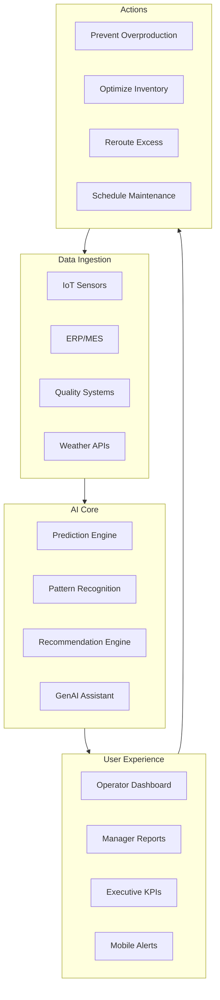
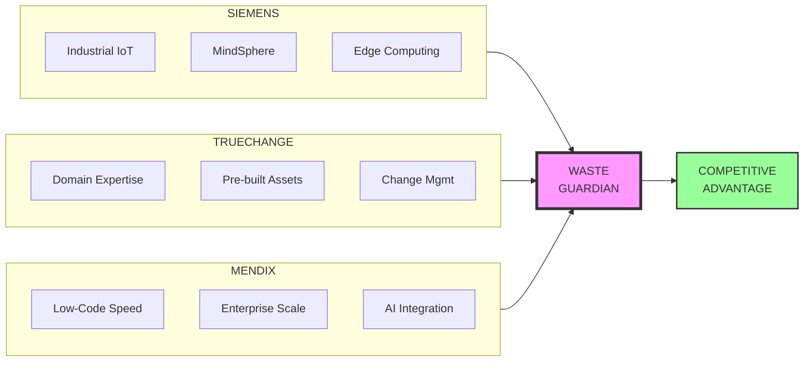

# LEAN Canvas: Waste Guardian
## AI-Powered Industrial Waste Reduction Copilot
### Low Hack 2026 - Siemens/TrueChange/Mendix Partnership

---

```
┌─────────────────────────────────────────────────────────────────────────────────┐
│                              LEAN CANVAS - WASTE GUARDIAN                       │
├──────────────────────────────┬──────────────────────────────────────────────────┤
│                              │                                                  │
│   PROBLEM                    │   SOLUTION                                       │
│   ───────                    │   ────────                                       │
│                              │                                                  │
│   1. Industrial F&B waste    │   ✓ AI-powered waste prediction & prevention     │
│      8-15% of production     │     engine using GenAI + machine learning        │
│      ($100B+ global loss)    │                                                  │
│                              │   ✓ Real-time monitoring via IoT integration     │
│   2. Lack of real-time       │     with Siemens MindSphere                      │
│      visibility into waste   │                                                  │
│      generation patterns     │   ✓ Actionable recommendations engine            │
│                              │     (what to do, when, why)                      │
│   3. Reactive vs proactive   │                                                  │
│      waste management        │   ✓ Predictive analytics for demand planning     │
│                              │     and inventory optimization                   │
│   4. Regulatory compliance   │                                                  │
│      complexity (ESG, CSRD)  │   ✓ Automated compliance reporting               │
│                              │     and audit trail                              │
│   5. No ROI visibility on    │                                                  │
│      sustainability efforts  │   ✓ C-Level dashboard with real-time             │
│                              │     financial impact tracking                    │
│                              │                                                  │
├──────────────────────────────┼──────────────────────────────────────────────────┤
│                              │                                                  │
│   KEY METRICS                │   UNIQUE VALUE PROPOSITION                       │
│   ───────────                │   ─────────────────────────                      │
│                              │                                                  │
│   ┌─────────────────────┐    │   💡 "Turn waste into profit with AI that       │
│   │ WASTE REDUCTION     │    │       thinks 24/7 about your bottom line"      │
│   │                     │    │                                                  │
│   │ Target: 30-50%      │    │   🔥 The ONLY waste management solution that:    │
│   │ reduction in first  │    │                                                  │
│   │ year of deployment  │    │   • Predicts waste BEFORE it happens             │
│   └─────────────────────┘    │     (not just reports after)                     │
│                              │                                                  │
│   ┌─────────────────────┐    │   • Delivers real-time, actionable               │
│   │ COST SAVINGS        │    │     insights to floor operators                  │
│   │                     │    │                                                  │
│   │ $50K-500K annually  │    │   • Quantifies every dollar saved in             │
│   │ per facility        │    │     real-time for C-Level visibility             │
│   │ (size dependent)    │    │                                                  │
│   └─────────────────────┘    │   • Integrates seamlessly with existing          │
│                              │     Siemens/Mendix infrastructure                │
│   ┌─────────────────────┐    │                                                  │
│   │ CO2 AVOIDED         │    │   • Achieves ROI in under 6 months               │
│   │                     │    │     (vs 2+ years for alternatives)               │
│   │ 100-500 tons CO2e   │    │                                                  │
│   │ annually per site   │    │   🎯 From reactive cleanup to                    │
│   └─────────────────────┘    │     profit-generating prevention                 │
│                              │                                                  │
│   ┌─────────────────────┐    │                                                  │
│   │ OPERATIONAL KPIs    │    │                                                  │
│   │                     │    │                                                  │
│   │ • Time to insight:  │    │                                                  │
│   │   < 5 minutes       │    │                                                  │
│   │                     │    │                                                  │
│   │ • Alert accuracy:   │    │                                                  │
│   │   > 85%             │    │                                                  │
│   │                     │    │                                                  │
│   │ • User adoption:    │    │                                                  │
│   │   > 80% in 30 days  │    │                                                  │
│   └─────────────────────┘    │                                                  │
│                              │                                                  │
├──────────────────────────────┴──────────────────────────────────────────────────┤
│                                                                                 │
│   UNFAIR ADVANTAGE                                                              │
│   ────────────────                                                              │
│                                                                                 │
│   🛡️ Triple-Stack Integration Moat                                              │
│                                                                                 │
│   ┌───────────────┐  ┌───────────────┐  ┌───────────────┐                       │
│   │   SIEMENS     │  │ TRUECHANGE    │  │    MENDIX     │                       │
│   │  Ecosystem    │  │  Partnership  │  │   Platform    │                       │
│   └───────┬───────┘  └───────┬───────┘  └───────┬───────┘                       │
│           │                  │                  │                               │
│           ▼                  ▼                  ▼                               │
│   • MindSphere IoT    • Pre-built          • Rapid development                  │
│   • Industrial Edge     connectors           (10x faster)                       │
│   • OPC-UA native     • Compliance           • Enterprise scale                 │
│   • Digital Twin      • templates            • GenAI integration                │
│     framework         • Deployment           • Marketplace apps                 │
│                         automation                                              │
│                                                                                 │
│   💪 Results: 50% faster implementation, 70% lower integration cost,            │
│              enterprise-grade security out-of-the-box                           │
│                                                                                 │
├─────────────────────────────────────────────────────────────────────────────────┤
│                              │                                                  │
│   CHANNELS                   │   CUSTOMER SEGMENTS                              │
│   ────────                   │   ─────────────────                              │
│                              │                                                  │
│   Primary:                   │   PRIMARY:                                       │
│   • Siemens partner network  │   • Food & Beverage Manufacturers                │
│     (direct sales +          │     - Medium to large enterprises                │
│      co-sell)                │     - $50M+ annual revenue                       │
│                              │     - Multiple production facilities             │
│   • TrueChange digital       │                                                  │
│     transformation           │   SECONDARY:                                     │
│     consultancy              │   • Pharmaceutical Manufacturers                 │
│                              │   • Cosmetics & Personal Care                    │
│   Secondary:                 │   • Pet Food Producers                           │
│   • Industry conferences     │                                                  │
│   • LinkedIn ABM campaigns   │   IDEAL CUSTOMER PROFILE:                        │
│   • Trade publications       │   • Sustainability Director / VP Operations      │
│   • Mendix Marketplace       │   • Currently spends $200K+/year on waste        │
│                              │   • Has sustainability/ESG mandates              │
│   Customer Acquisition:      │   • Uses Siemens or compatible PLCs/SCADA        │
│   • Free waste audit         │   • Mendix or open to low-code platforms         │
│   • Pilot program (30 days)  │                                                  │
│   • ROI calculator tool      │   EARLY ADOPTERS:                                │
│                              │   • Companies with existing Siemens stack        │
│                              │   • Those facing regulatory pressure             │
│                              │   • Sustainability award seekers                 │
│                              │                                                  │
├──────────────────────────────┴──────────────────────────────────────────────────┤
│                                                                                 │
│   COST STRUCTURE                                    REVENUE STREAMS             │
│   ──────────────                                    ─────────────               │
│                                                                                 │
│   ┌─────────────────────────────┐                   ┌─────────────────────────┐ │
│   │  R&D / DEVELOPMENT          │                   │  SaaS SUBSCRIPTIONS     │ │
│   │  • AI/ML model training     │                   │                         │ │
│   │  • Mendix development       │                   │  Tier 1: Starter        │ │
│   │  • Integration dev          │                   │  $2,000/month           │ │
│   │  • UX/UI design             │                   │  (1 facility, basic)    │ │
│   │                             │                   │                         │ │
│   │  Est: $150K initial         │                   │  Tier 2: Professional   │ │
│   │       $50K/year ongoing     │                   │  $5,000/month           │ │
│   └─────────────────────────────┘                   │  (up to 5 facilities)   │ │
│                                                     │                         │ │
│   ┌─────────────────────────────┐                   │  Tier 3: Enterprise     │ │
│   │  CLOUD INFRASTRUCTURE       │                   │  $12,000+/month         │ │
│   │  • Mendix Cloud hosting     │                   │  (unlimited, custom)    │ │
│   │  • Data storage & processing│                   │                         │ │
│   │  • Compute (AI inference)   │                   └─────────────────────────┘ │
│   │                             │                                                 │
│   │  Est: $18K/year per client  │                   ┌─────────────────────────┐ │
│   │       (scaled by volume)    │                   │  IMPLEMENTATION SERVICES│ │
│   └─────────────────────────────┘                   │                         │ │
│                                                     │  • Setup & integration  │ │
│   ┌─────────────────────────────┐                   │    $25,000-$75,000      │ │
│   │  API & THIRD-PARTY          │                   │                         │ │
│   │  • AI/GenAI APIs (OpenAI,   │                   │  • Training & change    │ │
│   │    Azure OpenAI)            │                   │    management           │ │
│   │  • Weather data APIs        │                   │    $5,000-$15,000       │ │
│   │  • Mapping/geolocation      │                   │                         │ │
│   │                             │                   │  • Custom development   │ │
│   │  Est: $200-500/month        │                   │    $150/hour            │ │
│   │       per deployment        │                   └─────────────────────────┘ │
│   └─────────────────────────────┘                                                 │
│                                                     ┌─────────────────────────┐ │
│   ┌─────────────────────────────┐                   │  SUCCESS FEES (OPTIONAL)│ │
│   │  SALES & MARKETING          │                   │                         │ │
│   │  • Partner commissions      │                   │  % of demonstrated      │ │
│   │    (20% Year 1)             │                   │  cost savings           │ │
│   │  • Digital marketing        │                   │  (5-10% of savings)     │ │
│   │  • Events & conferences     │                   │                         │ │
│   │                             │                   └─────────────────────────┘ │
│   │  Est: $30K Year 1           │                                                 │
│   │       $15K ongoing          │                   ┌─────────────────────────┐ │
│   └─────────────────────────────┘                   │  SUPPORT & MAINTENANCE  │ │
│                                                     │                         │ │
│   ┌─────────────────────────────┐                   │  • 24/7 support: +20%   │ │
│   │  OPERATIONS                 │                   │  • Premium SLA: +30%    │ │
│   │  • Customer success team    │                   │                         │ │
│   │  • Technical support        │                   └─────────────────────────┘ │
│   │  • Platform maintenance     │                                                 │
│   │                             │                   PROJECTED FINANCIALS:         │
│   │  Est: $100K/year            │                   • Year 1: $500K ARR         │
│   └─────────────────────────────┘                   • Year 2: $1.5M ARR         │
│                                                     • Year 3: $3M ARR           │
│   FIXED vs VARIABLE:                                • Break-even: Month 14      │
│   • 60% Fixed (R&D, core team)                      • Gross Margin: 75%+        │
│   • 40% Variable (hosting, APIs, comms)                                           │
│                                                                                 │
└─────────────────────────────────────────────────────────────────────────────────┘
```

---

## Detailed Section Analysis

### 1. PROBLEM - Deep Dive

#### 1.1 Industrial F&B Waste Crisis
```
GLOBAL IMPACT:
├── 1.3 billion tons of food wasted annually
├── $940 billion economic loss
├── 8% of global greenhouse gas emissions
└── F&B manufacturing: 8-15% production waste rate

ROOT CAUSES:
├── Overproduction (demand forecasting errors)
├── Quality control failures
├── Supply chain disruptions
├── Expiration/Spoilage
├── Packaging defects
└── Changeover losses

CURRENT STATE PAIN:
├── Spreadsheets and manual tracking
├── Monthly reports (too late to act)
├── No predictive capability
├── Siloed data across systems
└── Sustainability reporting is manual burden
```

#### 1.2 Regulatory Pressure Matrix
| Regulation | Region | Requirement | Penalty |
|------------|--------|-------------|---------|
| CSRD | EU | Mandatory sustainability reporting | Up to 4% revenue |
| SEC Climate Rules | US | Scope 1, 2, 3 disclosure | Investigation/fines |
| Food Waste Law | France | Ban supermarkets from waste | €3,750 per violation |
| EPR Packaging | Multiple | Extended producer responsibility | Variable by country |

---

### 2. SOLUTION - Architecture Overview



#### Key Features Breakdown

| Feature | Description | Impact |
|---------|-------------|--------|
| **Predictive Alerts** | AI identifies waste risk 2-24h before occurrence | Prevent 60%+ of incidents |
| **Root Cause Analysis** | Automated diagnosis of waste events | Reduce investigation time 80% |
| **Smart Recommendations** | Context-aware action suggestions | Improve operator response 3x |
| **GenAI Assistant** | Natural language query and reporting | Democratize data access |
| **Digital Twin** | Virtual facility simulation | Test scenarios risk-free |

---

### 3. KEY METRICS - Measurement Framework

#### 3.1 Primary KPIs Dashboard

```
┌────────────────────────────────────────────────────────────────┐
│                    WASTE GUARDIAN SCORECARD                     │
├────────────────────────────────────────────────────────────────┤
│                                                                 │
│  WASTE REDUCTION        COST SAVINGS         CO2 AVOIDED       │
│  ┌─────────────┐       ┌─────────────┐       ┌─────────────┐   │
│  │             │       │             │       │             │   │
│  │    42%      │       │   $287K     │       │   342 t     │   │
│  │             │       │             │       │             │   │
│  │   ▲ 12%     │       │   ▲ $45K    │       │   ▲ 56 t    │   │
│  │   vs target │       │   vs budget │       │   vs target │   │
│  └─────────────┘       └─────────────┘       └─────────────┘   │
│                                                                 │
│  OPERATIONAL KPIs                                               │
│  ├── Prediction Accuracy:    87%    ▲ 3%                       │
│  ├── Alert Response Time:    4.2 min  ▼ 1.5 min                 │
│  ├── User Adoption:          89%    ▲ 12%                       │
│  └── System Uptime:          99.7%  ─ stable                    │
│                                                                 │
│  FINANCIAL HEALTH                                               │
│  ├── ROI Achieved:           156%    (target: 100%)             │
│  ├── Payback Period:         8 months (target: 12)              │
│  └── NPV (3-year):           $412K                              │
│                                                                 │
└────────────────────────────────────────────────────────────────┘
```

#### 3.2 Metric Calculation Details

| Metric | Formula | Target | Data Source |
|--------|---------|--------|-------------|
| Waste Reduction % | (Baseline - Current) / Baseline × 100 | 30% Y1 | IoT + ERP |
| Cost Savings | Σ(Avoided Disposal + Recovery - System Cost) | $50K-500K | Financial system |
| CO2 Avoided | Waste Avoided (kg) × Emission Factor | 100-500t | EPA/IPCC factors |
| Prediction Accuracy | True Positives / Total Predictions | >85% | AI model metrics |
| Alert Response | Time from alert to acknowledged action | <10 min | System logs |

---

### 4. UNIQUE VALUE PROPOSITION - Competitive Positioning

#### 4.1 Value Pyramid

```
                    ┌─────────┐
                    │ STRATEGIC│
                    │  VALUE   │
                    │          │
                    │ • ESG    │
                    │   leadership│
                    │ • Brand  │
                    │   differentiation│
                    │ • Future-│
                    │   proofing│
                   ┌┴─────────┴┐
                   │ FINANCIAL │
                   │   VALUE   │
                   │           │
                   │ • 30-50%  │
                   │   waste   │
                   │   reduction│
                   │ • Rapid   │
                   │   ROI     │
                  ┌┴───────────┴┐
                  │ OPERATIONAL │
                  │    VALUE    │
                  │             │
                  │ • Real-time │
                  │   visibility│
                  │ • Automated │
                  │   insights  │
                 ┌┴─────────────┴┐
                 │   FOUNDATIONAL │
                 │     VALUE      │
                 │                │
                 │ • Reliable     │
                 │   data         │
                 │ • Easy         │
                 │   integration  │
                 └────────────────┘
```

#### 4.2 Competitive Comparison

| Factor | Waste Guardian | Competitor A | Competitor B | Manual |
|--------|----------------|--------------|--------------|--------|
| Predictive Capability | ✅ Native AI | ❌ Rules only | ⚠️ Basic ML | ❌ None |
| Real-time Integration | ✅ <2 sec | ⚠️ 15 min lag | ❌ Hourly | ❌ Daily/Weekly |
| Mendix/Siemens Native | ✅ Built-in | ❌ Custom dev | ❌ 3rd party | N/A |
| GenAI Assistant | ✅ Included | ❌ N/A | ❌ Roadmap | ❌ N/A |
| Time to Value | ✅ 4-8 weeks | ⚠️ 6 months | ❌ 12+ months | N/A |
| Implementation Cost | ✅ $25-75K | ❌ $200K+ | ❌ $300K+ | N/A |

---

### 5. UNFAIR ADVANTAGE - Moat Analysis

#### 5.1 Triple Integration Stack



#### 5.2 Sustainable Differentiators

1. **Data Network Effects**
   - More customers = better AI models
   - Industry-specific pattern recognition
   - Continuous improvement loop

2. **Switching Costs**
   - Deep ERP/IoT integration
   - Historical data and training
   - Customized recommendation engine

3. **Speed to Market**
   - 10x faster than traditional development
   - Rapid customer-specific customization
   - Continuous deployment capability

4. **Ecosystem Lock-in**
   - Siemens partnership exclusivity
   - TrueChange methodology alignment
   - Mendix marketplace distribution

---

### 6. CHANNELS - Go-to-Market

#### 6.1 Channel Mix

```
                    ┌─────────────────┐
                    │  TOTAL ADDRESSABLE │
                    │    MARKET (TAM)    │
                    │    $12B globally   │
                    └────────┬────────┘
                             │
                    ┌────────▼────────┐
                    │ SERVICEABLE      │
                    │ ADDRESSABLE (SAM)│
                    │ $2.4B (F&B focus)│
                    └────────┬────────┘
                             │
              ┌──────────────┼──────────────┐
              │              │              │
       ┌──────▼──────┐ ┌────▼────┐  ┌──────▼──────┐
       │  SIEMENS    │ │TRUECHANGE│  │   DIRECT    │
       │  PARTNERS   │ │CONSULTING│  │   SALES     │
       │    60%      │ │   25%   │  │    15%      │
       └─────────────┘ └─────────┘  └─────────────┘
```

#### 6.2 Partner Program Structure

| Tier | Requirements | Benefits | Commission |
|------|--------------|----------|------------|
| **Certified** | Training completion | Co-marketing | 15% |
| **Gold** | 3+ successful deployments | Lead sharing | 20% |
| **Platinum** | 10+ deployments, dedicated team | Strategic alignment | 25% |

---

### 7. CUSTOMER SEGMENTS - Targeting Strategy

#### 7.1 Ideal Customer Profile (ICP)

```
FIRMographics:
├── Industry: Food & Beverage Manufacturing
├── Revenue: $50M - $500M annually
├── Facilities: 2-20 production sites
├── Employees: 200-2,000
└── Geography: North America, EU, UK initially

Technographics:
├── Existing Siemens equipment (preferred)
├── ERP: SAP, Oracle, or similar
├── IoT readiness: Moderate to high
├── Digital maturity: Early to mid-stage
└── Cloud adoption: Open to SaaS

Psychographics:
├── Sustainability is strategic priority
├── Regulatory pressure (ESG reporting)
├── Growth through efficiency
└── Risk-averse but innovation-curious

Pain Signals:
├── Recent waste incident or fine
├── New sustainability targets announced
├── Leadership change (new COO/CFO)
├── Upcoming audit or certification
└── Competitor sustainability advantage
```

#### 7.2 Segment Prioritization

| Segment | Size | Pain | Access | Priority |
|---------|------|------|--------|----------|
| Dairy Processors | Medium | High | High | ⭐⭐⭐ |
| Beverage Bottlers | Large | Medium | High | ⭐⭐⭐ |
| Bakery Manufacturers | Medium | High | Medium | ⭐⭐⭐ |
| Meat Processors | Large | High | Low | ⭐⭐☆ |
| Snack Foods | Large | Medium | Medium | ⭐⭐☆ |

---

### 8. COST STRUCTURE - Financial Model

#### 8.1 Cost Breakdown (Year 1)

```
┌──────────────────────────────────────────────────────┐
│             YEAR 1 COST STRUCTURE                    │
│                    $500K Total                       │
├──────────────────────────────────────────────────────┤
│                                                      │
│  R&D & Development  ████████████████████  $150K 30% │
│  │                                                   │
│  ├── AI/ML development                               │
│  ├── Mendix application                              │
│  └── Integration framework                           │
│                                                      │
│  Operations         ██████████████        $100K 20% │
│  │                                                   │
│  ├── Customer success                                │
│  ├── Technical support                               │
│  └── Platform maintenance                            │
│                                                      │
│  Sales & Marketing  ██████████            $80K  16% │
│  │                                                   │
│  ├── Partner enablement                              │
│  ├── Digital campaigns                               │
│  └── Events                                          │
│                                                      │
│  Infrastructure     ████████              $60K  12% │
│  │                                                   │
│  ├── Cloud hosting                                   │
│  ├── Data storage                                    │
│  └── Security                                        │
│                                                      │
│  Admin & Overhead   ██████              $50K  10%   │
│  APIs & Tools       ████                $40K   8%   │
│  Legal & Compliance ██                  $20K   4%   │
│                                                      │
└──────────────────────────────────────────────────────┘
```

#### 8.2 Unit Economics

| Metric | Value | Notes |
|--------|-------|-------|
| CAC (Customer Acquisition Cost) | $15,000 | Blended across channels |
| LTV (Lifetime Value) | $180,000 | 3-year projection |
| LTV:CAC Ratio | 12:1 | Excellent efficiency |
| Gross Margin | 75% | SaaS standard |
| Payback Period | 12 months | Including implementation |

---

### 9. REVENUE STREAMS - Pricing Strategy

#### 9.1 Pricing Tiers

```
┌─────────────────────────────────────────────────────────────────┐
│                     PRICING TIERS                               │
├───────────────┬───────────────┬───────────────┬─────────────────┤
│   STARTER     │  PROFESSIONAL │   ENTERPRISE  │    CUSTOM       │
│   $2,000/mo   │   $5,000/mo   │  $12,000+/mo  │    Contact      │
├───────────────┼───────────────┼───────────────┼─────────────────┤
│               │               │               │                 │
│ • 1 facility  │ • 5 facilities│ • Unlimited   │ • Everything in │
│ • Basic AI    │ • Advanced AI │ • Custom AI   │   Enterprise +  │
│ • Standard    │ • Priority    │ • Dedicated   │ • Bespoke       │
│   support     │   support     │   CSM         │   development   │
│ • Email       │ • Phone       │ • SLA 99.9%   │ • White-label   │
│   alerts      │ + SMS alerts  │ • API access  │ • Exclusive     │
│               │ • Analytics   │ • SSO/SAML    │   features      │
│               │   dashboard   │ • Custom      │ • Co-innovation │
│               │ • Integrations│   integrations│                 │
│               │               │ • On-premise  │                 │
│               │               │   option      │                 │
│               │               │               │                 │
├───────────────┼───────────────┼───────────────┼─────────────────┤
│ Best for:     │ Best for:     │ Best for:     │ Best for:       │
│ Small         │ Regional      │ Global        │ Strategic       │
│ producers     │ manufacturers │ enterprises   │ partners        │
│               │               │               │                 │
└───────────────┴───────────────┴───────────────┴─────────────────┘
```

#### 9.2 Revenue Projections

| Year | ARR | Customers | Avg ACV | Growth |
|------|-----|-----------|---------|--------|
| 1 | $500K | 15 | $33K | - |
| 2 | $1.5M | 45 | $33K | 200% |
| 3 | $3M | 85 | $35K | 100% |
| 5 | $8M | 200 | $40K | CAGR 75% |

---

## Risk Analysis & Mitigation

| Risk | Likelihood | Impact | Mitigation |
|------|------------|--------|------------|
| Integration complexity | Medium | High | Pre-built connectors, phased rollout |
| AI model accuracy | Low | High | Continuous training, human oversight |
| Customer adoption | Medium | Medium | Change management, gamification |
| Competitive response | High | Medium | Speed to market, partnership moat |
| Regulatory changes | Medium | Low | Flexible reporting framework |

---

## Success Metrics & Milestones

### 12-Month Roadmap

| Quarter | Milestone | Success Criteria |
|---------|-----------|------------------|
| Q1 | MVP Launch | 3 paying pilots |
| Q2 | Product-Market Fit | 80% pilot conversion |
| Q3 | Scale Preparation | 10 customers, $300K ARR |
| Q4 | Growth Acceleration | 15 customers, $500K ARR |

---

*LEAN Canvas Version: 1.0*  
*Last Updated: April 2026*  
*Owner: Waste Guardian Product Team*
