# Competitive Landscape: F&B Waste Management Solutions

## Executive Summary

This document provides a comprehensive competitive analysis of the Food & Beverage waste management software market. We examine direct competitors, indirect alternatives, platform competitors, and outline Waste Guardian's differentiation strategy.

---

## Market Positioning Map

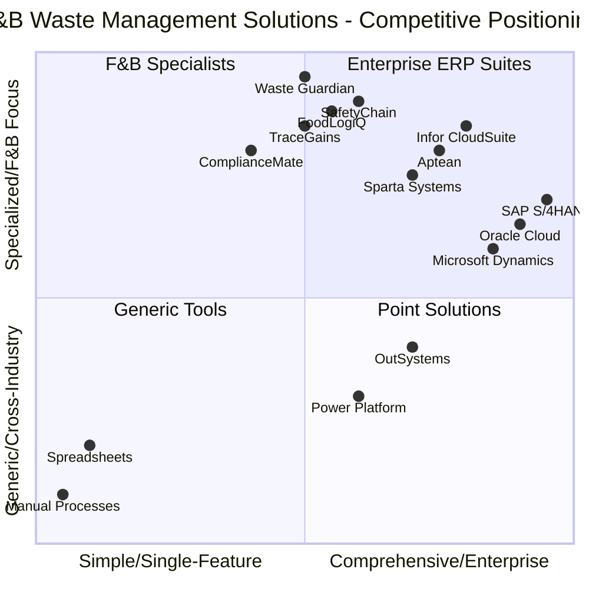

---

## 1. Direct Competitors

### 1.1 Specialized F&B Waste Management Solutions

#### SafetyChain Software

| Attribute | Details |
|-----------|---------|
| **Founded** | 2008 |
| **Headquarters** | California, USA |
| **Focus** | Food safety, quality, and waste management |
| **Clients** | 1,000+ food & beverage companies |
| **Key Features** | HACCP automation, supplier management, waste tracking |
| **Deployment** | Cloud-based (SaaS) |
| **Pricing** | $500-$2,000/user/month |

**Strengths:**
- Deep F&B industry expertise
- Strong compliance automation
- Established brand recognition
- Comprehensive audit trails

**Weaknesses:**
- High price point for mid-market
- Limited customization options
- Legacy UI/UX
- Slow implementation (3-6 months)

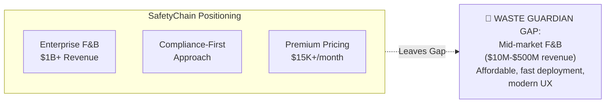

---

#### FoodLogiQ

| Attribute | Details |
|-----------|---------|
| **Founded** | 2006 |
| **Headquarters** | North Carolina, USA |
| **Focus** | Farm-to-fork traceability and quality management |
| **Clients** | Major brands: Whole Foods, Chipotle, Starbucks |
| **Key Features** | Supply chain traceability, recall management, quality audits |
| **Deployment** | Cloud-based |
| **Pricing** | Enterprise pricing (custom quotes) |

**Strengths:**
- Blockchain-enabled traceability
- Strong supplier network effects
- Excellent recall management
- Enterprise-grade security

**Weaknesses:**
- Complex implementation
- Requires supplier onboarding
- Overkill for waste-only needs
- Limited Mendix/low-code ecosystem

---

#### TraceGains

| Attribute | Details |
|-----------|---------|
| **Founded** | 2008 |
| **Headquarters** | Colorado, USA |
| **Focus** | Supplier compliance and quality management |
| **Clients** | 1,200+ food, beverage, supplement companies |
| **Key Features** | Supplier document management, specification management, analytics |
| **Deployment** | Cloud-based |
| **Pricing** | $15K-$50K/year starting |

**Strengths:**
- Network approach to supplier data
- AI-powered document parsing
- Strong community aspect
- Good integration capabilities

**Weaknesses:**
- Waste management is secondary feature
- Expensive for smaller operations
- Learning curve for users
- Limited workflow automation

---

#### ComplianceMate

| Attribute | Details |
|-----------|---------|
| **Founded** | 2012 |
| **Headquarters** | Georgia, USA |
| **Focus** | Food safety monitoring and compliance |
| **Clients** | Restaurant chains, foodservice operators |
| **Key Features** | Temperature monitoring, HACCP checklists, corrective actions |
| **Deployment** | Cloud + IoT sensors |
| **Pricing** | $200-$500/location/month |

**Strengths:**
- IoT-first approach
- Real-time monitoring
- Mobile-native design
- Quick deployment

**Weaknesses:**
- Limited to operational compliance
- No advanced waste analytics
- Restaurant-focused (not manufacturing)
- Proprietary hardware required

---

### 1.2 Direct Competitors Feature Comparison

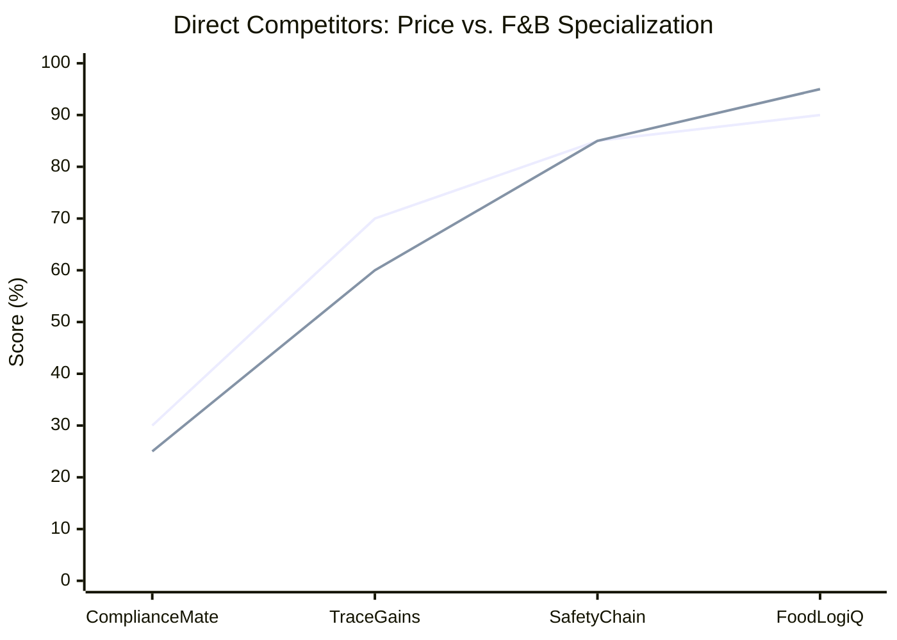

| Feature | SafetyChain | FoodLogiQ | TraceGains | ComplianceMate | Waste Guardian |
|---------|-------------|-----------|------------|----------------|----------------|
| **Waste Tracking** | ⭐⭐⭐ | ⭐⭐ | ⭐⭐ | ⭐ | ⭐⭐⭐⭐⭐ |
| **F&B Compliance** | ⭐⭐⭐⭐⭐ | ⭐⭐⭐⭐ | ⭐⭐⭐⭐ | ⭐⭐⭐⭐⭐ | ⭐⭐⭐⭐ |
| **ERP Integration** | ⭐⭐⭐⭐ | ⭐⭐⭐⭐ | ⭐⭐⭐ | ⭐⭐ | ⭐⭐⭐⭐ |
| **IoT Support** | ⭐⭐⭐ | ⭐⭐ | ⭐⭐ | ⭐⭐⭐⭐⭐ | ⭐⭐⭐⭐ |
| **Analytics/AI** | ⭐⭐⭐ | ⭐⭐⭐⭐ | ⭐⭐⭐⭐ | ⭐⭐ | ⭐⭐⭐⭐ |
| **Mobile App** | ⭐⭐⭐ | ⭐⭐⭐ | ⭐⭐⭐⭐ | ⭐⭐⭐⭐⭐ | ⭐⭐⭐⭐ |
| **Ease of Use** | ⭐⭐⭐ | ⭐⭐ | ⭐⭐⭐ | ⭐⭐⭐⭐ | ⭐⭐⭐⭐⭐ |
| **Implementation Speed** | ⭐⭐ | ⭐⭐ | ⭐⭐⭐ | ⭐⭐⭐⭐ | ⭐⭐⭐⭐⭐ |
| **Price Competitiveness** | ⭐⭐ | ⭐ | ⭐⭐⭐ | ⭐⭐⭐⭐ | ⭐⭐⭐⭐⭐ |
| **Customization** | ⭐⭐ | ⭐⭐⭐ | ⭐⭐⭐ | ⭐⭐ | ⭐⭐⭐⭐⭐ |

---

## 2. Indirect Competitors

### 2.1 ERP Modules (Embedded Waste Management)

#### SAP S/4HANA for Food & Beverage

| Attribute | Details |
|-----------|---------|
| **Market Share** | 22% of global F&B ERP |
| **Waste Features** | Inventory management, quality management, sustainability reporting |
| **Strengths** | Enterprise integration, comprehensive functionality, global support |
| **Weaknesses** | Complex, expensive, slow to customize, steep learning curve |
| **Pricing** | $150K-$1M+ implementation |

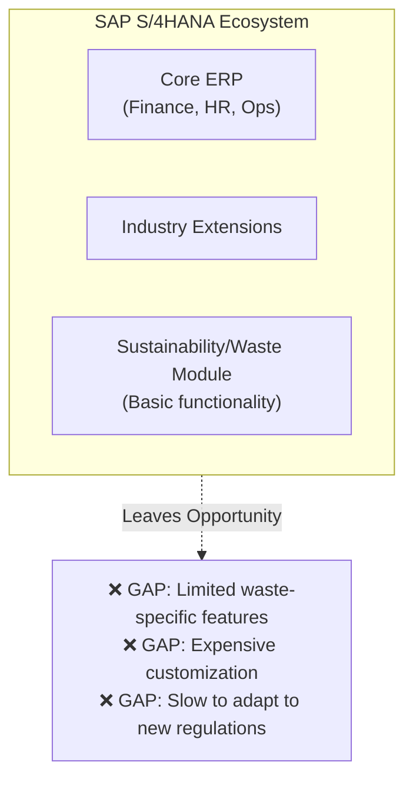

---

#### Oracle Cloud ERP (Food & Beverage)

| Attribute | Details |
|-----------|---------|
| **Market Share** | 18% of global F&B ERP |
| **Waste Features** | Supply chain planning, product lifecycle management, sustainability |
| **Strengths** | AI/ML capabilities, strong analytics, scalability |
| **Weaknesses** | High total cost of ownership, complex implementation |
| **Pricing** | $100K-$800K+ implementation |

---

#### Infor CloudSuite Food & Beverage

| Attribute | Details |
|-----------|---------|
| **Market Share** | 12% of global F&B ERP |
| **Waste Features** | Recipe management, lot traceability, quality management |
| **Strengths** | Industry-specific, modern UX, good F&B functionality |
| **Weaknesses** | Limited Mendix integration, proprietary platform |
| **Pricing** | $75K-$500K implementation |

---

### 2.2 Manual Processes (Status Quo)

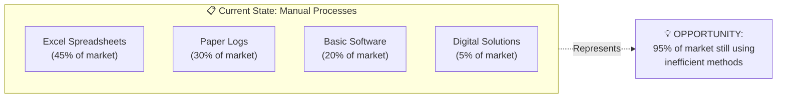

**Manual Process Pain Points:**
- Data entry errors (15-20% error rate)
- No real-time visibility
- Compliance audit challenges
- No predictive capabilities
- Time-consuming reporting
- Siloed information

---

## 3. Platform Competitors (Low-Code/No-Code)

### 3.1 Low-Code Platform Landscape

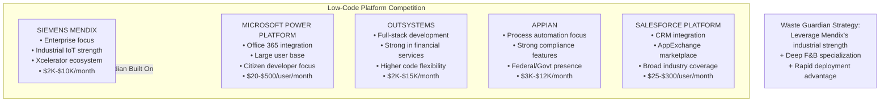

### 3.2 Platform Comparison Matrix

| Platform | Gartner Position | Industrial Focus | F&B Specialization | Developer Experience | Enterprise Adoption |
|----------|-----------------|------------------|-------------------|---------------------|---------------------|
| **Mendix** | Leader | ⭐⭐⭐⭐⭐ | ⭐⭐⭐ | ⭐⭐⭐⭐ | ⭐⭐⭐⭐ |
| **Power Platform** | Leader | ⭐⭐⭐ | ⭐⭐ | ⭐⭐⭐⭐ | ⭐⭐⭐⭐⭐ |
| **OutSystems** | Leader | ⭐⭐⭐ | ⭐⭐ | ⭐⭐⭐⭐⭐ | ⭐⭐⭐⭐ |
| **Appian** | Challenger | ⭐⭐⭐ | ⭐⭐⭐ | ⭐⭐⭐ | ⭐⭐⭐⭐ |
| **Salesforce** | Leader | ⭐⭐ | ⭐⭐ | ⭐⭐⭐ | ⭐⭐⭐⭐⭐ |

### 3.3 Siemens/Mendix Competitive Advantages

| Advantage | Description | Waste Guardian Benefit |
|-----------|-------------|----------------------|
| **Xcelerator Integration** | Native connection to industrial systems | Direct IoT sensor integration |
| **Industrial IoT** | MindSphere platform capabilities | Real-time equipment monitoring |
| **Manufacturing DNA** | Born from industrial automation | Shop-floor ready solutions |
| **Global Support** | Siemens' worldwide presence | Enterprise credibility |
| **Compliance Ready** | Industrial security standards | Regulated industry acceptance |

---

## 4. Feature Comparison Matrix

### 4.1 Comprehensive Feature Analysis

| Feature Category | Feature | SafetyChain | FoodLogiQ | SAP | Mendix/Waste Guardian |
|-----------------|---------|-------------|-----------|-----|----------------------|
| **Core Waste Management** |
| | Waste tracking & logging | ✅ | ⚠️ | ⚠️ | ✅✅ |
| | Waste categorization | ✅ | ❌ | ✅ | ✅✅ |
| | Disposal management | ✅ | ❌ | ⚠️ | ✅ |
| | Regulatory reporting | ✅✅ | ✅ | ✅✅ | ✅ |
| **Analytics & AI** |
| | Waste pattern analysis | ⚠️ | ❌ | ✅ | ✅✅ |
| | Predictive analytics | ❌ | ❌ | ✅ | ✅ |
| | Automated insights | ❌ | ❌ | ⚠️ | ✅ |
| | Custom dashboards | ⚠️ | ✅ | ✅ | ✅✅ |
| **Integration** |
| | ERP Integration (SAP) | ✅ | ✅ | N/A | ✅ |
| | IoT Sensors | ⚠️ | ❌ | ✅ | ✅✅ |
| | SCADA/OT Systems | ❌ | ❌ | ✅ | ✅✅ |
| | Accounting Systems | ✅ | ⚠️ | ✅✅ | ✅ |
| **Compliance** |
| | HACCP Support | ✅✅ | ✅ | ✅ | ✅ |
| | PNRS (Brazil) | ❌ | ❌ | ⚠️ | ✅✅ |
| | ISO 14001 | ✅ | ⚠️ | ✅ | ✅ |
| | Audit trails | ✅✅ | ✅✅ | ✅✅ | ✅ |
| **Usability** |
| | Mobile app | ✅ | ✅ | ✅ | ✅✅ |
| | Offline capability | ❌ | ❌ | ⚠️ | ✅ |
| | Multi-language | ✅ | ✅ | ✅✅ | ✅ |
| | Customization | ⚠️ | ⚠️ | ⚠️ | ✅✅ |
| **Deployment** |
| | Implementation time | 3-6 mo | 4-8 mo | 6-18 mo | 2-6 weeks |
| | Cloud deployment | ✅ | ✅ | ✅ | ✅ |
| | On-premise option | ⚠️ | ❌ | ✅ | ✅ |
| | Scalability | ✅ | ✅ | ✅✅ | ✅ |

*Legend: ✅✅ = Excellent, ✅ = Good, ⚠️ = Limited, ❌ = Not Available*

### 4.2 Unique Waste Guardian Capabilities

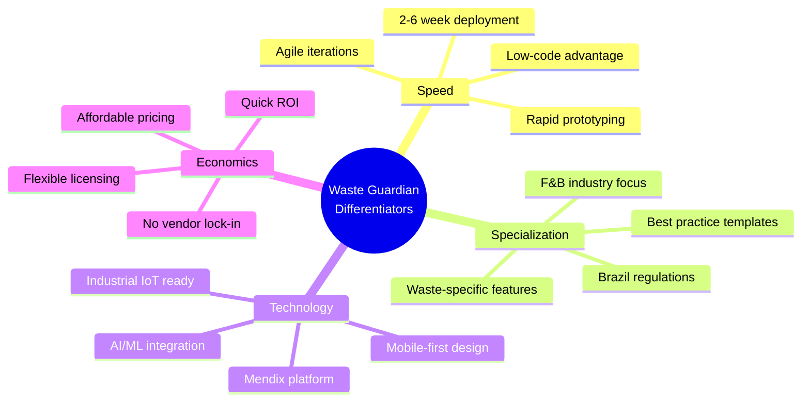

---

## 5. Pricing Benchmark

### 5.1 Market Pricing Analysis

| Solution Type | Price Range | Implementation Cost | Total Year 1 Cost | Target Segment |
|---------------|-------------|---------------------|-------------------|----------------|
| **Enterprise ERP (SAP/Oracle)** | $50K-$500K/year | $200K-$1M | $500K-$2M+ | Large Enterprise |
| **Specialized F&B (SafetyChain)** | $15K-$60K/year | $30K-$100K | $100K-$200K | Mid-Enterprise |
| **Traceability (FoodLogiQ)** | $25K-$100K/year | $50K-$200K | $150K-$400K | Enterprise |
| **Quality Management (TraceGains)** | $15K-$50K/year | $20K-$80K | $80K-$150K | Mid-Market+ |
| **Monitoring (ComplianceMate)** | $5K-$30K/year | $10K-$40K | $30K-$80K | Restaurant Chains |
| **Waste Guardian (Proposed)** | $5K-$25K/year | $5K-$20K | $20K-$60K | Mid-Market |

### 5.2 Value Proposition Comparison

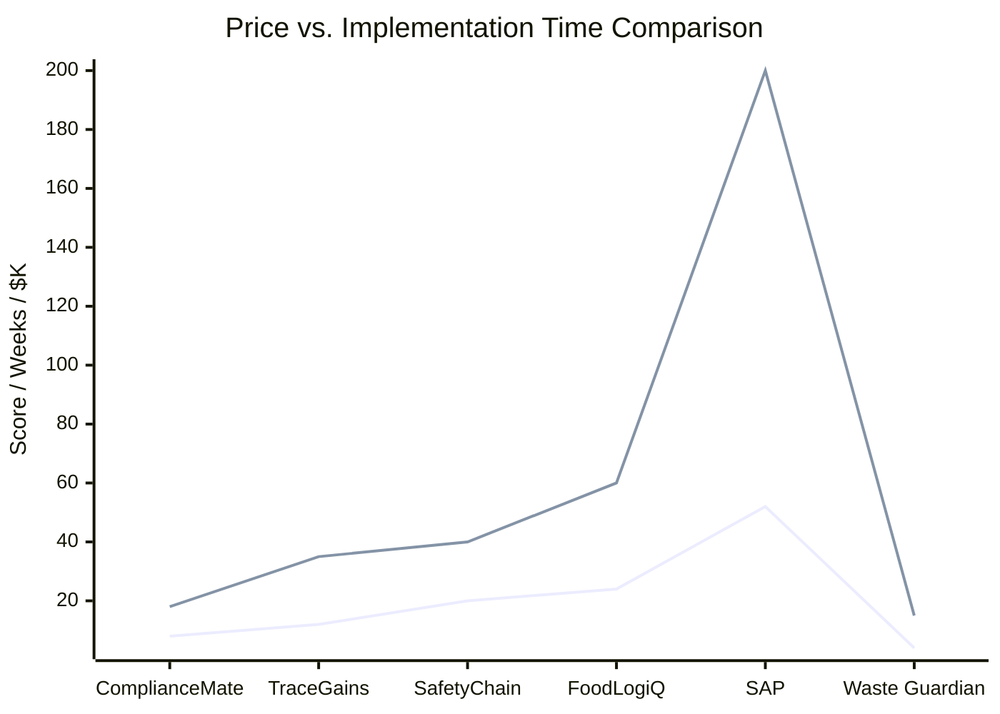

### 5.3 Waste Guardian Pricing Strategy

| Tier | Monthly Price | Annual Price | Features | Target |
|------|--------------|--------------|----------|--------|
| **Starter** | $500 | $5,000 | Basic waste tracking, 1 facility, 5 users | Small F&B manufacturers |
| **Professional** | $1,500 | $15,000 | Full features, 3 facilities, 20 users, IoT | Mid-market companies |
| **Enterprise** | $4,000+ | $40,000+ | Unlimited, custom integrations, dedicated support | Large processors |

---

## 6. Differentiation Strategy

### 6.1 Waste Guardian Competitive Positioning

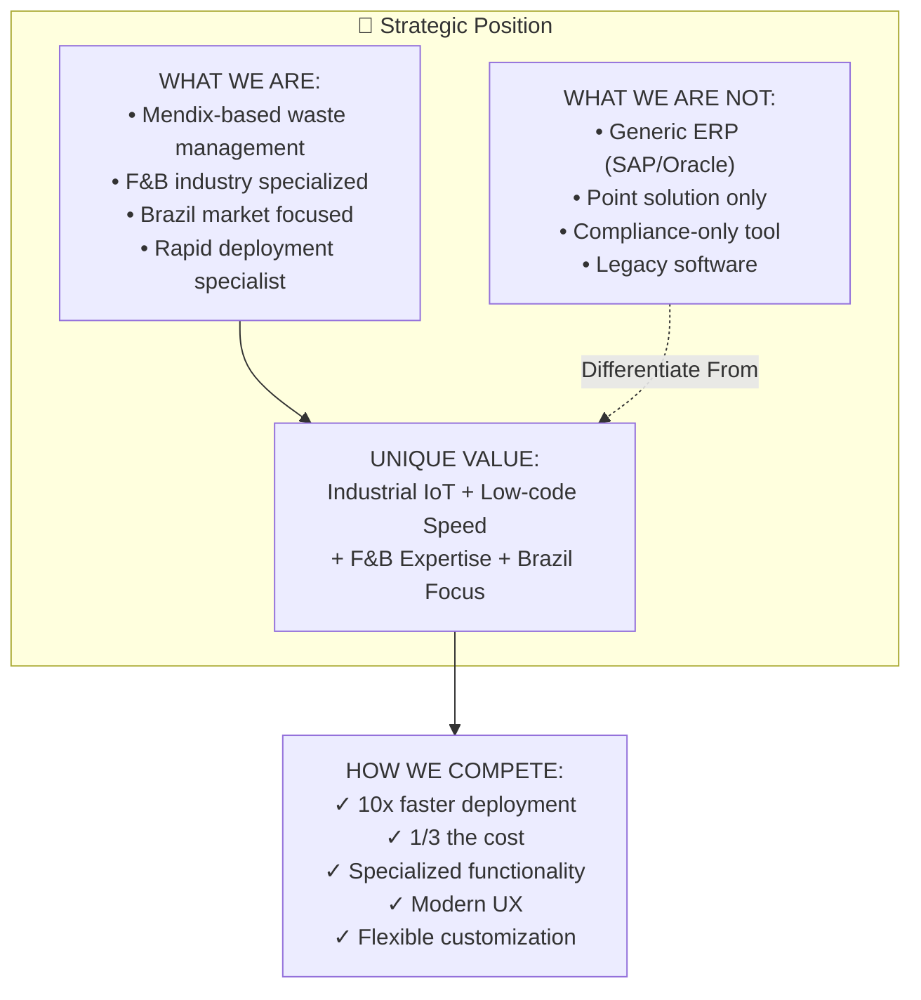

### 6.2 Key Differentiators

#### 1. Speed-to-Value

| Competitor | Typical Implementation | Waste Guardian |
|------------|----------------------|----------------|
| SAP/Oracle | 6-18 months | 2-6 weeks |
| SafetyChain | 3-6 months | 2-6 weeks |
| FoodLogiQ | 4-8 months | 2-6 weeks |
| **Advantage** | - | **6x-12x faster** |

#### 2. Total Cost of Ownership

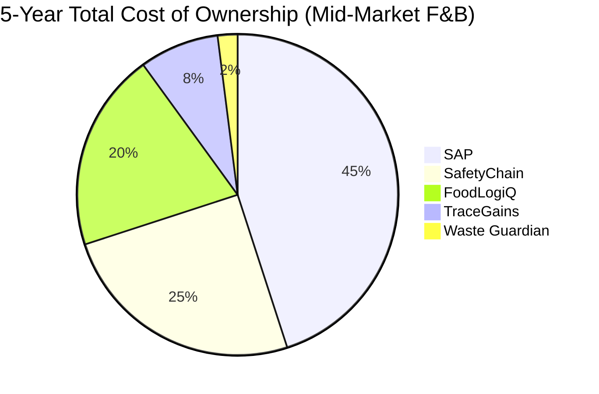

#### 3. Industry Specialization

| Aspect | Generic ERP | Waste Guardian |
|--------|-------------|----------------|
| Waste taxonomy | Custom build required | Pre-built F&B categories |
| Regulatory templates | Generic | PNRS, ISO 14001 ready |
| KPI benchmarks | None | Industry standards built-in |
| Best practices | Consulting required | Embedded workflows |

#### 4. Technology Advantage

| Feature | Traditional Solutions | Waste Guardian (Mendix) |
|---------|---------------------|------------------------|
| Updates | Quarterly releases | Continuous deployment |
| Customization | Code changes required | Visual configuration |
| Mobile | Separate app needed | Responsive by default |
| Integration | Custom development | Pre-built connectors |
| AI/ML | Add-on products | Native integration |

---

## 7. Competitive Response Scenarios

### 7.1 If SAP/Oracle Adds Waste Features

**Likely Response:**
- Bundle waste features into sustainability modules
- Target existing customers

**Waste Guardian Counter:**
- Emphasize speed and specialization
- Target SAP/Oracle customers who need rapid deployment
- Offer complementary best-of-breed solution

### 7.2 If SafetyChain Lowers Prices

**Likely Response:**
- Launch "Essentials" tier
- Focus on core compliance

**Waste Guardian Counter:**
- Highlight modern UX and Mendix ecosystem
- Emphasize customization capabilities
- Position as next-generation alternative

### 7.3 If Microsoft Targets F&B

**Likely Response:**
- Launch Power Platform F&B templates
- Leverage Office 365 integration

**Waste Guardian Counter:**
- Emphasize industrial IoT capabilities
- Highlight Mendix's enterprise strength
- Focus on manufacturing-specific features

---

## 8. Market Entry Strategy

### 8.1 Target Segment Prioritization

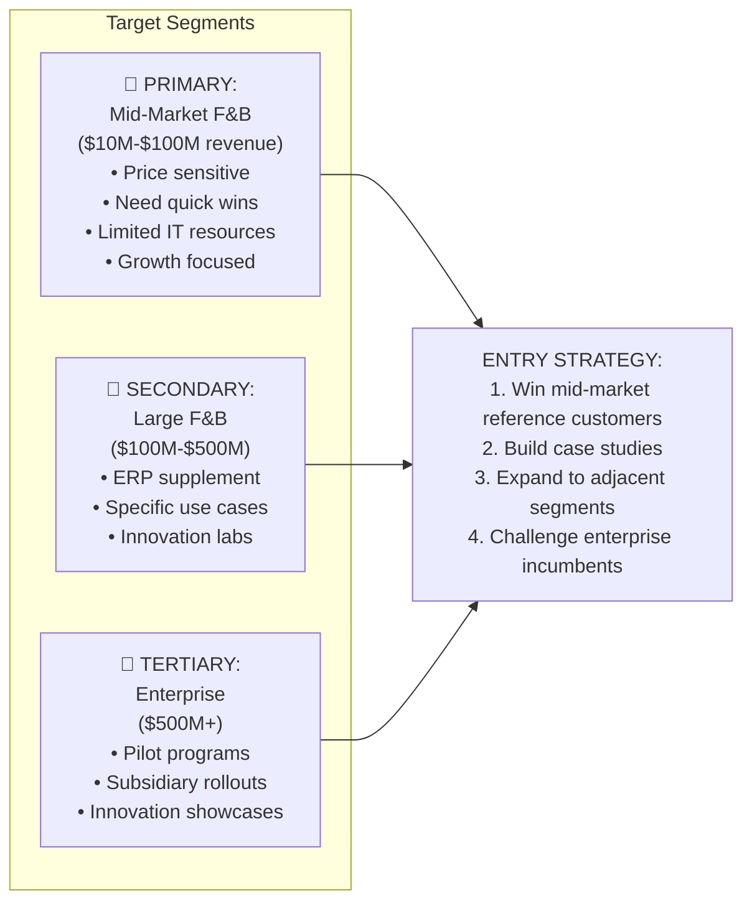

### 8.2 Competitive Tactics

| Situation | Tactic | Message |
|-----------|--------|---------|
| vs. SAP/Oracle | Flank attack | "Get waste management running in weeks, not years" |
| vs. SafetyChain | Price differentiation | "80% of functionality at 30% of the cost" |
| vs. Manual/Excel | Education | "ROI in 3 months through waste reduction" |
| vs. Power Platform | Capability | "Industrial-grade with consumer ease" |
| Greenfield | Vision | "Start your digital transformation journey here" |

---

## 9. Conclusion

The F&B waste management software market presents a significant opportunity for Waste Guardian due to:

1. **Fragmented Competition**: No dominant player in mid-market F&B waste
2. **Legacy Incumbents**: Slow, expensive solutions leave gaps
3. **Manual Majority**: 95% still using inefficient methods
4. **Regulatory Pressure**: Increasing compliance requirements
5. **Technology Shift**: Low-code enabling rapid, affordable solutions

**Waste Guardian's winning formula:**
- ✅ **Speed**: 2-6 week deployment vs. 3-18 months
- ✅ **Cost**: 1/3 to 1/10 the cost of alternatives
- ✅ **Specialization**: Purpose-built for F&B waste
- ✅ **Modern Stack**: Mendix + AI + IoT + Mobile
- ✅ **Flexibility**: Customizable without coding

The competitive landscape favors a nimble, specialized solution that can deliver rapid ROI while scaling to meet enterprise requirements through the Mendix platform.

---

*Document Version: 1.0*
*Last Updated: April 2026*
*Sources: Gartner Magic Quadrant, Company websites, Industry reports, Analyst estimates*
