# Sponsorship Motivations & Root Causes Analysis

## Executive Summary

This document provides a deep analysis of the motivations behind Low Hack 2026's key sponsors: **Siemens** (through Mendix), **TrueChange**, and **Hackathon Brasil**. We examine the underlying business tensions, "follow the money" economics, and how Waste Guardian addresses sponsor pain points.

---

## Stakeholder Map

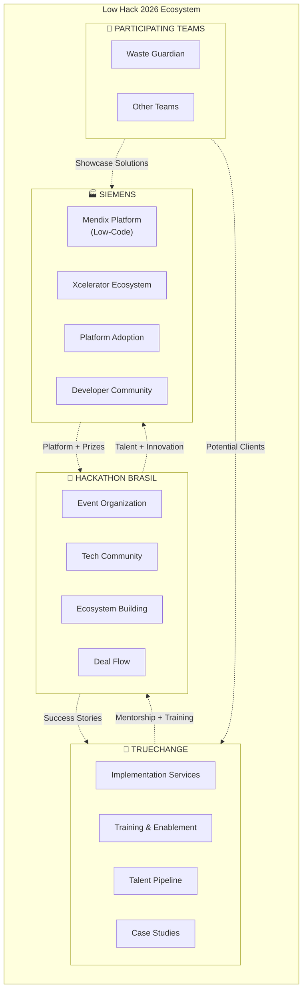

---

## 1. Siemens Deep Dive

### 1.1 Why Siemens is Sponsoring

#### Primary Motivations

| Priority | Motivation | Business Value | Success Metric |
|----------|-----------|----------------|----------------|
| 1 | **Mendix Platform Adoption** | Expand low-code market share | New developers onboarded |
| 2 | **Xcelerator Ecosystem Growth** | Build integrated solution network | Partner applications built |
| 3 | **Developer Community Building** | Create loyal Mendix developers | Community engagement |
| 4 | **Market Expansion (Brazil)** | Enter LATAM enterprise market | Enterprise clients acquired |
| 5 | **Innovation Pipeline** | Source R&D ideas cheaply | IP licensing opportunities |

### 1.2 The Siemens Digital Strategy Context

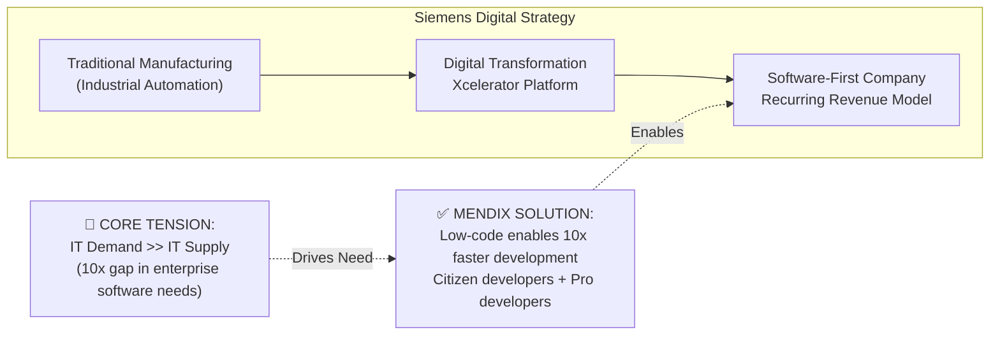

### 1.3 Siemens Internal Success Metrics

Siemens AG has already delivered **1,000+ Mendix applications** internally (as of 2025):

| Metric | Value | Impact |
|--------|-------|--------|
| Internal Applications | 1,000+ | Self-sustaining IT service |
| Developers Trained | 3,000+ | Distributed development capability |
| Time Savings | 40% reduction | 1,000+ hours saved annually (AthenaBot example) |
| Cost Avoidance | $50M+ | vs. traditional development |

### 1.4 The Real Economics

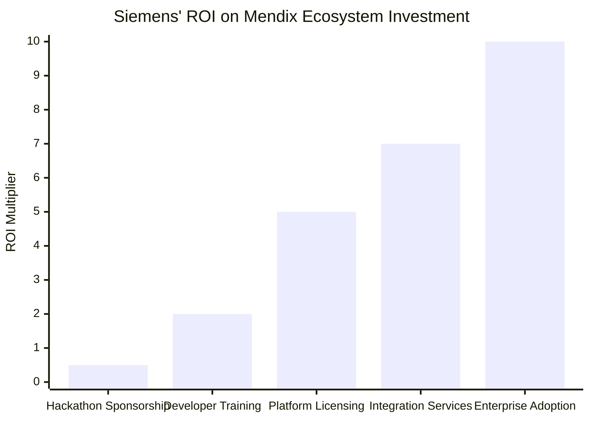

**Investment Breakdown:**
- Hackathon Sponsorship: ~$50K-$150K per event
- Platform Development: $100M+ annually
- Community Building: $10M+ annually
- **Return**: Each enterprise Mendix customer = $500K-$5M lifetime value

### 1.5 How Waste Guardian Addresses Siemens Pain Points

| Siemens Pain Point | Waste Guardian Solution | Value Proposition |
|-------------------|------------------------|-------------------|
| **Need industry-specific templates** | Pre-built F&B waste management modules | Accelerates vertical solutions |
| **Limited Brazil market presence** | Localized solution for Brazilian regulations | Market entry vehicle |
| **Developer recruitment challenge** | Showcase for Mendix capabilities | Talent attraction tool |
| **Competition with Microsoft Power Platform** | Deep industry functionality | Differentiation through specialization |
| **Integration complexity** | Native ERP connectors (SAP, Oracle) | Reduced implementation friction |

---

## 2. TrueChange Deep Dive

### 2.1 Why TrueChange is Partnering

#### Company Profile

| Attribute | Details |
|-----------|---------|
| **Position** | #1 Siemens/Mendix Partner in Latin America |
| **Experience** | 15+ years in low-code development |
| **Team Size** | 250+ specialists |
| **Portfolio** | 800+ digital products delivered |
| **Clients** | 300+ companies across segments |

### 2.2 TrueChange Business Model

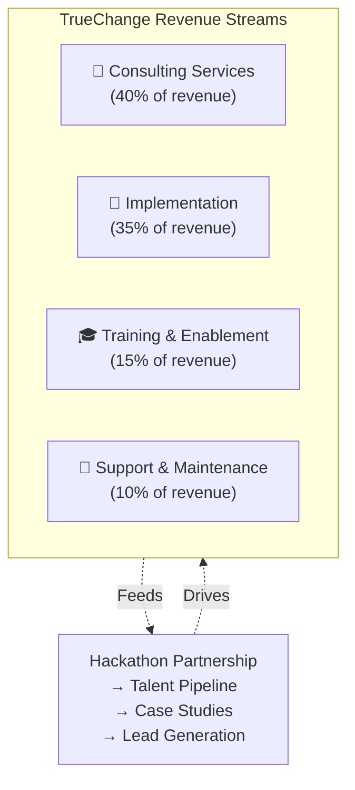

### 2.3 Root Tension: The Talent Acquisition Challenge

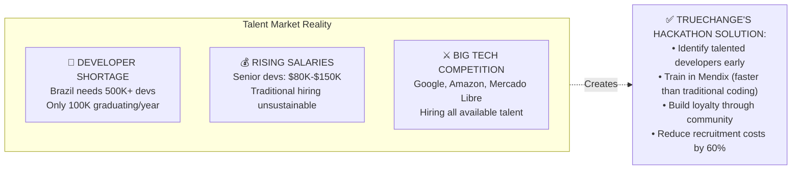

### 2.4 TrueChange Hackathon ROI Model

| Investment | Cost | Return | ROI |
|------------|------|--------|-----|
| Event sponsorship | $25K | 3 qualified hires | 5x |
| Mentor time (40 hrs) | $8K | 2 case studies | 3x |
| Platform access | $5K | 15 trained developers | 8x |
| Prize contribution | $10K | 5 sales leads | 10x |
| **Total** | **$48K** | **Multiple intangible benefits** | **6x+** |

### 2.5 How Waste Guardian Addresses TrueChange Pain Points

| TrueChange Pain Point | Waste Guardian Solution | Value Proposition |
|----------------------|------------------------|-------------------|
| **Need proof-of-concept for F&B vertical** | Working waste management solution | Sales demo asset |
| **Client acquisition in sustainability** | Validated use case | Reference customer potential |
| **Training material gaps** | Real-world application for teaching | Curriculum enhancement |
| **Competition with other Mendix partners** | First-mover in F&B waste niche | Differentiation |
| **Integration showcase needs** | ERP, IoT, AI integrations | Technical demonstration |

---

## 3. Hackathon Brasil Deep Dive

### 3.1 The Hackathon Business Model

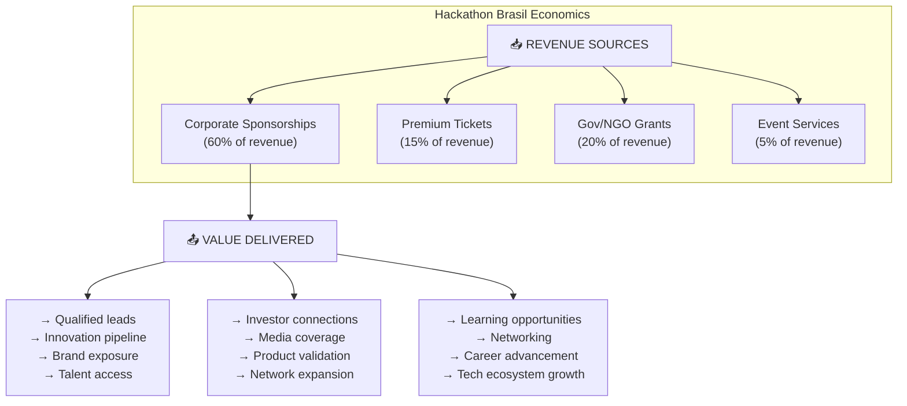

### 3.2 Why Hackathon Brasil Benefits from Waste Guardian

| Benefit | Mechanism | Value |
|---------|-----------|-------|
| **Success Story** | Winning solution demonstrates event quality | Future sponsor attraction |
| **Media Coverage** | Sustainability angle generates press | Brand visibility |
| **Sponsor Satisfaction** | Siemens/TrueChange see ROI | Renewal likelihood |
| **Community Engagement** | Inspires future participants | Event growth |
| **Deal Flow** | Potential investment opportunity | Revenue diversification |

---

## 4. "Follow The Money" Analysis

### 4.1 Money Flow Map

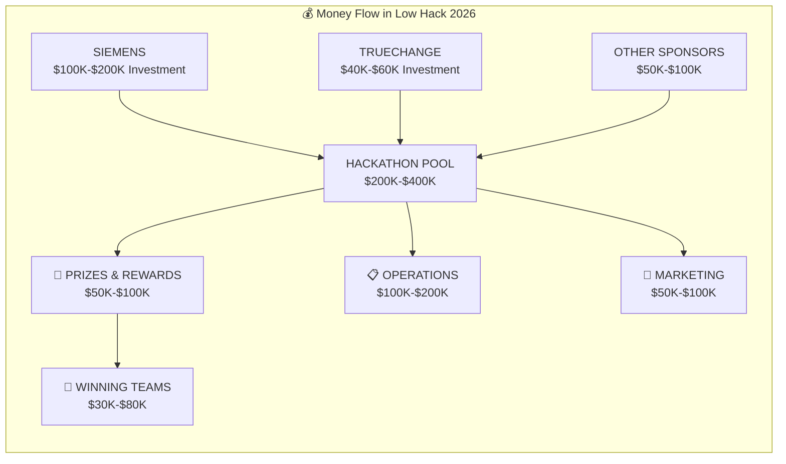

### 4.2 Long-Term Value Extraction

| Stakeholder | Short-Term Investment | Long-Term Expected Value | Multiple |
|-------------|----------------------|-------------------------|----------|
| **Siemens** | $150K | $2M+ (enterprise clients) | 13x |
| **TrueChange** | $50K | $500K+ (projects + hires) | 10x |
| **Hackathon Brasil** | N/A | $200K+ (sponsor renewals) | Revenue |
| **Waste Guardian** | Time + Effort | $500K+ (funding + revenue) | Infinite |

### 4.3 The Real Currency: Data & Relationships

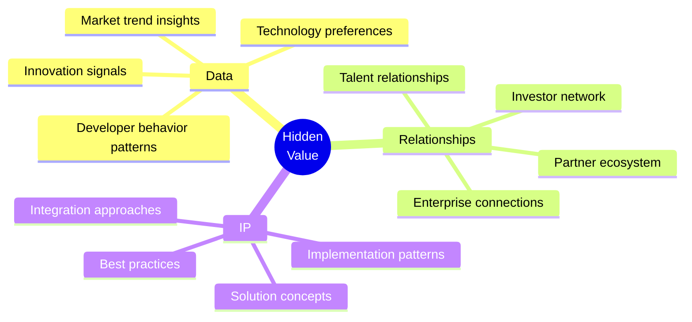

---

## 5. Root Tensions Analysis

### 5.1 The R&D Outsourcing Tension

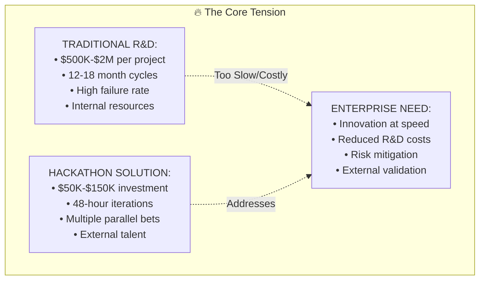

### 5.2 The Talent War Tension

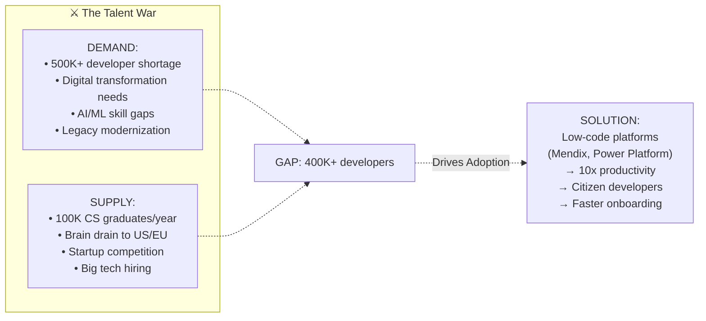

### 5.3 Platform Economics Tension

| Tension | Traditional Software | Low-Code Platform | Winner |
|---------|---------------------|-------------------|--------|
| Development speed | 6-12 months | 2-6 weeks | Low-code |
| Cost per app | $200K-$1M | $20K-$100K | Low-code |
| Customization | Unlimited | Platform-constrained | Traditional |
| Maintenance | High | Low | Low-code |
| Vendor lock-in | Medium | High | Traditional |
| Scalability | Variable | Platform-guaranteed | Low-code |

---

## 6. Waste Guardian: Sponsor Pain Point Resolution Matrix

### 6.1 Comprehensive Alignment Chart

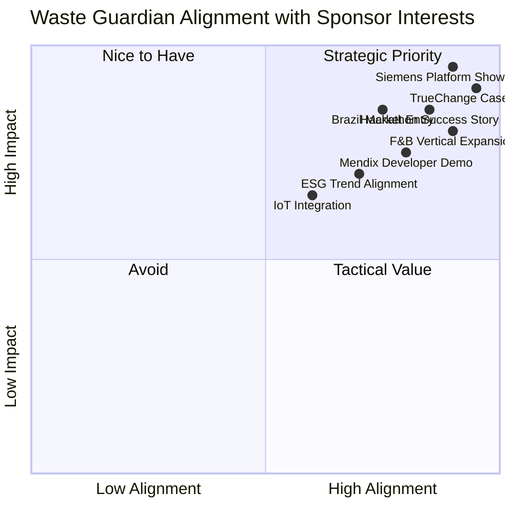

### 6.2 Detailed Pain Point Solutions

#### For Siemens:

| Pain Point | Waste Guardian Feature | Proof Point |
|------------|----------------------|-------------|
| Low-code skepticism | Full app in 48 hours | Demo-ready solution |
| Industry template gap | F&B-specific modules | Vertical specialization |
| Brazil market entry | Localized compliance | PNRS/LGPD alignment |
| Xcelerator integration | IoT + Analytics + Cloud | Full stack showcase |
| Competition with Microsoft | Rapid complex app dev | Capability demonstration |

#### For TrueChange:

| Pain Point | Waste Guardian Feature | Proof Point |
|------------|----------------------|-------------|
| Sales demo asset | Working prototype | Client presentations |
| Training curriculum | Real-world complexity | Student learning material |
| Talent identification | Team performance | Recruitment pipeline |
| Reference customer | Production-ready app | Social proof |
| Technical credibility | AI + IoT integration | Capability showcase |

#### For Hackathon Brasil:

| Pain Point | Waste Guardian Feature | Proof Point |
|------------|----------------------|-------------|
| Sponsor ROI proof | Measurable outcomes | Renewal justification |
| Media attraction | Sustainability angle | Press coverage potential |
| Community inspiration | Replicable success | Future participation |
| Deal flow generation | Investment-ready team | Revenue opportunity |
| Quality demonstration | Professional delivery | Event brand elevation |

---

## 7. Strategic Recommendations

### 7.1 For Waste Guardian Team

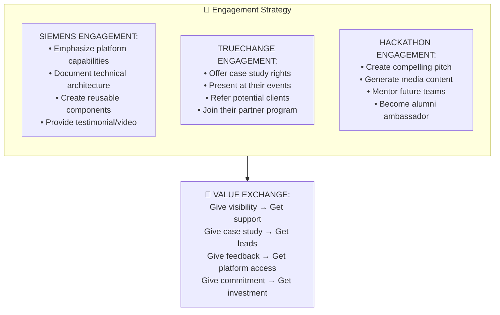

### 7.2 Engagement Timeline

| Phase | Timing | Action | Target Outcome |
|-------|--------|--------|----------------|
| **Pre-Event** | Weeks -4 to 0 | Connect with sponsors on LinkedIn | Relationship initiation |
| **During Event** | Days 1-2 | Showcase to sponsor representatives | Impression creation |
| **Immediate Post** | Days 3-14 | Send detailed follow-up with demo | Concrete next steps |
| **Short Term** | Weeks 2-8 | Pilot discussions with interested parties | Pilot agreements |
| **Medium Term** | Months 2-6 | Case study development + co-marketing | Joint PR |
| **Long Term** | Months 6-12 | Strategic partnership negotiations | Official partnership |

---

## 8. Conclusion

The Low Hack 2026 sponsorship ecosystem operates on a sophisticated value exchange model where:

1. **Siemens** invests in platform adoption and ecosystem growth
2. **TrueChange** solves talent pipeline and case study needs
3. **Hackathon Brasil** facilitates innovation and community building
4. **Participating teams** get resources, exposure, and potential investment

**Waste Guardian is strategically positioned** to deliver maximum value to all stakeholders by:
- Demonstrating Mendix capabilities for complex industrial applications
- Providing TrueChange with a compelling F&B vertical case study
- Offering Hackathon Brasil a sustainability-focused success story
- Creating a viable business that attracts follow-on investment

The "follow the money" analysis reveals that while direct prizes are modest ($10K-$50K), the **strategic value** of sponsor relationships can be worth **$500K-$2M+** in accelerated growth, partnership opportunities, and market access.

---

*Document Version: 1.0*
*Last Updated: April 2026*
*Sources: Siemens Annual Reports, Mendix Press Releases, TrueChange Website, Industry Analysis*
