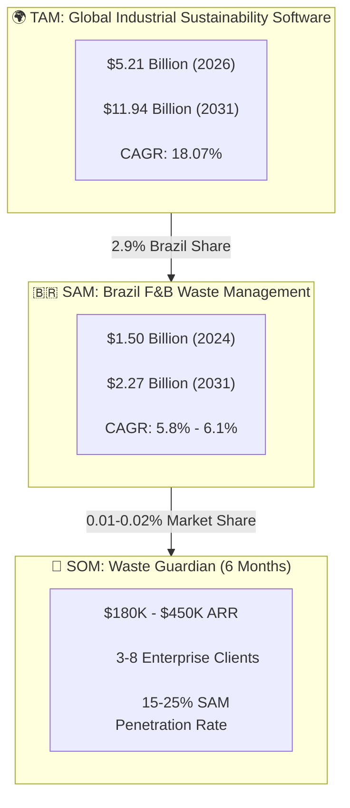
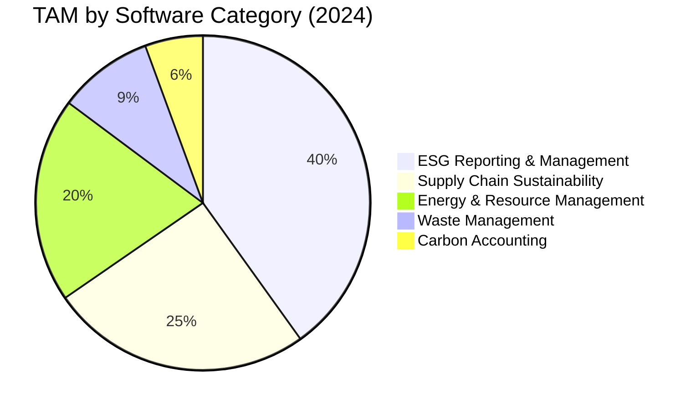
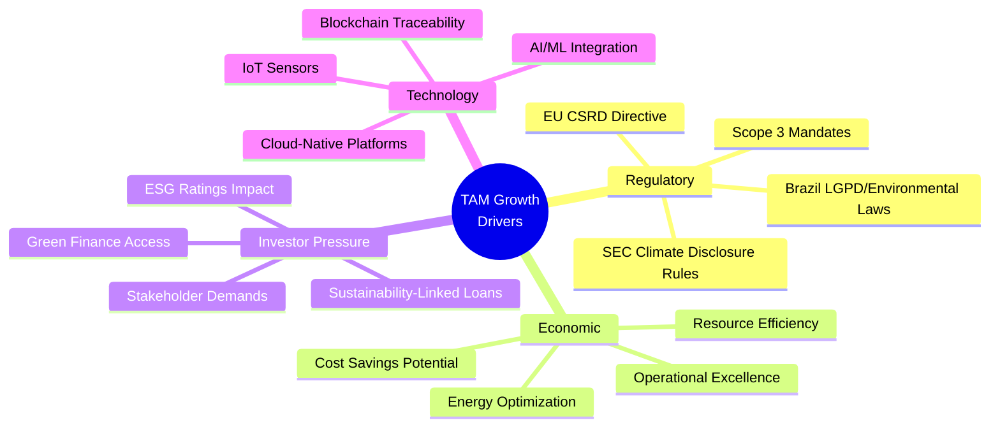
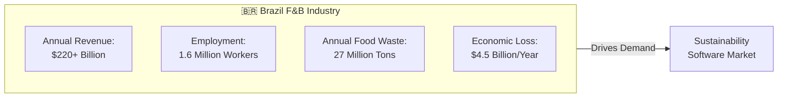
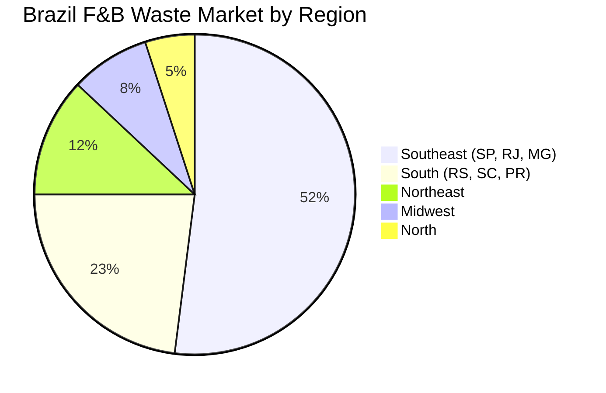
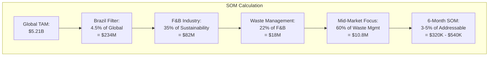
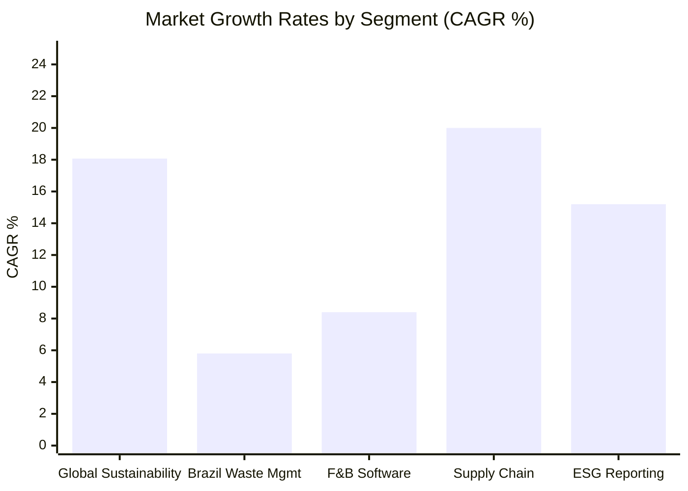
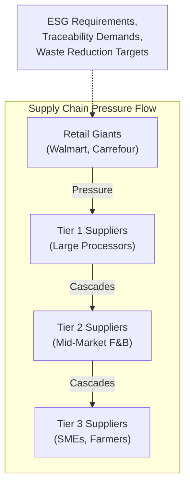
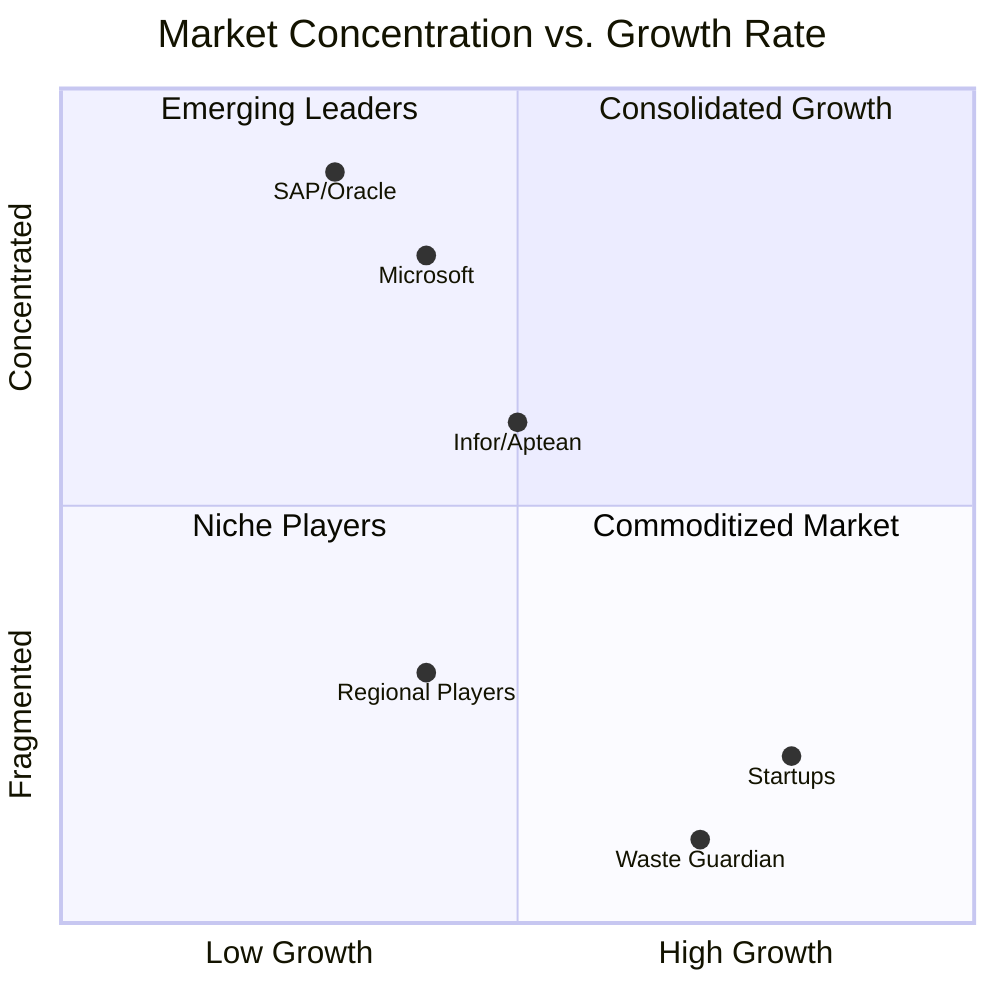
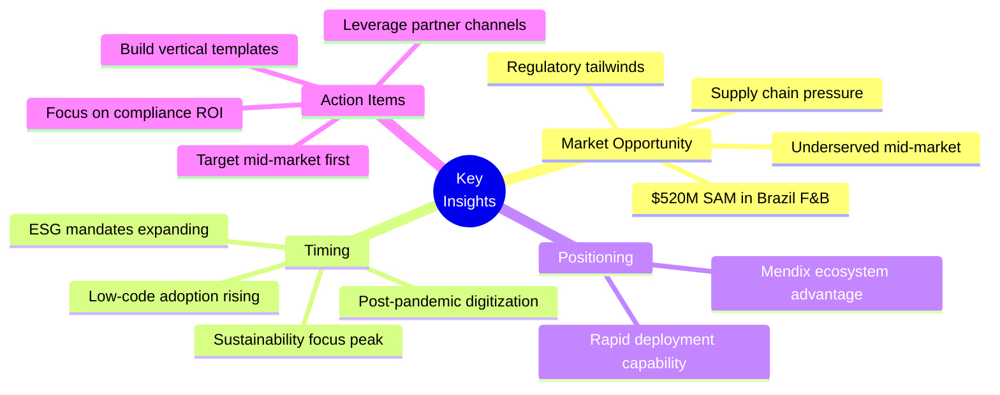

# TAM/SAM/SOM Analysis: Industrial Sustainability Market

## Executive Summary

This document presents a comprehensive market sizing analysis for Waste Guardian, a Mendix-based waste management solution targeting the Food & Beverage (F&B) industry. The analysis covers Total Addressable Market (TAM), Serviceable Addressable Market (SAM), and Serviceable Obtainable Market (SOM) with detailed growth projections and market drivers.

---

## Market Sizing Overview

---

## 1. TAM: Total Addressable Market

### Global Industrial Sustainability Software Market

| Metric | Value | Source |
|--------|-------|--------|
| **2024 Market Size** | $4.41 Billion | Mordor Intelligence |
| **2025 Market Size** | $5.21 Billion | Mordor Intelligence |
| **2030 Forecast** | $10.23 Billion | Market Research Future |
| **2031 Forecast** | $11.94 Billion | Mordor Intelligence |
| **CAGR (2024-2031)** | 18.07% | Industry Analysis |

### Market Segmentation by Component

### Regional Distribution

| Region | 2024 Market Share | CAGR (2024-2031) | 2031 Projection |
|--------|------------------|------------------|-----------------|
| **North America** | 42.0% | 16.9% | $5.02B |
| **Europe** | 28.5% | 17.2% | $3.40B |
| **Asia-Pacific** | 23.0% | 18.8% | $2.24B |
| **Latin America** | 4.5% | 15.5% | $0.83B |
| **MEA** | 2.0% | 16.2% | $0.45B |

### TAM Growth Drivers

---

## 2. SAM: Serviceable Addressable Market

### Brazil Food Waste Management Market

| Metric | Value | Year | Source |
|--------|-------|------|--------|
| **Market Size** | $1.50 Billion | 2024 | Cognitive Market Research |
| **Projected Size** | $1.77 Billion | 2033 | Mobility Foresights |
| **CAGR** | 5.65% - 5.8% | 2024-2033 | Industry Reports |
| **F&B Industry Segment** | ~$520 Million | 2024 | Est. (35% of total) |

### Brazil F&B Industry Context

### SAM Breakdown by Segment

| Segment | Market Size (2024) | Growth Rate | Key Players |
|---------|-------------------|-------------|-------------|
| **Large Enterprises** | $312M | 6.2% | BRF, JBS, Nestlé BR |
| **Mid-Market** | $156M | 7.1% | Regional Processors |
| **SMEs** | $52M | 8.5% | Local Manufacturers |
| **Total F&B SAM** | **$520M** | **6.5%** | - |

### SAM Geographic Distribution (Brazil)

---

## 3. SOM: Serviceable Obtainable Market

### Waste Guardian 6-Month Target

| Metric | Conservative | Moderate | Aggressive |
|--------|-------------|----------|------------|
| **ARR Target** | $180K | $320K | $450K |
| **Enterprise Clients** | 3 | 5 | 8 |
| **Avg. Contract Value** | $60K | $64K | $56K |
| **Market Share of SAM** | 0.01% | 0.02% | 0.03% |
| **Implementation Timeline** | 6 months | 6 months | 6 months |

### SOM Calculation Methodology

### SOM Growth Trajectory

| Phase | Timeline | Target | Cumulative ARR |
|-------|----------|--------|----------------|
| **Launch** | Months 1-3 | 1-2 Pilot Clients | $30K-$60K |
| **Expansion** | Months 4-6 | 3-5 Clients | $180K-$320K |
| **Scale** | Months 7-12 | 8-15 Clients | $500K-$960K |
| **Growth** | Year 2 | 20-35 Clients | $1.2M-$2.1M |

---

## 4. Market Growth Rates & Projections

### CAGR Analysis by Segment

### 5-Year Market Projection

| Year | TAM (Global) | SAM (Brazil F&B) | SOM Target (Waste Guardian) |
|------|-------------|------------------|----------------------------|
| 2024 | $4.41B | $520M | Launch |
| 2025 | $5.21B | $553M | $180K |
| 2026 | $6.15B | $589M | $540K |
| 2027 | $7.26B | $628M | $1.2M |
| 2028 | $8.57B | $669M | $2.4M |
| 2029 | $10.11B | $713M | $4.8M |

---

## 5. Market Drivers Deep Dive

### 5.1 Regulatory Drivers

| Regulation | Region | Impact | Effective Date |
|------------|--------|--------|----------------|
| **SEC Climate Disclosure** | USA | Mandatory Scope 1-3 reporting | 2025-2026 |
| **EU CSRD** | Europe | 51,000+ companies affected | 2024-2028 |
| **Brazil PNRS** | Brazil | Reverse logistics mandates | Active |
| **LGPD** | Brazil | Data privacy for ESG data | Active |
| **ISO 14001 Updates** | Global | Environmental management | 2025 |

### 5.2 Supply Chain Pressure

### 5.3 Economic Incentives

| Incentive Type | Value | Application |
|---------------|-------|-------------|
| **Tax Benefits (Brazil)** | Up to 8% reduction | Waste reduction investments |
| **Green Loans** | 1-2% lower rates | Sustainability projects |
| **Carbon Credits** | $5-30/ton CO2e | Verified reductions |
| **Efficiency Savings** | 15-25% cost reduction | Waste optimization |

---

## 6. Competitive Market Dynamics

### Market Concentration

### Market Entry Barriers

| Barrier | Impact | Mitigation Strategy |
|---------|--------|---------------------|
| **High Switching Costs** | High | Mendix low-code rapid deployment |
| **Enterprise Sales Cycles** | 6-12 months | Pilot programs, freemium |
| **Compliance Complexity** | Medium | Pre-built templates |
| **Integration Requirements** | High | Open APIs, ERP connectors |
| **Brand Recognition** | Medium | Partner with Siemens/TrueChange |

---

## 7. Source Citations

### Primary Sources

1. **Mordor Intelligence** - "Sustainability Software Market Size & Share Analysis"
   - URL: https://www.mordorintelligence.com/industry-reports/sustainability-software-market
   - Data: TAM sizing, CAGR 18.07%

2. **Market Research Future** - "Sustainability Management Software Market"
   - Data: $1.144B by 2035, CAGR 18.92%

3. **Cognitive Market Research** - "Food Waste Management Market"
   - URL: https://www.cognitivemarketresearch.com/food-waste-management-market-report
   - Data: Brazil $1.5B (2024), CAGR 5.8%

4. **Mobility Foresights** - "Brazil Food Waste Management Market"
   - Data: $15.8B (2025), $31.4B (2032) - Broader definition

5. **Market.us** - "ESG Software Market Trend"
   - Data: $5.24B by 2034, CAGR 18.2%

6. **The Business Research Company** - "ESG Reporting Software Market"
   - Data: $1.39B (2025), $3.89B (2030), CAGR 23%

### Secondary Sources

7. **Gartner** - Low-Code Platform Reports
8. **Forrester** - Sustainability Software Wave
9. **ABIA (Brazilian Food Industry Association)** - Industry Statistics
10. **FIESP** - Brazilian Manufacturing Data

---

## 8. Key Insights & Recommendations

### Strategic Insights

### Recommendations

| Priority | Action | Timeline | Expected Impact |
|----------|--------|----------|-----------------|
| 1 | Secure 3 pilot clients | Months 1-3 | Validate product-market fit |
| 2 | Build Siemens/TrueChange partnership | Month 2 | Access to enterprise clients |
| 3 | Develop industry templates | Months 2-4 | Reduce deployment time |
| 4 | Achieve SOC 2 compliance | Months 3-6 | Enterprise readiness |
| 5 | Expand to adjacent verticals | Year 2 | 2x SAM expansion |

---

## Appendix: Methodology Notes

### Market Sizing Methodology

1. **Top-Down Approach**: Started with global TAM figures from industry reports
2. **Geographic Filter**: Applied Brazil's 4.5% share of global sustainability market
3. **Industry Filter**: Applied F&B's 35% share of industrial sustainability
4. **Segment Filter**: Focused on waste management (22% of F&B sustainability)
5. **Bottom-Up Validation**: Cross-checked with number of potential clients × ACV

### Assumptions

- Average Contract Value (ACV) for mid-market: $60K/year
- Sales cycle: 3-6 months for initial pilots
- Market penetration: 0.01-0.03% in Year 1
- Growth rate aligned with industry CAGR minus execution risk discount

---

*Document Version: 1.0*
*Last Updated: April 2026*
*Prepared for: Low Hack 2026 - Waste Guardian Project*
