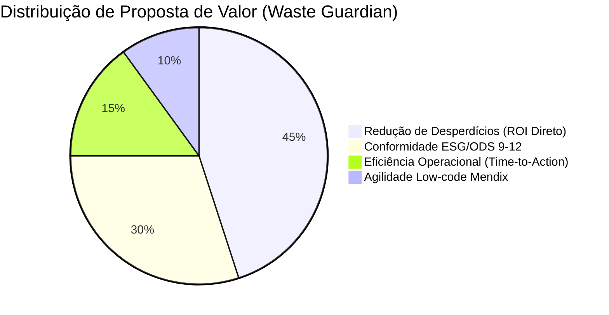
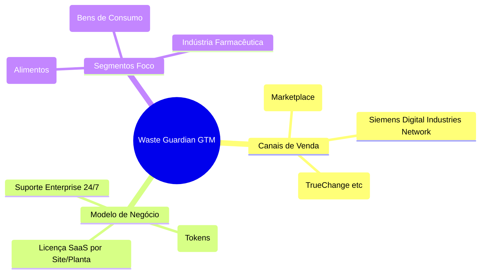

# Lean Canvas - Produto: Waste Guardian (Food & Beverage)

A mentalidade para defender esse modelo no Low Hack é a viabilidade Enterprise. Não estamos vendendo um aplicativo, vendemos "Software de Gestão ODS e Eficiência Produtiva" para o maquinário industrial nativo.

## 1. O Problema

- Desperdício silencioso: Válvulas mal calibradas, lotes vencendo em trânsito interno, falhas humanas leves gerando paradas (downtimes).
- Análise Tardia: Apenas no fim do mês o Supervisor nota os quilogramas reais de Polpa/Insumos que foram para o esgoto (ODS 12 e Custo Operacional sangrando).
- Ação Inerte: Relatórios geram culpa, não soluções prontas para hoje à tarde.

## 2. Segmento de Clientes

- **Target Direto:** Gerentes e Diretores de Operações Industriais (Food & Beverage e Bens de Consumo Rápido - FMCG).
- **Early Adopters:** Empresas de médio-grande porte pressionadas pelo *ESG* (Enviromental, Social, and Governance) para zerar suas pegadas de carbono em 5 anos. Fábricas que já tenham alguma esteira Siemens Mendix/Edge de IoT e buscam inteligência rápida de workflow ("Easy Win").

> Identifique micro-perdas invisíveis agora, execute planos mitigatórios sugeridos pela OpenAI no mesmo minuto. Transforme prejuízo crônico em compliance com a ODS 9 através de um Copiloto Inteligente Mendix.

## 4. Solução Ponto a Ponto (A Ferramenta)

1. Ingestão Mendix PWA das anomalias nas linhas de base de fábrica.
2. Cross-data assíncrono com a OpenAI (Modelo customizado focado num papel de "Técnico Plantista").
3. Ranking das 3 saídas mitigatórias mais fáceis, baseadas na temperatura do setup e volume preditivo.

## 5. Canais (Go-To-Market)

1. **App Store do Mendix (Marketplace):** Estar inserível como um Add-on de Fábricas para Mendix Clouds privadas de Indústrias.
2. Integração White-label e parceria estratégica B2B (Mendix Partner Ecosystem & TrueChange/Siemens Network).

## 6. Modelagem de Receitas (Monetização ODS)

**Modelo Enterprise SaaS - Licenciamento Base Site**
O Waste Guardian será tarifado por **"Node Industrial" (Planta/Site)**. Venda B2B Clássica sem limites de usuários por fábrica no início.

- Base Tier: US$ 599/Mês por Site.
- Escalonabilidade em Token Usage: Pacotes adicionais de +US$ 100/mo a cada 10K requisições do Copiloto acima da meta standard ODS, financiando a chamada "OpenAI Payload" a fundo perdido para nós.

## 7. Estrutura de Custos (Despesas Variables vs Fixed)

- **Custo Principal Variável** (COGS): Chamadas REST OpenAI GPT-4o Mini por query (`$0.0001` - virtualmente zero, margem gigante).
- Custo Fixo de Infraestrutura: Licença Mendix Enterprise Multi-tenant (Rateio Nuvem + RDS SQL Database para Persistência ODS e Compliance Regulatório).
- Manutenção: Atualização do Prompts de Defesa Industrial frente às novidades mercadológicas.

## 8. Métricas Chave

1. **Queda Percentual (MoM)** no volume total de Desperdício Registrado em Quilos vs Volume Produzido (`ODS Impact Metric`).
2. Média de tempo em minutos para a Resolução Aplicada e o Fechamento do Card.
3. Rápida conversão Churn->Zero em POCs gratuitas de 14 Dias instaladas na nuvem das fábricas parceiras Siemens.

## 9. Vantagem Injusta

Plataformizado nativamente no sistema Mendix. Nossa arquitetura reaproveita o SSO (*Single Sign-On*) do chão de fábrica Mendix preexistente nos clientes pesados e o LLM não detém nossos domínios de Dados — somos apenas a ponte inteligente entre a anomalia e a solução baseada em bilhões de parâmetros gerais cruzada com regras de corte do cliente localmente via Mendix Logic Actions.
