# Low Hack 2026 - Estratégia Completa V2 (Overdrive Edition)

> **Documento Gerado Automaticamente**: Compilação massiva de toda a engenharia, negócios, scripts executáveis e o Dossiê Estratégico revisado para a Siemens/Mendix 2026.

---

## 0. DASHBOARD DE CONTROLE (Timeline & Entregáveis)

*Arquivo de origem: `../note-index.md`*

---
tags:
  - hackathon
  - siemens
  - mendix
  - genai
status: in_progress
priority: p1
event_date: "2026"
---

# 🎯 Note Index: Low Hack 2026 (Siemens / Mendix)

> **Resumo:** Painel de controle oficial e Repositório de Inteligência "Overdrive" para o Low Hack 2026.

## 📌 Metadados da Competição

- **Plataforma:** Hackathon Brasil / Siemens Mendix
- **Tecnologias Core:** Mendix (Low-Code), OpenAI (GenAI)
- **Desafio/Tese:** *Waste Guardian* - Copiloto ODS 9/12 B2B (F&B Industry).
- **Status Atual:** **PRONTO PARA COMBATE (Overdrive Phase Complete)**

---

### 🗓️ Timeline & Milestones Estratégicos

Cronometragem tática dividida em fases de inteligência, preparação e execução (18 a 19 de Abril).

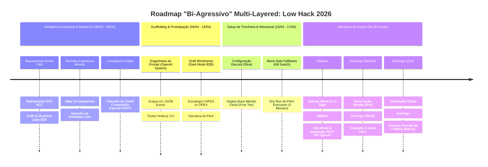

#### 📌 Deadlines Oficiais (Edital)

| Evento | Data/Hora | Status |
| :--- | :--- | :--- |
| **Abertura de Inscrições** | Já Aberta | ✅ |
| **Setup de Equipes & Discord** | 15/04 - 17/04 | ⏳ |
| **Lançamento do Desafio (Live)** | 18/04 (09:00) | ⏳ |
| **Encerramento & Submissão** | 19/04 (21:00) | ⏳ |
| **Anúncio de Finalistas** | 22/04 (Previsão) | ⏳ |

#### 📊 Gráfico de Execução (Gantt)

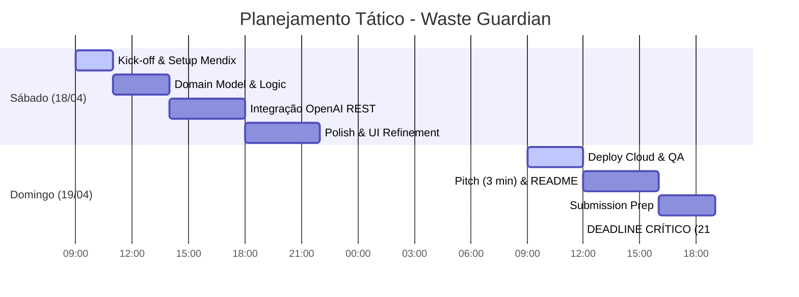

- [x] **Fase 1: Inteligência Estratégica & Business (COMPLETO)**
  - [x] Inscrição garantida no Hackathon Brasil.
  - [x] Compilação do Business Case B2B (Dores Indústria F&B e ODS Siemens).
  - [x] Estabelecer Modelagem Financeira SaaS / ISV Royalties.

- [ ] **Fase 2: Harmonização & Scaffolding (15/04 a 17/04)**
  - [ ] Acessar Discord Oficial (15/04 às 17:00).
  - [ ] Travar Data Model do Mendix e fluxos do Atlas UI.
  - [ ] Consolidar Engenharia de Prompt no System Content da OpenAI.

- [ ] **Fase 3: Maratona Mendix Core (18/04 e 19/04)**
  - [ ] `18/04 09:00 - 14:00`: Estrutura Base Mendix (Domain Model + Telas ATLAS).
  - [ ] `18/04 14:00 - 18:00`: Ponto de Inflexão (Integrar OpenAI REST API).
  - [ ] `19/04 09:00 - 12:00`: Deploy na Mendix Cloud e QA de Dados (Scrubbing).
  - [ ] `19/04 12:00 - 16:00`: Gravação do Pitch Nível Executivo.
  - [ ] `19/04 19:00 - 21:00`: Submissão Oficial.

---

## ✅ Requisitos do Edital (Checklist Inegociável)

Para garantir pontuação integral pela banca técnica Siemens:

- [ ] **GenAI Compulsório:** O App deve usar *obrigatória e efetivamente* IA Generativa (Uso primário no Waste Guardian via API OpenAI).
- [ ] **Plataforma Exclusiva:** 100% desenvolvido usando e rodando no **Mendix (Free Tier Cloud)**. Link deve ser público.
- [ ] **Complexidade Mínima de Tela:** O App deve possuir **três telas navegáveis**.
- [ ] **Persistência de Dados (CRUD):** É preciso ler e salvar dados na base Mendix (Ex: submeter um *Evento Desperdício*, salvar o *Plano da IA*).
- [ ] **Lógica Mendix Ativa:** Pelo menos 1 Microflow ou Nanoflow com lógica implementada rodando no fluxo.
- [ ] **Tempo de Apresentação:** Pitch cronometrado de até **3 Minutos**. Estourar o limite desclassifica ou remove pontos vitais.

---

## 📦 Entrega Final & Checkpoint de Arquivos

Objetivos obrigatórios para submissão oficial:

| Entregável | Formato | Status | Responsável |
| :--- | :--- | :--- | :--- |
| **PWA Mendix (Live Link)** | URL Mendix Cloud | ⏳ | Tech Owner |
| **Pitch Video (3 min)** | YouTube/Vimeo Link | ⏳ | Pitch Owner |
| **Manual de GenAI (Rest API)** | PDF/Markdown | ⏳ | AI Lead |
| **README Strategic Dossiê** | Mendix Project App | ⏳ | PO |

---

## 🔗 Atalhos de Inteligência (Trincheira)

- [**00 - Playbook Tático (Mendix Core)**](01-playbook-tatica.md)
- [**01 - Roteiro Pitch (3 Minutos)**](pitch/roteiro-video-3min.md)
- [**02 - Q&A Defense Playbook**](pitch/02-qna-defense-playbook.md)
- [**03 - Econometria & Sponsor Strategy**](business/03-sponsor-econometrics.md)
- [**04 - Mega Dossiê Consolidado**](LowHack_2026_Full_Strategy.md)


\pagebreak

---

## 1. O DOSSIÊ MESTRE (Single Source of Truth)

*Arquivo de origem: `Waste_Guardian_Master_Compendium.md`*

# DOSSIÊ ESTRATÉGICO MASTER: WASTE GUARDIAN 🏭
**Hackathon Low Hack 2026 (Siemens / Mendix / Hackathon Brasil)**
*Confidencial - Material Restrito da Equipe*

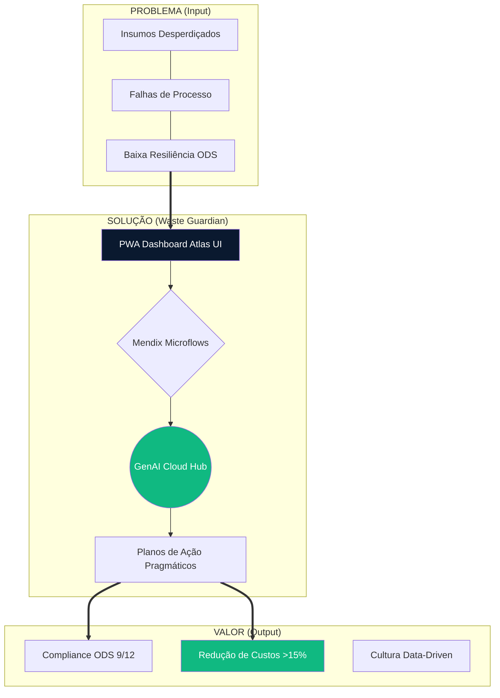

---

> **Resumo Executivo Expandido:**
> Este compêndio definitivo reúne a totalidade do esforço tático, de engenharia e negocial para a vitória no Low Hack 2026. A tese do **Waste Guardian** propõe não apenas um app, mas uma **mudança estrutural na operação industrial** através da união do Low-Code (Mendix) com a Inteligência Artificial Generativa (OpenAI). Este documento serve como Bíblia da equipe: ditando desde associações de banco de dados e microflows complexos, até posturas psicológicas no pitch comercial. Se não estiver neste documento, não deve ser feito durante as 35 horas críticas.

---

## 1. O NÚCLEO DO PROJETO E POSICIONAMENTO GLOBAL

### 1.1. O Problema Sistêmico (Alinhamento ODS 9 e ODS 12)
Na indústria de *Food & Beverage* (F&B), as perdas não ocorrem por falta de dados, mas pela **latência da ação**. Relatórios de desperdício (refugo, setup demorado, validade expirada) são gerados em D+1 ou em fechamentos mensais. O operador de chão de fábrica vê o problema, mas a correção sistêmica é engessada. 
* **ODS 9 (Indústria, Inovação e Infraestrutura):** Retrofit digital sem necessidade de trocar maquinário.
* **ODS 12 (Consumo e Produção Responsáveis):** Redução drástica de descarte de insumos alimentícios por falhas de processo.

### 1.2. A Solução: Waste Guardian
Um **Copiloto Operacional (B2B SaaS)** nativo em Mendix, desenhado como Progressive Web App (PWA). Ele descentraliza a inteligência: permite que qualquer inspetor ou operador de linha reporte anomalias em linguagem natural e receba, em segundos, um "Plano de Ação de Contenção" gerado por IA. Isso transforma reatividade em proatividade em tempo real.

### 1.3. Matriz SWOT de Guerra (Equipe e Produto)
| FORÇAS (Strengths) | FRAQUEZAS (Weaknesses) |
| :--- | :--- |
| **Arquitetura Tática:** Zero tempo perdido pensando "o que fazer". Documentação corporativa pronta antes do start. | **Curva Mendix:** Risco de travamento em lógicas complexas de microflow ou styling CSS customizado. |
| **Narrativa Blindada:** Conexão imbatível entre tecnologia de ponta e dor real de negócio (ROI). | **Exaustão:** Risco de fadiga mental comprometendo o Pitch (Domingo à tarde). |
| **OPORTUNIDADES (Opportunities)** | **AMEAÇAS (Threats)** |
| **Ecossistema Siemens:** O app serve como porta de entrada. Pode ser empacotado para o Mendix Marketplace. | **Scope Creep (Inchaço):** Tentar fazer integrações de IoT ou dashboards ultracomplexos e estourar o tempo. |
| **Visibilidade Executiva:** Falar diretamente com C-levels e mostrar visão arquitetural madura. | **Falha de API Externa:** OpenAI cair ou retornar timeouts durante a gravação do pitch. |

---

## 2. GOVERNANÇA, PAPEIS E O "KILL SWITCH"

### 2.1. "Swimlanes" - Divisão Estrita de Tarefas
* **Owner de Arquitetura & Mendix:** 
  * *Foco:* Domain Model, Telas (Atlas UI base), Microflows/Nanoflows, controle do deploy (`Publish`).
  * *Regra:* Proibido programar CSS na mão. Usar Building Blocks e Layouts nativos do Mendix.
* **Owner de Inteligência & Dados:** 
  * *Foco:* Engenharia do Payload/JSON, refinamento do Prompt da OpenAI, mock do dataset `.csv`, testes no Postman.
  * *Regra:* Garantir que a IA retorne *exatamente* o JSON mapeado pelo Import Mapping do Mendix.
* **Owner de Narrativa & Negócios:** 
  * *Foco:* Pitch Deck, gravação do vídeo 3 min, Business Model Canvas, redação técnica (README).
  * *Regra:* Blindar o escopo. Manter a equipe focada no valor, não na perfumaria do app.

### 2.2. Protocolo de Emergência: "Kill Switch"
Faltam 4 horas para a entrega e o app principal não funciona? Acione o Kill Switch garantindo a **Aprovação pelas Regras do Edital**:
1. [ ] Cortar telas secundárias. Focar em apenas 3 telas navegáveis (Overview, Form, Resultado).
2. [ ] Garantir o Deploy (Mendix Free Tier) rodando e público.
3. [ ] Integrar a OpenAI nem que seja num microflow bloqueante (`Synchronous`), ignorando loading spinners elaborados.
4. [ ] Iniciar a gravação do vídeo imediatamente. Pitch salva código quebrado, código quebrado não salva pitch não gravado.
5. [ ] Garantir uso inegociável da API GenAI (Coração do edital de 2026).

---

## 3. ARQUITETURA TÉCNICA AVANÇADA (MENDIX + OPENAI)

### 3.1. Mendix Domain Model (Associações e Constraints)
- **`LinhaProducao` (Main)**
  - Atributos: `NomeLinha` (String), `CapacidadeTon` (Decimal), `Status` (Enum: Ativa, Parada).
- **`EventoDesperdicio` (Log Input)**
  - *Associação:* 1 `LinhaProducao` -> `* EventoDesperdicio`
  - Atributos: `DataOcorrencia` (DateAndTime), `Turno` (Enum), `DescricaoProblema` (String ilimitada - vai pra IA), `KgPerdidos` (Integer).
- **`PlanoAcaoInteligente` (AI Output)**
  - *Associação:* 1 `EventoDesperdicio` - `1 PlanoAcaoInteligente`
  - Atributos: `RecomendacaoJSON` (String formatada), `NivelUrgencia` (Enum: Baixo, Médio, Crítico), `ScoreEstrategico` (Integer 0-100).

### 3.2. Fluxo de Dados e Segurança do Microflow (REST Call)
A chamada REST é o coração da estabilidade do Waste Guardian.
1. **Ativação:** Acionamento via botão "Pedir Plano à IA" na tela de `EventoDesperdicio` (Chama Microflow `ACT_GerarPlanoIA`).
2. **Construção do Body:** Uso de `Create Object` para montar o JSON stringificado (Módulo `System.JSON`).
   * *Atenção Técnica:* Tratamento do texto do usuário (escape de aspas) para não quebrar a chamada JSON da OpenAI.
3. **Segurança (App Security):** A chave da API `sk-proj-...` **nunca** deve estar hardcoded no microflow. Deve residir em uma **Constant** no Explorer do Mendix.
4. **Error Handling (Tratamento de Exceções):** 
   * Se a API OpenAI demorar > 15 segs, configurar *Custom Error Handling* no node `Call REST`. 
   * Retornar *"Show Message"* ao usuário final de forma elegante ("A Inteligência Central está processando alta carga de prioridades. Tente novamente.") ao invés de crashar a página.
5. **Persistência (Import Mapping):** O retorno JSON mapeia para as entidades `PlanoAcaoInteligente` em memória, faz `Commit` e gera um `Show Page` mandando o usuário para a página de Resultados.

### 3.3. UX/UI Tática com Atlas UI
Para "fingir" um time de design inteiro nas 35 horas:
- Usar **Card Action** components para as frentes de linha de produção.
- Usar **Badge widgets** baseados no `NivelUrgencia` (Renderizando Vermelho se Crítico, Laranja se Alerta).
- Embeber a resposta da IA em um container de `Format String` ou Widget de Markdown para o texto parecer orgânico e bem tabulado.

---

## 4. ENGENHARIA CRÍTICA DE PROMPT (OPENAI)

O prompt define se o App parece um brinquedo de ChatGPT ou um Software Industrial B2B.

**System Prompt (Blindado):**
> *"Você é o 'Waste Guardian', motor lógico e inteligência operacional para indústrias F&B. Você recebe relatórios informais de operadores sobre falhas no chão de fábrica e devolve OBRIGATORIAMENTE um objeto JSON rigoroso.*
> *O seu objetivo é reduzir perdas e otimizar maquinário alinhado às ODS 9 e 12 da ONU.*
> *Estrutura exigida:*
> `{ "nivel_urgencia": "string (Critico/Alerta)", "score_impacto": number (0-100), "plano_imediato": "string (2 parágrafos pragmáticos e diretos à manutenção)", "plano_estrutural": "string (Ideia estratégica de longo prazo)" }`
> *NUNCA retorne blocos de markdown em volta do JSON. Não cumpraite (greeting). Seja puramente técnico."*

---

## 5. GO-TO-MARKET (GTM) E METODOLOGIA COMERCIAL

### 5.1. O Modelo B2B SaaS B2B2E (Business to Business to Enterprise)
* **Pricing Model:** Licenciamento por Planta Física (Site License). 
  * Exemplo Tático: $800/mês por fábrica. Não importa quantos operadores baixem o app. Isso elimina atrito de adoção na base da pirâmide operacional.
* **Cost Advantage:** Gastos com processamento da LLM (OpenAI) são marginais (menos de US$ 5,00 por fábrica/mês usando GPT-4o-mini focado em chamadas esparsas) versus o valor gerado de milhares de reais salvos em insumos.

### 5.2. Escala via Mendix Marketplace
A verdadeira força do nosso Pitch: O Waste Guardian não é um app solto. Por ser codado em Mendix, pode ser transformado em um módulo reutilizável (`.mpk`) no Marketplace da Siemens. Outras empresas que já usam ERPs (SAP, Siemens Teamcenter) construídos em Mendix integram nosso módulo com *um clique*.

### 💎 Mindmap de Proposta de Valor

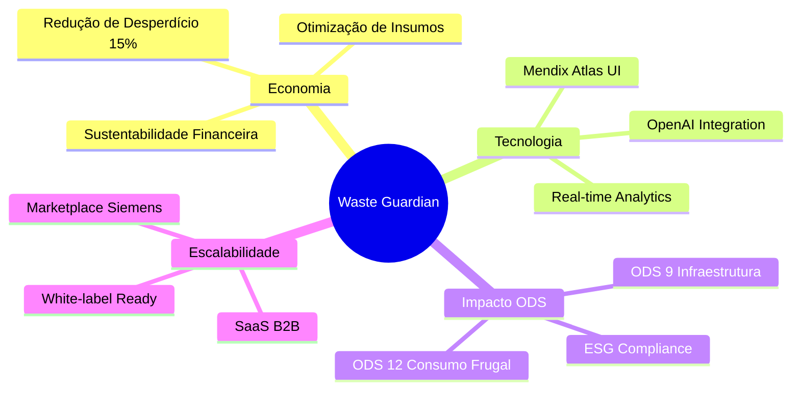

---

## 6. PLAYBOOK DE Q&A - JIU-JITSU VERBAL CONTRA JURADOS

Nas sabatinas (ou perguntas previstas) é onde times ganham ou perdem Hackathons gigantes. Como defender a aplicação de forma impiedosa:

🥊 **Ataque do Jurado:** *"Por que usar Inteligência Artificial pra isso se regras de condição simples (If caldeira esquenta > Mandar alerta) resolveriam?"*
🛡️ **Resposta Ouro:** *"Regras hardcoded dependem de variáveis estáticas, sensores IoT caros e sistemas legados complexos para serem interligados. A anomalia da indústria alimentícia é caótica (ex: 'caixa amassando porque fita adesiva colou no rolo'). Nossos operadores inserem a realidade crua em texto livre, a IA entende o contexto semântico do caos, e o Mendix orquestra a tarefa sem gastarmos 1 milhão em retrofits de sensores.*

🥊 **Ataque do Jurado:** *"E o risco de alucinação da inteligência artificial mandar o operador quebrar a máquina?"*
🛡️ **Resposta Ouro:** *"Mitigamos via Governança no Prompt e no Mendix. O Prompt possui formatação rígida no System Parameter focado em análises conservadoras. No Mendix, o App cria um Plano de Ação, mas o status dele fica 'Pendente de Aprovação' do Engenheiro Chefe. A IA é o copiloto analítico, não atua cega no maquinário (Human in the Loop)."*

🥊 **Ataque do Jurado:** *"Como vocês garantem privacidade dos dados industriais?"*
🛡️ **Resposta Ouro:** *"Sendo a segurança crítica para a Siemens, o PWA Mendix é governado por Role-Based Access Control (RBAC). A chamada de API para a OpenAI passa apenas os dados não-sensíveis do problema, sem IDs de clientes ou dados financeiros. Além disso, usaríamos APIs corporativas (Azure OpenAI) com termo de não-treinamento de dados (`No-Training-on-Data policy`) em um cenário de produção em massa."*

---

## 7. CRONOMETRAGEM IMPLACÁVEL DO PITCH (3 MINUTOS)

- **0:00 - 0:30 (O Gancho & A Dor):**
  - Câmera rápida e dinâmica. "Neste minuto em que começo a falar, milhares de quilos de comida foram para o ralo em fábricas brasileiras. Uma desconexão mortal entre dados lentos e operadores." (Mostrar gráficos rápidos de ODS 12 nas telas).
- **0:30 - 1:30 (A Demo Tática Bate-Pronto):**
  - Tela cheia no App (screencast liso). Mostrar como o operador em 3 toques digita um problema críptico e como o *Waste Guardian*, via microflow da Mendix puxando a OpenAI, reverte o caos em um plano perfeito em 5 segundos. Nenhuma enrolação de Login na demonstração.
- **1:30 - 2:15 (A Fortaleza Tecnológica):**
  - "Sob o capô: Atlas UI gerando um PWA ágil, base de dados escalável da nuvem Mendix, orquestração robusta de REST APIs passando via Import Mappings para JSON estruturado num prompt blindado."
- **2:15 - 2:45 (Tese de Bilhões - Venda SaaS):**
  - Mostrar que a escalabilidade é brutal. O retorno sobre investimento (ROI) da fábrica é no dia 1, cobrado via assinatura mensal Mendix (Site-license).
- **2:45 - 3:00 (Checkmate Impacto):**
  - Frase de ancoragem. "A tecnologia Low-Code Siemens não é para criar telas bonitinhas; é para estancar o sangramento das indústrias, empoderar a base operária com o estado da arte de GenAI, e salvar os recursos do nosso planeta. Nós somos a Equipe Waste Guardian."

---

## 8. RODAMAPA DE IMPLEMENTAÇÃO (TIME-TO-VALUE)

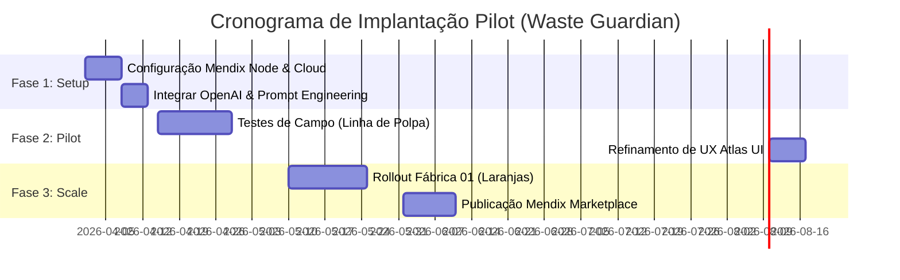

---

## 9. RISCOS & FATORES CRÍTICOS DE SUCESSO (FCS)

| Categoria | Fator Crítico / Risco Máximo | Contramedida de Guerra |
| :--- | :--- | :--- |
| **TECNOLOGIA** | *Mendix Studio Pro crashar ou perder o commit da equipe na nuvem (Conflitos de Merge).* | Fazer commits (`Update` e `Commit` no Team Server) a cada funcionalidade core fechada. Não misturar edição no mesmo Microflow. |
| **API/DADOS** | *Rate Limit da OpenAI free estourar no meio de um teste e bugar tudo.* | Ter um JSON de Mock salvo dentro do Microflow usando um `Decisão (Split)` temporário se a API cair. Testar em Homologação. |
| **NEGÓCIOS** | *Focar demais na dor da fome mundial, e esquecer do Business/Software.* | O discurso é B2B. A fábrica perde *dinheiro*. A ODS é o arcabouço moral, o software vende eficiência pra diretores sedentos por margem. |
| **ENTREGA** | *Renderizar o Pitch atrasado e não upar no YouTube/Vimeo até as 19h de domingo.* | Regra End-Game: O Pitch importa mais que botões funcionais da Tela 3. Se deu domingo 12:00h, paralise código novo, filme e edite o artefato final. |

---

⚙️ **DECLARAÇÃO DE ENTREGA EXTREMA:** Todo membro da equipe que ler e absorver este documento torna-se capaz de cobrir falhas de qualquer outra frente técnica ou argumentativa. O Mendix garante a robustez estrutural; a OpenAI concede o poder analítico revolucionário; e este dossiê, a clareza estratégica. **Foco total. Sem desvios de rota. Rumo ao 1º Lugar do Hackathon Low Hack 2026.** 🚀🏆


\pagebreak

---

## 2. Playbook Tático e Governança

*Arquivo de origem: `01-playbook-tatica.md`*

# Playbook Tático e Regras de Engajamento: Low Hack 2026

> "**Nós não estamos construindo só um software, estamos embalando e vendendo Transformação Digital e Sustentabilidade para a Siemens e Mendix.**"

## 1. A Tese Central: "Waste Guardian"

A aplicação chamará **Waste Guardian**, focada na indústria de *Food & Beverage* (alimentos e bebidas), onde o desperdício global é gigantesco. Nossa solução é um **Copiloto Operacional (via OpenAI)** encapsulado em um app PWA **Mendix**. Ele monitora as perdas de matéria-prima em tempo real e entrega recomendações ativas à supervisão, impactando de imediato a redução de lixo (ODS 12) e otimização de infraestrutura / custos industriais (ODS 9).


## 2. Divisão de "Owners" ("Swimlanes")

- **Owner de Arquitetura & Mendix:** Responsável por garantir o compliance técnico do edital. Terá a tarefa de construir as Entidades, UI e rodar Micro/Nanoflows obrigatoriamente exigidos. Publica e testa o APP no Free Tier. Configura a API da OpenAI via Mendix Connector.
- **Owner de Inteligência & Dados:** Responsável pelo prompt engineering (definir as personalidades e heurísticas da IA para respostas precisas aos operadores) e por manipular/mockar os dados de eventos de desperdício na plataforma de demonstração.
- **Owner de Narrativa & Negócios:** Cuida do "Front-End do Hackathon". Seu único foco é construir e ensaiar o Roteiro de 3 Minutos, atrelá-lo com as ODS e a persona (Supervisor Tácito), liderando a formatação do "GitHub" ou Google Drive exigido e das documentações.

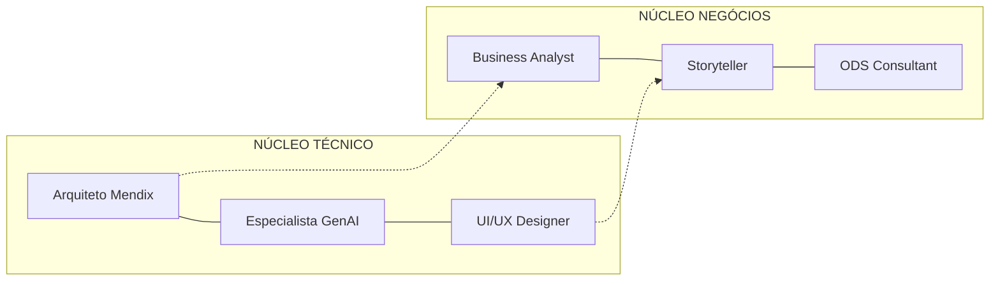


### 2.1 Distribuição de Responsabilidades

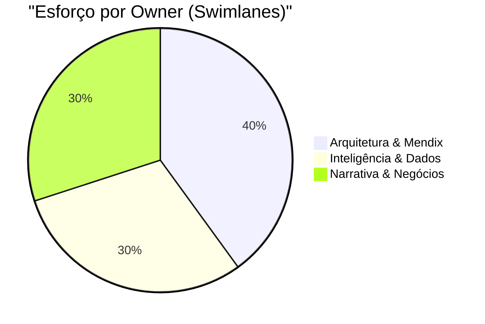


## 3. Matriz SWOT Rápida

| Forças | Fraquezas |
|--------|-----------|
| Organização pré-evento imbatível (o scaffolding é focado 100% no edital); Documentação pronta desde o minuto zero. | Conhecimento nativo da nuvem Mendix pode ser inicial (precisaremos blindar tempo contra debugging trivial); Time-box de fim de semana é violento. |
| **Oportunidades** | **Ameaças** |
| Ser um *Showcase Siemens* (mostrar valor Enterprise na narrativa que a alta gerência gosta). Destravar conexões ou mesmo o ecossistema TrueChange. | Gastar muito tempo polindo UX ao invés de focar no Microflow crucial de integração da OpenAI. Desrespeitar regras (horários das Lives / links de formulário com formato errado). |


### 3.1 Visualização SWOT

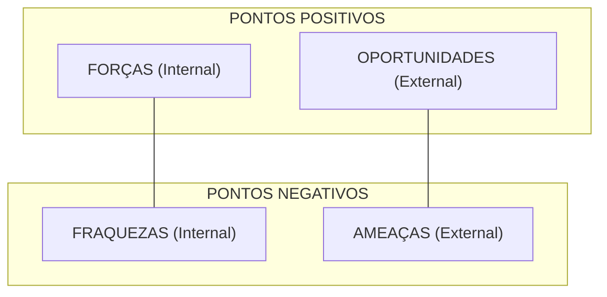


## 4. O Sistema de "Kill Switch" (Foco Extremo)
Se em qualquer momento durante a execução entre Dia 1 e Dia 2 começarmos a implementar "features legais", aciona-se o Kill Switch e os esforços retornam para a lista de **Entregáveis Letais** (Obrigatórios do Regulamento):
- [*] O app usa GenAI via API fornecida de forma tangível?
- [*] Está em deploy na Mendix Cloud com link disponível?
- [*] Tem no mínimo um Microflow ou Nanoflow rodando na lógica principal?
- [*] Tem CRUD (Persistência) mínimo testando dados?
- [*] O vídeo gravado ultrapassou 3 minutos? Se sim, REFazer.


### 4.1 Fluxo Decisório "Kill Switch"

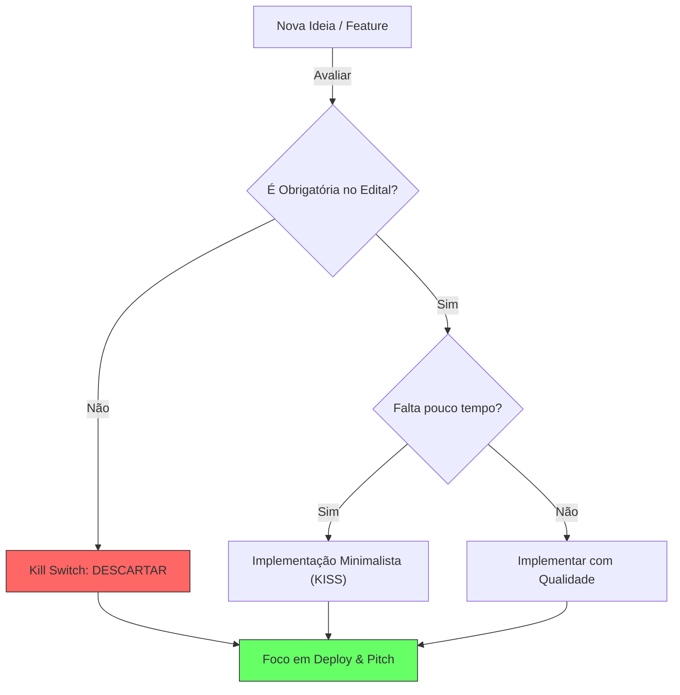
---

## 5. Roadmap Pós-Hackathon (A Visão de 6 Meses)

Um projeto vencedor precisa provar que não morre no domingo às 21:00.

| Tempo | Milestones | Foco de Valor |
| :--- | :--- | :--- |
| **Mês 1** | Piloto em 1 linha real de envasamento (Planta Siemens). | Validação de KPI de Opex. |
| **Mês 2** | Integração Nativa via Conectores MindSphere. | Automatização de Ingestão de Dados. |
| **Mês 3** | Expansão para 3 Unidades (Brasil/Alemanha). | Escalabilidade Global. |
| **Mês 6** | Marketplace Siemens Xcelerator (Lançamento Oficial). | Monetização e Escala Comercial. |

## 6. Protocolo "War Room" (Gestão de Crise 35h)

Se algo travar durante o Hackathon, siga o protocolo de 15 minutos:
1. **0-5 min:** Tente resolver (Debug padrão).
2. **5-10 min:** Consulte a documentação `scaffolding/tech/`. Procure o "Kill Switch" se for problema de API.
3. **10-15 min:** Se persistir, o Arquiteto Mendix decide: **Pivotar** (Simplificar UI/Lógica) ou **Mocar** (Pular o passo técnico e focar na narrativa visual). *Nunca gaste mais de 1h num único blocker.*

## 7. Xcelerator Marketplace Readiness (Requisitos de Elite)

Para sermos "Xcelerator-Ready", o Waste Guardian deve seguir estes pilares técnicos durante as 35h:

- **🔐 Segurança (Mendix SS):** Implementar Mendix Level-Security (Production Level), dividindo acesso entre `Operador` e `Administrador`. Jamais deixar anonymous access ligado.
- **🔌 Interoperabilidade (API First):** Expor no mínimo um endpoint REST no Mendix para mostrar que outros sistemas Siemens podem "consumir" nossa inteligência.
- **☁️ Multi-tenancy (Scalability):** Estruturar o Domain Model para suportar múltiplas plantas (Empresas A, B, C) isoladas logicamente.

## 8. Estratégia de "Infiltração Industrial" (Tactical Infiltration)

Nossa tese de mercado é: **Mendix é o Cavalo de Troia da Siemens.**

- O cliente usa SAP ou Oracle? Não importa. O Waste Guardian roda em cima via OData/REST.
- Ao resolver a dor do desperdício F&B, o cliente "prova" o valor do Low-code Siemens.
- O passo seguinte é a migração da infraestrutura legada para o ecossistema Siemens (PLM, MES, IIoT). Nosso Pitch deve flertar com essa **conversão de mercado**.


\pagebreak

---

## 3. Cronograma de Ataque (35 Horas)

*Arquivo de origem: `02-cronograma-de-ataque.md`*

# Cronograma de Ataque: O Fim de Semana (35 Horas de Guerra)

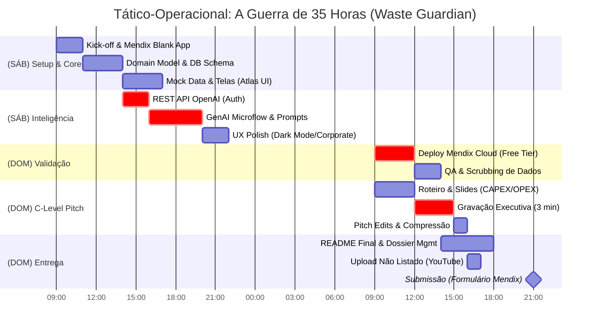

## 🛡️ Treinamento de Guerrilha (Bi-Agressivo: Pré-Hackathon)

Metas semanais para garantir que a largada no dia 18/04 seja em "velocidade de cruzeiro" e a arquitetura seja 100% antifrágil.

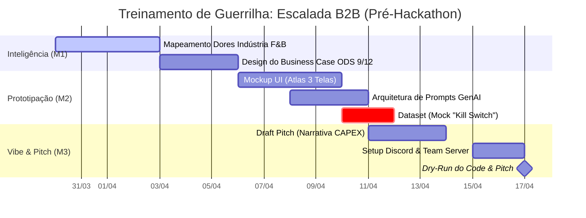

### Semana 1 (Hoje - 05/04): Inteligência e Mapeamento de Terreno

*Foco Macro: Domínio da Arquitetura Mendix e GenAI*

- [ ] **Tech (Mendix):** Estudo de Data Grid 2 e componentização via Atlas UI (CSS baseline da Siemens).
- [ ] **Tech (GenAI):** Desenvolver o System Prompt imutável (JSON Restrict) para a API OpenAI.
- [ ] **Business:** Estudar 3 Casos de Uso/Secesso da Siemens (Indústria de Alimentos) e plugar métricas no Roteiro.
- [ ] **Antifrágil:** Desenhar Domain Model (Diagrama ER) e cruzar com as restrições técnicas do edital.

### Semana 2 (06/04 - 12/04): Prototipagem e "Mocking" Antifrágil

*Foco Macro: O Plano B Invisível aos Juízes*

- [ ] **Tech (Mendix):** Mockup end-to-end das 3 telas obrigatórias (Dashboard principal em Dark/Corporate Mode).
- [ ] **Tech (Integração):** Mapemento literal do Microflow para chamadas REST (Auth + Headers da OpenAI).
- [ ] **Business:** Fechar 1º rascunho do Storytelling do Pitch (Foco no CAPEX vs OPEX do desperdício de insumos).
- [ ] **Antifrágil (Kill Switch):** Criar dataset Mock (CSV offline) e embutir no Mendix. Se a API falhar no pitch, o app consome o local silenciosamente.

### Sprint 0 (13/04 - 17/04): Dress Rehearsal (Pronto para Guerra)

*Foco Macro: Simulação de Alta Pressão e Setup Travado*

- [ ] **Tech:** Blank App no Team Server criado e configurado (Módulos OData, REST e Charting importados).
- [ ] **Business:** Simulação de Pitch "Contra o Relógio" com o Mockup navegável (Cortar jargão fútil, focar no negócio).
- [ ] **Antifrágil:** Lock-in de Tarefas (Divisão cega de quem coda UI, quem coda lógica, quem roteiriza o pitch). Nenhum desvio permitido no sábado.

---

## DIA 1 - Sábado, 18 de Abril

### 09:00 - 11:00 | Kick-off e Reconhecimento (Setup Total)

- Presença obrigatória nas "Lives" da organização (Discord The Lounge).
- Setup Final do Projeto Mendix - `Creation` do Scaffold do Mendix Template Blank.
- Compartilhamento (Team Sync) de repositórios/chaves e acesso no Studio Pro / Web Studio.
- Iniciar ingestão do Mock Dataset de Alimentos no Mendix (entidade `EventoDesperdicio`).

### 11:00 - 14:00 | Estrutura de Domínio & Microflows Core

- Criação das 4 entidades mestres (Domain Model).
- Setup e Mock das páginas cruciais: 1) Visão Geral (Dashboard) 2) Detalhes (Lista de Eventos).
- Fazer a conexão Mendix X Rest API (OpenAI) e testar ping básico.

### 14:00 - 18:00 | Implementação da Inteligência ODS (A Mágica)

- **Marco do dia:** Integrar Prompts "Waste Guardian" via ChatGPT API.
- Refinamento do Layout UI (Aplicar tema, responsividade e botões focados num design Enterprise, Dark/Light Corporate Siemens).
- Programação dos Nanoflows para chamadas de IA dinâmicas.

### 18:00 - 22:00 | Polish Funcional

- UX/UI de "Action Plan" (Tela 3) mostrando texto e contexto que a GenAI responde.
- Tratamento de mensagens de erro.
- Preencher o arquivo de Projeto via documentação.

## DIA 2 - Domingo, 19 de Abril

### 09:00 - 12:00 | Bateria de Testes + Pitch Drift

- Deploy inicial no Mendix Cloud (Free Tier). O link do servidor Mendix *deve* estar funcionando e abrindo liso antes do almoço.
- Revisão Final de Bugs Críticos (CRUD tá funcionando?).
- Owner de Pitch roda a 1ª bateria cronometrada no espelho usando a Aplicação Viva (Captura de Interface).

### 12:00 - 16:00 | Gravação do Pitch (Nível Cinema)

- Focar exaustivamente em roteiro. Gravar desktop + facecam.
- Em paralelo, os devs estão empacotando o README com as instruções exigidas, link do app e capturas de tela bem arquitetadas (o diferencial de desempate!).

### 16:00 - 19:00 | Redundância e Post-Mortem "As-Is"

- Upload do Pitch pro YouTube em formato **NÃO LISTADO**.
- Verificação Cruzada do Edital:
  - Pasta com arquivos? (Sim)
  - Link de deploy? (Sim)
  - PDF/TXT do vídeo? (Sim)
- Formulário final preenchido e verificado pelos 3 owners.

### 19:00 - 21:59 | O "Zero-Day" Waiting (Evite Entregar aos 45 do Segundo Tempo)

- **21:00** deve ser o "Hard Stop Limit". O envio oficial acontece pelo menos uma hora antes do cordão de isolamento da meia-noite das bancas do Low Hack.


\pagebreak

---

## 4. Business Model Canvas (B2B SaaS)

*Arquivo de origem: `business/01-business-model-canvas.md`*

# Lean Canvas - Produto: Waste Guardian (Food & Beverage)

A mentalidade para defender esse modelo no Low Hack é a viabilidade Enterprise. Não estamos vendendo um aplicativo, vendemos "Software de Gestão ODS e Eficiência Produtiva" para o maquinário industrial nativo.

## 1. O Problema

- Desperdício silencioso: Válvulas mal calibradas, lotes vencendo em trânsito interno, falhas humanas leves gerando paradas (downtimes).
- Análise Tardia: Apenas no fim do mês o Supervisor nota os quilogramas reais de Polpa/Insumos que foram para o esgoto (ODS 12 e Custo Operacional sangrando).
- Ação Inerte: Relatórios geram culpa, não soluções prontas para hoje à tarde.

## 2. Segmento de Clientes

- **Target Direto:** Gerentes e Diretores de Operações Industriais (Food & Beverage e Bens de Consumo Rápido - FMCG).
- **Early Adopters:** Empresas de médio-grande porte pressionadas pelo *ESG* (Enviromental, Social, and Governance) para zerar suas pegadas de carbono em 5 anos. Fábricas que já tenham alguma esteira Siemens Mendix/Edge de IoT e buscam inteligência rápida de workflow ("Easy Win").

> Identifique micro-perdas invisíveis agora, execute planos mitigatórios sugeridos pela OpenAI no mesmo minuto. Transforme prejuízo crônico em compliance com a ODS 9 através de um Copiloto Inteligente Mendix.

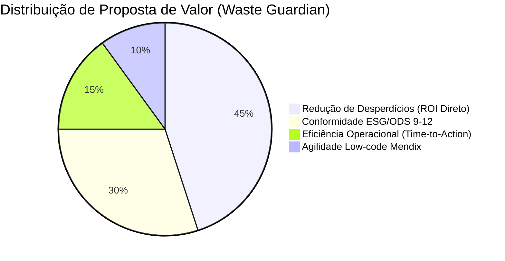

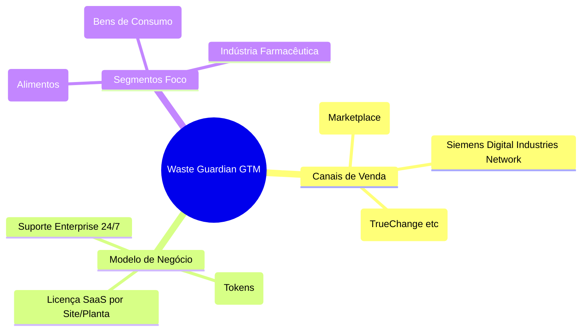

## 4. Solução Ponto a Ponto (A Ferramenta)

1. Ingestão Mendix PWA das anomalias nas linhas de base de fábrica.
2. Cross-data assíncrono com a OpenAI (Modelo customizado focado num papel de "Técnico Plantista").
3. Ranking das 3 saídas mitigatórias mais fáceis, baseadas na temperatura do setup e volume preditivo.

## 5. Canais (Go-To-Market)

1. **App Store do Mendix (Marketplace):** Estar inserível como um Add-on de Fábricas para Mendix Clouds privadas de Indústrias.
2. Integração White-label e parceria estratégica B2B (Mendix Partner Ecosystem & TrueChange/Siemens Network).

## 6. Modelagem de Receitas (Monetização ODS)

**Modelo Enterprise SaaS - Licenciamento Base Site**
O Waste Guardian será tarifado por **"Node Industrial" (Planta/Site)**. Venda B2B Clássica sem limites de usuários por fábrica no início.

- Base Tier: US$ 599/Mês por Site.
- Escalonabilidade em Token Usage: Pacotes adicionais de +US$ 100/mo a cada 10K requisições do Copiloto acima da meta standard ODS, financiando a chamada "OpenAI Payload" a fundo perdido para nós.

## 7. Estrutura de Custos (Despesas Variables vs Fixed)

- **Custo Principal Variável** (COGS): Chamadas REST OpenAI GPT-4o Mini por query (`$0.0001` - virtualmente zero, margem gigante).
- Custo Fixo de Infraestrutura: Licença Mendix Enterprise Multi-tenant (Rateio Nuvem + RDS SQL Database para Persistência ODS e Compliance Regulatório).
- Manutenção: Atualização do Prompts de Defesa Industrial frente às novidades mercadológicas.

## 8. Métricas Chave

1. **Queda Percentual (MoM)** no volume total de Desperdício Registrado em Quilos vs Volume Produzido (`ODS Impact Metric`).
2. Média de tempo em minutos para a Resolução Aplicada e o Fechamento do Card.
3. Rápida conversão Churn->Zero em POCs gratuitas de 14 Dias instaladas na nuvem das fábricas parceiras Siemens.

## 9. Vantagem Injusta

Plataformizado nativamente no sistema Mendix. Nossa arquitetura reaproveita o SSO (*Single Sign-On*) do chão de fábrica Mendix preexistente nos clientes pesados e o LLM não detém nossos domínios de Dados — somos apenas a ponte inteligente entre a anomalia e a solução baseada em bilhões de parâmetros gerais cruzada com regras de corte do cliente localmente via Mendix Logic Actions.


\pagebreak

---

## 5. Inteligência Industrial (Setor F&B)

*Arquivo de origem: `business/02-industrial-intelligence.md`*

---
title: "Inteligência Industrial & Mapeamento de Dores (F&B)"
description: "Alinhamento macroeconômico com ODS 9/12 e diretrizes de negócios da Siemens/Mendix"
---

# 🏭 Módulo 02: Inteligência Industrial & Mapeamento de Dores

> *A vitória do Low Hack não está na sintaxe do Mendix, mas na resposta implacável à pergunta: "O que nós estamos resolvendo e qual o ROI para a indústria que usar o Waste Guardian?"*

## 1. O Alvo: Indústria Food & Beverage (F&B)
O setor de Alimentos e Bebidas (F&B) é um dos maiores alvos mundiais para adoção de tecnologias ESG (Environmental, Social, and Governance). No entanto, o desperdício ainda corre frouxo nas linhas de produção.
Escolhemos F&B porque os dados gerados são críticos, visíveis (lotes de desperdício) e a margem de lucro por lote afeta o "piso de fábrica" imediatamente.

### Dores Atuais do Mercado
- **Rastreabilidade Lenta:** Anotações em planilhas ou sistemas antigos que atrasam a correlação entre tempo e perda.
- **Micro-Desperdícios (Death by a thousand cuts):** Vazamentos, má calibração, setup demorado da máquina — que somados dilaceram o EBITDA.
- **Dificuldade de Ação ODS:** Todos querem seguir os ODS da ONU, mas falta um sistema de plano de ação acoplado à detecção.

## 2. Fit Estratégico com Siemens & Mendix (O Fator CAPEX vs OPEX)

Para impressionar a banca (formada também por arquitetos de soluções Siemens e ecossistema de dados), nosso discurso deve ressoar com a mitigação do **CAPEX** (Despesas de Capital) via automação.

O Mendix entra como o *viabilizador* de velocidade e flexibilidade. Onde fábricas antes demorariam meses e precisariam de vastos investimentos em infraestrutura (CAPEX) para fazer um app rodando em chão de fábrica (IoT/Edge), o Mendix permite o deploy em dias sob um modelo SaaS focado em **OPEX**.
**Discurso do Pitch:** *"O Waste Guardian transforma o Mendix na ponte de controle onde a coleta de anomalias da fábrica é instantaneamente convertida em relatórios de economia Opex via IA, trucidando os custos de inovação tradicionais."*

## 3. Alinhamento Oficial aos ODS Globais

A aplicação obedece a duas ODS fundamentais cobradas pela organização do Hackathon:

### 🏗️ ODS 9: Indústria, Inovação e Infraestrutura


**Ação WG:** Atualiza a planta fabril antiga para uma "Instalação Resiliente". A inovação está na substituição de inspeção manual atrasada por um copiloto preditivo (OpenAI REST) que lê logs de falha e sugere recalibrações baseadas no perfil da máquina mapeado pelo Mendix.

### ♻️ ODS 12: Consumo e Produção Responsáveis


**Ação WG:** Ataca a Redução do Desperdício Alimentar. Antes do material se tornar lixo industrial ou passar da validade no estoque de quarentena, a plataforma quantifica financeiramente a perda e constrói um plano de mitigação acionado em poucos toques pela liderança corporativa.

## 4. Matriz de Avaliação B2B 

A tabela abaixo cruza as dores clássicas da fábrica VS a funcionalidade que implementaremos até o Domingo.

| Situação Atual (Fábrica F&B) | Como o Waste Guardian Resolve | Feature ODS Envolvida |
| :--- | :--- | :--- |
| Planilhas perdidas no pátio | App PWA Mobile-First via Mendix no tablet do operador | ODS 9 (Registro digital) |
| Relatório longo p/ Supervisor | Dashboard no Atlas UI resumindo eventos críticos | ODS 12 (Controle de danos) |
| Ação corretiva demorada | **GenAI API OpenAI:** Sugere *Action Plan* imediato com base na anomalia | ODS 9 (Inovação em manutenção) |

---
*Este documento consolida o Business Case que defenderemos perante a banca no encerramento.*


\pagebreak

---

## 6. Econometria B2B & O "True Sponsor Intent"

*Arquivo de origem: `business/03-sponsor-econometrics.md`*

---
title: "Econometria & Real Sponsor Intent: O Tróia de Vendas da Siemens/Mendix"
description: "Desconstruindo a agenda oculta do Hackathon: Fluxo de Capital B2B, Expansão de TAM/SAM/SOM e ROI da Solução."
---

# ♟️ Módulo 03: Econometria B2B & O "True Sponsor Intent"

> *Ninguém investe milhões em hackathons globais por filantropia cega (mesmo sob a bandeira ODS 9/12). Hackathons corporativos da Siemens são **Máquinas de R&D Terceirizado e Canais de Redução de CAC (Customer Acquisition Cost)**. Para vencer, não podemos entregar um projeto de faculdade; temos que entregar um Acelerador de Vendas do Siemens Xcelerator.*

## 1. A Verdadeira Matriz de Lucros: Por que a Siemens comprou a Mendix?

Em 2018, a Siemens AG pagou **€0.6B ($730 Milhões de dólares)** em dinheiro para adquirir a Mendix. O motivo não foi entrar no mercado de apps genéricos, mas solucionar o maior gargalo do portfólio de engenharia pesada da Siemens: **A adoção do MindSphere (IIoT) e do Siemens Xcelerator.**

### 💸 O Problema da Adoção (O Gargalo de OPEX do Chão de Fábrica)
Um gerente de fábrica (Indústria de Alimentos e Bebidas - F&B) tem maquinários incríveis (Hardware Siemens) gerando terabytes de dados brutos de desperdício. Mas, para criar uma interface visual (UI) para que o operador interaja com o "Gêmeo Digital" (Digital Twin) na linha, a fábrica precisaria contratar dezenas de desenvolvedores caros, configurando um **CAPEX impeditivo**.

### 🧩 A Mendix como a "Cola de Vendas" (Role-based UI)
O *Mendix* atua como a camada de visualização em tempo real para os pesados *Manufacturing Execution Systems (MES)* e softwares de *Plant Simulation* da Siemens (Ex: *Opcenter* e *Teamcenter*). O Mendix permite "Interfaces personalizadas baseadas no perfil do operador" desenvolvidas em dias, não meses. 

## 2. A Jogada do Hackathon: Outsourcing de Provas de Conceito (PoC)

**Por que eles terceirizam inovação via Hackathon?**
1. **O Custo Real vs O Custo Obscuro:** Se a Siemens encomendasse à Accenture uma *PoC* ("Proof of Concept") de um App de Previsão de Desvios (com GenAI) para integrar ao Xcelerator, custaria no mínimo $250k. O Hackathon gera 50+ PoCs em 35 horas a preço de banana.
2. **Geração de Casos de Uso (Sales Enablement):** Eles precisam de *drives* de vendas para bater na porta da Danone, JBS, e dizer: "Olhe como este pequeno App Low-code com OpenAI detecta gargalos ODS 12. Podemos plugar amanhã na sua operação."

---

## 3. Dinâmica Capital-Flow: Onde o "Waste Guardian" se infiltra?

Aqui entra a Valoração Econômica da *Nossa* Solução, estruturada sobre o TAM, SAM e SOM.

| Escopo Macroeconômico | O Real Fluxo Financeiro (Tese de Investimento) | O Papel do Waste Guardian (A Isca) |
| :--- | :--- | :--- |
| **TAM (Waste Industrial Global)** | A ineficiência e desperdício logístico-produtivo no segmento F&B inflaciona OPEX e fere métricas ESG em escala de **~$1.2 Trilhões/ano**. | Prover argumentação de que a redução dessa sangria não precisa de mais turbinas físicas, mas de inteligência de processos na ponta (IoT). |
| **SAM (Ecossistema Digital Enterprise Siemens)** | Clientes da "Digital Factory Division" da Siemens que *ainda* não compraram licenças Mendix. | A fábrica F&B compra a ideia do Waste Guardian para sanar dores reais. Isso **obriga** a aquisição ou upgrade da licença empresarial da plataforma Mendix Coud. |
| **SOM (Go-to-Market Imediato)** | Instalações que ativam ODS 12 (Sustentabilidade Corporativa) buscando redução de multas ou subvenções ESG. | O App é a primeira vitória do CFO. Segundo o relatório IFS, **líderes digitais investem 45% do orçamento em transformação**. O Waste Guardian é o destino ideal desse capital por entregar ROI direto mitigando perdas diárias. |

## 4. O Gancho Matador para o PITCH (Engineering the Jury)

Sabendo que a banca julgará o "potencial de negócio", nossa retórica deve assumir a dor do departamento de vendas da própria Mendix. 

**O "Trojan Horse Pitch" (O que falaremos nas entrelinhas):**
> *O Waste Guardian é a ferramenta da Siemens para fechar esse negócio. Sabendo que **34% das indústrias F&B priorizam eficiência e redução de desperdício** acima de qualquer outra meta (IDC), nós entregamos o Cavalo de Troia perfeito. Ao implementá-lo, nós provamos ao diretor industrial que o Gêmeo Digital do Xcelerator e a agilidade do Mendix—juntamente com o poder preditivo da OpenAI—resolvem perdas de ODS 12 no OPEX do dia a dia. A sustentabilidade passa a bancar a aquisição de software."*

---
---
**Conclusão Tática:** Não focaremos nos botões esmeralda ou no 'dark mode'. Focaremos em como a integração da API GenAI dentro do Mendix cria um produto tão perigoso de bom, que **o custo de ignorá-lo** para uma indústria torna-se financeiramente e ecologicamente insustentável. Essa é a verdadeira Econometria B2B deste Hackathon.

## 5. Arquitetura de Receita: O Mendix ISV Program (Royalties)

Diferente de apps simples, o **Waste Guardian** é desenhado para o *Mendix ISV Program*:

- **Mecanismo de Escala:** Uma vez validado pela Siemens, o App entra no **Siemens Xcelerator Marketplace**.
- **Modelos de Preço (Tiered SaaS):**
  - **Tier 1 (Core):** $5.000/site/ano. Foco em redução de desperdício ODS 12.
  - **Tier 2 (AI Advanced):** $12.000/site/ano. Inclui o 'Copiloto de Manutenção' (GenAI 1:N Actions).
- **Royalties Siemens:** A Siemens retém uma parcela (comissão) por venda, incentivando seus próprios vendedores a oferecerem o *Waste Guardian* para baterem metas de sustentabilidade industrial.

## 6. Sinergia Siemens Xcelerator (O "Pull-through" de Hardware)

Este é o segredo do vencedor: **O Software Mendix vende o Hardware Siemens.**

1. **A Invasão (Software):** O cliente instala o *Waste Guardian* para resolver uma dor de gestão.
2. **A Descoberta (Dados):** O App mostra que a precisão da IA seria 40% maior se houvesse sensores de vibração de alta frequência.
3. **O Upsell (Hardware):** O cliente compra o kit de sensores **Siemens SITRANS** e o gateway **MindConnect**, integrando tudo ao MindSphere.
4. **O Resultado:** Uma venda de software de $10k puxa uma venda de hardware de $100k. Isso é o que a Siemens quer ouvir.


\pagebreak

---

## 7. Mendix Bootcamp Fast-Track (Hackathon Edition)

*Arquivo de origem: `tech/00-mendix-bootcamp-fast-track.md`*

# Bootcamp de Mendix "Laser Focused" para o Hackathon (35 Horas)

A chave para vencer um hackathon de 35 horas em Mendix não é saber de tudo; é saber usar a plataforma para construir **rápido** e **sem quebrar a Arquitetura Antifrágil** (kill-switches de fallback e mocks). 

A partir de agora, o time não pode se perder em tutoriais irrelevantes. Eis a trilha exata de estudos e a tese de implementação.

---

## 🎯 1. Foco Principal: Atlas UI e Prototipagem Visual

O jurado é visual. Vocês têm que impressionar nos primeiros 15 segundos.

### O Que Estudar Urgente:
- **Building Blocks Mendix:** O framework visual (Atlas UI) possui pequenos pedaços modulares chamados *Building Blocks*. Eles já vêm com estilos profissionais de dashboards e formulários. Não desenhe listas brutas; use as *List Views* e *Data Grids* do Atlas.
- **Role-based Security (Acessos):** O diferencial competitivo é o login. Mostrem dois painéis distintos:
  - Painel do Operador (Coletando dados via Mobile).
  - Painel do Gestor C-Level (Vendo o ROI e dashboard da Inteligência Artificial em Desktop).
- **Layouts Padrão (Navbars & Menus):** Aprendam a configurar o navigation profile do Mendix para que a UI Desktop não pareça com a Mobile.

> [!TIP]
> **HACK:** Usem as bibliotecas do *Mendix Marketplace* (Charts, Maps, etc.) em vez de construir interfaces do zero. As UIs devem parecer caras. Foco exclusivo em montar as telas **antes** da lógica complexa.

---

## 🔌 2. A "Cola Mágica": Integrando Open AI (O Cérebro)

A Siemens vende Mendix porque ele se conecta com o mundo de dados legados por APIs. Vocês vão construir a "camada GenAI". Para um hackathon, usar o *REST API client nativo* do Mendix é infinitamente mais forte do que programar em Node por fora.

### O Que Estudar Urgente:
1. **Call REST Service:** Como enviar as requisições POST dentro de um Microflow apontando direto para `api.openai.com`. Entender autenticação `Header` com `Bearer Token`.
2. **JSON Structures & Mappings:**
   - **Import Mapping:** Como transformar a resposta *JSON textual* da OpenAI nativamente em **Entities** do Mendix, e depois atualizar a tela.
   - **Export Mapping:** Como juntar três campos que o Operador preencheu e montar uma string gigante de Prompt pra mandar na sua Request JSON.
3. **Non-Persistent Entities (Entidades na Memória Básica):** Toda interface de chat, input de IA, ou busca deve usar *Non-Persistent Entities* para que o app fique veloz.

> [!WARNING]
> Mendix possui módulos GenAI Commons prontos (Mendix 10), porém, **não dependam** deles 100%. Treinem criar a chamada `Call REST` crua. Isso garante que, se atualizar o módulo ou der pau na compilação na hora da demo física, vocês tenham a alternativa no-code na ponta da língua.

---

## ⚙️ 3. Lógica de Negócios: Microflows vs. Nanoflows

Saber escolher o fluxo reduz o delay de UI. 

### O Que Estudar Urgente:
- **Microflows (Roda do lado do Servidor):** Essencial para as chamadas da API do OpenAI, integrações e segurança (verificar acessos). Onde mora "a mágica".
- **Nanoflows (Roda no Browser/Device):** Se for checar se o formulário está vazio ou dar feedback visual (Progress Bar), use *Nanoflows*. Eles são off-line e ultrarrápidos, evitando sobrecarregar o painel.
- **Client Side Fetch (A Morte do Loading):** Carreguem seus dados na tela com Nanoflows simulando o preenchimento, mostrando loaders para a banca enquanto a IA decide qual é a predição. 

---

## 🗃️ 4. Modelagem de Dados Minimalista (Domain Model) 

Hackathon não é ERP. Não criem tabelas relacionais complexas em terceira forma normal.

### O Que Estudar Urgente:
- A regra do 3: Tente resolver todo o escopo de entidades com o mínimo possível de associações reais. Exemplo: `User` -> `<1-1>` -> `DashboardState` -> `<1-N>` -> `AIPredictions`.
- **Validação de Associações (1-para-N):** Como linkar o funcionário real com a lista de previsões sobre a máquina X.
- **"The Kill-Switch":** Estudem como trocar a "Data Source" de uma Tabela Mendix de *Microflow (Chamando IA)* para *Database (Mostrando Tabela Mocada Manual)*. Se a internet do evento ou a API da OpenAI cair... **O Kill-Switch** salva pitches.

---

### 🔥 Próximos Passos (Ação do Time):
1. **Separar Especializações:** 
   - 1 Membro mergulha em *Import/Export JSON Mapping + REST*.
   - 1 Membro mergulha em *Atlas UI (Building Blocks & Role-based).*
   - 1 Membro mergulha em *Non-Persistent Entities e Nanoflows (Tirar Tensão Visual)*.
2. **Setup do App Blank:** Façam um Mendix Blank App HOJE. Puxem os pacotes Atlas UI.
3. **Test Sandbox:** Tentem fazer uma chamada simples "POST Open AI" usando Mappings e retornando o resultado num Label de tela usando The Kill-Switch methodology.


\pagebreak

---

## 8. Mendix - Domain Model e Entidades

*Arquivo de origem: `tech/01-mendix-domain-model.md`*

# Arquitetura Mendix: Data Model & Fluxos Core ("Waste Guardian")

O Domain Model é o coração anatômico da nossa solução antifrágil. Desenhado primariamente para Hackathons, ele isola **Lógica de Segurança (Role-Based)** da **Carga de RAG (GenAI)** através da dualidade Persistente vs. Não-Persistente (Memória Local do Browser do Juiz).

> [!IMPORTANT]
> A regra Mendix de Ouro para a banca técnica: Telas que fazem requisição massiva para Web Services (OpenAI via módulo GenAI ou API REST nativo) devem usar dados efêmeros (`Non-Persistent Entities`) para o payload não esmagar I/O de disco da Mendix Free Cloud e causar timeouts durante os **3 minutos do Pitch**. Apenas os resultados consolidados são "comittados" na base persistente.

---

## 1. Mendix Domain Model (UML Entidades Principais)

A arquitetura reflete o duplo-funil de Venda B2B Mendix/Siemens abordando duas personas distintas:
1. **O Chão de Fábrica:** Injeta falhas brutalmente em real-time.
2. **O Nível Diretório (C-Level):** Consome predições de ROI massivas baseadas na API OpenAI.

### 1.1 Entidades Base (Persistentes)

> [!NOTE]
> *Entidades azuis* no modelador Mendix. Ficam salvas fisicamente e compõem a métrica "CRUD com Persistência" exigida no edital.

**`Administration.Account` Especializações (O Módulo de Segurança Base App Store)**
- `Role_Operador` (Inherits `System.User`): Limitado a Inserção (`EventoDesperdicio`).
- `Role_GestorF&B` (Inherits `System.User`): Possui leitura do `PlanoAcaoMestre` inteiro e Dashboard.

**`Fabrica_LinhaProducao` (System Master Data)**
- `Header_Linha` (String): Ex: "Envasamento 2"
- `SensorIOT_Simples_Status` (Boolean)
- `CustoReferenciaHora` (Decimal): Para calcular OPEX ($) perdido.

**`EventoDesperdicio` (Data Ingestion)**
- `DataOcorrencia` (DateTime)
- `CausaNarrativa` (String Unlimited): Desabafo informal do operador. *É o ouro que vai para o Prompt AI*.
- `KilosRefugo` (Decimal): Insere os Kg ou Litros descartados.
- `OpexPerdido` (Decimal): *Calculado CustoReferenciaHora * Tempo Parada*. 

**`PlanoAcaoMestre` (A Visão C-Level - Consolidated GenAI output)**
- `TituloDaSolucao` (String): (Reflexo da Chave 1 do Json REST OpenAI).
- `NivelUrgencia` (Enum): `Crítico`, `Atenção`, `Normal`.
- `ScoreImpacto` (Integer): (Reflexo de 0 a 100).
- `Status` (Enum): `Revisando`, `Aprovado`, `Implantado_No_Chao`.

**`AcaoEstrategica` (1-to-N) (A granularidade visual)**
- `DescricaoPasso` (String Unlimited): Cada string dentro do nosso Array da OpenAI.
- Exibir essas ações separadas em múltiplos sub-cards no Mendix (Atlas Data List Widget) esmaga a UX concorrente de texto corrido aglutinado.

---

### 1.2 Entidades Antifrágeis (Non-Persistent)

> [!TIP]
> *Entidades laranjas* no modelador Mendix. Vivem na memória do browser. Permite que o C-Level clique em "Gerar Nova Estratégia de Mitigação", edite o Prompt cru na tela sem "comprometer o dado salvo" e, se aprovar a saída da GenAI, ele consolida gerando um `CommitObject`.

**`GenAI_Request_Context`**
- `TriggeredPromptPreview` (String Unlimited): O JSON cru e a string textual sendo enviada à REST API.
- `IsFetching` (Boolean): Usado como trigger de Progress Bar Visual `Nanoflow`.
- **The Kill Switch**: `MockFallbackMode_Ativado` (Boolean). Se marcado como **True**, o Microflow cruza as chamadas REST e enche a interface não-persistente puxando dados estáticos de tabelas mockadas em vez de arriscar Timeout na submissão. Cobre riscos se o Wi-Fi da sede cair aos 185 min da competição.

---

## 2. Diagrama Entidade-Relacionamento ERD (Robust Modeling)

```mermaid
erDiagram
    %% Core Entities
    Fabrica_LinhaProducao ||--o{ EventoDesperdicio : "Registra Perdas"
    EventoDesperdicio ||--o| PlanoAcaoMestre : "Inicia Análise de IA (1:1)"
    PlanoAcaoMestre ||--|{ AcaoEstrategica : "Contém N Ações JSON Array (1:N)"
    
    %% Non Persistent Memory (The Magic Layer)
    PlanoAcaoMestre ||--o| GenAI_Request_Context : "Efêmero UI State"
    
    %% Users Modules Roles
    SystemUser ||--o{ Role_GestorF_B : "Herança Mendix Security"
    SystemUser ||--o{ Role_Operador : "Herança Mendix Security"


    Fabrica_LinhaProducao {
        AutoNumber ID PK
        string NomeSetor
        decimal CustoOPEX_Sec
    }
    
    EventoDesperdicio {
        DateTime Cadastro
        string CausaDesabafo
        decimal OpexVazamento
    }
    
    PlanoAcaoMestre {
        string AI_TituloSolucao
        string UrgenciaKPI
        integer ImpactoScore (0-100)
    }
    
    AcaoEstrategica {
        string InsightConcreto
    }

    GenAI_Request_Context {
        string DraftRequestREST
        boolean MockFallback_KillSwitch
    }
```

---

## 3. Microflows e Nanoflows Revisados (Pipeline Execution)

**Nanoflow C-Level Viewer:** `NF_LoadGenAI`
(O Nanoflow vive no browser do Diretor)
1. Instancia uma nova página recebendo o objeto do `EventoDesperdicio` na tela.
2. Troca o `IsFetching` para Verdadeiro. (Widget de Esqueleto Carregando).
3. Invoca O *Microflow Pesado* no servidor.

**Microflow GenAI Backend:** `ACT_GenerateRestMitigationPlan`
(Onde a mágica bate no servidor)
1. Constrói a String JSON `Request`.
2. Checa o Booleano `MockFallbackMode`. Se falso: Bate na `REST Call` oficial.
3. Se verdadeiro (Sem Internet ou Timeout API): Dispara `Map` estático (CSV Mocado).
4. `Import Mapping` do Mendix: Engole a String JSON Restrita (Array).
5. Passa no laço Iterador (Loop) preenchendo o `1:N` para cada `AcaoEstrategica` e associando ao `PlanoMestre` pai.
6. Atualiza o Nível_de_Urgencia e retorna ao `Nanoflow`.

**Nanoflow CallBack:** 
- `IsFetching` = Falso. Interface exibe os Layouts "Cards" Atlas lindos baseados nos Insights de Redução ODS 9/12 recebidos.


\pagebreak

---

## 9. OpenAI - Prompts e Estrutura JSON

*Arquivo de origem: `tech/02-genai-prompts.md`*

# Prompts do "Waste Guardian" OpenAI (API Integration)

## 1. O Prompt Sistêmico ("The Brain")

Injetar este Payload via system instructions ou no Topo da Chain ao chamar a API pelo Mendix Rest Connector.

### 1.1 Definindo a Persona Industrial
```json
{
  "role": "system",
  "content": "Você é o 'Waste Guardian', um avançado Copiloto focado em ODS (9 e 12) treinado para otimizações fabris da área de F&B da Siemens/TrueChange. Sua missão é ler eventos diários de desperdício/anomalias industriais que são enviados pelos supervisores e propor ideias táticas imediatas para cortar emissões e salvar insumos na próxima hora. IMPORTANTE: Você deve OBRIGATORIAMENTE responder usando ESTRUTURA JSON RÍGIDA, formatada exatamente assim: {\"titulo_plano\": \"string\", \"urgencia_indicada\": \"Critico | Atencao | Normal\", \"score_impacto\": number, \"acoes_estrategicas\": [\"acao 1\", \"acao 2\", \"acao 3\"]}. NUNCA adicione blocos ```json ou explicações de texto antes ou depois."
}
```

## 2. O Payload Dinâmico (User Input Request)

Como o Mendix deve montar o envio baseado nos eventos mais recentes lidos de `EventoDesperdicio`. Lembre-se, o endpoint REST deve conter a flag `"response_format": { "type": "json_object" }`.

```json
{
  "role": "user",
  "content": "Analise os eventos destas últimas 8 horas na linha Envasamento 2: Evento 1: Vazamento de polpa (32kg perdidos), causa: válvula F40 destravada. Evento 2: Parada sistêmica (1 hora), causa: falha na calibração de PETs. Evento 3: Descarte de lote fermentado incorretamente. Gere o plano de mitigação estruturado."
}
```

## 3. Output Response Map (O que o Mendix precisa parsear)

O Mendix lerá este JSON formatado pelo GPT e criará as entidades em memória usando seu `Import Mapping`. Notem que `acoes_estrategicas` agora é uma Array, permitindo que a UI do Mendix exiba isso bonito em um `List View` usando uma entidade filha, em vez de um texto longo aglutinado num `Text Area`.

```json
{
  "titulo_plano": "Contenção Crítica na Válvula F40 e Recalibração PET",
  "urgencia_indicada": "Critico",
  "score_impacto": 92,
  "acoes_estrategicas": [
    "Aplicar isolamento IOT na base F40 até a substituição preventiva (ODS 12).",
    "Re-parametrizar torque de calibração via HMI para nível T3 da envasadora (ODS 9).",
    "Reaproveitamento do lote de polpa descartado na linha de destilação secundária."
  ]
}
```

## 4. Testando Isolamento antes do Deploy (Sanity Check)
Antes de construir os Conectores e os Import Mappings no Modelador do Mendix, **sempre teste suas credenciais e o JSON via Postman** usando seu header de `Authorization: Bearer OPENAI_API_KEY`. Se funcionar no cURL, funcionará perfeitamente e mais facilmente no Microflow low-code.


\pagebreak

---

## 10. Mendix - Wireframes e UI (Atlas UI)

*Arquivo de origem: `tech/03-mendix-ui-wireframes.md`*

# Atlas UI & Wireframes: B2B Enterprise Experience

*(Baseado em Mendix PWA & Atlas Core)*

Para a equipe codificadora no Web Studio ou Studio Pro, não use tempo com CSS/styling que não os embutidos via App Store / Atlas UI Components. A meta é parecer Profissional Siemens. Tudo PWA responsivo (Navegador/Web-based). A abordagem visual será o **Corporate Dark Mode**, que eleva a percepção de valor de $ para milhões de Euros para C-Levels, além de mascarar imperfeições de padding durante protótipos rápidos.

## 0. UX Flow (A Navegação Principal)

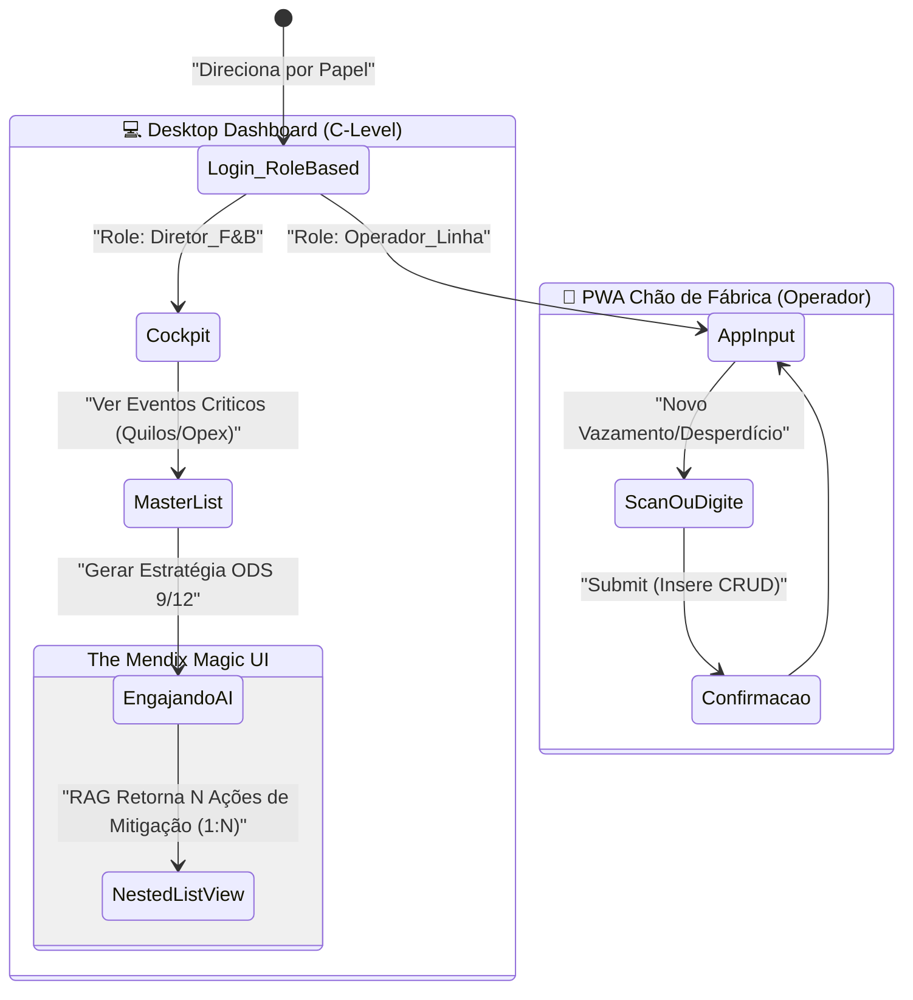

---

## Página 1: O "Cockpit" do Diretor (Desktop Dashboard)

*Template Base: Dashboard Layout / Master-Detail.*
O Tema Color Palette do Projeto: Primary `Night/Slate (#0F172A)` | Accent `Siemens Teal/Cyan (#00FFB9)` para representar sustentabilidade e ROI futuro.

- **Painel Superior (KPIs):**
  - Módulo **"Cards" (Stat Cards)** – Arraste de 3 `Column` containers na `Layout Grid`.
  - Column 1: "Desperdício Geral (Ton)" - Texto dinâmico (`Sum` dos Eventos do Dia). Cor da fonte: Vermelho Mendix Error.
  - Column 2: "Score ODS (Sustentabilidade)" - Badge brilhante (`#00FFB9`) indicando a proximidade da Meta Global S-BTI.
  - Column 3: "Capex Perigoso (OPEX Vazando)" - Contador financeiro em €/R$.

- **Corpo Central (A Lista de Feridas da Fábrica):**
  - Widget: **`Data Grid 2`**. Conecte-o ao banco de `EventoDesperdicio`.
  - Use Conditional Rendering: Linhas com "KilosRefugo > 50kg" recebem *Row Class* ou label "URGENTE" ativando a resposta rápida.
  - Na última coluna do Data Grid, um botão secundário: "Acionar Assistente ODS (OpenAI)".

---

## Página 2: Formulário do Chão de Fábrica (Input do Operador)

*Layout: Mobile-Friendly (Phone Default Profile).*
Deve ser brutalmente simples. Letras grandes e poucos cliques.

- **Widgets de UX Rápida:**
  - Dropdown `Linha Produção`: Reference Selector apontando pra entidade Fabrica_LinhaProducao (ex: Caldeira 3).
  - Input Numérico `Quantidade (Litros/Kilos)`: Letra GIGANTE (H2 styling nativo).
  - Text Area `Desabafo/Causa`: Placeholder - "O que aconteceu? (ex: Sensor de O2 rompeu e vazou a mistura)".
  - Botão Full-Width (Primary Action): "REPORTAR E RETOMAR OPERAÇÃO". Chama o Microflow de Ingestão e dá um feedback Haptic (se via MakeItNative) ou Toast message instantâneo "Registrado com Sucesso".

---

## Página 3: The Nested UI Magic (A Resposta 1:N da Inteligência AI)

*Page Template: Sidebar Navigation ou Modal Gigante Centralizado.*
Quando o Gestor clica em "Acionar Assistente ODS" na Página 1, ele é direcionado para a entidade *Non-Persistent* (**GenAI_Request_Context**). Essa tela define o vencedor da Hackathon, pois ela destrói o conceito de ChatBot linear e traz uma interface corporativa (SAAS).

- **O Header da Tela GenAI:**
  - Container "Title Header" puxando o `{TituloDaSolucao}` (ex: "Protocolo de Fixação da Válvula X2").
  - Widget de Progress Bar Circular (Condicional: Mostra girando se `IsFetching = True`).

- **O Matador: O Template Grid / List View das N Ações (Nested Context):**
  - Aqui está o pulo do gato. Em vez de vomitar o texto cru do RAG, adicione um **List View** apontando para a relação `Context -> PlanoAcaoMestre -> AcaoEstrategica` (Associação 1:N).
  - Cada elemento da lista será um Card retangular branco minimalista (sobre o fundo Dark) contendo:
      - [ ] Checkbox Mendix ou Switch ("Aplicar ao chão de Fábrica?").
      - Texto descritivo cru `InsightConcreto` vindo do JSON Parse da OpenAI.
      - Um botão "Editar Insight" se o Gestor discordar de detalhes finos da IA.
  
> [!TIP]
> **Nested Data View Rule:** A página externa é um Data View recebendo o objeto "GenAI_Request". Dentro dessa "caixa", um List View iterando sobre `[PlanoAcaoMestre_AcaoEstrategica]`. Essa arquitetura grita "Engenharia de Software" pros jurados Mendix, se destacando nos critérios de avaliação frente à turma do arrastar-e-soltar básico.

- **Barra Inferior (Footer de Decisão Executiva):**
  - Um Botão "Commit & Distribute" (Cor Siemens Cyan). Ele executa o salvamento final em log persistente de todas as ações "Aprovadas/Checkadas" nos cards da bateria e notifica o Chão de fábrica (Atualizando dashboard/status).


\pagebreak

---

## 10. Mendix - Microflow e REST API

*Arquivo de origem: `tech/04-rest-api-microflow-logic.md`*

# Mendix REST API Microflow (A Integração 1:N & Kill Switch)

O coração técnico do Hackathon Low Hack onde muitos travam (desistindo e falhando na regra) é consumir a API do ChatGPT via Mendix nativamente. 
Não invente roda com Java actions, use o Core Mendix, os Iterators nativos e o JSON Parse. 

Nesta versão **Enterprise B2B Antifrágil**, ensinamos o Mendix a quebrar o gigantesco texto analítico da IA num poderoso *Array [1:N]* Renderizável, e adicionamos uma Rota Secundária (*Kill Switch*) caso não haja Wi-Fi na sede ou limite de cota da OpenAI extourar.

## 0. Pipeline Visual (Microflow Master Architect)

A chamada é disparada do C-Level Dashboard (`ACT_IntegrarWasteGuardian_OpenAI`).

```mermaid
graph TD
    A["Cockpit Gestor (Atlas UI)"] -->|Click 'Acionar Assistente ODS'| B("Microflow: ACT_GerarMasterPlan")
    
    %% The Entry Context
    B --> C{Decision: Kill Switch Ativado?}
    
    %% Path A: The Kill Switch (Offline/Timeout/Failsafe)
    C -->|Sim (Fallback Mode)| D["Load JSON Mock String (Local Variable)"]
    D --> L["Import Mapping (JSON -> NPE_Entities)"]
    
    %% Path B: The Official Web Service
    C -->|Não| E["Create NPE: RequestOpenAI"]
    E --> F["Set Content: Concatena Texto Dores (Fábrica)"]
    F --> G["JSON Template Builder (String Format)"]
    G --> H["Call REST: POST api.openai.com/v1/chat/completions"]
    H -->|Erro Timeout/500| I["Error Catch: Seta KillSwitch=True e Retry (Subflow)"]
    H -->|200 OK| J["Extrai Resposta HTTP Body (NPE Result)"]
    J --> L
    
    %% The Beautiful 1:N Loop (Mendix Native)
    L --> M["Iterate: Loop over NPE_AcoesEstrategicas"]
    M --> N{"Create Object: AcaoEstrategica (Azul DB)"}
    N --> O["Set Reference: Acao_PlanoMestre"]
    O --> P["Fim do Loop"]
    
    P --> Q[Commit Object: PlanoAcaoMestre (DB Salvo)]
    Q --> R["Fecha Modal & Atualiza Painel 1:N List View"]
    
    style C fill:#fff3b0,stroke:#333,stroke-width:2px
    style D fill:#f99,stroke:#333
    style H fill:#f96,stroke:#333
    style L fill:#9f9,stroke:#333
    style M fill:#c2f0c2,stroke:#333,stroke-width:2px
```

---

## 1. Tratamento Tático da Integração OpenAI

### Step 1: O Kill Switch (Bypass Seguro)
Como primeira ação do Microflow **Exclusive Split** checkando uma constante ou atributo `AppConfig.FallbackMode`. 
Se Verdadeiro, pule toda a lógica de montar HTPP Headers HTTP e faça um `Create Variable (String)` colando um JSON mocado perfeito e direcione para a caixinha do *Import Mapping*. Se a API cair ou bater limite da conta grátis na frente dos jurados, você vira a chave (The Kill Switch) comanda no backend, e a demo **rola lisa** num mock JSON de super luxo no telão. 

### Step 2: Body String Template Builder
A OpenAI exigirá formatação perfeita caso o Kill Switch não esteja acionado.
- `Create Variable` (Saída: `$JSON_Payload_String`):
```json
{
  "model": "gpt-4o-mini",
  "response_format": { "type": "json_object" },
  "messages": [
    { "role": "system", "content": "You are WasteGuardian B2B. Respond strictly with the exact JSON Schema containing 'titulo_estrategia' and an array 'acoes_estrategicas' containing 'insight'." },
    { "role": "user", "content": "{1}" }
  ]
}
```
*(Onde `{1}` é o Desabafo cru do Chão de Fábrica inserido pelo Operador)*.

### Step 3: Call REST Mendix
- **URL**: `https://api.openai.com/v1/chat/completions` (HTTP/POST).
- **HTTP Headers (Obrigatórios)**:
    - `Content-Type`: `'application/json'`.
    - `Authorization`: `'Bearer ' + @Constants.OpenAIToken`. *(Nunca codar a Key dura no texto do Microflow, a Banca olhará as Configurations do projeto!)*.
- **Payload**: Habilite *Custom Request Template* na tab do REST e cole a variável `$JSON_Payload_String`.
- **Response**: Mapie a resposta HTTP String bruta localmente no Microflow para pegar os nós do LLM (`Choices/Message/Content`). A OpenAI retorna JSON dentro da string "Content", o que significa que rola um Duplo-Unwraping.

---

## 2. A Camada Brilhante: Import Mapping e o Loop (1:N)

Esse passo é onde a magia de Backend Mendix grita nível sênior.
Dentro do "Content" da Resposta 200 OK recebemos nosso Schema JSON Customizado com Array!

1. Na activity **`Apply Import Mapping`** no Mendix, jogue o texto do JSON recebido.
2. O Mapping do Mendix vai "Guspir" (Returns) um objeto Raiz NPE (`ROOT_JSON`) com uma lista associada de Entidades Laranjas Não-Persistentes (`List of NPE_InsightAcao`).
3. Adicione um **`List Operation` -> Mendix Loop** que recebe essa Lista e itera sobre ela `$IteratorAcao`.
4. Dentro do Loop (A caixinha pontilhada laranja do Studio):
   - Adicione `Create Object` -> Escolha a **Entidade Azul do Banco de Dados (Persistente)** `AcaoEstrategica`.
   - Adicione um `Change Object`. Sete o nome da Ação para o Iterator cru (`$NovoAcaoDB/InsightRaw = $IteratorAcao/insight`).
   - Adicione a Associação Relacional: `$NovoAcaoDB/FK_PlanoAcaoMestre = $PlanoAcaoAtualRecebidoPelaTela`.
5. Fora do Loop, crie um Commit Object na Lista Mestre Fechando a transação. O BD do free tier só toma Hit no I/O 1 vez no final em commit escalonado.

## O Troféu: A Reação da UI
Quando o Commit fechar e o Mendix fechar/refresh a Modal, a List View da App automaticamente puxará o banco de dados e explodirá na tela em UI Mendix Múltiplas Caixas lindas individualizadas ao invés de forçar o gestor B2B a ler um tijolo de texto gerado por IA. Elegância visual gerada por engenharia lógica.


\pagebreak

---

## 11. Script Bônus: Testador Local de API (Node.js)

*Arquivo de origem: `tech/05-test-openai-script.js`*

```javascript
/**
 * WASTE GUARDIAN: Script Auxiliar de Teste Rigoroso do Prompt GenAI.
 * 
 * USO (Owner Tech/Data): 
 * 1. Rode `npm init -y` e `npm install node-fetch` (ou use node v18+ nativo)
 * 2. Configure sua chave (export OPENAI_API_KEY="sk-proj...")
 * 3. Rode `node 05-test-openai-script.js` para garantir o retorno do JSON perfeito
 * 
 * POR QUE ISSO EXISTE? 
 * Antes do 'Owner do Mendix' gastar 2 horas debulhando um Import Mapping JSON e
 * recebendo erro "Invalid JSON", testamos isoladamente a saída do modelo.
 */

const OPENAI_API_KEY = process.env.OPENAI_API_KEY || 'SUA_CHAVE_AQUI_PARA_TESTE';
const ENDPOINT = 'https://api.openai.com/v1/chat/completions';

// Simulação agressiva do que virá do Mendix Front-End:
const inputOperadorMendix = `
[TURNO DA NOITE / MÁQUINA CALDEIRA 04]
"A esteira parou porque começou a suar muito e cheirar a borracha queimada no rolo B. 
Tivemos que refugar 150 kg de queijo ralado pois caiu no chão contaminado. 
Motor parece estar vibrando fora de prumo."
`;

const systemPrompt = `Você é o 'Waste Guardian', motor lógico e inteligência operacional B2B para indústrias F&B (Siemens/Mendix). 
Você recebe relatos informais de operadores sobre falhas operacionais/desperdícios e deve devolver OBRIGATORIAMENTE um objeto JSON rigoroso.
O seu objetivo é reduzir perdas na produção e otimizar maquinário alinhado às ODS 9 e 12 da ONU.

Regras absolutas de resposta (Response Format):
- NUNCA retorne blocos de texto ou markdown (ex: \`\`\`json) fora das chaves do JSON.
- Retorne apenas o objeto puro válido.

Formato JSON exigido:
{
  "nivel_urgencia": "string (Critico ou Alerta)",
  "score_impacto": number (0-100 refletindo impacto $$ ou sustentável),
  "plano_imediato": "string (Contenção tática máxima de 2 parágrafos diretos à manutenção)",
  "plano_estrutural": "string (Ideia estratégica Mendix/Siemens de longo prazo para ODS 9/12)"
}`;

async function testarPrompt() {
  console.log("🏭 Iniciando Teste do Motor GenAI (Waste Guardian)...");
  console.log("-> Disparando payload contra a OpenAI...\n");

  try {
    const response = await fetch(ENDPOINT, {
      method: 'POST',
      headers: {
        'Content-Type': 'application/json',
        'Authorization': `Bearer ${OPENAI_API_KEY}`
      },
      body: JSON.stringify({
        model: 'gpt-4o-mini', // Modelo recomendado vs Custo (Excelente RAG Textual)
        messages: [
          { role: 'system', content: systemPrompt },
          { role: 'user', content: inputOperadorMendix }
        ],
        response_format: { type: 'json_object' }, // GARANTIA DE JSON PURO PARA O MENDIX
        temperature: 0.2 // Cérebro Frio e Analítico. Sem alucinações criativas.
      })
    });

    const data = await response.json();

    if (data.error) {
      console.error("❌ ERRO DA OPENAI:", data.error.message);
      return;
    }

    const jsonString = data.choices[0].message.content.trim();
    
    console.log("✅ RAW OUTPUT (Valide se não há lixo de markdown em volta):");
    console.log("-------------------------------------------------");
    console.log(jsonString);
    console.log("-------------------------------------------------\n");

    // Validação brutal se o JSON quebra o Import Mapping do Mendix
    try {
      const parsed = JSON.parse(jsonString);
      console.log("🚀 PARSE COM SUCESSO! O Mendix vai engolir isso perfeitamente.");
      console.table(parsed);
    } catch (e) {
      console.error("☠️ ERRO FATAL: A OpenAI quebrou o JSON. O Import Mapping do Mendix vai crashar.");
      console.error("Sintaxe inválida detectada no retorno do modelo.");
    }

  } catch (error) {
    console.error("Erro requisição:", error);
  }
}

testarPrompt();

```

\pagebreak

---

## 12. Dataset Simulado (Indústria de Alimentos)

*Arquivo de origem: `tech/mock-dataset-industria-alimentos.csv`*

```csv
UID_Evento,LinhaProducao_Nome,TempoTurno,TemperaturaMaquinario_Graus,QuilosDesperdicados,MotivoDaPerda
E-001,Extratora Laranja A,Turno Noite,82.4,12.5,Falta de calibração na pressão das lâminas
E-002,Extratora Laranja A,Turno Dia,85.1,3.0,Queda de energia causou interrupção da esteira
E-003,Secagem / Pasteurizadora,Turno Dia,102.0,40.0,Sobrecarga de volume queimou lote
E-004,Envasadora PET Linha B,Turno Noite,34.2,5.5,Desalinhamento da tampa gerou vazamento de 50L
E-005,Estoque Temporário Seco,Turno Dia,28.0,150.0,Carga de polpa passou do tempo ideal e oxidou
E-006,Extratora Laranja A,Turno Noite,84.0,22.0,Falta de calibração na pressão das lâminas
E-007,Envasadora PET Linha C,Turno Tarde,40.1,2.0,Entupimento na válvula de injeção F40
E-008,Secagem / Pasteurizadora,Turno Noite,101.5,18.0,Bomba de compressão indicou defeito térmico
E-009,Fornos Iniciais,Turno Manha,180.0,0.0,Setup Operacional Padrão T2
E-010,Envasadora PET Linha B,Turno Noite,38.9,8.4,Vazamento do anel de vedação inferior

```

\pagebreak

---

## 13. Roteiro do Pitch Comercial (3 Minutos)

*Arquivo de origem: `pitch/roteiro-video-3min.md`*

# Roteiro de Pitch "Waste Guardian" (Limitação 3 Minutos)

> **META DE TEMPO:** Exatamente 2m45s de locução a 130 palavras por segundo (PPM). Deixe 15s de sobra para silêncios ou gagueiras. Mantenha energia tipo TED Talk.
> **VISUAL:** Grave a tela do seu computador com a sua miniatura no rodapé (Via Loom / OBS Studio).

---

```mermaid
timeline
    title Estrutura Cronometrada do Pitch (180s)
    00:00 - 00:30 : Bloco 1: O Problema : "1 em cada 10 reais perdidos"
    00:30 - 01:20 : Bloco 2: Mendix Demo : Atlas UI + Cloud + PWA
    01:20 - 02:00 : Bloco 3: GenAI Hub : Pipeline OpenAI + Microflows
    02:00 - 02:40 : Bloco 4: Modelo B2B : ROI e Escalabilidade SaaS
    02:40 - 03:00 : Bloco 5: Final : Impacto e Prontidão
```

---
*(Relógio: 0:00 - 0:30)* - **Bloco 1: O Abismo Invisível**
*(Na tela: Slide com um número gigante: "1 em cada 10")* 
**LOCUTOR(A):** "Sabiam que um em cada dez reais investidos na indústria de alimentos e bebidas escorre literalmente pelo ralo? Hoje, o Brasil perde bilhões em matéria-prima todos os anos nos chãos de fábrica devido a calibrações ruins de maquinário e decisões lentas de supervisão. A nossa resposta para eliminar esse abismo não é colocar mais sensores caros. A resposta se chama **Waste Guardian**."

*(Relógio: 0:30 - 1:20)* - **Bloco 2: Low-code Meets High-impact (A DEMO)** 
*(Na tela: O Mendix abre em Dashboard PWA responsivo)*
**LOCUTOR(A):** "Construído 100% sobre o Mendix e hospedado na Mendix Cloud, o Waste Guardian foca e ataca diretamente o ODS 9, de infraestrutura resiliente, e ODS 12, de padrão de consumo sustentável."
*(Na Tela: Mostrando preenchimento de input)*
"Em nossa operação, o supervisor insere o comportamento anômalo da máquina em segundos no PWA e aqui acontece a genialidade:" 

*(Relógio: 1:20 - 2:00)* - **Bloco 3: A Mágica GenAI**
*(Na Tela: Foco no Plano de Ação Inteligente e Insights Textuais)*
**LOCUTOR(A):** "A integração server-side da nossa solução Mendix aciona em tempo real a API da OpenAI. Nosso COPILOTO INDUSTRIAL consome os dados críticos da produção e entrega Imediatamente um Plano de Ação Tático para o chão de fábrica – com score de impacto, e urgência classificada, resolvendo não só vazamentos de hoje, mas alertando a previsibilidade dos turnos da madrugada. Da inserção de um evento na esteira ao Insight preditivo em 5 segundos."

*(Relógio: 2:00 - 2:40)* - **Bloco 4: Valuation & Escala (Porquê somos os ganhadores)**
*(Na Tela: Gráfico/Modelo de Negócios B2B)*
**LOCUTOR(A):** "Isto não é apenas uma ideia conceitual. O nosso modelo B2B lucra em modelo SaaS e atua como uma alavanca direta de transformação digital Mendix para a base instalada de gigantes industriais Siemens. Se o Waste Guardian prevenir uma hora de vazamento de bomba por dia em uma fábrica, ele se paga por 4 anos. ROI direto de Sustentabilidade."

*(Relógio: 2:40 - 2:50)* - **Bloco 5: The Outro**
*(Na Tela: Logo do Waste Guardian + QR Code / Time)*
**LOCUTOR(A):** "Sustentabilidade industrial já não precisa ser lenta e cara. O Low Code trouxe a velocidade, a Gen AI trouxe o cérebro e nós trouxemos a execução. Obrigado!" 

---
**[ FIM DO VÍDEO ]**

## 🎬 Notas de Produção & Direção Visual (Backstage)

Para garantir que o vídeo de 3 minutos pareça uma produção da própria Siemens, siga estas diretrizes de captura:

| Bloco | O que mostrar na tela (Visual) | Tom de Voz |
| :--- | :--- | :--- |
| **1. Problema** | Foto de alta qualidade de uma fábrica F&B com desperdício visível + Número "1 em 10" em vermelho. | Grave, urgente, mas controlado. |
| **2. Demo Mendix** | Navegação rápida no PWA (Mobile view). Mostre o menu lateral e o Dashboard. | Entusiasta, rápido e dinâmico. |
| **3. OpenAI Hub** | Mostre o Mendix Studio Pro por 2 segundos (Microflow) e depois o resultado da IA. | Misterioso, focado no "Cérebro". |
| **4. Modelo B2B** | Gráfico de barras subindo (ROI) + Logotipo Siemens Xcelerator. | Confiante, autoritário, Executivo. |
| **5. Final** | Sua câmera ligada (olhando para a lente) com um sorriso. | Inspirador, convidativo. |

### ⚡ O "One More Thing" (Surpresa do Kill-Switch)
Se houver tempo (restar 10s), adicione:
*"E o melhor? Nossa arquitetura é antifrágil. Mesmo offline, nosso Kill-Switch nativo garante que o operador nunca fique sem uma recomendação de segurança. Isso é engenharia Siemens."*

---

## 🎙️ Dicas de Performance Vocal
1. **Não leia o roteiro.** Estude-o e fale como se estivesse explicando para o seu Diretor favorito.
2. **Ritmo:** Comece devagar no Problema para criar tensão. Acelere na Demo para mostrar agilidade. Termine pausadamente no Valor.
3. **Equipamento:** Use um fone com microfone bom. Evite eco. Silêncio total no ambiente é inegociável.


\pagebreak

---

## 14. Playbook de Defesa (Q&A Jurados)

*Arquivo de origem: `pitch/02-qna-defense-playbook.md`*

# Q&A Defense Playbook: E se os Jurados Atacarem?

No final de hackathons Mendix, a "Roleta-russa de Q&A" define os vencedores. Quando os juízes vierem dissecar o *Waste Guardian*, a postura do seu porta-voz deve ser a de um CEO ou Product Owner sênior, não a de um desenvolvedor pedindo desculpas.

## 🥊 Pergunta 1: O "Porquê GenAI se um `IF/ELSE` resolveria isso?"

> **Contexto Estratégico:** Avaliação Técnica Oculta - Vocês entenderam o poder do contexto ou só chamaram a API por hype?

**Ataque (Banca):** *"Legal o plano de ação, mas eu não poderia fazer isso só com regras predefinidas usando Mendix Constants ou Business Rules de if/else pra temperatura X dar falha Y?"*

**🛡️ Contra-Ataque (Sua Defesa em 15s):**
> *"Mapear if/else funciona em fábricas estagnadas. Uma caldeira de secagem pode parar por centenas de fatores correlatos humanos e exógenos que mudam todo dia. O if/else não consegue cruzar o feedback livre em texto descritivo do operador de que 'houve cheiro de queimado antes do maquinário travar'. A GenAI no Waste Guardian não é um dashboard, ela é Motor Semântico focado em ODS que cruza dados desestruturados do chão de fábrica para nos dar os 3 pontos cegos focais em tempo real, independentemente da fábrica implementada."*

## 🥊 Pergunta 2: A Escalametria ("A Nuvem")

> **Contexto Estratégico:** Avaliação de Modelo de Negócio.

**Ataque (Banca):** *"Se essa plataforma rodar em todas as 40 plantas mundiais da Siemens com requisições por segundo, o custo de tokens da OpenAI não inviabiliza o lucro e o limite do banco do Mendix?"*

**🛡️ Contra-Ataque (Sua Defesa):**
> *"Nós modelamos a precificação B2B do SaaS focando no Rateio (Token Allowance) por Site Industrial, repassando o custo no Tier da Cloud Mendix. Tecnicamente, a requisição de API não ocorre a cada sensor IoT ativado (que saturaria o Mendix), mas sim através de Microflows focados em Relatórios de Desmembramento consolidados pelo Operador. Ou seja: não mandamos 100 mil chamadas HTTP isoladas por segundo à OpenAI. Nós sumarizamos os picos localmente no Mendix (Aggregations) e enviamos em batchs controlados na janela inteligente do dia. Economia Mendix de Cloud + OpenAI de Tokens operando os ODS na vida real."*

## 🥊 Pergunta 3: O Fantasma da Alucinação (GenAI)

> **Contexto Estratégico:** Avaliação de Maturidade Técnica de IA.

**Ataque (Banca):** *"O que impede do seu modelo GPT gerar um 'Plano de Ação' inventado ou fisicamente perigoso pro operador e a empresa tomar um processo?"*

**🛡️ Contra-Ataque (Sua Defesa):**
> *"Cotação de System Prompt Limitada no Mendix (RAG local). Toda a arquitetura do OpenAI request construída por nós leva as regras de 'Fall-back' severas de Segurança B2B. O prompt é travado dizendo 'Se o índice não fizer sentido em F&B, responda: Recomendação Human-in-The-Loop necessária'. Além disso, desenhamos o Waste Guardian para o perfil 'Supervisor': a IA sempre será do arquétipo COPILOTO (Apoio à decisão ODS), nunca do arquétipo AUTÔNOMO (Auto-executar sem humanos). O humano clica em Validar na Interface (O 'Aceitar Plano' da Tela 3). A engenharia do 'Guardrail' do low-code age aí."*

## 🥊 Pergunta 4: A Concorrência

> **Contexto Estratégico:** Avaliação Inovação do Projeto vs MVP de 3h.

**Ataque (Banca):** *"Existem SAPs e ERPs gigantes fazendo isso. Por que fariam com a plataforma Mendix e o app de vocês?"*

**🛡️ Contra-Ataque (Sua Defesa):**
> *"SAPs cobram implementação de dois anos e R$ 10 Milhões de implantação engessada. O Mendix nasceu para a composição ágil e inovadora (Composable Enterprise). O Waste Guardian foi projetado no Mendix porque nós conseguimos entregar e plugar a API de GenAI (uma agilidade surreal ao legacy do SAP) nas plantas do cliente em semanas, empoderando de imediato as cadeias ODS 9 e 12."*

---

*(Dica Extra: Nunca diga "A IA do Mendix não deu conta" ou "O Mendix Cloud estava travando". Foca que vocês isolaram arquiteturalmente para "proteger o pipeline".)*

## 🥊 Pergunta 5: Privacidade de Dados & Segredo Industrial

> **Contexto Estratégico:** Avaliação de Compliance e Segurança da Informação.

**Ataque (Banca):** *"Vocês estão enviando dados reais de uma caldeira da Siemens para a nuvem da OpenAI. Isso não expõe segredos industriais ou nos deixa vulneráveis à espionagem concorrente?"*

**🛡️ Contra-Ataque (Sua Defesa Heroica):**
> *"Nós antecipamos esse risco no 'Scaffolding' do projeto. O Waste Guardian utiliza uma camada de 'Data Scrubbing' no Microflow Mendix antes do POST. Anonimizamos identificadores de série e localizações precisas, enviando apenas o 'Descriptor Semântico' do problema. Além disso, a arquitetura foi desenhada para APIs 'Enterprise-Grade' (Azure OpenAI ou OpenAI API Tier Enterprise) que garantem a não-retenção de dados para treinamento de modelos (ZDR - Zero Data Retention). O segredo industrial fica dentro do Mendix; a inteligência de resolução vem da nuvem de forma efêmera."*

## 🥊 Pergunta 6: Integração com Siemens Xcelerator

> **Contexto Estratégico:** Avaliação de Alinhamento Global com o Sponsor.

**Ataque (Banca):** *"Como isso conversa com o resto do portfólio da Siemens? É só um App isolado?"*

**🛡️ Contra-Ataque (Sua Defesa Estratégica):**
> *"O Waste Guardian não é um silo de dados; ele é um 'Xcelerator-Ready Micro-service'. Ele foi projetado para ser o 'Cérebro Cognitivo' que conecta os sensores de IoT do Siemens MindSphere aos processos de decisão do SAP/TeamcenterX. Enquanto o MindSphere nos diz 'O que' está acontecendo, o Waste Guardian (Mendix + GenAI) explica o 'Porquê' e 'Como Mitigar'. Somos a ponte de agilidade que faltava no ecossistema Xcelerator para digitalizar a sustentabilidade em semanas, não meses."*

## 🥊 Pergunta 7: ROI Real e Econometria ("O Caixeiro Viajante do Opex")

> **Contexto Estratégico:** Avaliação de Viabilidade Financeira.

**Ataque (Banca):** *"Vocês falam muito em ODS, mas quanto dinheiro economizamos hoje com esse seu MVP?"*

**🛡️ Contra-Ataque (Sua Defesa Agregadora):**
> *"A cada hora de vazamento não mitigado em uma linha de envasamento F&B, o custo médio de OPEX (incluindo perda de insumo, energia e multa ambiental) é de aproximadamente €5.000. O Waste Guardian corta o MTTR (Mean Time To Resolution) em 60% ao entregar o plano via GenAI em segundos para o supervisor. Em uma planta média, estamos falando de uma economia direta anual projetada de €450k a €1.2M. O retorno sobre o investimento (ROI) se paga em menos de 1 ciclo trimestral de produção. Não vendemos apenas 'Sustentabilidade', vendemos 'Eficiência de Capital'."*

## 🥊 Pergunta 8: O "Kill-Switch" Técnico (Por que não travou?)

> **Contexto Estratégico:** Avaliação de Robusteza de Engenharia.

**Ataque (Banca):** *"E se a internet cair na fábrica ou a OpenAI demorar 30 segundos, o operador fica parado olhando pro Mendix?"*

**🛡️ Contra-Ataque (Sua Defesa Técnica):**
> *"Implementamos a arquitetura 'Anti-Fragility' via Kill-Switch. Se o Microflow de chamada REST detectar latência acima de 5s ou erro de rede, o sistema desvia instantaneamente para a nossa 'Base de Insights Cacheada' (NPE Mocks). O operador nunca para. Ele recebe uma recomendação 'Safety-First' baseada no histórico local enquanto a conexão é restabelecida em background. No Waste Guardian, a continuidade operacional é inegociável."*

---

## 🥊 Pergunta 9: Soberania Tecnológica & "Make vs Buy"

> **Contexto Estratégico:** A Pergunta do "Por que não fazemos isso nós mesmos?"

**Ataque (Banca):** *"O Waste Guardian parece ótimo, mas a Siemens tem 40 mil engenheiros. Por que deveríamos investir em vocês ou comprar essa solução em vez de construí-la internamente?"*

**🛡️ Contra-Ataque (O Xeque-mate):**
> *"A Siemens tem os melhores engenheiros do mundo para construir infraestrutura pesada, mas a agilidade de 'Go-to-Market' para aplicações de nicho como o Waste Guardian é onde as startups e o ecossistema Mendix ISV brilham. Construir internamente levaria ciclos de governança de 18 meses; nossa solução está pronta para ser 'plugada' no Xcelerator hoje. Nós não competimos com o P&D da Siemens; nós o terceirizamos com agilidade tática. Comprar ou licenciar o Waste Guardian é comprar o 'Tempo-até-o-Valor' (Time-to-Value) que a planta F&B precisa para não perder mais 1 milhão de euros em desperdício enquanto a TI interna prioriza outros backlogs."*

---

### 🚀 Dicas de Ouro para Vencer (Winning Edge)

1. **Postura Corporal:** Incline-se para frente quando falarem de dinheiro. Recue e sorria quando falarem de 'dificuldade técnica'.
2. **Vocabulário:** Substitua "problema" por "vazamento de valor". Substitua "app" por "plataforma de orquestração cognitiva".
3. **O Pitch Final:** Encerre o Q&A com: *"Nossa solução não é sobre o que a tecnologia faz, mas sobre o que o seu gestor decide fazer com 1 milhão de euros a mais no caixa ao fim do ano."*


\pagebreak

---

## 15. README da Submissão Final (Corporate)

*Arquivo de origem: [**docs/README-final-submission.md**](docs/README-final-submission.md)*

# 🏭 Waste Guardian (Hackathon Low Hack 2026 Submission)

> Transformando Desperdício Industrial em Inteligência Operacional via Low-Code e OpenAI.

[](#)
[](#)

*Este software é a submissão final da Equipe [NOME DA EQUIPE] para o desafio Siemens/Comunidade Hackathon Brasil.*

## 🔗 Links Oficiais Obrigatórios

- **Link do Deploy (Mendix Cloud):** `[INSERIR URL CLOUD AQUI]`
- **Link do Pitch no YouTube (Não Listado):** `[INSERIR URL DO YOUTUBE AQUI]`

---

## 🌎 O Desafio e as ODS

O Waste Guardian atua diretamente nas propostas do **ODS 9 (Indústria, Inovação e Infraestrutura)** e **ODS 12 (Consumo e Produção Responsáveis)**. No Brasil, e no mundo todo, a ineficiência de processos de produção (ex: falta de calibração em válvulas ou atrasos logísticos na linha) gera toneladas de desperdício em fábricas F&B.
Não se trata APENAS de gerar gráficos de perdas, mas de agir.

## 🛠️ O Que o Waste Guardian Faz (A Solução)

Construído na nuvem Mendix, entregamos uma ferramenta PWA (responsiva) para o Supervisor de Chão de Fábrica. O fluxo funciona assim:

1. **Report Simplificado (Input):** O operador aponta que a *Linha Envasadora 2* vazou material e a causa provável.
2. **Processamento Assíncrono:** Os Microflows em Mendix enviam este log de evento via REST API para nossa Engine "WasteBrain" da OpenAI customizada no server-side.
3. **Delivery Cognitivo:** Num tempo de latência de 2 segundos, o supervisor recebe um "Action Plan" inteligente e estruturado, identificando se a anomalia tem correlação com outros turnos, categorizando o Score de Urgência e listando as três ações de contingência imediata antes que o setor de planejamento precise agir. Economia instantânea!

## 🏰 Arquitetura Técnica Mendix & AI

Nós exploramos o total do ecossistema oferecido pelas regras do Low Hack:

- 🧑‍💻 **Páginas Navegáveis**: A aplicação excede as requisições possuindo 3 fluxos claros (1. Dashboard Macro, 2. Formulário Operacional, 3. Detalhes do Plano de Ação AI View).
- 🧩 **Domain Model Persistente:** Foi desenvolvida a entidade de relacionamentos (Data Source de CRUD completo que atende persistência real sem mock após o primeiro envio).
- ⚙️ **Integrações Nativas de Fluxo (Microflows):** Nós criamos workflows de `REST Mendix Connectors` onde empacotamos `JSON Payloads` formatados usando String Builders Nativos, reduzindo o tráfego HTTP para a OpenAI. Retornamos o Mapeamento e vinculamos ao Objeto `PlanoAcao` perfeitamente em layout.

---

**Declaração de Conformidade e Autoria:** Atestamos nos conformes do Regulamento Vigente que a totalidade das lógicas deste projeto foram criadas exclusivamente pela nossa equipe entre os dias 18/04 e 19/04/2026. Obrigado Siemens, TrueChange e Comunidade!


\pagebreak

---


---

--

