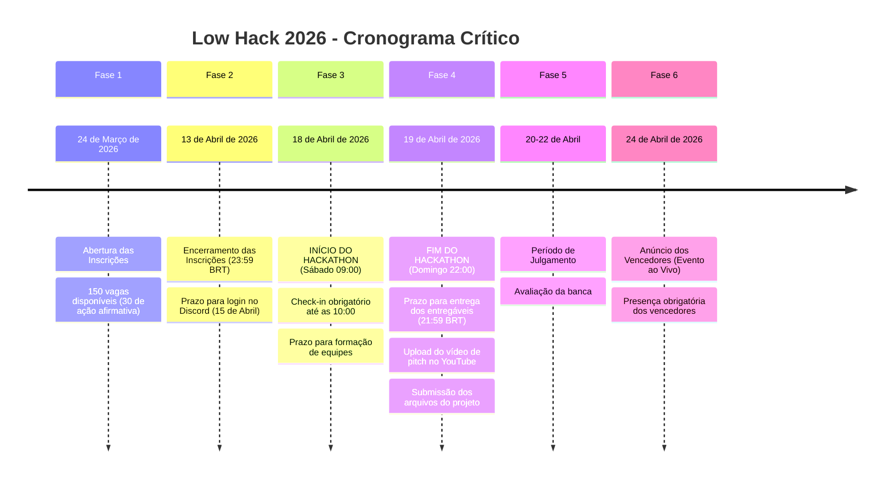
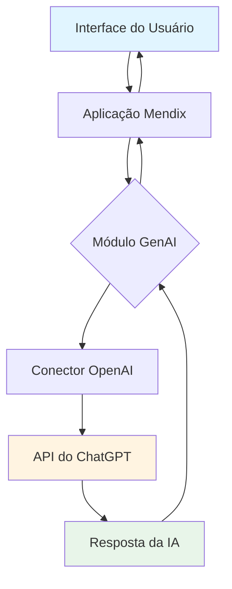
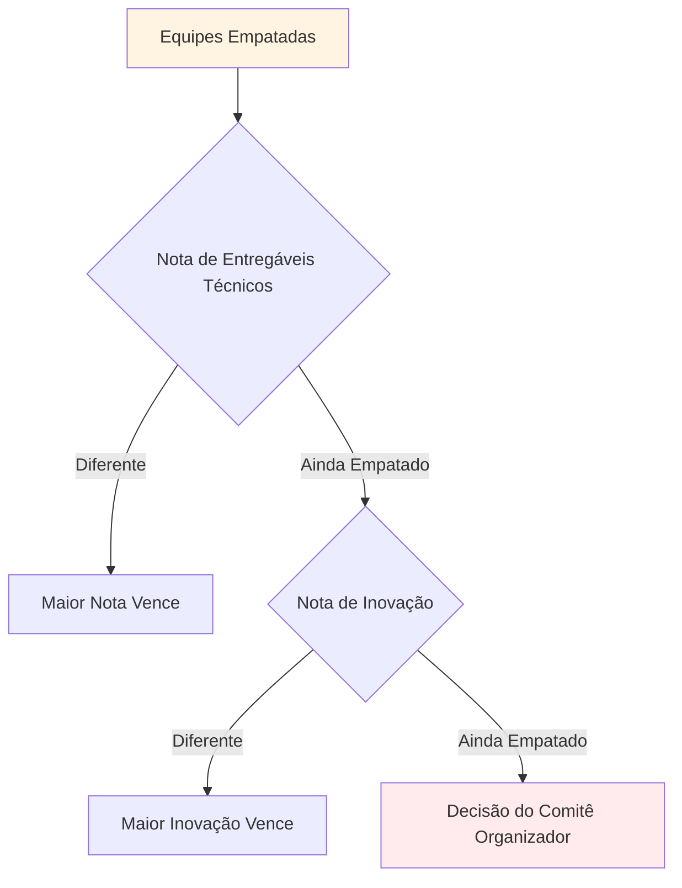
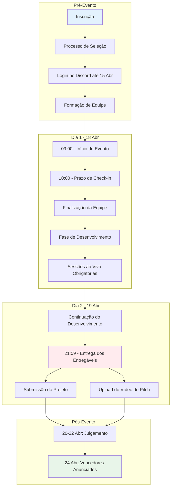

# Low Hack 2026 - Índice do Regulamento

> **Documento Oficial do Regulamento**  
> **Fonte:** https://hackathonbrasil.com.br/low-hack/  
> **PDF do Regulamento:** https://hackathonbrasil.com.br/wp-content/uploads/2026/03/regulamento-low-hack-2026-online.docx.pdf  
> **Última Atualização:** Março de 2026

---

## 📋 Sumário Executivo

O Low Hack 2026 é a **5ª edição** de um hackathon online e gratuito promovido pela **Siemens Industry Software** em parceria com a **TrueChange**, com curadoria da **Comunidade Hackathon Brasil**. O evento desafia os participantes a desenvolver soluções inovadoras usando a **plataforma low-code Mendix** combinada com **capacidades de GenAI da OpenAI**.

**Tema:** "Como podemos desenvolver soluções inovadoras que incentivem o consumo consciente e práticas de produção responsável, reduzindo o desperdício, promovendo o uso eficiente de recursos e estimulando modelos mais sustentáveis em toda a cadeia de valor?"

**Alinhamento:** Objetivos de Desenvolvimento Sustentável da ONU - **ODS 9** (Indústria, Inovação e Infraestrutura) e **ODS 12** (Consumo e Produção Responsáveis)

---

## 🗓️ Cronograma de Datas Críticas

### Detalhamento das Datas

| Data | Evento | Nível Crítico | Notas |
|------|-------|----------------|-------|
| 24 de Março de 2026 | Abertura das Inscrições | 🔴 Alto | Limitado a 150 participantes |
| 13 de Abril de 2026 | Encerramento das Inscrições | 🔴 Alto | Prazo final 23:59 BRT |
| 15 de Abril de 2026 | Prazo para Login no Discord | 🔴 Alto | Não cumprimento = cancelamento |
| 18 de Abril de 2026 | Início do Evento | 🔴 CRÍTICO | 09:00 BRT - Login necessário até 10:00 |
| 19 de Abril de 2026 | Entrega dos Entregáveis | 🔴 CRÍTICO | 21:59 BRT - Prazo improrrogável |
| 24 de Abril de 2026 | Anúncio dos Vencedores | 🟡 Médio | Evento ao vivo - Vencedores devem participar |

---

## 🎯 Escopo do Desafio

### Declaração do Desafio Primário

> **"Como podemos desenvolver soluções inovadoras que incentivem o consumo consciente e práticas de produção responsável, reduzindo o desperdício, promovendo o uso eficiente de recursos e estimulando modelos mais sustentáveis em toda a cadeia de valor?"**

### Áreas de Solução Permitidas

As equipes podem desenvolver protótipos e ideias que usem tecnologia para:

1. **Acelerar a transformação digital na indústria**
2. **Tornar os processos de produção mais eficientes e inteligentes**
3. **Reduzir o desperdício e otimizar o uso de recursos**
4. **Incentivar práticas de produção e consumo mais responsáveis**
5. **Criar soluções digitais que apoiem cadeias de produção mais sustentáveis**

### Requisitos da Stack Tecnológica

| Componente | Requisito | Obrigatório |
|-----------|-------------|-----------|
| Plataforma de Desenvolvimento | Mendix Low-Code | ✅ Sim |
| Tipo de Aplicação | Aplicação 100% Web | ✅ Sim |
| Integração de GenAI | OpenAI (API do ChatGPT fornecida) | ✅ Sim |
| Hospedagem | Mendix Cloud (Nível Gratuito) | ✅ Sim |
| Pré-desenvolvimento de Código | Proibido | 🚫 Não |

---

## 📝 Requisitos Técnicos e Restrições

### Especificações Técnicas Obrigatórias

#### 1. Estrutura da Aplicação

| Requisito | Especificação | Notas |
|-------------|---------------|-------|
| **Mínimo de Páginas** | 3+ páginas navegáveis | Exemplo: Home, Recurso Principal, Resultados |
| **Persistência de Dados** | Entidades no Domain Model | Operações CRUD necessárias |
| **Microflows** | Pelo menos 1 microflow ou nanoflow funcional | Lógica de negócio principal |
| **Responsividade** | Interface minimamente responsiva | Compatível com mobile/tablet |
| **Qualidade de UI/UX** | Interface atraente | Aparência profissional |

#### 2. Requisitos de Integração de GenAI

**A Integração de GenAI Deve Incluir:**
- Utilização da API fornecida da OpenAI/ChatGPT
- Integração funcional (não apenas decorativa)
- Tratamento de erros adequado
- Feedback claro ao usuário

#### 3. Checklist de Entregáveis

##### Entregáveis de Documentação (Seção 8.2.2)

| Item | Descrição | Prazo | Formato |
|------|-------------|----------|--------|
| Arquivos do Projeto | Projeto Mendix completo | 19 Abr, 21:59 BRT | Pasta com nome da equipe |
| Link do App | URL publicada no Mendix Cloud | 19 Abr, 21:59 BRT | Link funcional |
| Domain Model | Diagrama de relacionamento de entidades | Incluído no projeto | Modelo Mendix |

##### Requisitos do Vídeo de Pitch (Seção 8.2.3)

| Especificação | Requisito |
|---------------|-------------|
| **Duração** | Máximo de 3 minutos |
| **Formato** | Gravação de vídeo |
| **Plataforma de Upload** | YouTube (Não Listado) |
| **Envio do Link** | `link-do-video-pitch.txt` na pasta de entregáveis |
| **Prazo** | 19 de Abril de 2026, 21:59 BRT |

**Recomendações de Conteúdo do Pitch:**
- Declaração do problema (20 segundos)
- Demonstração da solução (60 segundos)
- Exibição da integração de GenAI (30 segundos)
- Modelo de negócio e escalabilidade (30 segundos)
- Destaques de inovação (20 segundos)
- Introdução da equipe (20 segundos)

---

## 🚫 Regras de Desclassificação

### Infrações de Desclassificação Absoluta

| Regra | Seção | Gravidade |
|------|---------|----------|
| **Plataforma não Mendix** | 8.4 | 🔴 CRÍTICO - Desclassificação automática |
| **Soluções Pré-desenvolvidas** | 11.9 | 🔴 CRÍTICO - Soluções desenvolvidas antes do Dia 1 |
| **Plágio/Violação de Direitos Autorais** | 11.9 | 🔴 CRÍTICO - Cópia de outras fontes |
| **Ausência em Sessões Obrigatórias** | 4.9 | 🔴 ALTO - Pelo menos 1 membro deve participar |
| **Ausência no Discord** | 4.3 | 🔴 ALTO - Não logado até as 10:00 em 18 Abr |
| **Ausência do Vencedor no Anúncio** | 8.3.2 | 🟡 MÉDIO - Vencedores devem participar do evento ao vivo |

### Desclassificação Relacionada à Conduta

| Violação | Seção | Consequência |
|-----------|---------|-------------|
| Desrespeito a organizadores/voluntários | 4.8 | Remoção imediata + desclassificação |
| Assédio (qualquer forma) | 10.1-10.2 | Remoção imediata + desclassificação |
| Comportamento antiético | 11.8 | Avaliação pelo comitê organizador |
| Conteúdo inadequado | 10.3.2 | Desclassificação + ação legal |

### Desclassificação Técnica

| Violação | Detalhes |
|-----------|---------|
| Falta de entregáveis | Falha ao enviar até 19 de Abril, 21:59 BRT |
| Aplicação não funcional | App não rodando no Mendix Cloud |
| Falta de integração de GenAI | Nenhuma utilização da API da OpenAI |
| Pitch incompleto | Vídeo com mais de 3 minutos ou ausente |
| Formato de envio errado | Não seguindo as convenções de nomeação de pasta/arquivo |

---

## 🏆 Estrutura de Premiação

| Posição | Prêmio em Dinheiro | Benefícios Adicionais |
|----------|------------|---------------------|
| **1º Lugar** | R$ 8.000,00 | Kit presente Low Hack + Certificado + Badge Siemens + 1 ano de cursos Mendix (Básico e Intermediário) |
| **2º Lugar** | R$ 5.000,00 | Kit presente Low Hack + Certificado + Badge Siemens + 1 ano de cursos Mendix (Básico e Intermediário) |
| **3º Lugar** | R$ 3.000,00 | Kit presente Low Hack + Certificado + Badge Siemens + 1 ano de cursos Mendix (Básico e Intermediário) |

**Termos de Pagamento:**
- Valores dos prêmios divididos igualmente entre os membros da equipe
- Pagamento em até 30 dias após o encerramento do evento
- Requer envio de informações da conta bancária

---

## 📊 Critérios de Pontuação (Rubrica de Julgamento)

### Escala de Pontuação
Todos os critérios pontuados de **1 a 4 pontos** (1 = Ruim, 4 = Excelente)

### Categorias de Avaliação

#### 1. **Potencial de Impacto** (8.2.5.a)
- Avalia o impacto potencial da solução no desafio proposto
- Considerações: Escala de impacto, viabilidade, sustentabilidade

#### 2. **Modelo de Negócio** (8.2.5.b)
- Analisa o modelo de negócio, escalabilidade e aplicação para resolver o desafio
- Considerações: Modelo de receita, viabilidade de mercado, potencial de crescimento

#### 3. **Aderência ao Desafio** (8.2.5.c)
- Avalia se a solução resolve efetivamente o desafio apresentado
- Considerações: Ajuste problema-solução, alinhamento com ODS 9/12

#### 4. **Inovação da Solução** (8.2.5.d)
- Avalia a inovação no uso da tecnologia e/ou mudança de processo
- Considerações: Novidade, criatividade, diferenciação

#### 5. **Apresentação da Solução** (8.2.5.e)
- Avalia a clareza, completude e aderência aos requisitos do desafio
- Considerações: Qualidade da comunicação, eficácia da demonstração, storytelling

#### 6. **Critérios Técnicos da Solução** (8.2.5.f)
- Avalia a qualidade técnica da aplicação
- **Componentes-Chave:**
  - Funcionalidade da aplicação
  - Uso efetivo de GenAI (API do ChatGPT)
  - Qualidade da integração de Conector/API
  - Qualidade da experiência do usuário (UX/UI)
  - Criatividade na combinação e implementação da tecnologia

### Critérios de Desempate (Seção 8.2.7)

**Componentes do Desempate por Entregáveis Técnicos:**
1. Interface minimamente responsiva e atraente
2. Uso de pelo menos 1 microflow ou nanoflow funcional
3. Pelo menos 3 páginas navegáveis (home, recurso principal, resultados)
4. Implementação de persistência de dados (entidades no domain model)

---

## 👥 Regras de Participação

### Elegibilidade

| Requisito | Detalhes |
|-------------|---------|
| **Nacionalidade** | Cidadãos brasileiros |
| **Idade** | 18 anos ou mais |
| **Inscrição** | 1 inscrição por CPF |
| **Período de Inscrição** | 24 de Março - 13 de Abril de 2026 |

### Composição da Equipe

| Aspecto | Especificação |
|--------|---------------|
| **Tamanho Mínimo** | 3 pessoas |
| **Tamanho Máximo** | 5 pessoas |
| **Formação** | Pré-formada ou organizada pelo comitê |
| **Composição Recomendada** | 2 desenvolvedores + 1 designer + 1 gestor de negócios |

### Ação Afirmativa (Seção 3.3.1)
- **30 vagas** reservadas para:
  - Mulheres
  - Pessoas pretas, pardas ou indígenas
  - Indivíduos LGBTQUIAPN+
  - Pessoas com deficiência

### Quem NÃO pode participar

- Funcionários da TrueChange
- Funcionários da Siemens
- Funcionários da Comunidade Hackathon Brasil

---

## 🔧 Configuração Técnica Necessária

### Requisitos do Participante

| Item | Requisito |
|------|-------------|
| **Hardware** | Laptop/notebook pessoal |
| **Internet** | Conexão estável |
| **Acesso à Plataforma** | Conta Mendix (Nível Gratuito) |
| **Comunicação** | Conta no Discord |
| **Upload de Vídeo** | Conta no YouTube |

### Configuração da Plataforma Mendix

1. **Criação de Conta:** https://www.mendix.com/
   - Nota: E-mails corporativos recomendados (Gmail/Yahoo podem ter problemas)
   - Alternativa: Usar e-mail temporário se necessário

2. **Módulos Necessários:**
   - Módulo GenAI Commons
   - Conector OpenAI
   - Módulo de Criptografia
   - Módulo Community Commons

3. **Versão do Mendix:** Studio Pro 10.24.0 ou superior

### Configuração de Integração OpenAI

- API fornecida pelos organizadores (API do ChatGPT)
- Compatível com a OpenAI Platform e Microsoft Foundry
- Suporta: Chat Completions, Image Generations, Embeddings

---

## 📜 Código de Conduta e PI

### Resumo do Código de Conduta

- **Respeito:** A todos os participantes independentemente de raça, sexo, idade, orientação, deficiência, etc.
- **Sem Assédio:** Tolerância zero para comentários ofensivos, intimidação, perseguição
- **Sem Conteúdo Sexual:** Imagens/linguagem inapropriadas proibidas
- **Conduta Profissional:** Manter comportamento profissional durante todo o evento

### Propriedade Intelectual (Seção 10.3)

| Aspecto | Regra |
|--------|------|
| **Propriedade** | As soluções permanecem como propriedade da equipe criadora |
| **Código Aberto** | Incentivado, mas não obrigatório |
| **Conteúdo de Terceiros** | Deve ter as permissões adequadas |
| **Direitos de Marketing** | Os participantes concedem licença irrevogável para uso promocional |
| **Originalidade** | O participante garante trabalho original e indeniza os organizadores |

### Conteúdo Proibido

- Material protegido por direitos autorais sem permissão
- Declarações falsas
- Conteúdo ilegal, obsceno, difamatório
- Conteúdo que promova atividades criminosas
- Vírus ou código malicioso
- Plágio ou engenharia reversa

---

## 🔄 Fluxo de Trabalho do Evento

---

## 📚 Contexto Histórico

| Ano | Tema |
|------|-------|
| 2021 | Mendix aplicado à saúde preventiva: inovação na gestão da vacinação |
| 2022 | Mendix aplicado a soluções digitais para sustentabilidade, cidades e bem-estar |
| 2023 | Como digitalizar processos ambientais com Mendix? |
| 2024 | Mendix aplicado à acessibilidade digital em escolas brasileiras |
| 2026 | Mendix impulsionado por IA aplicado à inovação na indústria |

---

## 📞 Suporte e Comunicação

### Canais Oficiais

| Canal | Propósito |
|---------|---------|
| **Discord** | Plataforma de comunicação primária |
| **E-mail** | contato@hackathonbrasil.com.br |
| **Website** | https://hackathonbrasil.com.br/low-hack |

### Regras de Comunicação Importantes

- Desative o anti-spam para o domínio @hackathonbrasil.com.br
- Toda a comunicação oficial via Discord
- Organizadores não responsáveis por informações perdidas de canais não oficiais
- Mantenha as interações da equipe nos canais oficiais para transparência

---

## ⚠️ Considerações Legais

### Disposições Gerais

| Item | Detalhe |
|------|--------|
| **Natureza do Evento** | Cultural, sem fins comerciais |
| **Direitos dos Organizadores** | Podem modificar regras e substituir prêmios por valores equivalentes |
| **Força Maior** | O evento pode ser interrompido/suspenso sem compensação |
| **Resolução de Disputas** | As decisões do comitê organizador são soberanas e finais |
| **Proteção de Dados** | Sujeito à LGPD (Lei Geral de Proteção de Dados) |

### Responsabilidade

- Participantes responsáveis por seu próprio laptop/equipamento
- Organizadores não responsáveis pelo uso de bases de dados públicas/privadas
- Participantes indenizam organizadores contra reivindicações de violação de PI

---

## ✅ Checklist Pré-Evento

### Antes do Encerramento das Inscrições (13 de Abril)

- [ ] Inscrever-se na plataforma Desafios Hackathon Brasil
- [ ] Completar todos os campos obrigatórios no formulário de inscrição
- [ ] Confirmar elegibilidade (Brasileiro, 18+)
- [ ] Entrar no servidor do Discord até 15 de Abril
- [ ] Formar ou entrar em uma equipe (3-5 membros)

### Configuração Técnica (Antes de 18 de Abril)

- [ ] Criar conta Mendix (https://www.mendix.com/)
- [ ] Instalar Mendix Studio Pro 10.24.0+
- [ ] Instalar módulos necessários (GenAI Commons, OpenAI Connector, etc.)
- [ ] Testar implantação no Mendix Cloud
- [ ] Criar conta no YouTube para upload do pitch
- [ ] Testar acesso e notificações do Discord
- [ ] Preparar ambiente de desenvolvimento

### Preparação do Dia 1 (18 de Abril)

- [ ] Entrar no Discord até as 09:00 BRT
- [ ] Completar o check-in até as 10:00 BRT
- [ ] Participar das sessões ao vivo obrigatórias
- [ ] Confirmar composição da equipe
- [ ] Iniciar o desenvolvimento

### Submissão do Dia 2 (19 de Abril)

- [ ] Completar o desenvolvimento da aplicação
- [ ] Testar todos os recursos minuciosamente
- [ ] Implantar no Mendix Cloud
- [ ] Gravar vídeo de pitch de 3 minutos
- [ ] Fazer upload do vídeo no YouTube (Não Listado)
- [ ] Preparar pasta de entregáveis com o nome da equipe
- [ ] Criar `link-do-video-pitch.txt` com a URL do YouTube
- [ ] Enviar todos os entregáveis até as 21:59 BRT

---

## 🎯 Dicas de Sucesso

### Para Implementação Técnica

1. **Comece pelo Domain Model** - Defina sua estrutura de dados primeiro
2. **Planeje seus Microflows** - Esboce a lógica de negócio antes de construir
3. **Integre GenAI Cedo** - Não deixe a integração de IA para o último minuto
4. **Teste a Responsividade** - Verifique em múltiplos tamanhos de tela
5. **Implante Frequentemente** - Teste a implantação no Mendix Cloud cedo

### Para o Vídeo de Pitch

1. **Roteiro Primeiro** - Escreva um roteiro de 3 minutos e pratique
2. **Demo Antes de Slides** - Mostre seu app funcionando, não apenas prints
3. **Destaque a GenAI** - Demonstre claramente a integração da IA
4. **Conte uma História** - Problema → Solução → Impacto
5. **Áudio de Qualidade** - Garanta um som claro em sua gravação

### Colaboração da Equipe

1. **Defina Funções Cedo** - Quem faz o quê nas 48 horas
2. **Use Controle de Versão** - Coordene o uso do team server do Mendix
3. **Comunique-se Constantemente** - Use o Discord para toda a comunicação
4. **Tenha Planos de Backup** - Prepare-se para problemas técnicos
5. **Durma e Coma** - 48 horas é muito tempo; cuidem-se

---

**Versão do Documento:** 1.0  
**Criado em:** Abril de 2026  
**Fonte:** Regulamento Oficial do Low Hack 2026  
**Mantenedor:** Equipe de Documentação de Programação Competitiva
