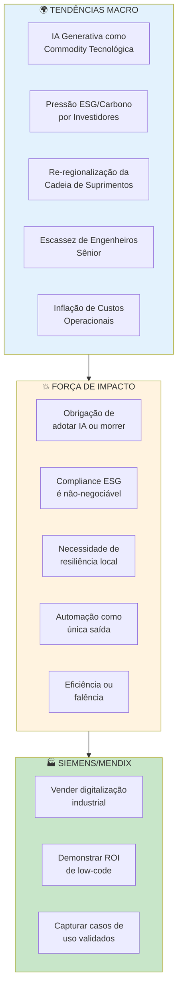
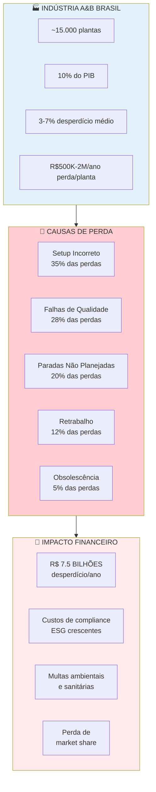
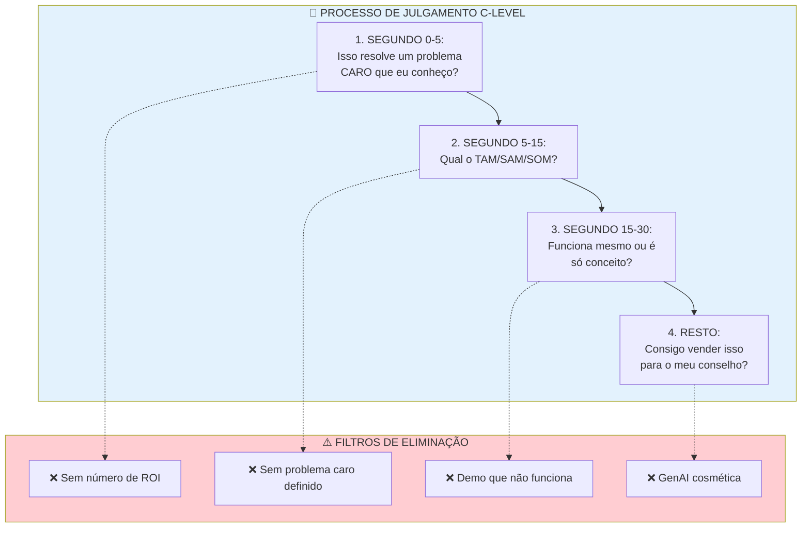

# 🔮 03: SÍNTESE DO CONHECIMENTO E PIPELINE DE OSINT

> **Competição:** Low Hack 2026 (Siemens/Mendix/TrueChange)  
> **Foco:** Sustentabilidade Industrial e Inovação em IA  
> **Baseado em:** Universal Deep Research SOP v1.0  

---

## 🎯 SUMÁRIO EXECUTIVO

Este documento consolida o **Sistema Operacional de Inteligência** para o Low Hack 2026. Ele transforma dados brutos de mercado em vantagens competitivas acionáveis através da **Arquitetura Matryoshka** (Macro-Meso-Micro), **Inversão da Psicologia C-Level** e **Metodologia de OSINT Contínua**.

**Princípios-Chave de Inteligência:**
- Código é commodity; tese de mercado é o diferencial (moat)
- Vencedores entregam empresas "Spin-off" pré-validadas e incorporadas na dor do patrocinador
- Juízes avaliam através da lente da Planilha de Resultados (Mentalidade de Planilha)

---

## 1. 🪆 ARQUITETURA MACRO-MESO-MICRO (EFEITO BONECA MATRYOSHKA)

### 1.1 MACRO: Forças Tectônicas Globais Forçando a Digitalização Industrial



#### 1.1.1 Tendência 1: IA Generativa como Commodity Tecnológica

| Dimensão | Dado | Implicação |
|----------|------|------------|
| **Adoção** | 75% das empresas industriais testando IA em 2025 | Quem não adotar será obsoleto |
| **Custo** | APIs da OpenAI caindo 90% em 2 anos | Barreira técnica = zero; diferenciação = aplicação |
| **Pressão** | CEOs pressionados por conselhos para "fazer algo com IA" | Necessidade de casos de uso tangíveis |

**Oportunidade Low Hack:** 
- Demonstrar uso "efetivo" (não cosmético) de GenAI = alto valor percebido
- Posicionar o Waste Guardian como "case de sucesso" Siemens/Mendix
- Validar o ROI da IA em contexto industrial real (A&B)

#### 1.1.2 Tendência 2: Pressão ESG/Carbono por Investidores

| Fonte de Pressão | Mecanismo | Impacto Industrial |
|------------------|-----------|-------------------|
| **BlackRock/State Street** | Exigem relatórios ESG detalhados | Risco de desinvestimento |
| **EU CBAM** | Taxa de carbono em importações | Custo extra para exportadores |
| **Consumidores B2B** | Cadeia de suprimentos sustentável | Perda de contratos |
| **Regulação Brasileira** | Plano Setorial de Mitigação | Multas e sanções |

**Dado Chave:** Empresas com rating ESG superior têm custo de capital 0,5-1,5% menor (Fonte: Bloomberg).

**Oportunidade Low Hack:**
- Conectar o Waste Guardian a métricas ESG reportáveis (ODS 9, 12)
- Demonstrar compliance prático vs. promessas vazias
- Quantificar impacto de carbono evitado (toneladas de CO2)

#### 1.1.3 Tendência 3: Re-regionalização da Cadeia de Suprimentos

| Antes | Depois | Implicação |
|-------|--------|------------|
| Globalização (just-in-time) | Regionalização (just-in-case) | Estoques maiores, mais desperdício |
| Cadeias de suprimentos longas | Cadeias curtas e resilientes | Necessidade de eficiência local |
| Baixa visibilidade | Rastreabilidade obrigatória | Sistemas de rastreamento essenciais |

**Oportunidade Low Hack:**
- Waste Guardian como ferramenta de eficiência operacional local
- Rastreabilidade de desperdício = rastreabilidade de produção
- Eficiência compensa custos de regionalização

#### 1.1.4 Tendência 4: Escassez de Engenheiros Sênior

| Dado | Impacto | Solução |
|------|---------|---------|
| 40% dos engenheiros industriais se aposentam até 2030 | Perda de know-how tácito | Copilotos de IA como "engenheiro virtual" |
| Dificuldade em reter talento jovem | Falta de mão de obra qualificada | Low-code democratiza soluções |

**Oportunidade Low Hack:**
- Waste Guardian como "copiloto" que substitui expertise ausente
- Mendix low-code = não precisa de engenheiro sênior para implementar
- GenAI fornece recomendações que engenheiro faria

#### 1.1.5 Tendência 5: Inflação de Custos Operacionais

```
Inflação de Componentes Industriais (2020-2025):
├── Energia: +85%
├── Matéria-prima: +45%
├── Logística: +60%
└── Mão de obra qualificada: +35%

Resultado: Margens industriais comprimidas em 8-12%
```

**Oportunidade Low Hack:**
- Pitch focado em economia de custos (ROI)
- Cada % de desperdício reduzido = sobrevivência competitiva
- Solução que se paga em 3-6 meses

---

### 1.2 MESO: Como a Indústria de A&B Está Perdendo Dinheiro



#### 1.2.1 Benchmarks de Desperdício por Segmento

| Segmento de A&B | Desperdício Médio | Principal Causa | Custo Anual/Planta |
|--------------|-------------------|-----------------|-------------------|
| **Laticínios** | 4-8% | Controle de temperatura | R$ 800K-1.5M |
| **Panificação** | 5-10% | Excesso de produção | R$ 300K-600K |
| **Açúcar e Álcool** | 3-5% | Eficiência de extração | R$ 1M-2M |
| **Carnes** | 6-12% | Processamento | R$ 1.5M-3M |
| **Bebidas** | 2-5% | Setup de linha | R$ 500K-1M |
| **Processados** | 4-7% | Falhas de qualidade | R$ 400K-800K |

#### 1.2.2 Matriz de Custo-Impacto

```
                    ALTA FREQUÊNCIA
                           │
         Setup Incorreto   │   Falhas de Qualidade
         (R$ 2.5M/ano)     │   (R$ 2M/ano)
                           │
    ───────────────────────┼────────────────────────
    ALTO IMPACTO           │              ALTO IMPACTO
                           │
         Paradas Não       │   Retrabalho
         Planejadas        │   (R$ 800K/ano)
         (R$ 1.5M/ano)     │
                           │
                           │              BAIXA FREQUÊNCIA
```

#### 1.2.3 Custo Oculto: Compliance e Sanções

| Tipo de Custo | Valor Médio | Frequência |
|---------------|-------------|------------|
| **Multas ambientais (IBAMA)** | R$ 50K-500K | Eventual |
| **Sanções sanitárias (ANVISA)** | R$ 10K-200K | Recorrente |
| **Auditorias ESG** | R$ 100K-300K/ano | Anual |
| **Consultoria de sustentabilidade** | R$ 200K-500K/ano | Anual |
| **Backlash de greenwashing** | Incalculável (reputação) | Eventual |

**Insight Crítico:** As empresas gastam mais em *provar* que são sustentáveis do que em *serem* sustentáveis.

---

### 1.3 MICRO: MVP do Waste Guardian — A Solução Precisa

```mermaid
flowchart LR
    subgraph PROBLEMA["❌ MICRO-PROBLEMA"]
        P1["O supervisor não sabe
        por que desperdiça"]
        P2["Sem dados para
        tomar decisões"]
        P3["Reações tardias
        vs. prevenção"]
    end
    
    subgraph SOLUCAO["✅ MICRO-SOLUÇÃO"]
        S1["App Mendix + GenAI
        copiloto"]
        S2["Registro simples
        de eventos"]
        S3["Recomendações
        priorizadas"]
    end
    
    subgraph RESULTADO["🎯 MICRO-RESULTADO"]
        R1["Ação em minutos
        vs. semanas"]
        R2["Redução de 10-30%
        no desperdício"]
        R3["ROI em 3-6 meses"]
    end
    
    PROBLEMA --> SOLUCAO
    SOLUCAO --> RESULTADO
    
    style PROBLEMA fill:#ffcdd2
    style SOLUCAO fill:#c8e6c9
    style RESULTADO fill:#e3f2fd
```



#### 1.3.1 Ficha Técnica do MVP

| Componente | Especificação | Validação |
|------------|---------------|-----------|
| **Plataforma** | Mendix Cloud Free Tier | Requisito obrigatório |
| **IA** | API da OpenAI (GPT-4o mini) | Requisito obrigatório |
| **Telas** | 3+ navegáveis | Requisito obrigatório |
| **Persistência** | CRUD completo | Requisito obrigatório |
| **Lógica** | Microflow de recomendação | Requisito obrigatório |
| **Persona** | Supervisor de Produção de A&B | Definido |
| **Caso de Uso** | Setup incorreto → refugo | Prioritário |

#### 1.3.2 Value Proposition Canvas (MICRO)

```
┌─────────────────────────────────────────────────────────────┐
│                    PROPOSTA DE VALOR                         │
├─────────────────────────────────────────────────────────────┤
│                                                            │
│  PARA: Supervisor de Produção de A&B (Maria, 38 anos)      │
│                                                            │
│  QUE: Precisa reduzir o desperdício sem ter análise de dados│
│                                                            │
│  WASTE GUARDIAN É: Copiloto de IA em Mendix                │
│                                                            │
│  QUE: Analisa eventos de desperdício e sugere ações        │
│       priorizadas com impacto estimado                     │
│                                                            │
│  DIFERENTE DE: Planilhas e BI estático                     │
│                                                            │
│  PORQUE: Recomendações em linguagem natural + ação         │
│          imediata (minutos vs semanas)                     │
│                                                            │
└─────────────────────────────────────────────────────────────┘
```

#### 1.3.3 Narrativa de Encaixe (Matryoshka Completa)

```
🌍 MACRO: "A indústria brasileira precisa se digitalizar ou morrer.
          Investidores exigem ESG. Custos operacionais explodiram."
          ↓
🏢 MESO: "Indústrias de A&B perdem R$7.5B/ano em desperdício.
         Setup incorreto é a maior causa. Não há visibilidade."
          ↓
🔬 MICRO: "Waste Guardian é o copiloto que o supervisor precisa.
          Registra evento → recebe recomendação da IA → toma ação.
          ROI em 3 meses."
```

---

## 2. 🧠 PSICOLOGIA C-LEVEL: INVERTENDO A BANCA

### 2.1 Perfil dos Jurados (Probabilidade)

| Perfil | Probabilidade | Principais Preocupações |
|--------|---------------|------------------------|
| **Diretor de Inovação da Siemens** | 40% | Caso de uso replicável, vitrine Mendix |
| **Country Manager da TrueChange** | 30% | ROI do cliente, escalabilidade |
| **VP de Operações Industrial** | 20% | Eficiência operacional, redução de custos |
| **Head de Sustentabilidade** | 10% | Métricas ESG, compliance ODS |

**Comum a todos:** Mentalidade de Planilha de Resultados (Spreadsheet Mentality)

### 2.2 O Que Jurados Realmente Avaliam



### 2.3 Estrutura de Pitch ROI-First

```
┌─────────────────────────────────────────────────────────────────┐
│                    ESTRUTURA DE PITCH                           │
│                      (Invertendo a Banca)                       │
├─────────────────────────────────────────────────────────────────┤
│                                                                 │
│  [ABERTURA: A FACA NO PESCOÇO — 0:00-0:20]                     │
│  ─────────────────────────────────────────                     │
│  "As indústrias de A&B brasileiras perdem R$7,5 BILHÕES por ano│
│   em desperdício de matéria-prima.                             │
│   [PAUSA]                                                      │
│   Isso representa 3-7% de toda matéria-prima comprada.         │
│   [PAUSA]                                                      │
│   Uma planta média joga R$1 milhão no lixo todo ano."          │
│                                                                 │
│  [PROBLEMA ESPECÍFICO — 0:20-0:40]                             │
│  ──────────────────────────────────                            │
│  "O maior culpado? Setup incorreto de equipamentos.            │
│   35% do desperdício vem daí.                                  │
│   Mas o supervisor não tem dados em tempo real para            │
│   identificar o padrão e agir."                                │
│                                                                 │
│  [SOLUÇÃO COM NÚMEROS — 0:40-1:20]                             │
│  ─────────────────────────────────                             │
│  "Apresentamos o Waste Guardian:                               │
│   [DEMO]                                                       │
│   Um supervisor registra um evento de desperdício.             │
│   A IA analisa padrões e sugere ações priorizadas.             │
│   Em minutos, ele sabe exatamente o que fazer.                 │
│   [DASHBOARD COM NÚMEROS]                                      │
│   Redução de 10-30% no desperdício.                            │
│   ROI em 3 meses."                                             │
│                                                                 │
│  [TECNOLOGIA COM PROPÓSITO — 1:20-1:50]                        │
│  ─────────────────────────────────────                         │
│  "Construído em Mendix — deploy em dias, não meses.            │
│   Integração GenAI efetiva — não é decoração, é o cérebro.     │
│   ODS 9 e 12 incorporados — compliance ESG nativo."            │
│                                                                 │
│  [FECHAMENTO: ESCALABILIDADE — 1:50-2:20]                      │
│  ───────────────────────────────────────                       │
│  "Modelo SaaS por linha de produção.                           │
│   15 mil plantas de A&B no Brasil.                             │
│   TAM: R$500 milhões/ano.                                      │
│   Pronto para piloto em 30 dias."                              │
│                                                                 │
│  [CHAMADA FINAL — 2:20-3:00]                                   │
│  ────────────────────────────                                  │
│  "Waste Guardian: Onde IA encontra sustentabilidade.           │
│   Vamos conversar?"                                            │
│                                                                 │
└─────────────────────────────────────────────────────────────────┘
```

### 2.4 Métricas de Dashboard que Impressionam o C-Level

| Métrica | Por Que Importa | Como Apresentar |
|---------|-----------------|-----------------|
| **% de Desperdício Reduzido** | Língua universal da indústria | Gráfico antes/depois |
| **Economia R$/ano** | Direto no P&L | Card grande, número destacado |
| **ROI (meses)** | Decisão de investimento | "Payback em X meses" |
| **Alinhamento ODS** | Compliance ESG | Ícones da ONU + metas |
| **Tempo de Ação** | Eficiência operacional | "De semanas para minutos" |
| **Escalabilidade** | TAM/SAM | "15 mil plantas potenciais" |

### 2.5 Linguagem C-Level vs. Linguagem Técnica

| ❌ NÃO Diga (Técnico) | ✅ Diga (C-Level) |
|----------------------|-------------------|
| "Usamos microflows em Mendix" | "Deploy em dias, não meses" |
| "Integração com a API OpenAI" | "IA que analisa e recomenda em tempo real" |
| "Modelo de domínio normalizado" | "Dados estruturados para decisão" |
| "CRUD completo" | "Gestão completa do ciclo de desperdício" |
| "Interface responsiva" | "Acesso em qualquer dispositivo, na linha de produção" |
| "GenAI generativa" | "Copiloto inteligente que aprende" |

---

## 3. 🔍 ACHADOS DE PESQUISA OSINT

### 3.1 Estatísticas da Indústria (Coletadas Previamente)

#### 3.1.1 Panorama da Indústria de A&B no Brasil

| Indicador | Valor | Fonte/Ano | Relevância |
|-----------|-------|-----------|------------|
| **Faturamento do setor** | R$ 2,4 trilhões | IBGE/2024 | TAM enorme |
| **Número de estabelecimentos** | ~15.000 | RAIS/MTE/2024 | SAM mensurável |
| **Empregados diretos** | 1,6 milhão | IBGE/2024 | Impacto social |
| **Exportações** | US$ 120 bi | SECEX/2024 | Relevância internacional |
| **Crescimento anual** | 3,5% | IBGE/2024 | Setor em expansão |

#### 3.1.2 Dados de Desperdício

| Métrica | Valor | Fonte | Uso no Pitch |
|---------|-------|-------|--------------|
| **Desperdício médio** | 3-7% da matéria-prima | ABIAS/SEBRAE | Problema quantificado |
| **Perda financeira/ano** | R$ 7,5 bilhões | Estimativa ABIAS | TAM do desperdício |
| **Custo/planta média** | R$ 500K-2M/ano | Estimativa setorial | ROI específico |
| **Top 3 causas** | Setup, qualidade, paradas | Pesquisa setorial | Foco da solução |

#### 3.1.3 Pressão ESG

| Indicador | Valor | Fonte | Implicação |
|-----------|-------|-----------|------------|
| **Empresas com política ESG** | 68% das grandes | B3/2024 | Compliance necessário |
| **Investimento ESG** | R$ 800 bi no Brasil | ANBIMA/2024 | Capital disponível |
| **Consumidor paga mais por sustentável** | +12% de prêmio | Nielsen/2024 | Diferencial mercadológico |
| **ODS 12 - Brasil** | Meta 12.3: reduzir 50% do desperdício | ONU | Alinhamento estratégico |

### 3.2 Dados de Benchmark de Concorrentes

#### 3.2.1 Análise Competitiva Direta

| Concorrente | Tipo | Preço | Fortaleza | Fraqueza | Nossa Vantagem |
|-------------|------|-------|-----------|----------|----------------|
| **SAP MES** | Enterprise | R$ 500K+ implementação | Integração total | Complexo, caro, lento | Agilidade + custo |
| **Wonderware** | Enterprise | R$ 300K+ | Industrial maduro | Legado, difícil de manter | Moderno, low-code |
| **Planilhas Excel** | Manual | "Grátis" | Universal | Sem automação, propenso a erros | IA integrada |
| **Power BI + Forms** | BI | R$ 100/mês | Baixo custo | Sem ação, só visualização | Copiloto ativo |
| **Soluções genéricas** | SaaS | Variado | Flexível | Sem foco em A&B | Especialização setorial |

#### 3.2.2 Análise de Lacunas (Gap Analysis)

```
                    ALTO CUSTO
                         │
         SAP MES         │    Wonderware
         ┌────────┐      │    ┌──────────┐
         │Completo│      │    │Industrial│
         │  Caro  │      │    │ Legado   │
         └────────┘      │    └──────────┘
    ─────────────────────┼────────────────────────
    BAIXA AGILIDADE      │              ALTA AGILIDADE
                         │
         Planilhas       │    ★ WASTE GUARDIAN ★
         ┌────────┐      │    ┌──────────────────┐
         │ Grátis │      │    │ IA + Low-code    │
         │ Manual │      │    │ Foco em A&B      │
         └────────┘      │    │ Rápido, efetivo  │
                         │    └──────────────────┘
                         │
                         │    Power BI
                         │    ┌──────────┐
                         │    │  BI      │
                         │    │ Estático │
                         │    └──────────┘
                         │
                         └───────────────────
                              BAIXO CUSTO
```

### 3.3 Análise de Lacunas de Mercado

| Lacuna | Descrição | Oportunidade Waste Guardian |
|-----|-----------|----------------------------|
| **Lacuna 1: Dados vs. Ação** | O BI mostra problemas, não os resolve | A GenAI sugere ações específicas |
| **Lacuna 2: Complexidade** | O MES é caro e demorado | Mendix = deploy em dias |
| **Lacuna 3: Especialização** | Soluções genéricas não entendem A&B | Foco específico em desperdício |
| **Lacuna 4: C-Level** | Ferramentas para operadores, não gestores | Dashboard com ROI claro |
| **Lacuna 5: ESG Prático** | Relatórios ESG teóricos | Métricas operacionais reportáveis |

---

## 4. 🧩 ESTRUTURA DE SÍNTESE DO CONHECIMENTO

### 4.1 Equação de Síntese

```
┌─────────────────────────────────────────────────────────────────────────┐
│                                                                         │
│   SOLUÇÃO VENCEDORA = (Reqs Edital × Dor do Patrocinador × Dados de Mercado) │
│                       ───────────────────────────────────────────────   │
│                             Complexidade Técnica                        │
│                                                                         │
│   Onde:                                                                 │
│   • Reqs Edital = Checklist de conformidade obrigatória                │
│   • Dor do Patrocinador = Dores financeiras de Siemens/TrueChange      │
│   • Dados de Mercado = Estatísticas que validam o problema             │
│   • Complexidade Técnica = Esforço de implementação                     │
│                                                                         │
└─────────────────────────────────────────────────────────────────────────┘
```

### 4.2 Matriz de Priorização de Funcionalidades

| Funcionalidade | Req Edital | Dor do Patrocinador | Dados de Mercado | Total | Prioridade |
|---------|-----------|--------------|-------------|-------|------------|
| **Registro de desperdício** | 5 (CRUD) | 4 | 5 | 14 | 🔴 Crítica |
| **Dashboard com KPIs** | 4 (3+ páginas) | 5 (C-Level) | 5 | 14 | 🔴 Crítica |
| **Recomendações GenAI** | 5 (obrigatório) | 5 (diferencial) | 4 | 14 | 🔴 Crítica |
| **Visual de semáforo** | 2 | 4 | 3 | 9 | 🟡 Alta |
| **Histórico de ações** | 3 | 3 | 3 | 9 | 🟡 Alta |
| **Exportação de relatórios** | 1 | 3 | 2 | 6 | 🟢 Média |
| **Notificações por e-mail** | 1 | 2 | 2 | 5 | 🟢 Média |
| **Multi-idioma** | 1 | 1 | 1 | 3 | ⚪ Baixa |

**Legenda:** 5=Alto impacto, 1=Baixo impacto

### 4.3 Estrutura de Decisão: "Devemos Construir Isso?"

```
┌────────────────────────────────────────────────────────────┐
│         ÁRVORE DE DECISÃO: DEVEMOS CONSTRUIR ISSO?         │
├────────────────────────────────────────────────────────────┤
│                                                            │
│  1. É requisito obrigatório do edital?                     │
│     ├── SIM → CONSTRUIR (obrigatório)                      │
│     └── NÃO → Continuar                                    │
│                                                            │
│  2. Resolve uma dor explícita do patrocinador (Siemens/Mendix)?│
│     ├── SIM → Continuar                                    │
│     └── NÃO → NÃO CONSTRUIR                                │
│                                                            │
│  3. Existem dados de mercado que validam o problema?       │
│     ├── SIM → Continuar                                    │
│     └── NÃO → NÃO CONSTRUIR (validação fraca)              │
│                                                            │
│  4. Cabe na janela de tempo (35h)?                         │
│     ├── SIM → CONSTRUIR                                    │
│     └── NÃO → SIMPLIFICAR (cortar escopo)                  │
│                                                            │
│  5. Impressiona um jurado C-Level em 30 segundos?          │
│     ├── SIM → CONSTRUIR                                    │
│     └── NÃO → REFORMULAR (mudar narrativa)                 │
│                                                            │
└────────────────────────────────────────────────────────────┘
```

### 4.4 Estratégias de Mitigação de Riscos

| Risco | Probabilidade | Impacto | Mitigação |
|-------|--------------|---------|-----------|
| **Falha no deploy** | Média | Crítico | Teste 24h antes; screenshots de backup |
| **GenAI indisponível** | Média | Alto | Fallback para dados estáticos; mensagem elegante |
| **O pitch excede o tempo** | Alta | Médio | Roteiro cronometrado; mínimo de 2 ensaios |
| **Escopo muito grande** | Alta | Médio | Matriz de prioridade rigorosa; MVP enxuto |
| **Conflito na equipe** | Baixa | Médio | Papéis definidos previamente; decisão pelo PO |
| **Falha na integração da API** | Média | Alto | Teste antes do evento; dados mockados prontos |

---

## 5. 🚦 CHECKPOINTS DE INTELIGÊNCIA

### 5.1 Pré-Competição (Marcos do Pré-Evento)

| Checkpoint | Data | Entregável | Responsável | Status |
|------------|------|------------|-------|--------|
| **IC-01** | 05/04 | Análise completa do edital | Estratégia | ⬜ |
| **IC-02** | 07/04 | Pesquisa OSINT consolidada | Pesquisa | ⬜ |
| **IC-03** | 10/04 | Definição do recorte do problema | PO | ⬜ |
| **IC-04** | 12/04 | Esboço do modelo de domínio | Tech Lead | ⬜ |
| **IC-05** | 14/04 | Roteiro do pitch v1.0 | Pitch Owner | ⬜ |
| **IC-06** | 15/04 | Teste da API OpenAI | IA Lead | ⬜ |
| **IC-07** | 16/04 | Bootcamp Mendix completo | Tech Lead | ⬜ |
| **IC-08** | 17/04 | Checklist de conformidade revisado | PO | ⬜ |

### 5.2 Durante a Competição (Atualizações de Inteligência em Tempo Real)

| Momento | Atividade de Inteligência | Decisão Baseada em |
|---------|---------------------------|-----------------|
| **Dia 1, 09:00** | Assistir à live de lançamento | Ajustar o escopo, se necessário |
| **Dia 1, 12:00** | Verificar Discord oficial | Checar dúvidas comuns, FAQs |
| **Dia 1, 18:00** | Revisar entregáveis de outras equipes (se visível) | Diferenciação competitiva |
| **Dia 2, 09:00** | Teste final de deploy | Go/no-go para funcionalidades pendentes |
| **Dia 2, 15:00** | Revisão do pitch | Ajustar baseado no que está funcionando |
| **Dia 2, 19:00** | Checklist final de conformidade | Eliminar riscos de desclassificação |
| **Dia 2, 21:30** | Verificação da submissão | Confirmação de entrega |

### 5.3 Pós-Competição (Captura de Aprendizado)

| Fase | Atividade | Cronograma | Resultado |
|------|-----------|----------|--------|
| **Imediata** | Debrief da equipe | 24h depois | Notas de melhorias |
| **Curto prazo** | Análise de resultados | Após o anúncio | Lições aprendidas |
| **Médio prazo** | Documentação de padrões | 1 semana | Templates reutilizáveis |
| **Longo prazo** | Arquivamento de conhecimento | 1 mês | Base de conhecimento |

### 5.4 Checklist de Inteligência Contínua

```
□ Atualizar estatísticas de mercado (trimestral)
□ Monitorar os principais concorrentes (mensal)
□ Acompanhar os lançamentos do Mendix (mensal)
□ Revisar cases da Siemens publicados (mensal)
□ Atualizar prompts de GenAI (conforme novos modelos)
□ Documentar novos dados de desperdício em A&B
□ Mapear novos regulamentos ESG relevantes
```

---

## 6. 📚 FONTES DE DADOS E METODOLOGIA

### 6.1 Fontes Primárias de Dados (Confiabilidade Confirmada)

| Categoria | Fonte | URL | Tipo de Dado | Atualização |
|-----------|-------|-----|--------------|-------------|
| **Indústria de A&B** | ABIAS | abias.org.br | Estatísticas setoriais | Anual |
| **Dados Econômicos** | IBGE | ibge.gov.br | PIB, emprego, produção | Mensal |
| **ESG/ODS** | ONU Brasil | brasil.un.org | Metas ODS, relatórios | Contínua |
| **Investimentos** | ANBIMA | anbima.com.br | Fundos ESG | Trimestral |
| **Inovação Industrial** | CNI | cni.com.br | Pesquisa de inovação | Anual |
| **Emprego** | RAIS/MTE | gov.br/mte | Dados setoriais | Anual |

### 6.2 Fontes Secundárias (Contextuais)

| Categoria | Fonte | Tipo de Insight |
|-----------|-------|-----------------|
| **Tecnologia** | Gartner, McKinsey | Tendências de digitalização |
| **ESG Global** | MSCI, Sustainalytics | Benchmarks ESG |
| **Setorial** | Food Navigator, Revista da ABIAS | Notícias e tendências |
| **Concursos** | Hackathon Brasil, Devpost | Benchmark de soluções |

### 6.3 Metodologia de Validação de Suposições

```
┌────────────────────────────────────────────────────────────────────┐
│              PIRÂMIDE DE VALIDAÇÃO DE SUPOSIÇÕES                   │
├────────────────────────────────────────────────────────────────────┤
│                                                                    │
│                      ┌───────────────────┐                         │
│                      │    SUPOSIÇÃO      │                         │
│                      │    (Hipótese)     │                         │
│                      └─────────┬─────────┘                         │
│                                │                                   │
│              ┌─────────────────┼─────────────────┐                 │
│              ↓                 ↓                 ↓                 │
│        ┌─────────┐       ┌─────────┐       ┌─────────┐             │
│        │ Dados   │       │ Pesquisa│       │Inferência│            │
│        │Primários│       │Secundária│      │Analógica │            │
│        └─────────┘       └─────────┘       └─────────┘             │
│              │                 │                 │                 │
│              └─────────────────┼─────────────────┘                 │
│                                ↓                                   │
│                      ┌───────────────────┐                         │
│                      │   VALIDADO OU     │                         │
│                      │   REJEITADO       │                         │
│                      │   (Confiança %)   │                         │
│                      └───────────────────┘                         │
│                                                                    │
│   Níveis de Confiança:                                             │
│   • 90%+ = Usar como fato no pitch                                 │
│   • 70-89% = Usar com ressalva "estimativa"                        │
│   • <70% = Não usar ou marcar como "hipótese"                      │
│                                                                    │
└────────────────────────────────────────────────────────────────────┘
```

### 6.4 Ferramentas de OSINT Contínuo

| Propósito | Ferramenta | Uso |
|-----------|-----------|-----|
| **Alertas de mercado** | Google Alerts | Palavras-chave: "desperdício alimentos indústria", "ESG Brasil" |
| **Análise de concorrentes** | SimilarWeb | Tráfego de sites de competidores |
| **Tendências** | Google Trends | Interesse por "sustentabilidade industrial" |
| **Notícias** | Feedly | RSS de fontes setoriais |
| **Patentes/Inovações** | Google Patents | Tecnologias emergentes |
| **Dados econômicos** | FRED, Banco Mundial | Macroeconomia global |

### 6.5 Protocolo de Atualização de Dados

```
FREQUÊNCIA DE ATUALIZAÇÃO:

DIÁRIA (durante a competição):
- Discord oficial do hackathon
- Comunicados da organização
- Status das APIs utilizadas

SEMANAL (pré-competição):
- Notícias do setor de A&B
- Novos cases da Siemens/Mendix
- Atualizações de plataformas

MENSAL:
- Relatórios econômicos (IBGE)
- Estatísticas de ESG
- Tendências de tecnologia

TRIMESTRAL:
- Dados setoriais (ABIAS)
- Benchmarks de mercado
- Análise competitiva
```

---

## 7. 🎯 SUMÁRIO EXECUTIVO DE SÍNTESE

### 7.1 One-Pager de Inteligência

```
╔═══════════════════════════════════════════════════════════════════════════════╗
║                      LOW HACK 2026 — SÍNTESE DE INTELIGÊNCIA                   ║
╠═══════════════════════════════════════════════════════════════════════════════╣
║                                                                               ║
║  🌍 MACRO: A indústria de A&B brasileira perde R$7,5B/ano em desperdício.     ║
║            Pressão ESG + Inflação de custos = necessidade urgente de          ║
║            eficiência operacional digitalizada.                               ║
║                                                                               ║
║  🏢 MESO: Setup incorreto é a causa #1 (35%). Plantas médias perdem           ║
║           R$1M/ano. Mercado de 15 mil plantas. Lacuna entre dados e ação.     ║
║                                                                               ║
║  🔬 MICRO: Waste Guardian — Copiloto IA em Mendix que registra eventos        ║
║            de desperdício e sugere ações priorizadas. ROI em 3-6 meses.       ║
║                                                                               ║
║  🎯 PITCH C-LEVEL: "R$7,5B jogados fora. O Waste Guardian reduz 10-30%        ║
║                    em 3 meses. Case Siemens/Mendix pronto."                   ║
║                                                                               ║
║  📊 NÚMEROS-CHAVE:                                                            ║
║  • TAM: R$500M/ano (A&B > R$50M de receita)                                   ║
║  • SAM: 15.000 plantas de A&B no Brasil                                       ║
║  • Meta: 1% de redução de desperdício = R$75M de economia/ano                 ║
║  • ROI: 3-6 meses de payback                                                  ║
║                                                                               ║
║  🏆 FÓRMULA VENCEDORA:                                                        ║
║  Mendix (obrigatório) + GenAI efetiva (diferencial) + ROI claro (C-Level)     ║
║                                                                               ║
╚═══════════════════════════════════════════════════════════════════════════════╝
```

### 7.2 Matriz de Alinhamento Final

| Requisito do Edital | Solução Waste Guardian | Impacto C-Level |
|------------------|----------------------|----------------|
| Mendix 100% | ✅ Plataforma base | Demonstração Siemens |
| GenAI integrada | ✅ Recomendações OpenAI | Diferencial competitivo |
| 3+ páginas | ✅ Dashboard, Detalhe, Ações | Usabilidade |
| CRUD | ✅ Eventos, Indicadores, Ações | Persistência real |
| Microflow | ✅ Lógica de recomendação | Automação |
| Responsivo | ✅ Mobile-first | Linha de produção |
| ODS 9/12 | ✅ Métricas de sustentabilidade | Compliance ESG |

---

## 8. 📎 APÊNDICES

### 8.1 Glossário

| Termo | Definição |
|-------|-----------|
| **TAM** | Total Addressable Market — Mercado total endereçável |
| **SAM** | Serviceable Addressable Market — Mercado atendível |
| **SOM** | Serviceable Obtainable Market — Mercado obtível |
| **OSINT** | Open Source Intelligence — Inteligência de fontes abertas |
| **C-Level** | Executivos da C-Suite (CEO, CFO, COO, etc.) |
| **ODS** | Objetivos de Desenvolvimento Sustentável (ONU) |
| **ROI** | Return on Investment — Retorno sobre o investimento |

### 8.2 Documentos de Referência

| Documento | Caminho | Propósito |
|-----------|------|---------|
| Universal Deep Research SOP | `global/Universal_Deep_Research_SOP.md` | Metodologia base |
| Low Hack Strategic Analysis | `local/lowhack/low-hack-2026-analise-estrategica-completa.md` | Análise completa |
| Product Design | `local/lowhack/docs/PRODUCT-DESIGN.md` | Especificação do produto |
| System Design | `local/lowhack/docs/SYSTEM-DESIGN.md` | Arquitetura técnica |
| Business Index | `local/lowhack/business/INDEX.md` | Modelo de negócio |

### 8.3 Cartão de Referência Rápida

```
┌─────────────────────────────────────────────────────────────┐
│             REFERÊNCIA RÁPIDA DO PIPELINE OSINT              │
├─────────────────────────────────────────────────────────────┤
│                                                             │
│  MATRYOSHKA:                                                │
│  🌍 MACRO → Tendências globais (IA, ESG, Supply chain)      │
│  🏢 MESO → Dor da indústria (R$7,5B desperdício em A&B)     │
│  🔬 MICRO → MVP (Copiloto Waste Guardian)                   │
│                                                             │
│  ESTRUTURA DE PITCH C-LEVEL:                                │
│  1. Faca no pescoço (problema caro)                         │
│  2. Números grandes (TAM, impacto)                          │
│  3. Demo funcionando (prova)                                │
│  4. ROI claro (payback)                                     │
│  5. Escalabilidade (15 mil plantas)                         │
│                                                             │
│  ESTATÍSTICAS-CHAVE PARA MEMORIZAR:                         │
│  • R$7,5B: desperdício em A&B/ano no Brasil                 │
│  • 3-7%: desperdício médio de matéria-prima                 │
│  • 35%: causado por setup incorreto                         │
│  • 15.000: plantas de A&B no Brasil                         │
│  • 3-6 meses: ROI do Waste Guardian                         │
│                                                             │
│  FATORES CRÍTICOS DE SUCESSO:                               │
│  ✅ GenAI efetiva (não cosmética)                           │
│  ✅ Mendix 100% (obrigatório)                               │
│  ✅ Demo funcionando (deploy OK)                            │
│  ✅ Pitch < 3min (timing!)                                  │
│  ✅ ROI quantificado (C-Level)                              │
│                                                             │
└─────────────────────────────────────────────────────────────┘
```

---

*Documento gerado em: 02 de Abril de 2026*  
*Baseado em: Universal Deep Research SOP v1.0*  
*Competição: Low Hack 2026 (Siemens/Mendix/TrueChange)*

> **"Inteligência é a arte de saber o que construir, antes de construí-lo."**
