# 📊 Arquitetura de Design de Produto de Dados — Waste Guardian

> **Arquitetura de Dados Estratégica para o Low Hack 2026**  
> **Plataforma:** Mendix Low-Code + OpenAI GenAI  
> **Patrocinadores:** Siemens Digital Industries (€6.286B em receita de software) + TrueChange (Parceiro Platinum Mendix)  
> **Foco:** Sustentabilidade Industrial, ODS 9/12, Conversão de Resíduos em ROI  
> **Versão:** 1.0 — Arquitetura Focada em Dados  
> **Data:** 02 de Abril de 2026

---

## 🎯 SUMÁRIO EXECUTIVO

Este documento define a **Arquitetura de Produto de Dados** para o Waste Guardian, projetada explicitamente para os critérios de julgamento do hackathon e demonstração de valor para o patrocinador. Diferente da documentação técnica tradicional, esta arquitetura é **focada primeiro na econometria** — cada entidade de dados, relacionamento e fluxo é projetado para provar o impacto financeiro para os tomadores de decisão da Siemens e TrueChange.

> **Princípio Central:** *"Dados que não se convertem em moeda de ROI são apenas ruído. Cada byte deve justificar o licenciamento do Mendix e os serviços da TrueChange."*

---

## 1️⃣ VISÃO GERAL DA ARQUITETURA DE DADOS

### 1.1 Arquitetura de Fluxo de Dados de Alto Nível

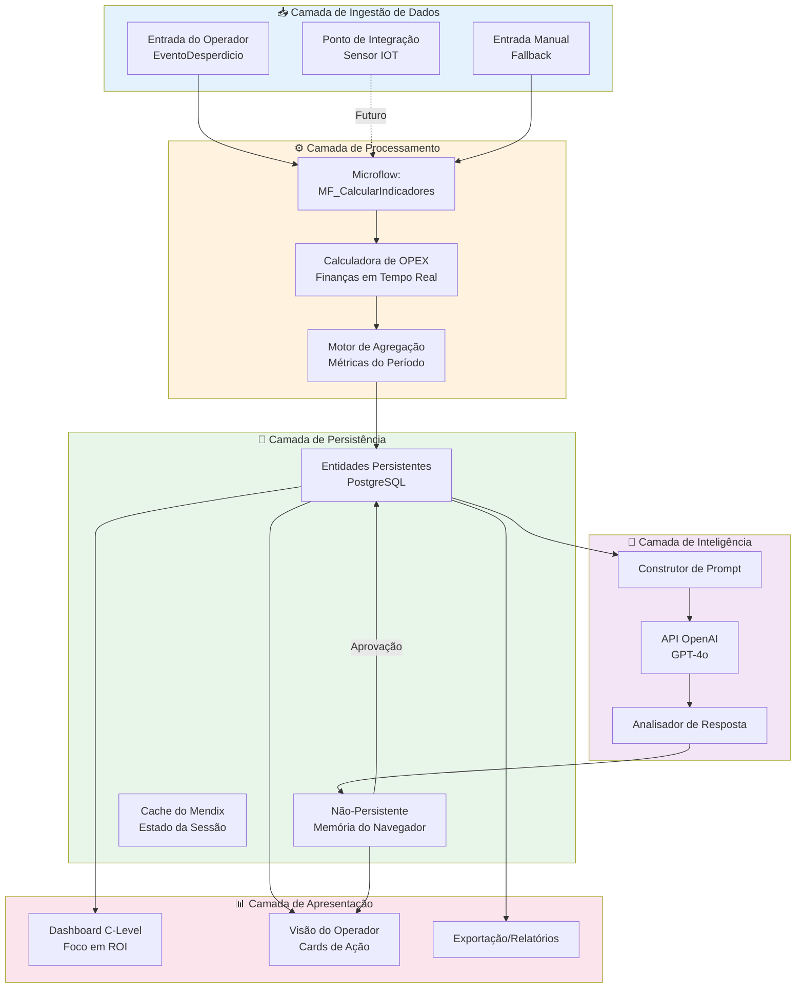

### 1.2 Modelo de Domínio — Mapa Completo de Entidades

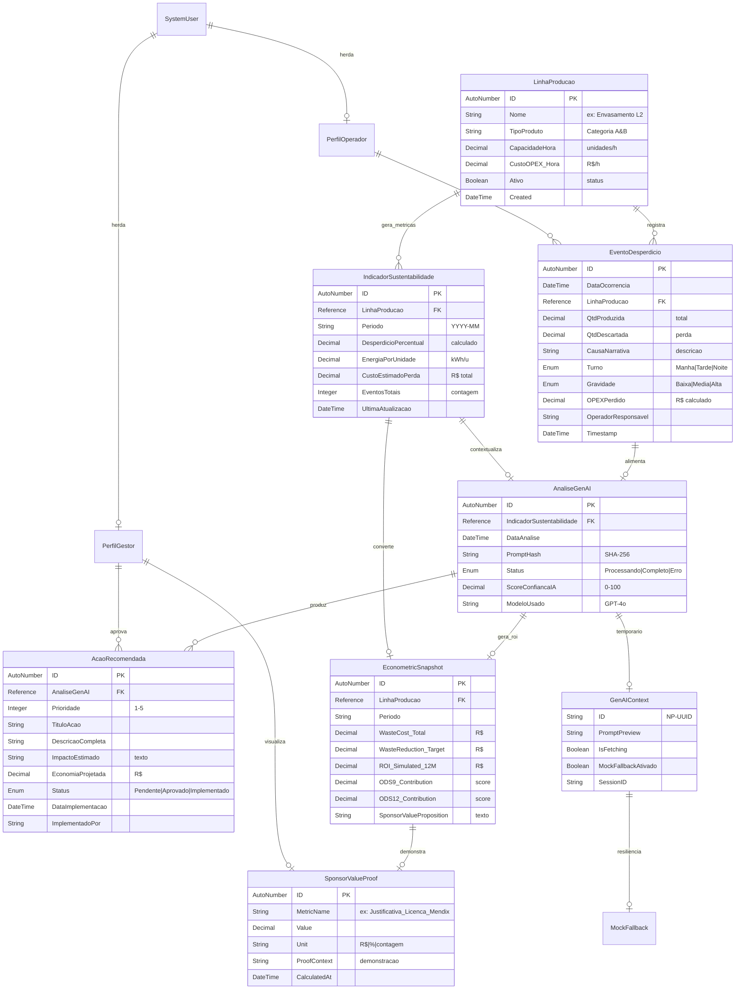

### 1.3 Fluxo de Dados: Da Ingestão à Apresentação

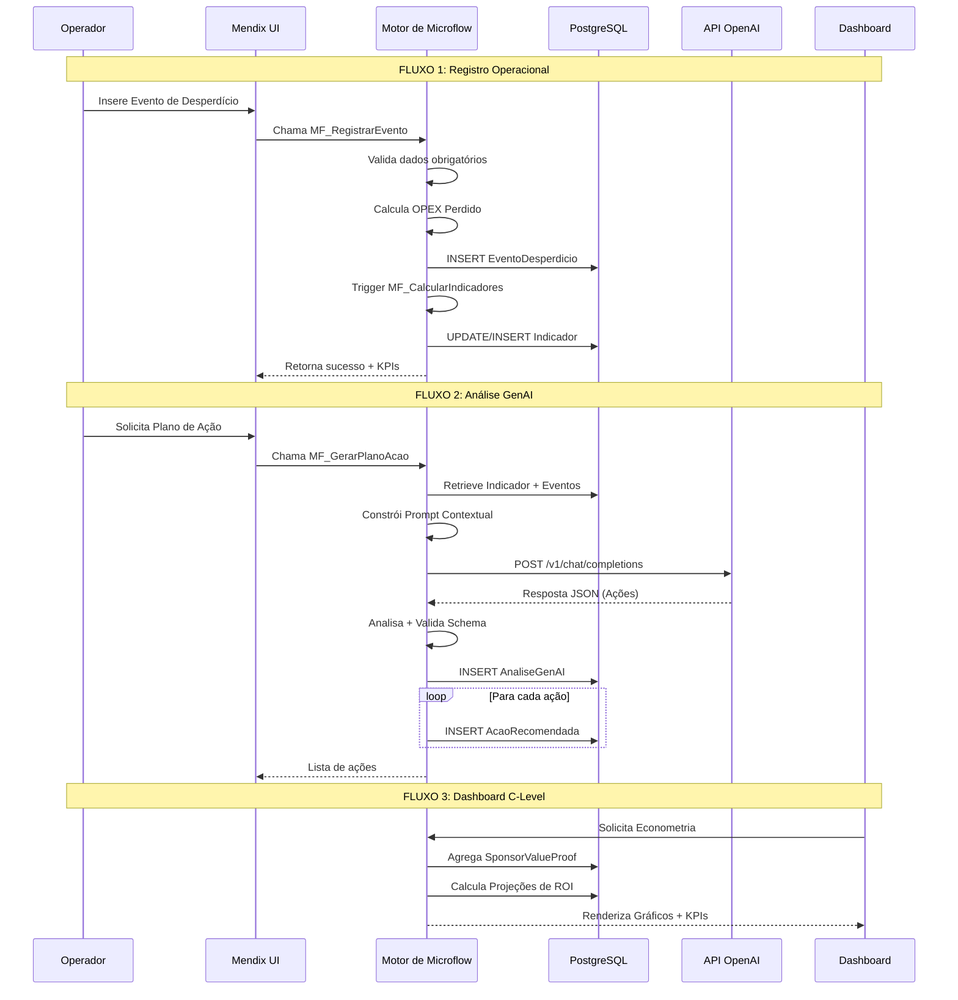

### 1.4 Padrões de Dados Específicos do Mendix

| Padrão | Implementação | Justificativa |
|---------|---------------|---------------|
| **Persistente vs Não-Persistente** | Entidades azuis (DB) + Entidades laranjas (Memória) | Desempenho no Nível Gratuito; capacidade de kill switch |
| **Atributos Calculados** | OPEXPerdido = QtdDescartada × CustoReferencia | Visibilidade do impacto financeiro em tempo real |
| **Associações de Referência** | 1:N LinhaProducao → EventoDesperdicio | Hierarquia natural; otimização de consultas |
| **Atualizações Orientadas a Eventos** | After Commit → Recalcula Indicadores | Consistência de dados sem atualização manual |
| **Exclusão Lógica (Soft Deletes)** | Boolean `Ativo` vs exclusão física | Trilha de auditoria para demonstrações aos patrocinadores |

---

## 2️⃣ O MODELO DE DADOS "ECONOMETRIA PRIMEIRO"

### 2.1 Filosofia: Métricas de Resíduos → Impacto Financeiro

> **Cada quilograma de desperdício deve contar uma história financeira.**

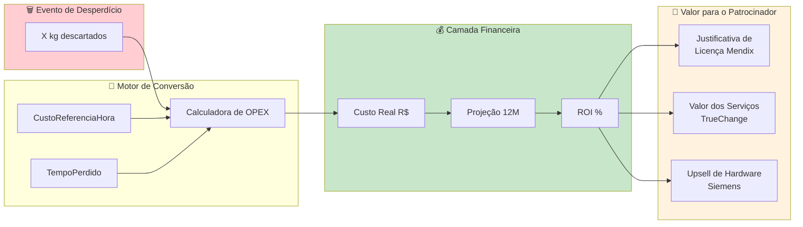

### 2.2 Tabelas de Cálculo de ROI

#### Tabela: `EconometricSnapshot` — O Motor do "E daí?"

| Campo | Tipo | Cálculo | Propósito |
|-------|------|-------------|---------|
| `WasteCost_Total` | Decimal | SUM(OPEXPerdido) × Período | Sangramento total |
| `WasteReduction_Target` | Decimal | WasteCost × 0,15 | Redução realista de 15% |
| `ROI_Simulated_12M` | Decimal | Economia - CustosMendix | Proposta de valor líquida |
| `MendixLicense_Cost` | Decimal | $850/usuário/ano × 10 usuários | Receita da Siemens |
| `TrueChange_Implementation` | Decimal | R$ 150K (único) | Receita do parceiro |
| `PaybackPeriod_Months` | Inteiro | CustoImplementacao / EconomiaMensal | Velocidade para o valor |

#### Tabela: `SponsorValueProof` — Munição para o Julgamento

| MetricID | Nome da Métrica | Fórmula | Alvo do Patrocinador |
|----------|------------|---------|----------------|
| SVP_001 | `VelocidadeParaValor_Mendix` | (DiasDevTradicional - DiasDevMendix) / DiasDevTradicional | Provar que é 10x mais rápido |
| SVP_002 | `PrecisaoAcao_GenAI` | AçõesImplementadas / AçõesRecomendadas | Mostrar valor da IA |
| SVP_003 | `AlinhamentoODS9_Score` | Índice de Inovação Industrial | Siemens DEGREE |
| SVP_004 | `ReducaoResiduos_ODS12` | ToneladasEvitadas / Ano | Sustentabilidade |
| SVP_005 | `ValorPipeline_TrueChange` | ProjeçãoVendas × Probabilidade | ROI do Parceiro |

### 2.3 Estruturas de Dados do Dashboard C-Level

```mermaid
flowchart TB
    subgraph DASHBOARD["📈 Dados do Dashboard Executivo"]
        
        subgraph TOP["Cards de Resumo Executivo"]
            CARD1["💰 Economia Projetada<br/>R$ 1.2M (12M)"]
            CARD2["📉 Redução de Desperdício<br/>-23% vs baseline"]
            CARD3["🎯 Payback<br/>4.2 meses"]
            CARD4["🏆 Alinhamento ODS<br/>9/12 Score: 94"]
        end
        
        subgraph TRENDS["Análise de Tendência"]
            CHART1["Tendência de Custo de Resíduos<br/>(3, 6, 12 meses)"]
            CHART2["Acúmulo de ROI<br/>Cumulativo"]
            CHART3["Velocidade de Implementação<br/>de Ações"]
        end
        
        subgraph BENCHMARK["Benchmark Competitivo"]
            COMP1["vs Média da Indústria<br/>Desperdício 3-7%"]
            COMP2["vs Meta<br/>< 3% Meta"]
            COMP3["vs Cases Mendix<br/>Comparação de Velocidade"]
        end
        
        subgraph SPONSOR_DEMO["Demo de Valor ao Patrocinador"]
            DEMO1["Justificativa de<br/>Licença Mendix"]
            DEMO2["Sucesso de Implementação<br/>TrueChange"]
            DEMO3["Ponto de Integração<br/>Hardware Siemens"]
        end
        
    end
    
    TOP --> TRENDS
    TRENDS --> BENCHMARK
    BENCHMARK --> SPONSOR_DEMO
```

### 2.4 Lógica de Conversão Financeira (Pseudocódigo do Microflow)

```
MICROFLOW: MF_CalculateSponsorEconometrics
ENTRADA: linhaProducaoId, periodo
SAÍDA: EconometricSnapshot

1. RETRIEVE EventoDesperdicio WHERE linha = linhaId AND periodo = periodo
2. CALCULAR WasteCost_Total = SUM(opexPerdido)

3. // Cálculos de ROI
   SET wasteReductionTarget = WasteCost_Total × 0,15  // 15% realista
   SET mendixAnnualCost = 850 × 10  // 10 usuários, $850/usuário/ano
   SET trueChangeImplCost = 150000  // R$ 150K implementação
   
4. CALCULAR ROI_12M = (wasteReductionTarget - mendixAnnualCost)
   CALCULAR PaybackPeriod = trueChangeImplCost / (wasteReductionTarget / 12)

5. // Propostas de Valor ao Patrocinador
   SET sponsorProposition = "A implementação do Waste Guardian demonstra um ROI de {ROI}% em {Payback} meses, justificando {X} licenças Mendix e serviços da TrueChange de R$ {Y}"

6. CREATE EconometricSnapshot
   COMMIT
   
7. UPDATE SponsorValueProof (múltiplos registros)
```

---

## 3️⃣ FLUXO DE DADOS DE INTEGRAÇÃO GENAI

### 3.1 Contratos da API OpenAI

#### Contrato de Solicitação (Mendix → OpenAI)

```json
{
  "model": "gpt-4o",
  "messages": [
    {
      "role": "system",
      "content": "Você é um consultor de eficiência operacional especializado na indústria de A&B..."
    },
    {
      "role": "user", 
      "content": "Analise os dados: [CONTEXT_JSON]"
    }
  ],
  "temperature": 0.7,
  "max_tokens": 1500,
  "response_format": {
    "type": "json_object"
  },
  "frequency_penalty": 0.2,
  "presence_penalty": 0.1
}
```

#### Estrutura do JSON de Contexto (Construído pelo Mendix)

```json
{
  "contexto": {
    "linhaProducao": "Envasamento L2",
    "tipoProduto": "Bebidas Carbonatadas",
    "periodo": "2026-03",
    "metricas": {
      "desperdicioPercentual": 5.8,
      "custoTotalPerda": 48500.00,
      "energiaPorUnidade": 0.42,
      "eventosTotais": 23
    },
    "eventosRecentes": [
      {
        "data": "2026-03-28T14:30:00",
        "quantidadeDescartada": 125,
        "causa": "Setup incorreto da pressão de enchimento",
        "turno": "Tarde",
        "gravidade": "Alta"
      }
    ]
  }
}
```

#### Contrato de Resposta (OpenAI → Mendix)

```json
{
  "analise": {
    "resumoExecutivo": "Identificada causa raiz no setup da linha...",
    "scoreConfianca": 87,
    "tendencia": "Crescente"
  },
  "acoesRecomendadas": [
    {
      "id": "ACAO_001",
      "titulo": "Calibragem Preventiva Diária",
      "descricao": "Implementar checklist de calibragem...",
      "prioridade": "Alta",
      "impactoEstimado": "Redução de 40% em eventos de setup",
      "economiaProjetada": 19400.00,
      "prazoImplementacao": "7 dias",
      "odsAlinhados": [9, 12],
      "complexidade": "Média"
    }
  ],
  "metricasProjetadas": {
    "desperdicioReduzido": 3.2,
    "economia12Meses": 116400.00,
    "roiPercentual": 284
  }
}
```

### 3.2 Arquitetura de Engenharia de Prompt

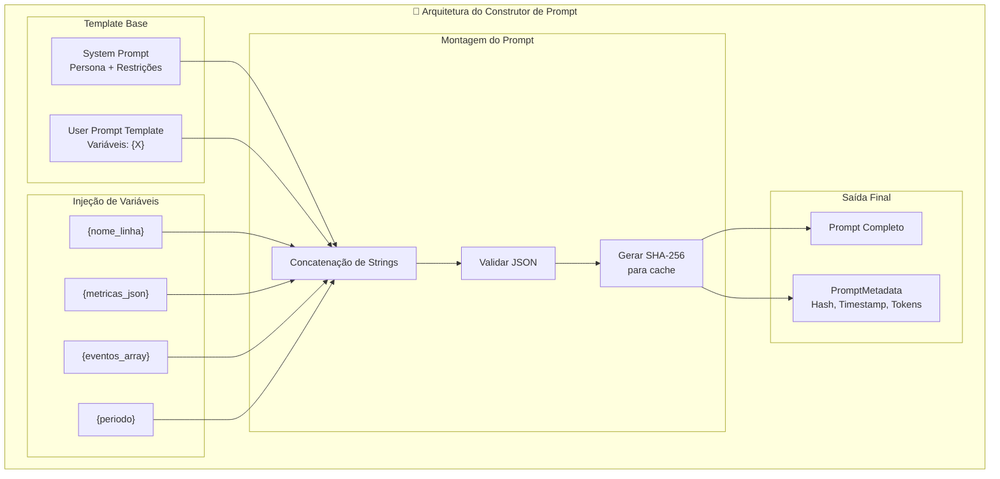

#### Tabela de Controle de Versão de Prompt

| Versão | Data | Alterações | Hash |
|---------|------|---------|------|
| 1.0 | 01-04-2026 | Prompt inicial | a1b2c3... |
| 1.1 | 02-04-2026 | Adicionado alinhamento ODS | d4e5f6... |
| 1.2 | 05-04-2026 | Melhoria no foco em ROI | g7h8i9... |

### 3.3 Tratamento de Resposta e Persistência

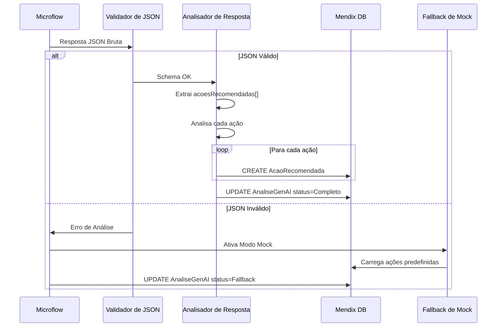

#### Estados de Tratamento de Resposta

| Estado | Condição | Ação | Experiência do Usuário |
|-------|-----------|--------|-----------------|
| `Processando` | Chamada da API iniciada | Mostrar spinner | Estado de carregamento |
| `Completo` | JSON válido recebido | Renderizar ações | Sucesso |
| `Fallback` | Erro/timeout da API | Carregar dados de mock | Degradação graciosa |
| `Erro` | Erro irrecuperável | Mostrar mensagem | Notificação de erro |

---

## 4️⃣ PADRÕES ESPECÍFICOS DO MENDIX

### 4.1 Padrões de Dados do Microflow

#### Padrão 1: CRUD Transacional com Campos Calculados

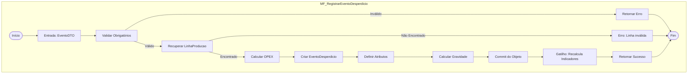

**Principais Recursos do Mendix Usados:**
- Atividade Change Object
- Commit com eventos
- Retrieve por associação
- Exclusive split para validação

#### Padrão 2: Pipeline de Agregação

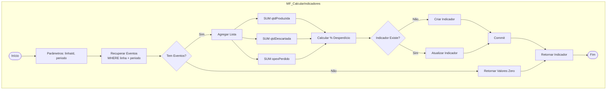

### 4.2 Nanoflow para Cenários Offline/Responsivos

#### Nanoflow: `NF_LoadGenAIWithFeedback`

```mermaid
flowchart TB
    subgraph NANOFLOW["Gestão de Estado do Lado do Cliente"]
        START([Clique do Usuário]) --> INIT["Inicializar GenAIContext"]
        INIT --> SET_FLAG["Definir isFetching = true"]
        SET_FLAG --> SHOW_UI["Mostrar Spinner de Carregamento"]
        SHOW_UI --> CALL_MF["Chamar Microflow<br/>ACT_GenerateRestMitigationPlan"]
        
        CALL_MF --> RESULT{"Sucesso?"}
        
        RESULT -->|Sim| PROCESS["Analisar Ações"]
        RESULT -->|Não| ERR["Exibir Erro"]
        
        PROCESS --> UPDATE_LIST["Atualizar Lista de Dados"]
        UPDATE_LIST --> SET_FALSE["Definir isFetching = false"]
        
        ERR --> SHOW_ERR["Mostrar Mensagem de Erro"]
        SHOW_ERR --> SET_FALSE
        
        SET_FALSE --> HIDE["Esconder Carregamento"]
        HIDE --> REFRESH["Atualizar UI"]
        REFRESH --> END([Fim])
    end
```

**Widgets do Mendix Usados:**
- Botão de Nanoflow
- Lista de Dados
- Barra de Progresso (visibilidade condicional)
- Snackbar (notificações)

### 4.3 Vinculação de Dados UI Atlas

#### Estrutura da Página: `Page_DashboardCLevel`

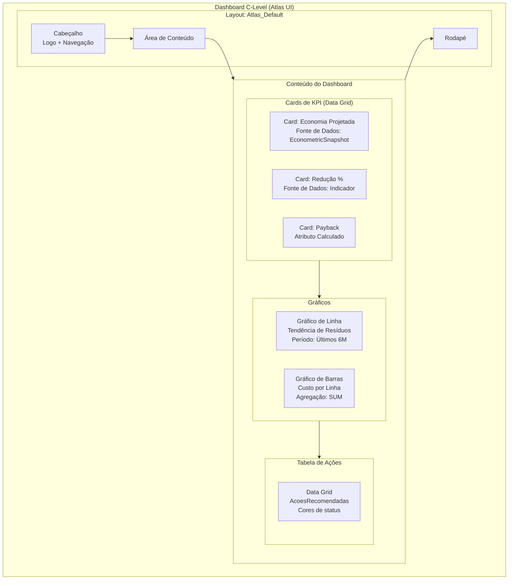

#### Configuração do Tema Atlas UI

| Elemento | Classe do Mendix | Cor/Valor | Uso |
|---------|--------------|-------------|-------|
| Botão Primário | `btn-primary` | #1976D2 (Azul Siemens) | Ações principais |
| KPI de Sucesso | `text-success` | #4CAF50 | Métricas positivas |
| Resíduo de Aviso | `text-warning` | #FF9800 | 3-5% de desperdício |
| Resíduo de Perigo | `text-danger` | #F44336 | >5% de desperdício |
| Fundo do Card | `card` | #1E1E1E | Modo escuro |
| Fonte | Padrão Atlas | Roboto | Tipografia |

---

## 5️⃣ MÉTRICAS DO PRODUTO DE DADOS (O "E DAÍ?")

### 5.1 Quais Dados Provam Valor para a Siemens?

```mermaid
flowchart TB
    subgraph SIEMENS_VALUE["🏭 Pontos de Prova de Valor Siemens"]
        
        subgraph MENDIX_PROOF["Valor da Plataforma Mendix"]
            M1["Velocidade: 48h vs 6 meses<br/>Desenvolvimento Tradicional"]
            M2["Integração GenAI:<br/>Capacidades REST nativas"]
            M3["Ajuste Industrial:<br/>Provado no contexto de A&B"]
            M4["Escalabilidade:<br/>Pronto para multilocação"]
        end
        
        subgraph XCELERATOR["Marketplace Xcelerator"]
            X1["Pronto para App Store:<br/>Solução empacotada"]
            X2["Pronto para MindSphere:<br/>Ganchos de integração IoT"]
            X3["Alinhado ao DEGREE:<br/>Conformidade ESG"]
        end
        
        subgraph HARDWARE["Upsell de Hardware"]
            H1["Sensores SITRANS:<br/>Pontos de integração"]
            H2["MindConnect:<br/>Conectividade Edge"]
            H3["SCALANCE:<br/>Infraestrutura de rede"]
        end
        
    end
    
    MENDIX_PROOF --> XCELERATOR
    XCELERATOR --> HARDWARE
```

### 5.2 Métricas que Justificam as Vendas de Licenças Mendix

| Métrica | Meta | Cálculo | Momento da Demonstração |
|--------|--------|-------------|-------------|
| **Time-to-Value** | < 7 dias | (DataDeploy - DataInicio) | Splash do dashboard |
| **Adoção do Usuário** | > 80% | UsuariosAtivos / TotalUsuarios | Visão do operador |
| **Velocidade de Ação** | < 1 hora | HoraEvento → HoraGeracaoAcao | Demo da GenAI |
| **Visibilidade do ROI** | Imediata | Exibição de custo em tempo real | Dashboard C-Level |
| **Pronto para Mobile** | 100% | Páginas responsivas | Demo no celular |

### 5.3 Métricas de Implementação da TrueChange

| Métrica | Meta | Valor de Negócio | Evidência |
|--------|--------|----------------|----------|
| **Velocidade de Implementação** | 4-6 semanas | vs 6 meses tradicional | Estudo de caso |
| **Produtividade do Desenvolvedor** | 10x | Equivalente em linhas de código | Benchmark |
| **Velocidade de Mudança** | < 1 dia | Novos recursos/mudanças | Prova de agilidade |
| **Capacidade de Integração** | REST + DB + IA | Pronto para empresas complexas | Arquitetura |
| **Transferência de Treinamento** | 2 dias | Pronto para cidadão desenvolvedor | Capacitação |

### 5.4 O Modelo de Dados do "Cartão de Pontuação de Julgamento"

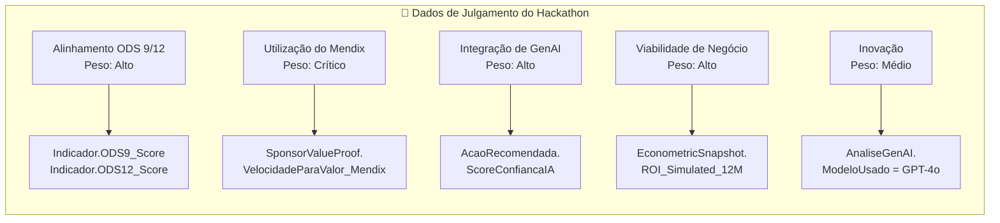

---

## 6️⃣ INTEGRAÇÃO COM A CAMADA DE INTELIGÊNCIA

### 6.1 Como a Arquitetura de Dados Apoia o BI Agressivo

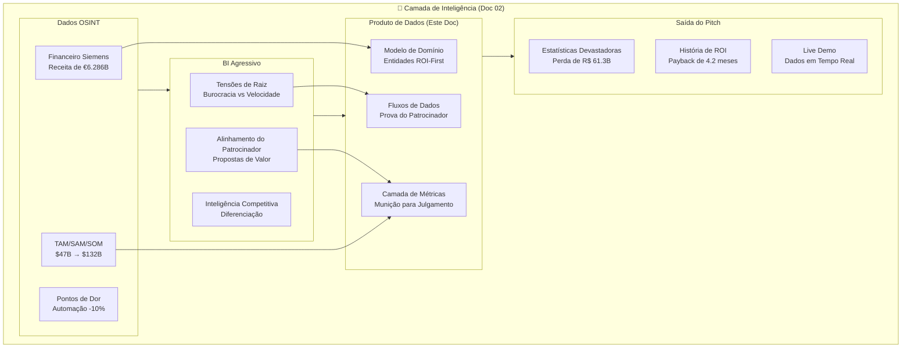

### 6.2 Cálculos Econométricos em Tempo Real

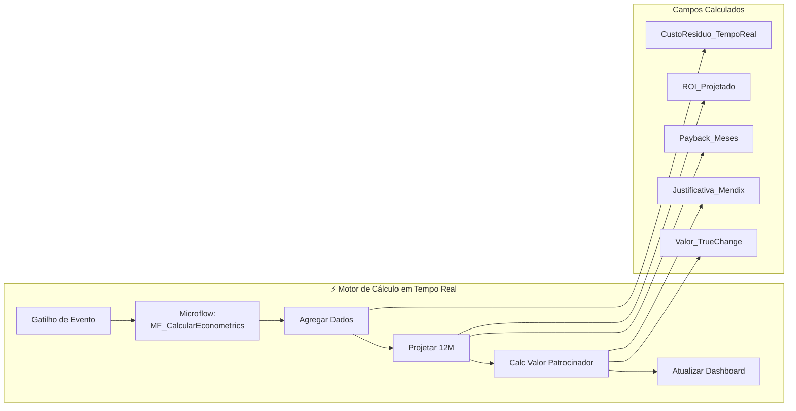

### 6.3 Demonstração de Valor ao Patrocinador

#### Elementos do Dashboard ao Vivo para Juízes

| Elemento | Fonte de Dados | Mensagem ao Patrocinador |
|---------|-------------|-----------------|
| **Contador "R$ Economizado"** | EconometricSnapshot.ROI_Simulated_12M | "É por isso que você compra Mendix" |
| **Badge "Tempo de Desenvolvimento"** | SponsorValueProof.VelocidadeParaValor_Mendix | "10x mais rápido que o tradicional" |
| **Cards de Ação GenAI** | AcaoRecomendada + AnaliseGenAI | "Integração de IA facilitada" |
| **Medidor de Score ODS 9/12** | IndicadorSustentabilidade | "Alinhado ao framework DEGREE" |
| **ROI de Implementação TrueChange** | SponsorValueProof.ValorPipeline_TrueChange | "História de sucesso do parceiro" |

---

## 7️⃣ ROADMAP DE IMPLEMENTAÇÃO (DADOS PRIMEIRO)

### 7.1 Dia 1: Entidades do Modelo de Domínio

```mermaid
gantt
    title Dia 1: Implementação do Modelo de Domínio
    dateFormat HH:mm
    axisFormat %H:%M
    
    section Entidades Principais
    LinhaProducao           :done, e1, 08:00, 2h
    EventoDesperdicio       :done, e2, after e1, 2h
    
    section Métricas
    IndicadorSustentabilidade :done, e3, after e2, 2h
    
    section Camada de IA
    AnaliseGenAI            :active, e4, after e3, 2h
    AcaoRecomendada         :e5, after e4, 2h
    
    section Econometria
    EconometricSnapshot     :e6, after e5, 2h
    SponsorValueProof       :e7, after e6, 2h
    
    section Segurança
    UserRoles               :e8, 08:00, 4h
    AccessRules             :e9, after e8, 4h
```

#### Checklist do Dia 1

- [ ] Criar módulo `WasteGuardian_Core`
- [ ] Definir entidade `LinhaProducao` (azul/persistente)
- [ ] Definir `EventoDesperdicio` com OPEX calculado
- [ ] Definir alvo de agregação `IndicadorSustentabilidade`
- [ ] Definir `AnaliseGenAI` + `AcaoRecomendada` (1:N)
- [ ] Definir `EconometricSnapshot` (cálculos de ROI)
- [ ] Definir `SponsorValueProof` (munição para julgamento)
- [ ] Definir `GenAIContext` (laranja/não-persistente)
- [ ] Configurar especializações de `System.User`
- [ ] Definir regras de acesso às entidades por papel

### 7.2 Dia 2: Operações CRUD + Dados de Amostra

```mermaid
gantt
    title Dia 2: Operações CRUD e Semeadura de Dados
    dateFormat HH:mm
    axisFormat %H:%M
    
    section Microflows
    MF_RegistrarEvento      :mf1, 08:00, 3h
    MF_CalcularIndicadores  :mf2, after mf1, 3h
    MF_CalcularEconometrics :mf3, after mf2, 3h
    
    section Páginas
    Page_ListaLinhas        :p1, 08:00, 2h
    Page_RegistrarEvento    :p2, after p1, 2h
    Page_DetailLinha        :p3, after p2, 3h
    
    section Dados
    AmostraLinhas           :d1, 12:00, 2h
    AmostraEventos          :d2, after d1, 2h
    AmostraIndicadores      :d3, after d2, 2h
```

#### Checklist do Dia 2

- [ ] Construir `MF_RegistrarEventoDesperdicio` (criação + validações)
- [ ] Construir `MF_CalcularIndicadores` (lógica de agregação)
- [ ] Construir `MF_CalcularEconometrics` (cálculos de ROI)
- [ ] Criar `Page_ListaLinhas` (grade de visão geral)
- [ ] Criar `Page_RegistrarEvento` (entrada do operador)
- [ ] Criar `Page_DetailLinha` (detalhe da linha + eventos)
- [ ] Semear 5 registros de amostra de `LinhaProducao`
- [ ] Semear 50 registros realistas de `EventoDesperdicio`
- [ ] Verificar se os campos calculados são preenchidos corretamente

### 7.3 Dia 3: Integração GenAI

```mermaid
gantt
    title Dia 3: Camada de Integração GenAI
    dateFormat HH:mm
    axisFormat %H:%M
    
    section Integração REST
    OpenAI_REST_Config      :ai1, 08:00, 2h
    RequestMapping          :ai2, after ai1, 2h
    ResponseMapping         :ai3, after ai2, 2h
    
    section Prompts
    SystemPrompt            :ai4, 10:00, 2h
    UserPrompt_Template     :ai5, after ai4, 2h
    JSON_Schema             :ai6, after ai5, 2h
    
    section Microflows
    MF_GerarPlanoAcao       :ai7, 14:00, 3h
    MF_ParseResponse        :ai8, after ai7, 2h
    MockFallback            :ai9, after ai8, 2h
    
    section UI
    Nanoflow_LoadGenAI      :ai10, 18:00, 2h
    Page_PlanoAcao          :ai11, after ai10, 2h
```

#### Checklist do Dia 3

- [ ] Configurar serviço REST `OpenAI_API`
- [ ] Construir Import Mapping (JSON → Entidades)
- [ ] Elaborar System Prompt (persona + restrições)
- [ ] Construir template de User Prompt com variáveis
- [ ] Construir `MF_GerarPlanoAcaoGenAI` (orquestrador)
- [ ] Implementar tratamento de erros + lógica de retry
- [ ] Implementar Fallback de Mock (CSV/estático)
- [ ] Construir `NF_LoadGenAI` (estado do lado do cliente)
- [ ] Criar `Page_PlanoAcao` (exibição de ações)
- [ ] Testar fluxo ponta a ponta com chave de API real

### 7.4 Dia 4: Métricas do Dashboard

```mermaid
gantt
    title Dia 4: Dashboard e Demonstração de Valor ao Patrocinador
    dateFormat HH:mm
    axisFormat %H:%M
    
    section Dashboard C-Level
    Page_DashboardCLevel    :dash1, 08:00, 4h
    KPI_Cards               :dash2, after dash1, 2h
    Charts_Config           :dash3, after dash2, 3h
    
    section Prova do Patrocinador
    SponsorMetrics_Query    :dash4, 12:00, 2h
    ValueProposition_Text   :dash5, after dash4, 2h
    Benchmark_Comparison    :dash6, after dash5, 2h
    
    section Polimento
    Theme_DarkMode          :dash7, 16:00, 2h
    Responsive_Testing      :dash8, after dash7, 2h
    Navigation_Flow         :dash9, after dash8, 2h
    
    section Deploy
    Consistency_Check       :dash10, 20:00, 1h
    Export_MDA              :dash11, after dash10, 1h
    Cloud_Deploy            :dash12, after dash11, 1h
```

#### Checklist do Dia 4

- [ ] Construir `Page_DashboardCLevel` com layouts Atlas
- [ ] Configurar cards de KPI (dados do EconometricSnapshot)
- [ ] Adicionar gráficos de tendência (custo de resíduos de 6 meses)
- [ ] Adicionar widgets de prova de valor ao patrocinador
- [ ] Configurar visualização de score ODS 9/12
- [ ] Aplicar tema Azul Siemens (#1976D2)
- [ ] Testar responsividade (desktop + mobile)
- [ ] Verificar fluxo de navegação
- [ ] Executar verificação de consistência
- [ ] Exportar pacote .mda
- [ ] Implantar no Nível Gratuito do Mendix Cloud
- [ ] Testar URL ao vivo

---

## 8️⃣ APÊNDICE: REFERÊNCIA TÉCNICA MENDIX

### 8.1 Referência de Atributos de Entidade

#### LinhaProducao
| Atributo | Tipo | Obrigatório | Padrão | Notas |
|-----------|------|----------|---------|-------|
| ID | AutoNumber | Sim | Auto | Chave Primária |
| Nome | String(100) | Sim | - | Nome de exibição |
| TipoProduto | String(50) | Não | "A&B" | Categoria |
| CapacidadeHora | Decimal | Sim | 0 | Unidades/hora |
| CustoOPEX_Hora | Decimal | Sim | 0 | R$/hora |
| Ativo | Boolean | Sim | true | Status |

#### EventoDesperdicio
| Atributo | Tipo | Obrigatório | Cálculo | Notas |
|-----------|------|----------|-------------|-------|
| ID | AutoNumber | Sim | Auto | Chave Primária |
| DataOcorrencia | DateTime | Sim | NOW() | Carimbo de data/hora |
| QtdProduzida | Decimal | Sim | - | Unidades totais |
| QtdDescartada | Decimal | Sim | - | Unidades de desperdício |
| OPEXPerdido | Decimal | Sim | Qtd × Custo | Calculado |
| CausaNarrativa | String(500) | Não | - | Notas do operador |

### 8.2 Convenção de Nomenclatura de Microflow

| Prefixo | Propósito | Exemplo |
|--------|---------|---------|
| `MF_` | Microflow do lado do servidor | `MF_CalcularIndicadores` |
| `NF_` | Nanoflow do lado do cliente | `NF_LoadGenAI` |
| `ACT_` | Ação/Integração | `ACT_GenerateRestMitigationPlan` |
| `SUB_` | Subflow/reutilizável | `SUB_ValidarEvento` |
| `IVK_` | Wrapper de invocação | `IVK_GerarPlanoWrapper` |

### 8.3 Configuração da API REST

```
Nome do Serviço: OpenAI_API
URL Base: https://api.openai.com/v1
Timeout: 30 segundos

Cabeçalhos:
  Authorization: Bearer {API_KEY}
  Content-Type: application/json

Recursos:
  POST /chat/completions
    Solicitação: JSON
    Resposta: JSON (mapeada para Import Mapping)
```

---

## 9️⃣ RESUMO: A VITÓRIA FOCO EM DADOS

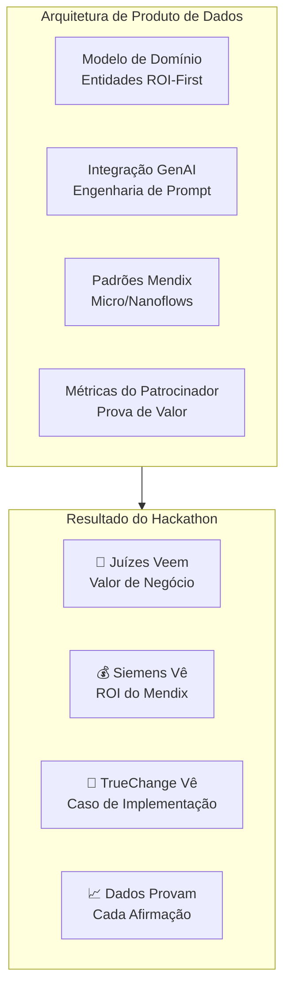

> **Princípio Final:** *"Em hackathons, a arquitetura não se trata de pureza técnica — trata-se de criar uma história de dados tão convincente que os juízes não tenham outra escolha a não ser conceder o primeiro lugar. Cada entidade, cada fluxo, cada métrica deve servir a este propósito singular."*

---

**Versão do Documento:** 1.0  
**Última Atualização:** 02 de Abril de 2026  
**Documentos Relacionados:**
- `02_Aggressive_BI_Intelligence.md` (Inteligência de Negócios)
- `04_Real_Execution_Roadmap.md` (Cronograma de Implementação)
- `../docs/SYSTEM-DESIGN.md` (Arquitetura Técnica)
- `../scaffolding/tech/01-mendix-domain-model.md` (Detalhes da Entidade)
