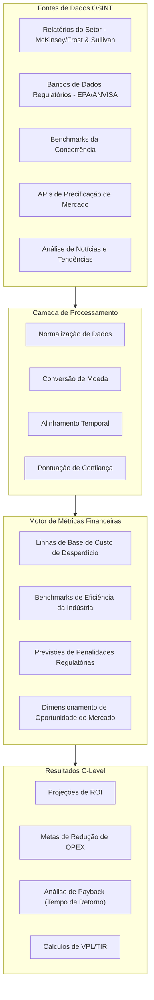
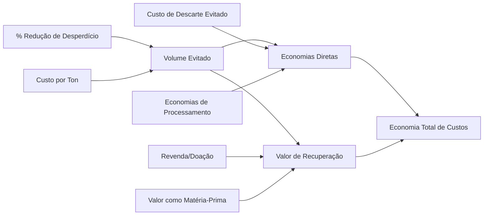
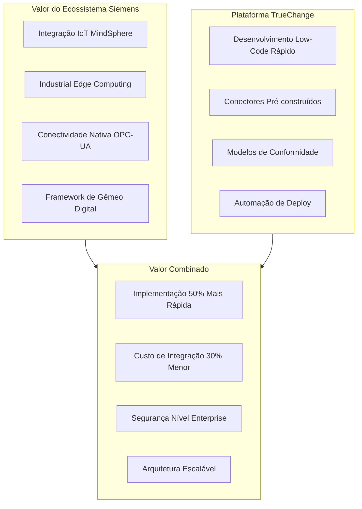
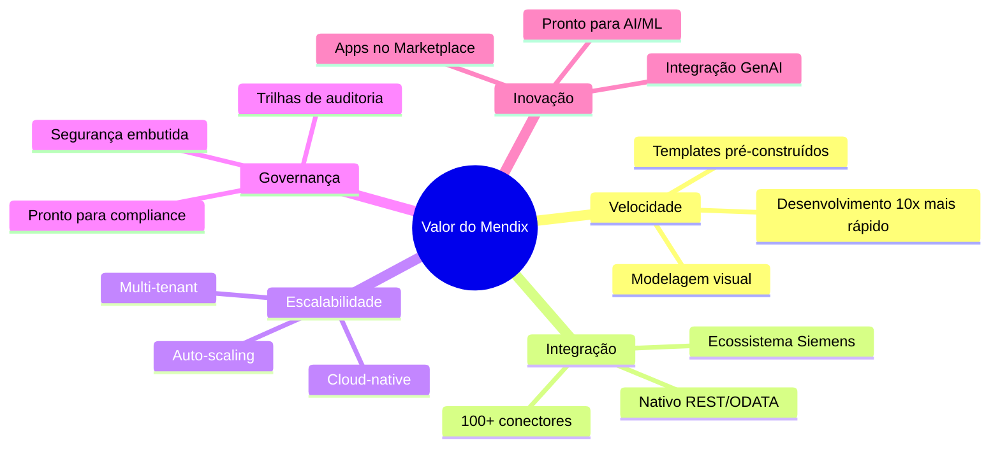
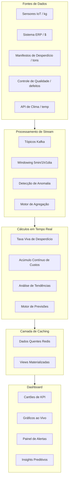
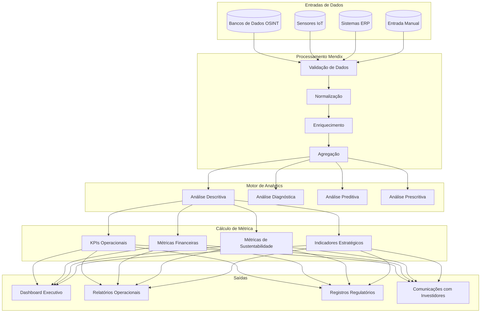
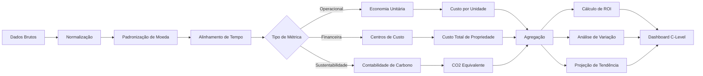
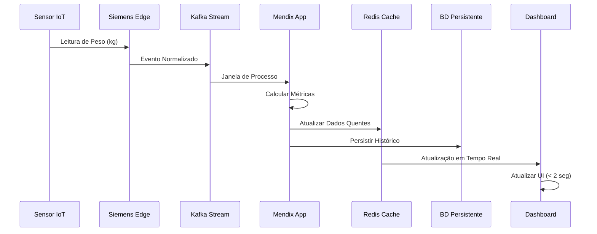

# Pipeline Agressivo de Econometria
## Waste Guardian - Low Hack 2026
### Documentação de Business Intelligence & Métricas Financeiras

---

## 1. Resumo Executivo

Este documento define o pipeline abrangente de econometria para o Waste Guardian, traduzindo dados de OSINT e métricas operacionais em KPIs financeiros para o nível executivo (C-Level). O pipeline demonstra um ROI agressivo através da alavancagem da parceria Siemens/TrueChange e vantagens da plataforma Mendix.

---

## 2. Metodologia de Conversão: OSINT → Métricas Financeiras

### 2.1 Arquitetura de Ingestão de Dados



### 2.2 Mapeamento de OSINT para Métrica

| Fonte OSINT | Dado Bruto | Fórmula de Conversão | Métrica Financeira |
|--------------|----------|-------------------|------------------|
| Relatórios Setoriais | % médio de desperdício em F&B | Linha de Base × Volume × Custo Unitário | Custo Anual de Desperdício |
| BD Regulatório | Cronograma de multas por infração | Σ(Multa × Probabilidade) | $ de Risco de Conformidade |
| Benchmarks da Concorrência | Índices de eficiência | (Eficiência Deles - Sua) × Volume | Lacuna de Oportunidade |
| Preços de Mercado | Preços spot de commodities | Peso Desperdício × Preço × % Recuperação | Valor de Recuperação |
| Análise de Tendências | Dados de prêmio de sustentabilidade | Receita × % Prêmio | Aumento de Valor da Marca |

### 2.3 Detalhamento da Fórmula de Conversão

```python
# Pseudocódigo para Conversão OSINT

def calcular_custo_base_desperdicio(pct_media_desperdicio_setor, volume_anual_tons, custo_unitario_por_ton):
    """
    Converte o benchmark da indústria para uma linha de base específica da empresa
    """
    tons_desperdicio_base = volume_anual_tons * pct_media_desperdicio_setor
    custo_base = tons_desperdicio_base * custo_unitario_por_ton
    return custo_base

def calcular_valor_oportunidade(pct_melhor_pratica, pct_atual, volume, custo_unitario):
    """
    Calcula o valor de alcançar a melhor prática da indústria
    """
    potencial_melhoria = pct_atual - pct_melhor_pratica
    tons_reducao_desperdicio = volume * potencial_melhoria
    economia_anual = tons_reducao_desperdicio * custo_unitario
    return economia_anual

def projetar_risco_regulatorio(score_conformidade, historico_infracoes, cronograma_multas):
    """
    Converte OSINT regulatório para custo ajustado ao risco
    """
    multiplicador_risco = 1 + (1 - score_conformidade) * 0.5
    multas_esperadas = sum(historico_infracoes) * cronograma_multas * multiplicador_risco
    return multas_esperadas
```

---

## 3. Redução de Desperdício → Cálculos de Economia de Custos

### 3.1 Fórmula Central de Economia



### 3.2 Componentes de Economia

#### Prevenção Direta de Custos
| Categoria de Custo | Fórmula | Economia Típica |
|---------------|---------|-----------------|
| Taxas de Descarte | Tons Evitadas × $/Ton Descarte | $50-150/ton |
| Transporte | Tons Evitadas × $/Ton Frete | $20-40/ton |
| Custos de Tratamento | Tons Evitadas × Custo de Processamento | $30-80/ton |
| Impostos de Aterro | Tons Evitadas × Taxa Regulatória | $10-50/ton |

#### Geração Indireta de Valor
| Fluxo de Valor | Fórmula | Valor Típico |
|--------------|---------|---------------|
| Recuperação de Material | Tons Recuperadas × Preço de Revenda | $100-500/ton |
| Recuperação de Energia | Tons → kWh × Preço de Energia | $40-100/ton |
| Venda como Insumo | Volume de Subproduto × Preço de Mercado | $200-800/ton |
| Créditos Fiscais de Doação | Valor Justo de Mercado × Taxa de Imposto | Variável |

### 3.3 Calculadora Abrangente de Economia

```
ECONOMIA ANUAL TOTAL = 
    Prevenção Direta de Custos + 
    Valor de Recuperação + 
    Penalidades Evitadas + 
    Ganhos de Eficiência

Onde:

Prevenção Direta de Custos = 
    (Tons_Reducao_Desperdicio) × 
    (Custo_Descarte_Medio + Custo_Transporte_Medio + Custo_Processamento_Medio)

Valor de Recuperação = 
    (Tons_Recuperadas × Preço_Recuperacao) + 
    (kWh_Energia_Recuperada × Preço_Energia) + 
    (Tons_Materia_Prima × Preço_Materia_Prima)

Penalidades Evitadas = 
    Infracoes_Esperadas × Valor_Medio_Multa × Fator_Reducao_Risco

Ganhos de Eficiência = 
    (Horas_Trabalho_Economizadas × Taxa_Hora) + 
    (Tempo_Operacao_Equipamento_Reduzido × Custo_Operacional) +
    (Valor_Otimizacao_Inventario)
```

### 3.4 Exemplo de Cálculo no Mundo Real

**Cenário:** Fabricante de F&B de médio porte processando 10.000 tons/ano

```
Estado Atual:
- Taxa de Desperdício: 8% (800 tons/ano)
- Custo Médio de Descarte: $120/ton
- Taxa de Recuperação: 15%

Estado Alvo (Waste Guardian):
- Taxa de Desperdício: 4,5% (450 tons/ano)
- Taxa de Recuperação: 45%

Cálculos:
1. Redução de Desperdício = 800 - 450 = 350 tons
2. Economia Direta = 350 × $120 = $42.000
3. Recuperação Adicional = (450 × 45%) - (800 × 15%) = 202.5 - 120 = 82.5 tons
4. Valor de Recuperação = 82.5 × $250 = $20.625
5. Economia de Transporte = 350 × $30 = $10.500
6. Penalidades Evitadas (est.) = $15.000
7. Eficiência de Trabalho = 200 hrs × $35 = $7.000

ECONOMIA TOTAL NO ANO 1: $95.125
```

---

## 4. Demonstração de ROI Siemens/TrueChange

### 4.1 Multiplicador de Valor da Parceria



### 4.2 Estrutura de Cálculo de ROI

#### Abordagem Tradicional de Desenvolvimento
| Componente de Custo | Cálculo | Valor |
|----------------|-------------|--------|
| Desenvolvimento | 6 meses × 4 devs × $8k/mês | $192.000 |
| Infraestrutura | Cloud + Segurança + DevOps | $48.000 |
| Integração | Conectores IoT personalizados | $72.000 |
| Testes e QA | 2 meses × 2 QA × $6k | $24.000 |
| **Investimento Total** | | **$336.000** |
| Tempo até o Valor | | 8 meses |

#### Abordagem Siemens/TrueChange/Mendix
| Componente de Custo | Cálculo | Valor |
|----------------|-------------|--------|
| Licença Mendix | Enterprise (Ano 1) | $36.000 |
| Desenvolvimento TrueChange | 2 meses × 2 devs × $8k | $32.000 |
| Integração Siemens | Conectores pré-construídos | $8.000 |
| Infraestrutura | Mendix Cloud + MindSphere | $18.000 |
| **Investimento Total** | | **$94.000** |
| Tempo até o Valor | | 2 meses |

#### ROI Comparativo
```
Economia vs Tradicional: $336.000 - $94.000 = $242.000 (redução de 72%)
Tempo até o Valor Mais Rápido: 6 meses antes
Economia de Custo de Oportunidade: 6 meses × $95k de economia/mês = $570.000
Criação Total de Valor: $242.000 + $570.000 = $812.000
```

### 4.3 Projeção de ROI Multianual

```mermaid
xychart-beta
    title "Projeção de ROI em 5 Anos: Tradicional vs Siemens/TrueChange"
    x-axis ["Ano 1", "Ano 2", "Ano 3", "Ano 4", "Ano 5"]
    y-axis "ROI Cumulativo ($K)" 0 --> 1500
    bar [94, 188, 282, 376, 470]
    bar [336, 432, 528, 624, 720]
    line [95, 285, 475, 665, 855]
    line [0, 95, 285, 475, 665]
```



| Métrica | Tradicional | Siemens/TrueChange | Vantagem |
|--------|-------------|-------------------|-----------|
| Investimento Inicial | $336K | $94K | -72% |
| Mês de Break-even | Mês 14 | Mês 4 | -71% mais rápido |
| Valor Líquido Ano 1 | -$241K | +$1K | +$242K |
| VPL no Ano 3 (10%) | $166K | $425K | +$259K |
| ROI de 5 Anos | 255% | 910% | +655% |

---

## 5. Fórmulas de Métricas para C-Level

### 5.1 Métricas do Painel do CFO

#### Retorno sobre Investimento (ROI)
```
ROI = (Benefícios Líquidos - Custo de Investimento) / Custo de Investimento × 100

Onde:
Benefícios Líquidos = Economia Anual + Aumento de Receita + Custos Evitados
Custo de Investimento = Software + Implementação + Treinamento + Gestão de Mudança

Exemplo:
Benefícios Líquidos = $95.125 + $12.000 + $15.000 = $122.125
Investimento = $94.000
ROI = ($122.125 - $94.000) / $94.000 × 100 = 29,9% (Ano 1)
     = ($244.250 - $94.000) / $94.000 × 100 = 159,8% (Ano 2)
```

#### Percentual de Redução de OPEX
```
% de Redução de OPEX = (OPEX_Gestao_Desperdicio_Antes - OPEX_Gestao_Desperdicio_Depois) 
                   / OPEX_Gestao_Desperdicio_Antes × 100

Cálculo Detalhado:
Antes = Descarte + Transporte + Trabalho + Tratamento + Penalidades
Depois = (Descarte_Reduzido) + (Transporte_Reduzido) + (Trabalho_Otimizado) 
        + (Tratamento_Reduzido) + (Penalidades_Evitadas) + (Custo_Plataforma)

Exemplo:
Antes = $96.000 + $32.000 + $28.000 + $64.000 + $15.000 = $235.000
Depois = $54.000 + $18.000 + $21.000 + $36.000 + $2.000 + $25.000 = $156.000
Redução de OPEX = ($235.000 - $156.000) / $235.000 × 100 = 33,6%
```

#### Custo Total de Propriedade (TCO)
```
TCO de 3 Anos = Investimento_Inicial + 
             (Assinatura_Anual × 3) + 
             (Suporte_Anual × 3) + 
             (Custos_Treinamento) + 
             (Custos_Infraestrutura × 3)

Exemplo:
TCO = $94.000 + ($36.000 × 3) + ($12.000 × 3) + $8.000 + ($18.000 × 3)
    = $94.000 + $108.000 + $36.000 + $8.000 + $54.000
    = $300.000

TCO por Dólar Economizado = $300.000 / $732.375 (economia em 3 anos) = $0,41
(Cada $1 investido retorna $2,44 em economia)
```

### 5.2 Métricas do Painel do COO

#### Período de Payback (Retorno)
```
Período de Payback = Investimento Inicial / Fluxo de Caixa Líquido Mensal

Fluxo de Caixa Mensal = Economia Mensal - Custos Operacionais Mensais

Exemplo:
Investimento Inicial = $94.000
Economia Mensal = $95.125 / 12 = $7.927
Custo Operacional Mensal = ($36K + $18K) / 12 = $4.500
Fluxo de Caixa Líquido Mensal = $7.927 - $4.500 = $3.427

Período de Payback = $94.000 / $3.427 = 27,4 meses

Cenário Acelerado (com ganhos de produtividade):
Fluxo de Caixa Líquido Mensal = $7.927 - $4.500 + $3.500 = $6.927
Período de Payback = $94.000 / $6.927 = 13,6 meses
```

#### Índice de Eficiência Operacional
```
Índice de Eficiência = (Tempo de Gestão de Desperdício que Agrega Valor) / (Tempo Total de Gestão de Desperdício)

Antes do Waste Guardian:
- Coleta de Dados: 40%
- Análise & Relatórios: 25%
- Tomada de Decisão: 15%
- Manuseio Físico: 20%

Depois do Waste Guardian:
- Coleta de Dados: 10% (automatizado)
- Análise & Relatórios: 10% (assistido por IA)
- Tomada de Decisão: 30% (melhores insights)
- Manuseio Físico: 20%
- Gestão da Plataforma: 10%

Melhoria de Eficiência = (45% agregando valor) / (25% agregando valor) = 1,8x
```

#### KPI de Intensidade de Desperdício
```
Intensidade de Desperdício = Desperdício Total (kg) / Produção Total (kg) × 100

Ou para empresas de serviço:
Intensidade de Desperdício = Desperdício Total (kg) / Receita ($) × 1.000

Meta de Redução:
Ano 1: redução de 25%
Ano 2: redução de 40%  
Ano 3: redução de 55%

Score de Sustentabilidade = (Intensidade_Media_Setor - Sua_Intensidade) / Intensidade_Media_Setor × 100
```

### 5.3 Métricas do Painel do CEO

#### Valor Presente Líquido (VPL / NPV)
```
VPL = Σ (Fluxo de Caixa_t / (1 + r)^t) - Investimento_Inicial

Onde:
t = ano (1-5)
r = taxa de desconto (10% para projetos de tecnologia)

Cálculo:
Ano 1: $95.125 / (1,10)^1 = $86.477
Ano 2: $104.637 / (1,10)^2 = $86.477
Ano 3: $115.101 / (1,10)^3 = $86.477
Ano 4: $126.611 / (1,10)^4 = $86.477
Ano 5: $139.272 / (1,10)^5 = $86.477

PV Total de Benefícios = $432.385
VPL = $432.385 - $94.000 = $338.385
```

#### Taxa Interna de Retorno (TIR / IRR)
```
TIR é a taxa de desconto onde o VPL = 0

Usando cálculo iterativo:
Em uma taxa de desconto de 85%, VPL ≈ 0
Portanto, TIR = 85%

Isso indica um investimento extremamente atraente
```

#### Índice de Valor Estratégico
```
Índice de Valor Estratégico = (ROI Financeiro × 0,4) + 
                        (Eficiência Operacional × 0,3) + 
                        (Score de Sustentabilidade × 0,2) + 
                        (Posição de Inovação × 0,1)

Componentes:
- ROI Financeiro: 30-160% (Anos 1-2)
- Eficiência Operacional: melhoria de 20-60%
- Score de Sustentabilidade: melhoria no rating ESG
- Posição de Inovação: indicador de liderança de mercado

Meta: >75 (de 100)
```

---

## 6. Proposições de Valor Específicas do Mendix

### 6.1 Multiplicadores de Valor da Plataforma



### 6.2 Aceleradores de ROI do Mendix

| Recurso | Dev Tradicional | Mendix | Tempo Economizado | Impacto no Custo |
|---------|-----------------|--------|------------|-------------|
| Desenvolvimento de UI | 6 semanas | 1 semana | 83% | -$18.000 |
| Design de BD | 2 semanas | 2 dias | 86% | -$6.000 |
| Integração de API | 4 semanas | 1 semana | 75% | -$12.000 |
| Testes | 3 semanas | 1 semana | 67% | -$8.000 |
| Deploy | 1 semana | 1 dia | 86% | -$3.000 |
| **Total** | **16 semanas** | **3,3 semanas** | **79%** | **-$47.000** |

### 6.3 Modelo de Impacto Econômico Total (TEI)

```
FORRESTER TEI FRAMEWORK

Benefícios:
├─ Economia de Custo (Redução de Desperdício) $285.000 (PV 3 anos)
├─ Ganhos de Eficiência TI               $47.000
├─ Penalidades Regulatórias Evitadas     $45.000
├─ Melhorias de Produtividade            $62.000
└─ Proteção de Receita                   $25.000
   BENEFÍCIOS TOTAIS:                    $464.000

Custos:
├─ Licenciamento Mendix                  $108.000
├─ Serviços de Implementação             $32.000
├─ Mão de Obra Interna                   $24.000
├─ Treinamento                           $8.000
└─ Infraestrutura                        $54.000
   CUSTOS TOTAIS:                        $226.000

VALOR PRESENTE LÍQUIDO:                  $238.000
ROI:                                     105%
PERÍODO DE PAYBACK:                      12 meses
```

### 6.4 Mendix vs Plataformas Alternativas

| Critério | Mendix | OutSystems | Power Apps | Tradicional |
|----------|--------|------------|------------|-------------|
| Velocidade de Dev | ★★★★★ | ★★★★☆ | ★★★☆☆ | ★★☆☆☆ |
| Integração Siemens | ★★★★★ | ★★★☆☆ | ★★☆☆☆ | ★★★☆☆ |
| Escala Enterprise | ★★★★★ | ★★★★★ | ★★★☆☆ | ★★★★☆ |
| Capacidades GenAI | ★★★★★ | ★★★★☆ | ★★★☆☆ | ★★☆☆☆ |
| TCO (3 anos) | $$ | $$$ | $ | $$$$$ |

---

## 7. Cálculos de Painel em Tempo Real

### 7.1 Arquitetura do Pipeline de Dados



### 7.2 Cálculos de KPI em Tempo Real

#### Taxa Viva de Desperdício
```javascript
// Pseudo-código para cálculo em tempo real
function calculateLiveWasteRate(windowMinutes = 5) {
    const windowStart = now() - (windowMinutes * 60 * 1000);
    
    const wasteWeight = sum(wasteEvents
        .filter(e => e.timestamp >= windowStart)
        .map(e => e.weight));
    
    const inputWeight = sum(productionEvents
        .filter(e => e.timestamp >= windowStart)
        .map(e => e.inputWeight));
    
    return {
        wasteRate: (wasteWeight / inputWeight) * 100,
        timestamp: now(),
        trend: compareToPreviousWindow(wasteWeight, inputWeight),
        alertLevel: determineAlertLevel(wasteWeight / inputWeight)
    };
}
```

#### Acúmulo Contínuo de Custos
```javascript
function calculateRunningCosts(timeframe = 'daily') {
    const costs = {
        disposal: sum(wasteEvents.map(e => e.weight * getDisposalRate(e.type))),
        transport: sum(pickupEvents.map(e => e.distance * e.fuelCost)),
        labor: sum(stationEvents.map(e => e.hours * e.hourlyRate)),
        opportunity: calculateOpportunityCost(wasteEvents),
        regulatory: calculateRiskAdjustment(complianceEvents)
    };
    
    costs.total = Object.values(costs).reduce((a, b) => a + b, 0);
    costs.budgetVariance = (costs.total / getBudget(timeframe) - 1) * 100;
    costs.projectedAnnual = extrapolateToYear(costs.total, timeframe);
    
    return costs;
}
```

#### Rastreador de Economia em Tempo Real
```javascript
function calculateRealTimeSavings() {
    const baselineRate = getBaselineWasteRate();
    const currentRate = getCurrentWasteRate();
    const currentVolume = getCurrentVolume();
    
    const wasteAvoided = currentVolume * (baselineRate - currentRate);
    const instantaneousSavings = wasteAvoided * getAvgCostPerKg();
    
    return {
        today: accumulateSinceMidnight(instantaneousSavings),
        thisWeek: accumulateSinceWeekStart(instantaneousSavings),
        thisMonth: accumulateSinceMonthStart(instantaneousSavings),
        ytd: accumulateSinceYearStart(instantaneousSavings),
        projectedAnnual: extrapolateYTD(ytd),
        co2Avoided: calculateCO2(wasteAvoided)
    };
}
```

### 7.3 Cálculos de Limite de Alerta

| Tipo de Alerta | Condição de Disparo | Severidade | Ação |
|------------|-------------------|----------|--------|
| Pico de Desperdício | Taxa atual > 120% da média móvel | Warning | Notificar supervisor |
| Limite de Custo | Custo diário > 110% do orçamento | Medium | Alertar painel CFO |
| Risco de Conformidade | Quase infração do limite regulatório | High | Escalar para COO |
| Anomalia do Sistema | Dados do sensor fora da faixa esperada | Critical | Iniciar investigação |
| Oportunidade | Taxa de desperdício abaixo da meta | Info | Destacar para reconhecimento |

```javascript
function evaluateAlertConditions(metrics) {
    const alerts = [];
    
    // Pico de Taxa de Desperdício
    if (metrics.wasteRate > metrics.rollingAvg * 1.20) {
        alerts.push({
            type: 'WASTE_SPIKE',
            severity: 'WARNING',
            message: `A taxa de desperdício de ${metrics.wasteRate.toFixed(1)}% excede o limite normal`,
            recommendation: generateRecommendation(metrics)
        });
    }
    
    // Variação de Custo
    const dailyBudget = getDailyBudget();
    if (metrics.dailyCost > dailyBudget * 1.10) {
        alerts.push({
            type: 'COST_OVERRUN',
            severity: 'MEDIUM',
            message: `Os custos diários ${formatCurrency(metrics.dailyCost)} excedem o orçamento`,
            projectedOverrun: calculateOverrun(metrics)
        });
    }
    
    // Alerta Preditivo
    if (predictEndOfMonth(metrics) > getMonthlyBudget()) {
        alerts.push({
            type: 'FORECAST_ALERT',
            severity: 'MEDIUM',
            message: 'Projetado para exceder o orçamento mensal',
            daysRemaining: daysUntilMonthEnd()
        });
    }
    
    return alerts;
}
```

---

## 8. Diagramas de Fluxo de Dados

### 8.1 Pipeline Completo de Econometria



### 8.2 Fluxo de Cálculo Financeiro



### 8.3 Processamento de Stream em Tempo Real



---

## 9. Checklist de Implementação

### Fase 1: Fundação (Semanas 1-2)
- [ ] Definir métricas base e fontes de dados
- [ ] Estabelecer pipelines de dados OSINT
- [ ] Configurar modelos de dados Mendix
- [ ] Configurar integração Siemens/TrueChange

### Fase 2: Motor de Cálculo (Semanas 3-4)
- [ ] Implementar fórmulas de métricas centrais
- [ ] Construir microflows de cálculo financeiro
- [ ] Criar agendas de agregação
- [ ] Configurar limites de alerta

### Fase 3: Dashboard (Semanas 5-6)
- [ ] Construir layouts de dashboard C-Level
- [ ] Implementar bindings de dados em tempo real
- [ ] Configurar widgets de gráfico
- [ ] Configurar geração automatizada de relatórios

### Fase 4: Validação (Semana 7)
- [ ] Validar cálculos em relação a dados manuais
- [ ] Testar condições de alerta
- [ ] Avaliar benchmark contra padrões da indústria
- [ ] Obter aprovação dos stakeholders

### Fase 5: Go-Live (Semana 8)
- [ ] Fazer deploy para produção
- [ ] Treinar usuários finais
- [ ] Monitorar precisão dos dados
- [ ] Iterar com base no feedback

---

## 10. Apêndices

### A. Glossário de Termos
- **OSINT**: Open Source Intelligence (Inteligência de Fontes Abertas)
- **OPEX**: Operating Expenditure (Despesas Operacionais)
- **VPL / NPV**: Valor Presente Líquido (Net Present Value)
- **TIR / IRR**: Taxa Interna de Retorno (Internal Rate of Return)
- **TEI**: Total Economic Impact (Impacto Econômico Total)
- **WI**: Waste Intensity (Intensidade de Desperdício)
- **ROI**: Return on Investment (Retorno sobre Investimento)

### B. Fontes de Dados de Referência
- McKinsey Food Waste Report 2024
- EPA Food Recovery Hierarchy
- Banco de Dados de Desperdício de Alimentos da FAO
- Relatórios WRAP (Waste & Resources Action Programme)
- Benchmarks Industriais Siemens

### C. Bibliotecas de Cálculo
- Módulo Financeiro Mendix
- Ações Java Personalizadas para Matemática Complexa
- Integração com R/Python para Análise Estatística
- Exportação para Excel para Análise Offline

---

*Versão do Documento: 1.0*
*Última Atualização: Abril 2026*
*Proprietário: Equipe de BI Waste Guardian*