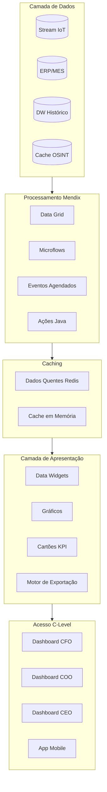
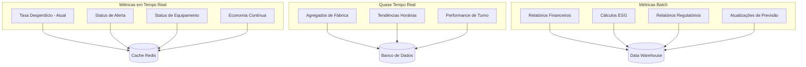

# Especificações do Dashboard C-Level
## Relatórios Executivos Waste Guardian
### Low Hack 2026 - Guia de Implementação Mendix

---

## 1. Visão Executiva

Este documento define as especificações técnicas para os dashboards C-Level no Waste Guardian, projetados para tomada de decisão executiva em tempo real. Os dashboards alavancam os recursos nativos do Mendix com extensões personalizadas para análises operacionais e financeiras avançadas.

**Público-Alvo:** CFO, COO, CEO, Membros do Conselho
**Plataforma:** Mendix 10.x com DataWidgets 2.x
**Frequência de Atualização:** Tempo real (latência abaixo de 5 segundos)
**Acesso:** Web + Responsivo para Mobile

---

## 2. Arquitetura do Dashboard

### 2.1 Arquitetura de Sistema



### 2.2 Especificações do Fluxo de Dados

| Camada | Tecnologia | Latência | Capacidade |
|-------|------------|---------|----------|
| Ingestão de Dados | Kafka/MQTT | <1 seg | 10K eventos/seg |
| Processamento Stream | Microflows Mendix | <2 seg | 1K calc/seg |
| Agregação | Eventos Agendados | 1-5 min | Ilimitado |
| Atualização do Dashboard | WebSocket/Polling | <5 seg | 100 concorrentes |
| Exportação/Relatório | Geração Assíncrona | <30 seg | PDF/Excel |

---

## 3. Especificações do Dashboard do CFO

### 3.1 Layout do Dashboard

```
┌──────────────────────────────────────────────────────────────────────────────────────┐
│  🏢 WASTE GUARDIAN                          Dashboard CFO    [Data] [Usuário] [⚙️]     │
├──────────────────────────────────────────────────────────────────────────────────────┤
│                                                                                      │
│  ┌─────────────────┐  ┌─────────────────┐  ┌─────────────────┐  ┌─────────────────┐ │
│  │  💰 ROI         │  │  📉 OPEX        │  │  📊 Payback     │  │  💵 VPL         │ │
│  │                 │  │                 │  │                 │  │                 │ │
│  │   156,8%        │  │   -33,6%        │  │   8,4 meses     │  │   $338,4K       │ │
│  │   ▲ 12,3%       │  │   ▼ 2,1%        │  │   ▼ 1,2 mes     │  │   ▲ $45,2K      │ │
│  │   vs meta       │  │   vs último T   │  │   vs plano      │  │   vs previsão   │ │
│  └─────────────────┘  └─────────────────┘  └─────────────────┘  └─────────────────┘ │
│                                                                                      │
│  ┌───────────────────────────────────────────────────────────────────────────────┐  │
│  │  💵 ACÚMULO DE ECONOMIA                                          [YTD ▼]     │  │
│  │                                                                               │  │
│  │   $500K ┤                                              ╭───────╮              │  │
│  │   $400K ┤                                   ╭─────────╯       ╰─────         │  │
│  │   $300K ┤                         ╭────────╯                                  │  │
│  │   $200K ┤              ╭──────────╯                                           │  │
│  │   $100K ┤   ╭─────────╯                                                       │  │
│  │       $ ┼───┴─────┬─────────┬─────────┬─────────┬─────────┬─────────          │  │
│  │           Jan     Fev     Mar     Abr     Mai     Jun     Jul                 │  │
│  │                                                                               │  │
│  │   ─── Real      ─ ─ Meta      ─·─ Previsão                                   │  │
│  └───────────────────────────────────────────────────────────────────────────────┘  │
│                                                                                      │
│  ┌──────────────────────────────────────┐  ┌──────────────────────────────────────┐  │
│  │  📋 DETALHAMENTO DE CUSTO            │  │  📈 VARIAÇÃO DE ORÇAMENTO            │  │
│  │                                      │  │                                      │  │
│  │  Descarte Desperdício ████████ 42% $40K│  │  Orçamento Usado: 67%                │  │
│  │  Transporte        ████      23% $22K│  │  Restante:        33%                │  │
│  │  Mão de Obra       ███       18% $17K│  │                                      │  │
│  │  Tratamento        ██        12% $11K│  │  🟢 No Caminho Certo                 │  │
│  │  Custo Plataforma  █          5%  $5K│  │                                      │  │
│  │                                      │  │  Categorias em risco: 1              │  │
│  │  [Ver Detalhes →]                    │  │  [Explorar Detalhes →]               │  │
│  └──────────────────────────────────────┘  └──────────────────────────────────────┘  │
│                                                                                      │
│  ┌───────────────────────────────────────────────────────────────────────────────┐  │
│  │  🏆 PREVISÃO FINANCEIRA                             [Ajustar Suposições ⚙️]  │  │
│  │                                                                               │  │
│  │   Ano     Investimento  Economia     Líquido    Cumulativo      ROI          │  │
│  │   ─────────────────────────────────────────────────────────────────────────   │  │
│  │   A1      $94.000       $95.125      $1.125     $1.125          1,2%         │  │
│  │   A2      $36.000       $104.637     $68.637    $69.762         190,7%       │  │
│  │   A3      $36.000       $115.101     $79.101    $148.863        319,7%       │  │
│  │   A4      $36.000       $126.611     $90.611    $239.474        451,7%       │  │
│  │   A5      $36.000       $139.272     $103.272   $342.746        586,9%       │  │
│  │                                                                               │  │
│  │   [Exportar para Excel]  [Gerar Relatório Conselho]  [Agendar Distribuição]  │  │
│  └───────────────────────────────────────────────────────────────────────────────┘  │
│                                                                                      │
└──────────────────────────────────────────────────────────────────────────────────────┘
```

### 3.2 Definições de KPIs do CFO

#### KPIs Primários

| KPI | Fórmula | Fonte de Dados | Atualização | Tipo de Widget |
|-----|---------|-------------|---------|-------------|
| **ROI** | (Benefícios Totais - Investimento) / Investimento × 100 | Calculado | Tempo Real | Cartão KPI com Tendência |
| **Redução de OPEX** | (OPEX_antes - OPEX_depois) / OPEX_antes × 100 | ERP + Calculado | Horária | Cartão KPI com Tendência |
| **Período de Payback** | Investimento Inicial / Fluxo de Caixa Líquido Mensal | Calculado | Diária | Cartão KPI com Progresso |
| **VPL / NPV** | Σ(Fluxo de Caixa_t / (1+r)^t) - Investimento Inicial | Calculado | Diária | Cartão KPI |
| **TCO** | Inicial + (Anual × Anos) + Suporte | Calculado | Mensal | Cartão KPI |

#### KPIs Secundários

| KPI | Fórmula | Meta | Limite de Alerta |
|-----|---------|--------|-----------------|
| Economia Mensal | Σ(Prevenção de Custo) | >$7.900 | <$6.000 🔴 |
| Variação de Orçamento | (Real - Orçamento) / Orçamento | <±10% | >±15% 🔴 |
| Custo por Tonelada | Custo Total / Tons de Desperdício | Decrescente | Aumento >10% 🟡 |
| Ritmo de Economia (Run Rate) | Economia Mensal (MTD) × 12 | >Meta | <90% da meta 🟡 |

### 3.3 Implementação Mendix - Dashboard CFO

#### Modelo de Domínio

```
CFO_Dashboard
├── CFODashboardPage (Page)
│   ├── CFOPeriodSelector (Enum: YTD, QTD, MTD, Custom)
│   ├── CFOPeriodStart (DateTime)
│   └── CFOPeriodEnd (DateTime)
│
├── FinancialKPI (Entity)
│   ├── KPI_ID (String)
│   ├── KPI_Name (String)
│   ├── Current_Value (Decimal)
│   ├── Previous_Value (Decimal)
│   ├── Target_Value (Decimal)
│   ├── Variance_Percent (Decimal)
│   ├── Last_Updated (DateTime)
│   └── Trend_Direction (Enum: UP, DOWN, STABLE)
│
├── SavingsAccumulation (Entity)
│   ├── Period (DateTime)
│   ├── Actual_Savings (Decimal)
│   ├── Target_Savings (Decimal)
│   ├── Forecast_Savings (Decimal)
│   └── Cumulative_Savings (Decimal)
│
├── CostBreakdown (Entity)
│   ├── Category (Enum)
│   ├── Amount (Decimal)
│   ├── Percentage (Decimal)
│   └── Period (DateTime)
│
└── FinancialForecast (Entity)
    ├── Year (Integer)
    ├── Investment (Decimal)
    ├── Savings (Decimal)
    ├── Net_Value (Decimal)
    ├── Cumulative_Value (Decimal)
    └── ROI_Percent (Decimal)
```

#### Microflow: CalculateCFOKPIs

```
[Start] 
   │
   ├──> [Retrieve CFO_Dashboard context]
   │
   ├──> [Calculate ROI]
   │    ├── Retrieve Investment (from Project)
   │    ├── Calculate Total Benefits
   │    │    ├── Sum Savings (from WasteEvents)
   │    │    ├── Sum Avoided Penalties
   │    │    └── Sum Efficiency Gains
   │    └── ROI = (Benefits - Investment) / Investment
   │
   ├──> [Calculate OPEX Reduction]
   │    ├── Get Baseline OPEX (from BaselineMetrics)
   │    ├── Get Current OPEX
   │    └── OPEX_Reduction = (Baseline - Current) / Baseline
   │
   ├──> [Calculate Payback Period]
   │    ├── Monthly_Cash_Flow = Monthly_Savings - Monthly_Costs
   │    └── Payback_Months = Initial_Investment / Monthly_Cash_Flow
   │
   ├──> [Calculate NPV]
   │    ├── Discount_Rate = 0.10
   │    ├── For each year (1-5):
   │    │    PV = Cash_Flow / (1 + Discount_Rate)^Year
   │    └── NPV = Sum(PV) - Initial_Investment
   │
   └──> [Commit KPI entities]
        └── [Refresh Dashboard]
```

#### Configuração do Widget de Gráfico

```json
{
  "chartType": "line",
  "dataSource": {
    "type": "microflow",
    "microflow": "DS_SavingsAccumulation"
  },
  "series": [
    {
      "name": "Actual",
      "dataAttribute": "Actual_Savings",
      "color": "#059669",
      "lineStyle": "solid"
    },
    {
      "name": "Target",
      "dataAttribute": "Target_Savings", 
      "color": "#6B7280",
      "lineStyle": "dashed"
    },
    {
      "name": "Forecast",
      "dataAttribute": "Forecast_Savings",
      "color": "#3B82F6",
      "lineStyle": "dotted"
    }
  ],
  "xAxis": {
    "attribute": "Period",
    "format": "MMM YYYY"
  },
  "yAxis": {
    "prefix": "$",
    "format": ",.0f"
  },
  "refreshInterval": 300
}
```

---

## 4. Especificações do Dashboard do COO

### 4.1 Layout do Dashboard

```
┌──────────────────────────────────────────────────────────────────────────────────────┐
│  🏭 WASTE GUARDIAN                          Dashboard COO    [Data] [Usuário] [⚙️]     │
├──────────────────────────────────────────────────────────────────────────────────────┤
│                                                                                      │
│  ┌─────────────────┐  ┌─────────────────┐  ┌─────────────────┐  ┌─────────────────┐ │
│  │  ⚡ Eficiência  │  │  🎯 Taxa Desp.  │  │  ⏱️ Resposta    │  │  📊 Produção    │ │
│  │                 │  │                 │  │                 │  │                 │ │
│  │   1,8x          │  │   4,2%          │  │   4,3 min       │  │   98,7%         │ │
│  │   ▲ 0,3x        │  │   ▼ 1,8%        │  │   ▼ 2,1 min     │  │   ▲ 3,2%        │ │
│  │   melhoria      │  │   vs baseline   │  │   resp. média   │  │   uso capac.    │ │
│  └─────────────────┘  └─────────────────┘  └─────────────────┘  └─────────────────┘ │
│                                                                                      │
│  ┌───────────────────────────────────────────────────────────────────────────────┐  │
│  │  📍 VISÃO GERAL DAS INSTALAÇÕES EM TEMPO REAL                [Ao Vivo ●]     │  │
│  │                                                                               │  │
│  │   Instalação    Status    Taxa Desp.  Eficiência  Alertas   Ação              │  │
│  │   ─────────────────────────────────────────────────────────────────────────   │  │
│  │   Fábrica A     🟢 Bom    3,8%        95%         0         Monitorar         │  │
│  │   Fábrica B     🟢 Bom    4,1%        92%         1         Revisar           │  │
│  │   Fábrica C     🟡 Atenç. 5,2%        87%         2         Investigar        │  │
│  │   Fábrica D     🔴 Alerta 7,1%        78%         4         Escalar           │  │
│  │                                                                               │  │
│  │   [Ver Mapa]    [Explorar Detalhes]  [Exportar Relatório]  [Transmitir Alerta]│  │
│  └───────────────────────────────────────────────────────────────────────────────┘  │
│                                                                                      │
│  ┌──────────────────────────────────────┐  ┌──────────────────────────────────────┐  │
│  │  🔥 STATUS DOS ALERTAS               │  │  📈 CATEGORIAS DE DESPERDÍCIO TEND.  │  │
│  │                                      │  │                                      │  │
│  │  Crítico      ████ 4       🔴        │  │  Desperdício de Prod.████████ 45%    │  │
│  │  Aviso        ███  3       🟡        │  │  Desp. Embalagem     ████     28%    │  │
│  │  Info         ██   2       🔵        │  │  Rejeitos Qualidade  ███      18%    │  │
│  │  Resolvido    ██████ 6     ⚪        │  │  Perda por Validade  ██        9%    │  │
│  │                                      │  │                                      │  │
│  │  Resolução Média: 2,4 horas          │  │  [Ver Detalhes da Categoria →]       │  │
│  │  [Ver Todos os Alertas →]            │  │                                      │  │
│  └──────────────────────────────────────┘  └──────────────────────────────────────┘  │
│                                                                                      │
│  ┌───────────────────────────────────────────────────────────────────────────────┐  │
│  │  🎯 PREVISÃO E METAS OPERACIONAIS                                             │  │
│  │                                                                               │  │
│  │   Métrica         Atual      Meta      Previsão    Falta      Status          │  │
│  │   ─────────────────────────────────────────────────────────────────────────   │  │
│  │   Taxa Desperdício 4,2%      3,5%      3,8%        +0,3%      🟡 Em Risco     │  │
│  │   Taxa Recuperação 42%       50%       48%         -2%        🟡 Em Risco     │  │
│  │   Produção (Thru)  98,7%     95%       99,2%       +4,2%      🟢 Superando    │  │
│  │   OEE             87%        85%       88%         +3%        🟢 Superando    │  │
│  │   Downtime        3,2%       5%        2,8%        -2,2%      🟢 Superando    │  │
│  │                                                                               │  │
│  │   [Ajustar Metas]    [Planejamento de Cenário]    [Alocação de Recursos]      │  │
│  └───────────────────────────────────────────────────────────────────────────────┘  │
│                                                                                      │
└──────────────────────────────────────────────────────────────────────────────────────┘
```

### 4.2 Definições de KPIs do COO

#### KPIs Primários

| KPI | Fórmula | Meta | Fonte de Dados |
|-----|---------|--------|-------------|
| **Eficiência Operacional** | Tempo que Agrega Valor / Tempo Total | >80% | Controle de Tempo + Sistema |
| **Taxa de Desperdício** | Peso do Desperdício / Peso de Entrada × 100 | <4,5% | Sensores IoT + ERP |
| **Tempo de Resposta** | Tempo do Alerta até Reconhecimento | <10 min | Logs do sistema |
| **Produção (Throughput)** | Saída Real / Saída Planejada × 100 | >95% | MES/SCADA |
| **OEE** | Disponibilidade × Performance × Qualidade | >85% | Dados do equipamento |

#### KPIs Secundários

| KPI | Fórmula | Condição de Alerta |
|-----|---------|-----------------|
| Tempo de Resolução de Alerta | Tempo do alerta até o fechamento | >4 horas 🔴 |
| Taxa de Sucesso na Primeira Tentativa | Unidades boas / Unidades totais | <90% 🟡 |
| Tempo de Setup (Changeover) | Tempo entre ciclos de produção | >meta +20% 🟡 |
| Downtime (não planejado) | Horas de equipamento parado | >2% do tempo de uso 🔴 |

### 4.3 Implementação Mendix - Dashboard COO

#### Configuração de Dados em Tempo Real

```json
{
  "realTimeUpdates": {
    "enabled": true,
    "mechanism": "websocket",
    "fallback": "polling_5s",
    "channels": [
      "facility_status",
      "alert_stream",
      "waste_metrics"
    ]
  },
  "facilityOverview": {
    "dataSource": {
      "type": "nanoflow",
      "nanoflow": "DS_RealTimeFacilities"
    },
    "columns": [
      {"attribute": "FacilityName", "caption": "Facility", "width": 150},
      {"attribute": "Status", "caption": "Status", "renderAs": "statusIndicator"},
      {"attribute": "WasteRate", "caption": "Waste Rate", "format": "percentage_1"},
      {"attribute": "Efficiency", "caption": "Efficiency", "format": "percentage_0"},
      {"attribute": "ActiveAlerts", "caption": "Alerts", "renderAs": "badge"},
      {"attribute": "Action", "caption": "Action", "renderAs": "actionButton"}
    ],
    "conditionalFormatting": {
      "WasteRate": {
        "rules": [
          {"condition": "< 4.5", "class": "success"},
          {"condition": "< 6", "class": "warning"},
          {"condition": ">= 6", "class": "danger"}
        ]
      }
    }
  }
}
```

#### Microflow de Gestão de Alerta

```
[Alert Triggered]
    │
    ├──> [Classify Alert]
    │    ├── Critical: Taxa Desperdício > 8% OR Sistema fora do ar
    │    ├── Warning: Taxa Desperdício > 6% OR Eficiência < 80%
    │    └── Info: Tendência acima da meta
    │
    ├──> [Route Alert]
    │    ├── Critical → SMS + Email + Dashboard
    │    ├── Warning → Email + Dashboard
    │    └── Info → Dashboard apenas
    │
    ├──> [Create Alert Entity]
    │    ├── Set Timestamp
    │    ├── Linkar à Fábrica/Linha
    │    └── Set Meta SLA
    │
    └──> [Update Dashboard]
         └── [Push para WebSocket]
```

---

## 5. Especificações do Dashboard do CEO

### 5.1 Layout do Dashboard

```
┌──────────────────────────────────────────────────────────────────────────────────────┐
│  🎯 WASTE GUARDIAN                          Dashboard CEO    [Data] [Usuário] [⚙️]     │
├──────────────────────────────────────────────────────────────────────────────────────┤
│                                                                                      │
│  ┌─────────────────┐  ┌─────────────────┐  ┌─────────────────┐  ┌─────────────────┐ │
│  │  🌍 Score ESG   │  │  📈 TIR (IRR)   │  │  🏆 Posição Merc.│  │  💪 Estratégico  │ │
│  │                 │  │                 │  │                 │  │                 │ │
│  │   A-            │  │   85%           │  │   Top 25%       │  │   78/100        │ │
│  │   ▲ 2 notas     │  │   ▲ 15 pts      │  │   ▲ 5 ranks     │  │   ▲ 8 pts       │ │
│  │   vs setor      │  │   vs taxa obst. │  │   vs parceiros  │  │   composto      │ │
│  └─────────────────┘  └─────────────────┘  └─────────────────┘  └─────────────────┘ │
│                                                                                      │
│  ┌───────────────────────────────────────────────────────────────────────────────┐  │
│  │  🎯 SCORECARD ESTRATÉGICO                                                     │  │
│  │                                                                               │  │
│  │   Dimensão          Peso      Nota     Tend.    Rank Indústria   Meta        │  │
│  │   ─────────────────────────────────────────────────────────────────────────   │  │
│  │   Financeiro        30%       85       ▲        32º percentil    80        │  │
│  │   Operacional       25%       82       ▲        28º percentil    75        │  │
│  │   Sustentabilidade  25%       90       ▲        15º percentil    85        │  │
│  │   Inovação          15%       70       →        45º percentil    75        │  │
│  │   Gestão de Risco   5%        88       ▲        20º percentil    80        │  │
│  │   ─────────────────────────────────────────────────────────────────────────   │  │
│  │   GERAL             100%      83.4     ▲        25º percentil    80        │  │
│  │                                                                               │  │
│  └───────────────────────────────────────────────────────────────────────────────┘  │
│                                                                                      │
│  ┌──────────────────────────────────────┐  ┌──────────────────────────────────────┐  │
│  │  🌍 IMPACTO DE SUSTENTABILIDADE      │  │  📊 MÉTRICAS PARA INVESTIDORES       │  │
│  │                                      │  │                                      │  │
│  │   CO2 Evitado no Ano (YTD)           │  │   Métrica         Valor    AA        │  │
│  │   ┌────────────────────┐             │  │   ────────────────────────────       │  │
│  │   │                    │  342 tons   │  │   Receita/Empreg. $245K    ▲ 12%     │  │
│  │   │   🌳              │             │  │   Desperd./Unid.  0,42kg   ▼ 35%     │  │
│  │   │   FLORESTA       │             │  │   Rating ESG      A-       ▲ 2 notas │  │
│  │   │   CRESCENDO      │             │  │   Score CDP       B        ▲ 1 nota  │  │
│  │   │                    │             │  │   Green Bonds     Elegível           │  │
│  │   └────────────────────┘             │  │                                      │  │
│  │                                      │  │   [Gerar Relatório ESG]              │  │
│  │   Equivalente a plantar              │  │                                      │  │
│  │   15.600 árvores                     │  │                                      │  │
│  │                                      │  │                                      │  │
│  └──────────────────────────────────────┘  └──────────────────────────────────────┘  │
│                                                                                      │
│  ┌───────────────────────────────────────────────────────────────────────────────┐  │
│  │  📰 BRIEFING EXECUTIVO                                                        │  │
│  │                                                                               │  │
│  │   🎯 Principais Vitórias Este Mês                                             │  │
│  │   • Superou meta de redução de desperdício em 12%                             │  │
│  │   • Alcançou período de payback mais rápido da história da empresa (8,4 meses)│  │
│  │   • Apresentado no artigo de liderança de sustentabilidade do Industry Today  │  │
│  │                                                                               │  │
│  │   ⚠️ Áreas Requerendo Atenção                                                 │  │
│  │   • Taxa de desperdício da Fábrica D acima da meta - COO investigando         │  │
│  │   • Prazo de registro regulatório do T2 se aproximando                        │  │
│  │                                                                               │  │
│  │   📅 Próximos Marcos de Conselho/Investidores                                 │  │
│  │   • Relatório Trimestral ESG de entrega: 15 de Maio                           │  │
│  │   • Submissão de Prêmio de Sustentabilidade: 1 de Junho                       │  │
│  │                                                                               │  │
│  │   [Ver Briefing Completo]    [Apresentação ao Conselho]  [Apres. Investidor]  │  │
│  └───────────────────────────────────────────────────────────────────────────────┘  │
│                                                                                      │
└──────────────────────────────────────────────────────────────────────────────────────┘
```

### 5.2 Definições de KPIs do CEO

#### KPIs Primários

| KPI | Fórmula | Fontes de Dados |
|-----|---------|--------------|
| **Score ESG** | Composição: Meio Ambiente + Social + Governança | Avaliações externas + Internas |
| **TIR (IRR)** | Taxa Interna de Retorno | Sistema financeiro |
| **Posição de Mercado** | Ranking percentil vs parceiros da indústria | Dados de Benchmark + OSINT |
| **Valor Estratégico** | Score composto ponderado | Todas as entradas do dashboard |

#### Pesos do Scorecard Estratégico

| Dimensão | Peso | Componentes |
|-----------|--------|------------|
| Financeiro | 30% | ROI, VPL (NPV), Payback, Economias |
| Operacional | 25% | Eficiência, Taxa de Desperdício, Qualidade |
| Sustentabilidade | 25% | CO2, Desperdício Desviado, Score ESG |
| Inovação | 15% | Adoção de tecnologia, Melhoria de processo |
| Gestão de Risco | 5% | Compliance, Segurança, Continuidade de Negócio |

### 5.3 Implementação Mendix - Dashboard CEO

#### Integração de Dados Externos

```json
{
  "esgDataIntegration": {
    "sources": [
      {
        "name": "CDP",
        "type": "api",
        "endpoint": "https://api.cdp.net/scores",
        "auth": "oauth2",
        "refresh": "monthly"
      },
      {
        "name": "MSCI ESG",
        "type": "file",
        "format": "csv",
        "refresh": "quarterly"
      },
      {
        "name": "Industry Benchmarks",
        "type": "osint",
        "scraper": "IndustryReportParser",
        "refresh": "monthly"
      }
    ]
  },
  "strategicScorecard": {
    "calculation": "weighted_average",
    "weights": {
      "financial": 0.30,
      "operational": 0.25,
      "sustainability": 0.25,
      "innovation": 0.15,
      "risk": 0.05
    },
    "normalization": "percentile_ranking"
  }
}
```

---

## 6. Requisitos de Visualização de Dados

### 6.1 Especificações de Gráficos

| Tipo de Gráfico | Caso de Uso | Widget Mendix | Configuração |
|------------|----------|---------------|---------------|
| **Cartão KPI** | Métricas primárias | Custom/AnyChart | Codificado por cor, seta de tend. |
| **Gráfico de Linha** | Tendências de tempo | Charts/AnyChart | Multi-série, zoom |
| **Gráfico de Barra** | Comparações | Charts | Horizontal/vertical |
| **Gráfico Rosca** | Parte-para-todo | Charts | Segmentos interativos |
| **Mapa de Calor** | Matriz de fábrica | AnyChart | Intensidade de cor |
| **Medidor (Gauge)** | Progresso à meta | ProgressCircle | Min/max/meta |
| **Tabela** | Dados detalhados | DataGrid 2 | Ordenável, filtrável |
| **Mapa** | Visão geográfica | Maps | Agrupamento de marcadores |

### 6.2 Esquema de Cores

```css
:root {
  /* Cores Primárias da Marca */
  --wg-primary: #059669;      /* Sucesso/Verde */
  --wg-secondary: #3B82F6;    /* Info/Azul */
  --wg-accent: #8B5CF6;       /* Roxo */
  
  /* Cores de Status */
  --status-success: #10B981;  /* Bom/No Caminho Certo */
  --status-warning: #F59E0B;  /* Em Risco */
  --status-danger: #EF4444;   /* Alerta/Crítico */
  --status-info: #3B82F6;     /* Informação */
  
  /* Neutro */
  --neutral-100: #F3F4F6;
  --neutral-200: #E5E7EB;
  --neutral-800: #1F2937;
  --neutral-900: #111827;
}
```

### 6.3 Breakpoints Responsivos

| Breakpoint | Largura | Ajustes de Layout |
|------------|-------|-------------------|
| Desktop XL | >1920px | Layout completo de 4 colunas |
| Desktop | 1280-1920px | Layout de 3-4 colunas |
| Tablet | 768-1280px | Layout de 2 colunas, gráficos empilhados |
| Mobile | <768px | Coluna única, cartões deslizáveis (swipe) |

---

## 7. Tempo Real vs Métricas Batch

### 7.1 Cronograma de Processamento de Métrica

| Categoria da Métrica | Processamento | Frequência de Atualização | Meta de Latência |
|-----------------|------------|------------------|----------------|
| **Tempo Real** | Proc. de Stream | <5 segundos | <2 seg |
| **Quase Tempo Real**| Micro-batch | 1-5 minutos | <30 seg |
| **Por Hora** | Tarefa Agendada | Toda hora | <5 min |
| **Diária** | Batch Overnight | 6h da manhã diário| <30 min |
| **Semanal** | Batch Semanal | Segunda 6h da manhã | <1 hora |
| **Mensal** | Batch Fim-de-Mês| Dia 1 do mês | <4 horas |

### 7.2 Classificação de Métrica



---

## 8. Configuração de Widget de Gráfico Mendix

### 8.1 Guia de Configuração de Widget

#### Configuração de Gráfico - Acúmulo de Economia

```xml
<?xml version="1.0" encoding="UTF-8"?>
<widget xmlns="http://www.mendix.com/widget/1.0/">
  <name>SavingsTrendChart</name>
  <dataSource type="microflow">DS_SavingsByPeriod</dataSource>
  
  <series type="line" name="Actual">
    <dataSourceAttribute>SavingsAmount</dataSourceAttribute>
    <color>#059669</color>
    <lineStyle>solid</lineStyle>
    <fillArea>true</fillArea>
  </series>
  
  <series type="line" name="Target">
    <dataSourceAttribute>TargetAmount</dataSourceAttribute>
    <color>#6B7280</color>
    <lineStyle>dashed</lineStyle>
  </series>
  
  <xAxis attribute="Period" format="MMM yyyy"/>
  <yAxis prefix="$" thousandSeparator=","/>
  
  <refreshInterval>300000</refreshInterval>
  <enableZoom>true</enableZoom>
  <enableTooltip>true</enableTooltip>
</widget>
```

#### Data Grid 2 - Visão Geral de Fábrica

```json
{
  "widget": "datagrid-2",
  "configuration": {
    "dataSource": {
      "type": "nanoflow",
      "nanoflow": "DS_FacilitiesRealTime"
    },
    "columns": [
      {
        "attribute": "Name",
        "caption": "Facility",
        "sortable": true,
        "filterable": true
      },
      {
        "attribute": "Status",
        "caption": "Status",
        "renderAs": "custom",
        "customRenderer": "StatusIndicator",
        "width": 100
      },
      {
        "attribute": "WasteRate",
        "caption": "Waste Rate",
        "format": "percentage",
        "decimals": 1,
        "dynamicText": [
          {
            "expression": "$currentObject/WasteRate > 0.06",
            "class": "text-danger",
            "icon": "glyphicon-warning-sign"
          }
        ]
      },
      {
        "caption": "Actions",
        "renderAs": "action",
        "actions": [
          {
            "type": "microflow",
            "microflow": "ACT_ViewFacilityDetail",
            "caption": "View"
          },
          {
            "type": "microflow",
            "microflow": "ACT_AlertFacility",
            "caption": "Alert"
          }
        ]
      }
    ],
    "pagination": {
      "enabled": true,
      "pageSize": 10
    },
    "selection": {
      "enabled": true,
      "mode": "single"
    }
  }
}
```

---

## 9. Dados de Exemplo para Demo

### 9.1 Dataset da Demo - Dashboard CFO

```json
{
  "demoScenario": "Fabricante F&B Médio Porte - 8 Meses Pós-Implantação",
  "companyProfile": {
    "name": "Acme Food Processing Inc.",
    "industry": "Manufatura de Bebidas",
    "revenue": "$150M anualmente",
    "facilities": 4,
    "employees": 450
  },
  
  "financialKPIs": {
    "roi": {
      "current": 156.8,
      "target": 100.0,
      "previous": 144.5,
      "trend": "up"
    },
    "opexReduction": {
      "current": 33.6,
      "target": 25.0,
      "previous": 31.5,
      "trend": "up"
    },
    "paybackPeriod": {
      "current": 8.4,
      "target": 12.0,
      "previous": 9.6,
      "trend": "down",
      "unit": "months"
    },
    "npv": {
      "current": 338400,
      "target": 200000,
      "previous": 293200,
      "trend": "up",
      "unit": "USD"
    }
  },
  
  "savingsAccumulation": [
    {"period": "2025-09", "actual": 8200, "target": 7500, "forecast": 7900},
    {"period": "2025-10", "actual": 9100, "target": 7800, "forecast": 8200},
    {"period": "2025-11", "actual": 8750, "target": 8000, "forecast": 8500},
    {"period": "2025-12", "actual": 9200, "target": 8200, "forecast": 8800},
    {"period": "2026-01", "actual": 8950, "target": 8400, "forecast": 9100},
    {"period": "2026-02", "actual": 9800, "target": 8600, "forecast": 9400},
    {"period": "2026-03", "actual": 10200, "target": 8800, "forecast": 9700},
    {"period": "2026-04", "actual": 10500, "target": 9000, "forecast": 10000}
  ],
  
  "costBreakdown": [
    {"category": "Waste Disposal", "amount": 39850, "percentage": 42},
    {"category": "Transport", "amount": 21800, "percentage": 23},
    {"category": "Labor", "amount": 16900, "percentage": 18},
    {"category": "Treatment", "amount": 10950, "percentage": 12},
    {"category": "Platform", "amount": 4750, "percentage": 5}
  ],
  
  "financialForecast": [
    {"year": 1, "investment": 94000, "savings": 95125, "net": 1125, "cumulative": 1125, "roi": 1.2},
    {"year": 2, "investment": 36000, "savings": 104637, "net": 68637, "cumulative": 69762, "roi": 193.4},
    {"year": 3, "investment": 36000, "savings": 115101, "net": 79101, "cumulative": 148863, "roi": 413.5},
    {"year": 4, "investment": 36000, "savings": 126611, "net": 90611, "cumulative": 239474, "roi": 665.2},
    {"year": 5, "investment": 36000, "savings": 139272, "net": 103272, "cumulative": 342746, "roi": 952.1}
  ]
}
```

### 9.2 Dataset da Demo - Dashboard COO

```json
{
  "operationalKPIs": {
    "efficiencyRatio": {
      "current": 1.8,
      "baseline": 1.0,
      "target": 1.5,
      "unit": "x improvement"
    },
    "wasteRate": {
      "current": 4.2,
      "baseline": 8.0,
      "target": 3.5,
      "unit": "percent"
    },
    "responseTime": {
      "current": 4.3,
      "baseline": 8.5,
      "target": 5.0,
      "unit": "minutes"
    },
    "throughput": {
      "current": 98.7,
      "target": 95.0,
      "unit": "percent"
    }
  },
  
  "facilities": [
    {
      "id": "PLT-001",
      "name": "Plant A - Chicago",
      "status": "good",
      "wasteRate": 3.8,
      "efficiency": 95,
      "activeAlerts": 0,
      "productionVolume": 1250,
      "lastUpdate": "2026-04-03T13:04:00Z"
    },
    {
      "id": "PLT-002",
      "name": "Plant B - Dallas",
      "status": "good",
      "wasteRate": 4.1,
      "efficiency": 92,
      "activeAlerts": 1,
      "productionVolume": 980,
      "lastUpdate": "2026-04-03T13:03:00Z"
    },
    {
      "id": "PLT-003",
      "name": "Plant C - Phoenix",
      "status": "warning",
      "wasteRate": 5.2,
      "efficiency": 87,
      "activeAlerts": 2,
      "productionVolume": 1150,
      "lastUpdate": "2026-04-03T13:02:00Z"
    },
    {
      "id": "PLT-004",
      "name": "Plant D - Atlanta",
      "status": "alert",
      "wasteRate": 7.1,
      "efficiency": 78,
      "activeAlerts": 4,
      "productionVolume": 890,
      "lastUpdate": "2026-04-03T13:01:00Z"
    }
  ],
  
  "alerts": [
    {
      "id": "ALT-2026-0432",
      "facility": "Plant D",
      "severity": "critical",
      "message": "Pico da taxa de desperdício detectado: 8.2%",
      "timestamp": "2026-04-03T12:45:00Z",
      "acknowledged": false,
      "slaTarget": "2026-04-03T13:15:00Z"
    },
    {
      "id": "ALT-2026-0431",
      "facility": "Plant C",
      "severity": "warning",
      "message": "Eficiência abaixo da meta: 82%",
      "timestamp": "2026-04-03T11:30:00Z",
      "acknowledged": true,
      "acknowledgedBy": "J. Smith",
      "slaTarget": "2026-04-03T15:30:00Z"
    }
  ],
  
  "wasteCategories": [
    {"category": "Production Waste", "percentage": 45, "amount": 18400},
    {"category": "Packaging Waste", "percentage": 28, "amount": 11450},
    {"category": "Quality Rejects", "percentage": 18, "amount": 7360},
    {"category": "Expiration Loss", "percentage": 9, "amount": 3680}
  ],
  
  "operationalTargets": [
    {
      "metric": "Waste Rate",
      "current": 4.2,
      "target": 3.5,
      "forecast": 3.8,
      "gap": 0.3,
      "status": "at_risk"
    },
    {
      "metric": "Recovery Rate",
      "current": 42,
      "target": 50,
      "forecast": 48,
      "gap": -2,
      "status": "at_risk"
    },
    {
      "metric": "Throughput",
      "current": 98.7,
      "target": 95.0,
      "forecast": 99.2,
      "gap": 4.2,
      "status": "exceeding"
    }
  ]
}
```

### 9.3 Dataset da Demo - Dashboard CEO

```json
{
  "strategicKPIs": {
    "esgScore": {
      "current": "A-",
      "previous": "B+",
      "industryAverage": "B",
      "improvement": "2 grades"
    },
    "irr": {
      "current": 85,
      "hurdleRate": 15,
      "industryAverage": 22
    },
    "marketPosition": {
      "percentile": 75,
      "rank": 32,
      "totalPeers": 128,
      "improvement": 5
    },
    "strategicValue": {
      "current": 78,
      "target": 80,
      "previous": 70
    }
  },
  
  "sustainabilityImpact": {
    "co2AvoidedYTD": 342,
    "co2Unit": "tons",
    "treesEquivalent": 15600,
    "waterSaved": 2450000,
    "waterUnit": "gallons",
    "landfillDiverted": 450,
    "landfillUnit": "tons"
  },
  
  "investorMetrics": [
    {
      "metric": "Revenue per Employee",
      "value": "$245K",
      "yoyChange": 12,
      "yoyDirection": "up"
    },
    {
      "metric": "Waste per Unit",
      "value": "0.42kg",
      "yoyChange": 35,
      "yoyDirection": "down"
    },
    {
      "metric": "ESG Rating",
      "value": "A-",
      "yoyChange": 2,
      "yoyDirection": "up",
      "yoyUnit": "grades"
    },
    {
      "metric": "CDP Score",
      "value": "B",
      "yoyChange": 1,
      "yoyDirection": "up",
      "yoyUnit": "grade"
    }
  ],
  
  "executiveBriefing": {
    "keyWins": [
      "Superou meta de redução de desperdício em 12% em todas as instalações",
      "Alcançou período de payback mais rápido da história da empresa (8,4 meses)",
      "Apresentado no artigo de liderança de sustentabilidade do Industry Today",
      "Promovido para o rating ESG A-, superando a média do setor"
    ],
    "areasRequiringAttention": [
      {
        "issue": "Taxa de desperdício da Fábrica D tendendo acima da meta",
        "owner": "COO",
        "status": "investigating",
        "deadline": "2026-04-10"
      },
      {
        "issue": "Prazo de registro regulatório do T2 se aproximando",
        "owner": "CFO",
        "status": "in_progress",
        "deadline": "2026-04-30"
      }
    ],
    "upcomingMilestones": [
      {
        "event": "Relatório Trimestral ESG",
        "date": "2026-05-15",
        "owner": "Equipe de Sustentabilidade"
      },
      {
        "event": "Submissão de Prêmio de Sustentabilidade",
        "date": "2026-06-01",
        "owner": "Marketing"
      },
      {
        "event": "Apresentação ao Conselho - Sustentabilidade",
        "date": "2026-06-15",
        "owner": "CEO"
      }
    ]
  }
}
```

---

## 10. Checklist de Implementação

### Fase 1: Fundação
- [ ] Configurar projeto Mendix com módulo DataWidgets
- [ ] Configurar modelo de domínio para entidades de KPI
- [ ] Implementar microflows de integração de dados
- [ ] Configurar camada de caching Redis
- [ ] Configurar WebSocket para atualizações em tempo real

### Fase 2: Desenvolvimento de Dashboard
- [ ] Construir página do Dashboard CFO e widgets
- [ ] Construir página do Dashboard COO e widgets
- [ ] Construir página do Dashboard CEO e widgets
- [ ] Implementar layouts responsivos
- [ ] Configurar widgets de gráficos com dados de exemplo

### Fase 3: Pipeline de Dados
- [ ] Implementar processamento de stream em tempo real
- [ ] Configurar tarefas agendadas para métricas batch
- [ ] Configurar geração de alertas e roteamento
- [ ] Construir funcionalidade de exportação/relatórios
- [ ] Implementar navegação de drill-down

### Fase 4: Testes e Validação
- [ ] Testes de performance (carga, stress)
- [ ] Validação de precisão de dados
- [ ] Testes de aceitação de usuário
- [ ] Revisão de segurança
- [ ] Testes de responsividade móvel

### Fase 5: Implantação
- [ ] Implantar em ambiente de aceitação
- [ ] Carregar dados de exemplo
- [ ] Implantação em produção
- [ ] Treinamento de usuário
- [ ] Suporte pós-lançamento

---

## Apêndice A: Glossário

| Termo | Definição |
|------|------------|
| **ACV** | Annual Contract Value (Valor Anual do Contrato) |
| **ARR** | Annual Recurring Revenue (Receita Anual Recorrente) |
| **CAC** | Customer Acquisition Cost (Custo de Aquisição de Cliente) |
| **ESG** | Environmental, Social, Governance (Ambiental, Social, Governança) |
| **IRR/TIR**| Internal Rate of Return (Taxa Interna de Retorno) |
| **LTV** | Lifetime Value (Valor do Ciclo de Vida do Cliente) |
| **NPV/VPL**| Net Present Value (Valor Presente Líquido) |
| **OEE** | Overall Equipment Effectiveness (Eficácia Geral do Equipamento) |
| **OPEX** | Operating Expenditure (Despesa Operacional) |
| **ROI** | Return on Investment (Retorno sobre Investimento) |
| **SLA** | Service Level Agreement (Acordo de Nível de Serviço) |
| **TCO** | Total Cost of Ownership (Custo Total de Propriedade) |

---

*Versão do Documento: 1.0*  
*Última Atualização: Abril 2026*  
*Proprietário: Equipe Técnica Waste Guardian*