# Cenário Competitivo: Soluções de Gestão de Resíduos de A&B

## Sumário Executivo

Este documento fornece uma análise competitiva abrangente do mercado de software de gestão de resíduos de Alimentos e Bebidas. Examinamos concorrentes diretos, alternativas indiretas, concorrentes de plataforma e delineamos a estratégia de diferenciação do Waste Guardian.

---

## Mapa de Posicionamento de Mercado

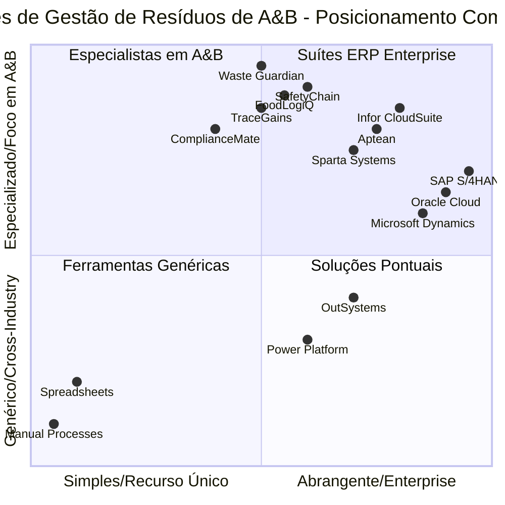

---

## 1. Concorrentes Diretos

### 1.1 Soluções Especializadas em Gestão de Resíduos de A&B

#### SafetyChain Software

| Atributo | Detalhes |
|-----------|---------|
| **Fundada** | 2008 |
| **Sede** | Califórnia, EUA |
| **Foco** | Segurança alimentar, qualidade e gestão de resíduos |
| **Clientes** | Mais de 1.000 empresas de alimentos e bebidas |
| **Principais Recursos** | Automação HACCP, gestão de fornecedores, rastreamento de resíduos |
| **Implantação** | Baseado em nuvem (SaaS) |
| **Preço** | $500-$2.000/usuário/mês |

**Pontos Fortes:**
- Profunda expertise na indústria de A&B
- Forte automação de conformidade
- Reconhecimento de marca estabelecido
- Trilhas de auditoria abrangentes

**Pontos Fracos:**
- Ponto de preço alto para o mercado intermediário
- Opções de customização limitadas
- UI/UX legado
- Implantação lenta (3-6 meses)

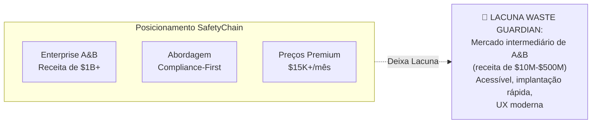

---

#### FoodLogiQ

| Atributo | Detalhes |
|-----------|---------|
| **Fundada** | 2006 |
| **Sede** | Carolina do Norte, EUA |
| **Foco** | Rastreabilidade da fazenda à mesa e gestão da qualidade |
| **Clientes** | Grandes marcas: Whole Foods, Chipotle, Starbucks |
| **Principais Recursos** | Rastreabilidade da cadeia de suprimentos, gestão de recall, auditorias de qualidade |
| **Implantação** | Baseado em nuvem |
| **Preço** | Preços enterprise (cotações personalizadas) |

**Pontos Fortes:**
- Rastreabilidade habilitada por blockchain
- Fortes efeitos de rede de fornecedores
- Excelente gestão de recall
- Segurança de nível empresarial

**Pontos Fracos:**
- Implantação complexa
- Requer integração de fornecedores
- Excesso para necessidades apenas de resíduos
- Ecossistema Mendix/low-code limitado

---

#### TraceGains

| Atributo | Detalhes |
|-----------|---------|
| **Fundada** | 2008 |
| **Sede** | Colorado, EUA |
| **Foco** | Conformidade de fornecedores e gestão de qualidade |
| **Clientes** | Mais de 1.200 empresas de alimentos, bebidas e suplementos |
| **Principais Recursos** | Gestão de documentos de fornecedores, gestão de especificações, analytics |
| **Implantação** | Baseado em nuvem |
| **Preço** | Inicial de $15K-$50K/ano |

**Pontos Fortes:**
- Abordagem de rede para dados de fornecedores
- Análise de documentos alimentada por IA
- Forte aspecto comunitário
- Boas capacidades de integração

**Pontos Fracos:**
- Gestão de resíduos é um recurso secundário
- Caro para operações menores
- Curva de aprendizado para usuários
- Automação de workflow limitada

---

#### ComplianceMate

| Atributo | Detalhes |
|-----------|---------|
| **Fundada** | 2012 |
| **Sede** | Geórgia, EUA |
| **Foco** | Monitoramento de segurança alimentar e conformidade |
| **Clientes** | Redes de restaurantes, operadores de foodservice |
| **Principais Recursos** | Monitoramento de temperatura, checklists HACCP, ações corretivas |
| **Implantação** | Nuvem + sensores IoT |
| **Preço** | $200-$500/local/mês |

**Pontos Fortes:**
- Abordagem IoT-first
- Monitoramento em tempo real
- Design nativo para dispositivos móveis
- Implantação rápida

**Pontos Fracos:**
- Limitado à conformidade operacional
- Sem análise avançada de resíduos
- Focado em restaurantes (não manufatura)
- Hardware proprietário necessário

---

### 1.2 Comparação de Recursos de Concorrentes Diretos

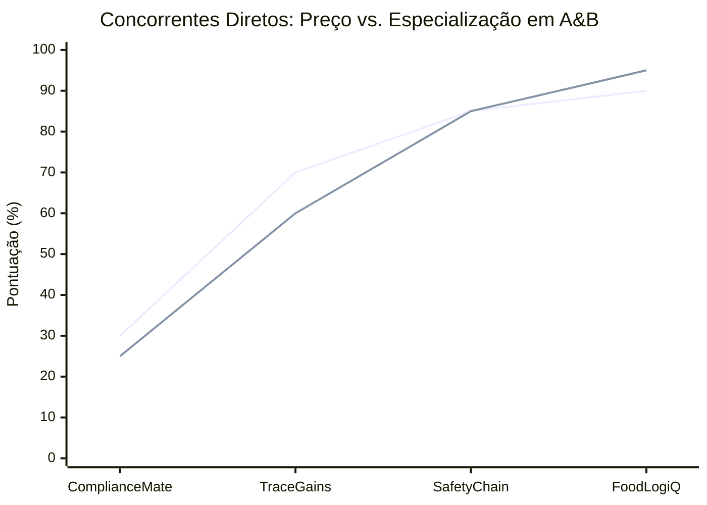

| Recurso | SafetyChain | FoodLogiQ | TraceGains | ComplianceMate | Waste Guardian |
|---------|-------------|-----------|------------|----------------|----------------|
| **Rastreamento de Resíduos** | ⭐⭐⭐ | ⭐⭐ | ⭐⭐ | ⭐ | ⭐⭐⭐⭐⭐ |
| **Conformidade de A&B** | ⭐⭐⭐⭐⭐ | ⭐⭐⭐⭐ | ⭐⭐⭐⭐ | ⭐⭐⭐⭐⭐ | ⭐⭐⭐⭐ |
| **Integração com ERP** | ⭐⭐⭐⭐ | ⭐⭐⭐⭐ | ⭐⭐⭐ | ⭐⭐ | ⭐⭐⭐⭐ |
| **Suporte a IoT** | ⭐⭐⭐ | ⭐⭐ | ⭐⭐ | ⭐⭐⭐⭐⭐ | ⭐⭐⭐⭐ |
| **Analytics/IA** | ⭐⭐⭐ | ⭐⭐⭐⭐ | ⭐⭐⭐⭐ | ⭐⭐ | ⭐⭐⭐⭐ |
| **App Móvel** | ⭐⭐⭐ | ⭐⭐⭐ | ⭐⭐⭐⭐ | ⭐⭐⭐⭐⭐ | ⭐⭐⭐⭐ |
| **Facilidade de Uso** | ⭐⭐⭐ | ⭐⭐ | ⭐⭐⭐ | ⭐⭐⭐⭐ | ⭐⭐⭐⭐⭐ |
| **Velocidade de Implantação** | ⭐⭐ | ⭐⭐ | ⭐⭐⭐ | ⭐⭐⭐⭐ | ⭐⭐⭐⭐⭐ |
| **Competitividade de Preço** | ⭐⭐ | ⭐ | ⭐⭐⭐ | ⭐⭐⭐⭐ | ⭐⭐⭐⭐⭐ |
| **Customização** | ⭐⭐ | ⭐⭐⭐ | ⭐⭐⭐ | ⭐⭐ | ⭐⭐⭐⭐⭐ |

---

## 2. Concorrentes Indiretos

### 2.1 Módulos de ERP (Gestão de Resíduos Incorporada)

#### SAP S/4HANA para Alimentos e Bebidas

| Atributo | Detalhes |
|-----------|---------|
| **Market Share** | 22% do ERP global de A&B |
| **Recursos de Resíduos** | Gestão de inventário, gestão da qualidade, relatórios de sustentabilidade |
| **Pontos Fortes** | Integração empresarial, funcionalidade abrangente, suporte global |
| **Pontos Fracos** | Complexo, caro, lento para customizar, curva de aprendizado íngreme |
| **Preço** | Implantação de $150K-$1M+ |

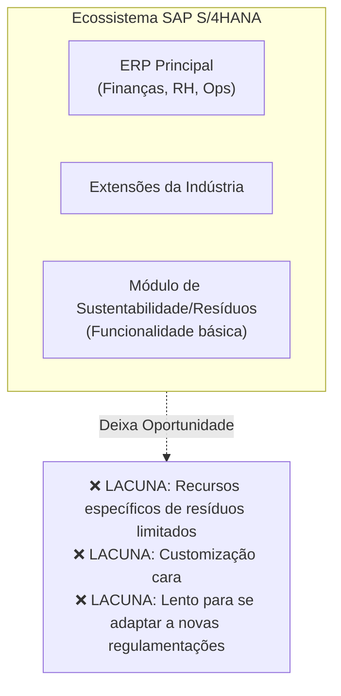

---

#### Oracle Cloud ERP (Alimentos e Bebidas)

| Atributo | Detalhes |
|-----------|---------|
| **Market Share** | 18% do ERP global de A&B |
| **Recursos de Resíduos** | Planejamento da cadeia de suprimentos, gestão do ciclo de vida do produto, sustentabilidade |
| **Pontos Fortes** | Capacidades de IA/ML, análise forte, escalabilidade |
| **Pontos Fracos** | Alto custo total de propriedade, implantação complexa |
| **Preço** | Implantação de $100K-$800K+ |

---

#### Infor CloudSuite Alimentos e Bebidas

| Atributo | Detalhes |
|-----------|---------|
| **Market Share** | 12% do ERP global de A&B |
| **Recursos de Resíduos** | Gestão de receitas, rastreabilidade de lotes, gestão da qualidade |
| **Pontos Fortes** | Específico da indústria, UX moderna, boa funcionalidade de A&B |
| **Pontos Fracos** | Integração limitada com Mendix, plataforma proprietária |
| **Preço** | Implantação de $75K-$500K |

---

### 2.2 Processos Manuais (Status Quo)

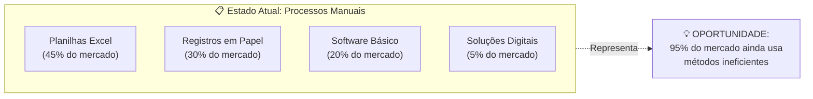

**Pontos de Dor do Processo Manual:**
- Erros de entrada de dados (taxa de erro de 15-20%)
- Nenhuma visibilidade em tempo real
- Desafios em auditorias de conformidade
- Nenhuma capacidade preditiva
- Relatórios demorados
- Informações isoladas

---

## 3. Concorrentes de Plataforma (Low-Code/No-Code)

### 3.1 Cenário de Plataformas Low-Code

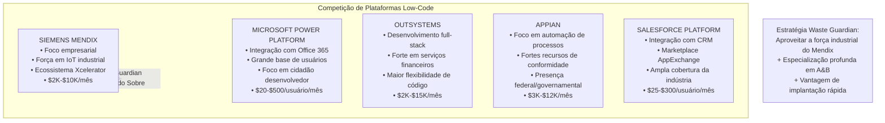

### 3.2 Matriz de Comparação de Plataformas

| Plataforma | Posição no Gartner | Foco Industrial | Especialização em A&B | Experiência do Desenvolvedor | Adoção Empresarial |
|----------|-----------------|------------------|-------------------|---------------------|---------------------|
| **Mendix** | Líder | ⭐⭐⭐⭐⭐ | ⭐⭐⭐ | ⭐⭐⭐⭐ | ⭐⭐⭐⭐ |
| **Power Platform** | Líder | ⭐⭐⭐ | ⭐⭐ | ⭐⭐⭐⭐ | ⭐⭐⭐⭐⭐ |
| **OutSystems** | Líder | ⭐⭐⭐ | ⭐⭐ | ⭐⭐⭐⭐⭐ | ⭐⭐⭐⭐ |
| **Appian** | Desafiante | ⭐⭐⭐ | ⭐⭐⭐ | ⭐⭐⭐ | ⭐⭐⭐⭐ |
| **Salesforce** | Líder | ⭐⭐ | ⭐⭐ | ⭐⭐⭐ | ⭐⭐⭐⭐⭐ |

### 3.3 Vantagens Competitivas da Siemens/Mendix

| Vantagem | Descrição | Benefício para o Waste Guardian |
|-----------|-------------|----------------------|
| **Integração Xcelerator** | Conexão nativa com sistemas industriais | Integração direta com sensores IoT |
| **IoT Industrial** | Capacidades da plataforma MindSphere | Monitoramento de equipamentos em tempo real |
| **DNA de Manufatura** | Nascido da automação industrial | Soluções prontas para o chão de fábrica |
| **Suporte Global** | Presença mundial da Siemens | Credibilidade empresarial |
| **Pronto para Conformidade** | Padrões de segurança industrial | Aceitação em indústrias regulamentadas |

---

## 4. Matriz de Comparação de Recursos

### 4.1 Análise Abrangente de Recursos

| Categoria de Recurso | Recurso | SafetyChain | FoodLogiQ | SAP | Mendix/Waste Guardian |
|-----------------|---------|-------------|-----------|-----|----------------------|
| **Gestão de Resíduos Principal** |
| | Rastreamento e registro de resíduos | ✅ | ⚠️ | ⚠️ | ✅✅ |
| | Categorização de resíduos | ✅ | ❌ | ✅ | ✅✅ |
| | Gestão de descarte | ✅ | ❌ | ⚠️ | ✅ |
| | Relatórios regulatórios | ✅✅ | ✅ | ✅✅ | ✅ |
| **Analytics & IA** |
| | Análise de padrões de resíduos | ⚠️ | ❌ | ✅ | ✅✅ |
| | Análise preditiva | ❌ | ❌ | ✅ | ✅ |
| | Insights automatizados | ❌ | ❌ | ⚠️ | ✅ |
| | Dashboards personalizados | ⚠️ | ✅ | ✅ | ✅✅ |
| **Integração** |
| | Integração com ERP (SAP) | ✅ | ✅ | N/A | ✅ |
| | Sensores IoT | ⚠️ | ❌ | ✅ | ✅✅ |
| | Sistemas SCADA/OT | ❌ | ❌ | ✅ | ✅✅ |
| | Sistemas de contabilidade | ✅ | ⚠️ | ✅✅ | ✅ |
| **Conformidade** |
| | Suporte a HACCP | ✅✅ | ✅ | ✅ | ✅ |
| | PNRS (Brasil) | ❌ | ❌ | ⚠️ | ✅✅ |
| | ISO 14001 | ✅ | ⚠️ | ✅ | ✅ |
| | Trilhas de auditoria | ✅✅ | ✅✅ | ✅✅ | ✅ |
| **Usabilidade** |
| | App móvel | ✅ | ✅ | ✅ | ✅✅ |
| | Capacidade offline | ❌ | ❌ | ⚠️ | ✅ |
| | Multi-idioma | ✅ | ✅ | ✅✅ | ✅ |
| | Customização | ⚠️ | ⚠️ | ⚠️ | ✅✅ |
| **Implantação** |
| | Tempo de implantação | 3-6 m | 4-8 m | 6-18 m | 2-6 semanas |
| | Implantação em nuvem | ✅ | ✅ | ✅ | ✅ |
| | Opção on-premise | ⚠️ | ❌ | ✅ | ✅ |
| | Escalabilidade | ✅ | ✅ | ✅✅ | ✅ |

*Legenda: ✅✅ = Excelente, ✅ = Bom, ⚠️ = Limitado, ❌ = Não Disponível*

### 4.2 Capacidades Únicas do Waste Guardian

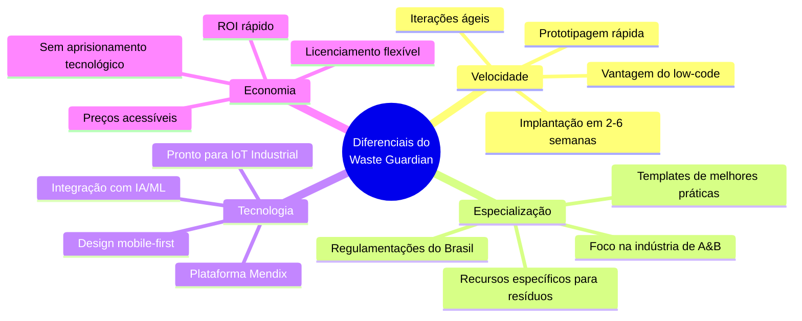

---

## 5. Benchmark de Preços

### 5.1 Análise de Preços de Mercado

| Tipo de Solução | Faixa de Preço | Custo de Implantação | Custo Total Ano 1 | Segmento Alvo |
|---------------|-------------|---------------------|-------------------|----------------|
| **ERP Enterprise (SAP/Oracle)** | $50K-$500K/ano | $200K-$1M | $500K-$2M+ | Grande Empresa |
| **Especializada A&B (SafetyChain)** | $15K-$60K/ano | $30K-$100K | $100K-$200K | Média-Grande Empresa |
| **Rastreabilidade (FoodLogiQ)** | $25K-$100K/year | $50K-$200K | $150K-$400K | Enterprise |
| **Gestão de Qualidade (TraceGains)** | $15K-$50K/ano | $20K-$80K | $80K-$150K | Mercado Intermediário+ |
| **Monitoramento (ComplianceMate)** | $5K-$30K/ano | $10K-$40K | $30K-$80K | Redes de Restaurantes |
| **Waste Guardian (Proposto)** | $5K-$25K/ano | $5K-$20K | $20K-$60K | Mercado Intermediário |

### 5.2 Comparação de Proposta de Valor

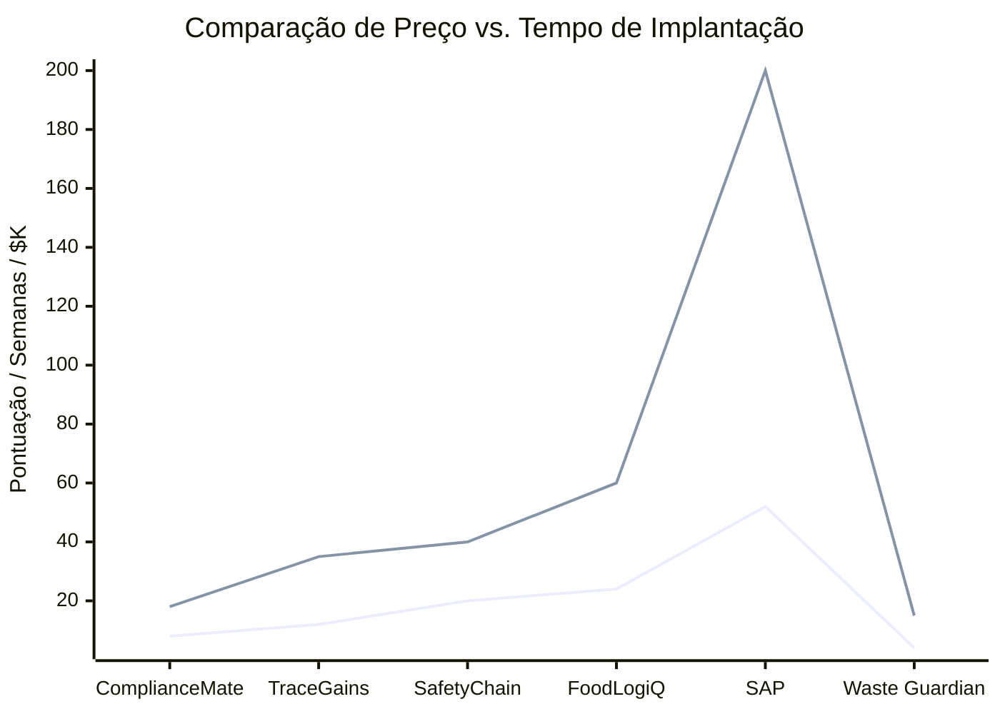

### 5.3 Estratégia de Preços do Waste Guardian

| Nível | Preço Mensal | Preço Anual | Recursos | Alvo |
|------|--------------|--------------|----------|--------|
| **Starter** | $500 | $5.000 | Rastreamento básico de resíduos, 1 instalação, 5 usuários | Pequenos fabricantes de A&B |
| **Professional** | $1.500 | $15.000 | Recursos completos, 3 instalações, 20 usuários, IoT | Empresas de mercado intermediário |
| **Enterprise** | $4.000+ | $40.000+ | Ilimitado, integrações customizadas, suporte dedicado | Grandes processadores |

---

## 6. Estratégia de Diferenciação

### 6.1 Posicionamento Competitivo do Waste Guardian

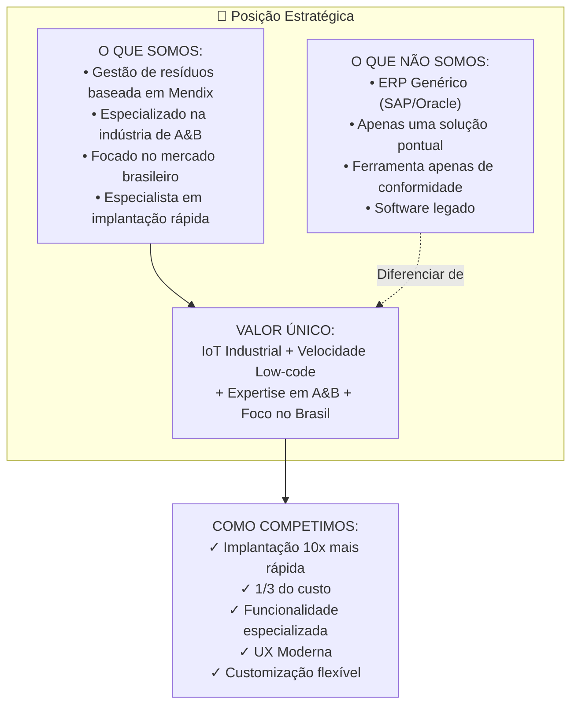

### 6.2 Principais Diferenciais

#### 1. Rapidez para o Valor

| Competidor | Implantação Típica | Waste Guardian |
|------------|----------------------|----------------|
| SAP/Oracle | 6-18 meses | 2-6 semanas |
| SafetyChain | 3-6 meses | 2-6 semanas |
| FoodLogiQ | 4-8 meses | 2-6 semanas |
| **Vantagem** | - | **6x-12x mais rápido** |

#### 2. Custo Total de Propriedade

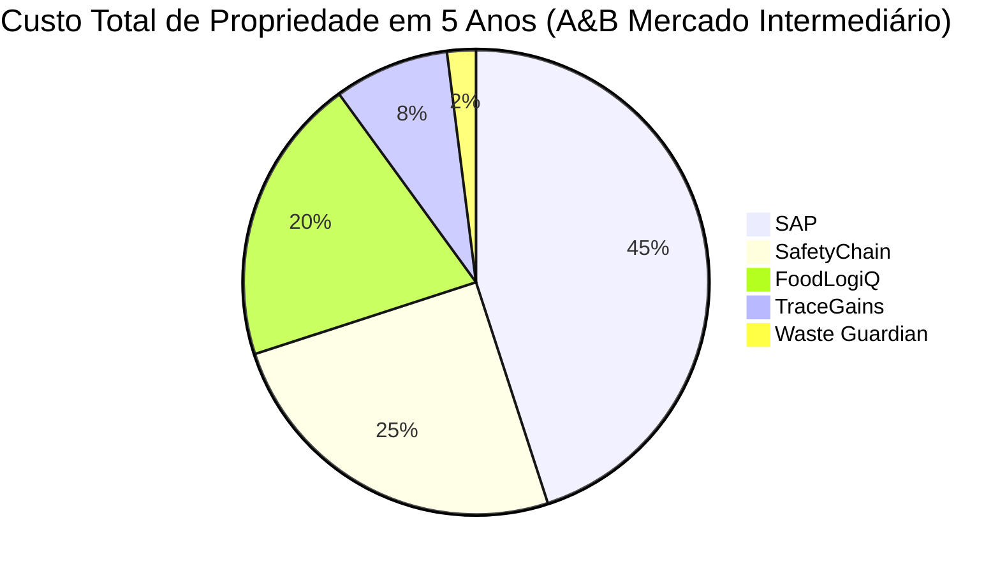

#### 3. Especialização na Indústria

| Aspecto | ERP Genérico | Waste Guardian |
|--------|-------------|----------------|
| Taxonomia de resíduos | Requer construção customizada | Categorias de A&B pré-construídas |
| Templates regulatórios | Genéricos | PNRS, prontos para ISO 14001 |
| Benchmarks de KPI | Nenhum | Padrões da indústria integrados |
| Melhores práticas | Requer consultoria | Workflows incorporados |

#### 4. Vantagem Tecnológica

| Recurso | Soluções Tradicionais | Waste Guardian (Mendix) |
|---------|---------------------|------------------------|
| Atualizações | Lançamentos trimestrais | Implantação contínua |
| Customização | Requer alterações de código | Configuração visual |
| Mobile | App separado necessário | Responsivo por padrão |
| Integração | Desenvolvimento customizado | Conectores pré-construídos |
| IA/ML | Produtos complementares | Integração nativa |

---

## 7. Cenários de Resposta Competitiva

### 7.1 Se o SAP/Oracle adicionar recursos de resíduos

**Resposta Provável:**
- Agrupar recursos de resíduos em módulos de sustentabilidade
- Alvejar clientes existentes

**Contra-ataque do Waste Guardian:**
- Enfatizar velocidade e especialização
- Alvejar clientes SAP/Oracle que precisam de implantação rápida
- Oferecer solução complementar best-of-breed

### 7.2 Se o SafetyChain baixar os preços

**Resposta Provável:**
- Lançar nível "Essentials"
- Focar na conformidade principal

**Contra-ataque do Waste Guardian:**
- Destacar a UX moderna e o ecossistema Mendix
- Enfatizar as capacidades de customização
- Posicionar-se como alternativa de próxima geração

### 7.3 Se a Microsoft focar em A&B

**Resposta Provável:**
- Lançar templates de A&B da Power Platform
- Aproveitar a integração com o Office 365

**Contra-ataque do Waste Guardian:**
- Enfatizar as capacidades de IoT industrial
- Destacar a força empresarial do Mendix
- Focar em recursos específicos de manufatura

---

## 8. Estratégia de Entrada no Mercado

### 8.1 Priorização de Segmentos Alvo

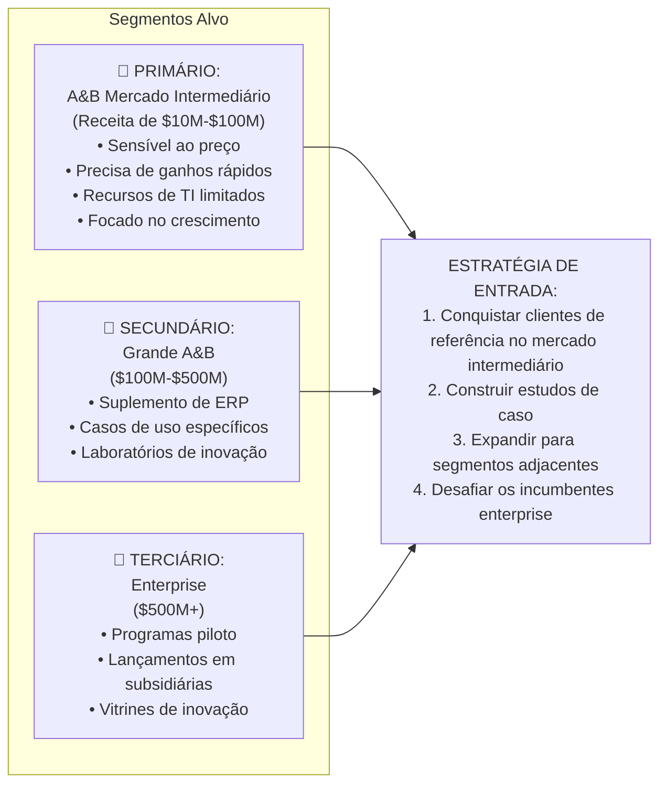

### 8.2 Táticas Competitivas

| Situação | Tática | Mensagem |
|-----------|--------|---------|
| vs. SAP/Oracle | Ataque pelos flancos | "Coloque a gestão de resíduos em funcionamento em semanas, não anos" |
| vs. SafetyChain | Diferenciação de preço | "80% da funcionalidade a 30% do custo" |
| vs. Manual/Excel | Educação | "ROI em 3 meses através da redução de resíduos" |
| vs. Power Platform | Capacidade | "Nível industrial com facilidade de consumo" |
| Campo virgem (Greenfield) | Visão | "Comece sua jornada de transformação digital aqui" |

---

## 9. Conclusão

O mercado de software de gestão de resíduos de A&B apresenta uma oportunidade significativa para o Waste Guardian devido a:

1. **Competição Fragmentada**: Nenhum player dominante na gestão de resíduos de A&B no mercado intermediário
2. **Incumbentes Legados**: Soluções lentas e caras deixam lacunas
3. **Maioria Manual**: 95% ainda usam métodos ineficientes
4. **Pressão Regulatória**: Aumento dos requisitos de conformidade
5. **Mudança Tecnológica**: Low-code permitindo soluções rápidas e acessíveis

**A fórmula vencedora do Waste Guardian:**
- ✅ **Velocidade**: Implantação em 2-6 semanas vs. 3-18 meses
- ✅ **Custo**: 1/3 a 1/10 do custo das alternativas
- ✅ **Especialização**: Construído especificamente para resíduos de A&B
- ✅ **Stack Moderna**: Mendix + IA + IoT + Mobile
- ✅ **Flexibilidade**: Customizável sem codificação

O cenário competitivo favorece uma solução ágil e especializada que pode entregar ROI rápido enquanto escala para atender aos requisitos empresariais através da plataforma Mendix.

---

*Versão do Documento: 1.0*
*Última Atualização: Abril de 2026*
*Fontes: Gartner Magic Quadrant, sites das empresas, relatórios da indústria, estimativas de analistas*
