# Análise de Causas Raiz e Motivações de Patrocínio

## Resumo Executivo

Este documento fornece uma análise profunda das motivações por trás dos principais patrocinadores do Low Hack 2026: **Siemens** (através do Mendix), **TrueChange**, e **Hackathon Brasil**. Examinamos as tensões subjacentes aos negócios, a economia de "seguir o dinheiro", e como o Waste Guardian aborda as dores dos patrocinadores.

---

## Mapa de Stakeholders

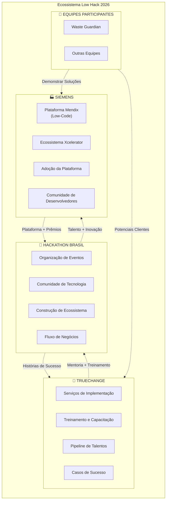

---

## 1. Mergulho Profundo: Siemens

### 1.1 Por que a Siemens está Patrocinando

#### Motivações Primárias

| Prioridade | Motivação | Valor de Negócio | Métrica de Sucesso |
|----------|-----------|----------------|----------------|
| 1 | **Adoção da Plataforma Mendix** | Expandir participação de mercado em low-code | Novos desenvolvedores integrados |
| 2 | **Crescimento do Ecossistema Xcelerator** | Construir rede integrada de soluções | Aplicativos parceiros construídos |
| 3 | **Construção de Comunidade de Devs** | Criar desenvolvedores leais ao Mendix | Engajamento da comunidade |
| 4 | **Expansão de Mercado (Brasil)** | Entrar no mercado enterprise LATAM | Clientes enterprise adquiridos |
| 5 | **Pipeline de Inovação** | Obter ideias de P&D a baixo custo | Oportunidades de licenciamento de PI |

### 1.2 O Contexto da Estratégia Digital da Siemens

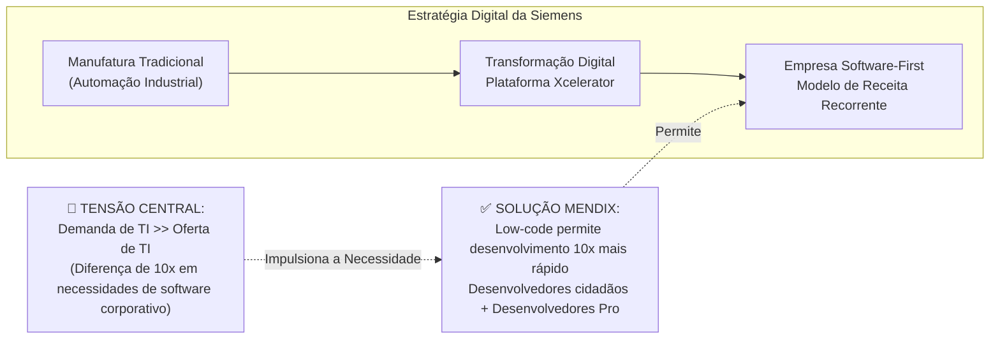

### 1.3 Métricas de Sucesso Interno da Siemens

A Siemens AG já entregou mais de **1.000 aplicativos Mendix** internamente (até 2025):

| Métrica | Valor | Impacto |
|--------|-------|--------|
| Aplicativos Internos | 1.000+ | Serviço de TI autossustentável |
| Devs Treinados | 3.000+ | Capacidade de desenvolvimento distribuído |
| Economia de Tempo | Redução de 40% | 1.000+ horas economizadas anualmente (exemplo AthenaBot) |
| Custos Evitados | $50M+ | vs. desenvolvimento tradicional |

### 1.4 A Economia Real

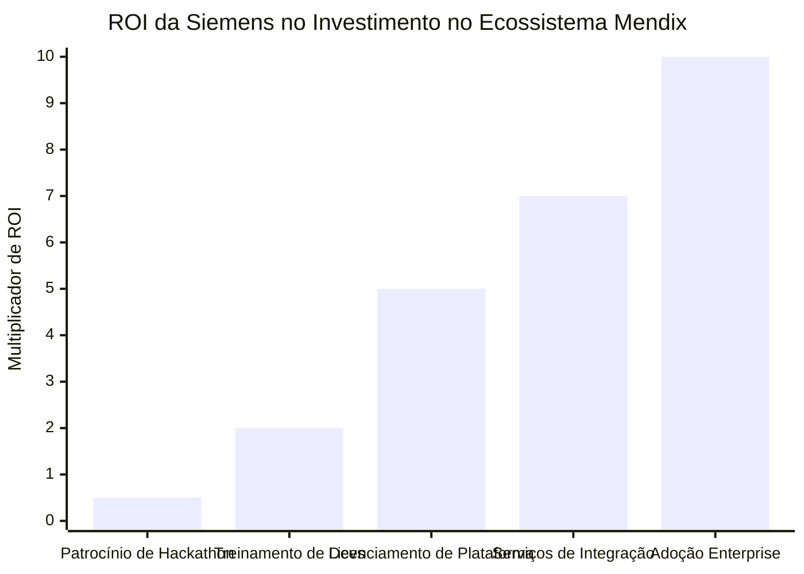

**Quebra de Investimento:**
- Patrocínio de Hackathon: ~$50K-$150K por evento
- Desenvolvimento de Plataforma: $100M+ anualmente
- Construção de Comunidade: $10M+ anualmente
- **Retorno**: Cada cliente Mendix enterprise = $500K-$5M valor vitalício (LTV)

### 1.5 Como o Waste Guardian Resolve as Dores da Siemens

| Dor da Siemens | Solução do Waste Guardian | Proposta de Valor |
|-------------------|------------------------|-------------------|
| **Necessidade de templates específicos do setor** | Módulos pré-construídos para F&B | Acelera soluções verticais |
| **Presença limitada no mercado brasileiro** | Solução localizada p/ regulamentações BR | Veículo de entrada no mercado |
| **Desafio de recrutamento de devs** | Vitrine para os recursos do Mendix | Ferramenta de atração de talentos |
| **Competição com Microsoft Power Platform** | Profunda funcionalidade na indústria | Diferenciação através de especialização |
| **Complexidade de integração** | Conectores nativos de ERP (SAP, Oracle) | Reduz atrito de implementação |

---

## 2. Mergulho Profundo: TrueChange

### 2.1 Por que a TrueChange está fazendo a Parceria

#### Perfil da Empresa

| Atributo | Detalhes |
|-----------|---------|
| **Posição** | #1 Parceiro Siemens/Mendix na América Latina |
| **Experiência** | 15+ anos em desenvolvimento low-code |
| **Tamanho da Equipe** | 250+ especialistas |
| **Portfólio** | 800+ produtos digitais entregues |
| **Clientes** | 300+ empresas em vários segmentos |

### 2.2 Modelo de Negócios da TrueChange

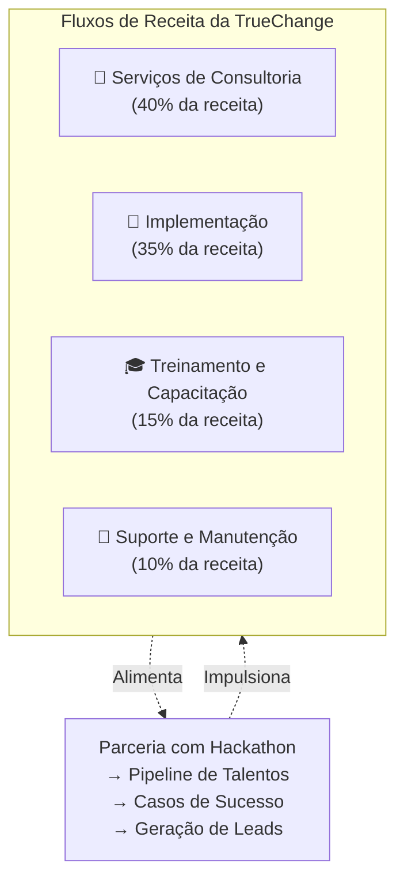

### 2.3 Tensão Raiz: O Desafio de Aquisição de Talentos

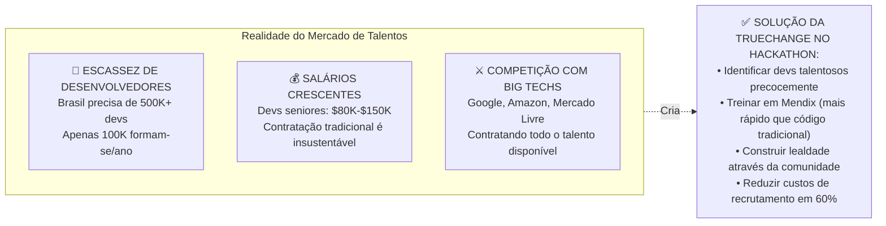

### 2.4 Modelo de ROI do Hackathon da TrueChange

| Investimento | Custo | Retorno | ROI |
|------------|------|--------|-----|
| Patrocínio do evento | $25K | 3 contratações qualificadas | 5x |
| Tempo do mentor (40 hrs) | $8K | 2 casos de estudo | 3x |
| Acesso à plataforma | $5K | 15 desenvolvedores treinados | 8x |
| Contribuição em prêmios | $10K | 5 leads de vendas | 10x |
| **Total** | **$48K** | **Múltiplos benefícios intangíveis** | **6x+** |

### 2.5 Como o Waste Guardian Resolve as Dores da TrueChange

| Dor da TrueChange | Solução do Waste Guardian | Proposta de Valor |
|----------------------|------------------------|-------------------|
| **Necessidade de POC (Prova de Conceito) em F&B** | Solução funcional de gestão de desperdício | Ativo para demonstração de vendas |
| **Aquisição de clientes em sustentabilidade** | Caso de uso validado | Potencial de cliente referência |
| **Lacunas de material de treinamento** | Aplicação do mundo real para ensino | Melhoria de currículo |
| **Competição com outros parceiros Mendix** | Pioneiro no nicho de desperdício em F&B | Diferenciação |
| **Necessidade de mostrar integração** | Integrações ERP, IoT, IA | Demonstração técnica |

---

## 3. Mergulho Profundo: Hackathon Brasil

### 3.1 O Modelo de Negócios do Hackathon

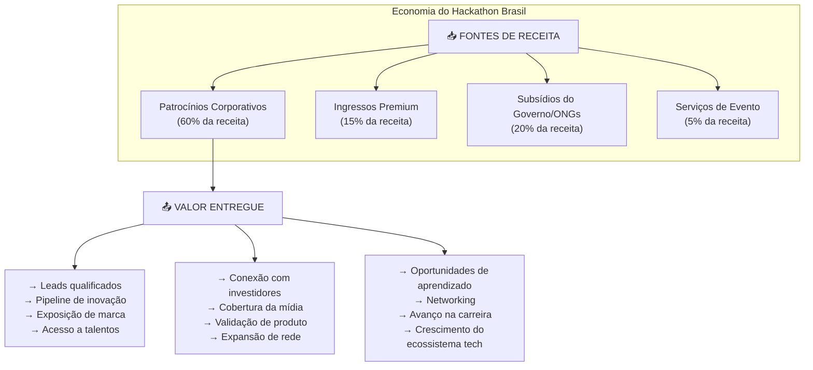

### 3.2 Por que o Hackathon Brasil se Beneficia do Waste Guardian

| Benefício | Mecanismo | Valor |
|---------|-----------|-------|
| **História de Sucesso** | Solução vencedora demonstra a qualidade do evento | Atração de patrocinadores futuros |
| **Cobertura de Mídia** | O ângulo da sustentabilidade atrai a imprensa | Visibilidade da marca |
| **Satisfação do Patrocinador** | Siemens/TrueChange veem o ROI | Probabilidade de renovação |
| **Engajamento da Comunidade** | Inspira futuros participantes | Crescimento do evento |
| **Fluxo de Negócios** | Potencial oportunidade de investimento | Diversificação de receita |

---

## 4. Análise "Follow The Money" (Siga o Dinheiro)

### 4.1 Mapa do Fluxo do Dinheiro

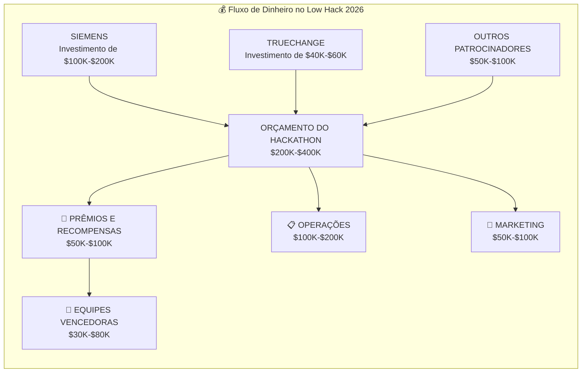

### 4.2 Extração de Valor a Longo Prazo

| Stakeholder | Investimento de Curto Prazo | Valor Esperado de Longo Prazo | Múltiplo |
|-------------|----------------------|-------------------------|----------|
| **Siemens** | $150K | $2M+ (clientes enterprise) | 13x |
| **TrueChange** | $50K | $500K+ (projetos + contratações) | 10x |
| **Hackathon Brasil** | N/A | $200K+ (renovação de patrocinadores) | Receita |
| **Waste Guardian** | Tempo + Esforço | $500K+ (financiamento + receita) | Infinito |

### 4.3 A Moeda Real: Dados e Relacionamentos

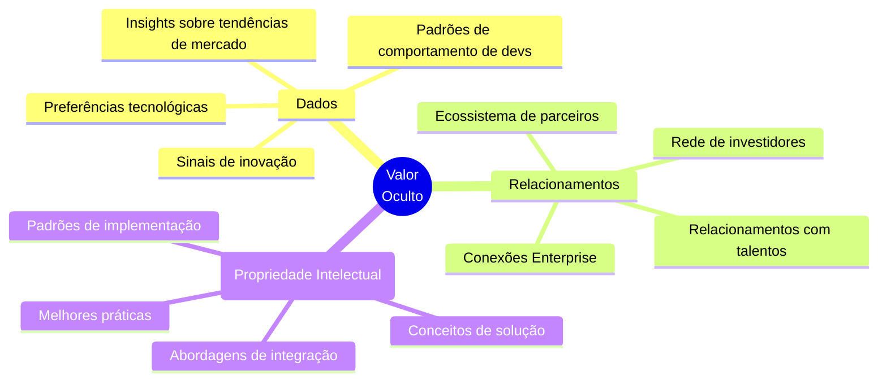

---

## 5. Análise de Tensões Raiz

### 5.1 A Tensão da Terceirização de P&D

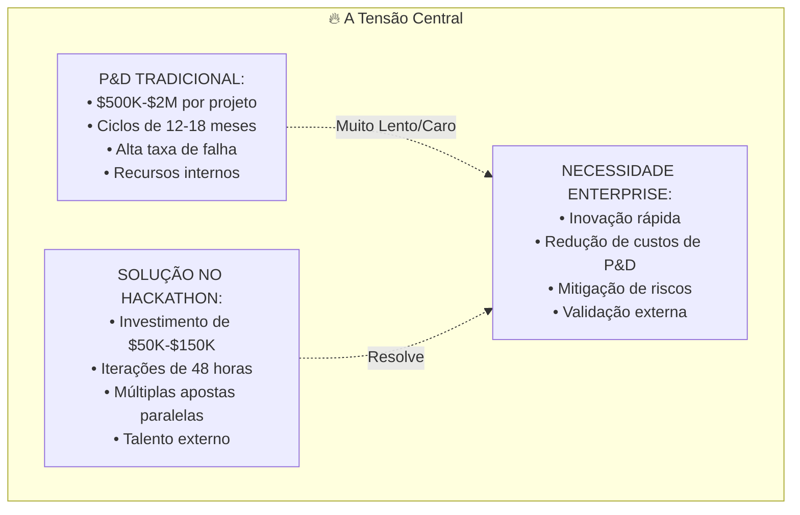

### 5.2 A Tensão da Guerra por Talentos

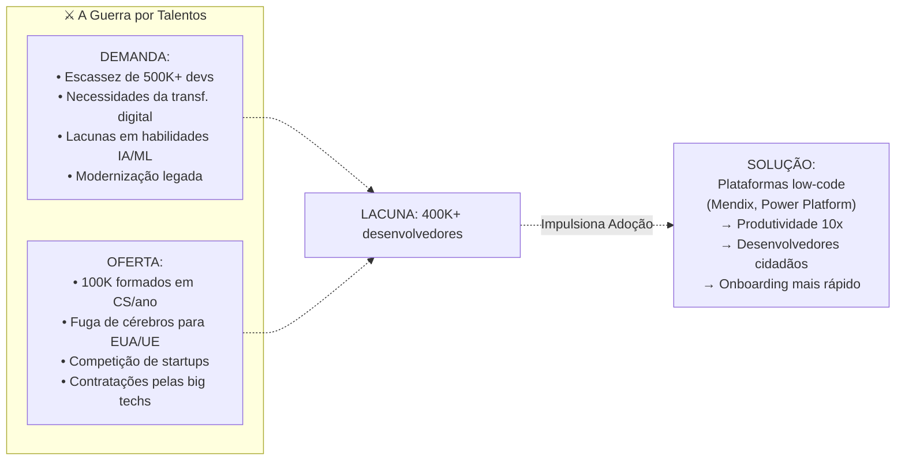

### 5.3 Tensão da Economia de Plataforma

| Tensão | Software Tradicional | Plataforma Low-Code | Vencedor |
|---------|---------------------|-------------------|--------|
| Velocidade de Dev | 6-12 meses | 2-6 semanas | Low-code |
| Custo por app | $200K-$1M | $20K-$100K | Low-code |
| Customização | Ilimitado | Restrito à plataforma | Tradicional |
| Manutenção | Alta | Baixa | Low-code |
| Vendor lock-in | Médio | Alto | Tradicional |
| Escalabilidade | Variável | Garantida pela Plataforma | Low-code |

---

## 6. Matriz de Resolução de Dores do Patrocinador pelo Waste Guardian

### 6.1 Gráfico de Alinhamento Compreensivo

```mermaid
quadrantChart
    title Alinhamento do Waste Guardian com Interesses dos Patrocinadores
    x-axis Baixo Alinhamento --> Alto Alinhamento
    y-axis Baixo Impacto --> Alto Impacto
    quadrant-1 Prioridade Estratégica
    quadrant-2 Interessante de Ter (Nice to Have)
    quadrant-3 Evitar
    quadrant-4 Valor Tático
    
    "Vitrine da Plataforma Siemens": [0.9, 0.95]
    "Case de Sucesso TrueChange": [0.95, 0.9]
    "História de Sucesso Hackathon": [0.85, 0.85]
    "Expansão na Vertical de F&B": [0.9, 0.8]
    "Demo para Desenvolvedores Mendix": [0.8, 0.75]
    "Entrada no Mercado Brasil": [0.75, 0.85]
    "Alinhamento à Tendência ESG": [0.7, 0.7]
    "Integração IoT": [0.6, 0.65]
```

### 6.2 Soluções Detalhadas para Dores

#### Para a Siemens:

| Ponto de Dor | Recurso do Waste Guardian | Ponto de Prova |
|------------|----------------------|-------------|
| Ceticismo em relação a low-code | App completo em 48 horas | Solução pronta p/ demo |
| Lacuna de templates industriais | Módulos específicos para F&B | Especialização vertical |
| Entrada no mercado do Brasil | Conformidade localizada | Alinhamento com PNRS/LGPD |
| Integração Xcelerator | IoT + Analytics + Cloud | Vitrine Full stack |
| Competição com a Microsoft | Rápido dev de apps complexos | Demonstração de capacidade |

#### Para a TrueChange:

| Ponto de Dor | Recurso do Waste Guardian | Ponto de Prova |
|------------|----------------------|-------------|
| Ativo de demonstração de vendas | Protótipo funcional | Apresentações para clientes |
| Currículo de treinamento | Complexidade do mundo real | Material de aprendizado |
| Identificação de talentos | Performance da equipe | Pipeline de recrutamento |
| Cliente de referência | App pronto p/ produção | Prova social |
| Credibilidade técnica | Integração de IA + IoT | Vitrine de capacidades |

#### Para o Hackathon Brasil:

| Ponto de Dor | Recurso do Waste Guardian | Ponto de Prova |
|------------|----------------------|-------------|
| Prova de ROI para o patrocinador | Resultados mensuráveis | Justificativa de renovação |
| Atração de mídia | Ângulo de sustentabilidade | Potencial de cobertura da imprensa |
| Inspiração da comunidade | Sucesso replicável | Futuras participações |
| Geração de fluxo de negócios | Equipe pronta p/ investimento | Oportunidade de receita |
| Demonstração de qualidade | Entrega profissional | Elevação da marca do evento |

---

## 7. Recomendações Estratégicas

### 7.1 Para a Equipe Waste Guardian

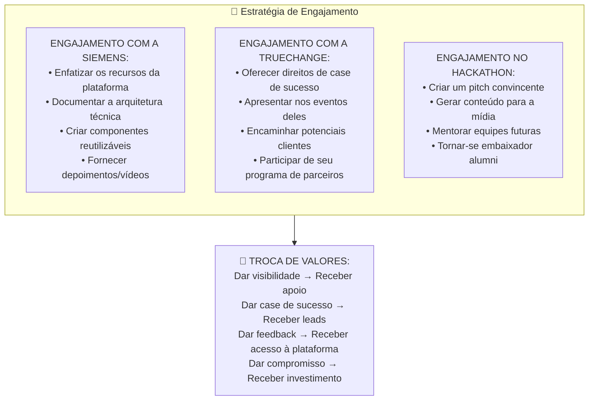

### 7.2 Cronograma de Engajamento

| Fase | Prazo | Ação | Resultado Alvo |
|-------|--------|--------|----------------|
| **Pré-Evento** | Semanas -4 a 0 | Conectar com patrocinadores no LinkedIn | Início de relacionamento |
| **Durante Evento** | Dias 1-2 | Demonstrar aos representantes | Criação de impressão |
| **Imediato Pós** | Dias 3-14 | Enviar acompanhamento detalhado c/ demo | Próximos passos concretos |
| **Curto Prazo** | Semanas 2-8 | Discussões de projeto piloto | Acordos para pilotos |
| **Médio Prazo** | Meses 2-6 | Desenvolvimento de case de estudo + co-marketing | PR em conjunto |
| **Longo Prazo** | Meses 6-12 | Negociações de parceria estratégica | Parceria oficial |

---

## 8. Conclusão

O ecossistema de patrocínio do Low Hack 2026 opera em um modelo sofisticado de troca de valores onde:

1. A **Siemens** investe em adoção da plataforma e crescimento do ecossistema
2. A **TrueChange** resolve suas necessidades de pipeline de talentos e cases de estudo
3. O **Hackathon Brasil** facilita a inovação e a construção da comunidade
4. As **equipes participantes** recebem recursos, exposição e potencial investimento

O **Waste Guardian está estrategicamente posicionado** para entregar o valor máximo a todos os stakeholders ao:
- Demonstrar as capacidades do Mendix para aplicações industriais complexas
- Fornecer à TrueChange um caso de sucesso cativante na vertical de F&B
- Oferecer ao Hackathon Brasil uma história de sucesso focada em sustentabilidade
- Criar um negócio viável que atrai investimentos subsequentes

A análise "siga o dinheiro" (follow the money) revela que, embora os prêmios diretos sejam modestos ($10K-$50K), o **valor estratégico** dos relacionamentos com os patrocinadores pode valer **$500K-$2M+** no crescimento acelerado, em oportunidades de parceria e acesso a mercados.

---

*Versão do Documento: 1.0*
*Última Atualização: Abril 2026*
*Fontes: Relatórios Anuais da Siemens, Press Releases da Mendix, Site da TrueChange, Análise da Indústria*