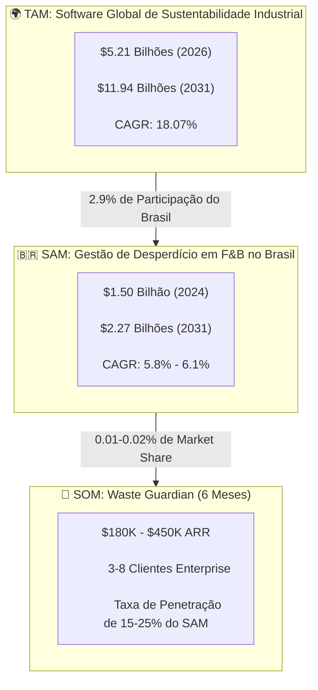
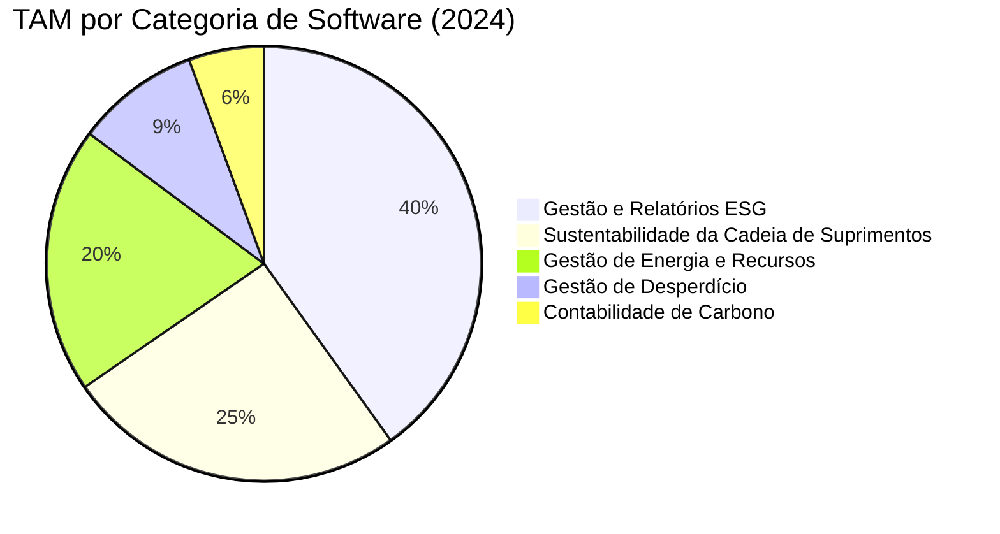
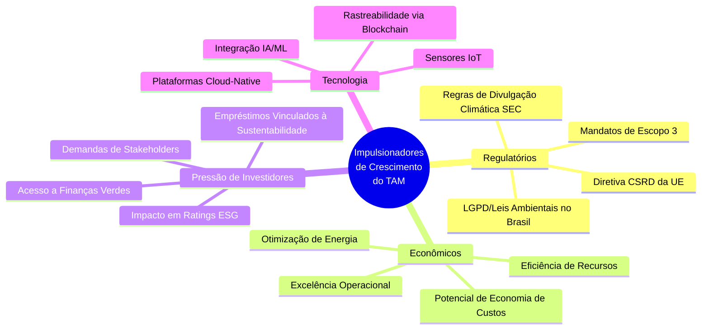
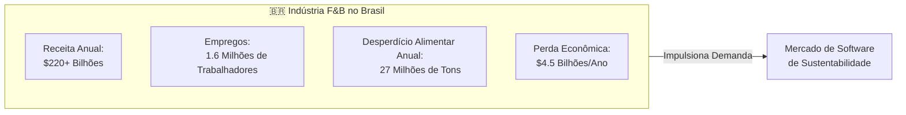
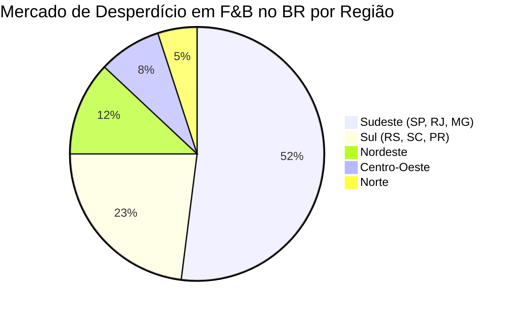
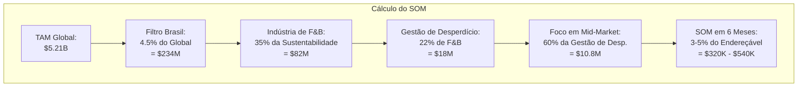
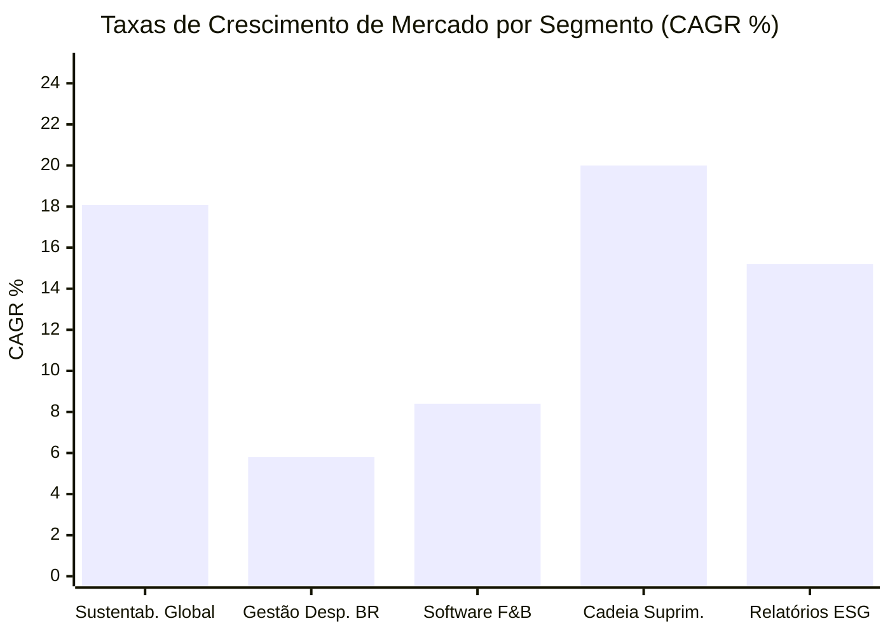
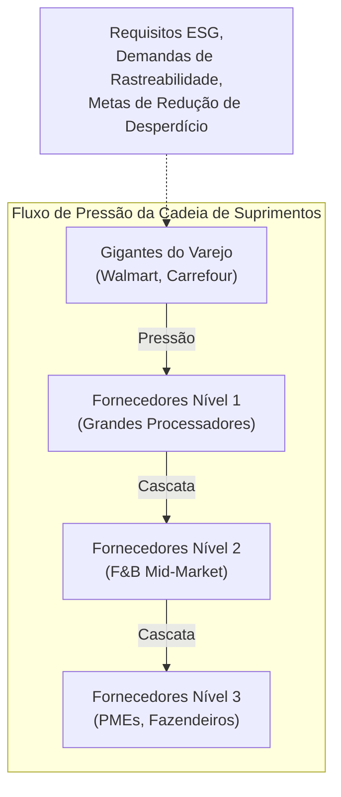
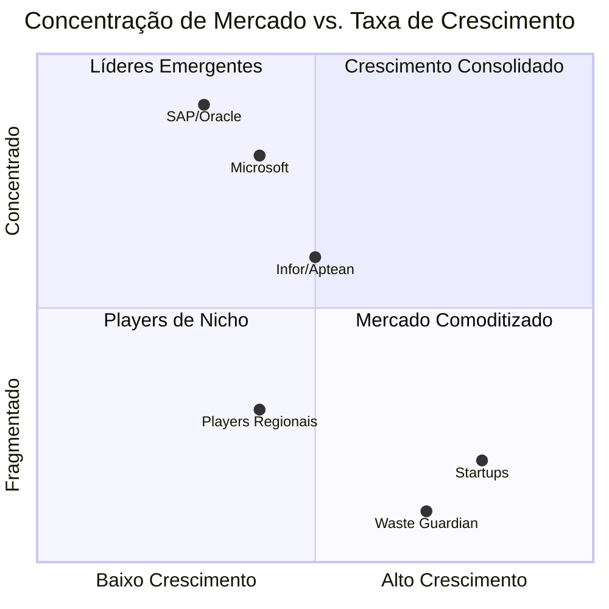
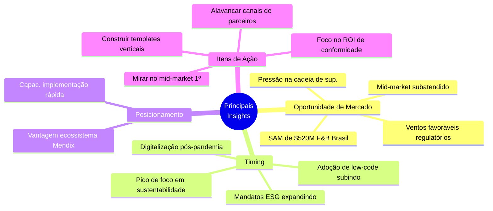

# Análise TAM/SAM/SOM: Mercado de Sustentabilidade Industrial

## Resumo Executivo

Este documento apresenta uma análise abrangente de dimensionamento de mercado para o Waste Guardian, uma solução de gestão de desperdício baseada em Mendix, voltada para a indústria de Alimentos e Bebidas (F&B). A análise abrange o Mercado Total Endereçável (TAM), Mercado Útil Endereçável (SAM) e Mercado Útil Obtível (SOM) com projeções detalhadas de crescimento e impulsionadores de mercado.

---

## Visão Geral do Dimensionamento de Mercado

---

## 1. TAM: Mercado Total Endereçável

### Mercado Global de Software de Sustentabilidade Industrial

| Métrica | Valor | Fonte |
|--------|-------|--------|
| **Tamanho do Mercado 2024** | $4.41 Bilhões | Mordor Intelligence |
| **Tamanho do Mercado 2025** | $5.21 Bilhões | Mordor Intelligence |
| **Previsão 2030** | $10.23 Bilhões | Market Research Future |
| **Previsão 2031** | $11.94 Bilhões | Mordor Intelligence |
| **CAGR (2024-2031)** | 18.07% | Análise da Indústria |

### Segmentação de Mercado por Componente

### Distribuição Regional

| Região | Market Share 2024 | CAGR (2024-2031) | Projeção 2031 |
|--------|------------------|------------------|-----------------|
| **América do Norte** | 42.0% | 16.9% | $5.02B |
| **Europa** | 28.5% | 17.2% | $3.40B |
| **Ásia-Pacífico** | 23.0% | 18.8% | $2.24B |
| **América Latina** | 4.5% | 15.5% | $0.83B |
| **Oriente Médio e África**| 2.0% | 16.2% | $0.45B |

### Impulsionadores de Crescimento do TAM

---

## 2. SAM: Mercado Útil Endereçável

### Mercado de Gestão de Desperdício Alimentar no Brasil

| Métrica | Valor | Ano | Fonte |
|--------|-------|------|--------|
| **Tamanho do Mercado** | $1.50 Bilhão | 2024 | Cognitive Market Research |
| **Tamanho Projetado** | $1.77 Bilhão | 2033 | Mobility Foresights |
| **CAGR** | 5.65% - 5.8% | 2024-2033 | Relatórios da Indústria |
| **Segmento Indústria F&B** | ~$520 Milhões | 2024 | Est. (35% do total) |

### Contexto da Indústria de F&B no Brasil

### Divisão do SAM por Segmento

| Segmento | Tam. do Mercado (2024) | Taxa Cresc. | Principais Players |
|---------|-------------------|-------------|-------------|
| **Grandes Empresas** | $312M | 6.2% | BRF, JBS, Nestlé BR |
| **Middle-Market** | $156M | 7.1% | Processadores Regionais |
| **PMEs** | $52M | 8.5% | Fabricantes Locais |
| **Total SAM F&B** | **$520M** | **6.5%** | - |

### Distribuição Geográfica do SAM (Brasil)

---

## 3. SOM: Mercado Útil Obtível

### Alvo de 6 Meses para Waste Guardian

| Métrica | Conservador | Moderado | Agressivo |
|--------|-------------|----------|------------|
| **Meta de ARR** | $180K | $320K | $450K |
| **Clientes Enterprise**| 3 | 5 | 8 |
| **Valor Médio Contrato**| $60K | $64K | $56K |
| **Market Share do SAM** | 0.01% | 0.02% | 0.03% |
| **Prazo de Implementação**| 6 meses | 6 meses | 6 meses |

### Metodologia de Cálculo do SOM

### Trajetória de Crescimento do SOM

| Fase | Prazo | Alvo | ARR Cumulativo |
|-------|----------|--------|----------------|
| **Lançamento** | Meses 1-3 | 1-2 Clientes Piloto | $30K-$60K |
| **Expansão** | Meses 4-6 | 3-5 Clientes | $180K-$320K |
| **Escala** | Meses 7-12 | 8-15 Clientes | $500K-$960K |
| **Crescimento**| Ano 2 | 20-35 Clientes | $1.2M-$2.1M |

---

## 4. Taxas de Crescimento e Projeções de Mercado

### Análise CAGR por Segmento

### Projeção de Mercado para 5 Anos

| Ano | TAM (Global) | SAM (F&B Brasil) | Meta SOM (Waste Guardian) |
|------|-------------|------------------|----------------------------|
| 2024 | $4.41B | $520M | Lançamento |
| 2025 | $5.21B | $553M | $180K |
| 2026 | $6.15B | $589M | $540K |
| 2027 | $7.26B | $628M | $1.2M |
| 2028 | $8.57B | $669M | $2.4M |
| 2029 | $10.11B | $713M | $4.8M |

---

## 5. Mergulho Profundo: Impulsionadores de Mercado

### 5.1 Impulsionadores Regulatórios

| Regulação | Região | Impacto | Data Efetiva |
|------------|--------|--------|----------------|
| **Divulgação Climática SEC** | EUA | Relatório obrigatório Escopo 1-3 | 2025-2026 |
| **EU CSRD** | Europa | 51.000+ empresas afetadas | 2024-2028 |
| **PNRS Brasil** | Brasil | Mandatos de logística reversa | Ativa |
| **LGPD** | Brasil | Privacidade de dados para dados ESG | Ativa |
| **Atualizações ISO 14001** | Global | Gestão ambiental | 2025 |

### 5.2 Pressão na Cadeia de Suprimentos

### 5.3 Incentivos Econômicos

| Tipo de Incentivo | Valor | Aplicação |
|---------------|-------|-------------|
| **Benefícios Fiscais (BR)** | Até 8% de redução | Invest. em redução de desperdício |
| **Empréstimos Verdes** | 1-2% taxas menores | Projetos de sustentabilidade |
| **Créditos de Carbono** | $5-30/ton CO2e | Reduções verificadas |
| **Economia de Eficiência**| 15-25% red. custo | Otimização de desperdício |

---

## 6. Dinâmicas Competitivas do Mercado

### Concentração de Mercado

### Barreiras de Entrada no Mercado

| Barreira | Impacto | Estratégia de Mitigação |
|---------|--------|---------------------|
| **Altos Custos de Mudança** | Alto | Implantação rápida low-code Mendix |
| **Ciclos Vendas Enterprise**| 6-12 meses | Programas piloto, freemium |
| **Complexidade Conformidade**| Médio | Templates pré-construídos |
| **Requisitos Integração** | Alto | APIs Abertas, conectores ERP |
| **Reconhecimento Marca** | Médio | Parceria com Siemens/TrueChange |

---

## 7. Citações de Fontes

### Fontes Primárias

1. **Mordor Intelligence** - "Sustainability Software Market Size & Share Analysis"
   - URL: https://www.mordorintelligence.com/industry-reports/sustainability-software-market
   - Dados: Dimensionamento do TAM, CAGR 18.07%

2. **Market Research Future** - "Sustainability Management Software Market"
   - Dados: $1.144B até 2035, CAGR 18.92%

3. **Cognitive Market Research** - "Food Waste Management Market"
   - URL: https://www.cognitivemarketresearch.com/food-waste-management-market-report
   - Dados: Brasil $1.5B (2024), CAGR 5.8%

4. **Mobility Foresights** - "Brazil Food Waste Management Market"
   - Dados: $15.8B (2025), $31.4B (2032) - Definição mais ampla

5. **Market.us** - "ESG Software Market Trend"
   - Dados: $5.24B até 2034, CAGR 18.2%

6. **The Business Research Company** - "ESG Reporting Software Market"
   - Dados: $1.39B (2025), $3.89B (2030), CAGR 23%

### Fontes Secundárias

7. **Gartner** - Relatórios de Plataformas Low-Code
8. **Forrester** - Wave de Software de Sustentabilidade
9. **ABIA (Associação Brasileira da Indústria de Alimentos)** - Estatísticas do Setor
10. **FIESP** - Dados de Manufatura Brasileira

---

## 8. Principais Insights e Recomendações

### Insights Estratégicos

### Recomendações

| Prioridade | Ação | Prazo | Impacto Esperado |
|----------|--------|----------|-----------------|
| 1 | Garantir 3 clientes piloto | Meses 1-3 | Validar product-market fit |
| 2 | Construir parceria Siemens/TrueChange | Mês 2 | Acesso a clientes enterprise |
| 3 | Desenvolver templates indústria | Meses 2-4 | Reduzir tempo implantação |
| 4 | Alcançar conformidade SOC 2 | Meses 3-6 | Prontidão enterprise |
| 5 | Expandir p/ verticais adjacentes | Ano 2 | Expansão de SAM 2x |

---

## Apêndice: Notas de Metodologia

### Metodologia de Dimensionamento de Mercado

1. **Abordagem Top-Down**: Começou com números de TAM global a partir de relatórios da indústria
2. **Filtro Geográfico**: Aplicada a participação de 4.5% do Brasil no mercado global de sustentabilidade
3. **Filtro de Indústria**: Aplicada a participação de 35% de F&B na sustentabilidade industrial
4. **Filtro de Segmento**: Foco na gestão de desperdício (22% da sustentabilidade em F&B)
5. **Validação Bottom-Up**: Verificação cruzada com número de potenciais clientes × ACV

### Premissas

- Valor Médio de Contrato (ACV) para mid-market: $60K/ano
- Ciclo de vendas: 3-6 meses para pilotos iniciais
- Penetração de mercado: 0.01-0.03% no Ano 1
- Taxa de crescimento alinhada ao CAGR da indústria menos desconto de risco de execução

---

*Versão do Documento: 1.0*
*Última Atualização: Abril 2026*
*Preparado para: Low Hack 2026 - Projeto Waste Guardian*