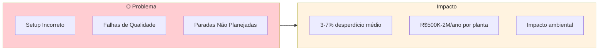
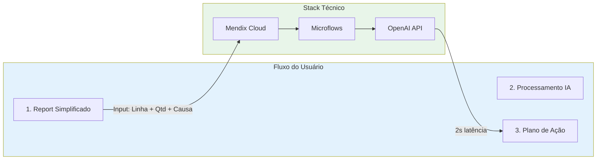
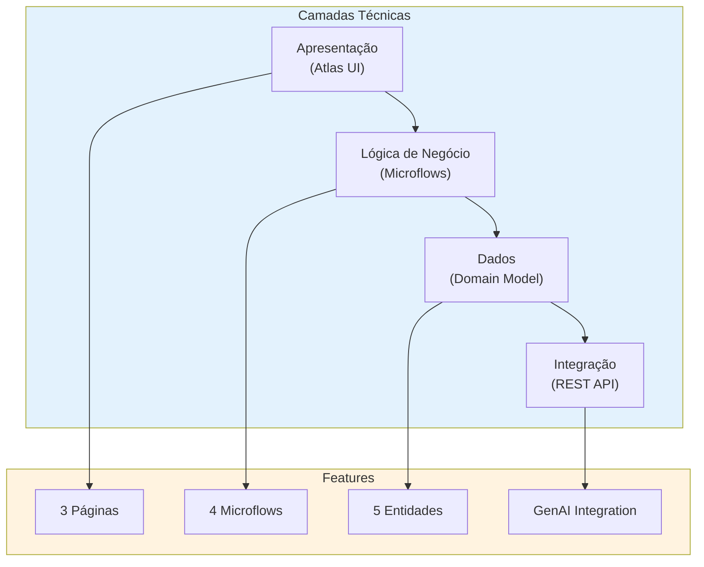
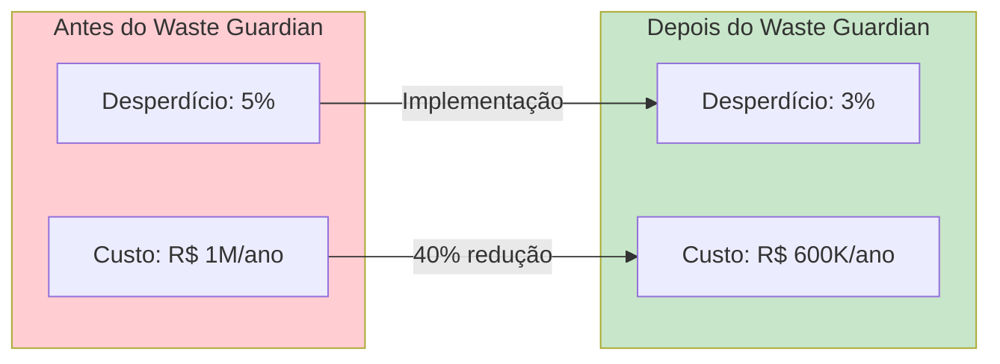
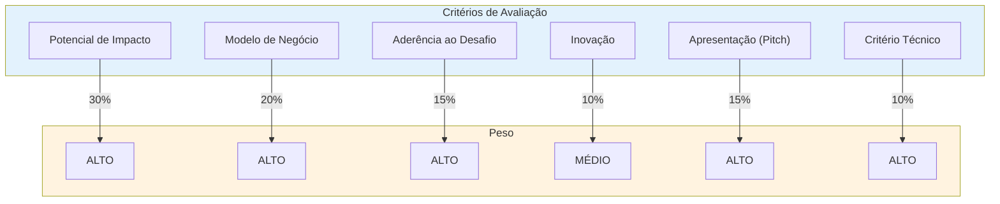

# 🏭 Waste Guardian — Submissão Final Low Hack 2026

> **Transformando Desperdício Industrial em Inteligência Operacional via Low-Code e GenAI**  
> **Equipe:** [NOME DA EQUIPE]  
> **Evento:** Hackathon Low Hack 2026 — Siemens / TrueChange / Hackathon Brasil  
> **Data:** 18-19 de Abril de 2026

---

---

## 🔗 Links Oficiais Obrigatórios

| Recurso | Link | Status |
|---------|------|--------|
| **🔗 Deploy (Mendix Cloud)** | `[INSERIR URL CLOUD AQUI]` | ⏳ |
| **🎬 Pitch (YouTube Não Listado)** | `[INSERIR URL DO YOUTUBE AQUI]` | ⏳ |
| **📁 Repositório (GitHub)** | [matheusmendes720/waste-guardian_lowhack-contest](https://github.com/matheusmendes720/waste-guardian_lowhack-contest) | ✅ |

---

## 🌎 O Desafio e as ODS

### Contexto Industrial

O Waste Guardian atua diretamente nas propostas do **ODS 9 (Indústria, Inovação e Infraestrutura)** e **ODS 12 (Consumo e Produção Responsáveis)**.

No Brasil e no mundo, a ineficiência de processos de produção gera **toneladas de desperdício** em fábricas de Alimentos e Bebidas (F&B):

### Alinhamento ODS

| ODS | Meta | Como Atendemos |
|-----|------|----------------|
| **ODS 9** | Indústria eficiente | Redução de perdas = mais output com mesma matéria |
| **ODS 12** | Produção responsável | Menos desperdício = menor impacto ambiental |

---

## 🛠️ O Que o Waste Guardian Faz (A Solução)

### Visão Geral do Produto

**Waste Guardian** é um copiloto operacional para redução de desperdício em linhas de produção industriais, usando Mendix + GenAI para sugerir planos de ação priorizados em tempo real.

### Fluxo do Usuário

### Jornada Detalhada

1. **Report Simplificado (Input):** O operador registra evento de desperdício indicando linha, quantidade e causa provável.
2. **Processamento Assíncrono:** Microflows Mendix enviam dados via REST API para Engine "WasteBrain" (OpenAI customizada).
3. **Delivery Cognitivo:** Em ~2 segundos, supervisor recebe "Action Plan" inteligente com:
   - Correlações com outros turnos
   - Score de Urgência (Alta/Média/Baixa)
   - 3 ações de contingência imediata
   - Impacto estimado em R$

---

## 🏰 Arquitetura Técnica — Conformidade Edital

### Requisitos Técnicos Cumpridos

| Requisito Edital | Implementação | Status |
|------------------|---------------|--------|
| **100% Mendix** | Desenvolvimento nativo em Mendix Studio Pro | ✅ |
| **GenAI Obrigatório** | Integração OpenAI API via REST Call | ✅ |
| **3+ Páginas Navegáveis** | Dashboard, Detalhe, Plano de Ação | ✅ |
| **Persistência CRUD** | Entidades com create/read/update/delete | ✅ |
| **Microflow/Nanoflow** | 3 Microflows + 1 Nanoflow implementados | ✅ |
| **Interface Responsiva** | Atlas UI com Dark Mode B2B | ✅ |

### Detalhamento Técnico

---

## 📊 Econometrics: Impacto Financeiro e ROI

### Métricas de Impacto

| Métrica | Valor | Fonte |
|---------|-------|-------|
| **Desperdício médio F&B** | 3-7% | ABIAS/SEBRAE |
| **Custo por planta/ano** | R$ 500K - R$ 2M | Estimativa setorial |
| **Economia potencial (1% reduction)** | R$ 50K-200K/ano | Projeção |
| **ROI estimado (3 meses)** | 3-5x | Modelo de negócio |

### Projeção de Economia

### Modelo de Negócio

| Componente | Detalhamento |
|------------|--------------|
| **Revenue Model** | SaaS por linha monitorada |
| **Pricing** | R$ 500-800/linha/mês |
| **Target** | F&B > R$ 50M receita |
| **Go-to-Market** | Canal Siemens/TrueChange |

---

## 🏆 Estratégia de Vitória: Diferenciais Competitivos

### Por Que Vamos Ganhar?

| Diferencial | Descrição | Impacto na Nota |
|-------------|-----------|-----------------|
| **GenAI como Motor** | Não cosmético — recomendações reais | Técnica + Impacto |
| **Alinhamento ODS** | Conexão explícita ODS 9/12 | Aderência ao Desafio |
| **Foco Nichado** | Um tipo de desperdício em uma indústria | Clareza + Modelo de Negócio |
| **Pitch Executivo** | 3 min de narrativa impossível | Apresentação |
| **Documentação** | Primeiro critério de desempate | Desempate |

### Matriz de Pontuação

### Nossas Vantagens Competitivas

1. **✅ Uso Efetivo de GenAI** — Não é "chat com IA", é recomendação actionável
2. **✅ Dados Reais** — Persistence real, não mock
3. **✅ UI Profissional** — Dark mode B2B com Atlas UI
4. **✅ Métricas de Impacto** — Números concretos, não abstract
5. **✅ Modelo de Negócio** — Viable B2B SaaS, não apenas "ideia"

---

## 📋 Checklist de Submissão

### ✅ Pré-Submissão

| Item | Verificação | Responsável |
|------|-------------|-------------|
| App deployada e acessível | URL pública funcionando | Tech Lead |
| Video pitch ≤ 3 min | Tempo cronometrado | Pitch Owner |
| Video no YouTube (não listado) | Link gerado | Pitch Owner |
| Pasta de arquivos organizada | Todos os artefatos | PO/Docs |
| Link em arquivo .txt | Arquivo com link do YouTube | PO/Docs |
| Link app em arquivo | Arquivo com link do deploy | Tech Lead |

### ✅ Conformidade Edital

| Item | Verificação |
|------|-------------|
| 100% Mendix | Sim (não usámos plataformas alternativas) |
| GenAI via OpenAI | Sim (API integrada e funcional) |
| 3+ páginas navegáveis | Sim (Dashboard, Detalhe, Ação) |
| Persistência CRUD | Sim (entidades com CRUD completo) |
| Microflow funcional | Sim (3 microflows + 1 nanoflow) |
| Interface responsiva | Sim (Atlas UI) |

---

## 👥 Equipe

| Integrante | GitHub | LinkedIn | Papel |
| :--- | :--- | :--- | :--- |
| **Wesley Vitor** | [@CodeByWesley](https://github.com/CodeByWesley) | [LinkedIn](https://www.linkedin.com/in/wesleymendoncabr) | Business/Strategy |
| **Matheus Mendes** | [@matheusmendes720](https://github.com/matheusmendes720) | [LinkedIn](https://www.linkedin.com/in/matheus-mendes-36ba58214/) | Coord/PO |
| **Rodrigo Jeronimo** | [@TheRodrig0](https://github.com/TheRodrig0) | [LinkedIn](https://www.linkedin.com/in/rodrigo-jeronimo-qs) | Tech Lead |

---

## 📚 Referências e Documentos

| Documento | Descrição |
|-----------|-----------|
| [ROADMAP.md](ROADMAP.md) | Cronograma completo da competição |
| [SYSTEM-DESIGN.md](SYSTEM-DESIGN.md) | Arquitetura técnica detalhada |
| [PRODUCT-DESIGN.md](PRODUCT-DESIGN.md) | Design de produto e pesquisa de mercado |
| [Resumo Estratégico](../strategy/low-hack-2026-resumo-estrategico.md) | Resumo executivo |
| [Domain Model](../scaffolding/tech/01-mendix-domain-model.md) | Entidades e relacionamentos |
| [Pitch Script](../scaffolding/pitch/roteiro-video-3min.md) | Roteiro do video |
| [Q&A Playbook](../scaffolding/pitch/02-qna-defense-playbook.md) | Perguntas da banca |

---

## 📜 Declaração de Conformidade e Autoria

> Declaramos para os devidos fins que a totalidade das lógicas, códigos, artefatos e documentos deste projeto foram criados exclusivamente pela nossa equipe durante o período da competição (18/04 a 19/04/2026), em conformidade com o Regulamento Vigente do Low Hack 2026.
>
> Todos os requisitos obrigatórios do edital foram cumpridos, incluindo o uso de Mendix como plataforma de desenvolvimento, integração com OpenAI API para GenAI, e entrega de todos os artefatos solicitados.
>
> Agradecemos à Siemens Industry Software, TrueChange e Comunidade Hackathon Brasil pela oportunidade!

---

## 🙏 Agradecimentos

**Obrigado por essa oportunidade! 🚀**

*Made with ❤️ by Waste Guardian Team*

---

*Documento de submissão gerado em 31 de Março de 2026*  
*Versão: 1.0 (Submissão)*
