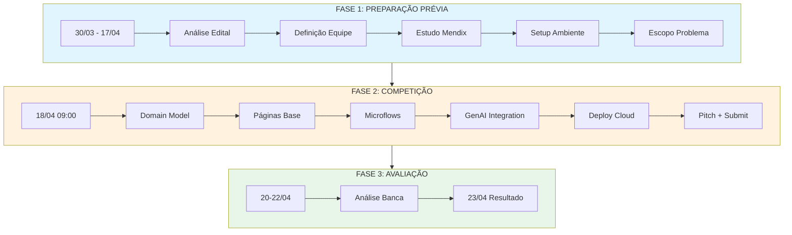
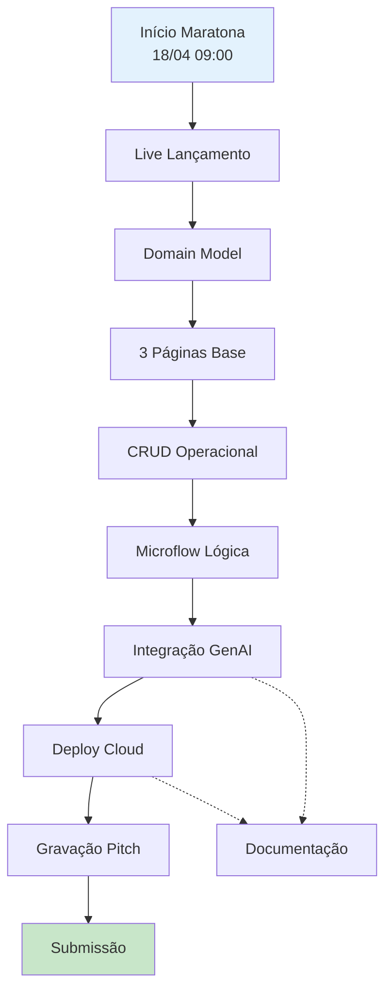
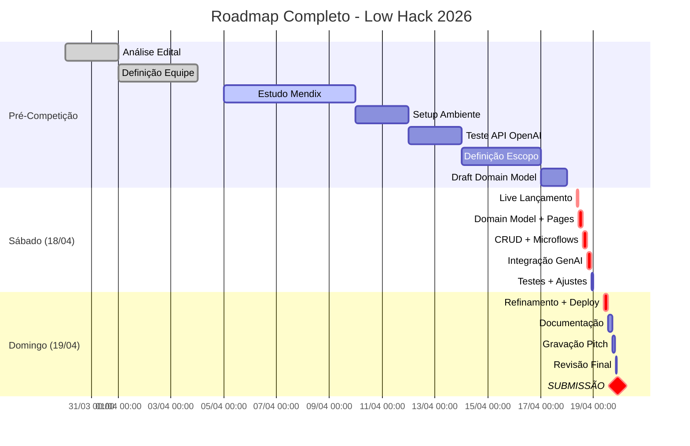

# 🗺️ ROADMAP MAESTRO — Low Hack 2026

> **Documento Maestro de Planejamento Tático-Estratégico**  
> **Evento:** 18-19 de Abril de 2026  
> **Plataforma:** Hackathon Brasil / Siemens Mendix  
> **Status:** 🟢 PREPARAÇÃO EM ANDAMENTO

---

## 1. VISÃO GERAL DO ROADMAP

Este documento apresenta a decomposição completa do edital em fases táticas, com fluxo de dependências entre requisitos, entregas de negócio, passos táticos, unidades de software e deadlines críticos.

---

## 2. CRONOGRAMA OFICIAL (Edital)

| Fase | Data | Evento | Responsabilidade |
|------|------|--------|------------------|
| **Inscrição** | Até 17/04 | Abertura de Inscrições | Equipe |
| **Setup** | 15/04 - 17/04 | Setup de Equipes & Discord | Equipe |
| **Lançamento** | 18/04 09:00 | Live de Lançamento do Desafio | Organização |
| **Desenvolvimento** | 18/04 09:00 - 19/04 21:59 | Janela de 35+ horas | Equipe |
| **Encerramento** | 19/04 21:59 | Deadline de Submissão | Equipe |
| **Avaliação** | 20/04 - 22/04 | Análise pela Banca | Banca |
| **Resultado** | 24/04 | Anúncio de Finalistas | Organização |

---

## 3. DECOMPOSIÇÃO: EDITAL → NEGÓCIO → TÁTICA → SOFTWARE

### 3.1 Matriz de Fluxo de Requisitos

```mermaid
flowchart LR
    subgraph ED["REQUISITOS DO EDITAL"]
        E1["Mendix 100%"]
        E2["GenAI Obrigatório"]
        E3["3+ Páginas Navegáveis"]
        E4["Persistência CRUD"]
        E5["1+ Microflow/Nanoflow"]
        E6["Interface Responsiva"]
        E7["Pitch ≤ 3 min"]
    end
    
    subgraph NG["PREREQUISITOS DE NEGÓCIO"]
        N1["Alinhamento ODS 9/12"]
        N2["Modelo de Negócio"]
        N3["Potencial de Impacto"]
        N4["Inovação"]
    end
    
    subgraph TA["PASSOS TÁTICOS"]
        T1["Setup Mendix"]
        T2["Domain Model"]
        T3["UI/UX Atlas"]
        T4["Integração API"]
        T5["Teste + Deploy"]
        T6["Pitch Gravado"]
    end
    
    subgraph SW["UNIDADES DE SOFTWARE"]
        S1["Entidades DB"]
        S2["3 Páginas"]
        S3["4 Microflows"]
        S4["REST Call"]
        S5["App Cloud"]
        S6["Video MP4"]
    end
    
    ED --> NG --> TA --> SW
    
    style ED fill:#ffcdd2
    style NG fill:#fff9c4
    style TA fill:#b3e5fc
    style SW fill:#c8e6c9
```

### 3.2 Detalhamento por Fase

---

### 📋 FASE 1: PREPARAÇÃO PRÉVIA (30/03 - 17/04)

| Etapa | Requisito Edital | Pré-Requisito Negócio | Passo Tático | Unidade Software | Deadline | Responsável |
|-------|-----------------|----------------------|--------------|------------------|-----------|-------------|
| **1.1** | Análise do Regulamento | Compreensão Total | Leitura integral + extração de requisitos | Checklist de conformidade | 30/03 | PO |
| **1.2** | Definição de Equipe | 3-5 membros, multidisciplinar | Recrutar devs, designer, negócios | Roles definidos | 01/04 | PO |
| **1.3** | Estudo Mendix | Domínio básico da plataforma | Tutoriais + projeto teste | App demo em Mendix | 10/04 | Tech Lead |
| **1.4** | Setup Ambiente | Mendix Studio Pro instalado | Download + login | Ambiente configurado | 10/04 | Tech Lead |
| **1.5** | Teste API OpenAI | Conectividade com API | Script Node.js de teste | Teste de chamada API | 12/04 | AI Lead |
| **1.6** | Definição de Escopo | Problema alinhado ao desafio | Escolha de indústria + desperdício | Recorte definido | 14/04 | PO + Team |
| **1.7** | Draft Domain Model | Entidades Mentalmente | Desenho de entidades + relações | Sketch de DB | 17/04 | Tech Lead |
| **1.8** | Setup Discord | Presença obrigatória | Login no Discord oficial | Acesso confirmado | 17/04 | PO |

---

### ⚔️ FASE 2: MARATONA DE DESENVOLVIMENTO (18-19/04)

#### 🅰️ SÁBADO (18/04)

| Horário | Etapa | Requisito Edital | Passo Tático | Entregável | Status |
|---------|-------|------------------|--------------|------------|--------|
| **09:00-10:00** | 2.1 | Live Lançamento | Participar da live + confirmar briefing | Confirmação presença | ⏳ |
| **10:00-11:00** | 2.2 | Validação Escopo | Revisão final do problema + validação | Escopo aprovado | ⏳ |
| **11:00-12:00** | 2.3 | Domain Model | Criar entidades + atributos no Mendix | Entidades criadas | ⏳ |
| **12:00-14:00** | 2.4 | Pages Base | Criar 3 páginas navegáveis | Páginas base | ⏳ |
| **14:00-16:00** | 2.5 | CRUD Ops | Implementar create/read para entidades | CRUD funcional | ⏳ |
| **16:00-18:00** | 2.6 | Microflow Logic | Implementar lógica de negócio | Microflow 1+ | ⏳ |
| **18:00-20:00** | 2.7 | GenAI Integration | Configurar REST call OpenAI | Call configurado | ⏳ |
| **20:00-22:00** | 2.8 | Prompt Engineering | Testar prompts + ajustar | Prompt ok | ⏳ |

#### 🅱️ DOMINGO (19/04)

| Horário | Etapa | Requisito Edital | Passo Tático | Entregável | Status |
|---------|-------|------------------|--------------|------------|--------|
| **09:00-11:00** | 2.9 | Refinamento | Polir UI/UX + testar funcionalidades | App polida | ⏳ |
| **11:00-13:00** | 2.10 | Persistência | Validar CRUD completo | CRUD validado | ⏳ |
| **13:00-15:00** | 2.11 | Deploy | Publicar na Mendix Cloud | URL pública | ⏳ |
| **15:00-17:00** | 2.12 | Documentação | Criar README + doc técnica | Docs prontos | ⏳ |
| **17:00-19:00** | 2.13 | Pitch Prep | Ensaiar + preparar gravação | Script pronto | ⏳ |
| **19:00-20:30** | 2.14 | Gravação Pitch | Gravar vídeo 3 min | Video gravado | ⏳ |
| **20:30-21:30** | 2.15 | Revisão Final | Revisar video + app | Tudo revisado | ⏳ |
| **21:30-21:59** | 2.16 | Submissão | Entregar pasta completa | SUBMIT ✅ | ⏳ |

---

### 📊 FASE 3: AVALIAÇÃO (20-24/04)

| Data | Atividade | Responsável |
|------|------------|-------------|
| **20-22/04** | Avaliação pela Banca | Banca Julgadora |
| **24/04** | Anúncio de Resultados | Organização |

---

## 4. MATRIZ DE ENTREGAS POR PRIORIDADE

### 4.1 Entregas Críticas (Não funcionam sem)

| # | Entregável | Software Unit | Dependência | Deadline |
|---|------------|---------------|-------------|----------|
| 1 | App Mendix funcionando | 3 páginas + CRUD | 18/04 18:00 | 19/04 13:00 |
| 2 | Integração GenAI operacional | REST call + prompt | 18/04 20:00 | 19/04 11:00 |
| 3 | Link Mendix Cloud acessível | Deploy | 19/04 13:00 | 19/04 15:00 |
| 4 | Video pitch ≤ 3 min | MP4 | Script pronto | 19/04 20:30 |
| 5 | Pasta de entrega completa | zip/folder | Todos itens | 19/04 21:59 |

### 4.2 Entregas de Qualidade (Diferencial Competitivo)

| # | Entregável | Impacto | Deadline |
|---|------------|---------|----------|
| 1 | Documentação técnica completa | 1º critério desempate | 19/04 17:00 |
| 2 | README com screenshots | Clareza para banca | 19/04 17:00 |
| 3 | Interface responsiva | Avaliação técnica | 19/04 11:00 |
| 4 | Microflow adicional com lógica | Avaliação técnica | 19/04 11:00 |

---

## 5. FLUXO DE DEPENDÊNCIAS (CRITICAL PATH)

---

## 6. CHECKLIST DE CONFORMIDADE POR ENTREGA

### 6.1 Pré-Competição (Antes de 18/04)

- [ ] Equipe de 3-5 pessoas definida
- [ ] Mendix Studio Pro instalado e funcionando
- [ ] Conta Mendix Cloud (Free Tier) criada
- [ ] API Key OpenAI obtida
- [ ] Script de teste Node.js funcionando
- [ ] Escopo de problema definido
- [ ] Domain Model esboçado
- [ ] Acesso Discord oficial confirmado

### 6.2 Durante Competição

- [ ] Participação na live de lançamento
- [ ] 3+ páginas navegáveis criadas
- [ ] CRUD funcionando (create, read)
- [ ] Pelo menos 1 microflow funcional
- [ ] Interface responsiva
- [ ] Integração GenAI operacional
- [ ] Deploy na Mendix Cloud funcionando
- [ ] Link acessível publicamente

### 6.3 Entrega Final

- [ ] Video-pitch ≤ 3 minutos
- [ ] Video no YouTube (não listado)
- [ ] Link do video em arquivo .txt
- [ ] Pasta com arquivos do projeto
- [ ] Link da aplicação em arquivo
- [ ] Documentação técnica
- [ ] README com instruções

---

## 7. REFERÊNCIAS CRUZADAS

| Este Documento | Referências |
|---------------|-------------|
| **ROADMAP.md** | [Estratégia](../strategy/INDEX.md) · [Tech](../tech/INDEX.md) · [Pitch](../pitch/INDEX.md) |
| **Decomposição Software** | [Domain Model](../scaffolding/tech/01-mendix-domain-model.md) · [Prompts](../scaffolding/tech/02-genai-prompts.md) |
| **Cronograma Detalhado** | [Playbook Tático](../scaffolding/01-playbook-tatica.md) · [Cronograma de Ataque](../scaffolding/02-cronograma-de-ataque.md) |
| **Entregáveis** | [README Final](../scaffolding/docs/README-final-submission.md) |

---

## 8. RESUMO VISUAL: TIMELINE COMPLETO

---

> **MANTRA DO ROADMAP:** *"Cada hora tem um propósito. Cada entrega tem um dono. O deadline é inegociável."*

---

*Documento gerado em 31 de Março de 2026*  
*Última atualização: 31/03/2026*
