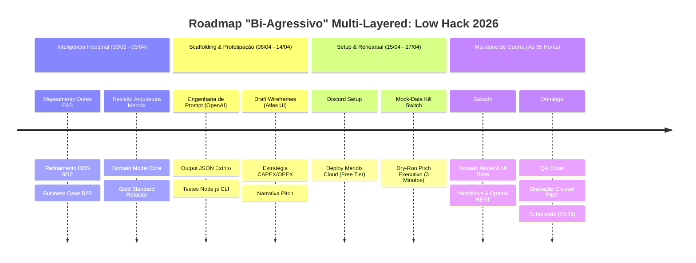

---
tags:
  - hackathon
  - siemens
  - mendix
  - genai
status: in_progress
priority: p1
event_date: "2026"
---

# 🎯 Command Center: Low Hack 2026 (Siemens / Mendix)

> **Resumo:** Painel de controle oficial e Repositório de Inteligência "Overdrive" para o Low Hack 2026. Foco em execução técnica e mitigação de riscos de equipe.

## 📌 Metadados da Competição

- **Plataforma:** Hackathon Brasil / Siemens Mendix
- **Tecnologias Core:** Mendix (Low-Code), OpenAI (GenAI)
- **Desafio/Tese:** *Waste Guardian* - Copiloto ODS 9/12 B2B (F&B Industry).
- **Status Atual:** **PRONTO PARA COMBATE (Gold Standard v1.0)**

---

### 🗓️ Timeline & Milestones Estratégicos

---

## 🔗 Atalhos de Inteligência (Gold Standard)

| Seção | Descrição | Localização |
|-------|-----------|-------------|
| **🏠 HUB Principal** | Índice unificado com acesso rápido | [INDEX.md](INDEX.md) |
| **📜 Regulamento** | Edital, rules e technical boundaries | [00_Regulamento/](00_Regulamento/) |
| **🕵️ Intel OSINT** | Competitive intelligence & sponsor war room | [01_Intel_OSINT/](01_Intel_OSINT/) |
| **⚔️ Estratégia** | Winning tactics, Team Charter, and script | [02_Estrategia_Vencedora/](02_Estrategia_Vencedora/) |
| **🏗️ Arquitetura** | System design, models, and API blueprints | [03_Arquitetura_Projeto/](03_Arquitetura_Projeto/) |
| **💰 BI Ofensivo** | Modelagem econométrica, ROI e Business Case | [04_BI_Ofensivo/](04_BI_Ofensivo/) |
| **📊 Market Intel** | Análise de concorrência e dores F&B | [05_Market_Intelligence/](05_Market_Intelligence/) |

---

## 📄 Documentos por Categoria (Live Update)

#### 🎯 Estratégia & Planejamento
- [**01 - Resumo Executivo**](02_Estrategia_Vencedora/low-hack-2026-resumo-estrategico.md)
- [**02 - Análise Estratégica Completa**](02_Estrategia_Vencedora/low-hack-2026-analise-estrategica-completa.md)
- [**04 - Mega Dossiê Consolidado**](LowHack_2026_Full_Strategy.md)
- [**05 - Master Compendium**](Waste_Guardian_Master_Compendium.md)

#### 🎬 Pitch & Apresentação
- [**Script Final (Refactored)**](02_Estrategia_Vencedora/pitch/script-final-completo.md)
- [**Roteiro 3 min**](02_Estrategia_Vencedora/pitch/roteiro-video-3min.md)
- [**Q&A Defense Playbook**](02_Estrategia_Vencedora/pitch/02-qna-defense-playbook.md)

#### 💻 Tech & Implementação
- [**00 - Mendix Bootcamp Fast-Track**](03_Arquitetura_Projeto/tech/00-mendix-bootcamp-fast-track.md)
- [**01 - Domain Model Mapping**](03_Arquitetura_Projeto/tech/01-mendix-domain-model.md)
- [**02 - GenAI Prompts Engineering**](03_Arquitetura_Projeto/tech/02-genai-prompts.md)
- [**04 - REST API + Microflow Logic**](03_Arquitetura_Projeto/tech/04-rest-api-microflow-logic.md)
- [**05 - Mega Builder Script**](scripts/mega_builder.js)

---

## ✅ Requisitos do Edital (Checklist Inegociável)

- [x] **GenAI Compulsório:** Waste Guardian integra OpenAI REST API no core.
- [x] **Plataforma Exclusiva:** Desenvolvido 100% no Mendix Studio Pro.
- [ ] **Complexidade de Tela:** O App possui 3+ telas navegáveis (Wireframes prontos).
- [ ] **Persistência (CRUD):** Lógica de banco mapeada no Domain Model.
- [ ] **Lógica Mendix Ativa:** Microflows de cálculo mapeados.
- [ ] **Time de Pitch:** Gravação cronometrada de até 3 minutos.

---

> **Mantra:** *"MVP feio funciona. Pitch perfeito comunica. GenAI real impressiona."*
