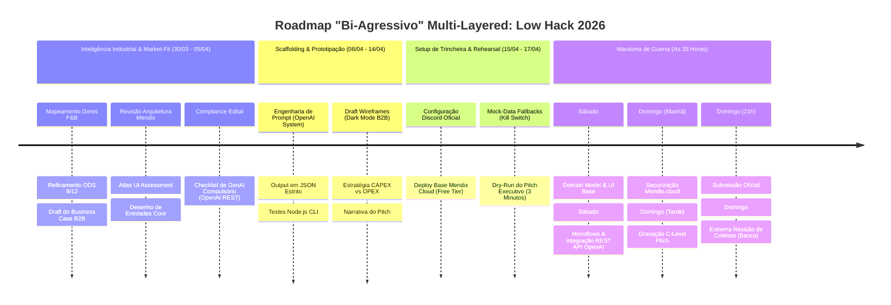
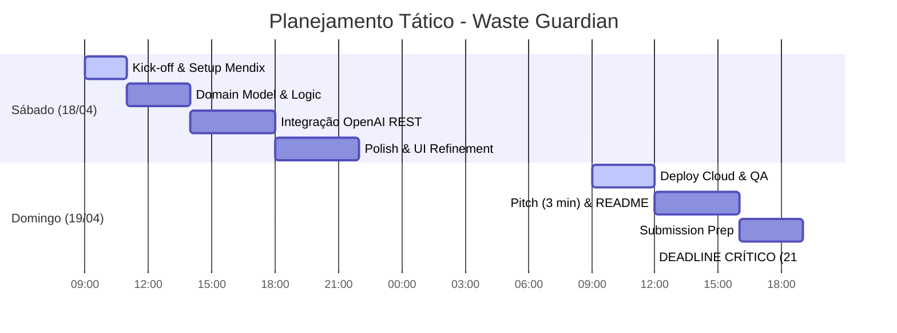

---
tags:
  - hackathon
  - siemens
  - mendix
  - genai
status: in_progress
priority: p1
event_date: "2026"
---

# 🎯 Note Index: Low Hack 2026 (Siemens / Mendix)

> **Resumo:** Painel de controle oficial e Repositório de Inteligência "Overdrive" para o Low Hack 2026.

## 📌 Metadados da Competição

- **Plataforma:** Hackathon Brasil / Siemens Mendix
- **Tecnologias Core:** Mendix (Low-Code), OpenAI (GenAI)
- **Desafio/Tese:** *Waste Guardian* - Copiloto ODS 9/12 B2B (F&B Industry).
- **Status Atual:** **PRONTO PARA COMBATE (Overdrive Phase Complete)**

---

### 🗓️ Timeline & Milestones Estratégicos

Cronometragem tática dividida em fases de inteligência, preparação e execução (18 a 19 de Abril).

#### 📌 Deadlines Oficiais (Edital)

| Evento | Data/Hora | Status |
| :--- | :--- | :--- |
| **Abertura de Inscrições** | Já Aberta | ✅ |
| **Setup de Equipes & Discord** | 15/04 - 17/04 | ⏳ |
| **Lançamento do Desafio (Live)** | 18/04 (09:00) | ⏳ |
| **Encerramento & Submissão** | 19/04 (21:00) | ⏳ |
| **Anúncio de Finalistas** | 22/04 (Previsão) | ⏳ |

#### 📊 Gráfico de Execução (Gantt)

- [x] **Fase 1: Inteligência Estratégica & Business (COMPLETO)**
  - [x] Inscrição garantida no Hackathon Brasil.
  - [x] Compilação do Business Case B2B (Dores Indústria F&B e ODS Siemens).
  - [x] Estabelecer Modelagem Financeira SaaS / ISV Royalties.

- [ ] **Fase 2: Harmonização & Scaffolding (15/04 a 17/04)**
  - [ ] Acessar Discord Oficial (15/04 às 17:00).
  - [ ] Travar Data Model do Mendix e fluxos do Atlas UI.
  - [ ] Consolidar Engenharia de Prompt no System Content da OpenAI.

- [ ] **Fase 3: Maratona Mendix Core (18/04 e 19/04)**
  - [ ] `18/04 09:00 - 14:00`: Estrutura Base Mendix (Domain Model + Telas ATLAS).
  - [ ] `18/04 14:00 - 18:00`: Ponto de Inflexão (Integrar OpenAI REST API).
  - [ ] `19/04 09:00 - 12:00`: Deploy na Mendix Cloud e QA de Dados (Scrubbing).
  - [ ] `19/04 12:00 - 16:00`: Gravação do Pitch Nível Executivo.
  - [ ] `19/04 19:00 - 21:00`: Submissão Oficial.

---

## ✅ Requisitos do Edital (Checklist Inegociável)

Para garantir pontuação integral pela banca técnica Siemens:

- [ ] **GenAI Compulsório:** O App deve usar *obrigatória e efetivamente* IA Generativa (Uso primário no Waste Guardian via API OpenAI).
- [ ] **Plataforma Exclusiva:** 100% desenvolvido usando e rodando no **Mendix (Free Tier Cloud)**. Link deve ser público.
- [ ] **Complexidade Mínima de Tela:** O App deve possuir **três telas navegáveis**.
- [ ] **Persistência de Dados (CRUD):** É preciso ler e salvar dados na base Mendix (Ex: submeter um *Evento Desperdício*, salvar o *Plano da IA*).
- [ ] **Lógica Mendix Ativa:** Pelo menos 1 Microflow ou Nanoflow com lógica implementada rodando no fluxo.
- [ ] **Tempo de Apresentação:** Pitch cronometrado de até **3 Minutos**. Estourar o limite desclassifica ou remove pontos vitais.

---

## 📦 Entrega Final & Checkpoint de Arquivos

Objetivos obrigatórios para submissão oficial:

| Entregável | Formato | Status | Responsável |
| :--- | :--- | :--- | :--- |
| **PWA Mendix (Live Link)** | URL Mendix Cloud | ⏳ | Tech Owner |
| **Pitch Video (3 min)** | YouTube/Vimeo Link | ⏳ | Pitch Owner |
| **Manual de GenAI (Rest API)** | PDF/Markdown | ⏳ | AI Lead |
| **README Strategic Dossiê** | Mendix Project App | ⏳ | PO |

---

## 🔗 Atalhos de Inteligência (Trincheira)

### 📚 Estrutura de Documentos

| Seção | Descrição | Arquivo |
|-------|-----------|---------|
| **🏠 HUB Principal** | Índice unificado com acesso rápido | [INDEX.md](INDEX.md) |
| **📚 Master Docs** | Roadmap + System Design + Product Design | [docs/INDEX.md](docs/INDEX.md) |
| **📊 Strategy** | Análise estratégica completa | [strategy/INDEX.md](strategy/INDEX.md) |
| **💻 Tech** | Guias técnicos (Mendix + GenAI) | [tech/INDEX.md](tech/INDEX.md) |
| **🎬 Pitch** | Roteiros e Q&A | [pitch/INDEX.md](pitch/INDEX.md) |
| **💼 Business** | Modelo de negócio e métricas | [business/INDEX.md](business/INDEX.md) |

---

### 📄 Documentos por Categoria

#### 🎯 Estratégia & Planejamento
- [**00 - Playbook Tático (Mendix Core)**](scaffolding/01-playbook-tatica.md)
- [**01 - Resumo Executivo**](strategy/low-hack-2026-resumo-estrategico.md)
- [**02 - Análise Estratégica Completa**](strategy/low-hack-2026-analise-estrategica-completa.md)
- [**04 - Mega Dossiê Consolidado**](scaffolding/LowHack_2026_Full_Strategy.md)

#### 🎬 Pitch & Apresentação
- [**01 - Roteiro Pitch (3 Minutos)**](scaffolding/pitch/roteiro-video-3min.md)
- [**02 - Q&A Defense Playbook**](scaffolding/pitch/02-qna-defense-playbook.md)

#### 💼 Business & Economia
- [**01 - Business Model Canvas**](scaffolding/business/01-business-model-canvas.md)
- [**02 - Industrial Intelligence**](scaffolding/business/02-industrial-intelligence.md)
- [**03 - Econometria & Sponsor Strategy**](scaffolding/business/03-sponsor-econometrics.md)

#### 💻 Tech & Implementação
- [**00 - Mendix Bootcamp Fast-Track**](scaffolding/tech/00-mendix-bootcamp-fast-track.md)
- [**01 - Domain Model Mendix**](scaffolding/tech/01-mendix-domain-model.md)
- [**02 - GenAI Prompts Engineering**](scaffolding/tech/02-genai-prompts.md)
- [**03 - UI Wireframes (Atlas)**](scaffolding/tech/03-mendix-ui-wireframes.md)
- [**04 - REST API + Microflow Logic**](scaffolding/tech/04-rest-api-microflow-logic.md)
- [**05 - Test OpenAI Script.js**](scaffolding/tech/05-test-openai-script.js)
