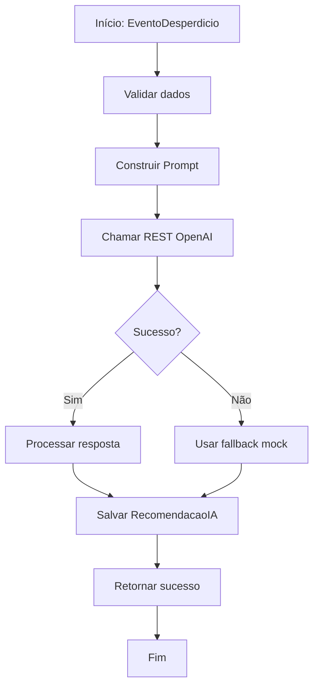

# 🤖 Integração OpenAI API - Guia Prático

> **Objetivo:** Configurar chamada REST para OpenAI no Mendix  
> **Versão:** GPT-4o-mini (mais econômica para hackathon)  
> **Custo Estimado:** ~$0.15 por 1K requests

---

## 🔑 **Setup API Key**

### **1. Obter API Key**
1. Acesse [platform.openai.com](https://platform.openai.com/)
2. Criar conta gratuita (créditos iniciais)
3. Ir para API Keys → Create new secret key
4. Copiar key: `sk-proj-xxxxxxxxxxxxxxxxxxxxxxxx`

### **2. Configurar no Mendix**
```
Mendix Studio Pro → Project Settings → Constants
Nome: OPENAI_API_KEY
Valor: sk-proj-SUA_KEY_AQUI
```

---

## 📡 **Configurar REST Service**

### **1. Criar REST Service**
```
Add-ons → External Services → Add REST Service
Name: OpenAI_GenAI
Documentation: OpenAI GPT-4o-mini Integration
```

### **2. Configuração da Chamada**
```json
{
  "name": "REST_GenerateRecommendation",
  "url": "https://api.openai.com/v1/chat/completions",
  "method": "POST",
  "headers": {
    "Authorization": "Bearer {{OPENAI_API_KEY}}",
    "Content-Type": "application/json"
  },
  "timeout": 30000,
  "retryConfiguration": {
    "maxRetries": 3,
    "retryDelay": 1000
  }
}
```

---

## 🧠 **Prompts Otimizados**

### **System Prompt**
```
Você é um especialista em redução de desperdício industrial na indústria de alimentos e bebidas com 15 anos de experiência. 

Analise os dados do evento de desperdício e gere 3 recomendações práticas e acionáveis, priorizadas por impacto.

Formato de resposta:
1. [ALTA] Recomendação principal - Impacto: R$X.XXX/mês
2. [MÉDIA] Recomendação secundária - Impacto: R$X.XXX/mês  
3. [BAIXA] Recomendação de longo prazo - Impacto: R$X.XXX/mês

Seja específico, prático e considere a realidade da linha de produção.
```

### **User Prompt Template**
```
Analise este evento de desperdício:

Linha de Produção: {linhaProducao}
Data/Hora: {dataHora}
Quantidade Produzida: {quantidadeProduzida} unidades
Quantidade Descartada: {quantidadeDescartada} unidades
Percentual de Desperdício: {percentualDesperdicio}%
Causa Informada: {causa}
Turno: {turno}

Custo médio por unidade: R$50
Capacidade da linha: {capacidadeLinha} unidades/hora

Gere recomendações para reduzir este tipo de desperdício.
```

---

## 🔧 **Microflow de Integração**

### **MF_GerarRecomendacaoOpenAI**


### **Parâmetros do Microflow**
```
Input Parameters:
- EventoDesperdicio (Entity)

Return Type:
- Boolean (sucesso/falha)
- String (mensagem de erro)
```

### **Lógica Principal**
1. **Validação:** Verificar dados obrigatórios
2. **Prompt Building:** Montar string com dados do evento
3. **REST Call:** Invocar OpenAI API
4. **Response Processing:** Parse JSON response
5. **Error Handling:** Fallback para recomendação mock
6. **Persistence:** Salvar entidade RecomendacaoIA

---

## 📝 **Exemplo de Request/Response**

### **Request Body**
```json
{
  "model": "gpt-4o-mini",
  "messages": [
    {
      "role": "system",
      "content": "Você é um especialista em redução de desperdício industrial..."
    },
    {
      "role": "user",
      "content": "Analise este evento de desperdício:\nLinha: Linha 01\nQuantidade Produzida: 1000\nQuantidade Descartada: 80\nCausa: Configuração incorreta da máquina\n..."
    }
  ],
  "max_tokens": 500,
  "temperature": 0.3,
  "top_p": 1
}
```

### **Response Expected**
```json
{
  "choices": [
    {
      "message": {
        "content": "1. [ALTA] Verificar parâmetros de configuração da máquina antes de iniciar produção - Impacto: R$4.000/mês\n2. [MÉDIA] Implementar checklist de setup automático - Impacto: R$2.000/mês\n3. [BAIXA] Treinar equipe em calibração avançada - Impacto: R$500/mês"
      }
    }
  ]
}
```

---

## ⚠️ **Error Handling**

### **Tipos de Erro**
1. **API Key Inválida** → Retornar erro de configuração
2. **Timeout** → Tentar novamente com fallback
3. **Rate Limit** → Usar recomendação mock
4. **Response Parsing Error** → Log e fallback

### **Fallback Strategy**
```javascript
// Se OpenAI falhar, usar regras simples
if (percentualDesperdicio > 0.07) {
    return "ALERTA CRÍTICO: Desperdício acima de 7%. Parar linha e revisar configuração.";
} else if (percentualDesperdicio > 0.05) {
    return "ATENÇÃO: Desperdício elevado. Reduzir velocidade em 10%.";
} else {
    return "Operação normal. Continuar monitoramento.";
}
```

---

## 🧪 **Testes Unitários**

### **Teste 1: API Key Válida**
- Mock response da OpenAI
- Verificar parsing correto
- Validar salvamento da recomendação

### **Teste 2: Fallback**
- Simular falha de API
- Verificar uso de regras mock
- Testar mensagem de erro

### **Teste 3: Performance**
- Medir tempo de resposta
- Testar com múltiplos requests
- Verificar uso de memória

---

## 💰 **Custo Estimado**

### **GPT-4o-mini Pricing**
- Input: ~$0.15 por 1M tokens
- Output: ~$0.60 por 1M tokens
- **Estimativa por request:** ~$0.002

### **Para Hackathon**
- 100 testes = $0.20
- 1000 requests = $2.00
- **Total estimado:** < $5.00

---

## 🚀 **Deploy Considerations**

### **Security**
- Nunca expor API key no frontend
- Usar constants do Mendix
- Implementar rate limiting

### **Performance**
- Cache de recomendações similares
- Batch processing para múltiplos eventos
- Async processing para longas operações

### **Monitoring**
- Log de requests/responses
- Métricas de sucesso/falha
- Alertas para rate limit

---

## 📚 **Recursos Adicionais**

- [OpenAI API Documentation](https://platform.openai.com/docs/api-reference)
- [Mendix REST Services Guide](https://docs.mendix.com/refguide/rest-services/)
- [GPT-4o-mini Specs](https://platform.openai.com/docs/models/gpt-4o-mini)

---

## 🎯 **Quick Start Commands**

```bash
# 1. Testar API key manualmente
curl -X POST https://api.openai.com/v1/chat/completions \
  -H "Authorization: Bearer sk-proj-SUA_KEY" \
  -H "Content-Type: application/json" \
  -d '{"model":"gpt-4o-mini","messages":[{"role":"user","content":"Hello"}]}'

# 2. Verificar limites da conta
curl -X GET https://api.openai.com/v1/usage \
  -H "Authorization: Bearer sk-proj-SUA_KEY"
```

---

*Guia criado para Low Hack 2026 - Waste Guardian*
